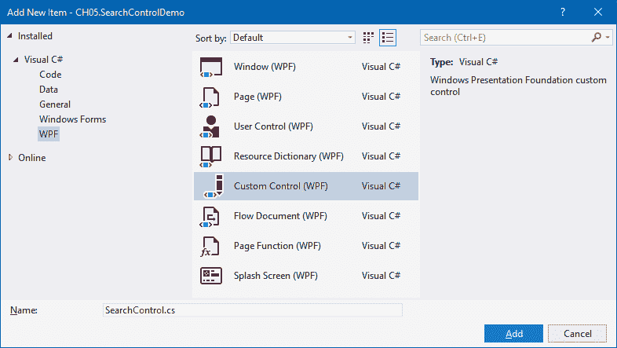

使用自定义控件和用户控件

在本章中，我们将涵盖以下食谱：

+   创建自定义控件

+   自定义自定义控件的模板

+   从自定义控件公开属性

+   从自定义控件公开事件

+   使用行为扩展控件的功能

+   创建用户控件界面

+   从用户控件公开事件

+   自定义 XMLNS 命名空间

# 第六章：简介

自定义控件是一个松散耦合的控件，它在从 `System.Windows.Controls.Control` 类派生的类中定义。根据你的需求，你也可以从不同的自定义控件派生它。


自定义控件的 UI 通常定义在 `resource` 文件中的 **资源字典** 内。我们可以为自定义控件创建主题，并在各种项目中非常容易地重用它们：

通常，**自定义控件**被编译成一个 `dll` 集合，可以非常容易地在多个地方重用。你对它的代码有完全的控制权，因此它为你提供了更多的灵活性来扩展行为。一旦你在项目中构建并添加了对自定义控件的引用，你就可以在 Visual Studio 控件工具箱中找到它，这将允许你将控件拖放到 XAML 设计视图中并开始使用它。

在另一方面，**用户控件**实际上是你为了控制项目特定的 UI 而派生的自定义控件。它从 `System.Windows.Controls.UserControls` 类派生，这个类基本上是从 `System.Windows.Controls.Control` 继承而来的：


通常，用户控件被放置在 XAML 页面中，与它的代码后部分紧密绑定。你可以直接从代码后部访问它的 UI 元素并执行一些特定操作。

一个需要注意的点是你不能为用户控件创建主题支持，但你可以通过为其子控件、自定义控件创建主题来对其样式化。此外，一旦你在某个项目中创建了一个用户控件 UI，你无法在其他项目中更改它。

在本章中，我们将学习如何创建自定义控件和用户控件，然后根据需要对其进行自定义。

# 创建自定义控件

在使用自定义控件之前，你需要知道如何创建自定义控件以及如何将它们添加到任何 XAML 页面。在本教程中，我们将首先学习这些基本操作。

## 准备工作

让我们打开 Visual Studio IDE 并创建一个新的 WPF 应用程序项目，命名为 `CH05.SearchControlDemo`。

## 如何做到这一点...

执行以下步骤以创建你的第一个自定义控件，它将包含一个文本输入框和一个按钮来构建搜索控件。最后，我们将将其添加到应用程序窗口中：

1.  一旦项目创建完成，在项目上右键单击，从解决方案资源管理器中，然后从上下文菜单中选择“添加 | 新项...”。屏幕上将会弹出一个新的对话框窗口。

1.  Inside the Add New Item dialog window, expand the Installed | Visual C# | WPF tree item, from the left navigation panel, and select Custom Control (WPF) from the right screen:



1.  给自定义控件起一个名字（比如说，`SearchControl.cs`）并点击添加以创建它。这将创建一个名为 `SearchControl.cs` 的类文件在项目内部，以及一个包含 `Generic.xaml` 文件的文件夹（命名为 `Themes`）。

1.  打开 `Generic.xaml` 文件，其中将包含为我们创建的自定义控件的 `Style`。这由 Visual Studio IDE 在从默认模板创建自定义控件时自动生成。以下是默认的 `Style`：

```cs
<Style TargetType="{x:Type local:SearchControl}"> 
    <Setter Property="Template"> 
        <Setter.Value> 
            <ControlTemplate TargetType="{x:Type local:  
                              SearchControl}"> 
                <Border Background="{TemplateBinding  
                              Background}" 
                        BorderBrush="{TemplateBinding  
                              BorderBrush}" 
                        BorderThickness="{TemplateBinding  
                              BorderThickness}">                         
                </Border> 
            </ControlTemplate> 
        </Setter.Value> 
    </Setter> 
</Style> 
```

1.  现在将控件的先前 `Style` 替换为以下一个，它包含一个输入框和一个按钮，作为 `Grid` 内部的控件模板：

```cs
<Style TargetType="{x:Type local:SearchControl}"> 
    <Setter Property="Height" Value="26"/> 
    <Setter Property="Width" Value="150"/> 
    <Setter Property="Template"> 
        <Setter.Value> 
            <ControlTemplate TargetType="{x:Type 
             local:SearchControl}"> 
                <Grid> 
                    <Grid.ColumnDefinitions> 
                        <ColumnDefinition Width="*"/> 
                        <ColumnDefinition Width="Auto"/> 
                    </Grid.ColumnDefinitions> 
                    <TextBox x:Name="PART_TextBox" 
                            Grid.Column="0" 
                            Margin="2" 
                            HorizontalAlignment="Stretch" 
                            VerticalAlignment="Stretch"/> 
                    <Button x:Name="PART_Button" 
                            Content="Search" 
                            Grid.Column="1" 
                            Margin="2" Padding="8 2" 
                            HorizontalAlignment="Stretch" 
                            VerticalAlignment="Stretch"/> 
                </Grid> 
            </ControlTemplate> 
        </Setter.Value> 
    </Setter> 
</Style> 
```

1.  现在打开 `MainWindow.xaml` 页面，并添加以下 XMLNS 命名空间：

```cs

7.  Now, inside the default `Grid` panel, add the custom control that we just created, and optionally set its `Height` and `Width` properties:

```

<Grid>

    <controls:SearchControl Height="30"

                            Width="180"/>

</Grid>

```cs

8.  That's all! Our first custom control has been created and added to the `MainWindow` of the application. Let's build and run the application. You will see the following UI on the screen:


We have just added the UI of our custom control here and hence no functionality related to search will work. We will enhance the functionalities in the next recipes.
How it works...
When you first create a custom control in a project, Visual Studio creates a folder named `Themes`, and places a file named `Generic.xaml`. This file contains all the styles and templates of the custom controls, by default. When you add more custom controls inside the same project, the `Generic.xaml` file gets updated with the styles of the new controls.
The property called `TargetType` defines the type of the control for which we are going to create the style. In the preceding example, `<Style TargetType="{x:Type local:SearchControl}">` defines the style of the custom control called `SearchControl`. To change the UI of the control, we need to update the same style.
The `<ControlTemplate TargetType="{x:Type local:SearchControl}">` defines the template of the control, which generally resides inside the `Style`.
The `Setter` properties inside the `Style` define the default value of various properties of the said control. In the preceding example, we have defined the default value of the `Height` and `Width` properties. You can add additional property values.
There's more...
Before going further with the custom controls, you need to learn and understand some other points related to them. Let's discuss them in the following sections.
XMLNS attribute declaration
When the custom control is present within the same project where you are going to use it, you need to add the XMLNS attribute in the following way:

This is the same way we added it in the preceding example. The `clr-namespace` defines the namespace where the controls are available. A single namespace can have one or more controls.
When the custom control is present in a different project to the one where you are going to add it, you need to add the XMLNS attribute in the following way:

Here, the `clr-namespace` defines the namespace of the controls, whereas the `assembly` defines the fully qualified name of the assembly where the control is present.
Default styling
When you create a custom control, all the default properties of its base class, `Control`, gets assigned to it. You can use `TemplateBinding` to bind the data to a specific control. For example, to change the background color of the input box based on the `Background` property set on the control level, you need to create the template binding in the following way:

```

<TextBox x:Name="PART_TextBox"

        Grid.Column="0"

        Margin="2"

        Background="{TemplateBinding Background}"

        HorizontalAlignment="Stretch"

        VerticalAlignment="Stretch"/>

```cs

Now, when you change the color of the control, it will change the color of the said input box. Set a color to the `Background` property of our search control inside the `MainWindow.xaml` and observe the change.
Toolbox integration
When you create a custom control within the same project and/or reference a `dll` containing any custom control, you will be able to utilize the Visual Studio Toolbox to drag and drop the control directly to the XAML/designer view.
After creating the control or adding the control library in a project, you need to build it first. Now, open any XAML page and navigate to the Visual Studio Toolbox. You will be able to find the control, as demonstrated here:

Now you can drag it to the place where you want to add the said control.
Customizing the template of a custom control
The development of a custom control always requires its default template to be changed to give it a proper look and make it ready for theming support. That starts with the customization of the template and its default values.
In this recipe, we will learn how to change the template and use `TemplateBinding` to create a relation with its property values.
Getting ready
To get started, launch Visual Studio, create a project, and add a new custom control in it. For this demonstration, we will be using the existing project, `CH05.SearchControlDemo`, that we created in the previous recipe. So, let's open the project.
How to do it...
As we want to customize the template of the custom control to have a proper template binding, perform the following steps:

1.  Open the `Generic.xaml` file, which is present under the `Themes` folder of the project.
2.  Now, scroll down to the definition of the `ControlTemplate` as we need to customize the look and feel of it.
3.  Search for the `TextBox` control named `PART_TextBox`, and set its `Background`, `BorderBrush`, `BorderThickness`, and `Foreground` properties to have a binding with the control's default properties.
4.  Similarly, set the `Background` and `Foreground` property of the button (`PART_Button`) to the same properties of the control, by using template binding. Here's the complete code of the modified control template:

```

<ControlTemplate TargetType="{x:Type local:SearchControl}">

    <Grid>

        <Grid.ColumnDefinitions>

            <ColumnDefinition Width="*"/>

            <ColumnDefinition Width="Auto"/>

        </Grid.ColumnDefinitions>

        <TextBox x:Name="PART_TextBox"

                Grid.Column="0"

                Margin="2"

                Background="{TemplateBinding Background}"

                BorderBrush="{TemplateBinding

                            BorderBrush}"

                BorderThickness="{TemplateBinding

                                BorderThickness}"

                Foreground="{TemplateBinding Foreground}"

                HorizontalAlignment="Stretch"

                VerticalAlignment="Stretch"/>

        <Button x:Name="PART_Button"

                Content="搜索"

                Grid.Column="1"

                Margin="2" Padding="4 2"

                Background="{TemplateBinding Background}"

                Foreground="{TemplateBinding Foreground}"

                HorizontalAlignment="Stretch"

                VerticalAlignment="Stretch"/>

    </Grid>

</ControlTemplate>

```cs

5.  You can also assign default values to your control templates, by using the `<Setter/>` tag. You will need to add it inside the `<Style/>` definition. To add default values to the `Height`, `Width`, `Background`, `BorderBrush`, `BorderThickness`, and `Foreground` properties, add the following code block inside the `Style` tag:

```

<Setter Property="Height" Value="30"/>

<Setter Property="Width" Value="280"/>

<Setter Property="Background" Value="淡雅蓝"/>

<Setter Property="BorderBrush" Value="浅天蓝色"/>

<Setter Property="BorderThickness" Value="1"/>

<Setter Property="Foreground" Value="海军蓝"/>

```cs

6.  Once done, compile your project and run it. You will see the following screen, where the background of the `TextBox` and `Button` controls are painted with `AliceBlue` color. Similarly, the other styles are applied as per the default values specified:
    

7.  You can override the default style values in your application, where you are using the control. To do this, open the `MainWindow.xaml` file and add a custom `Background` color, `BorderBrush`, `Foreground`, and `BorderThickness` to the control as follows:

```

<Grid>

    <controls:SearchControl

        Background="#2200FF00"

        BorderThickness="2"

        BorderBrush="黄绿色"

        Foreground="绿色"/>

</Grid>

```cs

8.  Now, if you build and run the application, you will notice the UI changed as per the custom value that you specified directly to the control:
    

How it works...
`TemplateBinding` is a type of binding used mainly while working with templates. This allows you to replace the visual tree of controls for a completely fresh look and feel, based on the theme or style that you want to use. It also helps you to reference the parent control, read its properties, and apply its values.
When you apply a template binding to a control, present in the `ControlTemplate` of the parent control, it first checks whether the property is present to the parent control. If it is not present, it throws an XAML syntax error.
If it finds the property, it checks whether the value is supplied from the place where the custom control has been used. If it finds no reference, it applies the default value to the property.
Exposing properties from the custom control
Most of the time, while using custom controls, we need to expose additional properties based on the requirement. In this recipe, we will demonstrate exposing dependency properties from the custom control and binding the record to the UI.
Getting ready
Let's extend our previous project to perform these steps. To get started, launch Visual Studio and open the project `CH05.SearchControlDemo`.
How to do it...
Once the project has been opened, perform the following steps to create a dependency property named `SearchTerm` and bind it with the control UI:

1.  Let's open the `SearchControl.cs` to create a dependency property. Inside the class definition, type `propdp` and press the *TAB* key twice to create the property structure. By default, it generates `MyProperty` of type `int`.
2.  Change the property type from `int` to `string` and press *TAB*.
3.  Rename `MyProperty` to `SearchTerm` and press *TAB* again.
4.  Now change `ownerclass` to `SearchControl` and press *TAB*.
5.  Pass `string.Empty` as the default value to the `PropertyMetaData`.
6.  Once these preceding steps are done, your property is ready to use. Now open the `Generic.xaml` page to create the binding to the UI control.
7.  Inside the template of the control, find the `TextBox` named `PART_TextBox`.

8.  Now, add the `Text` property to it, by using `TemplateBinding`. You will see the dependency property (`SearchTerm`) listed in the XAML IntelliSense, as shown here:


9.  Let's complete the template binding as follows:

```

<TextBox x:Name="PART_TextBox"

        Grid.Column="0"

        Margin="2"

        Text="{TemplateBinding SearchTerm}"

        Background="{TemplateBinding Background}"

        BorderBrush="{TemplateBinding BorderBrush}"

        BorderThickness="{TemplateBinding

                        BorderThickness}"

        Foreground="{TemplateBinding Foreground}"

        HorizontalAlignment="Stretch"

        VerticalAlignment="Stretch"/>

```cs

10.  Now navigate to the `MainWindow.xaml` page and add the `SearchTerm` property to the control that we have already added:
    

11.  Set some sample strings to it:

```

<controls:SearchControl

        SearchTerm="我的搜索词"

        Background="#2200FF00"

        BorderThickness="2"

        BorderBrush="黄绿色"

        Foreground="绿色"/>

```cs

12.  Build the project and run it. You will see that the string that you assigned to the `SearchTerm` property of the control, actually assigned the value to the search `TextBox`:
    

How it works...
Template binding works only with the dependency properties. When you assign a value to the dependency property, it automatically updates the child control where you have created the binding. In our example, when you assign a value to the `SearchTerm` property, it sets the value to the textbox (`PART_TextBox`) control's `Text` property and thus you can see the value provided to it.
Exposing events from a custom control
When you build any custom control, you need to expose additional events, based on the child controls and functionality that you want to expose to the user. In this recipe, we will learn how to expose a custom event from a custom control and perform a specific operation using it.
Getting ready
Let's start with the existing project that we have already used in the previous recipes. Launch the IDE and open the `CH05.SearchControlDemo` project inside Visual Studio.
How to do it...
In this recipe, we will create a public event from the `SearchControl`, so that we can subscribe to the `PART_Button` button event and fetch the user-entered text. To do so, follow perform the following steps:

1.  From Solution Explorer, create a new class named `SearchEventArgs`, inside the project.
2.  Extend the `SearchEventArgs` class from the `EventArgs` and expose a public property (`SearchTerm`) of type `string`. Here's the class implementation:

```

public class SearchEventArgs : EventArgs

{

    public string SearchTerm { get; set; }

}

```cs

3.  Now open the `SearchControl.cs` file. We need to create a delegate and event inside it. Let's add the following inside the class implementation:

```

public delegate void OnSearchClick(object sender,

SearchEventArgs e);

public event OnSearchClick SearchButtonClick;

```cs

4.  The next task is to associate the button click event with the custom event that we have just created. Pass the `SearchTerm` to the custom event as an argument. To do this, copy the following code inside the `SearchControl` class:

```

public override void OnApplyTemplate()

{

    base.OnApplyTemplate();

    if (GetTemplateChild("PART_Button") is Button

    searchButton)

    {

        searchButton.Click +=

                    OnSearchButtonClicked_Internal;

    }

}

private void OnSearchButtonClicked_Internal(object sender,

RoutedEventArgs e)

{

    SearchButtonClick?.Invoke(this, new SearchEventArgs {

    SearchTerm = SearchTerm });

}

```cs

5.  Open the `Generic.xaml` page and perform a slight change to the `Text` property binding of the search `TextBox`. Instead of template binding, let's perform a normal data binding, passing a relative source to it. As we need to take input from the user, we will set the binding mode to `TwoWay`. Here's the XAML code:

```

<TextBox x:Name="PART_TextBox"

        Grid.Column="0"

        Margin="2"

        Text="{Binding SearchTerm, RelativeSource={RelativeSource TemplatedParent}, Mode=TwoWay}"

        }

        BorderBrush="{TemplateBinding BorderBrush}"

        BorderThickness="{TemplateBinding BorderBrush}"

                        BorderThickness}"

        Foreground="{TemplateBinding Foreground}"

        HorizontalAlignment="Stretch"

        VerticalAlignment="Stretch"/>

```cs

6.  Once this is done, open the `MainWindow.xaml` and register the `SearchButtonClick` event of the `SearchControl`:

```

<controls:SearchControl

        SearchTerm="my search term"

        Background="#2200FF00"

        BorderThickness="2"

        BorderBrush="GreenYellow"

        Foreground="Green"

        SearchButtonClick="OnSearchButtonClicked"/>

```cs

7.  Open the code behind `MainWindow.xaml.cs` and modify the event implementation to show a message box to the user, with the text that we passed as a search term. You can find it as `e.SearchTerm`, as passed to the event argument. Here's the code for your reference:

```

private void OnSearchButtonClicked(object sender,

SearchEventArgs e)

{

    MessageBox.Show("您搜索了: " +

    e.SearchTerm + """);

}

```cs

8.  That's all! Let's build the application and run it. As we already have a default value set to the control, click on the Search button. You will see a message box with the default search term. Now, change the value to have a different search term. To do so, click on the `TextBox` control and replace the string. Now, click on the Search button once again, which will show the new search term inside the message box. Here's a screenshot of the same operation:


How it works...
When the application loads with the control on the UI, the first thing that it does is to load its defined template and call the `OnApplyTemplate()` method. `OnApplyTemplate()` is a virtual method present inside the `System.Windows.FrameworkElement` class, which gets invoked when application code or internal processes call the `System.Windows.FrameworkElement.ApplyTemplate()`.
As you can see in the `OnApplyTemplate()` method implementation, it finds out the template child named `PART_Button` using the `GetTemplateChild` method call, and registers its associated `Click` event:

```

public override void OnApplyTemplate()

{

    base.OnApplyTemplate();

    if (GetTemplateChild("PART_Button") is Button searchButton)

    {

        searchButton.Click += OnSearchButtonClicked_Internal;

    }

}

```cs

The `Click` event then invokes the custom event (`SearchButtonClick`), passing the `SearchTerm` as `SearchEventArgs`. Now, when you click on the button in the application UI, it fires the `OnSearchButtonClicked_Internal` event and bubbles up to the application UI. The `OnSearchButtonClicked` event handler then triggers due to its subscription to the custom event and performs the operation. In our case, it shows a message to the user with the search term passed to the search box.
Extending the functionality of a control using behavior
**Behavior** is a concept to extend the functionality of a control using a reusable component. These components can be attached to any control or a specific type of control to provide designers with the flexibility to design complex user interactions without writing any additional code.
In this recipe, we will learn how to create a behavior and the way to apply it to a control without writing extra code in the code-behind file.
Getting ready
To get started, we need to open the Visual Studio IDE. Create a new project called `CH05.ControlBehaviorDemo`, based on the WPF application template.
How to do it...
Let's start by creating a component which will add a Size Grow effect to a `TextBlock` control when hovering over with the mouse cursor. To do this, perform the following steps:

1.  To create and/or use behaviors in an application, you will need to set up the project to have a reference to the `System.Windows.Interactivity.dll` assembly file. To do this, right-click on the project and click Add | Reference... from the context menu.
2.  From the Reference Manager dialog, search for `interactivity` to find the System.Windows.Interactivity assembly in the list of assemblies. Select the latest version, as shown in the following screenshot, and click OK. Make sure you verify the added reference in the project:


3.  Now open the `MainWindow.xaml` page and add a `TextBlock` control inside the default `Grid`. Assign a string to its `Text` property:

```

<Grid>

    <TextBlock Text="悬停以增大大小！"

            HorizontalAlignment="Center"

            VerticalAlignment="Center">

    </TextBlock>

</Grid>

```cs

4.  If you run the application now, it will have a text in the window. Hovering your mouse on top of that will not have any effect. For that, we need to create the behavior and register it with the `TextBlock` control.
5.  Let's create a new class, called `GrowTextBehavior`, inside the project.
6.  Mark the class as `public` and extend it from the `Behavior` class. As we are going to create this component for `TextBlock` control, we will extend the class from `Behavior<TextBlock>`, as shown here:

```

public class GrowTextBehavior : Behavior<TextBlock>

```cs

7.  You will need to add the `System.Windows.Interactivity` namespace as a `using` statement to resolve the class declaration. Alternatively, you can resolve the namespace by clicking the light bulb and selecting using System.Windows.Interactivity;, as shown in the following screenshot:


8.  Add a `public` property inside the class to take dynamic input of the size to grow by. Give it a name:

```

public int GrowBySize { get; set; }

```cs

9.  Now, inside the class, type `override` and enter a space. From the list of overridable methods, select `OnAttached` and hit the *Enter* key. This will override the `OnAttached()` method inside the class.

10.  Similarly, override the method `OnDetaching()` inside the class.
11.  Inside `OnAttached()`, register the `MouseEnter` and `MouseLeave` events for the associated object, which is a `TextBlock` in our case. Similarly, inside the `OnDetaching()`, unregister the preceding two events. Here's the code that you may like to take as reference:

```

protected override void OnAttached()

{

    base.OnAttached();

    AssociatedObject.MouseEnter +=

                    AssociatedObject_MouseEnter;

    AssociatedObject.MouseLeave +=

                    AssociatedObject_MouseLeave;

}

protected override void OnDetaching()

{

    base.OnDetaching();

    AssociatedObject.MouseEnter -=

                    AssociatedObject_MouseEnter;

    AssociatedObject.MouseLeave -=

                    AssociatedObject_MouseLeave;

}

```cs

12.  Now it's time to write our logic to grow and shrink the size of the associated `TextBlock` control on mouse over and mouse leave events, respectively. To do so, add the following code block inside the class:

```

private void AssociatedObject_MouseLeave(object sender,

MouseEventArgs e)

{

    AssociatedObject.FontSize -= GrowBySize;

}

private void AssociatedObject_MouseEnter(object sender,

MouseEventArgs e)

{

    AssociatedObject.FontSize += GrowBySize;

}

```cs

13.  That ends the implementation of the behavior component for our `TextBlock` control. Now it's time to register it with the control in the UI. To do so, open the `MainWindow.xaml` again and add the following XMLNS namespace declaration:

14.  Now modify the `TextBlock` control to register the association with the behavior component that we created. Replace the existing markup with the following:

```

<Grid>

    <TextBlock Text="悬停以增大大小！"

            HorizontalAlignment="Center"

            VerticalAlignment="Center">

        <i:Interaction.Behaviors>

            <b:GrowTextBehavior GrowBySize="10"/>

        </i:Interaction.Behaviors>

    </TextBlock>

</Grid>

```cs

15.  Let's build the application and run it. You will see a text message in the application window. Hover over it to see the growing effect on its size:


16.  Take your mouse away from the text to see how it moves back to the original state.

How it works...
The property, `AssociatedObject`, returns the object to which the `System.Windows.Interactivity.Behavior` is attached. In our case, it's the `TextBlock` control passed as `Behavior` of type `T` (`Behavior<TextBlock>`), which is associated in the XAML code block, as mentioned here:

```

<TextBlock Text="悬停以增大大小！"

        HorizontalAlignment="Center"

        VerticalAlignment="Center">

    <i:Interaction.Behaviors>

        <b:GrowTextBehavior GrowBySize="10"/>

    </i:Interaction.Behaviors>

</TextBlock>

```cs

When the association happens between the control and the component, it registers the two events (`MouseEnter` and `MouseLeave`) in our example. Now, when you hover over the mouse on top of the `TextBlock`, it gets the dynamic association of the events and triggers them. This way, it gets notification of the event and performs based on the logic specified.
You can now associate this behavior to any number of controls of type `TextBlock`, without writing additional code behind. The XAML designers can easily pick and associate it with the controls that they want to provide a grow effect on mouse hover.
If you want to associate the behavior to any control, you need to extend it from `Behavior`, instead of `Behavior<TextBlock>`. Similarly, to change the type to any other specific control (let's say, `Label`), change the `T` to `Label` as shown here—`Behavior<Label>`.
Creating a User Control interface
Typically, a User Control is a group of elements and controls joined together to create a reusable component. This is often used to show the same UI in multiple places, either on the same window or in a different window.
In this recipe, we will learn how to create a User Control interface with all its typical features.
Getting ready
Get started by creating a new project. Open the Visual Studio IDE and create a new project based on the WPF application template. Name it `CH05.UserControlDemo`.
How to do it...
To demonstrate the complete use of User Control, we will be creating a color mixer control, exposing some properties from it and binding data using converters. Perform the following simple steps:

1.  Once the project has been created, add a new User Control element inside the project. To do this, right-click on the project and select Add | User Control... from the context menu entry.
2.  From the Add New Item dialog, select User Control (WPF) as the template to create a blank User Control. Name the control `ColorMixer`. Click on the Add button to create a User Control file called `ColorMixer.xaml`:


3.  Once the User Control has been created, open the code-behind file (`ColorMixer.xaml.cs`) and add a property `SelectedColor` of type `Color` inside it. Give it a default color (let's say, `Colors.OrangeRed`):

```

public Color SelectedColor

{

    get { return (Color)GetValue(SelectedColorProperty); }

    set { SetValue(SelectedColorProperty, value); }

}

public static readonly DependencyProperty

    SelectedColorProperty =

    DependencyProperty.Register("SelectedColor",

    typeof(Color), typeof(ColorMixer),

    new PropertyMetadata(Colors.OrangeRed));

```cs

4.  Let's open the `ColorMixer.xaml` file to provide a UI to the control. We will be adding four `TextBox` controls to assign the color in RGB mode (Red, Green, Blue, and Alpha) and a `Border` to show the output from the RGB mixer.
5.  First, give the User Control a name, so that we can easily set its `DataContext` to access its code-behind properties. To do this, add the attribute `x:Name="userControl"` to the `UserControl` tag.
6.  Set the `DataContext` of the `Grid` to have an element binding. Add the following attribute inside the `Grid` tag:

```

DataContext="{Binding ElementName=userControl}"

```cs

7.  Now let's divide the default `Grid` panel into a few rows and columns. Copy the following row and column definitions inside the `Grid` tag to create the structure:

```

<Grid.RowDefinitions>

    <RowDefinition Height="*"/>

    <RowDefinition Height="Auto"/>

</Grid.RowDefinitions>

<Grid.ColumnDefinitions>

    <ColumnDefinition Width="*"/>

    <ColumnDefinition Width="Auto"/>

</Grid.ColumnDefinitions>

```cs

8.  Now it's time to add the controls inside the `Grid` to create the UI layout of our User Control. Add a `Border` at the first cell of the `Grid` and bind its `Background` property with the `SelectedColor` property of the User Control that we have created:

```

<Border BorderThickness="1" BorderBrush="Gray"

        Grid.Row="0" Grid.Column="0">

    <Border.Background>

        <SolidColorBrush Color="{Binding SelectedColor}"/>

    </Border.Background>

</Border>

```cs

9.  Now add a `StackPanel` inside the second cell of the `Grid`, which is `Row=0`, `Column=1`. Add four `TextBox` controls and their associated labels inside the panel. Here's the XAML block, which you can copy and place just after the `Border` control:

```

<StackPanel Orientation="Vertical"

            Grid.Row="0" Grid.Column="1"

            Margin="8 4">

    <TextBlock Text="R:"/>

    <TextBox Width="100" />

    <TextBlock Text="G:"/>

    <TextBox Width="100" />

    <TextBlock Text="B:"/>

    <TextBox Width="100" />

    <TextBlock Text="A:"/>

    <TextBox Width="100" />

</StackPanel>

```cs

10.  As the basic UI design is ready, let's place the User Control inside the application window. Open `MainWindow.xaml` and add the following XMLNS attribute to the `Window` tag:

11.  Now replace the default `Grid` panel with a `StackPanel`, so that we can place multiple controls in a stack.

12.  Place `<local:ColorMixer />` inside the `StackPanel` and run the application. You will see the following UI on the screen:


13.  The main advantage of a User Control is its ease of use. Creating many instances of it is easy, and there is full design-time support in Visual Studio. Similar to the preceding point, if you place multiple controls of the `ColorMixer` instance inside the `StackPanel`, you will see multiple copies in the UI. Let's not do it, but if you want to try, replace the entire `StackPanel` with the following code block and check out how it places the controls:

```

<StackPanel Orientation="Horizontal"

Margin="4">

    <local:ColorMixer />

    <local:ColorMixer />

</StackPanel>

```cs

14.  Now let's add the bindings to the `TextBox` controls with the `SelectedColor` property. As the type of the property is `Color`, we will need to create a value converter. So, right-click on the project and add a class by following the context menu path Add | Class...,   name it `ColorToByteConverter`, and hit OK.
15.  As we need to access the class from the XAML, we will need to mark it as `public`.

16.  Now inherit the class from `IValueConverter`, to make it a value converter. Click on the lightbulb icon, as shown in the following screenshot, and resolve the namespace. Alternatively, you can add the `using` statement to resolve the `System.Windows.Data` namespace:


17.  Now click on the light bulb again and implement the interface. It will add two methods, called `Convert` and `ConvertBack`, inside the class, as shown in the following screenshot:


18.  Replace the `Convert` method with the following code block, which will break the specified color into an RGBA byte value:

```

public object Convert(object value,

                    Type targetType,

                    object parameter,

                    CultureInfo culture)

{

    if (value is Color color &&

    parameter is string parameterValue) //C# 7.x syntax

    {

        oldColor = color;

        switch (parameterValue)

        {

            case "r":

                return color.R;

            case "g":

                return color.G;

            case "b":

                return color.B;

            default:

                return color.A;

        }

    }

    return value;

}

```cs

19.  Similarly, replace the `ConvertBack` method to construct the `Color` object from the RGBA values, which you can enter by the `TextBox.Text` property:

```

public object ConvertBack(object value,

                        Type targetType,

                        object parameter,

                        CultureInfo culture)

{

    var color = oldColor;

    var colorValue = System.Convert.ToByte(value);

    if (parameter is string parameterValue) //C# 7.x syntax

    {

        switch (parameterValue)

        {

            case "r":

                color.R = (byte)colorValue;

                break;

            case "g":

                color.G = (byte)colorValue;

                break;

            case "b":

                color.B = (byte)colorValue;

                break;

            default:

                color.A = (byte)colorValue;

                break;

        }

    }

    oldColor = color;

    return color;

}

```cs

20.  Once this is done, open the `ColorMixer.xaml` file and add the following XMLNS attribute under the `UserControl` tag:

21.  Now create a `<UserControl.Resources>` tag inside the `UserControl` element and register the value converter as a resource. Here's the code that you can copy inside the `UserControl` tag:

```

<UserControl.Resources>

    <local:ColorToByteConverter

        x:Key="ColorToByteConverter"/>

</UserControl.Resources>

```cs

22.  Let's modify the `Text` property of all the four `TextBox` controls to have a `TwoWay` data binding with the `SelectedColor` property, and associate them with the converter that we have added. Pass the proper parameter to the converter, as `ConverterParameter`, as mentioned in the following code. You can copy the following code and replace the existing `StackPanel`:

```

<StackPanel Orientation="Vertical"

            Grid.Row="0" Grid.Column="1"

            Margin="8 4">

    <TextBlock Text="R:"/>

    <TextBox Width="100"

            Text="{Binding SelectedColor, Converter={StaticResource ColorToByteConverter}, ConverterParameter=r, Mode=TwoWay}"/>

    <TextBlock Text="G:"/>

    <TextBox Width="100"

            Text="{Binding SelectedColor, Converter={StaticResource ColorToByteConverter}, ConverterParameter=g, Mode=TwoWay}"/>

    <TextBlock Text="B:"/>

    <TextBox Width="100"

            Text="{Binding SelectedColor, Converter={StaticResource ColorToByteConverter}, ConverterParameter=b, Mode=TwoWay}"/>

    <TextBlock Text="A:"/>

    <TextBox Width="100"

            Text="{Binding SelectedColor, Converter={StaticResource ColorToByteConverter}, ConverterParameter=a, Mode=TwoWay}"/>

</StackPanel>

```cs

23.  At the end, build the project and run the application. You will see the following UI on the screen, where the rectangular `Border` control has an `OrangeRed` background and the associated `TextBox` control has the RGBA byte value of the color:
    

24.  Now modify the values of the `TextBox` controls to have a range (`0`–`255`) between `0` to `255` and press *TAB* to reflect the change in the UI. Let's replace the values, Red by `120`, Green by `75`, Blue by `200`, and Alpha by `77`, as shown in the following screenshot, which will result in a light violet background color for the `Border` control:
    

How it works...
A User Control wraps the UI with appropriate properties and events to make it a reusable component. In this User Control, named `ColorMixer`, we created a dependency property called `SelectedColor` of type `Color`.  The user (the developer or the designer) can also set a default value to it, by accessing the property, while adding it to the application UI.
The `Text` property of the `TextBox` controls, inside the `ColorMixer.xaml`, is bound with the `SelectedColor` property. As the types of `Text` and `SelectedColor` properties are different, we required the value converter here.
`ConverterParameter` is used to define whether we need to break the R, G, B, or A value of the color composition. The `Convert` method of the converter class breaks the color according to the parameter and returns, which gets displayed in the appropriate `TextBox` control:

```

switch (parameterValue)

{

    case "r":

        return color.R;

    case "g":

        return color.G;

    case "b":

        return color.B;

    default:

        return color.A;

}

```cs

Similarly, when you modify the value in the `TextBox`, due to its `TwoWay` binding mode, the `ConvertBack` method of the converter triggers. This constructs the color object based on the values available in all the `TextBox` controls and returns, which gets filled in the `SelectedColor` property and reflects in the `Background` property of the `Border` control.
Exposing events from a User Control
In the previous recipe, we learned about User Control, how to create it, and how to expose a dependency property and utilize it. In this recipe, we will learn how to expose events from a User Control, as you will need it in most cases.
Getting ready
Let's open the same project, `CH05.UserControlDemo`, inside the Visual Studio to proceed with this recipe.
How to do it...
To demonstrate the usage of the event, we will add two buttons inside our `ColorMixer` User Control and expose the `OK` and `Cancel` button events from it. To implement the same, perform the following steps:

1.  Open the `ColorMixer.xaml` file and add the following `StackPanel` inside the `Grid`, which will place it at row index `1` and column index `0`. The panel consists of two buttons with labels `OK` and `Cancel:`

```

<StackPanel Orientation="Horizontal"

            Grid.Row="1" Grid.Column="0"

            Grid.ColumnSpan="2"

            Margin="4 10 4 4"

            HorizontalAlignment="Right">

    <Button Content="OK" Margin="4"

            Width="50" Click="OnOkClicked"/>

    <Button Content="Cancel" Margin="4"

            Width="50" Click="OnCancelClicked"/>

</StackPanel>

```cs

2.  Open the `ColorMixer.xaml.cs` file and register the button click events (`OnOkClicked` and `OnCancelClicked`) inside it.
3.  Inside the `ColorMixer` class, register the following two delegates and events to handle the OK and Cancel button events from outside the control:

```

public delegate void OnOkButtonClick(object sender,

EventArgs e);

public delegate void OnCancelButtonClick(object sender,

EventArgs e);

public event OnOkButtonClick OkButtonClick;

public event OnCancelButtonClick CancelButtonClick;

```cs

4.  Now update the `OK` button and the `Cancel` button event handlers to route the event to the place where the control has been used. Here's the code to replace the button click event implementations:

```

private void OnOkClicked(object sender, RoutedEventArgs e)

{

    OkButtonClick?.Invoke(sender, e);

}

private void OnCancelClicked(object sender, RoutedEventArgs e)

{

    CancelButtonClick?.Invoke(sender, e);

}

```cs

5.  To register the associated events, in the application window, open the `MainWindow.xaml` file and register the `OkButtonClick` and `CancelButtonClick` events as follows:

```

<local:ColorMixer OkButtonClick="OnOkClicked"

                CancelButtonClick="OnCancelClicked"/>

```cs

6.  Navigate to the `MainWindow.xaml.cs` file to implement the associated event handlers. As shared in the following code, show a message box to the UI from the event implementation:

```

private void OnOkClicked(object sender, EventArgs e)

{

    MessageBox.Show("确定按钮点击");

}

private void OnCancelClicked(object sender, EventArgs e)

{

    MessageBox.Show("取消按钮点击");

}

```cs

7.  Let's compile the project and run the application. You will see two buttons on the UI. Click on the OK and Cancel buttons to see the output:


How it works...
When you hit the OK button in the application window, it triggers the event associated with the button click. In our case, it's the `OnOkClicked` event, inside the `ColorMixer` class. It then routes the event to the custom event `OkButtonClick`, which gets caught in the originating place. It's the `OnOkClicked` event listener in our `MainWindow.xaml`.
Similarly, when you click on the Cancel button, it raises the `Click` event inside the `ColorMixer` class and then routes to the `MainWindow`. If the association is present, it gets called. In our case, it's the `OnCancelClicked` handler in `MainWindow` which triggers the message box.
Customizing the XMLNS namespace
XAML namespace is an extension of XML namespace and conventionally written as `xmlns` in XAML pages. It is used in all the XAML-related technologies to refer to the assemblies and/or namespaces within the XAML page.
Till now, we have seen how to add the XMLNS attribute entry in XAML to refer to custom controls, User Controls, converters, behaviors, and so on, but all that used an assembly/namespace system to define the entry.
For local declaration, we use the `clr-namespace:[namespace]` format, as shown in the following code:

For declarations from a different assembly, we use the `clr-namespace:[namespace];assembly=[assembly]` format, as shown in the following code:

In this recipe, we will learn how to customize the namespace to give a URL representation.
Getting ready
Let's get started by creating a project called `CH05.NamespaceCustomizationDemo`. In this example, you can either choose a WPF application template or a WPF class library template.
How to do it...
Perform the following steps steps to proceed:

1.  Let's create two folders, called `Behaviors` and `Converters`, inside the project.
2.  Now create one or more behaviors and converters in the respective folders. These will have `CH05.NamespaceCustomizationDemo.Behaviors` and `CH05.NamespaceCustomizationDemo.Converters` as the namespace for all the behaviors and converters in the respective modules.
3.  To create the URL schema for the namespace representation, open the `AssemblyInfo.cs` file present in the `Properties` folder of each project.
4.  Now, to create the schema to represent the namespace of the behaviors (`CH05.NamespaceCustomizationDemo.Behaviors`), let's add the following inside the file:

```

[assembly: XmlnsPrefix("http://schemas.kunal-chowdhury.com/xaml/behaviors", "behaviors")]

[assembly: XmlnsDefinition("http://schemas.kunal-chowdhury.com/xaml/behaviors", "CH05.NamespaceCustomizationDemo.Behaviors")]

```cs

5.  Similarly, to define the URL schema for the converters (`CH05.NamespaceCustomizationDemo.Behaviors`), add the following inside the same file:

```

[assembly: XmlnsPrefix("http://schemas.kunal-chowdhury.com/xaml/converters", "converters")]

[assembly: XmlnsDefinition("http://schemas.kunal-chowdhury.com/xaml/converters", "CH05.NamespaceCustomizationDemo.Converters")]

```cs

6.  Navigate to the `MainWindow.xaml` file. To add the XMLNS declaration, you can write ``  instead of `.` ``
7.  It is a similar case for all the declarations that you have made in the `AssemblyInfo.cs` file to represent the namespace as a URL schema.

How it works...
The `XmlnsPrefix` attribute defines the prefix name that you suggest using in the XAML, while declaring the module namespace. Though it is optional to use the same prefix name,  while using the Visual Studio IntelliSense, it automatically adds it.
When you define the XML namespace as URL format, it has multiple benefits over the traditional representation:

*   If you follow the same structure, it is easy to remember.
*   When you are using custom libraries, you don't have to write the complete namespace and assembly every time in each file. Thus, uses of ``  can be reduced to `.` ``
*   You can define the prefix, so that you can follow the same convention in all the files while defining the XMLNS attribute.

```
