使用样式、模板和触发器

在本章中，我们将涵盖以下菜谱：

+   创建控制的 `Style`

+   基于另一个 `Style` 创建控制的 `Style`

+   自动应用 `Style` 到控件

+   编辑任何控件的模板

+   创建属性触发器

+   创建多触发器

+   创建数据触发器

+   创建多数据触发器

+   创建事件触发器

# 简介

当为应用程序设计用户界面时，你需要确保控件在应用程序中的外观和感觉的一致性。例如，如果你正在使用按钮，它们应该看起来相同——相似的颜色、相同的边距等等。

**样式** 是包含 `Setter` 属性的对象，为元素和控件提供一系列设置。样式还提供控件模板，用于自定义控件模板以具有独特的外观和感觉。

在 Win32/WinForms 模型中，控件的外观和行为是紧密捆绑的；但在 WPF 世界中，控件模板是通过使用面向设计师的工具在 XAML 中创建的，并且这应用于样式以产生类似的外观。你也可以从不同的样式中继承样式。

在本章中，我们将讨论样式、模板、触发器以及它们与所应用控件的关联。

# 创建控制样式

样式为你提供了一个方便的方法，可以在单个对象内分组一组属性和触发器，并将其应用到元素上。你可以选择性地将其应用到一组控件，或者根据控件类型自动将其应用到所有控件。

在这个菜谱中，我们将从按钮的默认样式开始，设置其各种样式属性以赋予它新的外观。然后我们将选择性地应用它以设置多个按钮控件的样式。

## 准备工作

让我们从创建一个名为 `CH06.ControlStyleDemo` 的新项目开始。确保你基于 WPF 应用程序模板创建项目。

## 如何做...

在这个菜谱中，我们将从在应用程序窗口内创建两个按钮开始。然后我们将为按钮创建一个样式并将其应用到这两个控件上。按照以下步骤尝试自己操作：

1.  从解决方案资源管理器中打开 `MainWindow.xaml` 并将现有的 `Grid` 面板替换为 `StackPanel`。

1.  将 `StackPanel` 的 `Orientation` 属性设置为 `Vertical`，这样我们就可以垂直堆叠子控件。

1.  现在向其中添加几个按钮并分配内容。这是我们的包含两个按钮的 `StackPanel` 标记：

```cs
<StackPanel Orientation="Vertical" 
     Margin="10"> 
    <Button Content="Click Here"/> 
    <Button Content="Click Here"/> 
</StackPanel> 
```

1.  构建并运行应用程序。你将看到以下 UI：

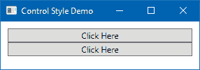

1.  关闭应用程序并返回到 `MainWindow.xaml` 页面。在 `Window` 标签内添加 `<Window.Resources></Window.Resources>` 以在其中添加按钮样式。

1.  将以下样式复制到资源中，以定义一个名为 `ButtonBaseStyle` 的样式，用于我们的按钮控件：

```cs
<Style x:Key="ButtonBaseStyle"  
       TargetType="{x:Type Button}"> 
    <Setter Property="Height"  
            Value="30"/> 
    <Setter Property="MinWidth"  
            Value="180"/> 
    <Setter Property="FontSize"  
            Value="16"/> 
    <Setter Property="HorizontalAlignment"  
            Value="Center"/> 
    <Setter Property="Padding"  
            Value="8 0"/> 
</Style>
```

1.  现在通过添加属性`Style="{StaticResource ButtonBaseStyle}"`将定义的样式应用到两个按钮上。以下是代码，供您参考：

```cs
<StackPanel Orientation="Vertical" 
    Margin="10"> 
    <Button Content="Click Here" 
            Style="{StaticResource ButtonBaseStyle}"/> 
    <Button Content="Click Here" 
            Style="{StaticResource ButtonBaseStyle}"/> 
</StackPanel> 
```

1.  完成这些后，构建项目，再次运行应用程序。你会看到按钮现在形状正确，文本和边缘之间有一些填充。此外，字体大小已增加，正如样式中所定义的。现在看起来是这样的：

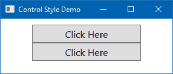

1.  让我们在样式中添加一些额外的`Setter`属性。我们现在将定义一个`4px`的边距、一个手形光标和一个边框，如下所示：

```cs
<Setter Property="Margin"  
        Value="4"/> 
<Setter Property="Cursor"  
        Value="Hand"/>     
<Setter Property="BorderThickness"  
        Value="2"/> 
```

1.  这是到目前为止我们构建的完整样式：

```cs
<Window.Resources> 
    <Style x:Key="ButtonBaseStyle"  
           TargetType="{x:Type Button}"> 
        <Setter Property="Height"  
                Value="30"/> 
        <Setter Property="MinWidth"  
                Value="180"/> 
        <Setter Property="FontSize"  
                Value="16"/> 
        <Setter Property="HorizontalAlignment"  
                Value="Center"/> 
        <Setter Property="Padding"  
                Value="8 0"/> 
        <Setter Property="Margin"  
                Value="4"/> 
        <Setter Property="Cursor"  
                Value="Hand"/>     
        <Setter Property="BorderThickness"  
                Value="2"/> 
    </Style> 
</Window.Resources> 
```

1.  让我们编译项目并再次运行应用程序。现在您将看到一个更好的 UI，按钮控件有适当的样式，如下面的截图所示：

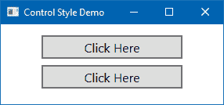

## 它是如何工作的...

当你创建一个`Style`对象时，你设置了一组`Setter`对象到它上面，以定义各种属性来改变控件的外观和感觉。这可能包括高度、宽度、位置、对齐方式、颜色、字体、控件模板、触发器等等。

`FrameworkElement`类公开了一个`Style`属性，可以通过`Style`对象填充。样式始终作为资源构建，正如您在我们示例中的`<Window.Resources>`标签内看到的那样。它包含一个`x:Key`属性，该属性定义了样式的名称/键。通过使用此`Key`，您可以从作用域内的任何其他资源/控件执行绑定。`Style`对象的`TargetType`属性通常被设置，这使得`Style`适用于该类型，这可以是任何类型，甚至是自定义控件的类型。

在本例中，应用样式作用于`Button`对象。尝试将其应用于其他元素类型将导致运行时异常。

## 还有更多...

你可以省略定义`Style`的`TargetType`，但要使其工作，你必须使用完全限定名称来定义属性。例如，前面的`Style`可以像下面这样编写，以获得相同的结果：

```cs
<Style x:Key="ButtonBaseStyle"> 
    <Setter Property="Button.Height"  
            Value="30"/> 
    <Setter Property="Button.MinWidth"  
            Value="180"/> 
    <Setter Property="Button.FontSize"  
            Value="16"/> 
    <Setter Property="Button.HorizontalAlignment"  
            Value="Center"/> 
    <Setter Property="Button.Padding"  
            Value="8 0"/> 
    <Setter Property="Button.Margin"  
            Value="4"/> 
    <Setter Property="Button.Cursor"  
            Value="Hand"/> 
    <Setter Property="Button.BorderThickness"  
            Value="2"/> 
</Style> 
```

由于这使得属性名称冗余，为了定义一个限定名称，人们更喜欢使用第一个带有`TargetType`定义的名称。那么，第二种声明类型有什么用呢？是的，这个问题是合理的。使用这种样式，通过指定属性的完全限定名称，你可以定义一个针对各种类型的控件（在这些控件中可用该属性）的样式。

需要注意的一点是，如果你明确地为控件定义了一个属性，它将覆盖`Style`中定义的属性值。

# 基于另一个样式创建控件样式

样式支持继承。这意味着，你可以从一个`Style`派生出一个`Style`。这可以通过使用`BasedOn`属性来完成，该属性必须指向另一个要继承的`Style`。在本教程中，我们将学习如何根据另一个相同类型的`Style`创建一个按钮控制的`Style`。

## 准备工作

让我们从创建一个名为 `CH06.StyleInheritanceDemo` 的项目开始。为此，打开您的 Visual Studio 实例，并基于 WPF 应用程序模板创建一个项目。

## 如何做到这一点...

按照以下步骤创建一个按钮控件的基样式，然后从中派生出不同的按钮样式：

1.  打开 `MainWindow.xaml` 文件，并在 `Window` 标签内创建一个 `<Window.Resources></Window.Resources>` 部分。

1.  现在，在窗口资源内添加以下样式定义，这是我们之前在本章的另一个配方中讨论过的：

```cs
<Style x:Key="ButtonBaseStyle"  
       TargetType="{x:Type Button}"> 
    <Setter Property="Height"  
            Value="30"/> 
    <Setter Property="MinWidth"  
            Value="180"/> 
    <Setter Property="FontSize"  
            Value="16"/> 
    <Setter Property="HorizontalAlignment"  
            Value="Center"/> 
    <Setter Property="Padding"  
            Value="8 0"/> 
    <Setter Property="Margin"  
            Value="4"/> 
    <Setter Property="Cursor"  
            Value="Hand"/> 
    <Setter Property="BorderThickness"  
            Value="2"/> 
</Style> 
```

1.  将默认的 `Grid` 替换为以下具有四个按钮控制的 `StackPanel`，这些按钮具有我们创建的相同样式：

```cs
<StackPanel Orientation="Vertical" 
            Margin="10"> 
    <Button x:Name="baseButton" 
            Content="Base Button Style" 
            Style="{StaticResource ButtonBaseStyle}"/> 
    <Button x:Name="redButton" 
            Content="Red Button Style" 
            Style="{StaticResource ButtonBaseStyle}"/> 
    <Button x:Name="greenButton" 
            Content="Green Button Style" 
            Style="{StaticResource ButtonBaseStyle}"/> 
    <Button x:Name="blueButton" 
            Content="Blue Button Style" 
            Style="{StaticResource ButtonBaseStyle}"/> 
</StackPanel> 
```

1.  构建项目并运行它。您将看到以下 UI，其中所有按钮控件都应用了相同的样式！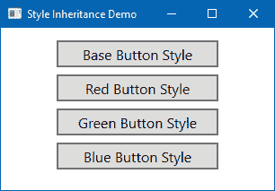

1.  为了演示 `Style` 继承，让我们创建另一个基于基 `Style` 的 `Style`。给它一个新的 `Key` 名称，`RedButtonStyle`，将 `TargetType` 设置为 `Button`，并添加一个新的属性 `BasedOn="{StaticResource ButtonBaseStyle}"` 以创建继承。

1.  向新创建的样式添加一些额外的 `Setter` 值，以定义其边框、背景和前景颜色。以下是 `RedButtonStyle` 的标记：

```cs
<Style x:Key="RedButtonStyle"  
       TargetType="{x:Type Button}" 
       BasedOn="{StaticResource ButtonBaseStyle}"> 
    <Setter Property="BorderBrush"  
            Value="DarkRed"/> 
    <Setter Property="Foreground"  
            Value="White"/> 
    <Setter Property="Background"  
            Value="OrangeRed"/> 
</Style> 
```

1.  现在，将 `redButton` 的 `Style` 属性更改为指向 `RedButtonStyle`：

```cs
<Button x:Name="redButton" 
        Content="Red Button Style" 
        Style="{StaticResource RedButtonStyle}"/> 
```

1.  让我们再次运行应用程序，它将具有以下 UI，其中第二个按钮将具有红色背景和白色字体颜色！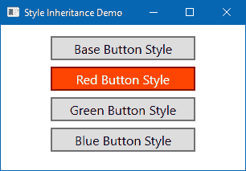

1.  现在，添加另外两个基于 `ButtonBaseStyle` 的样式，分别命名为 `GreenButtonStyle` 和 `BlueButtonStyle`。

1.  将它们的 `BorderBrush`、`Foreground` 和 `Background` 属性分别设置为绿色和蓝色。为此，请在 `<Window.Resources>` 标签内复制以下样式：

```cs
<Style x:Key="GreenButtonStyle"  
       TargetType="{x:Type Button}" 
       BasedOn="{StaticResource ButtonBaseStyle}"> 
    <Setter Property="BorderBrush"  
            Value="ForestGreen"/> 
    <Setter Property="Foreground"  
            Value="ForestGreen"/> 
    <Setter Property="Background"  
            Value="GreenYellow"/> 
</Style> 

<Style x:Key="BlueButtonStyle"  
       TargetType="{x:Type Button}" 
       BasedOn="{StaticResource ButtonBaseStyle}"> 
    <Setter Property="BorderBrush"  
            Value="DarkSlateBlue"/> 
    <Setter Property="Foreground"  
            Value="DarkSlateBlue"/> 
    <Setter Property="Background"  
            Value="SkyBlue"/> 
</Style> 
```

1.  要应用前面的样式，按照以下方式修改 `greenButton` 和 `blueButton` 的 `Style` 属性：

```cs
<Button x:Name="greenButton" 
        Content="Green Button Style" 
        Style="{StaticResource GreenButtonStyle}"/> 

<Button x:Name="blueButton" 
        Content="Blue Button Style" 
        Style="{StaticResource BlueButtonStyle}"/>
```

1.  这是整个 `StackPanel` 的代码片段，现在它将包含四个按钮。其中第一个按钮遵循基本样式，而其他三个按钮分别遵循新的红色、绿色和蓝色按钮样式：

```cs
<StackPanel Orientation="Vertical" 
            Margin="10"> 
    <Button x:Name="baseButton" 
            Content="Base Button Style" 
            Style="{StaticResource ButtonBaseStyle}"/> 
    <Button x:Name="redButton" 
            Content="Red Button Style" 
            Style="{StaticResource RedButtonStyle}"/> 
    <Button x:Name="greenButton" 
            Content="Green Button Style" 
            Style="{StaticResource GreenButtonStyle}"/> 
    <Button x:Name="blueButton" 
            Content="Blue Button Style" 
            Style="{StaticResource BlueButtonStyle}"/> 
</StackPanel> 
```

1.  是时候构建项目并运行应用程序了。现在，当应用程序启动时，它将具有以下 UI，但具有独特的样式。如前所述，按钮的颜色将根据我们为不同样式设置的值来设置！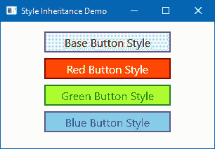

## 它是如何工作的...

继承样式可以具有额外的 `Setter` 属性来设置，或者它可以为已由基 `Style` 设置的属性提供不同的值。在上面的示例中，`RedButtonStyle`、`GreenButtonStyle` 和 `BlueButtonStyle` 继承自第一个（`ButtonBaseStyle`），并向其添加了 `BorderBrush`、`Foreground` 和 `Background` 设置器属性。

# 自动应用样式到控件

在前两个菜谱中，我们学习了如何创建样式，并通过使用`x:Key`名称将它们应用到控件上。在同一个应用程序内手动为大量控件分配样式并不总是可行的。因此，我们需要将其自动应用到特定窗口作用域内的所有元素或整个应用程序中。

例如，我们可能希望同一应用内的所有按钮都拥有相同的样式和感觉。这使得创建新的按钮更加容易，因为开发者/设计师不需要知道应用哪种样式。如果自动样式配置正确，它将使工作流程更加顺畅。

让我们通过一个简单的例子看看这是如何实现的。

## 准备工作

要开始这个菜谱，打开您的 Visual Studio 实例，创建一个名为`CH06.StyleUsageDemo`的新 WPF 应用程序项目。

## 如何操作...

按照以下步骤为按钮控件创建样式，并将它们应用到同一窗口内的控件上，然后跨整个应用程序应用：

1.  打开`MainWindow.xaml`，并将现有的`Grid`替换为以下`StackPanel`，其中包含四个按钮控件：

```cs
<StackPanel Orientation="Vertical" 
            Margin="10"> 
    <Button Content="Red Button Style"/> 
    <Button Content="Red Button Style"/> 
    <Button Content="Red Button Style"/> 
    <Button Content="Red Button Style"/> 
</StackPanel> 
```

1.  在`Window`标签内创建一个`<Window.Resources></Window.Resources>`部分，并在其中添加以下样式：

```cs
<Style TargetType="{x:Type Button}"> 
    <Setter Property="Height"  
            Value="30"/> 
    <Setter Property="MinWidth"  
            Value="180"/> 
    <Setter Property="FontSize"  
            Value="16"/> 
    <Setter Property="HorizontalAlignment"  
            Value="Center"/> 
    <Setter Property="Padding"  
            Value="8 0"/> 
    <Setter Property="Margin"  
            Value="4"/> 
    <Setter Property="Cursor"  
            Value="Hand"/> 
    <Setter Property="BorderThickness"  
            Value="2"/> 
    <Setter Property="BorderBrush"  
            Value="DarkRed"/> 
    <Setter Property="Foreground"  
            Value="White"/> 
    <Setter Property="Background"  
            Value="OrangeRed"/> 
</Style> 
```

1.  在解决方案资源管理器中，右键单击项目。从上下文菜单中选择“添加 | 窗口...”，以打开添加新项对话框窗口。

1.  输入名称为`SecondaryWindow`，然后点击添加。这将创建项目内的`SecondaryWindow.xaml`和`SecondaryWindow.xaml.cs`文件。

1.  打开`SecondaryWindow.xaml`文件，将`Grid`替换为相同的`StackPanel`以创建 UI，其中包含四个按钮。以下是您需要复制的标记：

```cs
<StackPanel Orientation="Vertical" 
            Margin="10"> 
    <Button Content="Red Button Style"/> 
    <Button Content="Red Button Style"/> 
    <Button Content="Red Button Style"/> 
    <Button Content="Red Button Style"/> 
</StackPanel> 
```

1.  现在，导航到`App.xaml`文件，并删除如以下屏幕截图所示的`StartupUri="MainWindow.xaml"`属性。

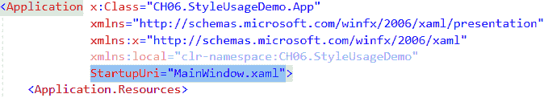

1.  现在，转到其代码隐藏文件，即`App.xaml.cs`，并在类实现中插入以下代码块以创建`MainWindow`和`SecondaryWindow`的实例以显示在屏幕上：

```cs
protected override void OnStartup(StartupEventArgs e) 
{ 
    base.OnStartup(e); 

    new MainWindow().Show(); 
    new SecondaryWindow().Show(); 
} 
```

1.  完成此操作后，编译您的项目，并运行应用程序。

1.  如以下屏幕截图所示，您将在屏幕上看到两个窗口。一个窗口（`MainWindow`）将应用按钮控件的样式，而另一个窗口（`SecondaryWindow`）将保持默认的样式和感觉：

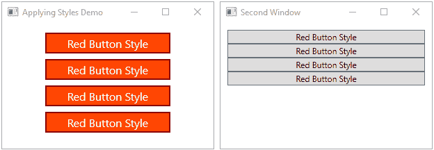

1.  现在关闭应用程序并导航到`MainWindow.xaml`文件。复制那里的样式，并删除/注释掉整个`Window.Resources`部分。

1.  现在打开`App.xaml`文件，并将复制的内文粘贴到`Application.Resources`标签内，如下所示：

```cs
<Application.Resources> 
    <Style TargetType="{x:Type Button}"> 
        <Setter Property="Height"  
                Value="30"/> 
        <Setter Property="MinWidth"  
                Value="180"/> 
        <Setter Property="FontSize"  
                Value="16"/> 
        <Setter Property="HorizontalAlignment"  
                Value="Center"/> 
        <Setter Property="Padding"  
                Value="8 0"/> 
        <Setter Property="Margin"  
                Value="4"/> 
        <Setter Property="Cursor"  
                Value="Hand"/> 
        <Setter Property="BorderThickness"  
                Value="2"/> 
        <Setter Property="BorderBrush"  
                Value="DarkRed"/> 
        <Setter Property="Foreground"  
                Value="White"/>
```

```cs
        <Setter Property="Background"  
                Value="OrangeRed"/> 
    </Style> 
</Application.Resources> 
```

1.  让我们构建并运行应用程序。您现在将看到样式被应用到两个窗口上。以下是相同的屏幕截图：

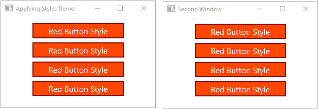

## 它是如何工作的...

当您创建一个未指定 `x:Key` 值的样式时，自动样式会起作用。任何未显式设置其样式的元素将自动获得它。

在前面的示例中，我们在两个窗口（`MainWindow` 和 `SecondaryWindow`）中都有按钮，并且没有手动将任何样式应用到它们中，但 `MainWindow` 中的控件仍然获得了红色按钮的样式，因为该窗口中的 `Style` 创建时没有指定任何键 (`<Style TargetType="{x:Type Button}">`）。

对于 `SecondaryWindow`，我们没有定义任何 `Style` 元素，因此它应用了按钮的默认样式。

当我们将 `Style` 定义移动到 `App.xaml` 中的 `Application.Resources` 标签时，它将 `Style` 注册到应用程序级别。现在，当您运行应用程序时，两个窗口都将从应用程序资源接收样式，并且所有类型的 `Button` 控件将自动应用该样式。

如果一个元素希望恢复其默认样式，它可以将其 `Style` 属性设置为 `null`。这通常在 XAML 中写作 `{x:Null}`。

# 编辑任何控件的模板

WPF 允许您自定义任何控件的模板。使用 Visual Studio，您可以轻松地编辑任何模板以满足您的需求。在本例中，我们将讨论如何编辑 `ProgressBar` 控件的模板。

## 准备工作

让我们从创建一个名为 `CH06.ControlTemplateDemo` 的项目开始。确保在创建项目时选择正确的 WPF 应用程序模板。

## 如何操作...

按照以下步骤编辑进度条模板：

1.  打开 `MainWindow.xaml` 文件，并将默认的 `Grid` 控件替换为垂直的 `StackPanel`。

1.  在 `StackPanel` 内添加两个 `ProgressBar` 控件，并设置它们的 `Height`、`Width` 和 `Value` 属性，如这里所示：

```cs
<StackPanel Orientation="Vertical"> 
    <ProgressBar Height="30" 
                 Margin="10" 
                 Value="40"/> 
    <ProgressBar Height="30" 
                 Margin="10" 
                 Value="60"/> 
</StackPanel>
```

1.  如果您运行应用程序，您将看到应用程序窗口包含两个进度条控件。这两个控件都将应用默认样式。以下是相同截图：

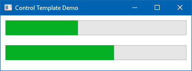

1.  现在，我们将为 `ProgressBar` 控件创建一个自定义模板并将其应用到第二个进度条上。为此，在 `Window` 标签内添加以下标记，以在 `Window.Resources` 下定义模板。

1.  确保您设置了正确的 `TargetType` 并为其分配一个 `x:Key` 名称：

```cs
<Window.Resources> 
    <ControlTemplate TargetType="{x:Type ProgressBar}" 
                     x:Key="ProgressBarTemplate"> 
        <Grid> 
            <Rectangle x:Name="PART_Track" 
                       Fill="AliceBlue"/> 

            <Rectangle x:Name="PART_Indicator" 
                       StrokeThickness="0" 
                       HorizontalAlignment="Left"> 
                <Rectangle.Fill> 
                    <LinearGradientBrush  
                           EndPoint=".08,0" 
                           SpreadMethod="Repeat"> 
                        <GradientStop  
                                 Offset="0"  
                                 Color="Green" /> 
                        <GradientStop  
                                 Offset=".8"  
                                 Color="Green" /> 
                        <GradientStop  
                                 Offset=".8"  
                                 Color="Transparent" /> 
                        <GradientStop  
                                 Offset="1"  
                                 Color="Transparent" /> 
                    </LinearGradientBrush> 
                </Rectangle.Fill> 
            </Rectangle> 

            <TextBlock FontSize="20" 
                       FontWeight="Bold" 
                       Foreground="White" 
                       HorizontalAlignment="Center" 
                       VerticalAlignment="Center"/> 
        </Grid> 
    </ControlTemplate> 
</Window.Resources> 
```

1.  现在，通过添加 `Template="{StaticResource ProgressBarTemplate}"` 属性值将模板应用到第二个控件上。完成此操作后，XAML 将如下所示：

```cs
<StackPanel Orientation="Vertical"> 
    <ProgressBar Height="30" 
                 Margin="10" 
                 Value="40"/> 

    <ProgressBar Height="30" 
                 Margin="10" 
                 Value="60" 
                 Template="{StaticResource  
                            ProgressBarTemplate}"/> 
</StackPanel> 
```

1.  让我们再次运行应用程序。您将看到第二个控件应用了我们的自定义模板，看起来如下：

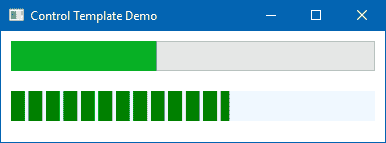

## 工作原理...

当您将`Template="{StaticResource ProgressBarTemplate}"`分配给控件时，它将应用模板到相关控件。进度条控件包含在其模板中定义的两个主要部分，它们是`PART_Track`和`PART_Indicator`。第一个用于定义控件的基本轨道，而第二个用于定义进度指示器。

在我们的模板中，我们将`LinearGradientBrush`分配给`PART_Indicator`矩形的`Fill`颜色，以设计以条形格式显示的进度指示。使用`GradientStop`定义所选颜色的`Offset`，如下所示：

```cs
<LinearGradientBrush EndPoint=".08,0" 
                     SpreadMethod="Repeat"> 
    <GradientStop Offset="0"  
                  Color="Green" /> 
    <GradientStop Offset=".8"  
                  Color="Green" /> 
    <GradientStop Offset=".8"  
                  Color="Transparent" /> 
    <GradientStop Offset="1"  
                  Color="Transparent" /> 
</LinearGradientBrush> 
```

现在，当应用程序运行时，由于`LinearGradientBrush`的重复行为（`SpreadMethod="Repeat"`），堆叠的条形将根据值在控件中展开。

## 更多内容...

记住控件默认模板的主体并不容易。也不可能记住每个定义为`PART_Name`的控件部分。Visual Studio 提供了一个轻松修改模板的方法。

要做到这一点，右键单击控件并遵循以下截图所示的上下文菜单条目编辑模板 | 编辑副本...：

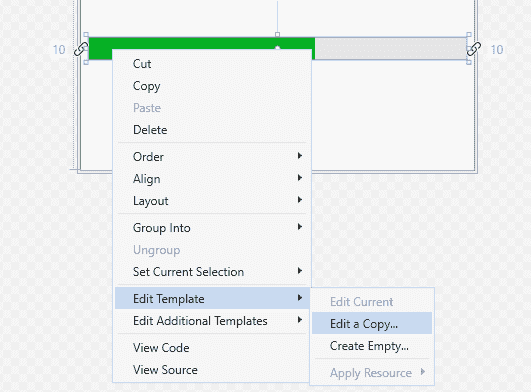

这将打开一个对话框窗口，以指定您想要创建样式的文件。如果您选择应用程序，它将创建在`Application.Resources`标签下，并且可以在整个应用程序中访问。

如果您选择此文档，它将创建在`Window.Resources`标签下：

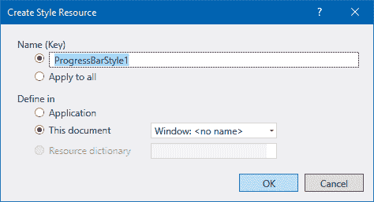

从这个屏幕，您还可以选择创建隐式或显式样式。选择应用全部以创建**隐式样式**，该范围内的所有控件都将获得相同的样式。在另一种情况下，给它一个**键**名称。一旦您点击确定，它将在相同的 XAML 中创建默认模板。您可以根据需求进行自定义。

不要移除任何由`PART_`定义的模板的`PART`控件，因为这些控件在内部需要它们。

# 创建属性触发器

触发器允许您在满足某些条件时更改属性值。它还可以通过允许您动态更改控件的外观和/或行为，而无需在代码后类中编写额外的代码，来根据属性值执行操作。

最常见的触发器是**属性触发器**，它可以通过 XAML 中的`<Trigger>`元素简单地定义。当拥有控件的特定属性更改以匹配指定值时，它将触发。

在本食谱中，我们将通过合适的示例学习属性触发器。

## 准备工作

打开您的 Visual Studio 实例，创建一个名为`CH06.PropertyTriggerDemo`的新 WPF 应用程序项目。

## 如何操作...

要使用属性触发器，我们将在这个示例中使用一个`Label`控件并触发系统在鼠标悬停时改变其各种属性。遵循以下简单步骤：

1.  打开`MainWindow.xaml`页面并在网格内添加以下`Label`控件：

```cs
<Grid> 
    <Label Content="Hover over the text" 
           HorizontalAlignment="Center" 
           VerticalAlignment="Center"/> 
</Grid> 
```

1.  在`Window`标签内，创建一个`Window.Resources`标签来保存`Label`控件的风格。在资源内创建一个`Style`并将其`TargetType`设置为`Button`。

1.  在样式内添加以下触发器：

```cs
<Style.Triggers> 
    <Trigger Property="IsMouseOver"  
             Value="True"> 
        <Setter Property="FontSize"  
                Value="30"/> 
        <Setter Property="Foreground" 
                Value="Red"/> 
        <Setter Property="Background"  
                Value="LightYellow"/> 
        <Setter Property="Effect"> 
            <Setter.Value> 
                <DropShadowEffect  
                     RenderingBias="Performance"  
                     BlurRadius="1"/> 
            </Setter.Value> 
        </Setter> 
    </Trigger> 
</Style.Triggers>
```

1.  这是包含对`Label`控件触发器的完整样式，当鼠标悬停时将改变所提到的属性：

```cs
<Window.Resources> 
    <Style TargetType="{x:Type Label}"> 
        <Style.Triggers> 
            <Trigger Property="IsMouseOver"  
                     Value="True"> 
                <Setter Property="FontSize"  
                        Value="30"/> 
                <Setter Property="Foreground"  
                        Value="Red"/> 
                <Setter Property="Background"  
                        Value="LightYellow"/> 
                <Setter Property="Effect"> 
                    <Setter.Value> 
                        <DropShadowEffect  
                             RenderingBias="Performance"  
                             BlurRadius="1"/> 
                    </Setter.Value> 
                </Setter> 
            </Trigger> 
        </Style.Triggers> 
    </Style> 
</Window.Resources>
```

1.  现在，构建项目并运行它。你将看到应用程序窗口上的文本标签上有一个悬停效果。将鼠标悬停在文本上以查看屏幕上的效果，如图所示：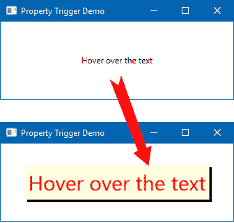

## 它是如何工作的...

`Label`的样式创建了一个在鼠标悬停时触发的`Trigger`，通过检查`IsMouseOver="True"`属性值。当条件满足时，它将设置器属性设置为定义在其下的属性。

当条件变为`false`时，设置器逻辑上被移除，将属性还原到其原始值。这意味着不需要提供一个*相反*的触发器。

# 创建一个多触发器

并非必须使用触发器仅基于单一条件执行动作。有时你需要创建一个由多个条件组合而成的触发器，如果所有条件都满足，则激活整个触发器。这就是**多触发器**的作用。让我们看看如何创建一个多触发器。

## 准备工作

打开你的 Visual Studio IDE 并创建一个名为`CH06.MultiTriggerDemo`的新 WPF 应用程序。

## 如何操作...

在以下步骤中，我们将构建一个简单的应用程序，它将创建并执行一个基于某些条件的多触发器，并改变`TextBox`控件的`Foreground`和`Background`属性：

1.  打开`MainWindow.xaml`文件。

1.  将默认的`Grid`面板替换为垂直的`StackPanel`。

1.  在面板内添加两个`TextBox`控件并设置它们的`Text`属性以表示一些文本。以下是本例中我们将使用的 XAML：

```cs
<StackPanel> 
    <TextBox Text="Focus your cursor here" 
             FontSize="20" 
             HorizontalAlignment="Stretch" 
             VerticalAlignment="Center" 
             Height="30" 
             Margin="4"/> 

    <TextBox Text="Focus your cursor here" 
             FontSize="20" 
             HorizontalAlignment="Stretch" 
             VerticalAlignment="Center" 
             Height="30" 
             Margin="4"/> 
</StackPanel>
```

1.  现在，在窗口资源（`Window.Resources`）下创建一个针对`TextBox`的`Style`：

```cs
<Style TargetType="{x:Type TextBox}"> 

</Style> 
```

1.  创建一个基于一个或多个条件的`MultiTrigger`样式触发器，并应用设置器，如下所示：

```cs
<Style.Triggers> 
    <MultiTrigger> 
        <MultiTrigger.Conditions> 
            <Condition Property="IsEnabled"  
                       Value="True" /> 
            <Condition Property="IsKeyboardFocused"  
                       Value="True" /> 
        </MultiTrigger.Conditions> 

        <MultiTrigger.Setters> 
            <Setter Property="Foreground"  
                    Value="Green" /> 
            <Setter Property="Background"  
                    Value="LightGreen" /> 
        </MultiTrigger.Setters> 
    </MultiTrigger> 
</Style.Triggers> 
```

1.  让我们执行应用程序并关注`TextBox`控件以查看其行为：

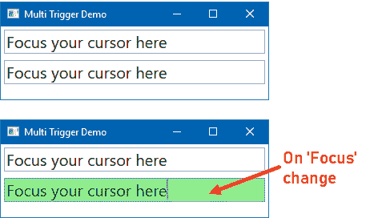

## 它是如何工作的...

这几乎就像**属性触发器**，但在这里它用于在多个属性更改上设置动作，并在`MulitTrigger.Conditions`内的所有条件都满足时执行它。`MultiTrigger`对象包含这些`Condition`对象集合。

在这个例子中，我们有一个与`TextBox`控件关联的`MultiTrigger`。当控件启用并获得键盘焦点时，它更改其`Foreground`和`Background`属性。当其中任何一个为`false`时，它将属性值返回到其原始状态。

# 创建数据触发器

正如其名所示，**数据触发器**将属性值应用于对已绑定到`UIElement`的`Data`执行一系列操作。这由`<DataTrigger>`元素表示。

在这个菜谱中，我们将学习如何创建一个对底层数据起作用的触发器。

## 准备工作

让我们从创建一个新的 WPF 项目开始。打开 Visual Studio 并创建一个名为`CH06.DataTriggerDemo`的项目。

## 如何操作...

按照以下简单步骤创建一个数据触发器，该触发器将根据单选按钮的选择更改`Label`的`Background`和`Content`属性：

1.  从解决方案资源管理器中，打开`MainWindow.xaml`文件。

1.  让我们将`Grid`面板分为两列：

```cs
<Grid.ColumnDefinitions> 
    <ColumnDefinition/> 
    <ColumnDefinition/> 
</Grid.ColumnDefinitions>
```

1.  现在在列`0`（零）插入一个`150` x `100`维度的`Label`，并将其`Foreground`属性设置为`White`：

```cs
<Label Width="150" 
       Height="100" 
       Grid.Column="0" 
       Foreground="White" 
       FontSize="20" 
       BorderBrush="Gray" 
       BorderThickness="1"/> 
```

1.  在列`1`插入一个垂直的`StackPanel`，并在其中添加三个单选按钮。确保设置它们的名称和`GroupName`。`x:Name`属性用于定义控件名称，`GroupName="colors"`用于定义单选按钮的一个组。以下是完整的 XAML 标记：

```cs
<StackPanel Grid.Column="1" 
            Margin="10"> 
    <RadioButton x:Name="rdoRed" 
                 GroupName="colors" 
                 Content="Red (#FFFF0000)"/> 

    <RadioButton x:Name="rdoGreen" 
                 GroupName="colors" 
                 Content="Green (#FF00FF00)"/> 

    <RadioButton x:Name="rdoBlue" 
                 GroupName="colors" 
                 Content="Blue (#FF0000FF)"/> 
</StackPanel> 
```

1.  在窗口的`Window.Resources`标签内，创建一个针对`Label`控件的`Style`：

```cs
<Style TargetType="{x:Type Label}"> 

</Style>
```

1.  在`Style`内插入以下触发器。`<Style.Triggers>`包含三个绑定到复选框控件的`DataTrigger`：

```cs
<Style.Triggers> 
    <DataTrigger Binding="{Binding ElementName=rdoRed,  
                           Path=IsChecked}" 
                 Value="True"> 
        <Setter Property="Content" 
                Value="Red"/> 
        <Setter Property="Background"  
                Value="Red"/> 
    </DataTrigger> 

    <DataTrigger Binding="{Binding ElementName=rdoGreen,  
                           Path=IsChecked}" 
                 Value="True"> 
        <Setter Property="Content" 
                Value="Green"/> 
        <Setter Property="Background"  
                Value="Green"/> 
    </DataTrigger> 

    <DataTrigger Binding="{Binding ElementName=rdoBlue,  
                           Path=IsChecked}" 
                 Value="True"> 
        <Setter Property="Content" 
                Value="Blue"/> 
        <Setter Property="Background"  
                Value="Blue"/> 
    </DataTrigger> 
</Style.Triggers> 
```

1.  当触发器准备就绪时，让我们构建项目并运行它。更改单选按钮选择并观察其工作情况，如图所示：

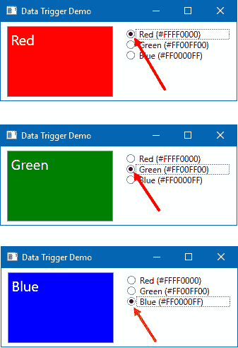

## 它是如何工作的...

当你点击第一个单选按钮（`rdoRed`）时，它触发第一个数据触发器，因为它满足`rdoRed`控件的`IsChecked`属性并修改`Setter`属性——`Content`和`Background`。

类似地，当你将选择更改为第二个或第三个单选按钮时，相应的`DataTrigger`将触发并更新`Label`控件，根据`Setter`属性。

# 创建多数据触发器

**多数据触发器**与**数据触发器**相同，唯一的区别在于你可以在`MultiDataTrigger.Conditions`中定义的多个条件下设置属性值。属性值在`MultiDataTrigger.Setters`中定义。

让我们了解在这个菜谱中多数据触发的用法。

## 准备工作

要开始使用多数据触发器，让我们首先创建一个名为`CH06.MultiDataTriggerDemo`的项目。确保选择正确的项目模板。

## 如何操作...

按照以下步骤创建一个包含两个复选框和一个按钮的 UI，然后根据复选状态应用多数据触发器来启用/禁用按钮：

1.  让我们从用`StackPanel`替换`Grid`开始，其中包含两个复选框（`chkLicense`和`chkTerms`）控件和一个按钮：

```cs
<StackPanel HorizontalAlignment="Center"  
            VerticalAlignment="Center"> 
    <CheckBox x:Name="chkLicense"  
              Content="Yes, I accept license agreement" /> 
    <CheckBox x:Name="chkTerms"  
              Content="Yes, I accept Terms &amp; Conditions" /> 

    <Button HorizontalAlignment="Center"  
            Margin="0,20,0,0"  
            FontSize="20"  
            Content="Register"> 

    </Button> 
</StackPanel>
```

1.  现在，修改`Button`以公开其样式，如下所示：

```cs
<Button HorizontalAlignment="Center"  
        Margin="0,20,0,0"  
        FontSize="20"  
        Content="Register"> 
    <Button.Style> 

    </Button.Style> 
</Button> 
```

1.  在其中添加以下按钮样式，它包含一个`MultiDataTrigger`来启用/禁用按钮：

```cs
<Style TargetType="{x:Type Button}"> 
    <Setter Property="IsEnabled"  
            Value="False"/> 
    <Style.Triggers> 
        <MultiDataTrigger> 
            <MultiDataTrigger.Conditions> 
                <Condition Binding="{Binding  
                           ElementName=chkLicense,  
                           Path=IsChecked}"  
                           Value="True" /> 
                <Condition Binding="{Binding  
                           ElementName=chkTerms,  
                           Path=IsChecked}" 
                           Value="True" /> 
            </MultiDataTrigger.Conditions> 

            <Setter Property="IsEnabled"  
                    Value="True" /> 
        </MultiDataTrigger> 
    </Style.Triggers> 
</Style>
```

1.  现在运行应用程序，屏幕上将有两个复选框和一个按钮。更改复选框控件的选择以查看行为：

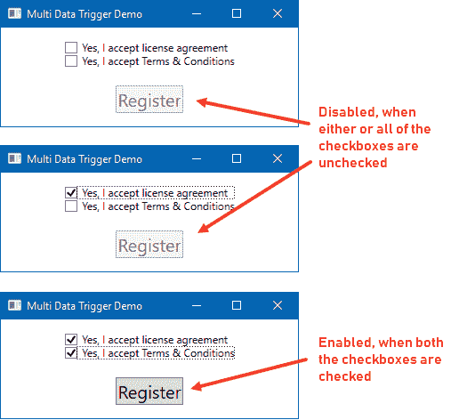

## 它是如何工作的...

多数据触发器基于设置给它的条件工作，它作用于底层数据。在我们的例子中，我们有一个包含两个条件的`MultiDataTrigger`。

根据条件，如果两个复选框控件都被选中，它将触发并启用按钮，通过将`IsEnabled`属性设置为`True`。当任何前面的条件不满足时，它将自动将`IsEnabled`属性设置回上一个值，在我们的例子中是`False`。

# 创建事件触发器

到目前为止，我们已经看到了属性触发器和数据触发器，它们基于比较属性与值来工作。在本例中，我们将学习**事件触发器**，它在发生路由事件时触发。

## 准备工作

在您的 Visual Studio IDE 中，创建一个名为`CH06.EventTriggerDemo`的新项目，基于 WPF 应用程序模板。

## 如何做到这一点...

按照以下步骤在`TextBlock`控件上创建一个简单的事件触发器：

1.  打开`MainWindow.xaml`并在`Grid`内添加以下`TextBlock`：

```cs
<TextBlock Text="Hover here"  
           FontSize="30"  
           Opacity="0.2"  
           HorizontalAlignment="Center"  
           VerticalAlignment="Center"> 
    <TextBlock.Style> 

    </TextBlock.Style> 
</TextBlock> 
```

1.  将以下包含`EventTrigger`的样式添加到`TextBlock.Style`属性：

```cs
<Style TargetType="TextBlock"> 
    <Style.Triggers> 
        <EventTrigger RoutedEvent="MouseEnter"> 
            <EventTrigger.Actions> 
                <BeginStoryboard> 
                    <Storyboard> 
                        <DoubleAnimation  
              Duration="0:0:0.500"  
              Storyboard.TargetProperty="FontSize"  
              To="50" /> 
                        <DoubleAnimation  
              Duration="0:0:0.500"  
              Storyboard.TargetProperty="Opacity"  
              To="1.0"/> 
                    </Storyboard> 
                </BeginStoryboard> 
            </EventTrigger.Actions> 
        </EventTrigger> 

        <EventTrigger RoutedEvent="MouseLeave"> 
            <EventTrigger.Actions> 
                <BeginStoryboard> 
                    <Storyboard> 
                        <DoubleAnimation  
              Duration="0:0:0.500"  
              Storyboard.TargetProperty="FontSize"  
              To="30" /> 
                        <DoubleAnimation  
              Duration="0:0:0.500"  
              Storyboard.TargetProperty="Opacity"  
              To="0.2"/> 
                    </Storyboard> 
                </BeginStoryboard> 
            </EventTrigger.Actions> 
        </EventTrigger> 
    </Style.Triggers> 
</Style> 
```

1.  构建应用程序并运行它。将鼠标悬停在文本上方，您会看到文本的字体大小逐渐增大，可见性变为`100%`：

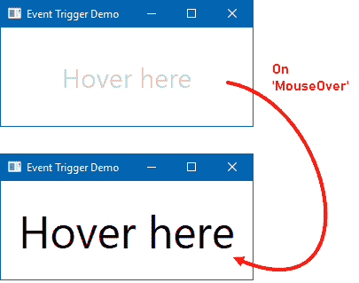

## 它是如何工作的...

事件触发器通常用于在关联的`FrameworkElement`的**路由事件**引发时执行操作。这主要用于动画，以控制在某个 UI 事件引发时的外观和感觉。

在此示例中，当您将鼠标悬停在`TextBlock`控件上时，`MouseEnter`事件会触发，并触发`EventTrigger`，这是我们已在 XAML 中定义的。然后它将文本动画化以具有更大的字体大小和更高的不透明度，以提供更大、更明显的可见内容。

当`MouseLeave`事件触发时，它会减小字体大小并将控件的不透明度降低到`20%`。关于`Storyboard`动画的更多内容将在*第八章*，*与动画一起工作*中讨论。
