使用资源和 MVVM 模式

在本章中，我们将介绍以下配方：

+   在 WPF 应用程序中使用二进制资源

+   从另一个程序集使用二进制资源

+   在代码中访问二进制资源

+   在 WPF 中使用静态逻辑资源

+   在 WPF 中使用动态逻辑资源

+   管理逻辑资源

+   使用用户选择的颜色和字体

+   使用 MVVM 模式构建应用程序

+   在 WPF 应用程序中使用路由命令

# 简介

虽然二进制资源在任何应用程序中都发挥着至关重要的作用，但 WPF 还提供了一种不同类型的资源，称为 **逻辑资源**。这些逻辑资源是可以在整个应用程序中共享的对象，并且可以在多个程序集之间访问。这些资源可以分为两种类型，静态逻辑资源和动态逻辑资源。

另一方面，**MVVM**（**模型-视图-视图模型**）是一种保持 UI 和代码之间分离的模式，它为设计师和开发者提供了在单个窗口上工作的灵活性，而不依赖于彼此。

在本章中，我们将首先介绍二进制资源、逻辑资源，然后继续学习使用 MVVM 模式构建应用程序。我们还将介绍如何使用 **RoutedCommands** 在 WPF 应用程序中演示 **命令设计模式**，它可以从多个位置调用。

# 在 WPF 应用程序中使用二进制资源

**二进制资源**是添加到项目中并为其定义了 `Build Action` 的字节数据块。通常，这些是应用程序所需的图像、徽标、字体、文件等，它们与应用程序捆绑在一起。

在本配方中，我们将学习如何在 WPF 应用程序中使用二进制资源。

## 准备工作

要开始，打开您的 Visual Studio IDE 并创建一个名为 `CH07.BinaryResourceDemo` 的新项目。确保您选择 WPF 应用作为项目模板。

## 如何操作...

按以下步骤将图像作为二进制资源添加到 WPF 应用程序中，并将它们加载到应用程序窗口中：

1.  右键单击项目以添加一个新文件夹。按照上下文菜单路径添加 | 新文件夹。将新创建的文件夹重命名为 `Images`：

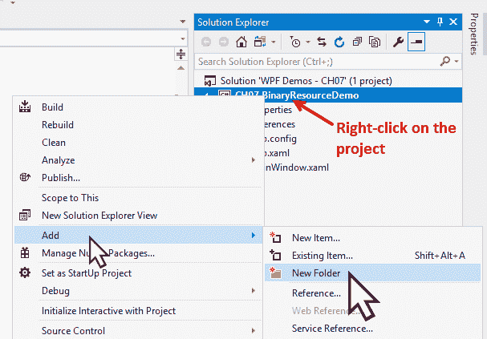

1.  现在，右键单击 Images 文件夹以添加一些图像。从上下文菜单条目中选择添加 | 已存在项... 并添加您选择的两个图像。在这个例子中，我们添加了两个现有图像，`image1.png` 和 `image2.png`，以供演示：

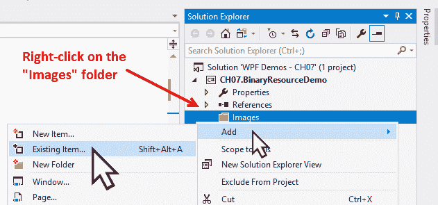

1.  从解决方案资源管理器中，右键单击 `image1.png` 并转到其属性。将图像的构建操作设置为资源，这是默认设置：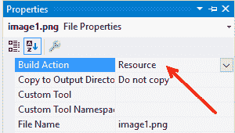

1.  现在，从解决方案资源管理器中右键单击 `image2.png`，并转到其属性。将其构建操作设置为内容。

1.  将“复制到输出目录”更改为“始终复制”：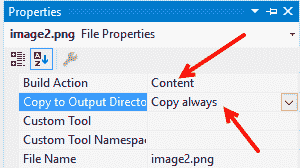

1.  从解决方案资源管理器中打开`MainWindow.xaml`，并将`Grid`替换为水平`StackPanel`。

1.  现在将两个图像插入`StackPanel`中，并将它们的`Source`属性分别设置为`Images/image1.png`和`Images/image2.png`：

```cs
<StackPanel Orientation="Horizontal"> 
    <Image Source="Images/image1.png" 
           Width="150" 
           Margin="8"/> 
    <Image Source="Images/image2.png" 
           Width="150" 
           Margin="8"/> 
</StackPanel> 
```

1.  构建项目并运行应用程序。你将在屏幕上看到以下 UI：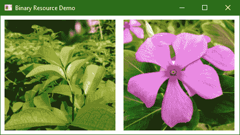

1.  现在转到项目的 bin | Debug 目录。你会看到一个名为 Images 的文件夹，其中包含我们定义为`Build Action = Content`和`Copy to Output Directory = Copy Always`的图像（`image2.png`）。

1.  现在将`image2.png`替换为不同的图像。

1.  现在直接从 bin | Debug 文件夹中运行应用程序，而不是重新编译项目。观察屏幕上的输出。你会看到第二个图像现在指向我们放置在 bin | Debug | Images 文件夹中的新图像：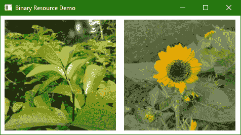

## 它是如何工作的...

当`Build Action`设置为`Resource`时，文件作为资源存储在编译的程序集中。在我们的例子中，`image1.png`在项目二进制文件中被设置为`Resource`，这使得在部署应用程序时实际的图像文件变得不必要。

当`Build Action`设置为`Content`时，资源不会被包含在程序集内。为了使其对应用程序可用，需要将`Copy to Output Directory`设置为`Copy Always`或`Copy if Newer`。

这使得当资源需要经常更改且不希望重新构建时更为合适。如果资源在输出目录中不可用，在执行时将渲染一个空白图像。如果资源较大且不是总是需要的，最好将其留给生成的程序集。

## 还有更多...

在插入图像到 XAML 时，我们通常使用相对 URI（在我们的例子中是`Images/image1.png`），因为它相对于应用程序。你也可以更详细地将其指定为`pack://application:,,,/Images/image1.png`，这通常用于从代码后端分配图像源。

你也可以使用 Visual Studio 编辑器来指定图像源。为此，在 XAML 设计视图中的图像上右键单击，并转到其属性。从属性面板中，点击下拉箭头，如以下截图所示，从列表中选择所需的图像：

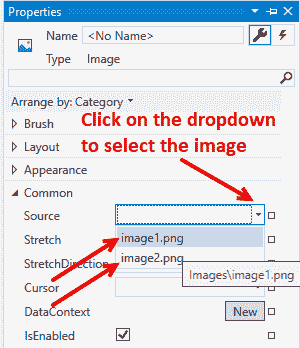

# 使用来自另一个程序集的二进制资源

不必在将使用资源的同一程序集中定义资源。有时，根据需要，二进制资源在一个程序集（通常是一个类库）中定义，并在另一个程序集中使用。

WPF 提供了一种统一的方式来访问在其他程序集中定义的资源。为了使用它，我们需要使用 pack URI 方案。在本教程中，我们将学习如何使用来自另一个程序集的二进制资源。

## 准备工作

让我们从创建一个名为 `CH07.RemoteBinaryResourceDemo` 的新项目开始。确保在创建此项目时选择 WPF 应用程序模板。

## 如何做到这一点...

按照以下步骤创建一个类库来定义二进制资源，并从我们已创建的应用程序中使用它：

1.  在同一解决方案中创建另一个项目。让我们将其命名为 `CH07.ResourceLibrary`，并确保您选择类库 (.NET Framework) 作为项目模板：

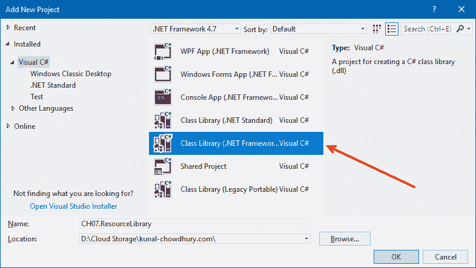

1.  删除自动生成的类文件 `Class1.cs`。

1.  现在右键单击项目 `CH07.ResourceLibrary` 并创建一个名为 `Images` 的新文件夹。

1.  现在右键单击新创建的文件夹，并将现有的图像（在我们的情况下是 `image1.png`）添加到该文件夹中。

1.  然后右键单击图像（`image1.png`）并导航到其属性窗格。

1.  如前一个示例所示，将其构建操作更改为 `Resource`。编译项目 `CH07.ResourceLibrary` 以确保构建成功。

1.  从解决方案资源管理器中，右键单击名为 `CH07.RemoteBinaryResourceDemo` 的其他项目，并通过上下文菜单中的“添加 | 引用...”选项添加此项目中类库的引用。

1.  从引用管理器对话框窗口中，导航到项目并选择我们创建的类库（CH07.ResourceLibrary）。如图所示，完成后点击确定。这将把我们的类库添加到应用程序项目中：

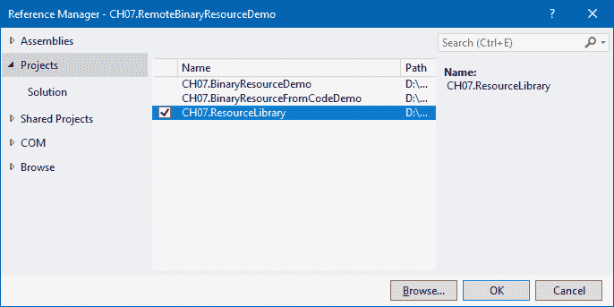

1.  现在，从解决方案资源管理器中，导航到 `CH07.RemoteBinaryResourceDemo` 项目的 `MainWindow.xaml` 文件，并在 `Grid` 中添加以下图像：

```cs
<Image Source="/CH07.ResourceLibrary;component/
Images/image1.png"/> 
```

1.  让我们编译解决方案并运行应用程序。您将看到应用程序窗口启动时带有一个图像，该图像位于不同的程序集。以下是基于我们的演示应用程序的截图：


## 它是如何工作的...

当您使用引用的程序集时，WPF 打包 URI 会将其识别为 `/AssemblyReference;component/ResourceName` 格式。在上面的示例中，**AssemblyReference** 是程序集的名称，在我们的情况下是 `CH07.ResourceLibrary`，而 **ResourceName** 是相对于项目组件的资源完整路径。

## 还有更多...

`AssemblyReference` 还可能包括版本和/或公钥标记（如果程序集是强命名的）。版本通过在其前缀为 `v,` 来表示，如下面的示例所示：

```cs
/<AssemblyName>;v<VersionNo>;<Token>;component/<ResourcePath> 

"/CH07.ResourceLibrary;v1.0;3ca44a7f7ca54f49;component/Images/image1.png" 
```

这不适用于标记为 `Build Action` 为 `Content` 的资源。要使用它，我们需要使用带有 `siteOfOrigin` 基的完整打包 URI，如下所示：

```cs
<Image Source="pack://siteOfOrigin:,,,/Images/image1.png" /> 
```

请注意，当使用 `siteOfOrigin` 时，Visual Studio 设计器窗口将无法加载图像，但在运行时这将正常工作。

# 在代码中访问二进制资源

在 XAML 中访问二进制资源非常简单，但有一个选项可以从代码背后读取二进制资源。在这个菜谱中，我们将学习如何在代码中读取二进制资源并将其设置在 UI 中。我们将使用图像作为示例。

## 准备工作

打开你的 Visual Studio IDE。让我们从创建一个名为 `CH07.BinaryResourceFromCodeDemo` 的新 WPF 项目开始。

## 如何做到这一点...

按照以下步骤读取图像文件，将其嵌入为 `Resource` 并在 UI 中显示：

1.  首先，在项目中创建一个名为 `Images` 的文件夹，并在其中添加一个图像。让我们将其命名为 `image1.png`。

1.  通过导航到解决方案资源管理器打开 `MainWindow.xaml` 文件。

1.  在 `Grid` 面板内添加一个图像标签并命名为 `img`：

```cs
<Grid> 
    <Image x:Name="img" /> 
</Grid>
```

1.  打开 `MainWindow.xaml.cs` 文件，并在类的构造函数中，在 `InitializeComponent()` 调用之后，从图像的资源流中创建 `streamResourceInfo`。以下是获取流信息的代码：

```cs
var streamResourceInfo = Application.GetResourceStream(new Uri("Images/image1.png", UriKind.RelativeOrAbsolute)); 
```

1.  现在我们需要从该流创建 `BitmapImage` 的实例。复制以下内容并将 `streamResourceInfo.Stream` 传递给 `BitmapImage` 的 `StreamSource` 属性：

```cs
var bitmapImage = new BitmapImage(); 
bitmapImage.BeginInit(); 
bitmapImage.CacheOption = BitmapCacheOption.OnLoad; 
bitmapImage.StreamSource = streamResourceInfo.Stream; 
bitmapImage.EndInit(); 
bitmapImage.Freeze(); 
```

1.  现在将 `bitmapImage` 实例设置为图像的 `Source` 属性：

```cs
img.Source = bitmapImage; 
```

1.  这是访问流并将其分配给图像源的完整代码：

```cs
public MainWindow() 
{ 
    InitializeComponent(); 

    var streamResourceInfo = Application.GetResourceStream( 
                              new Uri("Images/image1.png",  
                              UriKind.RelativeOrAbsolute)); 

    var bitmapImage = new BitmapImage(); 
    bitmapImage.BeginInit(); 
    bitmapImage.CacheOption = BitmapCacheOption.OnLoad; 
    bitmapImage.StreamSource = streamResourceInfo.Stream; 
    bitmapImage.EndInit(); 
    bitmapImage.Freeze(); 

    img.Source = bitmapImage; 
}
```

1.  完成后，构建项目并运行它。你会看到分配的图像已加载到应用程序窗口中：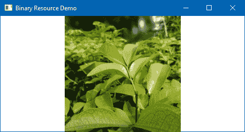

## 它是如何工作的...

静态方法 `Application.GetResourceStream` 提供了一种使用其相对 URI 访问资源的方法，它返回一个 `StreamResourceInfo` 对象。`StreamResourceInfo` 对象的 `Stream` 属性提供了对实际二进制数据的访问，这些数据已被转换为 `BitmapImage` 实例，并设置为图像源属性。

为了使 `Application.GetResourceStream` 方法正常工作，资源必须在 `Build Action` 中标记为 `Resource`。

如果资源已在 `Build Action` 属性中标记为 `Content`，则应使用 `Application.GetContentStream` 方法来获取资源流。

# 在 WPF 中使用静态逻辑资源

WPF 中的逻辑资源是可以跨 Visual Tree 的某个部分或整个应用程序共享和重用的对象。这些可以是颜色、画笔、几何图形、样式或任何其他由 .NET 框架或开发者定义的 .NET 对象（`int`、`string`、`List<T>`、`T` 等）。这些对象通常放置在 `ResourceDictionary` 中。

在这个菜谱中，我们将学习如何使用绑定键 `StaticResource` 来使用逻辑资源。

## 准备工作

确保 Visual Studio 正在运行。基于 WPF 应用程序模板创建一个名为 `CH07.StaticResourceDemo` 的项目。

## 如何做到这一点...

按照以下步骤创建逻辑资源并在应用程序窗口中使用它：

1.  打开 `MainWindow.xaml` 文件并将 `Grid` 替换为一个水平的 `StackPanel`。

1.  在`StackPanel`内部插入一个`Border`控件。将其`Height`和`Width`属性分别设置为`80`和`150`：

```cs
<Border Height="80" 
        Width="150" 
        Margin="8"> 
</Border> 
```

1.  让我们在`Border`控件中添加一个背景颜色。我们将使用线性渐变画笔来装饰背景颜色。让我们按照以下方式修改它：

```cs
<Border Height="80" 
        Width="150" 
        Margin="8"> 
    <Border.Background> 
        <LinearGradientBrush> 
            <GradientStop Offset="0" 
                          Color="LightYellow"/> 
            <GradientStop Offset="0.2" 
                          Color="Yellow"/> 
            <GradientStop Offset=".5" 
                          Color="YellowGreen"/> 
            <GradientStop Offset="1" 
                          Color="Green"/> 
        </LinearGradientBrush> 
    </Border.Background> 
</Border> 
```

1.  将与上一背景相同的边框复制并粘贴到同一面板内部。现在`StackPanel`将具有两个具有相同属性的边框控件。

1.  让我们构建项目并运行它。你会看到两个带有漂亮的渐变颜色的矩形形状作为背景：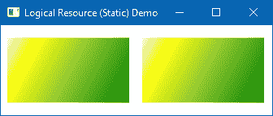

1.  如你所见，我们添加了相同的背景画笔两次来表示颜色；有时这很难管理，并且不必要地增加了 XAML 代码以及复杂性。为了解决这个问题，我们现在可以将画笔对象作为逻辑资源移动，并在同一窗口或整个应用程序中访问它。让我们将其移动到窗口级别。在窗口资源（`Window.Resources`）内插入`LinearGradientBrush`并为其分配一个键（`myLinearBrush`）：

```cs
<Window.Resources> 
    <LinearGradientBrush x:Key="myLinearBrush"> 
        <GradientStop Offset="0" 
                      Color="LightYellow"/> 
        <GradientStop Offset="0.2" 
                      Color="Yellow"/> 
        <GradientStop Offset=".5" 
                      Color="YellowGreen"/> 
        <GradientStop Offset="1" 
                      Color="Green"/> 
    </LinearGradientBrush> 
</Window.Resources> 
```

1.  现在从两个控件中移除背景定义，并用之前提到的画笔的绑定替换它。由于它是在资源中定义的，我们将使用`{StaticResource}`来访问它。以下是面板内边框控件的修改版本：

```cs
<StackPanel Orientation="Horizontal"> 
    <Border Height="80" 
            Width="150" 
            Margin="8" 
            Background="{StaticResource myLinearBrush}"/> 
    <Border Height="80" 
            Width="150" 
            Margin="8" 
            Background="{StaticResource myLinearBrush}"/> 
</StackPanel> 
```

1.  让我们再次运行应用程序。你会看到相同的背景应用于矩形形状的边框控件。在这种情况下，我们只使用了一个画笔的定义。

## 它是如何工作的...

每个从`FrameworkElement`派生的 UI 元素都有一个名为`Resources`的属性，其类型为`ResourceDictionary`。因此，每个元素都可以与其相关联资源。在 XAML 中，我们需要定义`x:Key`属性来访问资源，无论是从 XAML 还是从代码隐藏文件中。

在我们的例子中，我们将`myLinearBrush`定义为`Window`的`ResourceCollection`的元素。因此，它将可以被同一窗口内的任何控件访问。如果你将定义移到`StackPanel`内部，它将可以在该面板内访问：

```cs
<Window.Resources> 
    <LinearGradientBrush x:Key="myLinearBrush"> 
        <GradientStop Offset="0" 
                      Color="LightYellow"/> 
        <GradientStop Offset="0.2" 
                      Color="Yellow"/> 
        <GradientStop Offset=".5" 
                      Color="YellowGreen"/> 
        <GradientStop Offset="1" 
                      Color="Green"/> 
    </LinearGradientBrush> 
</Window.Resources> 
```

要在 XAML 中使用此资源，我们需要使用标记扩展，`{StaticResource}`，以及提供的资源键，`Background="{StaticResource myLinearBrush}"`，这将在这两者之间创建绑定。

## 还有更多...

从代码隐藏文件中管理逻辑资源是可能的。你可以调用`FindResource`方法，并传递资源键给它，以获取资源的实例。以下是如何查找名为`myLinearBrush`的资源的方法：

```cs
var resource = FindResource("myLinearBrush") as Brush; 
```

你也可以通过编程方式向集合中添加或删除资源。调用`Resources.Add`和`Resources.Remove`方法来添加或删除特定资源，如下面的代码片段所示：

```cs
Resources.Add("myBrush", new SolidColorBrush(Colors.Red)); 
Resources.Remove("myBrush"); 
```

由于`Resources`属性基本上是一个`Dictionary`对象，确保在执行任何操作之前，例如`Add`/`Remove`，检查指定的键是否已经存在。

# 在 WPF 中使用动态逻辑资源

在前面的菜谱中，我们学习了如何使用`StaticResource`标记扩展使用逻辑资源。在本菜谱中，我们将学习如何使用`DynamicResource`标记扩展，并了解它们之间的区别。

## 准备工作

通过创建一个新的项目开始。打开 Visual Studio IDE 并创建一个名为`CH07.DynamicResourceDemo`的新 WPF 应用程序项目。

## 如何操作...

按照以下步骤使用逻辑资源动态修改资源值：

1.  打开`MainWindow.xaml`文件并将`Grid`替换为`StackPanel`。

1.  在`StackPanel`内部添加一个边框并设置其尺寸。

1.  在面板内部添加另一个`StackPanel`并在其中添加一组三个单选按钮。将它们标记为`Red`、`Green`和`Blue`。以下是完整的 XAML 代码：

```cs
<StackPanel Orientation="Horizontal"> 
    <Border Height="80" 
            Width="150" 
            Margin="8"/> 
    <StackPanel Margin="10"> 
        <RadioButton GroupName="colorGroup" 
                     Content="Red" 
                     Margin="4"/> 
        <RadioButton GroupName="colorGroup" 
                     Content="Green" 
                     IsChecked="True" 
                     Margin="4"/> 
        <RadioButton GroupName="colorGroup" 
                     Content="Blue" 
                     Margin="4"/> 
    </StackPanel> 
</StackPanel> 
```

1.  现在向窗口资源添加一个`LinearGradientBrush`并将其键名设置为`myLinearBrush`。添加一些`GradientStop`来定义一个漂亮的渐变画笔，如下所示：

```cs
<Window.Resources> 
    <LinearGradientBrush x:Key="myLinearBrush"> 
        <GradientStop Offset="0" 
                      Color="LightYellow"/> 
        <GradientStop Offset="1" 
                      Color="Green"/> 
    </LinearGradientBrush> 
</Window.Resources>
```

1.  是时候将定义的画笔绑定到`Border`控件上了。修改 XAML 以在它们之间创建一个`StaticResource`绑定，如下所示：

```cs
<Border Height="80" 
        Width="150" 
        Margin="8" 
        Background="{StaticResource myLinearBrush}"/> 
```

1.  为所有三个单选按钮注册`Checked`事件，这样我们就可以在状态改变时执行一些更改：

```cs
<StackPanel Orientation="Horizontal"> 
    <Border Height="80" 
            Width="150" 
            Margin="8" 
            Background="{StaticResource myLinearBrush}"/> 
    <StackPanel Margin="10"> 
        <RadioButton GroupName="colorGroup" 
                     Content="Red" 
                     Margin="4" 
                     Checked="OnRedRadioChecked"/> 
        <RadioButton GroupName="colorGroup" 
                     Content="Green" 
                     IsChecked="True" 
                     Margin="4" 
                     Checked="OnGreenRadioChecked"/> 
        <RadioButton GroupName="colorGroup" 
                     Content="Blue" 
                     Margin="4" 
                     Checked="OnBlueRadioChecked"/> 
    </StackPanel> 
</StackPanel> 
```

1.  导航到`MainWindow.xaml.cs`并为所有单选按钮的`Checked`事件添加以下实现：

```cs
private void OnRedRadioChecked(object sender,  
 RoutedEventArgs e) 
{ 
    var brush = Resources["myLinearBrush"]; 
    if (brush is LinearGradientBrush lBrush) 
    { 
        lBrush = new LinearGradientBrush 
        { 
            GradientStops = new GradientStopCollection 
            { 
                new GradientStop
                (Colors.LightGoldenrodYellow, 0), 
                new GradientStop(Colors.Red, 1) 
            } 
        }; 

        Resources["myLinearBrush"] = lBrush; 
    } 
} 

private void OnGreenRadioChecked(object sender,  
 RoutedEventArgs e) 
{ 
    var brush = Resources["myLinearBrush"]; 
    if (brush is LinearGradientBrush lBrush) 
    { 
        lBrush = new LinearGradientBrush 
        { 
            GradientStops = new GradientStopCollection 
            { 
                new GradientStop(Colors.LightYellow, 0), 
                new GradientStop(Colors.Green, 1) 
            } 
        }; 

        Resources["myLinearBrush"] = lBrush; 
    } 
} 

private void OnBlueRadioChecked(object sender,  
 RoutedEventArgs e) 
{ 
    var brush = Resources["myLinearBrush"]; 
    if (brush is LinearGradientBrush lBrush) 
    { 
        lBrush = new LinearGradientBrush 
        { 
            GradientStops = new GradientStopCollection 
            { 
                new GradientStop(Colors.LightBlue, 0), 
                new GradientStop(Colors.Blue, 1) 
            } 
        }; 

        Resources["myLinearBrush"] = lBrush; 
    } 
}
```

1.  一旦完成这些操作，运行应用程序。你会看到一个带有三个单选按钮的矩形。默认情况下，绿色单选按钮将被选中。将选择更改为红色或蓝色以观察行为。你会看到颜色始终为绿色，无论选择如何！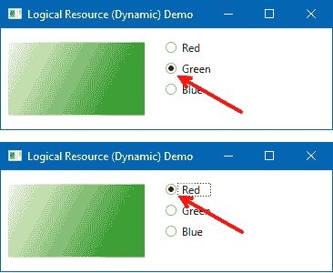

1.  让我们关闭应用程序并导航回`MainWindow.xaml`。

1.  将`StaticResource`更改为`DynamicResource`，如下面的代码片段所示：

```cs
<Border Height="80" 
        Width="150" 
        Margin="8" 
        Background="{DynamicResource myLinearBrush}"/>
```

1.  现在，再次运行应用程序。默认情况下，绿色将被选中，矩形将具有绿色渐变背景。将选择更改为红色或蓝色以观察颜色变化！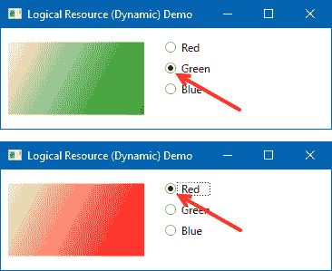

## 它是如何工作的...

当你将逻辑资源作为`StaticResource`绑定时，它会在构造时触发绑定。另一方面，`DynamicResource`标记扩展仅在需要时动态绑定资源。

在前面的示例中，当我们将资源注册到`Border`控制的`Background`属性作为`StaticResource`时，即使我们在选择单选按钮时用新对象替换了资源，我们也没有在 UI 中看到变化。但是当我们将绑定更改为`DynamicResource`时，变化会自动反映出来。这是因为动态资源绑定会在对象更改时自动刷新。但是这与静态资源绑定不同，因为它始终引用旧对象。

## 更多内容...

当指定的`x:Key`对象不存在时，`StaticResource`绑定会在设计时抛出错误。另一方面，`DynamicResource`不会抛出任何异常，并且会显示为空白。稍后，当它找到`Key`时，它会将自己与该资源绑定。

应该在大多数情况下使用`StaticResource`，除非需要动态替换资源。`DynamicResource`应该由可以轻松交换资源的主题使用。

在复杂的 UI 上拥有大量的`DynamicResource`可能会影响 UI 的性能。 wherever possible，将它们标记为`StaticResource`。

# 管理逻辑资源

单个应用程序中可能存在多种类型的逻辑资源，将它们放置在单个 XAML 文件（例如，`App.xaml`）中在维护时会增加问题。为了解决这个问题，你可以将不同类型的资源分别放入它们各自的文件中，并在`App.xaml`中引用它们。

在这个菜谱中，我们将通过一个简单的示例学习如何管理这些逻辑资源。虽然这将是通过单个文件展示的，但你也可以创建单独的文件并引用它们。

## 准备工作

假设你已经打开了 Visual Studio，现在创建一个名为`CH07.ManagingLogicalResourceDemo`的新 WPF 应用程序项目。

## 如何操作...

按照以下简单步骤创建单独的资源文件并在应用程序中引用它们：

1.  由于我们想要创建一个单独的资源文件，我们需要创建一个类型为资源字典的文件。在解决方案资源管理器中，右键单击项目节点并创建一个名为`Themes`的新文件夹。

1.  现在右键单击“主题”文件夹，并从上下文菜单中选择添加 | 资源字典...：

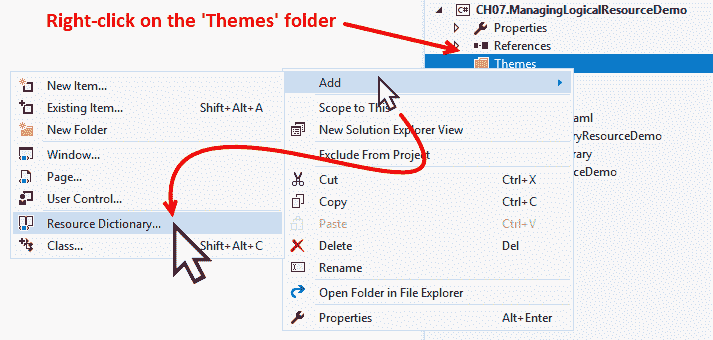

1.  在“添加新项”对话框中，确保选择了资源字典（WPF）模板。将其命名为`Brushes.xaml`，然后点击添加：

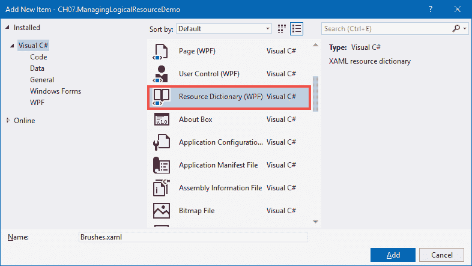

1.  从解决方案资源管理器打开新创建的文件`Brushes.xaml`，并在`ResourceDictionary`元素内添加以下具有`x:Key`名为`myLinearBrush`的`LinearGradientBrush`。你可以在`ResourceDictionary`内添加多个元素以拥有资源集合。确保为每个元素分配一个唯一的键名：

```cs
<LinearGradientBrush x:Key="myLinearBrush"> 
    <GradientStop Offset="0" 
                  Color="Yellow"/> 
    <GradientStop Offset="1" 
                  Color="OrangeRed"/> 
</LinearGradientBrush>
```

1.  打开 `MainWindow.xaml` 并将 `Grid` 替换为以下标记，以便在内部有一个 `Border` 控件。设置元素的大小并将 `Background` 属性绑定到我们创建的 `myLinearBrush`：

```cs
<Grid> 
    <Border Height="100" 
            Width="280" 
            Margin="8" 
            Background="{DynamicResource myLinearBrush}"/> 
</Grid> 
```

1.  如果你现在运行应用程序，你将看不到窗口内的任何元素，因为文件映射尚未创建。由于我们有 `DynamicResource` 绑定，你不会看到任何错误。

1.  让我们关闭应用程序并打开 `App.xaml` 文件。

1.  在 `Application.Resources` 内部添加一个名为 `ResourceDictionary` 的元素。在这个元素内部，创建另一个名为 `ResourceDictionary.MergedDictionaries` 的元素，并加载我们创建的 `ResourceDictionary`。以下是它的样子：

```cs
<Application.Resources> 
    <ResourceDictionary> 
        <ResourceDictionary.MergedDictionaries> 
            <ResourceDictionary  
                 Source="Themes/Brushes.xaml" /> 
        </ResourceDictionary.MergedDictionaries> 
    </ResourceDictionary> 
</Application.Resources> 
```

1.  现在再次运行应用程序。你将在应用程序窗口中看到一个矩形形状的边框控件，它具有我们创建在 `Brushes.xaml` 文件中的漂亮渐变颜色。以下是应用程序窗口的截图！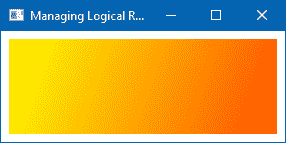

## 它是如何工作的...

`ResourceDictionary` 可以使用其 `MergedDictionaries` 属性（`ResourceDictionary.MergedDictionaries`）加载一个或多个资源字典，它是一个集合。不一定需要引用其他资源字典，但它也可以有自己的资源：

```cs
<Application.Resources> 
    <ResourceDictionary> 
        <SolidColorBrush Color="Red" x:Key="redBrush" /> 
        <SolidColorBrush Color="Green" x:Key="greenBrush" /> 
        <SolidColorBrush Color="Blue" x:Key="blueBrush" /> 
        <ResourceDictionary.MergedDictionaries> 
            <ResourceDictionary  
                     Source="Themes/SolidBrushes.xaml" /> 
            <ResourceDictionary  
                     Source="Themes/GradientBrushes.xaml" /> 
            <ResourceDictionary Source="Themes/Fonts.xaml" /> 
        </ResourceDictionary.MergedDictionaries> 
    </ResourceDictionary> 
</Application.Resources> 
```

`ResourceDictionary` 元素的 `Source` 属性必须指向 `ResourceDictionary` 的位置。如果该位置在子文件夹中，则必须包含该子文件夹。

## 还有更多...

当存在两个或更多来自多个合并字典且具有相同键名的资源时，它不会抛出任何错误或异常。相反，它将加载元素树中最后添加的 `Resource Dictionary` 中的资源。

# 使用用户选择的颜色和字体

有时，在应用程序 UI 中使用系统主题是有用的，以便在操作系统和应用程序之间同步颜色和字体流。在这些情况下，我们可以动态加载这些值并将它们应用到我们的 UI 元素上。这是通过访问 `SystemColors` 和 `SystemFonts` 类中的某些特殊资源键来实现的。在本教程中，我们将学习如何使用它们。

## 准备工作

让我们从创建一个名为 `CH07.SystemResourcesDemo` 的新项目开始。确保从可用列表中选择 WPF 应用程序模板。

## 如何操作...

我们现在将构建一个使用系统颜色和字体的应用程序。按照以下步骤进行：

1.  打开 `MainWindow.xaml` 文件，并在 `Grid` 面板内插入以下 `Rectangle`：

```cs
<Rectangle Height="100" 
           Width="300"/> 
```

1.  我们希望用桌面刷的颜色填充矩形。添加以下标记来填充矩形的背景颜色 `Fill="{DynamicResource {x:Static SystemColors.DesktopBrushKey}}"`。现在 XAML 将看起来如下所示：

```cs
<Rectangle Fill="{DynamicResource {x:Static SystemColors.DesktopBrushKey}}" 
           Height="100" 
           Width="300"/> 
```

1.  让我们现在运行应用程序。您将看到矩形已选择一个背景颜色。这是基于您在系统中为`DesktopBrush`选择的设置！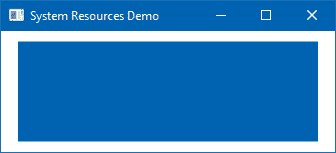

1.  为了确认这一点，右键单击您的桌面并选择个性化。如果您正在使用 Windows 10，您将看到设置应用导航到背景设置页面。检查背景设置中选定的颜色以及应用到您应用程序的颜色。两者都将相同：

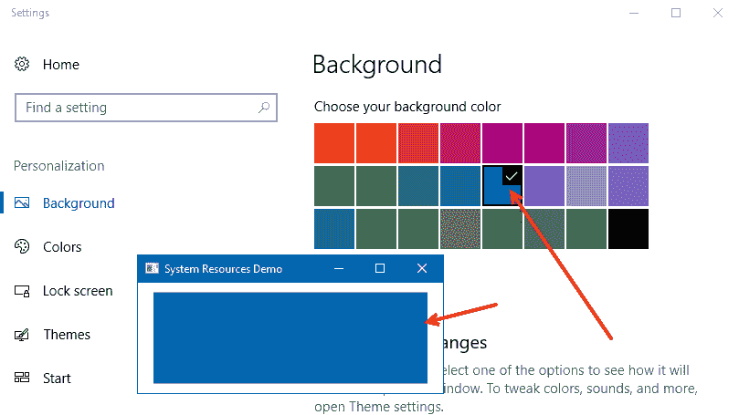

1.  让我们从背景设置中选择不同的颜色。您将看到颜色将自动应用到您的应用程序上：

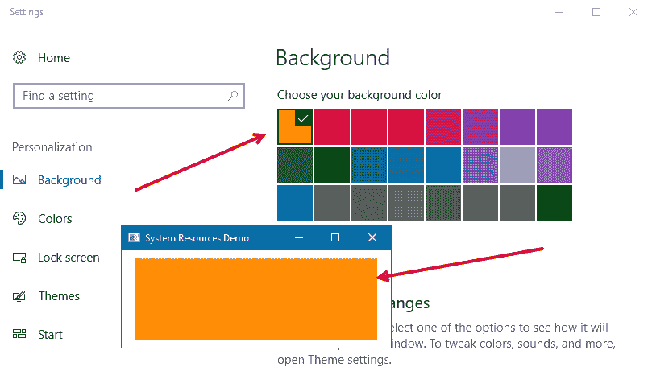

1.  现在选择加号符号（自定义颜色）以选择调色板中默认颜色的另一种颜色！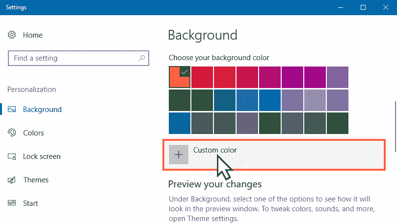

1.  如此所示，为您的桌面选择一个自定义背景颜色并点击完成！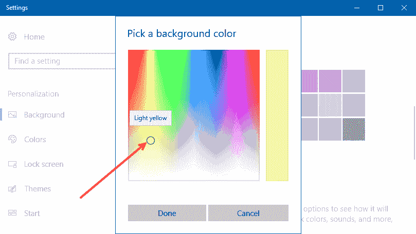

1.  现在检查应用程序窗口。您将看到在设置应用中选定的颜色已应用到矩形背景上。导航到您的桌面，同样的颜色也将应用到那里！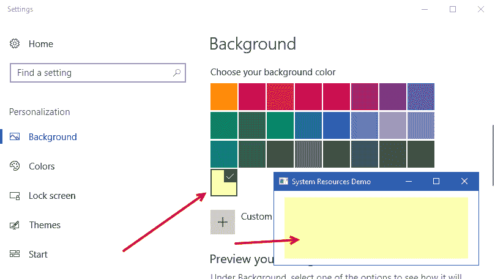

## 它是如何工作的...

向资源绑定提供一个`string`类型的键名不是强制的。您也可以向绑定提供一个静态对象。在这个例子中，我们使用了静态值`SystemColors.DesktopBrushKey`与`{x:Static}`标记扩展结合使用：

```cs
Fill="{DynamicResource {x:Static SystemColors.DesktopBrushKey}}" 
```

如同我们之前在菜谱中学到的动态资源绑定，这个例子也遵循了同样的方法，因此您可以看到选定的颜色已自动应用到矩形上。

在`SystemColors`类下有许多静态键，您可以在设计中引用它们。这通常在您希望应用程序与操作系统的主题保持同步时非常有用。

## 更多内容...

就像`SystemColors`一样，我们还有`SystemFonts`类，它公开了与字体相关的静态属性。您可以从系统调色板定义`FontFamily`、`FontSize`和`FontWeight`样式，如下所示：

```cs
<TextBlock FontFamily="{DynamicResource {x:Static SystemFonts.CaptionFontFamily}}" 
           FontSize="{DynamicResource {x:Static SystemFonts.CaptionFontSizeKey}}" 
           FontWeight="{DynamicResource {x:Static SystemFonts.CaptionFontWeightKey}}" 
           Text="Hello World!"/> 
```

# 使用 MVVM 模式构建应用程序

**MVVM**代表**模型**、**视图**和**ViewModel**，这是一种促进将**GUI**（**图形用户界面**）与业务逻辑分离的模式。这意味着设计师和开发者可以一起工作，而不会遇到任何麻烦。

在这个模式中，模型是帮助通过 ViewModel 显示在视图中的数据。在这个菜谱中，我们将学习如何创建一个 MVVM 应用程序，将 ViewModel 中的属性公开给相关视图，并在 XAML 代码后文件中不编写任何代码的情况下显示记录。

## 准备工作

让我们打开 Visual Studio IDE 并创建一个新的项目，命名为`CH07.MVVMDemo`，基于 WPF 应用程序模板。

## 如何操作...

一旦项目创建完成，按照以下步骤构建符合 MVVM 标准的项目（非强制），并使用 MVVM 模式构建一个示例演示：

1.  每个 WPF 应用程序项目都有一个`MainWindow.xaml`。从解决方案资源管理器中，让我们删除默认文件。

1.  在项目中创建三个名为`Models`、`Views`和`ViewModels`的文件夹。这只是为了创建所有代码文件的正确结构。

1.  现在，右键单击`Views`文件夹，通过上下文菜单路径添加 | 窗口...创建一个新的`Window`，并将其命名为`MainWindow.xaml`。

1.  打开`App.xaml`文件并修改`StartupUri`以指向正确的文件。如图所示，将`StartupUri`更改为`ViewsMainWindow.xaml`：

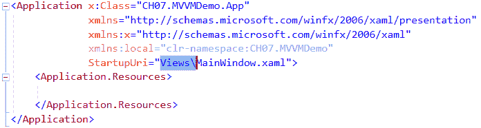

1.  打开`MainWindow.xaml`文件并替换`Grid`为`DockPanel`。

1.  在`Dock`内部添加两个`StackPanel`并设计 UI，如下所示：

```cs
<DockPanel Margin="10"> 
    <StackPanel Orientation="Vertical" 
                DockPanel.Dock="Left"> 
        <ListBox Width="180" Height="110"> 
        </ListBox> 
        <TextBlock> 
        </TextBlock> 
    </StackPanel> 
    <StackPanel Orientation="Vertical" 
                Margin="4 0" 
                DockPanel.Dock="Right"> 
        <TextBlock Text="Firstname"/> 
        <TextBox Text=""/> 
        <TextBlock Text="Lastname"/> 
        <TextBox Text=""/> 
        <Button Content="Add" 
                Margin="0 8"/> 
    </StackPanel> 
</DockPanel> 
```

1.  如果你现在运行应用程序，你会看到应用程序窗口看起来像这样：

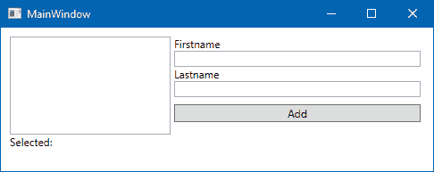

1.  现在，右键单击`Models`文件夹并创建一个名为`UserModel.cs`的类文件，并将类修改为具有两个类型为`string`的属性。如图所示，将它们命名为`Firstname`和`Lastname`：

```cs
public class UserModel 
{ 
    public string Firstname { get; set; } 
    public string Lastname { get; set; } 
} 
```

1.  右键单击`ViewModels`文件夹并添加另一个类文件。将其命名为`MainWindowViewModel.cs`。

1.  打开`MainWindowViewModel.cs`文件并在其中添加以下命名空间：

```cs
using CH07.MVVMDemo.Models; 
using System.Collections.ObjectModel; 
using System.ComponentModel; 
```

1.  现在，从`System.ComponentModel`命名空间下的`INotifyPropertyChanged`接口继承`MainWindowViewModel`类。

```cs
public class MainWindowViewModel : INotifyPropertyChanged 
```

1.  如我们所知，`INotifyPropertyChanged`接口公开了`PropertyChanged`事件处理程序；我们需要在类内部注册该处理程序。将以下代码复制以实现接口：

```cs
public event PropertyChangedEventHandler PropertyChanged; 
public void OnPropertyChanged(string propertyName) 
{ 
    PropertyChanged?.Invoke(this,  
        new PropertyChangedEventArgs(propertyName)); 
}
```

1.  完成此操作后，在`ViewModel`内部创建两个属性。一个命名为`SelectedUser`，类型为`UserModel`，另一个命名为`UserCollection`，类型为`ObservableCollection<UserModel>`。确保在两个设置器中调用`OnPropertyChanged(str)`方法，以便自动将值更改报告给 UI。以下是我们在演示中将要引用的属性：

```cs
private UserModel m_selectedUser; 
public UserModel SelectedUser 
{ 
    get { return m_selectedUser; } 
    set 
    { 
        m_selectedUser = value; 
        OnPropertyChanged("SelectedUser"); 
    } 
} 

private ObservableCollection<UserModel> m_userCollection; 
public ObservableCollection<UserModel> UserCollection 
{ 
    get { return m_userCollection; } 
    set 
    { 
        m_userCollection = value; 
        OnPropertyChanged("UserCollection"); 
    } 
} 
```

1.  在 ViewModel 的构造函数中，使用一些示例数据初始化`UserCollection`属性：

```cs
public MainWindowViewModel() 
{ 
    UserCollection = new ObservableCollection<UserModel> 
    { 
        new UserModel 
        { 
            Firstname = "User", Lastname = "One" 
        }, 
        new UserModel 
        { 
            Firstname = "User", Lastname = "Two" 
        }, 
        new UserModel 
        { 
            Firstname = "User", Lastname = "Three" 
        }, 
        new UserModel 
        { 
            Firstname = "User", Lastname = "Four" 
        }, 
    }; 
} 
```

1.  当`viewmodel`准备就绪，拥有我们需要的所有属性时，让我们将其与视图关联起来作为其`DataContext`。你可以从代码后端或从 XAML 本身进行此操作。由于我们的目标是使代码后端尽可能小，让我们从 XAML 开始。打开`MainWindow.xaml`并添加以下`XMLNS`条目，以便我们可以访问我们创建的`viewmodel`：

1.  在`Window.Resources`标签内，将我们的`viewmodel`作为资源添加，并定义为`x:Key="ViewModel"`，如下所示：

```cs
<Window.Resources> 
    <viewmodels:MainWindowViewModel x:Key="ViewModel"/> 
</Window.Resources> 
```

1.  由于 `viewmodel` 已注册为资源，将 `DockPanel` 的 `DataContext` 设置为我们定义的 `ViewModel`。绑定需要使用 `{StaticResource}` 标记扩展来完成。以下是它的样子：

```cs
<DockPanel DataContext="{StaticResource ViewModel}" 
           Margin="10"> 
```

1.  现在将 `ListBox` 控件的 `ItemsSource` 和 `SelectedItem` 属性设置为与 `viewmodel` 内部的属性进行数据绑定。

```cs
<ListBox Width="180" Height="110" 
         ItemsSource="{Binding UserCollection}" 
         SelectedItem="{Binding SelectedUser}">
```

1.  类似地，将 `TextBlock` 的 `DataContext` 属性设置为 `SelectedUser` 并创建数据绑定，如图所示，以显示选定的用户全名：

```cs
<TextBlock DataContext="{Binding SelectedUser}"> 
    <Run Text="Selected:"/> 
    <Run Text="{Binding Firstname}"/> 
    <Run Text="{Binding Lastname}"/> 
</TextBlock> 
```

1.  现在让我们运行这个应用程序。你将看到以下 UI，其中 `ListBox` 控件中的值将显示为 `model` 类的完全限定名称：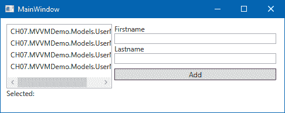

1.  为了解决这个问题，我们需要创建 `ListBox` 的 `DataTemplate`。将 `ListBox.ItemTemplate` 定义如下，以有一个包含用户全名的 `TextBlock`，通过连接 `Firstname` 和 `Lastname` 属性：

```cs
<ListBox.ItemTemplate> 
    <DataTemplate> 
        <TextBlock> 
            <Run Text="{Binding Firstname}"/> 
            <Run Text="{Binding Lastname}"/> 
        </TextBlock> 
    </DataTemplate> 
</ListBox.ItemTemplate>
```

1.  一旦完成，应用程序 UI 的 XAML 代码将类似于以下内容：

```cs
<StackPanel Orientation="Vertical" 
            DockPanel.Dock="Left"> 
    <ListBox Width="180" Height="110" 
             ItemsSource="{Binding UserCollection}" 
             SelectedItem="{Binding SelectedUser}"> 
        <ListBox.ItemTemplate> 
            <DataTemplate> 
                <TextBlock> 
                <Run Text="{Binding Firstname}"/> 
                <Run Text="{Binding Lastname}"/> 
                </TextBlock> 
            </DataTemplate> 
        </ListBox.ItemTemplate> 
    </ListBox> 
    <TextBlock DataContext="{Binding SelectedUser}"> 
        <Run Text="Selected:"/> 
        <Run Text="{Binding Firstname}"/> 
        <Run Text="{Binding Lastname}"/> 
    </TextBlock> 
</StackPanel> 
```

1.  现在让我们运行应用程序。你将在 `ListBox` 中看到正确的值：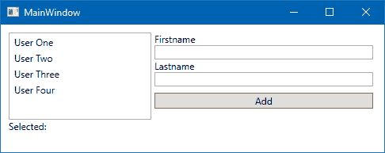

1.  选择 `ListBox` 中的任何项，以在 `TextBox` 中查看选定的用户名。更改选择以自动更新 UI：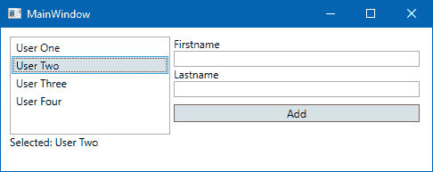

## 它是如何工作的...

MVVM 由三个重要部分组成——**Model**、**View** 和 **ViewModel**。*Model* 代表数据；*View* 是实际的 UI，它显示模型的有关部分；*ViewModel* 是将所需数据分发给视图的机制。ViewModel 基本上公开属性和命令，并维护视图的相关状态。

如果我们将 MVVM 模式与自行车（如下面的截图所示）进行比较，自行车的 **Body** 是 **View**，**Fuel** 是 **Model**，自行车的 **Engine** 是 **ViewModel**，它通过燃烧/使用模型（Fuel）来移动 View（自行车车身）：

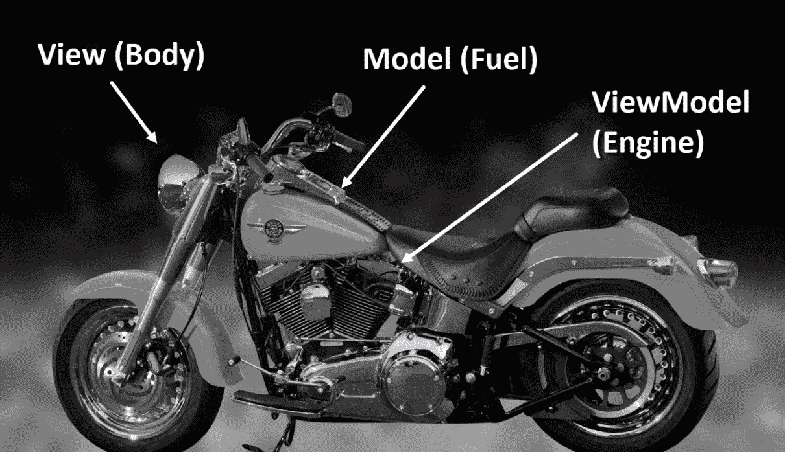

在我们的应用程序中，我们使用了 `DataContext` 来定义 View 和 ViewModel 之间的绑定，然后我们使用它来访问属性。如果你现在导航到 `MainWindow.xaml.cs` 文件，你将看不到除了代码后置类的构造函数之外的其他代码。

在 MVVM 模式下，我们的目的是保持代码后置文件（`MainWindow.xaml.cs`）的代码尽可能少（或更少），以便减少 UI 和代码之间的直接绑定。请注意，MVVM 不是一个框架，但在使用此模式时，你可以创建一个框架。例如，来自 **GalaSoft** 的 **MVVMLight** ([`www.mvvmlight.net`](http://www.mvvmlight.net)) 提供了一个完全定制的框架，你可以在应用程序中使用它，以保持开发无烦恼。

# 在 WPF 应用程序中使用路由命令

**路由命令**用于在元素层次结构中导航路径。这个过程也被称为冒泡和隧道。`RoutedCommand` 类实现了 `ICommand` 接口，并允许将输入手势，如鼠标输入和键盘快捷键，附加到目标。

在本配方中，我们将通过一个简单的示例学习如何使用路由命令。

## 准备工作

要处理这个配方，我们将使用之前的 MVVM 示例应用程序。启动你的 Visual Studio IDE 并打开项目 `CH07.MVVMDemo`。在这个例子中，我们将使用 `RoutedCommand` 来处理添加按钮的点击事件。

## 如何实现...

按照以下简单步骤将路由命令注册到按钮点击并执行操作：

1.  从解决方案资源管理器中，右键单击项目节点并创建一个名为 `Commands` 的文件夹。

1.  在“命令”文件夹上右键单击，并按照“添加 | 类...”上下文菜单路径创建一个名为 `RoutedCommands.cs` 的新类。

1.  在类实现内部，声明一个类型为 `RoutedCommand` 的静态成员，并将其命名为 `AddCommand`。以下是代码实现：

```cs
public class RoutedCommands 
{ 
    public static RoutedCommand AddCommand =  
                            new RoutedCommand(); 
} 
```

1.  添加以下命名空间以解析 `RoutedCommand` 类：

```cs
using System.Windows.Input; 
```

1.  完成这些后，导航到 `MainWindowViewModel.cs` 文件，该文件位于 `ViewModels` 文件夹下，并添加一个名为 `NewUserDetails` 的 `UserModel` 类型属性。我们将使用此属性将 UI 中存在的 `TextBox` 控件的 `Text` 属性进行绑定。属性实现如下：

```cs
private UserModel m_newUserDetails; 
public UserModel NewUserDetails 
{ 
    get { return m_newUserDetails; } 
    set 
    { 
        m_newUserDetails = value; 
        OnPropertyChanged("NewUserDetails"); 
    } 
} 
```

1.  现在，在我们的 ViewModel 构造函数内部，初始化 `NewUserDetails` 属性：

```cs
public MainWindowViewModel() 
{ 
    UserCollection = new ObservableCollection<UserModel> 
    { 
        new UserModel 
        { 
            Firstname = "User", Lastname = "One" 
        }, 
        new UserModel 
        { 
            Firstname = "User", Lastname = "Two" 
        }, 
        new UserModel 
        { 
            Firstname = "User", Lastname = "Three" 
        }, 
        new UserModel 
        { 
            Firstname = "User", Lastname = "Four" 
        }, 
    }; 

    NewUserDetails = new UserModel(); 
} 
```

1.  导航到 `MainWindow.xaml`，它位于 `Views` 文件夹下。按照以下方式修改 XAML，为 `StackPanel` 设置 `DataContext` 并与 `TextBox` 控件创建数据绑定。确保将数据绑定模式设置为 `TwoWay`，否则代码将无法接收到从 UI 收到的更新值：

```cs
<StackPanel Orientation="Vertical" 
            Margin="4 0" 
            DockPanel.Dock="Right" 
            DataContext="{Binding NewUserDetails}"> 
    <TextBlock Text="Firstname"/> 
    <TextBox Text="{Binding Firstname, Mode=TwoWay}"/> 
    <TextBlock Text="Lastname"/> 
    <TextBox Text="{Binding Lastname, Mode=TwoWay}"/> 
    <Button Content="Add" 
            Margin="0 8"/> 
</StackPanel> 
```

1.  现在将以下 `XMLNS` 属性添加到 XAML 页面，以便我们可以访问 `CH07.MVVMDemo.Commands` 命名空间下的类：

```cs

9.  What next? We need to create the command binding under the `Window` tag. Add the following XAML code block inside the `Window` tag:

```

<Window.CommandBindings>

    <CommandBinding Command="{x:Static commands:RoutedCommands.AddCommand}"

                    CanExecute="CanExecute_AddCommand"

                    Executed="Execute_AddCommand"/>

</Window.CommandBindings>

```cs

10.  Register the `CanExecute` and `Executed` events, named `CanExecute_AddCommand` and `Execute_AddCommand,` respectively, inside the code-behind class file, which is `MainWindow.xaml.cs` in our case.
11.  Navigate back to the `MainWindow.xaml` and associate the command with the `Button` control, as follows:

```

<Button Content="Add"

        Margin="0 8"

        Command="{x:Static commands:RoutedCommands.AddCommand}"/>

```cs

12.  The complete markup changes will look like this:

```

<StackPanel Orientation="Vertical"

            Margin="4 0"

            DockPanel.Dock="Right"

            DataContext="{Binding NewUserDetails}">

    <TextBlock Text="Firstname"/>

    <TextBox Text="{Binding Firstname, Mode=TwoWay}"/>

    <TextBlock Text="Lastname"/>

    <TextBox Text="{Binding Lastname, Mode=TwoWay}"/>

    <Button Content="Add"

            Margin="0 8"

            Command="{x:Static commands:RoutedCommands.AddCommand}"/>

</StackPanel>

```cs

13.  Now open the `MainWindow.xaml.cs` file and create a member variable of type `MainWindowViewModel`. Name it `ViewModel` and initialize it as `null`. This will be used to store the reference of the ViewModel from the window resources:

```

private MainWindowViewModel ViewModel = null;

```cs

14.  Inside the constructor, grab the associated `ViewModel` reference from the `Resources`:

```

public MainWindow()

{

    InitializeComponent();

    ViewModel = Resources["ViewModel"] as

                        MainWindowViewModel;

    if (ViewModel == null)

    {

        throw new NullReferenceException("ViewModel

        can't be NULL");

    }

}

```cs

15.  The `CanExecute_AddCommand` event passes an argument of type `CanExecuteRoutedEventArgs`. It contains a property named `CanExecute`, which is responsible for holding a `boolean` value, indicating whether the `System.Windows.Input.RoutedCommand` associated with this event can be executed on the command target. As we have associated the `AddCommand` with the button, `e.CanExecute = true` will enable the button. In other cases, it will be disabled. So, let's modify the `CanExecute_AddCommand` event to implement this logic:

```

private void CanExecute_AddCommand(object sender,

CanExecuteRoutedEventArgs e)

{

    if (ViewModel != null)

    {

        var userDetails = ViewModel.NewUserDetails;

        e.CanExecute =

        !string.IsNullOrWhiteSpace(userDetails.Firstname) &&

        !string.IsNullOrWhiteSpace(userDetails.Lastname);

    }

}

```cs

16.  Once that has been done, we need to implement the `Execute` command. Modify the `Execute_AddCommand` event handler, as follows:

```

private void Execute_AddCommand(object sender,

ExecutedRoutedEventArgs e)

{

    ViewModel.UserCollection.Add(ViewModel.NewUserDetails);

    ViewModel.SelectedUser = ViewModel.NewUserDetails;

    ViewModel.NewUserDetails = new Models.UserModel();

}

```cs

17.  Let's run the application now. You will see that the Add button is disabled. This is because, as per our logic, the `e.CanExecute` property has been set to `false` as both the `TextBox` fields are empty:

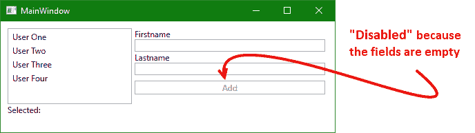

18.  Enter some strings into both the `TextBox` fields and press the *TAB* key. It will automatically enable the button control, as follows:

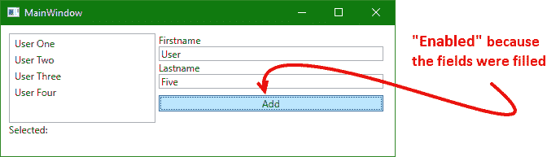

19.  Click on Add, which will add the entered value to the collection and reset the `TextBox` fields. As soon as it resets the fields to empty, the button will automatically become disabled until the user fills the fields again:

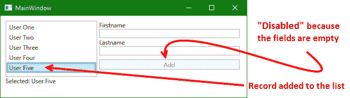
How it works...
The `RoutedCommand` class falls under the `System.Windows.Input` namespace, and provides two methods named `CanExecute` and `Execute`. The `CanExecute` method indicates whether the command is available, whereas the `Execute` method executes the command.
The `RoutedCommand` objects are basically empty shells and can't contain the implementation. For this to work, they look for a `CommandBinding` object from a target element that indicates the handler of the command. It registers the `CanExecute` and `Execute` methods to fire when the command associates with any control.
For example, in this demonstration, the `AddCommand` associated with the `Button` control has a `CommandBinding`, which denotes its `CanExecute` and `Execute` handler as `CanExecute_AddCommand` and `Execute_AddCommand`. When the button fires the `Click` event, it routes to the command binding to execute the associate command interface.

```
