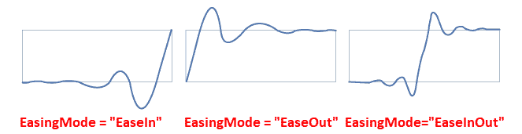

与动画一起工作

在本章中，我们将介绍以下食谱：

+   在渲染时缩放元素

+   在渲染时旋转元素

+   在渲染时倾斜元素

+   在渲染时移动元素

+   对多个变换进行分组

+   创建基于属性的动画

+   创建基于路径的动画

+   创建基于关键帧的动画

+   为动画添加缓动效果

# 简介

**Windows Presentation Foundation** (**WPF**) 因其丰富的 **图形用户界面** (**GUI**) 和布局功能而闻名，这使得您能够创建令人惊叹的桌面应用程序。只需通过动画化 UI 元素、变换、屏幕过渡等，就可以使用动画来创建吸引人的 **用户界面** (**UI**)。

在本章中，我们将学习如何使用**故事板**创建动画。我们首先从帮助您理解各种变换的食谱开始，例如`ScaleTransform`、`RotateTransform`、`SkewTransform`和`TranslateTransform`。然后我们将继续学习各种类型的动画，例如基于属性的动画、基于路径的动画和基于关键帧的动画。

最后，我们将学习 WPF 4 中引入的各种缓动函数，这些函数可用于在您的线性动画上创建缓动效果，使其看起来非线性。

# 在渲染时缩放元素

`ScaleTransform`用于水平或垂直缩放（拉伸或缩小）对象。`ScaleX`属性用于指定沿 *X* 轴拉伸或缩放对象的程度，而`ScaleY`属性用于指定沿 *Y* 轴拉伸或缩放对象的程度。使用`CenterX`和`CenterY`属性，操作基于指向特定坐标点的中心点。

在这个食谱中，我们将学习如何使用缩放变换拉伸或缩小元素。

## 准备工作

首先，打开您的 Visual Studio 实例，创建一个名为`CH08.ScaleTransformDemo`的新 WPF App 项目。

## 如何做到这一点...

按照以下步骤将`Image`控件添加到应用程序 UI 中，并应用`ScaleTransform`以缩放图像：

1.  从解决方案资源管理器中，右键单击项目节点，创建一个新的文件夹。将其命名为`Images`。

1.  现在，右键单击`Images`文件夹，并从您的系统中添加一个现有的图片。将其命名为`image1.png`：


1.  导航到`MainWindow.xaml`页面，并将默认的`Grid`替换为水平`StackPanel`。

1.  在`StackPanel`内部，添加以下`Grid`，包含两个图像控件。两个图像控件都应该指向`Images/image1.png`图像文件。第二个图像将设置一个变换以将图像缩放到 80%，如下面的代码片段所示：

```cs
<Grid> 
    <Image Height="300" Width="260" 
           Margin="4" Opacity="0.2" 
           Source="Images/image1.png"/> 
    <Image Height="300" Width="260" 
           Margin="4" 
           Source="Images/image1.png"> 
        <Image.RenderTransform> 
            <ScaleTransform ScaleX="0.8" 
                            ScaleY="0.8"/> 
        </Image.RenderTransform> 
    </Image> 
</Grid> 
```

1.  让我们在 `StackPanel` 内添加一个额外的 `Grid`，使用以下 XAML 标记，其中两个图片缩放至 50%，并分别标记缩放中心位置为 (`0`,`0`) 和 (`100`,`100`)：

```cs
<Grid Margin="110 0 0 0"> 
    <Image Height="300" Width="260" 
           Margin="4" Opacity="0.2" 
           Source="Images/image1.png"> 
        <Image.RenderTransform> 
            <ScaleTransform ScaleX="0.5" 
                            ScaleY="0.5" 
                            CenterX="0" 
                            CenterY="0"/> 
        </Image.RenderTransform> 
    </Image> 
    <Image Height="300" Width="260" 
           Margin="4" 
           Source="Images/image1.png"> 
        <Image.RenderTransform> 
            <ScaleTransform ScaleX="0.5" 
                            ScaleY="0.5" 
                            CenterX="100" 
                            CenterY="100"/> 
        </Image.RenderTransform> 
    </Image> 
</Grid> 
```

1.  现在让我们运行应用程序并检查屏幕上各种图片的缩放行为。

## 它是如何工作的...

`RenderTransform` 属性可以帮助你为任何 UI 元素设置运行时转换。在这个例子中，我们使用了 `ScaleTransform` 来缩放应用程序窗口上的图片。

当你运行应用程序时，第一个是默认图片，透明度设置为 20%，而第二个图片则缩放至 80%，透明度为 100%。`ScaleX` 和 `ScaleY` 属性用于缩放元素，它使用小数表示比例。例如，0.8 表示 80%，而 1.2 表示缩放 120%：


对于第三张和第四张图片，两者都缩放至 50%。但是，正如你在 UI 上看到的那样，这些图片的位置不同。`CenterX` 和 `CenterY` 属性用于设置缩放中心位置。第三张图片的缩放中心设置为 (`0`,`0`)，而第四张图片的中心位置设置为 (`100`,`100`)：

```cs
<ScaleTransform ScaleX="0.5" 
                ScaleY="0.5" 
                CenterX="100" 
                CenterY="100"/> 
```

# 在渲染时旋转元素

当你在运行时想要旋转一个元素时，使用 `RotateTransform`。它围绕由 `CenterX` 和 `CenterY` 表示的中心位置旋转元素，角度由 `Angle` 属性指定的度数。

让我们学习如何使用 `RotateTransform` 在指定角度旋转 UI 元素。在这个菜谱中，我们将讨论这一点。

## 准备工作

打开 Visual Studio 并创建一个名为 `CH08.RotateTransformDemo` 的新项目。确保在创建项目时选择 WPF App 模板。

## 如何做到这一点...

按照此处提到的步骤应用旋转到 `Image` 控件：

1.  从解决方案资源管理器中，右键单击项目节点并创建一个新的文件夹。将其命名为 `Images`。

1.  现在，右键单击 `Images` 文件夹并从你的系统中添加一个现有图片。命名为 `image1.png`。

1.  打开 `MainWindow.xaml` 文件并将现有的 `Grid` 替换为一个水平的 `StackPanel`。

1.  在 `StackPanel` 内插入以下 XAML 标记来添加两个图片到应用程序窗口。第一个图片的透明度设置为 20%，第二个图片将 `RotateTransform` 设置为 45 度角：

```cs
<Image Height="300" Width="260" 
       Margin="4" Opacity="0.2" 
       Source="Images/image1.png"/> 
<Image Height="300" Width="260" 
       Margin="4" 
       Source="Images/image1.png"> 
    <Image.RenderTransform> 
        <RotateTransform Angle="45"/> 
    </Image.RenderTransform> 
</Image> 
```

1.  让我们在 `StackPanel` 内添加一个额外的 `Grid`。

1.  将另外两张图片添加到新的 `Grid` 面板中。将两张图片的 `RenderTransform` 属性设置为具有 `RotateTransform`，角度为 `45` 度。

1.  如以下 XAML 片段所示，使用 `CenterX` 和 `CenterY` 属性设置图像旋转的中心位置。在这个演示中，我们将设置 (`0`,`0`) 和 (`30`,`30`) 作为相应图像的旋转中心：

```cs
<Grid Margin="80 0 0 0"> 
    <Image Height="300" Width="260" 
           Margin="4" Opacity="0.2" 
           Source="Images/image1.png"> 
        <Image.RenderTransform> 
            <RotateTransform Angle="45" 
                             CenterX="0" 
                             CenterY="0"/> 
        </Image.RenderTransform> 
    </Image> 
    <Image Height="300" Width="260" 
           Margin="4"  
           Source="Images/image1.png"> 
        <Image.RenderTransform> 
            <RotateTransform Angle="45" 
                             CenterX="30" 
                             CenterY="30"/> 
        </Image.RenderTransform> 
    </Image> 
</Grid> 
```

1.  完成此操作后，构建项目并运行它。你将在屏幕上看到四张图像，如下面的截图所示：


## 它是如何工作的...

`RotateTransform` 允许你通过 `Angle` 属性指定的一定角度旋转一个元素。在第一张图像中，没有应用任何转换，因此它将显示默认效果。如果你与其他屏幕上的图像进行比较，第二张图像是顺时针旋转了 `45` 度。第三张和第四张图像也是以 `45` 度的角度旋转，但有一些细微的差别。

对于第三张图像，旋转是在中心位置（`0`,`0`）进行的。对于第四张图像，它是在中心位置（`30`,`30`）进行的。以下是差异的展示：


# 渲染时倾斜元素

在 WPF 平台上，`SkewTransform` 用于剪切一个元素，使其在 2D 平面上通过添加深度来获得 3D 视觉效果。`AngleX` 和 `AngleY` 属性用于指定 *X* 轴和 *Y* 轴的倾斜角度，而 `CenterX` 和 `CenterY` 属性用于指定中心点的 *X* 和 *Y* 坐标。

在本教程中，我们将学习如何将倾斜变换应用于图像。

## 准备工作

要开始，打开你的 Visual Studio IDE 并创建一个名为 `CH08.SkewTransformDemo` 的新项目，基于 WPF 应用程序模板。

## 如何做到这一点...

让我们在应用程序窗口中添加一些图像，并在特定的角度和中心位置上对这些图像应用倾斜。按照以下步骤操作：

1.  从解决方案资源管理器中，右键单击项目节点并创建一个新的文件夹。将其命名为 `Images`。

1.  现在右键单击 `Images` 文件夹并从你的系统中添加一个现有图像。将其命名为 `image1.png`。

1.  打开 `MainWindow.xaml` 文件并将现有的 `Grid` 替换为一个水平的 `StackPanel`。

1.  在 `StackPanel` 内插入以下 `Grid` 以显示两张图像。第一张图像的透明度设置为 20%，而另一张图像将在 *X* 和 *Y* 轴上应用一个 `50` 度和 `5` 度的倾斜。为了设置这些，请使用 `AngleX` 和 `AngleY` 属性，如下所示：

```cs
<Grid> 
    <Image Height="300" Width="260" 
           Margin="4" Opacity="0.2" 
           Source="Images/image1.png"/> 
    <Image Height="300" Width="260" 
           Margin="4" 
           Source="Images/image1.png"> 
        <Image.RenderTransform> 
            <SkewTransform AngleX="50" 
                           AngleY="5"/> 
        </Image.RenderTransform> 
    </Image> 
</Grid> 
```

1.  在 `StackPanel` 内再添加一个 `Grid`，并在新的 `Grid` 内插入两张图像。将 `SkewTransform` 应用于两张图像的 *X* 和 *Y* 轴，分别为 `30` 度和 `5` 度。对于其中一张图像，将倾斜中心位置设置为（`0`,`0`），而对于另一张图像，通过指定 `CenterX` 和 `CenterY` 属性将其设置为（`200`,`-100`），如下所示：

```cs
<Grid Margin="200 0 0 0"> 
    <Image Height="300" Width="260" 
           Margin="4" Opacity="0.2" 
           Source="Images/image1.png"> 
        <Image.RenderTransform> 
            <SkewTransform AngleX="30" 
                           AngleY="5" 
                           CenterX="0" 
                           CenterY="0"/> 
        </Image.RenderTransform> 
    </Image> 
    <Image Height="300" Width="260" 
           Margin="4" Opacity="1.0" 
           Source="Images/image1.png"> 
        <Image.RenderTransform> 
            <SkewTransform AngleX="30" 
                           AngleY="5" 
                           CenterX="200" 
                           CenterY="-100"/> 
        </Image.RenderTransform> 
    </Image> 
</Grid> 
```

1.  让我们运行应用程序。你将在屏幕上看到图像，如下所示：


## 它是如何工作的...

当将 `AngleX` 和 `AngleY` 设置为 `SkewTransform` 时，相关元素将分别从 *Y* 轴和 *X* 轴逆时针倾斜到指定的角度，该角度以度为单位。

`CenterX`属性用于设置转换中心的*X*坐标，而`CenterY`属性用于设置转换中心的*Y*坐标。在前面的例子中，当我们指定`CenterX`和`CenterY`到图片上时，它改变了以（`200`，`-100`）坐标点为中心的倾斜位置，如下面的截图所示：


# 在渲染时移动元素

`TranslateTransform`用于在 2D 界面中将一个元素从一个位置移动到另一个位置。`X`和`Y`属性用于将元素移动到*X*和*Y*轴。在本教程中，我们将学习如何将这种转换应用于一个元素。

## 准备工作

打开 Visual Studio 并创建一个基于 WPF 应用程序模板的项目，命名为`CH08.TranslateTransformDemo`。

## 如何操作...

按照以下简单步骤，通过`X`和`Y`属性指定的坐标位置移动一个图片：

1.  在进行这项工作之前，我们需要将一个图片文件添加到项目中。从解决方案资源管理器中，右键点击项目节点并创建一个新文件夹。将其命名为`Images`。

1.  现在右键点击`Images`文件夹，并从您的系统中添加一个现有的图片。将其命名为`image1.png`。

1.  打开`MainWindow.xaml`文件，并在`Grid`面板内添加两个图片。第一个图片的透明度为 30%。对于第二个图片，在由`X`和`Y`属性指定的（`300`，`80`）位置添加一个`TranslateTransform`，如下面的截图所示：

```cs
<Grid VerticalAlignment="Top" 
      HorizontalAlignment="Left"> 
    <Image Height="300" Width="260" 
           Margin="4" Opacity="0.3" 
           Source="Images/image1.png"/> 
    <Image Height="300" Width="260" 
           Margin="4" 
           Source="Images/image1.png"> 
        <Image.RenderTransform> 
            <TranslateTransform X="300" 
                                Y="80"/> 
        </Image.RenderTransform> 
    </Image> 
</Grid> 
```

1.  就这样！让我们构建并运行应用程序。

## 工作原理...

当您运行应用程序时，您将在屏幕上看到两个图片。第一个图片，其不透明度为 20%，放置在窗口的左侧。第二个图片，放置在第一个图片上方，已移动到坐标点（`300`，`80`），如下面的截图所示：


要设置沿*X*轴的平移距离，使用`TranslateTransform`的`X`属性，这里为`300`。同样，要设置沿*Y*轴的平移距离，使用`TranslateTransform`的`Y`属性。在我们的例子中为`80`。

# 组合多个转换

不必将单个转换应用于单个元素。您可以使用`<TransformGroup></TransformGroup>`标签将多个转换组合到它上面。在本教程中，我们将学习如何组合多个转换。

## 准备工作

要开始，请打开 Visual Studio 并创建一个基于 WPF 应用程序模板的新项目，命名为`CH08.GroupedTransformsDemo`。

## 如何操作...

让我们按照以下步骤将两个图片添加到应用程序窗口中，并将第二个图片翻转以产生反射效果。这将通过将多个转换组合到该图片上完成：

1.  首先，我们需要向项目中添加一个图片。为此，在项目根目录下创建一个名为`Images`的文件夹。

1.  右键单击“图像”文件夹，并将现有图像添加到其中。命名为 `image1.png`，它将在 XAML 中作为 `Images/image1.png` 可访问。

1.  从解决方案资源管理器中，导航到 `MainWindow.xaml` 文件。

1.  将现有的 `Grid` 面板替换为水平 `StackPanel`。

1.  在其中插入两个 `Image` 控件，并将它们的名称设置为 `originalImage` 和 `flippedImage`。

1.  现在将两个控件的控制图像源设置为 `Images/image1.png`，然后设置它们的大小。这将使 XAML 看起来如下：

```cs
<StackPanel Orientation="Horizontal" 
            Margin="10"> 
    <Image x:Name="originalImage" 
           Source="Images/image1.png" 
           Height="200" Width="250"/> 
    <Image x:Name="flippedImage" 
           Source="Images/image1.png" 
           Height="200" Width="250"/> 
</StackPanel> 
```

1.  运行应用程序，将得到以下输出：


1.  关闭应用程序并返回到 `MainWindow.xaml` 文件。

1.  现在我们将翻转第二个图像（`flippedImage`）以产生反射效果。为此，首先将 `Image` 控件的 `RenderTransformOrigin` 设置为 `0.5,0.5`。

1.  现在添加 `<Image.RenderTransform>` 以添加转换标记。在这种情况下，因为我们将要添加多个转换，所以在其中添加一个 `<TransformGroup>` 标签。

1.  让我们在 `<TransformGroup>` 标签内添加 `ScaleTransform`、`SkewTransform`、`RotateTransform` 和 `TranslateTransform`，以翻转图像。这是 `Image` 的 `RenderTransform` 将看起来：

```cs
<Image x:Name="flippedImage" 
       Source="Images/image1.png" 
       Height="200" Width="250"  
       RenderTransformOrigin="0.5,0.5"> 
    <Image.RenderTransform> 
        <TransformGroup> 
            <ScaleTransform ScaleY="1" ScaleX="-1"/> 
            <SkewTransform AngleY="0" AngleX="0"/> 
            <RotateTransform Angle="0"/> 
            <TranslateTransform/> 
        </TransformGroup> 
    </Image.RenderTransform> 
</Image> 
```

完成更改后，你的 XAML 将看起来如下代码：

```cs
<StackPanel Orientation="Horizontal" 
 Margin="10"> 
 <Image x:Name="originalImage" 
 Source="Images/image1.png" 
 Height="200" Width="250"/> 
 <Image x:Name="flippedImage" 
 Source="Images/image1.png" 
 Height="200" Width="250" 
 RenderTransformOrigin="0.5,0.5"> 
 <Image.RenderTransform> 
 <TransformGroup> 
 <ScaleTransform ScaleY="1" ScaleX="-1"/> 
 <SkewTransform AngleY="0" AngleX="0"/> 
 <RotateTransform Angle="0"/> 
 <TranslateTransform/> 
 </TransformGroup> 
 </Image.RenderTransform> 
 </Image> 
</StackPanel>
```

1.  让我们构建项目并再次运行应用程序。你看到了什么？有一个由翻转第二个图像创建的第一图像的反射。以下是输出截图：


## 它是如何工作的...

它通过在 `<TransformGroup>` 标签内定义转换标记来实现。在我们的例子中，我们应用了 `ScaleTransform`，这创建了一个翻转效果。我们在这里应用的其余其他转换使用默认值。你可以修改它们的值，并检查这在 UI 中的效果。

## 更多内容...

Visual Studio 提供了一种简单的方法来向任何 UI 元素添加转换。从设计视图中，选择要应用转换的元素，并导航到其属性面板。在这里，你可以找到一个标题为“转换”的展开面板。这用于设置 XAML 中可用的各种转换的值。

如以下截图所示，你可以定义 `TranslateTransform`、`RotateTransform`、`ScaleTransform`、`SkewTransform` 和 `Flip`。每个选项卡/部分都包含它可以接受的不同值：


# 创建基于属性的动画

**基于属性的动画**用于在指定的时间内将依赖属性从一个值更改为另一个值。在命名空间 `System.Windows.Media.Animation` 下存在各种动画类，包括 `DoubleAnimation`、`ColorAnimation` 和 `PointAnimation`。这些用于根据正在动画化的属性类型创建动画。

在这个食谱中，我们将学习如何创建基于属性的动画。请记住，只有依赖属性可以在动画期间进行修改。

## 准备工作

要开始使用这个食谱，我们首先创建一个项目。打开 Visual Studio IDE 并创建一个基于 WPF 应用程序模板的项目，命名为 `CH08.PropertyBasedAnimationDemo`。

## 如何做到这一点...

在这个演示中，我们将向应用程序窗口添加一个正方形框。在鼠标悬停时，我们将运行一个故事板来更改框的大小和颜色，然后在鼠标离开时将其重置到初始值。按照以下步骤操作：

1.  从解决方案资源管理器，导航到 `MainWindow.xaml` 文件。

1.  在 XAML 文件中，您将找到一个默认放置的 `Grid` 面板。让我们在其中添加一个 `Rectangle` 控件，并将其 `Height` 和 `Width` 属性设置为 `100` 以使其看起来像一个正方形。

1.  给矩形命名为 `squareBox`，这样我们就可以从我们的 `Storyboard` 中识别它。

1.  向 `Rectangle` 的背景添加一个 `SolidColorBrush`。设置画笔的颜色并将其命名为 `squareBoxFillBrush`。以下是一个 XAML 片段：

```cs
<Grid> 
    <Rectangle x:Name="squareBox" 
               Height="100" 
               Width="100"> 
        <Rectangle.Fill> 
            <SolidColorBrush x:Name="squareBoxFillBrush"  
                             Color="Black"/> 
        </Rectangle.Fill> 

    </Rectangle> 
</Grid> 
```

1.  由于我们需要向 `Rectangle` 的 `MouseEnter` 和 `MouseLeave` 事件添加 `Storyboard` 动画，让我们使用触发器来控制这些。如图所示，向我们的 `Rectangle` 控件添加一个 `<Rectangle.Triggers></Rectangle.Triggers>` 元素：

```cs
<Grid> 
    <Rectangle x:Name="squareBox" 
               Height="100" 
               Width="100"> 
        <Rectangle.Fill> 
            <SolidColorBrush x:Name="squareBoxFillBrush"  
                             Color="Black"/> 
        </Rectangle.Fill> 
        <Rectangle.Triggers>
```

```cs
        </Rectangle.Triggers> 
    </Rectangle> 
</Grid> 
```

1.  由于我们将触发动画在 `MouseEnter` 和 `MouseLeave` 事件上，请在我们添加的 `<Rectangle.Triggers></Rectangle.Triggers>` 元素内添加一个 `EventTrigger`。

1.  现在展开触发器以包含 `Actions` 以开始一个 `Storyboard` 动画。按照以下方式修改您的 XAML 标记：

```cs
<Rectangle.Triggers> 
    <EventTrigger RoutedEvent="MouseEnter"> 
        <EventTrigger.Actions> 
            <BeginStoryboard> 
                <Storyboard> 

                </Storyboard> 
            </BeginStoryboard> 
        </EventTrigger.Actions> 
    </EventTrigger> 
</Rectangle.Triggers> 
```

1.  在 `MouseEnter` 事件的 `Storyboard` 动画中，我们将更改 `squareBox` 矩形控件的大小和颜色。通过使用 `DoubleAnimation`，我们将更改矩形的 `Height` 和 `Width` 属性，并通过使用 `ColorAnimation` 我们将更改 `Fill` 颜色。按照以下方式更新 `Storyboard`：

```cs
<Storyboard> 
    <DoubleAnimation Storyboard.TargetName="squareBox" 
                     Storyboard.TargetProperty="Height" 
                     To="200"/> 
    <DoubleAnimation Storyboard.TargetName="squareBox" 
                     Storyboard.TargetProperty="Width" 
                     To="400"/> 
    <ColorAnimation  
             Storyboard.TargetName="squareBoxFillBrush" 
             Storyboard.TargetProperty="Color" 
             To="OrangeRed" 
             Duration="0:0:1"/> 
</Storyboard>
```

1.  类似地，向 `Rectangle` 控件添加另一个 `EventTrigger`，在 `MouseLeave` 事件上触发另一个 `Storyboard` 以重置大小和颜色。新的标记将如下所示：

```cs
<EventTrigger RoutedEvent="MouseLeave"> 
    <EventTrigger.Actions> 
        <BeginStoryboard> 
            <Storyboard> 
                <DoubleAnimation  
                       Storyboard.TargetName="squareBox" 
                       Storyboard.TargetProperty="Height" 
                       To="100"/> 
                <DoubleAnimation  
                       Storyboard.TargetName="squareBox" 
                       Storyboard.TargetProperty="Width" 
                       To="100"/> 
                <ColorAnimation  
              Storyboard.TargetName="squareBoxFillBrush" 
              Storyboard.TargetProperty="Color" 
              To="Black" 
              Duration="0:0:1"/> 
            </Storyboard> 
        </BeginStoryboard> 
    </EventTrigger.Actions> 
</EventTrigger> 
```

1.  现在运行应用程序。您将看到一个黑色背景的正方形，如下面的截图所示：


1.  将鼠标悬停在正方形上。这将使正方形变为矩形，并将颜色更改为 `OrangeRed`。检查大小和颜色的过渡，这将有一个漂亮的动画：


1.  现在将鼠标光标从矩形移出。现在会发生什么？矩形将通过一个漂亮的动画重置为正方形。此外，背景颜色将从 `OrangeRed` 更改为 `Black`。

## 它是如何工作的...

可以通过构造适当的动画类型、指定属性，然后在要动画化的元素上调用`BeginStoryboard`来手动创建动画。这些属性必须是依赖属性，你想要在动画对象上动画化。

在这个例子中，当`MouseEnter`事件触发时，以下`Storyboard`动画将运行。`DoubleAnimation`和`ColorAnimation`接受附加属性`Storyboard.TargetName`和`Storyboard.TargetProperty`，这使得`Storyboard`能够在运行时更改目标元素的指定属性：

```cs
<Storyboard> 
    <DoubleAnimation Storyboard.TargetName="squareBox" 
                     Storyboard.TargetProperty="Height" 
                     To="200"/> 
    <DoubleAnimation Storyboard.TargetName="squareBox" 
                     Storyboard.TargetProperty="Width" 
                     To="400"/> 
    <ColorAnimation Storyboard.TargetName="squareBoxFillBrush" 
                    Storyboard.TargetProperty="Color" 
                    To="OrangeRed" 
                    Duration="0:0:1"/> 
</Storyboard> 
```

`From`和`To`属性用于将属性从指定的值更改为另一个值。尽管设置`From`字段是可选的，但你需要指定`To`字段，以便`Storyboard`能够产生变化。在先前的例子中，动画将从其初始值改变`Height`、`Width`和`Color`。

你也可以为动画设置一个`TimeSpan`来设定过渡发生的时间。你可以使用`Duration`属性来设置值。在先前的例子中，从`Black`颜色过渡到`OrangeRed`颜色将需要`1`秒。

类似地，当`MouseLeave`事件触发时，以下负责重置值的`Storyboard`将触发，它将`To`字段设置为其初始值。当`Storyboard`运行时，你将在屏幕上看到漂亮的过渡动画：

```cs
<Storyboard> 
    <DoubleAnimation Storyboard.TargetName="squareBox" 
                     Storyboard.TargetProperty="Height" 
                     To="100"/> 
    <DoubleAnimation Storyboard.TargetName="squareBox" 
                     Storyboard.TargetProperty="Width" 
                     To="100"/> 
    <ColorAnimation Storyboard.TargetName="squareBoxFillBrush" 
                    Storyboard.TargetProperty="Color" 
                    To="Black" 
                    Duration="0:0:1"/> 
</Storyboard> 
```

这些是在大多数动画类型中都会找到的一些常见属性：

+   `From`: 它用于指示动画的起始值。如果你省略了`From`字段，它将使用依赖属性的当前值。

+   `To`: 这是动画的目标值，你应该填写它。如果你省略它或放入当前值，该动画将没有效果。

+   `Duration`: 这是动画的持续时间。除了`hh:mm:ss.ms`格式的`TimeSpan`类型值之外，它还可以包含两个特殊值——`Duration.Automatic`（默认值）和`Duration.Forever`。当你指定`Duration.Forever`时，它将无限期运行。在 XAML 中，`hh:mm:ss.ms`格式通常使用。

+   `FillBehavior`: 它表示动画结束时动画的行为。默认值`FillEnd`要求保持最后一个动画值；在动画之前使用的上一个值将没有效果。另一个值`Stop`将销毁动画并将属性还原到没有动画的值。

+   `BeginTime`: 当你想要在动画开始前设置延迟时，你可以使用此属性来定义延迟时间。

+   `AutoReverse`: 如果你想要动画自动反转，在动画结束后，你可以将其设置为`true`。当启用时，动画的总持续时间将有效加倍。

+   `SpeedRatio`: 它允许你加快或减慢动画持续时间。

+   `RepeatBehavior`：此属性指定动画结束后要重复的次数或时间。当将`AutoReverse`设置为`true`时，这通常很有用。

# 创建路径动画

除了我们在上一个菜谱中学到的基于属性的动画外，WPF 还支持沿由`PathGeometry`指定的路径运行的**路径动画**。

在这个菜谱中，我们将学习如何使用`PathGeometry`来沿路径动画化一个元素。

## 准备工作

让我们从创建一个新的 WPF 应用程序项目开始。命名为`CH08.PathBasedAnimationDemo`。

## 如何做...

在这个演示中，我们将使用一个圆形在按钮点击时进行动画。动画将基于由一组几何坐标指定的路径执行。让我们按照以下步骤构建它：

1.  从解决方案资源管理器中，导航到`MainWindow.xaml`文件。

1.  文件中会存在一个默认的`Grid`面板。让我们通过指定以下行定义将其分为两行：

```cs
<Grid.RowDefinitions> 
    <RowDefinition Height="*"/> 
    <RowDefinition Height="Auto"/> 
</Grid.RowDefinitions> 
```

1.  让我们在第一行内放置一个`Canvas`面板。添加一个`Ellipse`，其`Height="30"`和`Width="30"`以形成圆形。给它命名为`circle`。

1.  设置`Ellipse`的填充颜色并将其放置在画布的（`100`，`100`）坐标位置。以下是完整的标记供您参考：

```cs
<Canvas Grid.Row="0"> 
    <Ellipse x:Name="circle" 
             Height="30" 
             Width="30" 
             Canvas.Left="100" 
             Canvas.Top="100" 
             Fill="OrangeRed"/> 
</Canvas> 
```

1.  我们将使用这个`Ellipse`在画布中沿着路径进行动画。为此，我们需要定义一个`PathGeometry`。要做到这一点，请在`Window`标签内作为`Resources`添加以下内容，以定义`PolyLineSegment`点作为坐标集合：

```cs
<Window.Resources> 
    <PathGeometry x:Key="animationPath"> 
        <PathFigure IsClosed="True"  
                    StartPoint="100,100"> 
            <PolyLineSegment Points="150,150 400,200 300,50 200,200 100,100 400,100 50,50 400,150 100,250, 100,50" /> 
        </PathFigure> 
    </PathGeometry> 
</Window.Resources>
```

1.  让我们在`Window`内添加一个`Button`控件，它将被用来触发动画。将按钮包裹在一个水平`StackPanel`中，并将其放置在`Grid`的第二行中：

```cs
<StackPanel Grid.Row="1" 
            Orientation="Horizontal" 
            HorizontalAlignment="Center" 
            Margin="10"> 
    <Button Content="Animate" 
            Width="100"> 

    </Button> 
</StackPanel> 
```

1.  现在我们需要捕获`Button.Click`事件。为此，我们需要一个`EventTrigger`来定义针对`Button`控件。一旦触发器被触发，动作就是开始一个`Storyboard`来执行动画。让我们修改`Button`控件以设置此触发器以启动故事板。以下是参考代码：

```cs
<Button Content="Animate" 
        Width="100"> 
    <Button.Triggers> 
        <EventTrigger RoutedEvent="Button.Click"> 
            <EventTrigger.Actions> 
                <BeginStoryboard> 
                    <Storyboard x:Name="Animate" 
                                AutoReverse="True"> 

                    </Storyboard> 
                </BeginStoryboard> 
            </EventTrigger.Actions> 
        </EventTrigger> 
    </Button.Triggers> 
</Button> 
```

1.  现在是时候给我们在`Button.Click`事件处理器中添加的`Storyboard`添加一些路径动画了。让我们使用`DoubleAnimationUsingPath`来绑定我们添加到`Window.Resources`标签中的`PathGeometry`。

1.  将`Storyboard.TargetName`设置为`circle`，将`Storyboard.TargetProperty`设置为`(Canvas.Left)`和`(Canvas.Top)`以在 X 和 Y 轴上创建动画。以下是代码：

```cs
<DoubleAnimationUsingPath Duration="0:0:5" 
       Storyboard.TargetName="circle"         
       Storyboard.TargetProperty="(Canvas.Left)" 
       PathGeometry="{StaticResource animationPath}" 
       Source="X"/> 
<DoubleAnimationUsingPath Duration="0:0:5" 
       Storyboard.TargetName="circle" 
       Storyboard.TargetProperty="(Canvas.Top)" 
       PathGeometry="{StaticResource animationPath}" 
       Source="Y"/> 
```

1.  让我们构建应用程序并运行它。您将看到以下带有圆形和按钮的 UI：


1.  点击动画按钮并观察圆形的位置。您将在屏幕上看到一个漂亮的动画流程：


## 它是如何工作的...

基于路径的动画使用`PathGeometry`作为路径来创建动画。在我们的示例中，我们将其定义在`Window.Resources`标签下作为`animationPath`，它表示一个 2D 界面中的路径，作为一个坐标点的集合。请参阅以下代码片段：

```cs
<PathGeometry x:Key="animationPath"> 
    <PathFigure IsClosed="True"  
                StartPoint="100,100"> 
        <PolyLineSegment Points="150,150 400,200 300,50 200,200 100,100 400,100 50,50 400,150 100,250, 100,50" /> 
    </PathFigure> 
</PathGeometry> 
```

我们在故事板动画中使用的`DoubleAnimationUsingPath`使用`Canvas.Left`和`Canvas.Top`作为沿*X*和*Y*轴动画的目标属性。当`Storyboard`播放时，目标元素从一个坐标点移动到另一个坐标点，在两点之间有一个平滑的动画。

# 创建基于关键帧的动画

WPF 中的关键帧动画允许您使用超过两个目标值来动画化一个元素，并控制动画的插值方法。关键帧动画没有`From`/`To`属性，我们可以用它们来设置其目标值。

动画的目标值使用关键帧对象来描述，您需要将它们添加到动画的`KeyFrames`集合中。当动画运行时，它会在您指定的关键帧之间进行转换。

在本食谱中，我们将学习如何创建基于关键帧的动画，并将其用于我们的应用程序。

## 准备工作

我们首先需要创建一个项目。打开 Visual Studio IDE，并基于 WPF 应用程序模板创建一个名为`CH08.KeyFrameBasedAnimationDemo`的新项目。

## 如何操作...

让我们按照以下步骤创建一个基于关键帧的动画：

1.  打开`MainWindow.xaml`文件。

1.  在`Grid`内部添加两行，通过指定`RowDefinitions`：

```cs
<Grid.RowDefinitions> 
    <RowDefinition Height="*"/> 
    <RowDefinition Height="Auto"/> 
</Grid.RowDefinitions> 
```

1.  在`Grid`的第 0 行添加一个`Canvas`面板。

1.  在画布内插入一个`Ellipse`，并将其`Height`和`Width`属性设置为`30`，以便它显示为一个圆圈。

1.  为椭圆提供名称，并将其定位到`Canvas`面板上的(`50`,`100`)坐标位置，然后用`OrangeRed`颜色填充背景。

1.  在一个水平`StackPanel`内部插入一个`Button`控件，并将面板放置在第二行。以下是为此演示生成的 UI 的完整 XAML：

```cs
<Grid> 
    <Grid.RowDefinitions> 
        <RowDefinition Height="*"/> 
        <RowDefinition Height="Auto"/> 
    </Grid.RowDefinitions> 
    <Canvas Grid.Row="0"> 
        <Ellipse x:Name="circle" 
                 Height="30" 
                 Width="30" 
                 Canvas.Left="50" 
                 Canvas.Top="100" 
                 Fill="OrangeRed"/> 
    </Canvas> 
    <StackPanel Grid.Row="1" 
                Orientation="Horizontal" 
                HorizontalAlignment="Center" 
                Margin="10"> 
        <Button Content="Animate" 
                Width="100"> 

        </Button> 
    </StackPanel> 
</Grid> 
```

1.  按下按钮时，我们需要围绕应用程序窗口动画化圆圈。为此，我们将使用一个`EventTrigger`。定义一个`Button.Click`事件的触发器，并将其操作设置为开始一个故事板。

1.  将`Storyboard`的`AutoReverse`属性设置为`True`。以下是当用户触发按钮点击事件时启动故事板的代码：

```cs
<Button Content="Animate" 
        Width="100"> 
    <Button.Triggers> 
        <EventTrigger RoutedEvent="Button.Click"> 
            <EventTrigger.Actions> 
                <BeginStoryboard> 
                    <Storyboard x:Name="Animate" 
                                AutoReverse="True"> 

                    </Storyboard> 
                </BeginStoryboard> 
            </EventTrigger.Actions> 
        </EventTrigger> 
    </Button.Triggers> 
</Button> 
```

1.  在故事板内部，我们需要定义一个基于关键帧运行的动画。这是通过在`DoubleAnimationUsingKeyFrames`元素内部添加一个或多个`LinearDoubleKeyFrame`(s)来完成的。在`Storyboard`定义内部插入两个`DoubleAnimationUsingKeyFrames`实例。

1.  将`DoubleAnimationUsingKeyFrames`的`Storyboard.TargetName`属性设置为`circle`。

1.  将`AutoReverse`设置为`True`，将`RepeatBehavior`设置为`Forever`。

1.  对于第一个`DoubleAnimationUsingKeyFrames`，将`Storyboard.TargetProperty`设置为`(Canvas.Left)`。对于另一个，将其设置为`(Canvas.Top)`。

1.  通过向`DoubleAnimationUsingKeyFrames`添加一个或多个`LinearDoubleKeyFrame`实例来定义关键帧。设置它们的`KeyTime`和`Value`。以下是完整的代码：

```cs
<DoubleAnimationUsingKeyFrames  
       Storyboard.TargetName="circle"  
       Storyboard.TargetProperty="(Canvas.Left)"  
       AutoReverse="True"          
       RepeatBehavior="Forever"> 
    <LinearDoubleKeyFrame Value="50"  
                          KeyTime="0:0:0" /> 
    <LinearDoubleKeyFrame Value="450" 
                          KeyTime="0:0:1" /> 
    <LinearDoubleKeyFrame Value="450" 
                          KeyTime="0:0:3" /> 
    <LinearDoubleKeyFrame Value="250" 
                          KeyTime="0:0:5" /> 
</DoubleAnimationUsingKeyFrames> 
<DoubleAnimationUsingKeyFrames  
       Storyboard.TargetName="circle"  
       Storyboard.TargetProperty="(Canvas.Top)"  
       AutoReverse="True"          
       RepeatBehavior="Forever"> 
    <LinearDoubleKeyFrame Value="100"  
                          KeyTime="0:0:0" /> 
    <LinearDoubleKeyFrame Value="200" 
                          KeyTime="0:0:1" /> 
    <LinearDoubleKeyFrame Value="50" 
                          KeyTime="0:0:3" /> 
    <LinearDoubleKeyFrame Value="150" 
                          KeyTime="0:0:5" /> 
</DoubleAnimationUsingKeyFrames> 
```

1.  完成后，让我们运行应用程序。您将在屏幕上的(`50`, `100`)坐标点看到一个圆。还有一个标记为动画的按钮，如下面的截图所示：


1.  点击动画按钮以启动定义的故事板。查看圆的运动和速度：


## 它是如何工作的...

当关键帧动画开始时，它将按照它们根据`KeyTime`属性定义的顺序遍历指定的关键帧。如果不存在时间`0`（初始点）的关键帧，动画将在目标属性的当前值和集合中定义的第一个关键帧的`Value`之间创建过渡。

如果动画的`Duration`设置为`Automatic`或设置为最后一个关键帧的时间，则动画结束。

在前面的演示中，第一个关键帧（在时间`0`）将动画的输出值设置为`Canvas.Left="50"`和`Canvas.Top="100"`。在下一个关键帧（在`1 sec`时），输出值设置为坐标点(`450`,`200`)，您将看到在(`50`,`100`)和(`450`,`200`)点之间的平滑过渡。同样，在第三秒和第四秒，圆从(`450`,`200`)过渡到(`450`,`50`)，然后过渡到坐标点(`250`,`150`)。

由于定义的`Storyboard`具有设置为`True`的`AutoReverse`属性，动画将有一个反向过渡，将圆从终点(`250`,`150`)移动到初始起点(`50`,`100`)，经过坐标点(`450`,`50`)和(`450`,`200`)。

## 更多内容...

基于关键帧的动画类类型不仅限于`DoubleAnimationUsingKeyFrames`。您可以使用以下任何关键帧动画类来构建您的故事板：

+   布尔值：`BooleanAnimationUsingKeyFrames`

+   字节：`ByteAnimationUsingKeyFrames`

+   颜色：`ColorAnimationUsingKeyFrames`

+   十进制：`DecimalAnimationUsingKeyFrames`

+   双精度浮点数：`DoubleAnimationUsingKeyFrames`

+   Int16：`Int16AnimationUsingKeyFrames`

+   Int32：`Int32AnimationUsingKeyFrames`

+   Int64：`Int64AnimationUsingKeyFrames`

+   矩阵：`MatrixAnimationUsingKeyFrames`

+   对象：`ObjectAnimationUsingKeyFrames`

+   点：`PointAnimationUsingKeyFrames`

+   四元数：`QuaternionAnimationUsingKeyFrames`

+   矩形：`RectAnimationUsingKeyFrames`

+   3D 旋转：`Rotation3DAnimationUsingKeyFrames`

+   单精度浮点数：`SingleAnimationUsingKeyFrames`

+   字符串：`StringAnimationUsingKeyFrames`

+   大小：`SizeAnimationUsingKeyFrames`

+   厚度：`ThicknessAnimationUsingKeyFrames`

+   3D 向量：`Vector3DAnimationUsingKeyFrames`

+   向量：`VectorAnimationUsingKeyFrames`

# 为动画添加缓动效果

基于属性的动画是线性的，而基于关键帧的动画是非线性的，用于创建**贝塞尔**插值。但创建此类效果并不容易。为了克服这一点，WPF 4 引入了**缓动函数**，将线性动画转换为非线性动画，并为这些动画对象添加一些缓动效果。

在本食谱中，我们将通过一个合适的示例学习如何做到这一点。

## 准备工作

要开始向动画添加缓动效果，让我们打开 Visual Studio 并创建一个名为`CH08.EasingEffectDemo`的新项目。在创建项目时选择 WPF 应用程序模板。

## 如何操作...

让我们按照以下步骤创建具有各种缓动效果的动画：

1.  从解决方案资源管理器中打开`MainWindow.xaml`文件。

1.  通过对现有`Grid`面板应用`ColumnDefinition`将其分为两列：

```cs
<Grid.ColumnDefinitions> 
    <ColumnDefinition Width="*"/> 
    <ColumnDefinition Width="Auto"/> 
</Grid.ColumnDefinitions> 
```

1.  现在，在`Grid`内部放置一个`Canvas`面板，并将其`Grid.Column`属性设置为`0`（零）。

1.  在画布内部添加一个`Ellipse`（命名为`circle`），并将其`Height`和`Width`属性设置为`80`以使其看起来是圆形的。设置其`Fill`颜色属性，并将其定位到（`150`,`80`）位置。以下是代码片段：

```cs
<Canvas Grid.Column="0"> 
    <Ellipse x:Name="circle" 
             Height="80" 
             Width="80" 
             Fill="OrangeRed" 
             Canvas.Left="150" 
             Canvas.Top="80"/> 
</Canvas> 
```

1.  现在在`Grid`内部添加一个垂直的`StackPanel`，并将其`Grid.Column`属性设置为`1`。

1.  在`StackPanel`内部添加三个单选按钮（`GroupName="AnimationSelector"`），并在`RadioButton.Checked`事件触发时添加一个`Storyboard`动画。

1.  添加一个简单的`DoubleAnimation`来水平移动圆圈，通过将其`Storyboard.TargetProperty`设置为`(Canvas.Left)`。

1.  现在将动画扩展以添加缓动效果。插入一个`<DoubleAnimation.EasingFunction></DoubleAnimation.EasingFunction>`属性来保存我们即将添加的效果。

1.  让我们在三个单选按钮上添加一个`BackEase`效果。此类效果表示一个在动画开始之前稍微收缩运动并在指定路径中动画化的缓动函数，表示为以下函数——`f(t) = t3 - t * a * sin(t * pi)`。将函数的`Amplitude`属性设置为`0.3`，将`EasingMode`属性分别设置为`EaseIn`、`EaseOut`和`EaseInOut`。完整的代码如下：

```cs
<StackPanel Grid.Column="1" 
            Margin="10"> 
    <RadioButton GroupName="AnimationSelector" 
                 Content="BackEase - EaseIn" 
                 Margin="4"> 
        <RadioButton.Triggers> 
            <EventTrigger  
                  RoutedEvent="RadioButton.Checked"> 
                <BeginStoryboard> 
                    <Storyboard AutoReverse="True"> 
                        <DoubleAnimation  
             Storyboard.TargetName="circle"                             
             Storyboard.TargetProperty="(Canvas.Left)" 
             To="350"> 
      <DoubleAnimation.EasingFunction> 
             <BackEase EasingMode="EaseIn" 
                       Amplitude="0.3"/> 
      </DoubleAnimation.EasingFunction> 
                        </DoubleAnimation> 
                    </Storyboard> 
                </BeginStoryboard> 
            </EventTrigger> 
        </RadioButton.Triggers> 
    </RadioButton> 

    <RadioButton GroupName="AnimationSelector" 
                 Content="BackEase - EaseInOut" 
                 Margin="4"> 
        <RadioButton.Triggers> 
            <EventTrigger  
                  RoutedEvent="RadioButton.Checked"> 
                <BeginStoryboard> 
                    <Storyboard AutoReverse="True"> 
                        <DoubleAnimation  
             Storyboard.TargetName="circle" 
             Storyboard.TargetProperty="(Canvas.Left)" 
             To="350"> 
      <DoubleAnimation.EasingFunction> 
             <BackEase EasingMode="EaseInOut" 
                       Amplitude="0.3"/> 
      </DoubleAnimation.EasingFunction> 
                        </DoubleAnimation> 
                    </Storyboard> 
                </BeginStoryboard> 
            </EventTrigger> 
        </RadioButton.Triggers> 
    </RadioButton> 

    <RadioButton GroupName="AnimationSelector" 
                 Content="BackEase - EaseOut" 
                 Margin="4"> 
        <RadioButton.Triggers> 
            <EventTrigger  
                  RoutedEvent="RadioButton.Checked"> 
                <BeginStoryboard> 
                    <Storyboard AutoReverse="True"> 
                        <DoubleAnimation  
             Storyboard.TargetName="circle" 
             Storyboard.TargetProperty="(Canvas.Left)" 
             To="350"> 
      <DoubleAnimation.EasingFunction> 
             <BackEase EasingMode="EaseOut" 
                       Amplitude="0.3"/> 
      </DoubleAnimation.EasingFunction> 
                        </DoubleAnimation> 
                    </Storyboard> 
                </BeginStoryboard> 
            </EventTrigger> 
        </RadioButton.Triggers> 
    </RadioButton> 
</StackPanel> 
```

1.  让我们运行应用程序。您将在屏幕上看到以下 UI：


1.  现在更改单选按钮的选择，并观察添加到圆形对象动画中的效果。

## 它是如何工作的...

动画缓动将一个函数应用于动画值，以将线性动画转换为非线性动画。一个由`EasingMode`属性定义的模式选项允许您设置何时应用缓动函数。这可以是开始时（`EaseIn`）、结束时（`EaseOut`）或两者（`EaseInOut`）。

在前面的示例中，我们为动画定义了一个具有不同缓动模式的`BackEase`函数，当单选按钮的`Checked`事件触发时，它将进行动画处理。

下面的图表展示了不同`EasingMode`值的`BackEase`效果：


## 还有更多...

它不仅限于`BackEase`函数，还可以是 WPF 中定义的 11 个内置缓动函数中的任何一个。完整的列表如下：

+   `BackEase`

+   `BounceEase`

+   `CircleEase`

+   `CubicEase`

+   `ElasticEase`

+   `ExponentialEase`

+   `PowerEase`

+   `QuadraticEase`

+   `QuarticEase`

+   `QuinticEase`

+   `SineEase`

所有这些列出的缓动函数都源自抽象类`EasingFunctionBase`，该类实现了`IEasingFunction`接口。它包含一个`Ease`方法并添加了`EasingMode`属性，该属性指示函数是否应用于动画的开始（`EaseIn`）、结束（`EaseOut`）或两者（`EaseInOut`）。

让我们修改现有的 UI，向动画添加更多内置的缓动函数。为了演示这一点，我们将在`StackPanel`内添加 10 个更多的单选按钮，并将缓动函数应用于每个单选按钮，如以下章节所述。

### BounceEase

这种类型的函数为目标创建一个动画弹跳效果。可以使用`Bounces`和`Bounciness`属性来控制弹跳。`Bounces`属性表示弹跳次数，而`Bounciness`属性定义了弹跳动画的弹跳程度。`Bounciness`的值越低，弹跳动画越高；`Bounciness`的值越高，动画的弹跳越低。

在以下示例中，让我们将`BounceEase`函数应用于`DoubleAnimation`以创建弹跳效果。让我们在`StackPanel`内添加以下`RadioButton`：

```cs
<RadioButton GroupName="AnimationSelector" 
             Content="BounceEase - EaseInOut" 
             Margin="4"> 
    <RadioButton.Triggers> 
        <EventTrigger RoutedEvent="RadioButton.Checked"> 
            <BeginStoryboard> 
                <Storyboard AutoReverse="True"> 
                    <DoubleAnimation  
                     Storyboard.TargetName="circle" 
                     Storyboard.TargetProperty="(Canvas.Left)" 
                     To="350"> 
                        <DoubleAnimation.EasingFunction> 
                            <BounceEase EasingMode="EaseInOut" 
                                        Bounces="2" 
                                        Bounciness="2"/> 
                        </DoubleAnimation.EasingFunction> 
                    </DoubleAnimation> 
                </Storyboard> 
            </BeginStoryboard> 
        </EventTrigger> 
    </RadioButton.Triggers> 
</RadioButton> 
```

下面的图表展示了不同`EasingMode`值的`BounceEase`效果：


### CircleEase

这代表了一个创建动画，使用`圆形`函数加速/减速的缓动函数，表示为以下函数`f(t) = 1 - sqrt(1 - t2)`。

让我们在`StackPanel`内添加以下`RadioButton`以创建具有圆形缓动效果的动画：

```cs
<RadioButton GroupName="AnimationSelector" 
             Content="CircleEase - EaseInOut" 
             Margin="4"> 
    <RadioButton.Triggers> 
        <EventTrigger RoutedEvent="RadioButton.Checked"> 
            <BeginStoryboard> 
                <Storyboard AutoReverse="True"> 
                    <DoubleAnimation  
                     Storyboard.TargetName="circle" 
                     Storyboard.TargetProperty="(Canvas.Left)" 
                     To="350"> 
                        <DoubleAnimation.EasingFunction> 
                            <CircleEase EasingMode="EaseInOut"/> 
                        </DoubleAnimation.EasingFunction> 
                    </DoubleAnimation> 
                </Storyboard> 
            </BeginStoryboard> 
        </EventTrigger> 
    </RadioButton.Triggers> 
</RadioButton> 
```

下面的图表展示了不同`EasingMode`值的`CircleEase`效果：


### CubicEase

这将创建一个使用公式`f(t) = t3`加速/减速的动画，其中`EasingMode`可以通过设置`EaseIn`、`EaseOut`或`EaseInOut`的值来应用于控制加速、减速或两者，以控制动画的开始（`EaseIn`）、结束（`EaseOut`）或两者（`EaseInOut`）。

让我们在`StackPanel`内添加以下`RadioButton`以创建具有加速`CubicEase`函数的动画：

```cs
<RadioButton GroupName="AnimationSelector" 
             Content="CubicEase - EaseIn" 
             Margin="4"> 
    <RadioButton.Triggers> 
        <EventTrigger RoutedEvent="RadioButton.Checked"> 
            <BeginStoryboard> 
                <Storyboard AutoReverse="True"> 
                    <DoubleAnimation  
                     Storyboard.TargetName="circle" 
                     Storyboard.TargetProperty="(Canvas.Left)" 
                     To="350"> 
                        <DoubleAnimation.EasingFunction> 
                            <CubicEase EasingMode="EaseIn"/> 
                        </DoubleAnimation.EasingFunction> 
                    </DoubleAnimation> 
                </Storyboard> 
            </BeginStoryboard> 
        </EventTrigger> 
    </RadioButton.Triggers> 
</RadioButton> 
```

下面的图表展示了不同`EasingMode`值的`CubicEase`效果：


### ElasticEase

正如其名所示，它代表一个创建动画的缓动函数，该动画类似于弹簧来回振荡直到静止。`Oscillations` 属性可以用来获取/设置目标在动画目的地来回滑动的次数。`Springiness` 属性可以用来定义弹簧的刚度。`Springiness` 的值越小，表示作用中的弹簧越硬。

为了演示，让我们在 `StackPanel` 内添加以下 `RadioButton` 来创建一个具有 `Oscillations="3"` 和 `Springiness="1"` 的 `ElasticEase` 动画：

```cs
<RadioButton GroupName="AnimationSelector" 
             Content="ElasticEase - EaseInOut" 
             Margin="4"> 
    <RadioButton.Triggers> 
        <EventTrigger RoutedEvent="RadioButton.Checked"> 
            <BeginStoryboard> 
                <Storyboard AutoReverse="True"> 
                    <DoubleAnimation  
                     Storyboard.TargetName="circle" 
                     Storyboard.TargetProperty="(Canvas.Left)" 
                     To="350"> 
                        <DoubleAnimation.EasingFunction> 
                            <ElasticEase EasingMode="EaseInOut" 
                                         Oscillations="3" 
                                         Springiness="1"/> 
                        </DoubleAnimation.EasingFunction> 
                    </DoubleAnimation> 
                </Storyboard> 
            </BeginStoryboard> 
        </EventTrigger> 
    </RadioButton.Triggers> 
</RadioButton> 
```

以下图表展示了 `EasingMode` 的不同值，用于 `ElasticEase` 效果：



### ExponentialEase

这种类型的缓动函数通过指数公式 `f(t) = [[e(at) - 1] / [e(a) - 1]]` 创建动画，加速/减速。`Exponent` 属性用于确定动画的插值；而 `EasingMode` 属性用于加速和减速目标控件的动画。

为了演示这一点，在 `StackPanel` 内添加以下 `RadioButton` 控件，这将创建一个具有插值值 `5` 的减速指数缓动效果：

```cs
<RadioButton GroupName="AnimationSelector" 
             Content="ExponentialEase - EaseOut" 
             Margin="4"> 
    <RadioButton.Triggers> 
        <EventTrigger RoutedEvent="RadioButton.Checked"> 
            <BeginStoryboard> 
                <Storyboard AutoReverse="True"> 
                    <DoubleAnimation  
                     Storyboard.TargetName="circle" 
                     Storyboard.TargetProperty="(Canvas.Left)" 
                     To="350"> 
                        <DoubleAnimation.EasingFunction> 
                            <ExponentialEase EasingMode="EaseOut" 
                                             Exponent="5"/> 
                        </DoubleAnimation.EasingFunction> 
                    </DoubleAnimation> 
                </Storyboard> 
            </BeginStoryboard> 
        </EventTrigger> 
    </RadioButton.Triggers> 
</RadioButton> 
```

以下图表展示了 `EasingMode` 的不同值，用于 `ExponentialEase` 效果：


### PowerEase

它定义了一个缓动函数，该函数通过公式 `f(t) = tp` 创建动画，其中 `p` 等于 `Power` 属性的值。与其他缓动函数一样，你可以添加一个缓动模式来指定动画是加速还是减速。

在这个演示中，将以下定义 `PowerEase` 缓动函数的 `RadioButton` 添加到指定的 `DoubleAnimation` 中：

```cs
<RadioButton GroupName="AnimationSelector" 
             Content="PowerEase - EaseInOut" 
             Margin="4"> 
    <RadioButton.Triggers> 
        <EventTrigger RoutedEvent="RadioButton.Checked"> 
            <BeginStoryboard> 
                <Storyboard AutoReverse="True"> 
                    <DoubleAnimation  
                     Storyboard.TargetName="circle" 
                     Storyboard.TargetProperty="(Canvas.Left)" 
                     To="350"> 
                        <DoubleAnimation.EasingFunction> 
                            <PowerEase EasingMode="EaseInOut" 
                                       Power="12"/> 
                        </DoubleAnimation.EasingFunction> 
                    </DoubleAnimation> 
                </Storyboard> 
            </BeginStoryboard> 
        </EventTrigger> 
    </RadioButton.Triggers> 
</RadioButton> 
```

你可以使用 `PowerEase` 来替代 `QuadraticEase` [f(t) = t²]，`CubicEase` [f(t) = t³]，`QuarticEase` [f(t) = t⁴]，和 `QuinticEase` [f(t) = t⁵] 类型的缓动函数。

以下图表展示了 `EasingMode` 的不同值，用于 `PowerEase` 效果：


### QuadraticEase

它通过公式 `f(t) = t²` 创建一个加速/减速的动画。你可以通过指定 `Power="2"` 来使用 `PowerEase` 创建相同的行为。在这个例子中，我们将学习如何将 `QuadraticEase` 函数添加到动画中。在定义的 `StackPanel` 内添加以下标记：

```cs
<RadioButton GroupName="AnimationSelector" 
             Content="QuadraticEase - EaseInOut" 
             Margin="4"> 
    <RadioButton.Triggers> 
        <EventTrigger RoutedEvent="RadioButton.Checked"> 
            <BeginStoryboard> 
                <Storyboard AutoReverse="True"> 
                    <DoubleAnimation  
                    Storyboard.TargetName="circle" 
                    Storyboard.TargetProperty="(Canvas.Left)" 
                    To="350"> 
                        <DoubleAnimation.EasingFunction> 
                            <QuadraticEase  
                                      EasingMode="EaseInOut"/> 
                        </DoubleAnimation.EasingFunction> 
                    </DoubleAnimation> 
                </Storyboard> 
            </BeginStoryboard> 
        </EventTrigger> 
    </RadioButton.Triggers> 
</RadioButton> 
```

以下图表展示了 `EasingMode` 的不同值，用于 `QuadraticEase` 效果：


### QuarticEase

与`QuadraticEase`类似，你也可以定义`QuarticEase`来创建一个使用公式`f(t) = t4`进行加速/减速的动画。你可以通过指定`Power="4"`使用`PowerEase`来创建相同的行为。让我们在我们的`StackPanel`中添加以下标记来定义具有所述缓动函数的动画：

```cs
<RadioButton GroupName="AnimationSelector" 
             Content="QuarticEase - EaseInOut" 
             Margin="4"> 
    <RadioButton.Triggers> 
        <EventTrigger RoutedEvent="RadioButton.Checked"> 
            <BeginStoryboard> 
                <Storyboard AutoReverse="True"> 
                    <DoubleAnimation  
                     Storyboard.TargetName="circle" 
                     Storyboard.TargetProperty="(Canvas.Left)" 
                     To="350"> 
                        <DoubleAnimation.EasingFunction> 
                            <QuarticEase EasingMode="EaseInOut"/> 
                        </DoubleAnimation.EasingFunction> 
                    </DoubleAnimation> 
                </Storyboard> 
            </BeginStoryboard> 
        </EventTrigger> 
    </RadioButton.Triggers> 
</RadioButton> 
```

以下图表展示了`QuarticEase`效果的`EasingMode`的不同值：


### QuinticEase

如果你想要将`QuinticEase`效果添加到你的缓动函数中，请将其添加到你的动画中。它使用公式`f(t) = t5`进行加速/减速。你可以通过指定`Power="5"`使用`PowerEase`来创建相同的效果。将以下`RadioButton`添加到我们的`StackPanel`中，以定义具有`QuinticEase`缓动函数的动画：

```cs
<RadioButton GroupName="AnimationSelector" 
             Content="QuinticEase - EaseInOut" 
             Margin="4"> 
    <RadioButton.Triggers> 
        <EventTrigger RoutedEvent="RadioButton.Checked"> 
            <BeginStoryboard> 
                <Storyboard AutoReverse="True"> 
                    <DoubleAnimation  
                     Storyboard.TargetName="circle" 
                     Storyboard.TargetProperty="(Canvas.Left)" 
                     To="350"> 
                        <DoubleAnimation.EasingFunction> 
                            <QuinticEase EasingMode="EaseInOut"/> 
                        </DoubleAnimation.EasingFunction> 
                    </DoubleAnimation> 
                </Storyboard> 
            </BeginStoryboard> 
        </EventTrigger> 
    </RadioButton.Triggers> 
</RadioButton> 
```

以下图表展示了`QuinticEase`效果的`EasingMode`的不同值：


### SineEase

这代表一个创建动画的缓动函数，该动画使用正弦公式`f(t) = [1 - [sin(1 - t) * [pi / 2]]]`进行加速和/或减速。将`EasingMode`属性添加到`StackPanel`中，以加速和/或减速效果。让我们添加以下代码：

```cs
<RadioButton GroupName="AnimationSelector" 
             Content="SineEase - EaseInOut" 
             Margin="4"> 
    <RadioButton.Triggers> 
        <EventTrigger RoutedEvent="RadioButton.Checked"> 
            <BeginStoryboard> 
                <Storyboard AutoReverse="True"> 
                    <DoubleAnimation  
                     Storyboard.TargetName="circle" 
                     Storyboard.TargetProperty="(Canvas.Left)" 
                     To="350"> 
                        <DoubleAnimation.EasingFunction> 
                            <SineEase EasingMode="EaseInOut"/> 
                        </DoubleAnimation.EasingFunction> 
                    </DoubleAnimation> 
                </Storyboard> 
            </BeginStoryboard> 
        </EventTrigger> 
    </RadioButton.Triggers> 
</RadioButton> 
```

以下图表展示了`SineEase`效果的`EasingMode`的不同值：


一旦你准备好了，让我们构建项目并运行它。你现在将看到以下 UI，其中在右侧面板内包含额外的单选按钮：


更改单选按钮的选择，以查看与每个缓动函数关联的动画。
