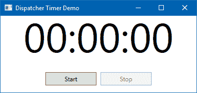

调试和线程

在本章中，我们将介绍以下食谱：

+   启用 XAML 的 UI 调试工具

+   使用实时视觉树遍历 XAML 元素

+   使用实时属性浏览器检查 XAML 属性

+   从非 UI 线程更新 UI

+   为长时间运行的线程添加取消支持

+   使用后台工作组件

+   使用计时器定期更新 UI

# 简介

当涉及到应用程序开发时，调试起着至关重要的作用。这是一个通过逐行遍历代码来快速查看程序当前状态的过程。在编写代码时，开发者开始调试他们的应用程序。有时，开发者甚至在编写第一行代码之前就开始调试，以便了解现有的逻辑。

Visual Studio 尽可能提供有关运行程序的详细信息，并帮助您在应用程序运行时更改一些值。作为一名开发者，您必须已经知道这一点。由于本书的重点是 **Windows 表现基金会**（**WPF**），我们将讨论使用 **实时视觉树** 和 **实时属性浏览器**进行 XAML UI 调试。

在本章的后面部分，我们将讨论 **线程**，并学习如何从非 UI 线程、后台工作进程和用于定期更新 UI 的计时器更新 UI 线程。

# 启用 XAML 的 UI 调试工具

要开始调试您的 XAML 应用程序 UI，您首先需要在 Visual Studio 中启用一些设置。如果设置被禁用，您将无法查看 **实时视觉树** 和 **实时属性**窗口，我们将在接下来的几个食谱中讨论。

这些设置在 Visual Studio 2017 中默认启用，但如果已禁用，此食谱将帮助您开始使用它。

## 准备工作

确保您已安装 Visual Studio 2017。打开它以开始设置更改。

## 如何操作...

按照以下步骤验证并启用 Visual Studio 2017 中 XAML 的 UI 调试工具：

1.  在 Visual Studio IDE 中，导航到工具 | 选项...菜单，如图所示：


1.  这将打开 Visual Studio 选项窗口。从该页面，导航到调试 | 通用部分。

1.  选择标记为启用 XAML UI 调试工具的复选框，如果尚未启用，请将其打开：


1.  一旦您打开调试 XAML 应用程序 UI 的功能，您将启用更多设置以使用 **实时视觉树** 和在调试器已附加时修改 XAML 属性。

1.  从同一页面，选择其他标记为在实时视觉树中预览所选元素和显示应用程序中的运行时工具的复选框。

1.  要能够在应用程序以调试模式运行时更改 XAML 元素及其属性，请检查“启用 XAML 编辑和继续”，如图所示。

1.  点击“确定”以保存更改并重新启动调试过程以使更改生效。现在您将能够调试您的 XAML UI。

# 使用实时视觉树导航 XAML 元素

**实时视觉树**是一个调试工具，可以帮助您更轻松地执行 XAML 调试。使用它，您可以在运行时检查 XAML 并可视化布局以显示 UI 元素的对齐和空间。

基本上，实时视觉树为您提供了正在运行的 XAML 应用程序 UI 元素的树视图，并提供了每个容器内 XAML 元素数量的信息。如果界面从一个状态变为另一个状态，实时视觉树也会在运行时发生变化。

在本食谱中，我们将学习更多关于实时视觉树以及如何使用它来可视化 UI 上的实际控件渲染。

## 准备工作

要开始，打开 Visual Studio 2017 IDE 并创建一个名为 `CH10.XamlDebuggingDemo` 的新 WPF 项目。

## 如何操作...

按照此处提到的步骤创建我们的示例演示应用程序，然后学习如何在调试应用程序时使用**实时视觉树**导航 XAML 元素：

1.  让我们先设计应用程序 UI。从解决方案资源管理器打开 `MainWindow.xaml` 文件。

1.  将默认的 `Grid` 面板分成以下方式具有五行：

```cs
<Grid.RowDefinitions> 
    <RowDefinition Height="Auto"/> 
    <RowDefinition Height="Auto"/> 
    <RowDefinition Height="Auto"/> 
    <RowDefinition Height="Auto"/> 
    <RowDefinition Height="*"/> 
</Grid.RowDefinitions>
```

1.  在 `Grid` 内部，添加以下 XAML 代码块以创建一个包含几个文本块、文本框和按钮控件的登录屏幕。将它们放置在适当的行中，如下所示：

```cs
<TextBlock Text="Username:" 
           Grid.Row="0" 
           Margin="0 4 0 0"/> 
<TextBlock Text="Password:" 
           Grid.Row="2" 
           Margin="0 4 0 0"/> 

<TextBox x:Name="username" 
         Grid.Row="1"/> 
<TextBox x:Name="password" 
         Grid.Row="3"/> 

<StackPanel Orientation="Horizontal" 
            HorizontalAlignment="Center" 
            VerticalAlignment="Center" 
            Grid.Row="4"> 
    <Button Content="Login"/> 
    <Button Content="Cancel"/> 
</StackPanel> 
```

1.  现在，在 `<Window>` 标签内，添加 `<Window.Resources>` 并为 `TextBox` 和 `Button` 控件添加以下样式，以使它们看起来更合适：

```cs
<Window.Resources> 
    <Style TargetType="TextBox"> 
        <Setter Property="Height" 
                Value="24"/> 
    </Style> 

    <Style TargetType="Button"> 
        <Setter Property="Margin" 
                Value="4"/> 
        <Setter Property="Width" 
                Value="60"/> 
        <Setter Property="Height" 
                Value="30"/> 
    </Style> 
</Window.Resources>
```

1.  一旦 UI 准备就绪，让我们运行应用程序。你将在屏幕上看到以下输出：


1.  现在，关闭应用程序并以调试模式运行。为此，可以点击**Visual Studio 工具栏**上的开始按钮 ()，或者导航到 Visual Studio 调试菜单并点击开始调试。

1.  或者，您可以按键盘快捷键 *F5* 以调试模式运行应用程序。

1.  一旦应用程序启动，您将在屏幕上看到以下输出，其中包含一个工具栏：


1.  如果工具栏在 UI 中不存在，请导航到 Visual Studio 的调试选项，并启用“在应用程序中显示运行时工具”，如图所示。同时确保其他复选框（此处标记）已经勾选：


1.  当应用程序以调试模式运行时，点击运行时工具栏上的第二个按钮以启用控件选择：


1.  现在，将鼠标悬停在应用程序 UI 上的任何控件上，你将看到悬停控件上有一个红色虚线边框（就像**IE 开发者工具**一样），如图所示：


1.  点击任何控件以在 Visual Studio 编辑器中打开实时视觉树。如果它不可见，导航回应用程序 UI，如图所示，点击运行时工具栏上的第一个按钮以启动实时视觉树对话框面板：


1.  或者，你可以导航到 Visual Studio 2017 菜单调试 | 窗口 | 实时视觉树以打开此对话框窗口。

1.  点击标记为密码的输入框。实时视觉树将显示视觉树中当前选中的视觉元素。查看以下截图：


1.  让我们点击按钮控制（标记为登录），如图所示，在视觉树中会自动选择相应的按钮控制：


1.  现在，点击按钮内的登录标签。你会看到`Button`控制包含一个`TextBlock`元素，该元素位于`ContentPresenter`内部，被`Border`控制包裹：


## 它是如何工作的...

当你在调试模式下启动 WPF 应用程序时，浮动工具栏也会在屏幕上加载，这允许你轻松选择应用程序运行实例中的元素，并检查其在**实时视觉树**中的**视觉元素**。

浮动工具栏包含四个按钮——转到实时视觉树、启用选择、显示布局装饰器和跟踪焦点元素，如图所示：


在`MainWindow.xaml`中，我们只在`StackPanel`内添加了`Button`控件，但当你看到它在**实时视觉树**中时，你会注意到`Button`控件由其他 UI 元素组成以表示控件。它包含一个`Border`、一个`ContentPresenter`和一个`TextBlock`来可视化`Button`内容：


就这样，每个 UI 控件都由一个或多个 UI 元素组成，这些元素仅在视觉树中可见，并且当调试器附加到应用程序时可以通过实时视觉树进行检查。

请注意，这就是 XAML 控件在 UI 中实际渲染的方式。元素在视觉树中的层级越多，可能遇到的性能问题就越多。检测和消除视觉树中不必要的元素是**实时视觉树**调试窗口的主要优势之一。

Visual Studio 2017 还支持在实时视觉树窗口中修改所选元素，我们将在下一个菜谱中演示。

## 还有更多...

你还可以要求 XAML 调试器显示布局装饰器。当运行时调试工具在应用程序窗口中可见时，点击第三个按钮（如下面的截图所示），标题为显示布局装饰器。这将导致应用程序窗口在所选对象的边界上显示水平和垂直线，以便你可以看到它对齐的位置。它还显示显示边距的矩形：


当启用时，将鼠标悬停在应用程序窗口上的任何 UI 元素上或点击它。你会看到该控件的布局装饰器，如下面的截图所示：


# 使用 Live Property Explorer 检查 XAML 属性

在前面的配方中，我们学习了 **Live Visual Tree**，它通过检查视觉元素来获取运行中的 XAML 代码的实时视图。Visual Studio 2015 及以上版本还提供了一个 **Live Property Explorer** 窗口，允许你在运行时临时修改 XAML 属性以查看视觉效果。

在本配方中，我们将学习关于 Live Property Explorer 的内容。我们将使用 Visual Studio 2017 来演示它。

## 准备工作

让我们从创建一个演示项目开始。打开你的 Visual Studio 2017 实例，创建一个名为 `CH10.LivePropertyExplorerDemo` 的新项目。确保在创建项目时选择 WPF 应用程序模板。

## 如何操作...

按照以下步骤使用简单的按钮设计我们的应用程序 UI，然后利用 **Live Property Explorer** 在运行时查看和修改 XAML 属性：

1.  从解决方案资源管理器中打开 `MainWindow.xaml` 文件。

1.  将 XAML 的内容替换为以下代码，以获得具有默认样式的基本 `Button`：

```cs
<Window x:Class="CH10.LivePropertyExplorerDemo.MainWindow" 

        Title="Live Property Explorer Demo" Height="150" Width="400"> 
    <Grid> 
        <Button x:Name="myButton" 
                Content="Click here"/> 
    </Grid> 
</Window> 
```

1.  让我们运行应用程序。你会看到按钮自动排列以覆盖整个应用程序。这是因为我们将按钮放置在一个 `Grid` 中，并且没有指定其尺寸和边距，如下面的截图所示：


1.  现在，关闭应用程序并以调试模式运行。

1.  一旦应用程序以调试模式启动，导航到 Visual Studio 菜单—调试 | 窗口 | Live Property Explorer 以打开该探索器窗口。

1.  Live Property Explorer 窗口将如下所示：


1.  如前一个截图所示，Live Property Explorer 正在显示所选 `Button` 控件的属性，命名为 `myButton`。你会发现大多数属性都是禁用的。这是因为它们要么是从隐式/显式样式继承的，要么具有默认值。

1.  要实验 UI 元素属性，你应该修改 Local 面板内的属性。

1.  要从 Live Visual Tree 中覆盖所选元素（在我们的例子中是 `myButton`）的现有属性值，点击如下截图所示的“新建”按钮：


1.  这将在面板中添加一个下拉列表，你可以从中选择要修改的属性。让我们从属性列表中选择“宽度”：


1.  当你选择属性时，面板将填充适当的属性框以填充它。将宽度属性的值输入为 `120`。

1.  注意运行中的应用程序窗口。窗口中的 `Button` 控件将自动调整到 120 像素的宽度。

1.  观察 XAML 设计器窗口中的实际元素。更改并未在 XAML 代码中执行：


1.  让我们修改 `Button` 控制的几个属性。单击“新建”按钮，并从属性列表中选择“高度”。将其值设置为 `30`。

1.  再次单击“新建”按钮，并从属性列表中选择“背景”。现在将其值输入为`Red`。你也可以输入 `#FFFF0000` 以将红色应用到按钮背景。

1.  一旦你进行了这些更改，查看运行中的应用程序窗口。新的高度和背景颜色已经应用到按钮上：


1.  让我们再更改一些属性。在你的本地属性列表中添加 `FontSize` 和 `Foreground` 属性。分别将它们的值设置为 `16` 和 `White`。

1.  检查应用程序窗口中的更改。现在它将看起来如下：


## 它是如何工作的...

**实时属性浏览器**只为你提供了在运行时想要修改的预览。基于此，你可以更改 XAML 视图或设计视图中的原始 UI 以进行永久更改。

如果你结束调试会话，你在 Live Property Explorer 窗口中进行的更改将不会保存，并且你会丢失这些更改。当你重新启动应用程序时，你会看到默认的新值。

这通常在你想要在运行时实时查看 Visual Tree 中任何元素的更改时很有用。

## 还有更多...

在调试模式下运行应用程序时，要永久设置任何 UI 元素的属性，请使用 XAML 代码视图或 XAML 设计器视图。运行中的应用程序将自动获取样式更改的更新。

在调试模式下运行应用程序时修改 XAML 代码，请确保在 Visual Studio 选项窗口的调试 | 通用部分中启用了“启用 XAML UI 调试工具”和“启用 XAML 编辑和继续”设置（已勾选）。

让我们在调试模式下再次运行应用程序，并直接在 XAML 视图中修改控件属性。一旦你进行了更改，检查运行中的应用程序，你会看到它已经根据修改后的数据进行了更新：


下面是按钮修改后的 XAML 代码，我们在前面的屏幕截图中使用了它。应用后，它将为按钮背景添加一个漂亮的线性渐变颜色：

```cs
<Button x:Name="myButton" 
        Content="Click here" 
        Height="30" 
        Width="200" 
        FontSize="18" 
        FontWeight="Bold" 
        Foreground="Red"> 
    <Button.Background> 
        <LinearGradientBrush> 
            <GradientStop Color="#FFFF5454"  
                          Offset="0"/> 
            <GradientStop Color="#FFFFF754"  
                          Offset="0.3"/> 
            <GradientStop Color="#FFFFF754"  
                          Offset="0.8"/> 
            <GradientStop Color="#FFFF5454"  
                          Offset="1"/> 
        </LinearGradientBrush> 
    </Button.Background> 
</Button> 
```

# 从非 UI 线程更新 UI

在 WPF 中，UI 由一个称为**UI 线程**的单个线程管理，该线程创建一个窗口实例并处理该窗口的 UI 消息。这被称为**消息泵**。

当 UI 线程执行大量操作时，它会进入等待状态并停止处理进一步的 UI 消息。这会导致应用程序进入*无响应*模式，这通常被称为**UI 冻结**。

要解决这个问题，你需要将这个长时间运行的操作卸载到另一个线程。这会使 UI 线程保持空闲，并允许它执行 UI 更新并保持响应。

在这个菜谱中，我们将学习如何将长时间运行的过程卸载到线程池中的单独线程，并在执行完成后执行 UI 更新。

## 准备工作

让我们从创建一个 WPF 项目开始。命名为`CH10.ThreadingDemo1`。确保在创建项目时选择正确的 WPF App 模板。

## 如何做...

我们将创建一个简单的应用程序，该应用程序将计算一个数字范围内的奇数和偶数。这将在非 UI 线程上完成，一旦结果可用，我们将更新 UI。按照以下步骤操作：

1.  从解决方案资源管理器中打开`MainWindow.xaml`文件。

1.  将现有的`Grid`替换为以下简单的用户界面，以提供数字范围，并一个按钮来计算和显示结果：

```cs
<Grid Margin="10"> 
    <Grid.RowDefinitions> 
        <RowDefinition Height="Auto"/> 
        <RowDefinition Height="Auto"/> 
        <RowDefinition Height="Auto"/> 
    </Grid.RowDefinitions> 
    <StackPanel Orientation="Horizontal" 
                Grid.Row="0" 
                Margin="4"> 
        <TextBlock Text="From:" 
                   Margin="4"/> 
        <TextBox x:Name="fromValue" 
                 Text="100" 
                 Width="100" 
                 MaxLength="10" 
                 Margin="4"/> 

        <TextBlock Text="To:" 
                   Margin="4"/> 
        <TextBox x:Name="toValue" 
                 Text="1000000000" 
                 Width="100" 
                 MaxLength="10" 
                 Margin="4"/> 

        <Button x:Name="calculateButton" 
                Content="Calculate" 
                Margin="4" 
                Padding="8 2" 
                Click="OnCalculateClicked"/> 
    </StackPanel> 

    <TextBlock x:Name="oddResultBlock" 
               Grid.Row="1" 
               Text="Total odd numbers: 0" 
               Margin="4"/> 

    <TextBlock x:Name="evenResultBlock" 
               Grid.Row="2" 
               Text="Total even numbers: 0" 
               Margin="4"/> 
</Grid> 
```

1.  导航到`MainWindow.xaml.cs`文件，并添加以下两个成员变量以存储奇数和偶数的总数：

```cs
private int totalOdd = 0; 
private int totalEven = 0;
```

1.  现在，我们将创建一个方法来计算奇数和偶数。在`MainWindow`类中，创建一个名为`CalculateOddEven`的方法，并实现如下代码片段所示的代码块：

```cs
private void CalculateOddEven(int from, int to) 
{ 
    for (int i = from; i <= to; i++) 
    { 
        if (i % 2 == 0) { totalEven++; } 
        else { totalOdd++; } 
    } 
} 
```

1.  现在，我们需要调用这个方法。让我们实现按钮点击事件`OnCalculateClicked`来调用`CalculateOddEven`方法并显示结果：

```cs
private void OnCalculateClicked(object sender,  
                        RoutedEventArgs e) 
{ 
    totalOdd = 0; 
    totalEven = 0; 

    if (int.TryParse(fromValue.Text, out int from) && 
        int.TryParse(toValue.Text, out int to)) 
    { 
        calculateButton.IsEnabled = false; 

        CalculateOddEven(from, to); 

        oddResultBlock.Text = "Total odd numbers: " +  
                               totalOdd; 
        evenResultBlock.Text = "Total even numbers: " +  
                                totalEven; 
        calculateButton.IsEnabled = true; 
    } 
}
```

1.  运行应用程序并点击计算按钮。在长时间运行的操作进行时，UI 会冻结一段时间，因为它正在找出`100 - 1000000000`范围内的奇数和偶数。一旦计算完成，它将解冻 UI 并显示结果：


1.  要解决这个问题，我们应该将长时间运行的过程移动到不同的线程，以便 UI 线程保持响应。我们将使用线程池将过程移动到不同的线程。您也可以通过创建一个新的`Thread`实例或使用`Task`来完成此操作。

1.  在这个例子中，我们将使用线程池。这可以通过调用`ThreadPool.QueueUserWorkItem`来实现，如下面的代码片段所示：

```cs
ThreadPool.QueueUserWorkItem(_ => 
{ 
    CalculateOddEven(from, to); 
}); 
```

1.  现在，我们需要在操作完成后更新 UI。这不能在`ThreadPool.QueueUserWorkItem`块外部完成，因为操作将在不同的线程上运行。同样，也不能直接在`ThreadPool.QueueUserWorkItem`块内部完成，因为更新应该在 UI 线程上执行。为了使这可行，可以在`ThreadPool.QueueUserWorkItem`块内部使用`Dispatcher.BeginInvoke`块，如下面的代码片段所示：

```cs
ThreadPool.QueueUserWorkItem(_ => 
{ 
    CalculateOddEven(from, to); 

    Dispatcher.BeginInvoke(new Action(() => 
    { 
        oddResultBlock.Text = "Total odd numbers: " +  
                               totalOdd; 
        evenResultBlock.Text = "Total even numbers: " +  
                                totalEven; 
        calculateButton.IsEnabled = true; 
    })); 
}); 
```

1.  让我们再次运行应用程序。点击 Calculate 按钮。您将观察到，在长时间运行的操作进行时，UI 仍然是响应的。

## 它是如何工作的...

WPF 中的每个元素都继承自`DispatcherObject`，因此 UI 线程始终与`System.Windows.Threading.Dispatcher`相关联。这就是为什么可以通过使用`DispatcherObject.Dispatcher`属性在任何时候访问`Dispatcher`对象的原因。

`ThreadPool.QueueUserWorkItem`会导致委托在 CLR 线程池上执行。因此，在该委托内部执行的操作永远不会在 UI 线程上执行。

一旦操作完成，并且您需要更新 UI，您必须从 UI 线程更新。对`Dispatcher.BeginInvoke`的调用会导致委托在 UI 线程上运行并做出必要的 UI 更改。

需要注意的一点是，调度器也可以从 UI 线程通过静态属性`Dispatcher.CurrentDispatcher`访问。

## 还有更多...

`Dispatcher`有两种调用方式——`BeginInvoke`和`Invoke`。我们已经看到了`BeginInvoke`的使用，它基本上会调用`delegate`并在`delegate`仍在 UI 线程上运行时返回以执行其他操作。

另一方面，`Invoke`操作不会返回，直到`delegate`在 UI 线程上完成其执行。

除非有特定的原因需要等待 UI 操作完成，否则`BeginInvoke`始终是首选。

`Dispatcher`维护一个需要在 UI 线程上处理的请求队列。这基本上是通过设置`DispatcherPriority`来处理的。默认优先级是`DispatcherPriority.Normal`，但您可以根据操作的重要性设置一个较低的或较高的优先级。

# 为长时间运行的线程添加取消支持

当您在另一个线程上执行长时间运行的过程时，为了在操作期间保持 UI 的响应性，您可能希望提供一个取消操作的功能。这可以按需完成。

在这个菜谱中，我们将学习如何将取消支持添加到之前菜谱中构建的现有长时间运行操作。

## 准备工作

我们将使用之前菜谱中使用的相同示例。您可以复制整个`CH10.ThreadingDemo1`项目文件夹，并给它一个新的名字，`CH10.ThreadingDemo2`。启动 Visual Studio，并在其中打开新的（`CH10.ThreadingDemo2`）项目。

## 如何做到这一点...

按照以下步骤更新现有项目，并在长时间运行过程中支持取消操作：

1.  导航到`MainWindow.xaml`文件，并修改 UI 以在其中包含一个`Cancel`按钮。在`StackPanel`内部添加以下按钮控件，并将其标签设置为`Cancel`：

```cs
<Button x:Name="cancelButton" 
        Content="Cancel" 
        IsEnabled="False" 
        Margin="4" 
        Padding="8 2" 
        Click="OnCancelClicked"/> 
```

1.  确保将其`IsEnabled`属性设置为`False`。

1.  现在，导航到`MainWindow.xaml.cs`文件，并在类内部添加以下成员变量：

```cs
private CancellationTokenSource tokenSource = null; 
```

1.  在`Cancel`按钮点击时，我们需要取消正在运行的操作。让我们修改`OnCancelClicked`事件，使其与以下代码片段执行相同的操作：

```cs
private void OnCancelClicked(object sender,  
                             RoutedEventArgs e) 
{ 
    if (tokenSource != null) 
    { 
        tokenSource.Cancel(); 
        tokenSource = null; 
    } 
} 
```

1.  让我们导航到`CalculateOddEven`方法并修改它以接受一个类型为`CancellationToken`的第三个参数：

```cs
private void CalculateOddEven(int from,  
                              int to,  
                              CancellationToken token)
```

1.  在`CalculateOddEven`方法的`for`循环内部，检查`CancellationToken.IsCancellationRequested`是否为`true`，如果是，则立即返回，并在将`totalOdd`和`totalEven`值设置为`-1`后立即返回。

```cs
for (int i = from; i <= to; i++) 
{ 
    if (token.IsCancellationRequested) 
    { 
        totalOdd = -1; 
        totalEven = -1; 
        return; 
    } 
```

1.  仅供参考，以下是`CalculateOddEven`方法实现修改后的代码：

```cs
private void CalculateOddEven(int from,  
                              int to,  
                              CancellationToken token) 
{ 
    for (int i = from; i <= to; i++) 
    { 
        if (token.IsCancellationRequested) 
        { 
            totalOdd = -1; 
            totalEven = -1; 
            return; 
        } 

        if (i % 2 == 0) { totalEven++; } 
        else { totalOdd++; } 
    } 
} 
```

1.  在`OnCalculateClicked`事件实现中，我们需要进行一些更改。首先创建`CancellationTokenSource`的实例并将其分配给`tokenSource`变量。

1.  然后，将实例传递给`CalculateOddEven`方法作为第三个参数值。

1.  然后，在`Dispatcher.BeginInvoke`调用内部，修改代码以根据`totalOdd`和`totalEven`变量的值显示“操作已取消！”。只有当其中任何一个为`-1`时才显示消息。以下是完整的实现：

```cs
tokenSource = new CancellationTokenSource(); 
ThreadPool.QueueUserWorkItem(_ => 
{ 
    CalculateOddEven(from, to, tokenSource.Token); 

    Dispatcher.BeginInvoke(new Action(() => 
    { 
        if (totalOdd < 0 || totalEven < 0) 
        { 
            oddResultBlock.Text = "Operation canceled!"; 
            evenResultBlock.Text = string.Empty; 
        } 
        else 
        { 
            oddResultBlock.Text = "Total odd numbers: " +  
                                   totalOdd; 
            evenResultBlock.Text = "Total even numbers: " +  
                                    totalEven; 
        } 

        calculateButton.IsEnabled = true; 
        cancelButton.IsEnabled = false; 
    })); 
}); 
```

1.  完成后，让我们运行应用程序。点击计算按钮以在线程池中的单独线程中启动进程：


1.  当操作正在进行时，点击取消按钮。您会看到进程立即停止，并且在 UI 中显示“操作已取消！”消息：


1.  让我们再次点击`Calculate`按钮并等待进程结束。现在您能看到什么？它会在 UI 上显示奇数和偶数的总数。

## 它是如何工作的...

`CancellationTokenSource`表示一个可以取消的逻辑操作。`CancellationTokenSource`的`Token`属性提供了提供逻辑操作一部分的令牌对象。

当在`CancellationTokenSource`对象上调用`Cancel()`方法时，该源的所有分布式令牌的`IsCancellationRequested`属性都会设置为`true`。

在我们的示例中，`CalculateOddEven`方法内部的`for`循环轮询`IsCancellationRequested`属性，并将`totalOdd`和`totalEven`成员变量填充为`-1`，这可以用来理解已执行取消调用。基于该值，屏幕上会显示“操作已取消！”消息。

# 使用后台工作组件

在之前的菜谱中，我们使用了线程池在不同的线程中执行长时间运行的操作。从那里，我们必须通过将代码打包到 UI 线程来更新 UI，这需要额外的工作。

为了克服显式线程池和 UI 更新在 UI 线程上的打包，我们可以使用`System.ComponentModel.BackgroundWorker`类。它提供在后台线程上自动管理长时间运行操作。

在这个菜谱中，我们将使用`BackgroundWorker`来执行异步操作，而不会阻塞 UI 线程。

## 准备中

我们将使用之前菜谱中使用的相同示例。您可以复制整个`CH10.ThreadingDemo1`项目文件夹，并创建一个名为`CH10.ThreadingDemo3`的新文件夹。启动 Visual Studio 并打开新项目。

## 如何操作...

按照以下步骤使用后台工作线程，执行长时间运行的过程，并计算范围内的奇数和偶数：

1.  从解决方案资源管理器，导航到`MainWindow.xaml.cs`文件。

1.  添加以下`using`命名空间—`System.ComponentModel`，这样我们就可以使用`BackgroundWorker`类。

1.  在`OnCalculateClicked`事件内部，而不是调用`ThreadPool`来执行操作，创建`BackgroundWorker`类的实例。

1.  注册工作线程事件`DoWork`和`RunWorkerCompleted`。

1.  通过传递数值范围作为参数调用后台工作线程的`RunWorkerAsync`方法。参数接受对象，因此我们将使用`Tuple<int, int>`作为数据类型以简化。完整的代码如下：

```cs
private void OnCalculateClicked(object sender,  
  RoutedEventArgs e) 
{ 
    totalOdd = 0; 
    totalEven = 0; 

    if (int.TryParse(fromValue.Text, out int from) && 
        int.TryParse(toValue.Text, out int to)) 
    { 
        calculateButton.IsEnabled = false; 

        var worker = new BackgroundWorker(); 
        worker.DoWork += OnWorker_DoWork; 
        worker.RunWorkerCompleted +=  
                        OnWorker_WorkCompleted; 
        worker.RunWorkerAsync(new Tuple<int, int>(from, to)); 
    } 
} 
```

1.  让我们修改`OnWorker_DoWork`事件实现，首先提取参数。然后，通过传递从参数中提取的值调用长时间运行的方法（`CalculateOddEven`）：

```cs
private void OnWorker_DoWork(object sender,  
   DoWorkEventArgs e) 
{ 
    var argument = (Tuple<int, int>)e.Argument; 
    CalculateOddEven(argument.Item1, argument.Item2); 
} 
```

1.  在`OnWorker_WorkCompleted`事件实现中，释放`BackgroundWorker`实例，然后根据值更新 UI。以下是供您参考的代码：

```cs
private void OnWorker_WorkCompleted(object sender,  
 RunWorkerCompletedEventArgs e) 
{ 
    if (sender is BackgroundWorker worker) 
    { 
        worker.RunWorkerCompleted -=  
         OnWorker_WorkCompleted; 
        worker.DoWork -= OnWorker_DoWork; 
        worker = null; 
    } 

    oddResultBlock.Text = "Total odd numbers: " +  
      totalOdd; 
    evenResultBlock.Text = "Total even numbers: " +  
      totalEven; 

    calculateButton.IsEnabled = true; 
}
```

1.  一旦完成这些操作，让我们运行应用程序。您将看到与我们在第一个示例中看到相同的应用程序 UI：


1.  点击`Calculate`按钮。您将观察到，在后台工作进程执行的同时，应用程序正在响应。

1.  一旦执行完成，它将在 UI 中显示结果。

## 它是如何工作的...

`BackgroundWorker`公开事件以协调工作。当您调用`RunWorkerAsync`方法时，`DoWork`事件在线程池线程上触发。您可以将一个可选的`Argument`传递给`RunWorkerAsync`方法，该`Argument`可以在`DoWork`事件处理程序中的`DoWorkEventArgs.Argument`属性中检索。

由于`DoWork`事件处理程序在线程池线程上执行，因此在`DoWork`处理程序中访问 UI 控件将抛出`Exception`。因此，将 UI 的值作为参数传递给`RunWorkerAsync`方法。

当 `DoWork` 事件处理程序完成其执行时，`BackgroundWorker` 会引发 `RunWorkerCompleted` 事件。这个事件在 UI 线程上运行，因此你可以从这个事件处理程序中执行 UI 操作。如果你从 `DoWork` 处理程序中传递了任何值，你可以从这里从 `RunWorkerCompletedEventArgs.Result` 属性中检索它。

## 还有更多...

为了显示长时间运行的后台操作的当前进度指示，你可以在工作进程中引发 `ProgressChanged` 事件，并直接从这里更新 UI。`ProgressChanged` 处理程序在 UI 线程上运行，并且当从 `DoWork` 处理程序中调用 `BackgroundWorker.ReportProgress(System.Int32)` 时发生。为了使其工作，请确保已将工作线程的 `WorkerReportsProgress` 属性设置为 `true`。

你还可以检查 `BackgroundWorker` 是否正在运行异步操作。如果它正在运行后台操作，`IsBusy` 属性将返回 `true`。

如果你想取消正在运行的后台工作线程，可以调用工作线程的 `CancelAsync()` 方法来请求取消挂起的后台操作。如果 `BackgroundWorker.WorkerSupportsCancellation` 设置为 `false`，它将抛出 `InvalidOperationException`。

# 使用定时器定期更新 UI

经常需要定期更新用户界面的一部分。在这种情况下，定时器对象有助于保持 UI 的刷新。例如，在你的应用程序中，你可能想在 UI 的某个部分显示当前时间。为此，你可以使用定时器定期更新 UI，而无需创建不同的线程。

可以使用 `System.Windows.Threading.DispatcherTimer` 类将其集成到 `Dispatcher` 队列中，并可以在指定的时间间隔和优先级下进行处理。

在这个菜谱中，我们将使用 `DispatcherTimer` 类来实现一个定时器，每次指定的 `Interval` 达到时，它将执行其订阅的 `Tick` 事件。

## 准备中

打开 Visual Studio 并创建一个新的 WPF 应用程序项目。将其命名为 `CH10.DispatcherTimerDemo`。

## 如何实现...

按照以下步骤使用定时器创建数字时钟体验：

1.  从解决方案资源管理器导航到 `MainWindow.xaml` 页面。

1.  将默认的 `Grid` 分为三行，如下所示：

```cs
<Grid.RowDefinitions> 
    <RowDefinition Height="*"/> 
    <RowDefinition Height="20"/> 
    <RowDefinition Height="Auto"/> 
</Grid.RowDefinitions> 
```

1.  在 `Grid.Row="0"` 位置添加一个 `TextBlock` 控件并将其对齐到中心：

```cs
<TextBlock x:Name="clock" 
           Grid.Row="0" 
           Text="00:00:00" 
           FontSize="80" 
           HorizontalAlignment="Center" 
           VerticalAlignment="Center"/> 
```

1.  在 `Grid.Row="2"` 位置添加一个 `StackPanel`，并在其中插入两个按钮。将按钮命名为 `startButton` 和 `stopButton`。同时，为两个按钮分别注册 `Click` 事件为 `OnStartTimer` 和 `OnStopTimer`：

```cs
<StackPanel Grid.Row="2" 
            Margin="10" 
            Orientation="Horizontal" 
            HorizontalAlignment="Center" 
            VerticalAlignment="Center"> 
    <Button x:Name="startButton" 
            Content="Start" 
            Margin="4" 
            Height="26" 
            Width="100" 
            Click="OnStartTimer"/> 
    <Button x:Name="stopButton" 
            Content="Stop" 
            Margin="4" 
            Height="26" 
            Width="100" 
            IsEnabled="False" 
            Click="OnStopTimer"/> 
</StackPanel> 
```

1.  现在，导航到 `MainWindow.xaml.cs` 以添加逻辑背后的代码。

1.  首先，在类文件中添加以下命名空间：

```cs
using System; 
using System.Windows; 
using System.Windows.Threading; 
```

1.  在类内部，声明一个私有的成员变量（`dispatcherTimer`）的类型为 `DispatcherTimer`：

```cs
private DispatcherTimer dispatcherTimer = null; 
```

1.  在类的构造函数内部，让我们创建`DispatcherTimer`的实例，并在每`1`秒间隔后触发其`Tick`事件。以下是代码：

```cs
public MainWindow() 
{ 
    InitializeComponent(); 

    dispatcherTimer = new DispatcherTimer(); 
    dispatcherTimer.Interval = TimeSpan.FromSeconds(1.0); 
    dispatcherTimer.Tick += OnTimerTick; 
} 
```

1.  现在，在`Tick`事件实现内部，将`TextBlock`控件（`clock`）的`Text`属性设置为当前时间，格式为`hh:mm:ss`：

```cs
private void OnTimerTick(object sender,  
 EventArgs e) 
{ 
    clock.Text = DateTime.Now.ToString("hh:mm:ss"); 
} 
```

1.  当用户点击开始按钮时，`OnStartTimer`事件处理程序将被触发。在其内部，让我们通过在`dispatcherTimer`实例上调用`Start()`方法来启动计时器。或者，你也可以将`dispatcherTimer.IsEnabled`属性设置为`true`来启动计时器：

```cs
private void OnStartTimer(object sender,  
 RoutedEventArgs e) 
{ 
    if (dispatcherTimer != null) 
    { 
        dispatcherTimer.Start(); 

        startButton.IsEnabled = false; 
        stopButton.IsEnabled = true; 
    } 
} 
```

1.  当处理程序`OnStopTimer`被触发时，在点击停止按钮时，我们将调用`dispatcherTimer`实例的`Stop()`方法。在这里，你也可以将`dispatcherTimer.IsEnabled`属性作为停止计时器的另一种方法，但在这个情况下，你必须将其设置为`false`：

```cs
private void OnStopTimer(object sender,  
 RoutedEventArgs e) 
{ 
    if (dispatcherTimer != null) 
    { 
        dispatcherTimer.Stop(); 

        startButton.IsEnabled = true; 
        stopButton.IsEnabled = false; 
    } 
} 
```

1.  现在运行应用程序。你将在屏幕上看到以下输出：



1.  观察 UI 中的文本，它被显示为`00:00:00`。现在点击开始按钮。这将现在将文本更改为你的系统当前时间，并且每秒刷新一次：


1.  当时间在 UI 上流逝时，在每秒间隔之后，点击停止按钮。这将导致屏幕上运行的计时器停止。

1.  再次点击开始按钮将启动计时器并在屏幕上显示当前时间。UI 上显示的时间将每秒刷新一次。

## 它是如何工作的...

当你使用`DispatcherTimer`对象时，它代表一个绑定到 UI 线程的计时器。`DispatcherTimer`类的`Interval`属性表示计时器的周期，`Tick`事件将在该周期内触发，并持续计时，直到明确停止。

要启动计时器，你可以调用其`Start()`方法，或者将`IsEnabled`属性设置为`true`。同样，要停止一个计时器，你可以调用`Stop()`方法，或者将`IsEnabled`属性设置为`false`。

不要在`Tick`事件中执行任何长时间的操作，因为它在 UI 线程上运行。长时间运行的操作可能会阻止 UI 响应用户操作。
