与 Win32 和 WinForm 的互操作性

在本章中，我们将介绍以下食谱：

+   在 WPF 应用程序中托管 WinForm 控件

+   在 WinForm 应用程序中托管 WPF 控件

+   从 WPF 应用程序调用 Win32 API

+   在 WPF 应用程序中嵌入 ActiveX 控件

# 简介

术语**互操作性**描述了不同应用程序通过一组可交换的格式交换数据的能力。它是产品或系统的特性，其接口完全被理解，可以与其他产品或系统协同工作。

WPF 和 Windows 窗体提供了创建应用程序界面的两种不同架构。`WindowsFormsHost`和`ElementHost`类用于实现这两种架构之间的互操作能力。

类似地，WPF 提供了与 Win32 程序的互操作性，这些程序是用非托管 C++代码编写的：

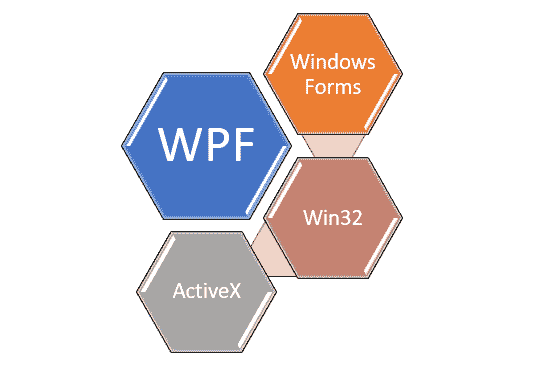

在本章中，我们将从 WPF 和 WinForm 之间的互操作开始，演示如何在 WPF 应用程序中托管 WinForm 控件以及在 WinForm 应用程序中托管 WPF 控件。然后，我们将继续学习 WPF 和 Win32 之间的互操作性，接着是嵌入 WPF 中的 ActiveX 控件。

# 在 WPF 应用程序中托管 WinForm 控件

虽然 Windows 平台基础（**WPF**）提供了一套功能丰富的控件，但在某些情况下，你可能会遇到一些**Windows 窗体**（**WinForm**）控件在 WPF 中不可用的情况。在将 WinForm 应用程序移植到 WPF 时，也可能出现这样的情况，你除了重用现有的控件和/或窗体别无选择，因为重新实现将消耗大量精力。那么，在这种情况下需要做什么呢？

WPF 提供了一种方法来重用 Windows 窗体中的现有控件，并在其中托管它们（无论是在控件、窗口还是页面上）。这被称为两个平台之间的互操作性，因为它们提供了创建应用程序界面的两种不同架构。

`System.Windows.Forms.Integration`命名空间提供了使常见互操作场景成为可能的类，而`WindowsFormsHost`类提供了实现互操作的能力。

当在 WPF 中托管 Windows 窗体控件时实现两种技术之间的互操作，可能会出现以下适用场景：

+   一个或多个 WinForm 控件可以在 WPF 中托管

+   一个或多个复合控件可以托管在 WPF 元素中

+   一个或多个 ActiveX 控件也可以在 WPF 中托管

+   包含其他 WinForm 控件的 WinForm 容器控件也可以托管

+   你还可以托管一个主/详细窗体，其中 WPF 作为主窗体，WinForm 作为详细窗体，或者 WinForm 作为主窗体，WPF 作为详细窗体

需要注意的一点是，不支持多级混合控制。**多级混合控制**包含一种技术中的控制嵌入在另一种技术的控制中。

在这个菜谱中，我们将以 WinForm 的`PropertyGrid`控件为例，这个控件在 WPF 中不可用，并且将使用`WindowsFormsHost`控件在 WPF 窗口中托管它。

## 准备工作

让我们从创建一个新的 WPF 应用程序开始。打开您的 Visual Studio IDE，创建一个名为`CH11.WinFormInWpfXamlDemo`的新项目。确保选择 WPF App 作为项目模板。

## 如何做到这一点...

按照以下步骤在 WPF 应用程序窗口中托管 WinForm 控件并映射其属性：

1.  从打开 WPF 应用程序窗口开始。从解决方案资源管理器中打开`MainWindow.xaml`文件。

1.  让我们将默认的`Grid`面板拆分为两个列。第二列的宽度将基于其子元素，而第一列将容纳剩余的空间。在`Grid`内部添加以下 XAML 标记，以根据特定要求拆分它：

```cs
<Grid.ColumnDefinitions> 
    <ColumnDefinition Width="*"/> 
    <ColumnDefinition Width="Auto"/> 
</Grid.ColumnDefinitions> 
```

1.  在`Grid`的第一个单元格（第 0 列）中放置一个`TextBlock`控件，命名为`txtBlock`，并将其`Text`属性设置为`Hello World!`：

```cs
<TextBlock x:Name="txtBlock" 
           Grid.Column="0" 
           Margin="8" 
           Text="Hello World!"/> 
```

1.  现在，在`TextBlock`控件之后，添加一个`<WindowsFormsHost> </WindowsFormsHost>`元素。当添加后，这将抛出以下设计时错误信息——在 Windows Presentation Foundation (WPF)项目中不支持 WindowsFormsHost。这是因为解决`WindowsFormsHost`元素所需的功能程序集未在此项目中引用：

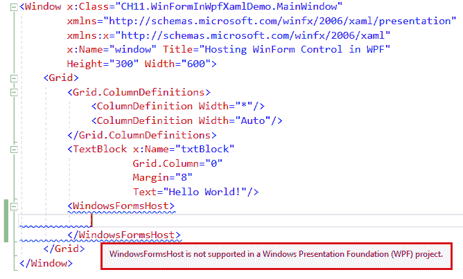

1.  要在项目中添加依赖的程序集引用，请右键单击项目节点，并从上下文菜单中选择“添加 | 引用...”：

1.  从引用管理器对话框窗口中，检查以下两个程序集引用（System.Windows.Forms 和 WindowsFormsIntegration），然后单击“确定”，这将向项目中添加引用：

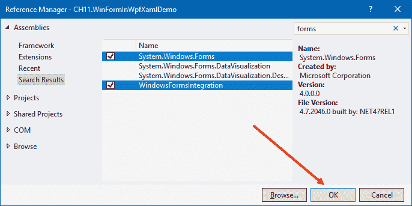

1.  检查 XAML 文件。前面的设计时错误现在将消失，因为所需的功能程序集引用已经建立。

1.  将`<WindowsFormsHost>`定位在第二列（`Grid.Column="1"`）中，并将其`Width`属性设置为`300`。

1.  现在，在`WindowsFormsHost`元素内部，放置另一个类型为`PropertyGrid`的元素。

1.  您需要为`PropertyGrid`添加 XMLNS 命名空间，以便从`System.Windows.Forms`程序集解析。如图所示，单击灯泡图标，或简单地按*CTRL +*键，将所需的 XMLNS 条目添加到`MainWindow.xaml`文件中：

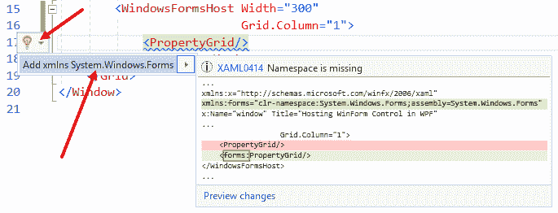

1.  或者，您可以将以下 XMLNS 声明添加到`Window`标签中：

```cs
xmlns:forms="clr-namespace:System.Windows.Forms; 
             assembly=System.Windows.Forms" 
```

1.  将`x:Name="propertyGrid"`添加到`PropertyGrid`元素中，以使用名称定义它。这将在我们想要从代码中访问它时非常有用。以下是此处将使用的`Grid`的完整 XAML 标记：

```cs
<Grid> 
    <Grid.ColumnDefinitions> 
        <ColumnDefinition Width="*"/> 
        <ColumnDefinition Width="Auto"/> 
    </Grid.ColumnDefinitions> 
    <TextBlock x:Name="txtBlock" 
               Grid.Column="0" 
               Margin="8" 
               Text="Hello World!"/> 
    <WindowsFormsHost Width="300" 
                      Grid.Column="1"> 
        <forms:PropertyGrid x:Name="propertyGrid"/> 
    </WindowsFormsHost> 
</Grid>
```

1.  完成后，让我们运行应用程序。您将看到以下输出，包含文本和一个空的属性网格：

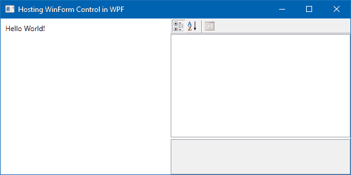

1.  让我们导航到应用程序窗口背后的代码文件（`MainWindow.xaml.cs`）。

1.  在`MainWindow`构造函数中的`InitializeComponent()`调用之后，添加以下行，`propertyGrid.SelectedObject = txtBlock;`，以设置我们已在 UI 中添加的属性网格的`SelectionObject`属性。此更改后，代码将如下所示：

```cs
public partial class MainWindow : Window 
{ 
    public MainWindow() 
    { 
        InitializeComponent(); 

        propertyGrid.SelectedObject = txtBlock; 
    } 
}
```

1.  让我们再次运行应用程序。这次您将看到属性网格包含一组属性，指向窗口中放置的`txtBlock`控件：

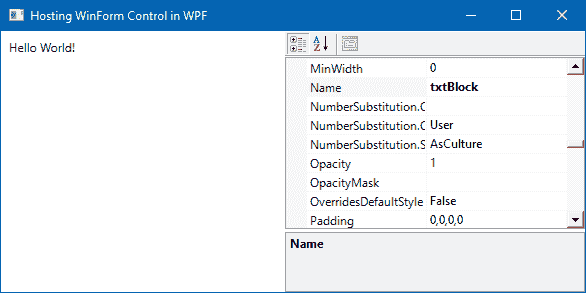

1.  向上滚动属性网格，并将网格内的`FontSize`属性更改为`40`。这将立即影响我们已在 UI 中添加的文本的字体大小：

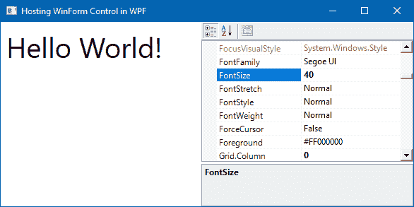

1.  类似地，更改一些其他属性，如 HorizontalAlignment、VerticalAlignment、FontStyle、FontWeight、Foreground 等，并查看屏幕上的效果！[](img/41f289b2-2629-4ce7-abfb-834d1d555a24.png)

## 它是如何工作的...

`PropertyGrid`控件是.NET Framework 的一部分，它允许您浏览、查看和编辑一个或多个对象的属性。它使用反射来检索和显示任何对象或类型的属性。

**反射**是一种允许您在运行时检索类型信息的技术。

如果您使用 WinForm，您将能够从控件工具栏轻松使用`PropertyGrid`控件。但是，不幸的是，此控件在 WPF 中不可用。要在 WPF 应用程序中使用此控件，您需要使用 WPF 和 WinForm 的互操作性。为此，我们需要使用`WindowsFormsHost`类。

`WindowsFormsHost`类允许您在 WPF 页面上托管 Windows Forms 控件。它是`System.Windows.Forms.Integration`命名空间的一部分，并且可在`WindowsFormsIntegration.dll`程序集内部使用。这就是为什么我们必须在项目中引用`System.Windows.Forms`和`WindowsFormsIntegration`程序集。

`WindowsFormsIntegration.dll`程序集的默认位置是`%programfiles%Reference AssembliesMicrosoftFrameworkv3.0`，它与其他 WPF 程序集一起提供。

一旦在 WPF 窗口内成功托管 WinForm 控件，您就可以设置/获取其属性。在上面的示例中，我们将`txtBlock`控件（WPF 控件）分配给`propertyGrid`控件的`SelectedObject`属性（WinForm 控件）。因此，当您运行应用程序时，它使用反射来检索`TextBlock`控件（`txtBlock`）公开的所有属性，并将它们填充到`PropertyGrid`中，每个属性都设置为默认值。当您在运行时修改属性值时，它根据选择更改相关控件。因此，当您更改`FontSize`、`Foreground`和其他属性时，您可以在`TextBlock`的 UI 中看到变化。

## 还有更多...

尽管大多数属性与`WindowsFormsHost`一起工作，但在混合应用程序中使用时，**Z 轴**和转换有一些限制。默认情况下，`WindowsFormsHost`元素绘制在其他 WPF 元素之上，因此 Z 轴属性对该元素没有影响。

如果你想启用 Z 轴排序，将`WindowsFormsHost`的`IsRedirected`属性设置为`True`，并将`CompositionMode`属性设置为`CompositionMode.Full`或`CompositionMode.OutputOnly`。

由于 WinForm 控件不支持适当的缩放和旋转功能，`WindowsFormsHost`元素不会与其他 WPF 元素一起缩放或旋转。要启用这些转换功能，例如 Z 轴排序，将`IsRedirected`属性设置为`True`，并将`CompositionMode`属性设置为`CompositionMode.Full`或`CompositionMode.OutputOnly`。

# 在 WinForm 应用程序中托管 WPF 控件

由于 WPF 为应用程序提供了丰富的用户界面，你可能希望将其应用到现有的应用程序中。但是，当你有一个大型的 Windows Form 应用程序项目，你已经投入了大量资金，你不会愿意再次投资来废弃它，并完全用 WPF 重写整个项目。

在这种情况下，WPF 与 WinForms 的交互是理想的。使用此方法，你可以在表单中嵌入 WPF 控件，并在可能的情况下利用 WPF 的额外功能。

在前面的配方中，我们学习了如何在 WPF 应用程序中托管 WinForm 控件。但在这个配方中，我们将学习相反的过程，即如何在 Windows Forms 应用程序中托管**WPF 复合控件**。我们将通过遵循一些简单的指南步骤来学习这一点。你可以稍后扩展此过程以托管更复杂的应用程序和控件。

本指南将基本上分为两个逻辑部分。在第一部分，我们将构建一个 WPF UserControl，在第二部分，我们将将其托管在一个表单窗口中。

## 准备工作

在我们开始使用此配方在 Windows Form 中托管 WPF 控件之前，请确保 Visual Studio 正在运行。

## 如何操作...

让我们按照以下步骤创建一个 WPF 复合控件，并将其托管在 Windows Form 中：

1.  首先，让我们创建一个**WPF 用户控件库**项目。为此，从解决方案资源管理器中，右键单击现有解决方案，并在上下文菜单中选择添加 | 新项目...。

1.  选择 WPF 用户控件库(.NET Framework)作为项目模板，将其命名为`CH11.WpfUserControlLibrary`，然后单击 OK 按钮，如图所示：

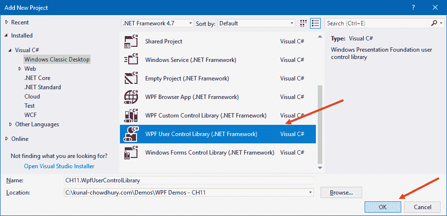

1.  一旦 Visual Studio 创建了项目，你将在项目文件夹中找到一个名为`UserControl1.xaml`的用户控件。从解决方案资源管理器中双击它以打开它。

1.  将`UserControl1`的默认`Grid`分为两列。将第一列设置为可伸缩的，以占用最大可用空间，并将第二列设置为`Auto`：

```cs
<Grid.ColumnDefinitions> 
    <ColumnDefinition Width="*"/> 
    <ColumnDefinition Width="Auto"/> 
</Grid.ColumnDefinitions> 
```

1.  在第一列中放置一个名为`searchBox`的`TextBox`控件：

```cs
<TextBox x:Name="searchBox" 
         Grid.Column="0" 
         MinWidth="100" 
         Margin="4"/>
```

1.  放置一个名为`searchButton`的`Button`控件，并将其放置在`Grid`的第二列中。将其`Content`属性设置为搜索，并将其`Click`事件注册为`OnSearchButtonClicked`：

```cs
<Button x:Name="searchButton" 
        Content="Search" 
        Grid.Column="1" 
        Padding="8 2" 
        Margin="4" 
        Click="OnSearchButtonClicked"/> 
```

1.  这里是`Grid`的完整 XAML 代码：

```cs
<Grid> 
    <Grid.ColumnDefinitions> 
        <ColumnDefinition Width="*"/> 
        <ColumnDefinition Width="Auto"/> 
    </Grid.ColumnDefinitions> 

    <TextBox x:Name="searchBox" 
             Grid.Column="0" 
             MinWidth="100" 
             Margin="4"/> 
    <Button x:Name="searchButton" 
            Content="Search" 
            Grid.Column="1" 
            Padding="8 2" 
            Margin="4" 
            Click="OnSearchButtonClicked"/> 
</Grid> 
```

1.  现在，按*F7*键导航到`UserControl1.xaml.cs`文件的代码后端。

1.  在类中插入以下事件实现：

```cs
private void OnSearchButtonClicked(object sender,  
                                   RoutedEventArgs e) 
{ 
    MessageBox.Show("You searched for: {" +  
                     searchBox.Text + "}"); 
}
```

1.  现在，是时候将创建的用户控件集成到 Windows 表单中了。为此，我们需要一个 WinForm 项目。让我们在解决方案中添加新的项目。为此，从解决方案资源管理器中，右键单击解决方案文件，从上下文菜单中选择添加 | 新项目...。在创建项目时使用以下 Windows Forms App (.NET Framework)模板。将其命名为`CH11.WpfInWinFormDemo`并点击确定按钮：

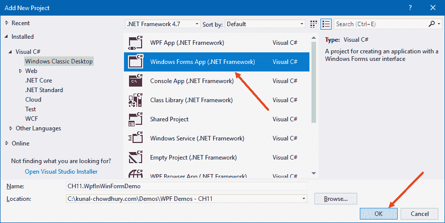

1.  一旦项目创建完成，您需要将 UserControl 库的引用添加到该项目中。为此，在`CH11.WpfInWinFormDemo`项目的引用节点上右键单击，然后从上下文菜单中点击添加引用...：

1.  从引用管理器对话框中，如图所示，展开项目条目，选择所需的库项目（在我们的例子中是 CH11.WpfUserControlLibrary），然后点击确定。这将把库的引用添加到项目中：


1.  还需要在项目中添加以下程序集引用—`PresentationCore`、`PresentationFramework`、`System.Xaml`、`WindowsBase`和`WindowsFormsIntegration`。这些是使用 WPF 控件并托管它们的必需项。

1.  重新构建解决方案并确保解决方案构建时没有错误。这一步也确保了库项目被编译并可在主项目中被发现。

1.  从解决方案资源管理器中双击`Form1.cs`文件以打开它。

1.  现在，打开工具箱，如图所示，从 WPF 互操作性部分拖动 ElementHost 元素到表单（`Form1.cs`）中：

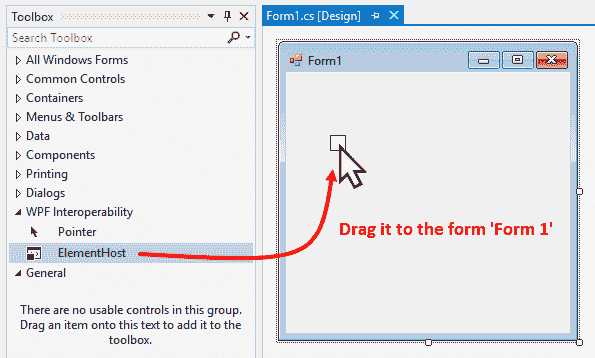

1.  展开 ElementHost 元素的箭头，以选择托管内容。如图所示，点击选择托管内容组合框并选择 UserControl1 以在其中托管：

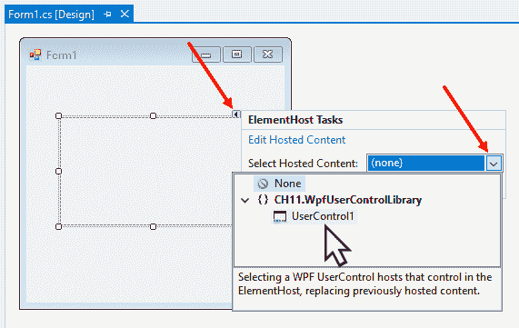

1.  或者，您也可以从工具箱中拖动 UserControl1。在这种情况下，Visual Studio 将添加`ElementHost`并配置它以加载您拖到表单中的 UserControl。完成后，调整控件大小并将其放置在表单中：

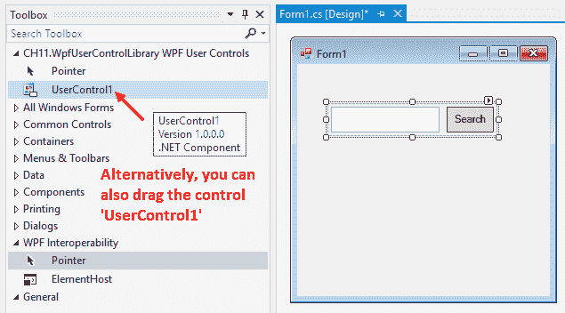

1.  现在再次重新构建解决方案并运行表单应用程序（`CH11.WpfInWinFormDemo`）。您将在屏幕上看到一个表单窗口，其中包含我们创建的 WPF UserControl。它基本上由一个`TextBox`和一个`Button`组成。

1.  在搜索框中输入一些文本并点击按钮。您将在屏幕上看到一个消息框弹出，其中包含您输入的文本：


## 工作原理...

要托管 **WPF 复合控件**，在 Windows 表单宿主应用程序中使用 `ElementHost` 对象。`ElementHost` 类是 `System.Windows.Forms.Integration` 命名空间的一部分，因此您需要在项目中引用 `WindowsFormsIntegration.dll`。

要在 Windows 表单中托管 WPF 元素，必须将其分配给 `ElementHost` 控件的 `Child` 属性。如果需要，使用 `PropertyMap` 属性将 `ElementHost` 和其宿主 WPF 元素之间的自定义映射分配。可选地，您可以使用布尔 `BackColorTransparent` 属性为托管元素设置透明背景。

# 从 WPF 应用程序调用 Win32 API

Windows 表达式基础和 Win32 插值可以作为不同的方法工作。您可以选择在 WPF 应用程序中托管 Win32 应用程序，在 Win32 应用程序中托管 WPF 应用程序，或者通过导入指定的系统 DLL 从 WPF 调用 Win32 API。这些方法在您已经在 Win32 应用程序上投入了大量资金，现在您想利用现有代码构建一个丰富的 WPF 应用程序时非常有用。

在本配方中，我们将学习如何从 WPF 调用 Win32 API。我们将使用一个简单的示例来启动浏览器窗口，然后从我们的 WPF 代码中激活/刷新浏览器窗口。

## 准备工作

开始创建 WPF 应用程序。打开您的 Visual Studio IDE，创建一个名为 `CH11.Win32ApiCallDemo` 的新项目。确保选择 WPF App (.NET Framework) 作为项目模板。

## 如何操作...

按照以下步骤从 WPF 应用程序调用 Win32 API：

1.  首先，我们需要设置项目。一旦 Visual Studio 创建了项目，右键单击项目的“引用”节点。

1.  选择上下文菜单中的“添加引用...”以添加程序集引用。

1.  在引用管理器对话框中，搜索窗体，并从列表中选择 System.Windows.Forms。点击“确定”以添加引用：

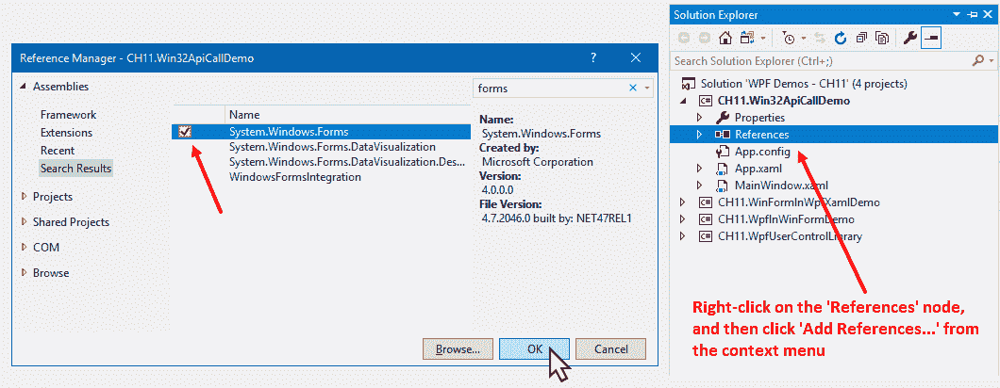

1.  现在，从解决方案资源管理器，导航到 `MainWindow.xaml` 文件。

1.  将现有的 `Grid` 面板替换为以下标记，其中包含一个 `TextBox` (`address`) 和三个 `Button` 控件 (`goButton`、`bringToFrontButton` 和 `refreshButton`)：

```cs
<StackPanel Margin="10"> 
    <TextBlock Text="Enter website URL:" 
               Foreground="Gray" 
               Margin="4 0"/> 

    <StackPanel Orientation="Horizontal"> 
        <TextBox x:Name="address" 
                 Text="http://www.kunal-chowdhury.com" 
                 Width="250" 
                 Margin="4"/> 

        <Button x:Name="goButton" 
                Content="Go..." 
                Padding="8 2" 
                Margin="4" 
                Click="OnGoClicked"/> 

        <Button x:Name="bringToFrontButton" 
                Content="BringToFront" 
                Padding="8 2" 
                Margin="4" 
                Click="OnBringToFrontClicked"/> 

        <Button x:Name="refreshButton" 
                Content="Refresh" 
                Padding="8 2" 
                Margin="4" 
                Click="OnRefreshClicked"/> 
    </StackPanel> 
</StackPanel> 
```

1.  一旦 UI 准备就绪，就是时候创建按钮点击事件实现了。在 XAML 页面中按 *F7* 以导航到其代码隐藏部分。或者，您也可以从解决方案资源管理器打开 `MainWindow.xaml.cs` 文件。

1.  在文件的后端代码中，添加以下命名空间：

```cs
using System; 
using System.Diagnostics; 
using System.Runtime.InteropServices; 
using System.Windows; 
using System.Windows.Forms; 
```

1.  现在，在 `MainWindow` 类中，添加以下声明并确保 `DllImport` 属性和 `Process` 类是可发现的：

```cs
[DllImport("User32.dll")] 
static extern int SetForegroundWindow(IntPtr hWnd); 

private static Process process = new Process(); 
```

1.  让我们实现 `OnGoClicked` 事件处理器。将以下代码复制以使用指定的 URL 地址启动 Internet Explorer，在我们的例子中是 `http://www.kunal-chowdhury.com`：

```cs
private void OnGoClicked(object sender,  
 RoutedEventArgs e) 
{ 
    goButton.IsEnabled = false; 
    process.StartInfo.FileName = "iexplore.exe"; 
    process.StartInfo.Arguments = address.Text; 
    process.Start(); 
}
```

1.  让我们实现 `OnBringToFrontClicked` 事件处理器，以将启动的 Internet Explorer 窗口带到前台，如果它失去了焦点。将以下代码复制以获取进程实例的 `MainWindowHandle` 并调用 Win32 API 方法 `SetForegroundWindow`：

```cs
private void OnBringToFrontClicked(object sender,  
 RoutedEventArgs e) 
{ 
    if (process != null) 
    { 
        var ptr = process.MainWindowHandle; 
        SetForegroundWindow(ptr); 
    } 
} 
```

1.  现在，让我们添加刷新按钮的事件实现。在类文件中添加以下 `OnRefreshClicked` 处理器以激活 Internet Explorer 窗口，然后调用键盘上的 *F5* 键来刷新该浏览器窗口：

```cs
private void OnRefreshClicked(object sender,  
 RoutedEventArgs e) 
{ 
    if (process != null) 
    { 
        IntPtr ptr = process.MainWindowHandle; 
        SetForegroundWindow(ptr); 
        SendKeys.SendWait("{F5}"); 
    } 
} 
```

1.  代码实现完成后，让我们运行应用程序。你将在屏幕上看到以下 UI：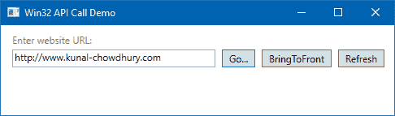

1.  由于应用程序的地址字段已经填充，点击“转到...”按钮。这将启动 Internet Explorer 并导航到指定的地址：

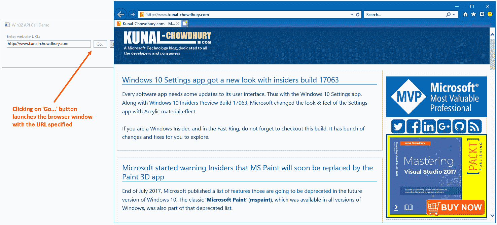

1.  现在，点击应用程序窗口。这将使应用程序带到前台。

1.  现在点击“带到前台”按钮，这将激活 Internet Explorer 并将其带到前台。

1.  同样，点击应用程序窗口，然后点击刷新按钮。这次，Internet Explorer 将激活并刷新窗口的内容：

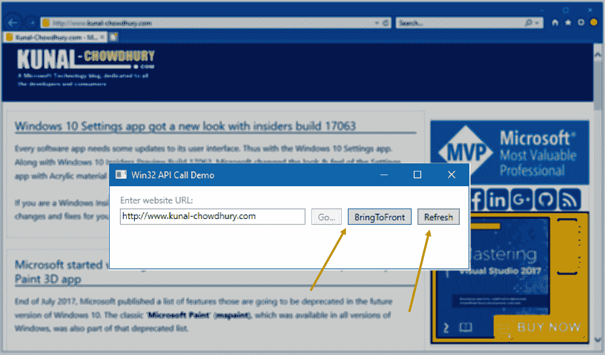

## 它是如何工作的...

当你点击应用程序窗口的“转到...”按钮时，这会创建一个新进程的 Internet Explorer (`iexplore.exe`) 窗口，并将指定的 URL 作为其 `Arguments` 传递给进程，一旦我们调用 `process.Start()` 方法。

当你点击“带到前台”按钮时，它会检索进程的主窗口句柄，并将其作为参数传递给 `SetForegroundWindow` Win32 API 方法。该 API 方法将线程带到前台并激活窗口。

只有满足以下条件之一时，进程才能设置前台窗口：

+   该进程本身是一个前台进程

+   它是由前台进程启动的

+   进程正在被调试

+   前台进程不是一个现代应用程序或启动屏幕

+   没有菜单是激活的

`DllImport` 属性表示具有该属性的函数是由一个未管理的 **动态链接库** (**DLL**) 作为静态入口点公开的。在我们的例子中，是 `User32.dll` 文件。

当你点击“刷新”按钮时，就像“带到前台”按钮一样，它首先通过将其带到前台来激活 Internet Explorer 窗口。然后键盘输入被导向该窗口。

注意，如果用户正在另一个窗口上工作，应用程序不能强制将窗口带到前台。在这种情况下，窗口将在任务栏中闪烁以通知用户。

The `SendKeys.SendWait("{F5}")` 方法调用将给定的键（在我们的例子中是*F5*）发送到活动应用程序，然后等待消息被处理。因为我们在这里传递了*F5*键，它将调用浏览器的`refresh`方法。确保在项目中正确引用了`System.Windows.Forms`，以便`SendKeys.SendWait`方法能够工作。

# 在 WPF 应用程序中嵌入 ActiveX 控件

WPF 也支持**ActiveX**，您可以在 WPF 应用程序中轻松嵌入。这不是 WPF 特有的功能，但由于与 Windows Forms 的互操作性，它得以实现。WinForm 充当两个之间的中间层。

有几个 ActiveX 控件可以轻松嵌入到任何 WPF 应用程序中。在本教程中，我们将学习如何通过一些简单的步骤嵌入 ActiveX 控件。我们将使用随 Windows 一起提供的**Microsoft 终端服务控件**来演示。

## 准备工作

确保 Visual Studio 正在运行。创建一个新的 WPF 项目，并将其命名为`CH11.ActiveXDemo`。

## 如何操作...

按照以下步骤生成所需的**Microsoft 终端服务 ActiveX**控件库，并将其嵌入到我们的 WPF 应用程序中：

1.  第一步是生成我们的 ActiveX 控件所需的库。这是为了获取相关类型的托管和 Windows Forms 兼容的定义。为此，打开**Visual Studio 开发者命令提示符**并导航到一个空文件夹（例如，`D:libs`）。

1.  现在，在命令提示符中，输入以下命令以生成终端服务 DLL 的管理定义：

```cs
  aximp c:WindowsSystem32mstscax.dll  
```

1.  这将在同一文件夹中生成两个 DLL 文件，分别命名为`MSTSCLib.dll`和`AxMSTSCLib.dll`（在我们的例子中是`D:libs`）：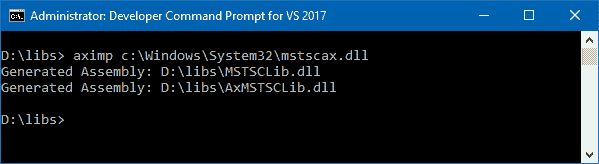

1.  让我们将这些 DLL 文件复制到我们的项目文件夹中。在项目的根文件夹内创建一个名为`libs`的文件夹，并将两个文件复制到那里。

1.  现在，将这些二进制文件的引用添加到我们的项目中。导航回 Visual Studio，从解决方案资源管理器中，右键单击“引用”节点。然后，从上下文菜单中点击“添加引用...”。

1.  从引用管理器对话框窗口中，点击“浏览...”以添加引用。

1.  选择 MSTSCLib.dll 和 AxMSTSCLib.dll，如以下截图所示，然后点击“添加”，这将把选择添加到引用管理器中：

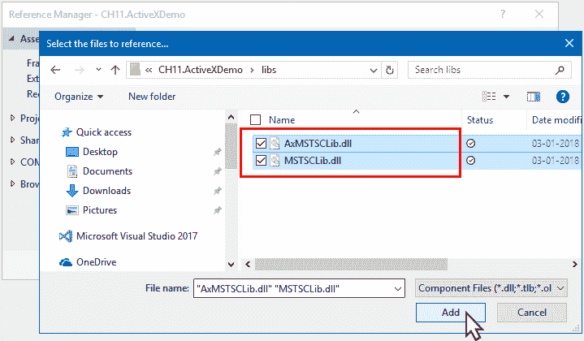

1.  在参考管理器对话框中搜索`forms`，然后选择 System.Windows.Forms 和 WindowsFormsIntegration dlls。

1.  点击“确定”以确认添加四个程序集文件的引用。

1.  现在打开`MainWindow.xaml`文件，并添加以下 XMLNS 属性到其中：

```cs

11.  Replace the existing `Grid` panel with the following markup:

```

<Grid>

    <WindowsFormsHost>

        <lib:AxMsTscAxNotSafeForScripting

                        x:Name="terminal"

                        Height="500" Width="1000"/>

    </WindowsFormsHost>

</Grid>

```cs

12.  Go to the code behind the file by pressing the *F7* key. Alternatively, you can open `MainWindow.xaml.cs` from Solution Explorer.
13.  Inside the constructor of the `MainWindow` class, add the following, just after the `InitializeComponent()` method call, and replace the IP with the one that you want to connect:

```

terminal.Server = "192.168.0.10";

terminal.Connect();

```cs

14.  Now, run the application. You will see the terminal host launched in our WPF application embedded inside it, and pointing to the remote machine for which the IP address has been provided as the `terminal.Server` name. Here's how the application will look:

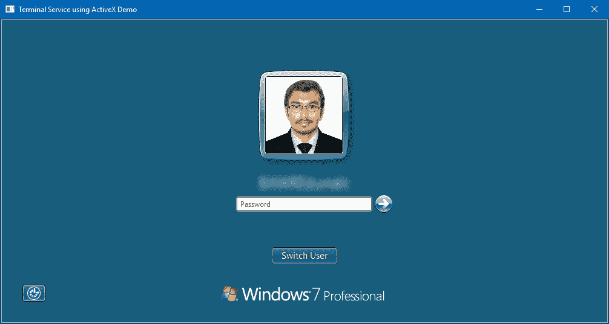

15.  Within that application window, you can now log in to the system and access the desktop, files, and programs remotely.

How it works...
The ActiveX DLL for **Microsoft Terminal Services** (the `mstscax.dll` file) resides in the `%WINDIR%System32` directory. The **ActiveX Importer** (`AXIMP.EXE`), which is part of the **.NET Framework component** of the Windows SDK, generates two DLLs (`MSTSCLib.dll` and `AxMSTSCLib.dll`) from that ActiveX DLL.
The first DLL, `MSTSCLib.dll`, contains the managed definitions of the unmanaged interfaces, classes, structures, and enums, defined in the type library contained inside the ActiveX DLL (`mstscax.dll`). This is generally named with the library name from the original type library.
The second DLL, `AxMSTSCLib.dll`, is named the same but with an `Ax` prefix. This contains a Windows Forms control corresponding to each ActiveX class. The Windows Forms representation of the ActiveX control is added to `WindowsFormsHost`.
In our example, the `AxMsTscAxNotSafeForScripting` control is used in XAML, inside `WindowsFormsHost`, to perform the interaction. Its `Server` property, from the code behind the class, has been set to a simple string, pointing to the remote system's IP address or machine name, discoverable from the host.
When you are ready, the `Connect()` call to the instance of the terminal control (`AxMsTscAxNotSafeForScripting`) connects to the remote system. You can additionally provide `Domainname` , `Username`, and other properties to the terminal instance, before calling the `Connect()` method.

```
