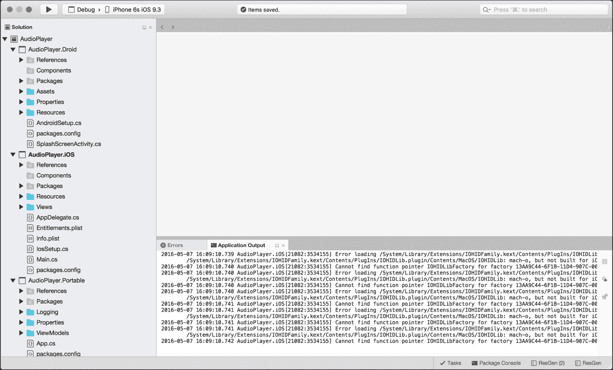
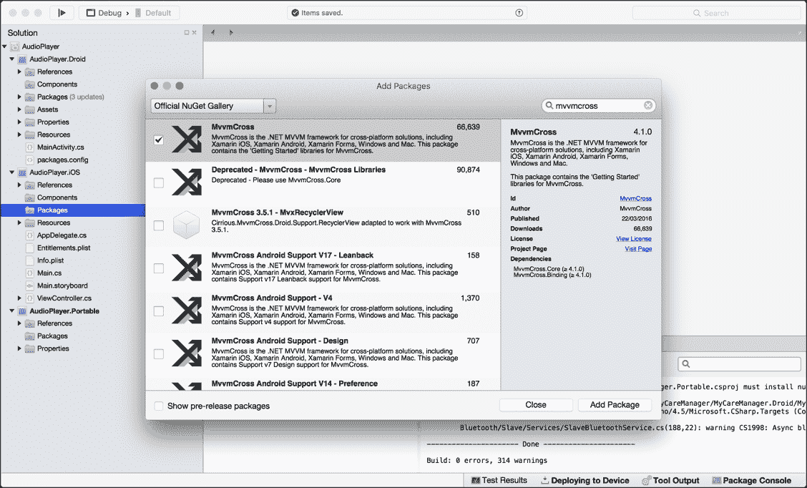
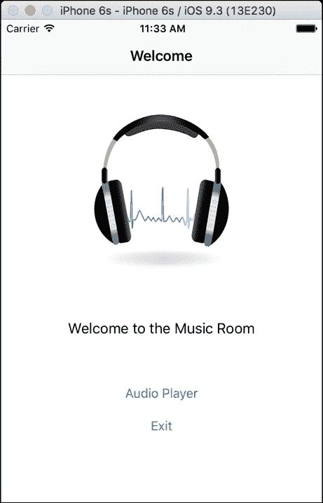
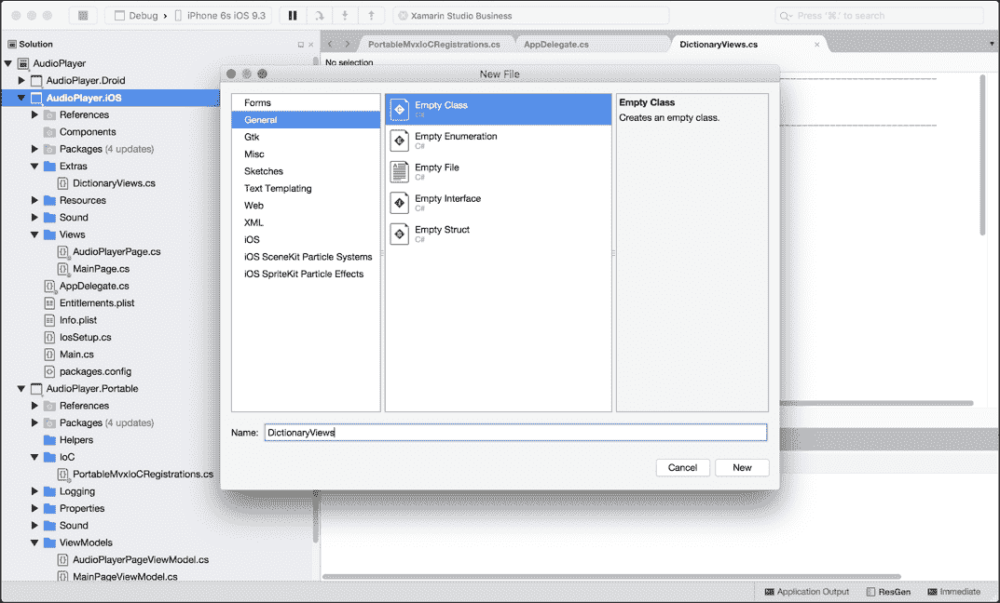
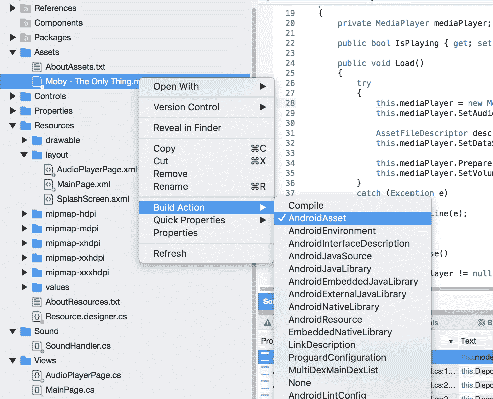
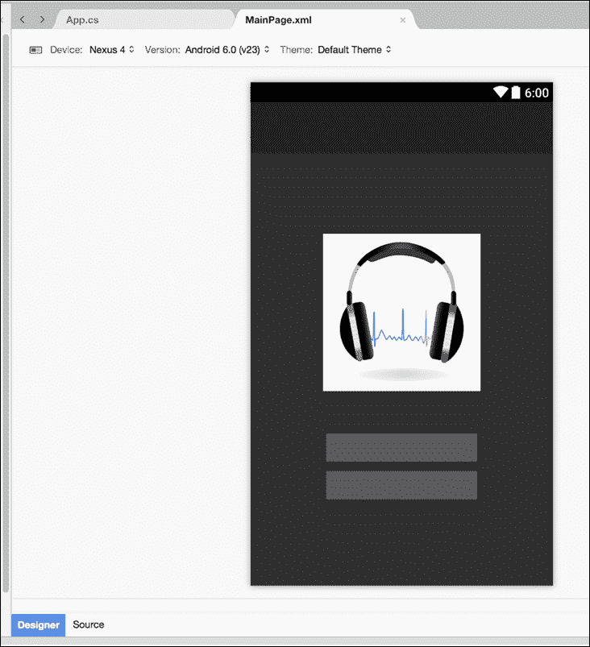

# 第四章：构建音频播放器应用程序

在本章中，我们将回到原生 Xamarin。我们将使用 iOS 中的 `AVFramework` 和 `AVAudioSessions`、`AVAudioSettings`、`AVAudioRecorder` 对象来集成原生音频功能，以处理音频文件。在 Android 中，你将使用 `Android.Media` 库中的 `MediaPlayer` 对象。

预期知识：

+   对 iOS 的 `AVAudioSessions`、`AVAudioSettings` 和 `AVAudioRecorder` 或 Android 的 `MediaPlayer` 和 `MediaRecorder` 类有一定的了解

+   NSLayoutConstraints

在本章中，你将学习以下内容：

+   项目设置

+   使用 MVVMCross 的控制反转

+   使用 Xamarin 本地创建视图模型

+   创建绑定

+   NSLayoutContraints

+   在便携式类库中设置 MVVMCross

+   设置 iOS 上的 MVVMCross

+   设置 Android 上的 MVVMCross

+   `SoundHandler` 接口

+   使用 `AVAudioPlayer` 框架实现 iOS 的 `SoundHandler`

+   Mvx IoC 容器

+   音频播放器

+   `NSLayout` 的更简洁的代码方法

+   创建 `AudioPlayerPageViewModel`

+   使用 `MediaPlayer` 框架实现 Android 的 `SoundHandler`

+   XML 和 Mvx 绑定

# 解决方案设置

既然我们回到了 Xamarin 本地，是时候让你的思维从 XAML 转回到本地的 iOS 和 Android 了。我们不会在用户界面设计上花费太多时间，而是更多地关注使用原生框架进行音频处理。

### 小贴士

如果你在这台电脑上测试这个应用程序，麦克风仍然会工作，因为它将使用你的笔记本电脑的麦克风。

既然我们已经探讨了跨平台应用程序和代码共享，我们将应用一些这些原则到原生开发中，并设置一个 MVVM 架构。让我们从设置三个不同的项目开始，一个 iOS、Android 和 PCL 项目：



# 使用 MVVMCross 的控制反转

在最后两章中，我们探讨了 IoC 容器和引导基础；现在，是时候使用不同的库来用 Xamarin 本地实现这个原则了。

对于所有项目，我们希望导入 `MVVMCross` 库：



### 小贴士

MVVMCross 可用于 `Xamarin.Forms`、`Xamarin.iOS`、`Xamarin.Android`、`Xamarin.Mac` 和 Windows，所以请选择。

MVVMCross 的设置与 `AutoFac` 非常不同，但原则是相同的。

# 使用 Xamarin 本地创建视图模型

在我们添加库之后，让我们从 `AudioPlayer.Portable` 项目开始。创建一个名为 `ViewModels` 的新文件夹，并添加一个名为 `MainPageViewModel.cs` 的新文件。让我们开始使用 MVVMCross 实现我们的第一个视图模型：

```cs
namespace AudioPlayer.Portable.ViewModels 
{ 
    using MvvmCross.Core.ViewModels; 

    public class MainPageViewModel : MvxViewModel 
    { 
        public MainPageViewModel() 
        { 
        } 
   } 
} 

```

当我们构建我们的`Xamarin.Forms`视图模型时，我们创建了自己的基视图模型来处理属性更改；使用这个库，我们可以对基属性进行一些简化。`MvxViewModel`在处理属性更改方面有类似的实现；对于我们的`MainPage`，我们将开发与上一章相同的第一页，所以让我们从私有属性开始：

```cs
public class MainPageViewModel : MvxViewModel 
    { 
        #region Private Properties 

        private string _descriptionMessage = "Welcome to the Music Room"; 

        private string _audioPlayerTitle = "Audio Player"; 

        private string _exitTitle = "Exit"; 

        private MvxCommand _audioPlayerCommand; 

        private MvxCommand _exitCommand; 

        #endregion 
} 

```

注意我们如何使用不同的`Command`类型，称为`MvxCommand`？它与`Xamarin.Forms.Command`非常相似。让我们添加公共属性并看看我们如何处理属性更改：

```cs
#region Public Properties 

        public string DescriptionMessage 
        { 
            get  
            {  
                return _descriptionMessage;  
            }  
            set  
            {  
                if (value.Equals(_descriptionMessage)) 
                { 
                    _descriptionMessage = value; 
                    RaisePropertyChanged (() => DescriptionMessage); 
                } 
            } 
        } 

        public MvxCommand AudioPlayerCommand 
        { 
            get 
            { 
                return _audioPlayerCommand; 
            } 

            set 
            { 
                if (value.Equals(_audioPlayerCommand)) 
                { 
                    _audioPlayerCommand = value; 
                    RaisePropertyChanged (() => AudioPlayerCommand); 
                } 
            } 
        } 

        #endregion 

```

简单，对吧？

这与`set`函数完全相同。我们正在检查值是否已更改；如果已更改，则设置`private`属性并调用`RaisePropertyChanged`。唯一的区别是我们通过`public`属性将操作传递给函数。

现在我们可以开始构建`MainPage`的用户界面了。这次，我们将完全基于`.cs`文件来开发 iOS 界面。添加一个新的`.cs`文件，并将其命名为`MainPage.cs`：

```cs

[MvxViewFor(typeof(MainPageViewModel))] 
    public partial class MainPage : MvxViewController 
    { 
        public MainPage () 
        { 
        } 
    }  

```

# 创建绑定

我们的第一步是构建用户界面。我们将在视图控制器中添加两个`UIButtons`、一个`UILabel`和一个`UIImageView`：

```cs
public override void ViewDidLoad () 
        { 
            base.ViewDidLoad (); 

            var mainView = new UIView ()  
            { 
                TranslatesAutoresizingMaskIntoConstraints = false, 
                BackgroundColor = UIColor.White 
            }; 

            var imageView = new UIImageView() 
            { 
                TranslatesAutoresizingMaskIntoConstraints = false, 
                ContentMode = UIViewContentMode.ScaleAspectFit, 
                Image = new UIImage("audio.png") 
            }; 

            var descriptionLabel = new UILabel ()  
            { 
                TranslatesAutoresizingMaskIntoConstraints = false, 
                TextAlignment = UITextAlignment.Center 
            }; 

            var audioPlayerButton = new UIButton (UIButtonType.RoundedRect)  
            { 
                TranslatesAutoresizingMaskIntoConstraints = false 
            }; 

            var exitButton = new UIButton (UIButtonType.RoundedRect)  
            { 
                TranslatesAutoresizingMaskIntoConstraints = false 
            }; 

            View.Add (mainView); 

            // add buttons to the main view 
            mainView.Add (imageView); 
            mainView.Add (descriptionLabel); 
            mainView.Add (audioPlayerButton); 
            mainView.Add (exitButton); 

        } 

```

现在让我们为用户界面元素创建绑定。将以下内容添加到`ViewDidLoad`函数的底部：

```cs
var set = this.CreateBindingSet<MainPage, MainPageViewModel> (); 
            set.Bind(this).For("Title").To(vm => vm.Title); 
            set.Bind(descriptionLabel).To(vm => vm.DescriptionMessage); 
            set.Bind(audioPlayerButton).For("Title").To(vm => vm.AudioPlayerTitle); 
            set.Bind(audioPlayerButton).To(vm => vm.AudioPlayerCommand); 
            set.Bind(exitButton).For("Title").To(vm => vm.ExitTitle); 
            set.Bind(exitButton).To(vm => vm.ExitCommand); 
            set.Apply (); 

```

当我们创建绑定上下文（`BindingSet`）时，我们将通过绑定集设置所有绑定。第一个绑定是与`description`标签的绑定。我们绑定的对象必须是一个字符串（`DescriptionMessage`是我们从视图模型中得到的字符串对象）。

进一步来说，我们可以使用`For`函数指定 UI 元素的特定属性，并在参数中指定属性的名称。在我们的例子中，我们指定了`UIButton`的`Title`属性，然后调用`To`函数来绑定指定的字符串对象。我们也将此操作应用于`UIViewController`。

最后，我们使用的最后一个绑定是我们视图模型中的`MvxCommands`。我们不需要指定属性名称；我们只需调用`To`函数并在视图模型中指定命令。

### 注意

在我们创建的`UIImageView`中，我们使用了一个名为`audio.png`的图片。你可以放入任何你喜欢的图片，只要图片的名称与在`UIImage`中加载的名称相匹配。本例中所有资源都可以通过 GitHub 链接找到：[`github.com/flusharcade/chapter4-audioplayer`](https://github.com/flusharcade/chapter4-audioplayer)。

# NSLayoutContraints

让我们更仔细地看看我们初始化 UI 元素的地方。`TranslatesAutoresizingMaskIntoConstraints`属性用于确定我们是否将使用`NSLayoutConstraints`来构建用户界面。当我们将其设置为`false`时，这意味着我们必须为该元素实现布局约束。

现在我们想使用布局约束来构建用户界面。在将元素添加到`mainView`之后，添加以下内容：

```cs
View.AddConstraints (NSLayoutConstraint.FromVisualFormat("V:|[mainView]|", NSLayoutFormatOptions.DirectionLeftToRight, null, new NSDictionary("mainView", mainView))); 
            View.AddConstraints (NSLayoutConstraint.FromVisualFormat("H:|[mainView]|", NSLayoutFormatOptions.AlignAllTop, null, new NSDictionary ("mainView", mainView))); 

            mainView.AddConstraints (NSLayoutConstraint.FromVisualFormat("V:|-80-[welcomeLabel]-[audioPlayerButton]-[exitButton]", NSLayoutFormatOptions.DirectionLeftToRight, null, new NSDictionary("welcomeLabel", welcomeLabel, "audioPlayerButton", audioPlayerButton, "exitButton", exitButton))); 
            mainView.AddConstraints (NSLayoutConstraint.FromVisualFormat("H:|-5-[welcomeLabel]-5-|", NSLayoutFormatOptions.AlignAllTop, null, new NSDictionary ("welcomeLabel", welcomeLabel))); 
            mainView.AddConstraints (NSLayoutConstraint.FromVisualFormat("H:|-5-[audioPlayerButton]-5-|", NSLayoutFormatOptions.AlignAllTop, null, new NSDictionary ("audioPlayerButton", audioPlayerButton))); 
            mainView.AddConstraints (NSLayoutConstraint.FromVisualFormat("H:|-5-[exitButton]-5-|", NSLayoutFormatOptions.AlignAllTop, null, new NSDictionary ("exitButton", exitButton))); 

```

在前两行中，我们为 `UIView` 添加了约束。由于视图只包含一个 `UIView`，我们为 `mainView` 对象的垂直和水平属性创建了两个约束。`vertical` 属性设置为以下内容：

```cs
"V:|[mainView]|" 

```

这意味着 `mainView` 将拉伸到包含视图的整个高度，对于 `horizontal` 属性也是如此：

```cs
"H:|[mainView]|" 

```

`mainView` 对象的宽度将被拉伸到包含视图的整个宽度。这两行文本被称为 `VisualFormat.NSLayoutContraints`，它们使用文本输入作为视觉表示，描述了视图如何在父视图中呈现。

看看我们传递给 `AddConstraints` 函数的其他属性，我们传递了 `NSLayoutFormatOption`，用于视图遵守（即，左对齐/顶部对齐），然后是指标和 `NSDictionary`，它将包含涉及约束的 UI 元素。你会注意到一些其他的约束，例如这些：

```cs
"H:|-5-[audioPlayerButton]-5-|" 

```

这些约束包括围绕 UI 元素的填充：

```cs
"H:|-[audioPlayerButton]-|" 

```

我们甚至可以简单地围绕 UI 元素放置一个破折号字符，这将放置默认填充 `8`。

# 在 PCL 内部设置 MVVMCross

进一步深入到 MVVMCross 框架中，让我们首先构建 `MvxApplication` 类。

### 注意

这与 `Xamarin.Forms` 应用程序内的应用程序类不同。

```cs
public class App : MvxApplication 
    { 
        public override void Initialize() 
        { 
            CreatableTypes() 
                .EndingWith("Service") 
                .AsInterfaces() 
                .RegisterAsLazySingleton(); 
        } 
    } 

```

注意到正在调用的 `CreatableTypes` 函数；该函数使用反射来查找核心程序集中的所有 `Creatable` 类，这意味着它们有一个公共构造函数，并且它们不是抽象的。然后，在此函数之后，仅注册以 `Service` 结尾的类接口作为懒单例。

### 注意

懒单例确保如果一个类实现了 `IOne` 和 `ITwo`，则在解析 `IOne` 和 `ITwo` 时将返回相同的实例。

需要在 `Application` 类中添加另一个部分。我们必须注册启动点，因此请在 `RegisterAsLazySingleton` 函数下添加以下行：

```cs
RegisterAppStart<MainPageViewModel>(); 

```

# 在 iOS 中设置 MVVMCross

现在，我们转向 iOS 项目。对于每个平台，我们必须实现一个 `Setup` 类，该类将用于实例化 `MvxApplication` 类。添加一个名为 `IosSetup` 的新类，并实现以下内容：

```cs
public class IosSetup : MvxIosSetup 
    { 
        public IosSetup(MvxApplicationDelegate applicationDelegate, UIWindow window) : base(applicationDelegate, window) 
        { 
        } 

        protected override IMvxApplication CreateApp() 
        { 
            return new App(); 
        } 

        protected override IMvxTrace CreateDebugTrace() 
        { 
            return new DebugTrace(); 
        } 
    } 

```

首先，我们必须包含一个接受 `MvxApplicationDelegate` 和 `UIWindow` 的构造函数；这些将在实例化时传递给基类。我们还有两个作为 `MvxIosSetup` 对象一部分被重写的函数。

从 `CreateApp` 函数开始。我们在这里所做的只是实例化我们之前实现的 `MvxApplication` 类。当我们实现 `AppDelegate` 类时，我们将对此进行更详细的分解。

我们还必须重写 `CreateDebugTrace` 函数，这将实例化一个新的 `DebugTrace` 对象。首先，让我们在我们的 PCL 项目中创建一个名为 `Logging` 的新文件夹，添加一个名为 `DebugTrace.cs` 的新文件，并实现以下内容：

```cs
public class DebugTrace : IMvxTrace 
    { 
        public void Trace(MvxTraceLevel level, string tag, Func<string> message) 
        { 
            Debug.WriteLine(tag + ":" + level + ":" + message()); 
        } 

        public void Trace(MvxTraceLevel level, string tag, string message) 
        { 
            Debug.WriteLine(tag + ":" + level + ":" + message); 
        } 

        public void Trace(MvxTraceLevel level, string tag, string message, params object[] args) 
        { 
            try 
            { 
                Debug.WriteLine(string.Format(tag + ":" + level + ":" + message, args)); 
            } 
            catch (FormatException) 
            { 
                Trace(MvxTraceLevel.Error, tag, "Exception during trace of {0} {1}", level, message); 
            } 
        } 
    } 

```

作为 `IMvxTrace` 接口的一部分，我们必须实现所有这些功能。这些功能并不复杂；我们只是在调用这些功能时捕获错误并将文本输出到控制台。所有通过 `DebugTrace` 对象调用的功能都通过一个单例对象路由。我们将在两个平台项目中共享这个对象。

太好了！现在我们已经完成了所有 iOS 的 MVVMCross 要求，让我们通过 `AppDelegate` 类将这些内容组合起来：

```cs
public override bool FinishedLaunching (UIApplication application, NSDictionary launchOptions) 
        { 
            _window = new UIWindow (UIScreen.MainScreen.Bounds); 

            var setup = new IosSetup(this, window); 
            setup.Initialize(); 

            var startup = Mvx.Resolve<IMvxAppStart>(); 
            startup.Start(); 

            _window.MakeKeyAndVisible (); 

            return true; 
        } 

```

我们在 `FinishedLaunching` 函数中到底做了什么？

首先，我们将 `UIWindow` 实例化为主屏幕边界的大小。然后，我们通过传递新的 `UIWindow` 对象实例化 `IosSetup` 类，并调用我们在 PCL 中的 `MvxApplication` 实现的 `Initialize` 函数。然后，我们使用 Mvx IoC 容器解析 `IMvxAppStart` 接口，并调用 `Start` 以在 `MainPageViewModel` 上开始应用程序。

太棒了！我们现在已经设置了 MVVMCross 与我们的 iOS 项目；接下来，让我们为 Android 项目做同样的事情。

# 设置 MVVMCross 与 Android

由于我们已经完成了 `MVVMCross` 的 `PCL` 设置，我们只需要创建一个设置对象，该对象将继承 `MvxAndroidSetup` 类。

创建一个名为 `AndroidSetup.cs` 的新文件，并实现以下内容：

```cs
public class AndroidSetup : MvxAndroidSetup 
    { 
        public AndroidSetup(Context context) :base(context) 
        { 
        } 

        protected override IMvxApplication CreateApp() 
        { 
            return new App(); 
        } 

        protected override IMvxTrace CreateDebugTrace() 
        { 
            return new DebugTrace(); 
        } 
    } 

```

这与 iOS 设置非常相似，但在构造函数中我们必须传递 Android 上下文。

现在是 Android 的最终设置。我们通常不需要重写应用程序。相反，MVVMCross 默认提供了一个启动画面。删除自动创建的 `MainActivity` 类，并用一个新的活动 `SplashScreenActivity` 替换它：

```cs
[Activity(Label = "AudioPlayer.Droid" 
        , MainLauncher = true 
        , Icon = "@drawable/icon" 
        , Theme = "@style/Theme.Splash" 
        , NoHistory = true 
        , ScreenOrientation = ScreenOrientation.Portrait)] 
    public class SplashScreenActivity : MvxSplashScreenActivity 
    { 
        public SplashScreenActivity(): base(Resource.Layout.SplashScreen) 
        { 
        } 
    } 

```

我们不需要在我们的构造函数中添加任何内容，但我们必须将 `MainLauncher = true` 标志添加到属性中，以确保这是平台启动时创建的第一件事。我们还必须创建启动画面活动的新的 XML 视图。在这个例子中，我们将创建一个简单的屏幕，包含一个 `TextView`：

### 小贴士

尝试创建一个启动画面，显示一个图像以提供应用程序的品牌。

```cs
<?xml version="1.0" encoding="utf-8"?> 
<LinearLayout  
    android:orientation="vertical" 
    android:layout_width="fill_parent" 
    android:layout_height="fill_parent"> 
    <TextView   
    android:layout_width="fill_parent"  
    android:layout_height="wrap_content"  
    android:text="Loading...."/> 
</LinearLayout> 

```

那就是全部了；让我们测试运行这两个平台，我们应该现在看到以下屏幕：



# SoundHandler 接口

在多个平台上播放音频的问题是我们处理音频时不能共享太多代码。我们必须创建一个接口，并通过 IoC 容器注册实现。

我们的下一步是创建 `ISoundHandler` 接口。在 `AudioPlayer.Portable` 项目中，添加一个名为 `Sound` 的新文件夹。在这个文件夹中，添加一个名为 `ISoundHandler.cs` 的新文件，并实现以下内容：

```cs
public interface ISoundHandler 
    { 
        bool IsPlaying { get; set; } 

        void Load(); 

        void PlayPause(); 

        void Stop(); 

        double Duration(); 

        void SetPosition(double value); 

        double CurrentPosition(); 

        void Forward(); 

        void Rewind(); 
    } 

```

我们的接口将描述我们将通过 `AudioPlayerPage` 接口使用到的所有功能。

现在让我们开始 iOS 的实现。

# 使用 AVAudioPlayer 框架实现 iOS SoundHandler

`AVAudioPlayer`类是我们将在 iOS 中用于播放和控制音频流的框架，所以让我们首先在我们的 iOS 项目中添加一个名为`Sound`的新文件夹。然后我们想要创建一个名为`SoundHandler.cs`的新文件，该文件将继承`ISoundHandler`接口：

```cs
public class SoundHandler : ISoundHandler 
    { 

    } 

```

现在让我们创建一个私有的`AVAudioPlayer`对象，并添加我们的公共`IsPlaying`，它将保存音频播放器的播放状态：

```cs
private AVAudioPlayer _audioPlayer; 

public bool IsPlaying { get; set; } 

```

然后我们添加接口的函数。在每个函数中，我们将使用音频播放器对象来完成所有的音频处理：

```cs
public void Load() 
        { 
            _audioPlayer = AVAudioPlayer.FromUrl(NSUrl.FromFilename("Moby - The Only Thing.mp3")); 
        } 

public void PlayPause() 
        { 
            if (_audioPlayer != null) 
            { 
                if (IsPlaying) 
                { 
                    _audioPlayer.Stop(); 
                } 
                else 
                { 
                    _audioPlayer.Play(); 
                } 

                IsPlaying = !IsPlaying; 
            } 
        } 

```

第一个函数将从`Resources`文件夹中加载文件。在这个例子中，我们将加载一首 Moby 的歌曲（我个人非常喜欢的一首）。

### 注意

你可以添加任何音频文件，只要文件名与通过`NSURL`对象加载的文件名匹配。如果你想使用与这个相同的文件，请访问之前提到的 GitHub 链接。

第二个函数将控制音频的播放和停止。如果我们首先点击播放按钮，它将播放并将`IsPlaying`的状态设置为`true`。然后如果我们再次点击播放按钮，它将停止音频并将`IsPlaying`设置为`false`。

现在让我们继续实现其余部分：

```cs
public void Stop() 
        { 
            if (_audioPlayer != null) 
            { 
                _audioPlayer.Stop(); 
            } 
        } 

        public double Duration() 
        { 
            if (_audioPlayer != null) 
            { 
                return _audioPlayer.Duration; 
            } 

            return 0; 
        } 

        public void SetPosition(double value) 
        { 
            if (_audioPlayer != null) 
            { 
                _audioPlayer.CurrentTime = value; 
            } 
        } 

        public double CurrentPosition() 
        { 
            if (_audioPlayer != null) 
            { 
                return _audioPlayer.CurrentTime; 
            } 

            return 0; 
        } 

        public void Forward() 
        { 
            if (_audioPlayer != null) 
            { 
                IsPlaying = false; 

                _audioPlayer.Stop(); 
                _audioPlayer.CurrentTime = audioPlayer.Duration; 
            } 
        } 

        public void Rewind() 
        { 
            if (_audioPlayer != null) 
            { 
                IsPlaying = false; 

                _audioPlayer.Stop(); 
                _audioPlayer.CurrentTime = 0; 
            } 
        } 

```

所有这些都是直截了当的：我们的`Stop`函数将停止音频。我们的`Rewind`函数将停止音频并将当前时间设置为 0（意味着音频流的开始）。我们的`Forward`函数将停止音频并将当前时间移动到流的末尾。最后两个函数将设置音频流的当前位置为传入的双值。这将与我们的进度滑块一起使用；当滑块位置改变时，值将传递到这个函数以更新音频流的当前位置。最后，最后一个函数将检索当前时间值，以便我们可以用这个细节更新我们的用户界面。

太好了！现在我们已经为 iOS 实现了声音处理，我们想要通过 IoC 容器注册它。

# Mvx IoC 容器

MVVMCross 自带其自己的 IoC 容器。它的工作方式与我们的上一个例子中的 Autofac 完全一样，但我们不会使用模块。让我们首先注册我们的声音处理实现；打开我们的`AppDelegate.cs`文件，创建一个名为`setupIoC`的新私有函数：

```cs
private void SetupIoC() 
{ 
     Mvx.RegisterType<ISoundHandler, SoundHandler>(); 
} 

```

我们还必须注册我们的视图模型，这样我们才能在视图模型的构造函数中检索已注册的接口。让我们在我们的`AudioPlayer.Portable`项目中添加一个名为`IoC`的新文件夹。添加一个名为`PortableMvxIoCRegistrations.cs`的新文件，并实现以下内容：

```cs
public static class PortableMvxIoCRegistrations 
    { 
        public static void InitIoC() 
        { 
            Mvx.IocConstruct<MainPageViewModel>(); 
            Mvx.IocConstruct<AudioPlayerPageViewModel>(); 
        } 
    } 

```

现在我们必须从`AppDelegate`函数`SetupIoC`中调用静态函数`InitIoC`：

```cs
private void SetupIoC() 
        { 
            Mvx.RegisterType<ISoundHandler, SoundHandler>(); 
            PortableMvxIoCRegistrations.InitIoC(); 
        } 

```

现在我们已经将所有需要注册的内容都注册到 IoC 容器中，让我们开始构建`AudioPlayerPage`。

# 音频播放器

在这个项目中，我们的下一步是构建控制音频的用户界面。在`Views`文件夹内添加一个名为`AudioPlayerPage.cs`的新文件；别忘了在类声明上方添加属性以注册 MVVMCross 框架的视图模型：

```cs
[MvxViewFor(typeof(AudioPlayerPageViewModel))] 
public class AudioPlayerPage : MvxViewController 
{ 
   private UIButton playButton; 

        private UISlider _progressSlider; 

        private bool _playing; 

        private AudioPlayerPageViewModel _model; 
} 

```

### 注意

我们声明了一些需要在多个函数中使用的局部作用域变量；你将看到这些是如何被使用的。

现在让我们通过`ViewDidLoad`函数创建 UI 元素：

```cs
public override void ViewDidLoad() 
        { 
            base.ViewDidLoad(); 

            var mainView = new UIView() 
            { 
                TranslatesAutoresizingMaskIntoConstraints = false, 
                BackgroundColor = UIColor.White 
            }; 

            var buttonView = new UIView() 
            { 
                TranslatesAutoresizingMaskIntoConstraints = false, 
                BackgroundColor = UIColor.Clear 
            }; 

            var imageView = new UIImageView() 
            { 
                TranslatesAutoresizingMaskIntoConstraints = false, 
                ContentMode = UIViewContentMode.ScaleAspectFit, 
                Image = new UIImage("moby.png") 
            }; 

            var descriptionLabel = new UILabel() 
            { 
                TranslatesAutoresizingMaskIntoConstraints = false, 
                TextAlignment = UITextAlignment.Center 
            }; 

            var startLabel = new UILabel() 
            { 
                TranslatesAutoresizingMaskIntoConstraints = false, 
                TextAlignment = UITextAlignment.Left, 
            }; 

            var endLabel = new UILabel() 
            { 
                TranslatesAutoresizingMaskIntoConstraints = false, 
                TextAlignment = UITextAlignment.Right, 
            }; 

            _progressSlider = new UISlider() 
            { 
                TranslatesAutoresizingMaskIntoConstraints = false, 
                MinValue = 0 
            }; 

            _playButton = new UIButton(UIButtonType.Custom) 
            { 
                TranslatesAutoresizingMaskIntoConstraints = false, 
            }; 
            var rewindButton = new UIButton(UIButtonType.Custom) 
            { 
                TranslatesAutoresizingMaskIntoConstraints = false, 
            }; 
            var fastForwardButton = new UIButton(UIButtonType.Custom) 
            { 
                TranslatesAutoresizingMaskIntoConstraints = false, 
            }; 
        } 

```

我们有标签用于显示当前曲目名称、开始时间和结束时间。我们还有控制音频流的按钮（播放、暂停、快退和快进）。最后，我们有进度滑块用于动画当前音频时间；我们还将使用它来改变音频的位置。

我们现在想要为按钮添加控制按钮图像上一些 UI 变化的按钮事件；在播放按钮声明下添加事件处理程序分配：

```cs
_playButton.TouchUpInside += HandlePlayButton; 
            _playButton.SetImage(UIImage.FromFile("play.png"), UIControlState.Normal); 

```

### 注意

`TouchUpInside`事件会在我们点击按钮时触发。

然后创建事件处理程序函数：

```cs
        private void HandlePlayButton(object sender, EventArgs e) 
        { 
            _playing = !_playing; 
            _playButton.SetImage(UIImage.FromFile(playing ? "pause.png" : "play.png"), UIControlState.Normal); 
        } 

```

每次我们点击播放按钮时，它都会在播放和暂停图标之间移动图像。现在让我们添加快退和快进按钮处理程序；在每个 UI 元素声明下添加以下行：

```cs
rewindButton.TouchUpInside += HandleRewindForwardButton; 
            rewindButton.SetImage(UIImage.FromFile("rewind.png"), UIControlState.Normal); 
fastForwardButton.TouchUpInside += HandleRewindForwardButton; 
            fastForwardButton.SetImage(UIImage.FromFile("fast_forward.png"), UIControlState.Normal); 

```

现在我们添加事件处理程序函数：

```cs
        private void HandleRewindForwardButton(object sender, EventArgs e) 
        { 
            _playing = false; 
            _playButton.SetImage(UIImage.FromFile("play.png"), UIControlState.Normal); 
        } 

```

这与播放按钮处理程序类似，但这次我们总是将播放状态设置为 false，并将播放按钮图像设置为播放图标。

### 注意

对于所有音频图像，请访问之前给出的 GitHub 链接。

# NSLayout 的更简洁的代码方法

在我们之前的屏幕上，我们使用`NSLayoutContraints`构建了一个非常简单的用户界面。

你会同意代码看起来相当笨拙吗？

使用我们的`AudioPlayerPage`，我们将采用更简洁的方法来编写`NSLayoutConstraints`。首先，创建一个名为`Extras`的新文件夹，并添加一个名为`DictionaryViews.cs`的新文件：



这个类将继承`IEnumerable`接口以创建一个`NSDictionary`；该接口的一部分是我们必须指定`GetEnumerator`函数。它将从`NSDictionary`中获取这个函数；我们还有一个`Add`函数，它简单地将一个新的`UIView`添加到字典中。然后我们有静态隐式转换操作符，它将返回一个`NSDictionary`对象（这是为了我们可以直接将对象作为`NSDictionary`传递给`FromVisualLayout`函数）：

```cs
public class DictionaryViews : IEnumerable 
    { 
        private readonly NSMutableDictionary _nsDictionary; 

        public DictionaryViews() 
        { 
            _nsDictionary = new NSMutableDictionary(); 
        } 

        public void Add(string name, UIView view) 
        { 
            _nsDictionary.Add(new NSString(name), view); 
        } 

        public static implicit operator NSDictionary(DictionaryViews us) 
        { 
            return us.ToNSDictionary(); 
        } 

        public NSDictionary ToNSDictionary() 
        { 
            return _nsDictionary; 
        } 

        public IEnumerator GetEnumerator() 
        { 
            return ((IEnumerable)_nsDictionary).GetEnumerator(); 
        } 
    } 

```

现在我们继续在`AudioPlayerPage`内部创建这些之一；在快进按钮声明下粘贴以下内容：

```cs
            var views = new DictionaryViews() 
            { 
                {"mainView", mainView}, 
                {"buttonView", buttonView}, 
                {"imageView", imageView}, 
                {"descriptionLabel", descriptionLabel}, 
                {"startLabel", startLabel}, 
                {"endLabel", endLabel}, 
                {"progressSlider", progressSlider}, 
                {"playButton", playButton}, 
                {"rewindButton", rewindButton}, 
                {"fastForwardButton", fastForwardButton} 
            }; 

```

太好了！我们现在有一个新的`IEnumerable`/`NSDictionary`，其中包含整个界面中需要使用的所有必需视图。我们可以直接将此对象传递给`NSLayoutConstraint`函数`FromVisualFormat`，这样我们就不需要在创建每个`NSLayoutContraint`时重复声明新的字典。现在将所有 UI 元素添加到正确的父视图中：

```cs
View.Add(mainView); 

            mainView.Add(imageView); 
            mainView.Add(descriptionLabel); 
            mainView.Add(buttonView); 
            mainView.Add(startLabel); 
            mainView.Add(endLabel); 
            mainView.Add(progressSlider); 

            buttonView.Add(playButton); 
            buttonView.Add(rewindButton); 
            buttonView.Add(fastForwardButton); 

```

然后让我们构建所有的`NSLayoutConstraints`；我们的第一个是`UIViewController'sUIView`：

```cs
View.AddConstraints( 
                NSLayoutConstraint.FromVisualFormat("V:|[mainView]|", NSLayoutFormatOptions.DirectionLeftToRight, null, views) 
                .Concat(NSLayoutConstraint.FromVisualFormat("H:|[mainView]|", NSLayoutFormatOptions.AlignAllTop, null, views)) 
                .ToArray()); 

```

我们使用`System.Linq`函数`Concat`来组合所有必需的`NSLayoutContraints`，用于视图。我们只需要调用一次`AddConstraints`函数，并传递一个包含该父视图所需所有约束的数组。

让我们添加对`mainView`和`buttonView`的约束：

```cs
mainView.AddConstraints( 
                NSLayoutConstraint.FromVisualFormat("V:|-100-[imageView(200)]-[descriptionLabel(30)]-[buttonView(50)]-[startLabel(30)]-[progressSlider]", NSLayoutFormatOptions.DirectionLeftToRight, null, views) 
                .Concat(NSLayoutConstraint.FromVisualFormat("V:|-100-[imageView(200)]-[descriptionLabel(30)]-[buttonView(50)]-[endLabel(30)]-[progressSlider]", NSLayoutFormatOptions.DirectionLeftToRight, null, views)) 
                .Concat(NSLayoutConstraint.FromVisualFormat("H:|-20-[progressSlider]-20-|", NSLayoutFormatOptions.AlignAllTop, null, views)) 
                .Concat(NSLayoutConstraint.FromVisualFormat("H:|-25-[startLabel(70)]", NSLayoutFormatOptions.AlignAllTop, null, views)) 
                .Concat(NSLayoutConstraint.FromVisualFormat("H:[endLabel(70)]-25-|", NSLayoutFormatOptions.AlignAllTop, null, views)) 
                .Concat(NSLayoutConstraint.FromVisualFormat("H:|-5-[descriptionLabel]-5-|", NSLayoutFormatOptions.AlignAllTop, null, views)) 
                .Concat(NSLayoutConstraint.FromVisualFormat("H:|-5-[imageView]-5-|", NSLayoutFormatOptions.AlignAllTop, null, views)) 
                .Concat(new[] { NSLayoutConstraint.Create(buttonView, NSLayoutAttribute.CenterX, NSLayoutRelation.Equal, mainView, NSLayoutAttribute.CenterX, 1, 0) }) 
                .ToArray()); 

            buttonView.AddConstraints( 
                NSLayoutConstraint.FromVisualFormat("V:|-5-[rewindButton]-5-|", NSLayoutFormatOptions.AlignAllTop, null, views) 
                .Concat(NSLayoutConstraint.FromVisualFormat("V:|-5-[playButton]-5-|", NSLayoutFormatOptions.AlignAllTop, null, views)) 
                .Concat(NSLayoutConstraint.FromVisualFormat("V:|-5-[fastForwardButton]-5-|", NSLayoutFormatOptions.AlignAllTop, null, views)) 
                .Concat(NSLayoutConstraint.FromVisualFormat("H:|-20-[rewindButton]-[playButton(100)]-[fastForwardButton]-20-|", NSLayoutFormatOptions.AlignAllTop, null, views)) 
                .ToArray()); 

```

这完全相同的方法，但看起来更美观，并且减少了调用`AddConstraints`的次数。视图只需要添加所有约束一次，并布局一次元素，因此效率更高。

构建用户界面的最后一步是设置 MVVMCross 绑定；我们使用与`MainPage`相同的方法。让我们在`AudioPlayerPage`和`AudioPlayerPageViewModel`之间创建一个新的绑定集：

```cs
            var set = CreateBindingSet<AudioPlayerPage, AudioPlayerPageViewModel>(); 
            set.Apply(); 

```

在我们开始创建绑定之前，让我们首先为`AudioPlayer.Portable`项目构建`AudioPlayerPageViewModel`。

# 创建 AudioPlayerPageViewModel

我们的`AudioPlayerPageViewModel`必须包含我们的`ISoundHandler`接口。我们将从这个视图模型控制音频，因此我们的按钮可以启动声音处理程序上所需的事件。让我们首先在`ViewModels`文件夹中创建一个名为`AudioPlayerPageViewModel.cs`的新文件，并从实现私有属性开始：

```cs
public class AudioPlayerPageViewModel : MvxViewModel 
    { 
        #region Private Properties 

        private readonly ISoundHandler _soundHandler; 

        private string _title = "Audio Player"; 

        private string _descriptionMessage = "Moby - The Only Thing"; 

        private MvxCommand _playPauseCommand; 

        private MvxCommand _forwardCommand; 

        private MvxCommand _rewindCommand; 

        private float _audioPosition; 

        private double _currentTime; 

        private double _endTime; 

        private bool _updating; 

        #endregion 

```

然后我们必须添加`public`属性。

### 注意

我们只展示两个`public`属性作为示例，因为代码是重复的。

```cs
public MvxCommand PlayPauseCommand 
        { 
            get 
            { 
                return _playPauseCommand; 
            } 

            set 
            { 
                if (!value.Equals(_playPauseCommand)) 
                { 
                    _playPauseCommand = value; 
                    RaisePropertyChanged (() => PlayPauseCommand); 
                } 
            } 
        } 

        public MvxCommand RewindCommand 
        { 
            get 
            { 
                return _rewindCommand; 
            } 

            set 
            { 
                if (!value.Equals(_rewindCommand)) 
                { 
                    _rewindCommand = value; 
                    RaisePropertyChanged(() => RewindCommand); 
                } 
            } 
        } 

```

我们还需要添加这两个公共变量，它们将接受`CurrentTime`和`EndTime`的双精度值，并从`TimeSpan`值创建一个格式化的字符串。

注意我们也在双 setter 中的字符串上调用`RaisePropertyChanged`吗？每次我们获取一个新的当前时间值时，格式化的字符串也需要更新：

```cs
public string CurrentTimeStr 
        { 
            get 
            { 
                return TimeSpan.FromSeconds(CurrentTime).ToString("mm\\:ss"); 
            } 
        } 

        public double CurrentTime 
        { 
            get 
            { 
                return _currentTime; 
            } 

            set 
            { 
                if (!value.Equals(_currentTime)) 
                { 
                    _currentTime = value; 
                    RaisePropertyChanged(() => CurrentTime); 
                    // everytime we change the current time, the time span values must also update 
                    RaisePropertyChanged(() => CurrentTimeStr); 
                } 
            } 
        } 

        public string EndTimeStr 
        { 
            get 
            { 
                return TimeSpan.FromSeconds(EndTime).ToString("mm\\:ss"); 
            } 
        } 

        public double EndTime 
        { 
            get 
            { 
                return _endTime; 
            } 

            set 
            { 
                if (!value.Equals(_endTime)) 
                { 
                    _endTime = value; 
                    RaisePropertyChanged(() => EndTime); 
                    RaisePropertyChanged(() => EndTimeStr); 
                } 
            } 
        } 

```

现在是我们的构造函数：

```cs
#region Constructors 

        public AudioPlayerPageViewModel (ISoundHandler soundHandler) 
        { 
            _soundHandler = soundHandler; 

            // load sound file 
            _soundHandler.Load(); 

            EndTime = _soundHandler.Duration(); 
        } 

        #endregion 

```

在这里，我们从 IoC 容器中提取了`ISoundHandler`实现，因为我们将在 IoC 容器中注册这个视图模型。

我们的下一步是向视图模型添加两个新函数，`Load`和`Dispose`。这两个函数将在`AudioPlayerPage`显示和消失时被调用，并且当音频流开始和停止时也会被使用。

让我们先添加`Load`函数：

```cs
public void Load() 
        { 
            // make sure we only start the loop once 
            if (!_updating) 
            { 
                _updating = true; 

                // we are going to post a regular update to the UI with the current time 
                var context = SynchronizationContext.Current; 

                Task.Run(async () => 
                { 
                    while (_updating) 
                    { 
                        await Task.Delay(1000); 

                        context.Post(unused => 
                        { 
                            var current = _soundHandler.CurrentPosition(); ; 

                            if (current > 0) 
                            { 
                               CurrentTime = current; 
                            } 

                        }, null); 
                    } 
                }); 
            } 
        } 

```

当页面显示和音频流开始时，将调用`Load`函数。该函数使用`Task`框架在后台运行一个重复循环，因此每秒我们将从`ISoundHandler`接口检索音频流的当前时间。我们将更新传播到`AudioPlayerPage`接口上的当前时间标签。

注意我们是如何使用`SynchronisationContext.Current`变量的？

这用于线程目的，所以我们确保我们在主 UI 线程上设置我们的`CurrentTime`变量。由于这个循环是在一个单独的线程上运行的，如果我们在这个变量上进行了更改，它将破坏应用程序，因为你在尝试在主 UI 线程之外进行 UI 更改。

对于`Dispose`函数；这个函数将在`AudioPlayerPage`消失和音频流停止时被调用（当音频流没有播放时，我们不需要更新 UI）。这确保了当页面不可见时停止后台循环：

```cs
public void Dispose() 
        { 
            _updating = false; 
            _soundHandler.Stop(); 
        } 

```

私有变量`_updating`用于控制后台循环是否正在运行的状态，因此我们确保在任何时候只有一个后台循环正在运行。

现在让我们开始音频命令：

```cs
_playPauseCommand = new MvxCommand(() => 
            { 
                // start/stop UI updates if the audio is not playing 
                if (soundHandler.IsPlaying) 
                { 
                    Dispose(); 
                } 
                else 
                { 
                    Load(); 
                } 

                _soundHandler.PlayPause(); 
            }); 

            _rewindCommand = new MvxCommand(() => 
            { 
                // set current time to the beginning 
                CurrentTime = 0; 
                _soundHandler.Rewind(); 
                Dispose(); 
            }); 

            _forwardCommand = new MvxCommand(() => 
            { 
                // set current time to the end 
                CurrentTime = _soundHandler.Duration(); 
                _soundHandler.Forward(); 
                Dispose(); 
            }); 

```

更仔细地查看这些命令，使用`PlayPauseCommand`，我们将根据音频流的播放状态调用`Load`或`Dispose`，并且它还会在`ISoundHandler`接口上调用`PlayPause`，这控制着音频流。`rewindCommand`属性将当前时间设置为 0，将音频流的当前时间设置为 0，并停止后台循环。`forwardCommand`属性将当前时间设置为音频流的结束持续时间（它将从`ISoundHandler`接口检索），将音频流的当前时间设置为结束持续时间，并停止后台循环。

最后，我们必须创建一个`public`函数来设置音频流的当前时间。这个函数将在进度条值每次变化时被我们的进度条使用，这个函数将被调用：

```cs
        public void UpdateAudioPosition(double value) 
        { 
            _soundHandler.SetPosition(value); 
        } 

```

现在回到`AudioPlayerPage`并添加最终的功能。

由于我们在绑定到视图的视图模型之前声明了一个局部变量，我们希望将其从`UIView`的数据上下文中提取出来：

```cs
_model = (AudioPlayerPageViewModel)DataContext; 

```

我们的局部变量绑定了一个视图模型。我们需要从我们的视图中调用视图模型的一些公共方法。我们必须在进度条声明的下面添加对进度条`ValueChanged`事件的`event handler`。添加以下内容：

```cs
progressSlider.ValueChanged += ProgressSliderValueChanged; 

```

然后创建事件处理函数：

```cs
        private void ProgressSliderValueChanged(object sender, EventArgs e) 
        { 
            _model.UpdateAudioPosition(_progressSlider.Value); 
        } 

```

当页面出现时，添加对`Load`函数的调用：

```cs
public override void ViewDidAppear(bool animated) 
        { 
            _model.Load(); 

            base.ViewDidAppear(animated); 
        } 

```

重写`ViewDidDisappear`以调用`Dispose`函数：

```cs
public override void ViewDidDisappear(bool animated) 
        { 
            _model.Dispose(); 

            base.ViewDidDisappear(animated); 
        } 

```

在绑定集中创建以下绑定：

```cs
set.Bind(this).For("Title").To(vm => vm.Title); 
            set.Bind(descriptionLabel).To(vm => vm.DescriptionMessage); 
            set.Bind(currentLabel).To(vm => vm.CurrentTime); 
            set.Bind(endLabel).To(vm => vm.EndTime); 
            set.Bind(progressSlider).For(v => v.Value).To(vm => vm.CurrentTime);  
            set.Bind(progressSlider).For(v => v.MaxValue).To(vm => vm.EndTime); 
            set.Bind(playButton).To(vm => vm.PlayPauseCommand); 
            set.Bind(rewindButton).To(vm => vm.RewindCommand); 
            set.Bind(fastForwardButton).To(vm => vm.ForwardCommand); 

```

我们将标签绑定到描述，这些是硬编码的。这就是为什么我们必须在主 UI 线程上更改`CurrentTime`变量，因为它会影响`currentLabel`上显示的内容。我们还在音频按钮上绑定了`MvxCommand`。最后，我们在进度条的`Value`属性上绑定了绑定，以匹配`CurrentTime`变量，并将`MaxValue`与音频流的结束时间相匹配，以便与音频流的播放百分比相匹配。

太棒了！尝试运行应用程序，并尝试播放/暂停和进度滑块功能。

让我们继续构建 Android 版本的等效功能。

# 使用 MediaPlayer 框架实现 Android SoundHandler

要在 Android 中实现声音处理接口的相同功能，我们将使用`MediaPlayer`框架。

让我们在 Android 项目中创建一个新的文件夹，命名为`Sound`，并创建一个名为`SoundHandler.cs`的新文件：

```cs
public class SoundHandler : ISoundHandler 
{ 
        private MediaPlayer _mediaPlayer; 

        public bool IsPlaying { get; set; } 
} 

```

与 iOS 版本相同，让我们添加`Load`和`PlayPause`函数：

```cs
public void Load() 
        { 
            try 
            { 
                _mediaPlayer = new MediaPlayer(); 
                _mediaPlayer.SetAudioStreamType(Stream.Music); 

                AssetFileDescriptor descriptor = Android.App.Application.Context.Assets.OpenFd("Moby - The Only Thing.mp3"); 
                _mediaPlayer.SetDataSource(descriptor.FileDescriptor, descriptor.StartOffset, descriptor.Length); 

                _mediaPlayer.Prepare(); 
                _mediaPlayer.SetVolume(1f, 1f); 
            } 
            catch (Exception e) 
            { 
                Debug.WriteLine(e); 
            } 
        } 

        public void PlayPause() 
        { 
            if (_mediaPlayer != null) 
            { 
                if (IsPlaying) 
                { 
                    _mediaPlayer.Pause(); 
                } 
                else 
                { 
                    _mediaPlayer.Start(); 
                } 

                IsPlaying = !IsPlaying; 
            } 
        } 

```

在`Load`函数中，我们有一些异常处理，以防文件由于任何原因无法加载；这将阻止我们的应用程序崩溃。当你将`.mp3`放入 Android 项目时，它必须放在`Assets`文件夹中，并确保文件的构建操作设置为`AndroidAsset`：



在我们的`load`函数中，初始化`MediaPlayer`对象之后，我们将流类型设置为`Stream.Music`，然后使用`AssetFileDescriptor`检索`.mp3`文件。然后，我们将`MediaPlayer`的源设置为来自`AssetFileDescriptor`的`.mp3`文件。接下来，我们调用`Prepare`并设置音量为最大（1.0f）。

我们的`PlayPause`函数非常简单；我们只需检查音频是否正在播放，以确定是暂停还是开始音频流。

现在是其他函数：

```cs
public void Stop() 
        { 
            if (_mediaPlayer != null) 
            { 
                _mediaPlayer.Stop(); 
                _mediaPlayer.Reset(); 
            } 
        } 

        public double Duration() 
        { 
            if (_mediaPlayer != null) 
            { 
                return _mediaPlayer.Duration / 1000; 
            } 

            return 0; 
        } 

        public void SetPosition(double value) 
        { 
            if (_mediaPlayer != null) 
            { 
                _mediaPlayer.SeekTo((int)value * 1000); 
            } 
        } 

        public double CurrentPosition() 
        { 
            if (_mediaPlayer != null) 
            { 
                return _mediaPlayer.CurrentPosition / 1000; 
            } 

            return 0; 
        } 

        public void Forward() 
        { 
            if (_mediaPlayer != null) 
            { 
                IsPlaying = false; 

                _mediaPlayer.Pause(); 
                _mediaPlayer.SeekTo(_mediaPlayer.Duration); 
            } 
        } 

        public void Rewind() 
        { 
            if (_mediaPlayer != null) 
            { 
                IsPlaying = false; 

                _mediaPlayer.Pause(); 
                _mediaPlayer.SeekTo(0); 
            } 
        } 

```

`Stop`函数需要在调用`Stop`之后在`MediaPlayer`上调用`Reset`函数。`Duration`和`CurrentPosition`函数需要将值除以 1,000，因为`MediaPlayer`的值是以毫秒为单位的。当我们调用`MediaPlayer`上的`SeekTo`时也是如此；因为我们传递的是以秒为单位的值，所以它必须乘以 1,000 以得到以毫秒为单位的答案。然后是`Rewind`和`Forward`函数；我们必须首先`Pause`音频流，然后调用`SeekTo`方法来设置流位置。

太棒了！我们现在有了`ISoundHandler`接口的 Android 实现，所以让我们开始构建 Android 用户界面。

# XML 和 Mvx 绑定

我们的 Android 用户界面将从 `MainPage` 开始，因此我们需要添加一个名为 `MainPage.xml` 的新文件，以及一个名为 `MainPage.cs` 的新 `MvxActivity`。首先，添加一个名为 `Views` 的新文件夹；这是我们将会存储我们的 `MvxActivities` 的地方。让我们将一个名为 `MainPage.cs` 的新文件添加到 `Views` 文件夹中，并在 **资源** | **布局** 文件夹中创建一个名为 `Main.xml` 的新文件。我们的 `Main.xml` 将以 `LinearLayout` 开始，并包含四个元素：`ImageView`、`TextView` 和两个 `Buttons`：

```cs
<?xml version="1.0" encoding="utf-8"?> 
<LinearLayout  

    android:orientation="vertical" 
    android:layout_width="fill_parent" 
    android:layout_height="fill_parent" 
    android:gravity="center"> 
    <ImageView 
        android:id="@+id/AudioImage" 
        android:layout_width="200dp" 
        android:layout_height="200dp" 
        android:src="img/audio" /> 
    <TextView 
        android:id="@+id/DescriptionText" 
        android:textSize="32sp" 
        android:layout_marginBottom="5dp" 
        android:layout_marginTop="5dp" 
        android:layout_width="wrap_content" 
        android:layout_height="wrap_content" 
        local:MvxBind="Text DescriptionMessage" /> 
    <Button 
        android:id="@+id/AudioPlayerButton" 
        android:layout_width="200dp" 
        android:layout_height="wrap_content" 
        local:MvxBind="Text AudioPlayerTitle; Click AudioPlayerCommand" /> 
    <Button 
        android:id="@+id/ExitButton" 
        android:layout_width="200dp" 
        android:layout_height="wrap_content" 
        local:MvxBind="Text ExitTitle; Click ExitCommand" /> 
</LinearLayout> 

```

让我们更仔细地看看 `Buttons` 和 `TextView` 上的 `local:Mvxbind` 属性。这是我们将会设置到视图模型的绑定。我们还需要添加以下这一行：

这看起来熟悉吗？

它与我们的 `Xamarin.Forms` 中的 XAML 表格相同；我们必须导入此命名空间，以便我们可以在我们的 UI 元素上使用绑定属性。

### 注意

在尝试构建项目之前，别忘了将所有图像复制到 `drawable` 文件夹中。

# MvxActivities

`MvxActivities` 是从常规 Android `Activity` 扩展而来的对象；应用程序知道我们正在使用 MVVMCross 绑定系统。

让我们实现 `MainPageMvxActivity`：

```cs
[Activity(Label = "Audio Player")] 
    public class MainPage : MvxActivity 
    { 
        protected override void OnCreate(Bundle bundle) 
        { 
            base.OnCreate(bundle); 

            SetupIoC(); 

            SetContentView(Resource.Layout.MainPage); 
        } 

        private void SetupIoC() 
        { 
            Mvx.RegisterType<ISoundHandler, SoundHandler>(); 
            PortableMvxIoCRegistrations.InitIoC(); 
        } 
    } 

```

当此活动创建时，我们需要在 IoC 容器中设置我们的 IoC 注册。然后我们只需将内容视图设置为之前创建的 XML 表格。让我们测试一下 Android 应用程序并点击运行；你现在应该有一个像这样的 `MainPage` 屏幕：



现在我们继续到有趣的部分：让我们为 `AudioPlayerPage` 添加一个新的 `.xml` 和 `MvxActivity`。在我们开始实现此页面的用户界面之前，我们需要创建一个自定义的 `SeekBar`，因为我们想要为 `"UP"` 动作事件注册一个新的类型的事件。创建一个名为 `Controls` 的新文件夹，并添加一个名为 `CustomSeekBar.cs` 的新文件，然后实现以下内容：

```cs
public class CustomSeekBar : SeekBar 
    { 
        public event EventHandler ValueChanged; 

        protected CustomSeekBar(IntPtr javaReference, JniHandleOwnership transfer) 
            : base(javaReference, transfer) 
        { 
        } 

        public CustomSeekBar(Context context) 
            : base(context) 
        { 

        } 

        public CustomSeekBar(Context context, IAttributeSet attrs) 
            : base(context, attrs) 
        { 
        } 

        public CustomSeekBar(Context context, IAttributeSet attrs, int defStyle) 
            : base(context, attrs, defStyle) 
        { 
        } 

        public override bool OnTouchEvent(MotionEvent evt) 
        { 
            if (!Enabled) 
                return false; 

            switch (evt.Action) 
            { 
                // only fire value change events when the touch is released 
                case MotionEventActions.Up: 
                    { 
                        if (ValueChanged != null) 
                        { 
                            ValueChanged(this, EventArgs.Empty); 
                        } 
                    } 
                    break; 
            } 

            // we also want to fire all base motion events 
            base.OnTouchEvent(evt); 

            return true; 
        } 
    } 

```

我们需要这样做自定义事件，因为我们正在将音频流的进度绑定到 SeekBar。由于我们想要控制音频位置，我们需要确保只有在我们完成移动 SeekBar 时才触发此事件。

为什么我们不能直接使用 `ProgressChanged` 事件，这不是同一件事吗？

如果我们将视图模型函数 `UpdateAudioPosition` 注册到 `ProgressChanged` 事件，每当后台循环更新当前时间属性时，SeekBar 将调用此事件并尝试每秒更新一次 SeekBar 的音频位置。

现在让我们为 `AudioPlayerPage` 构建 XML：

```cs
<?xml version="1.0" encoding="utf-8"?> 
<LinearLayout  

    android:orientation="vertical" 
    android:layout_width="fill_parent" 
    android:layout_height="fill_parent" 
    android:gravity="center"> 
    <ImageView 
        android:id="@+id/AudioImage" 
        android:layout_marginTop="20dp" 
        android:layout_marginBottom="80dp" 
        android:layout_width="200dp" 
        android:layout_height="200dp" 
        android:src="img/moby" /> 
    <LinearLayout 
        android:layout_width="wrap_content" 
        android:layout_height="wrap_content" 
        android:orientation="horizontal" 
        android:gravity="center"> 
        <ImageButton 
            android:id="@+id/RewindButton" 
            android:layout_width="50dp" 
            android:layout_height="50dp" 
            android:src="img/rewind" 
            local:MvxBind="Click RewindCommand" /> 
        <ImageButton 
            android:id="@+id/PlayButton" 
            android:layout_marginLeft="20dp" 
            android:layout_marginRight="20dp" 
            android:layout_width="50dp" 
            android:layout_height="50dp" 
            android:src="img/play" 
            local:MvxBind="Click PlayPauseCommand" /> 
        <ImageButton 
            android:id="@+id/ForwardButton" 
            android:layout_width="50dp" 
            android:layout_height="50dp" 
            android:src="img/fast_forward" 
            local:MvxBind="Click ForwardCommand" /> 
    </LinearLayout> 
    <LinearLayout 
        android:layout_width="fill_parent" 
        android:layout_height="wrap_content" 
        android:orientation="horizontal" 
        android:gravity="center"> 
        <TextView 
            android:id="@+id/CurrentTimeText" 
            android:textSize="32sp" 
            android:layout_marginBottom="5dp" 
            android:layout_marginTop="5dp" 
            android:layout_marginLeft="20dp" 
            android:layout_width="wrap_content" 
            android:layout_height="wrap_content" 
            android:layout_weight="1" 
            android:gravity="left" 
            local:MvxBind="Text CurrentTimeStr" /> 
        <TextView 
            android:id="@+id/EndTimeText" 
            android:textSize="32sp" 
            android:layout_marginBottom="5dp" 
            android:layout_marginTop="5dp" 
            android:layout_marginRight="20dp" 
            android:layout_width="wrap_content" 
            android:layout_height="wrap_content" 
            android:layout_weight="1" 
            android:gravity="right" 
            local:MvxBind="Text EndTimeStr" /> 
    </LinearLayout> 
    <AudioPlayer.Droid.Controls.CustomSeekBar 
        android:layout_width="fill_parent" 
        android:layout_height="wrap_content" 
        android:layout_gravity="center_vertical" 
        android:layout_marginLeft="20dp" 
        android:layout_marginRight="20dp" 
        android:id="@+id/seekBar" 
        local:MvxBind="Progress CurrentTime; Max EndTime" /> 
</LinearLayout> 

```

它是一个相当大的 `.xml` 表格。从顶部开始，我们有 `LinearLayout`，其中包含在最顶部的 `ImageView`，我们将在这里显示专辑封面。然后我们有两个 `LinearLayouts`，它们包含水平方向的三个 `ImageButtons` 和 `TextViews`。这些是堆叠在一起的。

最后，我们在`TextView`项的底部添加了我们自定义的`SeekBar`。你会注意到在`TextView`项上使用了`layout_weight`属性，所以它们都有相同的宽度。然后我们使用`gravity`将每个标签浮动到`SeekBar`的两侧。

太棒了！现在让我们将`AudioPlayerPage`的`MvxActivity`添加到`Views`文件夹中，并实现以下内容：

```cs
[Activity(NoHistory = true)] 
    public class AudioPlayerPage : MvxActivity 
    { 
        private bool _playing; 

        private ImageButton _playButton; 

        private CustomSeekBar _seekBar; 

        private AudioPlayerPageViewModel _model; 

        protected override void OnCreate(Bundle bundle) 
        { 
            base.OnCreate(bundle); 

            SetContentView(Resource.Layout.AudioPlayerPage); 

            _seekBar = FindViewById<CustomSeekBar>(Resource.Id.seekBar); 
            _seekBar.ValueChanged += handleValueChanged; 

            _playButton = FindViewById<ImageButton>(Resource.Id.PlayButton); 
            _playButton.SetColorFilter(Color.White); 
            _playButton.Click += handlePlayClick; 

            var rewindButton = FindViewById<ImageButton>(Resource.Id.RewindButton); 
            rewindButton.SetColorFilter(Color.White); 
            rewindButton.Click += handleRewindForwardClick; 

            var forwardButton = FindViewById<ImageButton>(Resource.Id.ForwardButton); 
            forwardButton.SetColorFilter(Color.White); 
            forwardButton.Click += handleRewindForwardClick; 

            _model = (AudioPlayerPageViewModel)ViewModel; 
        } 
    } 

```

它看起来与 iOS 页面非常相似。我们为每个音频按钮分配相同类型的事件。现在添加事件函数：

```cs
private void HandleValueChanged(object sender, System.EventArgs e) 
        { 
            _model.UpdateAudioPosition(_seekBar.Progress); 
        } 

        private void HandlePlayClick(object sender, System.EventArgs e) 
        { 
            _playing = !_playing; 
            _playButton.SetImageResource(playing ? Resource.Drawable.pause : Resource.Drawable.play); 
        } 

        private void handleRewindForwardClick(object sender, System.EventArgs e) 
        { 
            _playing = false; 
            _playButton.SetImageResource(Resource.Drawable.play); 
        } 

        protected override void OnDestroy() 
        { 
            _model.Dispose(); 

            base.OnDestroy(); 
        } 

```

你会注意到这个`Activity`上的`NoHistory`标志被设置为 true，所以每次我们加载`Activity`时，它都会加载一个新的`Activity`，而不会加载任何之前创建的`AudioPlayerPage`。我们还重写了`OnDestroy`函数，以便它在我们的视图模型上调用`Dispose`方法。

下面这行 iOS 代码有等价物：

```cs
_model = (AudioPlayerPageViewModel)DataContext; 

```

在安卓中，这要简单得多：

```cs
_model = (AudioPlayerPageViewModel)ViewModel; 

```

哇哦！我们现在有了我们的安卓版本。

尝试运行项目，并放松一下，听听 Moby 最伟大的作品之一。

# 摘要

在本章中，我们使用`Xamarin.iOS`和`Xamarin.Android`在 iOS 和安卓上实现了音频功能。我们学习了如何通过开始、停止、播放、暂停、倒退和快进命令来加载、流式传输和处理音频。我们还使用 MVVM Cross 为原生应用构建了 MVVM 架构。在下一章中，我们将使用`Xamarin.Forms`构建一个用于吸收网络服务的应用程序。我们将设置一个`ListView`并创建一个`ObservableCollection`来显示 JSON 对象。
