# 第五章. 构建股票列表应用程序

在本章中，我们回顾了`Xamarin.Forms`，并探讨了如何使用 CustomRenderers、Styles 和 ControlTemplates 来详细设计我们的 XAML 界面。我们还将探讨动画的使用以及复合动画的基本介绍。然后，我们将构建一个简单的 Web 服务，为我们的移动应用程序提供 JSON 数据流。

预期知识：

+   JSON 序列化/反序列化

+   一些关于 API 控制器的理解

+   Visual Studio

+   一些关于 Linq 查询的理解

+   一些关于 Observables 和 IObservables 的理解

+   一些关于 IIS 的知识

在本章中，你将学习以下内容：

+   理解后端

+   创建 ASP.Net Web API 2 项目

+   构建 API 控制器

+   设置移动项目

+   构建核心移动项目

+   提高应用性能

+   创建全局`App.xaml`

+   使用`ControlTemplates`进行主题化

+   更新`MainPageViewModel`

+   创建股票列表 Web 服务控制器

+   `ListViews`和`ObservableCollections`

+   值转换器

+   样式

+   使用 XAML 进行进一步优化

+   创建`StockItemDetailsPage`

+   自定义渲染器

+   为自定义元素添加样式

+   创建`StockItemDetailsPageViewModel`

+   设置本地平台项目

+   在本地托管 Web API 项目

# 理解后端

作为移动开发者，我们是客户端开发者。我们构建用户界面，并从 Web 服务中吸收 JSON 数据。在服务器和客户端同时开发的一个优势是能够根据移动应用程序的需求调整后端。这可以通过在 Web API 上进行数据事务来提高性能。如果我们必须基于一个旧的有问题的后端进行构建，构建快速且可靠的移动应用程序可能会很困难。如果用户遇到缓慢和不稳定的应用程序，他们通常永远不会再次使用它。

在这个例子中，我们将构建一个简单的 Web 服务，我们的移动应用程序将使用它。让我们首先打开 Visual Studio。

# 创建 ASP.Net Web API 2 项目

我们将从在 Microsoft Visual Studio 中创建一个新项目开始。转到**文件** | **新建项目**，然后选择一个新的 Visual C# ASP.Net 项目：

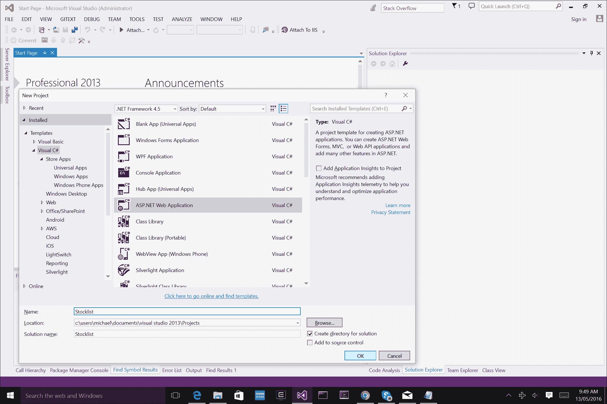

我们想选择**Empty**模板，然后点击**Web API**复选框。

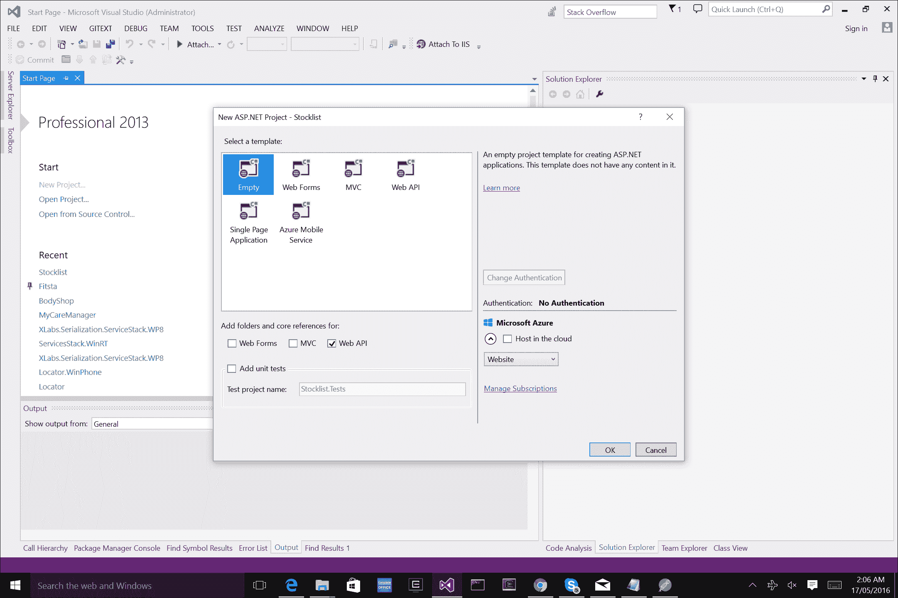

我们实际上可以立即测试项目并点击**运行**，它将自动部署网站并在你的默认浏览器中运行应用程序。我们现在有了我们的基础**ASP.NET**应用程序模板，让我们更仔细地看看项目结构。在解决方案资源管理器中，从`Models`文件夹开始，这是我们创建所有代表应用程序中数据的对象的地方，这些对象将被序列化为 JSON 并通过 HTTP 请求发送。然后，在`Controllers`文件夹中，这是我们 API 控制器所在的地方，这些是处理 HTTP 请求的对象。这是我们将要关注的两个主要区域。

让我们从创建单个库存项目的数据模型开始。在`Models`文件夹中添加一个名为`StockItem.cs`的新文件：

```cs
public class StockItem 
    { 
        public int Id { get; set; } 
        public string Name { get; set; } 
        public string Category { get; set; } 
        public decimal Price { get; set; } 
    } 

```

此对象将被序列化为 JSON 并通过我们的 API 控制器传递给移动应用程序以检索。通常，在每一个`MVC` / `ASP.NET`应用程序中，我们都有一个数据源层和一个 Web API 层。在我们的数据源层，这就是数据库所在的地方，我们在这里存储数据，我们的业务逻辑层将执行读取和写入。我们的 API 层通常使用业务逻辑层来访问数据并通过网络发送，可视表示如下：

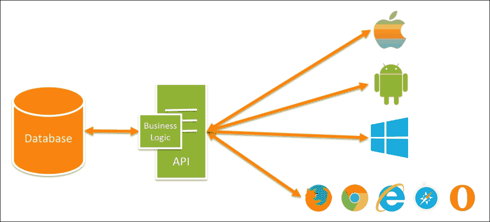

# 构建 API 控制器

Web API 控制器用于处理 Web 请求。99%的情况下，移动应用程序总是会使用一个 API 层，它将调用 Web 请求来检索数据、执行登录等。在我们的例子中，我们将添加一个新的空`WEBAPI 2`控制器。

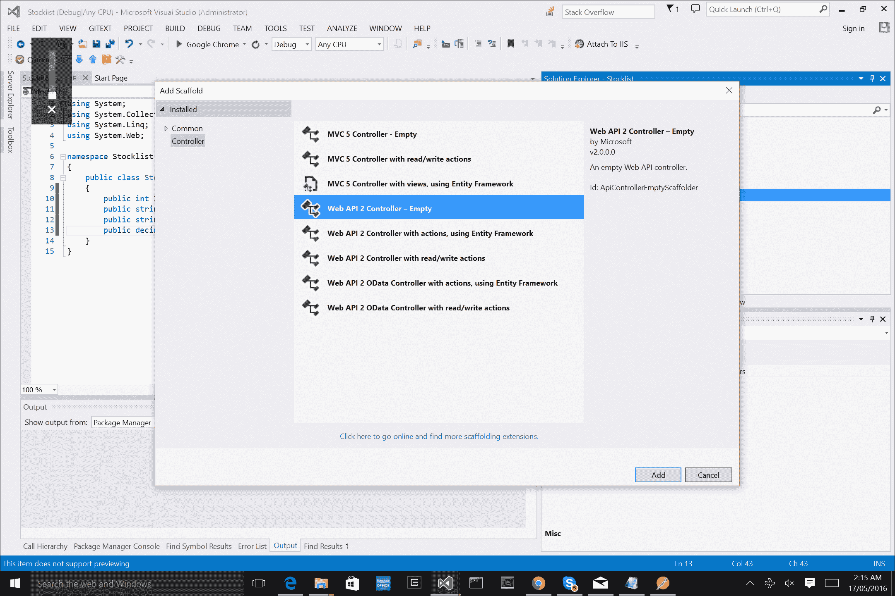

实现以下内容：

```cs
public class StockItemsController : ApiController 
    { 
        List<StockItem> StockItems = new List<StockItem>()           { 
            new StockItem { Id = 1, Name = "Tomato Soup", Category = "Groceries", Price = 1 }, 
            new StockItem { Id = 2, Name = "Yo-yo", Category = "Toys", Price = 3.75M }, 
            new StockItem { Id = 3, Name = "Hammer", Category = "Hardware", Price = 16.99M } 
        }; 

        public IEnumerable<StockItem> GetAllStockItems() 
        { 
            return StockItems; 
        } 

        public StockItem GetStockItem(int id) 
        { 
            var stockItem = StockItems.FirstOrDefault((p) => p.Id == id); 
            if (stockItem == null) 
            { 
                return null; 
            } 

            return StockItem; 
        } 
    } 

```

仔细看看上面的代码，这个 API 有两个函数，一个用于返回所有库存项目，另一个用于返回特定的库存项目。如果我们想通过 HTTP 请求访问这个 API 控制器，URL 将会是：

+   获取所有库存项目

```cs
        api/GetAllStockItems 

```

+   通过 ID 获取特定的库存项目

```cs
        api/GetStockItem 

```

这个格式看起来熟悉吗？

我们将在我们的移动应用程序中使用这两个调用来检索后端的数据。

### 注意

为了让这个 API 活跃，我们有两种选择：我们可以将网站部署到线上（即使用 Azure 或 Amazon），或者我们可以本地托管它（使用 localhost）。

让我们测试 API 层并运行项目。当浏览器打开时，将以下 URL 粘贴到浏览器中：`localhost:{PORT}/api/GetAllStockItems`。

### 注意

当项目运行时，端口号将自动分配，所以请确保你粘贴了特定于你项目的正确端口号。

你应该看到一个 XML 显示器，显示 API 控制器中项目的结果。

# 设置移动项目

回到客户端，我们现在需要开始构建我们的移动应用程序。让我们从创建一个空的`Xamarin.Forms`应用程序开始：

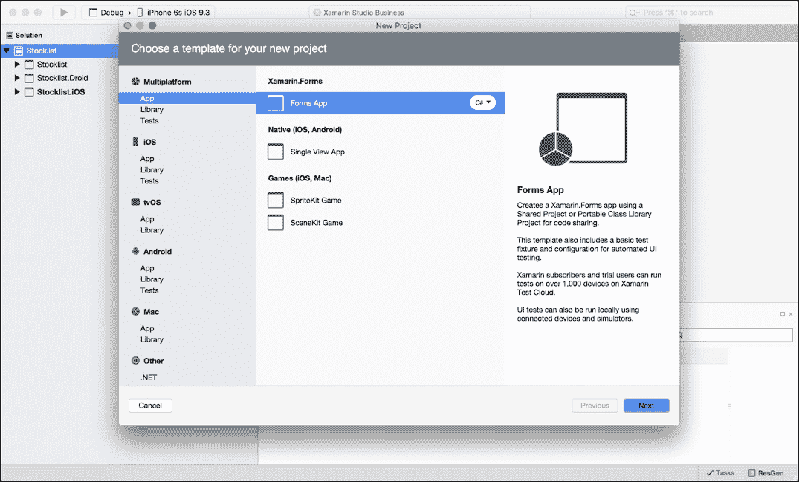

将应用程序命名为 `Stocklist`，让我们从 iOS 应用程序开始。

# 构建核心移动项目

让我们添加两个新的 PCL 项目，命名为 `Stocklist.XamForms` 和 `Stocklist.Portable`。

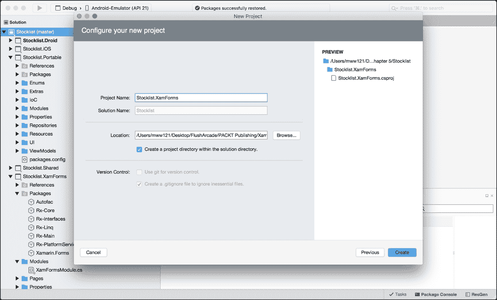

在 **Stocklist.Portable** 项目中，我们想要添加以下 NuGet 包：

+   Microsoft HTTP 客户端库

+   Autofac

+   Newtonsoft.Json

+   反应式扩展（主要库）

在 `Stocklist.XamForms` 项目中，我们想要添加以下 NuGet 包：

+   Microsoft HTTP 客户端库

+   Autofac

+   Xamarin.Forms

+   反应式扩展（主要库）

### 小贴士

只需复制库的确切名称，通过包管理器工具调出所需的库。

现在我们已经准备好了项目，我们可以开始编码。从我们之前的解决方案 第三章，*构建 GPS 定位器应用程序*，我们想要重用一些主要部分，例如 `IoC` 容器、模块和跨平台导航。

### 小贴士

保持移动解决方案模块化和解耦，使得在不同解决方案之间共享代码变得更容易。你认为我们为什么有 NuGet 包？

就像我们的 `Locator` 应用程序一样，我们将重用 `MainPage` 和 `MainPageViewModel` 对象。将这些项目复制到您的新项目中，并将 XAML 页面放入 `Stocklist.XamForms` 中的新文件夹 `Pages`，并将视图模型对象放入 `Stocklist.Portable` 内的新文件夹 `ViewModels` 中。

# 提高应用性能

让我们看看我们可以通过哪些方式提高应用程序的性能。手机没有桌面处理器，用户通常在较旧的设备上运行您的应用程序，这意味着性能可能不足。这就是为什么我们必须在较旧和较新的设备上测试应用程序，以比较性能差异以及可能影响行为的任何 API/OS 变更。

### 小贴士

在模拟器上运行应用程序与在设备上运行时可能会得到不同的结果。确保在发布前始终在物理设备上进行测试。

让我们看看 `Locator` 项目的 `MainPage.xaml` 页面。在这里，我们将对 XAML 布局进行一些小的调整，以略微提高性能。这些更改非常微小，并且只会在这里和那里提高毫秒级的性能，但当你将 100 多个这样的小改进结合起来时，最终结果将会有所不同。

我们可以看到一个包含三个元素的 **Grid**，那么我们为什么选择 Grid 呢？Grid 适用于视图，我们用它来控制任何覆盖或覆盖放置位置的整个部分/页面。我们的第一个问题是是否需要覆盖整个屏幕以用于着陆页？不，我们不需要，因此我们可以用 `StackLayout` 替换 Grid。

一条规则：当 `StackLayout` 可以胜任时，不要使用 Grid，当 Grid 可以胜任时，不要使用多个 StackLayout。

当我们不需要覆盖整个屏幕或进行任何叠加时，一个 `StackLayout` 的渲染速度会比单个 `Grid` 快。让我们将包含的 `Grid` 替换为 `StackLayout`：

```cs
<StackLayout x:Name="StackLayout" Spacing="10" Orientation="Vertical" Padding="10, 10, 10, 10" VerticalOptions="Center"> 
        <Label x:Name="DesciptionLabel" Text="{Binding DescriptionMessage}" HorizontalOptions="Center" Font="Arial, 20"> 
            <Label.TextColor> 
                <OnPlatform x:TypeArguments="Color" 
                    Android="Black" 
                    WinPhone="Black" 
                    iOS="Black"> 
                </OnPlatform> 
            </Label.TextColor> 
        </Label> 

        <Button x:Name="StocklistButton" Text="{Binding LocationTitle}" Command="{Binding LocationCommand}" BackgroundColor="Silver"> 
            <Button.TextColor> 
                <OnPlatform x:TypeArguments="Color" 
                    Android="Navy" 
                    WinPhone="Blue" 
                    iOS="Black"> 
                </OnPlatform> 
            </Button.TextColor> 
        </Button> 

        <Button x:Name="ExitButton" Text="{Binding ExitTitle}" Command="{Binding ExitCommand}" BackgroundColor="Silver"> 
            <Button.TextColor> 
                <OnPlatform x:TypeArguments="Color" 
                    Android="Navy" 
                    WinPhone="Blue" 
                    iOS="Black"> 
                </OnPlatform> 
            </Button.TextColor> 
        </Button> 
    </StackLayout> 

```

不要停下来，让我们再添加一些。关注 `DescriptionLabel`，为永远不会改变的静态文本值创建绑定是浪费的。相反，我们将使用 `Spans`，因为它们渲染得更快。首先，创建一个名为 `LabelResources.resx` 的新 `.resx` 文件，添加一个名为 `DescriptionMessage` 的新变量，并将值设置为字符串 `欢迎来到杂货店`：

```cs
<?xml version="1.0" encoding="utf-8"?> 
<root> 
    <resheader name="resmimetype"> 
        <value>text/microsoft-resx</value> 
    </resheader> 
    <resheader name="version"> 
        <value>2.0</value> 
    </resheader> 
    <resheader name="reader"> 
        <value>System.Resources.ResXResourceReader, System.Windows.Forms, Version=4.0.0.0, Culture=neutral, PublicKeyToken=b77a5c561934e089</value> 
    </resheader> 
    <resheader name="writer"> 
        <value>System.Resources.ResXResourceWriter, System.Windows.Forms, Version=4.0.0.0, Culture=neutral, PublicKeyToken=b77a5c561934e089</value> 
    </resheader> 

    <data name="DecriptionMessage" xml:space="preserve"> 
        <value>Welcome to the Grocery Store</value> 
    </data> 
</root> 

```

### 注意

忽略第一个 `data` 标签之上的所有内容；当文件创建时，这将自动生成。

现在，让我们在我们的 `MainPage` 中导入 `namespace` 前缀：

将前面的行添加到页面的起始标签中：

```cs
<ContentPage   

    x:Class="Stocklist.XamForms.Pages.MainPage" 
    BackgroundColor="White"> 

```

现在，让我们重新构建标签项：

```cs
<Label x:Name="DesciptionLabel" HorizontalOptions="Center" > 
            <Label.FormattedText> 
                <FormattedString> 
                    <Span Text="{x:Static resx:LabelResources.DecriptionMessage}"  
                        FontFamily="Arial"  
                        FontSize="24"> 
                        <Span.ForegroundColor> 
                            <OnPlatform x:TypeArguments="Color" 
                                Android="Black" 
                                WinPhone="Black" 
                                iOS="Black"> 
                            </OnPlatform> 
                        </Span.ForegroundColor> 
                    </Span> 
                </FormattedString> 
            </Label.FormattedText> 
        </Label>  

```

仔细观察，我们有一个被 `FormattedString` 标签包围的 `Span`，而 `FormattedString` 标签则被包含在 `Label.FormattedText` 属性中。`Span` 正在从我们的新 `LabelResources` 中获取静态引用，并且我们也将 `OnPlatform` 的更改移动到了 `Span` 对象中（与标签完全相同，但不是使用 `TextColor` 属性，而是使用 `Foreground` 属性）。

这是对一个标签的两个微小改进，你可能不会在性能上注意到太大的差异。如果我们有一个包含大量静态标签的页面，它会在加载速度上产生微小的影响。渲染标签是昂贵的。

我们也可以将这些性能改进应用到按钮标题上。让我们移除两个按钮上 `Text` 属性的绑定，并用静态值替换它们。打开 `LabelResources` 文件，并按以下方式添加静态值：

```cs
<data name="ExitTitle" xml:space="preserve"> 
        <value>Exit</value> 
    </data> 
    <data name="StocklistTitle" xml:space="preserve"> 
        <value>Stock list</value> 
    </data> 

```

然后我们将它应用到按钮的属性上：

```cs
Text="{x:Static resx:LabelResources.StocklistTitle}"   
Text="{x:Static resx:LabelResources.ExitTitle}"  

```

为了完成着陆页，让我们在按钮上方添加一个图像：

```cs
<Image x:Name="Image" Source="stocklist.png" IsOpaque="true" HeightRequest="120" WidthRequest="120"/> 

```

### 注意

所有图像文件都可以从 GitHub 链接获取：[`github.com/flusharcade/chapter5-stocklist`](https://github.com/flusharcade/chapter5-stocklist)。

由于这个图像是不透明的，所以 `IsOpaque` 属性被标记为 true。将此属性设置为 `true` 允许进行另一个小的性能提升。透明图像渲染成本较高。

我们对页面最后的补充是将页面的标题设置为来自我们的 `LabelResources` 的另一个静态值。添加一个名为 `WelcomeTitle` 的新值：

```cs
<data name="WelcomeTitle" xml:space="preserve"> 
     <value>Welcome</value> 
</data> 

```

现在，让我们将其添加到 `MainPage` 的启动标志中：

```cs
Title="{x:Static resx:LabelResources.WelcomeTitle}"  

```

我们完成的实现将如下所示：

```cs
<StackLayout x:Name="StackLayout" Spacing="10" Orientation="Vertical" Padding="10, 10, 10, 10" VerticalOptions="Center" HorizontalOptions="Center" > 
        <Image x:Name="Image" Source="stocklist.png" IsOpaque="true" HeightRequest="120" WidthRequest="120"/> 
        <Label x:Name="DesciptionLabel" > 
            <Label.FormattedText> 
                <FormattedString> 
                    <Span Text="{x:Static resx:LabelResources.DecriptionMessage}"  
                        FontFamily="Arial"  
                        FontSize="24"> 
                        <Span.ForegroundColor> 
                            <OnPlatform x:TypeArguments="Color" 
                                Android="Black" 
                                WinPhone="Black" 
                                iOS="Black"> 
                            </OnPlatform> 
                        </Span.ForegroundColor> 
                    </Span> 
                </FormattedString> 
            </Label.FormattedText> 
        </Label> 

        <Button x:Name="StocklistButton" Text="{x:Static resx:LabelResources.StocklistTitle}" Command="{Binding StocklistCommand}" BackgroundColor="Silver"> 
            <Button.TextColor> 
                <OnPlatform x:TypeArguments="Color" 
                    Android="Navy" 
                    WinPhone="Blue" 
                    iOS="Black"> 
                </OnPlatform> 
            </Button.TextColor> 
        </Button> 

        <Button x:Name="ExitButton" Text="{x:Static resx:LabelResources.ExitTitle}" Command="{Binding ExitCommand}" BackgroundColor="Silver"> 
            <Button.TextColor> 
                <OnPlatform x:TypeArguments="Color" 
                    Android="Navy" 
                    WinPhone="Blue" 
                    iOS="Black"> 
                </OnPlatform> 
            </Button.TextColor> 
        </Button> 
    </StackLayout> 

```

让我们回顾一下我们对这个 `ContentPage` 做的小改动：

+   当 Grid 可以胜任时，不要使用 `StackLayout`

+   不要使用多个 StackLayout，使用 Grid

+   在可能的情况下，用静态值替换绑定

+   当图像不透明时，将 `IsOpaque` 标志设置为 `true`

+   在具有静态标签值的标签上使用 `FormattedText` 和 `Span`

我们可以应用更多的改进，你的应用程序将运行得更快。我们将在后续的项目中查看更多的改进。

# 创建一个全局的 App.xaml

在所有 `Xamarin.Forms` 项目中，我们必须创建一个继承自 `Application` 类的 `Application` 文件。我们将扩展这个 `Application` 文件并创建一个全局资源字典。如果你来自 WPF，你会认识到全局资源字典的使用，我们可以在所有的 XAML 表格中引用它。这个全局资源字典保存在 `App.xaml` 文件中。它将包含对不同的转换器、样式和数据模板的引用。我们不想在每个 `ContentPage` 或 `ContentView` 的顶部声明静态资源字典，我们只想创建一个所有 XAML 接口都可以访问的字典。这意味着我们只在应用程序启动时创建一个字典，而不是在视图显示时创建多个字典。

让我们创建一个新的 `ContentPage`，命名为 `App.xaml`，并将其放置在 `Stocklist.XamForms` 项目中。我们现在可以删除该项目中已经存在的 `App.cs` 文件。在 `App.xaml` 文件中，实现以下内容：

```cs
<Application 

    x:Class="Stocklist.XamForms.App"> 
    <Application.Resources> 
        <ResourceDictionary> 

        </ResourceDictionary> 
    </Application.Resources> 
</Application> 

```

我们使用 XAML 声明一个 `Application` 对象，并在应用程序的资源部分创建全局字典。我们还需要打开 `App.xaml.cs` 文件并初始化组件（与 `ContentPage` 和 `ContentView` 的初始化完全相同），资源字典，以及 `MainPage` 对象：

```cs
public partial class App : Application 
    { 
        public App() 
        { 
            this.InitializeComponent(); 

// The Application ResourceDictionary is available in Xamarin.Forms 1.3 and later 
      if (Application.Current.Resources == null) 
      { 
        Application.Current.Resources = new ResourceDictionary(); 
      } 

            this.MainPage = IoC.Resolve<NavigationPage>(); 
        } 

        protected override void OnStart() 
        { 
            // Handle when your app starts 
        } 

        protected override void OnSleep() 
        { 
            // Handle when your app sleeps 
        } 

        protected override void OnResume() 
        { 
            // Handle when your app resumes 
        } 
    } 

```

我们在解析 `NavigationPage` 之前忘记做某件事了吗？

我们必须将我们的 `XamForms` 模块添加到 `IoC` 容器中。首先，让我们重用 `Locator` 项目中的导航设置。创建一个名为 `UI` 的新文件夹，并将以下文件从 `Locator` 应用程序中的 `Xamarin.Forms` 项目复制过来：

+   `INavigableXamarinFormsPage.cs`

+   `NavigationService.cs`

+   `XamarinNavigationExtensions.cs`

我们需要将每个文件中的命名空间从 `Locator.UI` 更改为 `Stocklist.XamForms.UI`，并在 `GetPage` 函数中对 `PageNames` 枚举进行修改：

```cs
private Page GetPage(PageNames page) 
        { 
            switch(page) 
            { 
                case PageNames.MainPage: 
                    return IoC.Resolve<MainPage> (); 
                case PageNames.StocklistPage: 
                    return IoC.Resolve<Func<StocklistPage>>()();  
                default: 
                    return null; 
            } 
        } 

```

太好了！我们现在已经有了导航服务，让我们将其注册到 `XamFormsModule`。在 `Stocklist.XamForms` 项目中创建一个新文件夹，为 `XamFormsModule` 添加一个新文件，实现以下内容：

```cs
public class XamFormsModule : IModule 
    { 
        public void Register(ContainerBuilder builer) 
        { 
            builer.RegisterType<MainPage> ().SingleInstance(); 
            builer.RegisterType<StocklistPage> ().SingleInstance(); 

            builer.RegisterType<Xamarin.Forms.Command> ().As<ICommand>().SingleInstance(); 

            builer.Register (x => new NavigationPage(x.Resolve<MainPage>())).AsSelf().SingleInstance(); 

            builer.RegisterType<NavigationService> ().As<INavigationService>().SingleInstance(); 
        } 
    } 

```

现在我们已经注册了 `XamFormsModule`，我们可以解析 `NavigationPage` 和 `NavigationService`。

让我们开始构建将包含在全局资源字典中的项目。

# 使用 ControlTemplates 进行主题化

`ControlTemplates` 允许将逻辑视图层次结构与视觉层次结构分离。类似于 `DataTemplate`，`ControlTemplate` 将为你的控制器页面生成视觉层次结构。`ControlTemplates` 的一个优点是主题的概念。许多软件应用程序提供更改用户界面样式的设置（Visual Studio 和 Xamarin Studio 提供暗色和亮色主题）。我们将为 `MainPage` 实现两个主题，并提供一个 `Button` 来在两者之间切换。

让我们从打开`App.xaml`页面并添加黑色主题的第一个`ControlTemplate`开始：

```cs
<ControlTemplate x:Key="MainBlackTemplate"> 
                <StackLayout x:Name="StackLayout" Spacing="10" Orientation="Vertical" Padding="10, 10, 10, 10" BackgroundColor="Black" 
            VerticalOptions="Center" HorizontalOptions="Center" > 
          <Image x:Name="Image" Source="stocklist.png" HeightRequest="120" WidthRequest="120"/> 
          <Label x:Name="DesciptionLabel"> 
            <Label.FormattedText> 
              <FormattedString> 
                <Span Text="{x:Static resx:LabelResources.DecriptionMessage}"  
                  FontFamily="Arial"  
                  FontSize="24" 
                  ForegroundColor="White"/> 
              </FormattedString> 
            </Label.FormattedText> 
              </Label> 

          <Button x:Name="StocklistButton"  
              Text="{x:Static resx:LabelResources.StocklistTitle}"  
              Command="{TemplateBinding StocklistCommand}" 
              Style="{StaticResource HomeButtonStyle}" 
              BackgroundColor="Gray" 
              TextColor="White"/> 

          <Button x:Name="ExitButton"  
              Text="{x:Static resx:LabelResources.ExitTitle}"  
              Command="{TemplateBinding ExitCommand}"  
              Style="{StaticResource HomeButtonStyle}" 
              BackgroundColor="Gray" 
              TextColor="White"/> 

          <ContentPresenter /> 
        </StackLayout> 
            </ControlTemplate> 

```

在这里，我们只是复制`MainPage`的内容，并根据模板的变化进行微小的颜色更改。

现在让我们为白色主题添加另一个`ControlTemplate`：

```cs
<ControlTemplate x:Key="MainWhiteTemplate"> 
                <StackLayout x:Name="StackLayout" Spacing="10" Orientation="Vertical" Padding="10, 10, 10, 10" VerticalOptions="Center" HorizontalOptions="Center" > 
          <Image x:Name="Image" Source="stocklist.png" HeightRequest="120" WidthRequest="120"/> 
          <Label x:Name="DesciptionLabel" > 
            <Label.FormattedText> 
              <FormattedString> 
                <Span Text="{x:Static resx:LabelResources.DecriptionMessage}"  
                  FontFamily="Arial"  
                  FontSize="24" 
                  ForegroundColor="Black"/> 
              </FormattedString> 
            </Label.FormattedText> 
              </Label> 

          <Button x:Name="StocklistButton"  
              Text="{x:Static resx:LabelResources.StocklistTitle}"  
              Command="{TemplateBinding StocklistCommand}" 
              Style="{StaticResource HomeButtonStyle}"/> 

          <Button x:Name="ExitButton"  
              Text="{x:Static resx:LabelResources.ExitTitle}"  
              Command="{TemplateBinding ExitCommand}"  
              Style="{StaticResource HomeButtonStyle}"/> 

          <ContentPresenter /> 
        </StackLayout> 
            </ControlTemplate> 

```

注意每个模板中`ContentPresenter`对象的使用？

这用于定位将在多个模板之间共享的内容。打开`MainPage.xaml`，并将内容替换为以下内容：

```cs
<?xml version="1.0" encoding="UTF-8"?> 
<ContentPage   

  x:Class="Stocklist.XamForms.Pages.MainPage" 
  ControlTemplate="{StaticResource MainBlackTemplate}" 
  BackgroundColor="Black" 
  Title="{x:Static resx:LabelResources.WelcomeTitle}" 
  StocklistCommand="{Binding StocklistCommand}"  
  ExitCommand="{Binding ExitCommand}"> 
  <ContentPage.Content> 
    <Button Text="Change Theme" Clicked="ChangeThemeClicked" /> 
  </ContentPage.Content> 
</ContentPage> 

```

放置在`MainPage`上的内容将位于`ControlTemplates`中`ContentPresenter`对象所在的位置。内容只是一个将在两个`ControlTemplates`之间共享的按钮。我们将首先设置默认的`ControlTemplate`为黑色主题。

注意在`ContentPage`上设置的命令绑定？

由于我们的`ControlTemplates`需要绑定到`MainPageViewModel`中的`Commands`，我们必须做一些额外的工作来设置这些绑定。打开`MainPage.xaml.cs`并实现这些自定义绑定：

```cs
public static readonly BindableProperty StocklistCommandProperty = BindableProperty.Create("StocklistCommand", typeof(ICommand), typeof(MainPage), null); 
        public static readonly BindableProperty ExitCommandProperty = BindableProperty.Create("ExitCommand", typeof(ICommand), typeof(MainPage), null); 

        public ICommand StocklistCommand 
        { 
            get { return (ICommand)GetValue(StocklistCommandProperty); } 
        } 

        public ICommand ExitCommand 
        { 
            get { return (ICommand)GetValue(ExitCommandProperty); } 
        } 

```

这些自定义绑定将设置每个`ControlTemplate`和视图模型之间的链接。现在，`ControlTemplate`内的每个`Command`都将对视图模型中实现的`Command`做出响应。

现在让我们完成**更改主题**的添加。首先，让我们添加两个模板定义：

```cs
private bool _originalTemplate = true; 
private ControlTemplate _blackTemplate; 
private ControlTemplate _whiteTemplate; 

```

`originalTemplate Boolean`用作每次按钮点击时切换到相反模板的标志。接下来，我们必须从我们的全局资源字典中初始化`ControlTemplate`：

```cs
public MainPage() 
    { 
      InitializeComponent(); 

      _blackTemplate = (ControlTemplate)Application.Current.Resources["MainBlackTemplate"]; 
      _whiteTemplate = (ControlTemplate)Application.Current.Resources["MainWhiteTemplate"]; 
    } 

Finally, let's add the ChangeThemeClicked function for the button: 

public void ChangeThemeClicked(object sender, EventArgs e) 
    { 
      _originalTemplate = !_originalTemplate; 
      ControlTemplate = _originalTemplate ? _blackTemplate : _whiteTemplate; 
      BackgroundColor = _originalTemplate ? Color.Black : Color.White; 
    } 

```

每次按钮被按下时，它将检查我们是否在默认模板（黑色主题）上，如果我们在黑色模板上，则切换到白色模板。我们还将背景颜色在黑色和白色之间切换，以匹配当前主题。

完成了。现在让我们转到`MainPageViewModel`以完成页面的`BindingContext`。

# 更新 MainPageViewModel

现在我们已经重新构建了我们的`MainPage`，让我们对`MainPageViewModel`做一些小的更改。由于我们用静态值替换了标签绑定，我们移除了以下变量，`DescriptionMessage`、`ExitTitle`和`LocationTitle`。

现在我们应该有以下`private`属性：

```cs
#region Private Properties 

        private readonly IMethods _methods; 

        private ICommand _stocklistCommand; 

        private ICommand _exitCommand; 

        #endregion 

```

现在只需更新`LocationCommand`为以下内容：

```cs
 public ICommand StocklistCommand 
        { 
            get 
            { 
                return stocklistCommand; 
            } 

            set 
            { 
                if (value.Equals(stocklistCommand)) 
                { 
                    return; 
                } 

                _stocklistCommand = value; 
                OnPropertyChanged("StocklistCommand"); 
            } 
        } 

```

我们还必须更新我们的构造函数：

```cs
#region Constructors 

        public MainPageViewModel (INavigationService navigation, Func<Action, ICommand> commandFactory, 
            IMethods methods) : base (navigation) 
        { 
            this.exitCommand = commandFactory (() => methods.Exit()); 
            this.stocklistCommand = commandFactory (async () => await this.Navigation.Navigate(PageNames.StocklistPage, null)); 
        } 

        #endregion 

```

在这里，我们只是将一些变量重命名以匹配我们的应用程序。我们还必须复制`Enums`和`Extras`文件夹，并将`LocationPage`枚举更改为`StocklistPage`。

接下来，我们需要添加`PortableModule`。创建一个名为`Modules`的新文件夹，并将`Location.Portable`中的`PortableModule`复制到新文件夹中。将`PortableModule`类更改为以下内容：

```cs
public class PortableModule : IModule 
    { 
        public void Register(ContainerBuilder builer) 
        { 
            builer.RegisterType<MainPageViewModel> ().SingleInstance(); 
            builer.RegisterType<StocklistPageViewModel> ().SingleInstance(); 
        } 
    } 

```

最后，我们需要添加`INavigationService`。创建一个名为`UI`的新文件夹，并将`Location.Portable`中的`INavigationService`添加到新的`UI`文件夹中。

### 提示

构建项目模板可以减少设置项目和重新创建类似模块所需的时间。

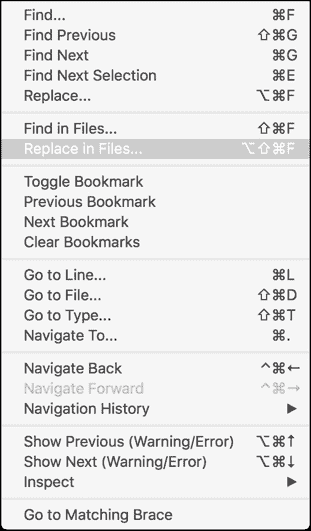

在我们继续之前，我们必须更新从 `Locator` 项目复制的代码中的命名空间。最简单的方法是使用 **搜索** | **在文件中替换...**。我们想要将文本 `Location.Portable` 替换为文本。

### 注意

做这件事时要小心；只有当字符串是特定的时候才应用全局替换。

# 创建 Stocklist Web 服务控制器

让我们构建我们的客户端 Web 服务控制器以访问 API。由于我们已经构建了后端，我们应该能够非常快速地完成这项工作。我们的第一步是创建一个对象，该对象将反序列化 `StockItem`。我们把这些称为合约。在你的 `Stocklist.Portable` 项目中添加一个新的文件夹，命名为 `StocklistWebServiceController`，然后在其中添加另一个文件夹，命名为 `Contracts`。创建一个名为 `StockItemContract.cs` 的新文件，并实现以下内容：

```cs
public sealed class StockItemContract 
    { 
        #region Public Properties 

        public int Id { get; set;} 

        public string Name { get; set; } 

        public string Category { get; set; } 

        public decimal Price { get; set; } 

        #endregion 
    } 

```

现在，让我们继续构建 `IStocklistWebServiceController` 接口：

```cs
    public interface IStocklistWebServiceController 
    { 
        #region Methods and Operators 

        IObservable<StockItemContract> GetAllStockItems (); 

        Task<StockItemContract> GetStockItemById(int id); 

        #endregion 
    } 

```

这些函数与 API 控制器中的函数完全匹配。在我们实现此接口之前，我们必须在 `Resources` 文件夹中创建一个新的文件，命名为 `Config.resx`。目前，让我们为每个 URL 路径添加一些空值，因为我们不知道这些信息，除非我们在本地运行站点，或者将其部署到某个地方：

```cs
    <data name="ApiAllItems" xml:space="preserve"> 
        <value></value> 
    </data> 
    <data name="GetStockItem" xml:space="preserve"> 
        <value></value> 
    </data> 

```

现在，让我们实现 `IStocklistWebServiceController` 接口。从构造函数开始；我们不得不检索 `HttpClientHandler`（我们将在稍后的 `IoC` 容器中注册它）：

```cs
#region Constructors and Destructors 

        public StocklistWebServiceController(HttpClientHandler clientHandler) 
        { 
            _clientHandler = clientHandler; 
        } 

        #endregion 

```

现在，让我们实现第一个函数来检索所有项目。它将使用 `HttpClient` 通过 `SendAsync` 异步函数创建一个 `Observable`，然后通过 `HttpClient`。`Observable` 流将从这个函数返回的结果生成。然后我们将响应作为字符串检索（这将是一个 JSON），并将字符串反序列化为多个 `StockItemContracts`，然后（使用 Linq）将它们传递到 `Observable` 流中，并返回函数的结果：

```cs
public IObservable<StockItemContract> GetAllStockItems () 
        { 
            var authClient = new HttpClient (this.clientHandler); 

            var message = new HttpRequestMessage (HttpMethod.Get, new Uri (Config.ApiAllItems)); 

            return Observable.FromAsync(() => authClient.SendAsync (message, new CancellationToken(false))) 
                .SelectMany(async response =>  
                    { 
                        if (response.StatusCode != HttpStatusCode.OK) 
                        { 
                            throw new Exception("Respone error"); 
                        } 

                        return await response.Content.ReadAsStringAsync(); 
                    }) 
                .Select(json => JsonConvert.DeserializeObject<StockItemContract>(json)); 
        } 

```

现在让我们来实现 `GetStockItem` 函数：

```cs
public IObservable<StockItemContract> GetStockItem (int id) 
        { 
            var authClient = new HttpClient(this.clientHandler); 

            var message = new HttpRequestMessage(HttpMethod.Get, new Uri(string.Format(Config.GetStockItem, id))); 

            return await Observable.FromAsync(() => authClient.SendAsync(message, new CancellationToken(false))) 
                .SelectMany(async response => 
                    { 
                        if (response.StatusCode != HttpStatusCode.OK) 
                        { 
                            throw new Exception("Respone error"); 
                        } 

                        return await response.Content.ReadAsStringAsync(); 
                    }) 
                 .Select(json => JsonConvert.DeserializeObject<StockItemContract>(json)); 
        } 

```

太好了！我们现在有了 `StocklistWebServiceController`；我们现在需要将此对象注册到 IoC 容器中的接口。打开 `PortableModule` 类，并添加以下内容：

```cs
builer.RegisterType<StocklistWebServiceController> ().As<IStocklistWebServiceController>().SingleInstance(); 

```

# 列表视图和 ObservableCollections

现在我们转向`StocklistPage`和`StocklistPageViewModel`；这些将用于显示我们从 API 拉取的所有项目。在前端，我们将使用`ListView`，它们是显示从任何 API 拉取的数据列表的最常见 UI 元素。`ListView`的美丽之处在于它们如何通过每个平台呈现。通过`Xamarin.Forms`在 iOS 上的 XAML 表单中放置一个`ListView`将渲染一个`UITableView`，在 Android 上是一个原生的`ListView`，而在 Windows 上是一个`FrameworkElement`。我们还可以创建自定义单元格项并设置针对每个项目的特定数据绑定，因此，对于每个反序列化的合同，我们希望有一个单独的视图模型来表示每个单元格上的数据。

让我们在`Stocklist.Portable`项目的`ViewModels`文件夹中添加一个名为`StockItemViewModel.cs`的新文件，并实现其构造函数：

```cs
public class StockItemViewModel : ViewModelBase 
    { 
        #region Constructors 

        public StockItemViewModel (INavigationService navigation) : base (navigation) 
        { 
        } 

        #endregion 
    } 

```

现在我们想要添加`private`属性；它们将与`StockItemContract`中的属性相同：

### 注意

我们可以选择只在一个自定义视图单元格中表示某些项目。在视图模型内部，我们只创建将在视图中显示的属性。

```cs
#region Private Properties 

private int _id; 

private string _name; 

private string _category; 

private decimal _price; 

private bool _inProgress; 

#endregion 

```

然后我们只需为每个`private`变量创建相应的`public`属性，以下是一个帮助你开始的例子：

```cs
public int Id 
        { 
            get 
            { 
                return id; 
            } 

            set 
            { 
                if (value.Equals(_id)) 
                { 
                    return; 
                } 

                _id = value; 
                OnPropertyChanged("Id"); 
            } 
        } 

```

在这里，我们正在构建一个翻译层，在反序列化的对象和我们要显示的对象之间。这对于分离视图模型中包含的逻辑是有好处的，因为它们有额外的逻辑来处理要显示的数据。我们希望我们的合同纯粹反映 JSON 对象中的属性。

接下来，我们在视图模型上添加一个名为`Apply`的公共方法。这个方法将接受一个`StockItemContract`作为参数并更新视图模型的属性。它将在我们想要更新要显示的数据时被调用：

```cs
#region Public Methods 

public void Apply(StockItemContract contract) 
{ 
     Id = contract.Id; 
     Name = contract.Name; 
     Category = contract.Category; 
     Price = contract.Price; 
} 

#endregion 

```

我们下一步是实现`StocklistPageViewModel`。这个视图模型将包含一个`ObservableCollection`，它将被用于绑定到`ListView`。在我们检索到合同列表后，我们将构建另一个`StockItemViewModels`列表。每个项目将应用合同中的数据，新的`StockItemViewModel`将被添加到`ObservableCollection`中。我们将应用合同来更新数据，然后将视图模型添加到`ObservableCollection`。

让我们从向`ViewModels`文件夹添加一个名为`StocklistPageViewModel.cs`的新文件开始，并首先创建一个新的视图模型及其构造函数：

```cs
#region Constructors 

        public StocklistPageViewModel(INavigationService navigation, IStocklistWebServiceController stocklistWebServiceController, 
            Func<StockItemViewModel> stockItemFactory) : base(navigation) 
        { 
            _stockItemFactory = stockItemFactory; 

            _stocklistWebServiceController = stocklistWebServiceController; 

            StockItems = new ObservableCollection<StockItemViewModel>(); 
        } 

        #endregion 

```

导航服务与`Locator`项目中使用的相同。我们将在`Stocklist.XamForms`项目中稍后注册它。我们使用`IStocklistWebServiceController`从 API 获取`StockItems`。

然后，我们需要在`PortableModule`内部注册我们的`StockItemViewModel`：

```cs
public void Register(ContainerBuilder builer) 
{ 
            ... 

            builer.RegisterType<StockItemViewModel>().InstancePerDependency(); 

} 

```

注意我们是如何使用 `InstancePerDependency` 函数而不是 `SingleInstance` 的？由于我们正在实例化多个项，如果我们使用 `SingleInstance`，相同的数据将在所有 `StockItemViewModels` 之间复制并更改。

现在让我们添加 `private` 和 `public` 属性：

```cs
        #region Private Properties 

        private readonly IStocklistWebServiceController _stocklistWebServiceController ; 

        private readonly Func<StockItemViewModel> _stockItemFactory; 

        #endregion 

        #region Public Properties 

        public ObservableCollection<StockItemViewModel> StockItems; 

        #endregion 

```

现在我们有了所有属性，我们可以构建 `ObservableCollection` 的项目列表。接下来，我们添加 `LoadAsync` 函数，它负责创建 `StockItemViewModels` 的列表：

```cs
#region Methods 

    protected override async Task LoadAsync(IDictionary<string, object> parameters) 
    { 
      try 
      { 
        InProgress = true; 

        // reset the list everytime we load the page 
        StockItems.Clear(); 

        var stockItems = await _stocklistWebServiceController.GetAllStockItems(); 

        // for all contracts build stock item view model and add to the observable collection 
        foreach (var model in stockItems.Select(x => 
          { 
            var model = _stockItemFactory(); 
            model.Apply(x); 
            return model; 
          })) 
        { 
          StockItems.Add(model); 
        } 

        InProgress = false; 
      } 
      catch (Exception e) 
      { 
        System.Diagnostics.Debug.WriteLine(e); 
      } 
    } 

    #endregion 

```

`LoadAsync` 函数将用于检索所有合同并构建 `StockItemViewModels` 的列表。每次我们将新的 `StockItemViewModel` 添加到 `ObservableCollection` 时，都会触发一个 `CollectionChanged` 事件来通知 `ListView` 更新。

看看我们是如何通过 `stockItemfactory` 实例化 `StockItemViewModel` 的。它使用 `Func` (`Func<StockItemViewModel>`) 在每次执行 `Func` 时生成一个新的视图模型。这就是为什么我们需要调用 `InstancePerDependency`，以便创建独立的项。如果我们将注册上的结束函数设置为 `SingleInstance`，即使我们在 `StockItemViewModel` 上调用 `Func`，也只会创建一个对象。

现在让我们构建 `StocklistPage` 的用户界面。它将包含用于显示从 API 获取的 `StockItems` 的 `ListView`：

```cs
<?xml version="1.0" encoding="UTF-8"?> 
<ContentPage   

    x:Class="Stocklist.XamForms.Pages.StocklistPage"> 
    <ContentPage.Content> 
        <Grid> 
      <Grid.RowDefinitions> 
        <RowDefinition Height="*"/> 
      </Grid.RowDefinitions> 

      <Grid.ColumnDefinitions> 
        <ColumnDefinition Width="*"/> 
      </Grid.ColumnDefinitions> 

      <ActivityIndicator  x:Name="ActivityIndicator" IsRunning="{Binding InProgress}" Grid.Row="0" Grid.Column="0"/> 

      <ListView x:Name="StockItemsListView" 
        IsVisible="{Binding InProgress, Converter={StaticResource notConverter}}" 
        CachingStrategy="RecycleElement"  
        ItemsSource="{Binding StockItems}" 
        ItemTemplate="{StaticResource ListItemTemplate}" 
        SelectedItem="{Binding Selected, Mode=TwoWay}" 
        RowHeight="100" 
        Margin="10, 10, 10, 10" 
        Grid.Row="0" Grid.Column="0"/> 
    </Grid> 
    </ContentPage.Content> 
</ContentPage> 

```

为什么我们不能使用 StackLayout？

由于我们需要一个元素覆盖另一个元素，我们必须使用 Grid。`ActivityIndicator` 用于显示 `LoadAsync` 函数的加载进度。当正在加载时，我们的 `ListView` 将不可见，并显示加载指示器。

# 值转换器

在某些情况下，有时我们需要将不兼容类型的两个属性进行数据绑定。`Converter` 是一个对象，它将值从源转换为目标，反之亦然。每个转换器都必须实现 `IValueConverter` 接口，该接口实现了两个函数，`Convert` 和 `ConvertBack`。我们将创建一个转换器，它将 `bool` 作为源，并简单地返回与源值相反的值。

`ConvertBack` 方法仅在数据绑定是 `TwoWay` 绑定时才会使用。

在 `Stocklist.XamForms` 项目中，添加一个名为 `Converters` 的新文件夹，并在该文件夹内创建一个名为 `NotConverter.cs` 的新文件，实现以下内容：

```cs
    public class NotConverter : IValueConverter 
    { 
        public object Convert(object value, Type targetType, object parameter, System.Globalization.CultureInfo culture) 
        { 
            var b = value as bool?; 

            if (b != null) 
            { 
                return !b; 
            } 

            return value; 
        } 

        public object ConvertBack(object value, Type targetType, object parameter, System.Globalization.CultureInfo culture) 
        { 
            throw new NotImplementedException(); 
        } 
    } 

```

即使 `InProgress` 属性不使用双向绑定，我们仍然必须实现 `ConvertBack` 函数作为接口的一部分。

现在回到 `StocklistPage.xaml`。当视图模型中的 `bool` 属性发生变化时，`NotConverter` 的 `Convert` 函数将被调用。当 `IsProgress` 值发生变化时，转换器将被调用，并将返回 `ListView` 上 `IsVisible` 状态的反向值。当进度正在运行时，`ListView` 不可见，当进度未运行时，`ListView` 可见。

现在我们将探讨创建一个包含每个单元格使用的`DataTemplate`的`App.xaml`。

# 将`DataTemplate`添加到全局资源字典

现在，让我们回到`App.xaml`文件。由于我们在`StocklistPage`的`ListView`中需要一个自定义单元格，我们将在全局资源字典中创建一个`DataTemplate`。`DataTemplate`可以以两种方式创建，作为内联模板或在资源字典中。没有更好的方法，这更多是个人偏好的问题。在我们的例子中，我们将创建资源字典中的我们的`DataTemplate`。

打开`App.xaml`文件，并按如下方式在资源字典中插入`DataTemplate`：

```cs
    <DataTemplate x:Key="ListItemTemplate"> 
        <ViewCell> 
          <StackLayout Margin="20, 15, 20, 5"> 
            <Label x:Name="NameLabel" Text="{Binding Name}"/> 
            <Label x:Name="CategoryLabel" Text="{Binding Category}"/> 
            <Label x:Name="PriceLabel" Text="{Binding Price}"/> 
          </StackLayout> 
                </ViewCell> 
      </DataTemplate> 

```

现在，我们想在`StocklistPage`中的`ListView`上设置`ItemTemplate`属性。打开`StocklistPage`，并将以下内容添加到`ListView`声明中：

```cs
        <ListView x:Name="StockItemsListView" ItemsSource="{Binding StockItems}" ItemTemplate="{StaticResource ListItemTemplate}"/> 

```

如果我们想使用内联模板方法，我们会这样做：

```cs
<ListView x:Name="StockItemsListView" ItemsSource="{Binding StockItems"> 
            <ListView.ItemTemplate> 
                <DataTemplate> 
                  <ViewCell> 
          <StackLayout Margin="20, 15, 20, 5"> 
            <Label x:Name="NameLabel" Text="{Binding Name/> 
            <Label x:Name="CategoryLabel" Text="{Binding Category}"/> 
            <Label x:Name="PriceLabel" Text="{Binding Price}"/> 
          </StackLayout> 
                  </ViewCell> 
                </DataTemplate> 
          </ListView.ItemTemplate> 
        </ListView> 

```

# 样式

在我们的自定义单元格中，我们有三个标签，没有任何样式或字体分配。我们将使用`Style`来增强每个单元格的外观。`Style`将一组属性值组合成一个对象，可以应用于多个视觉元素实例。这种做法的目的是减少重复的标记，以便我们可以在 XAML 中跨相似控件重用类似的样式。在`Xamarin.Forms`中，有多种方法可以将样式应用于控件。在这个例子中，我们将向您展示如何在`App.xaml`文件中创建全局样式，并将其应用于我们应用程序中的不同控件。

我们的第一个全局样式将是自定义单元格中的标题标签。让我们打开`App.xaml`文件，并将以下内容插入到我们的资源字典中：

```cs
<Style x:Key="TitleStyle" TargetType="Label"> 
                <Setter Property="TextColor" Value="Black" /> 
                <Setter Property="FontAttributes" Value="Bold" /> 
                <Setter Property="FontFamily" Value="Arial" /> 
            </Style> 

```

在前面的标记中，每个样式将包含一个`Setter`属性的列表。这些指的是我们控件上的`BindableProperties`。现在我们有了`Style`，我们可以在`DataTemplate`内部引用这个静态资源：

```cs
<Label x:Name="NameLabel" Text="{Binding Name}" Style="{StaticResource TitleStyle}"/> 

```

太好了！我们刚刚在`Label`上创建并设置了我们的第一个样式。让我们向`MainPageControlTemplates`添加更多样式。我们将对按钮进行样式化，因为它们都共享相同的样式属性。将以下内容添加到全局资源字典中：

```cs
<Style x:Key="HomeButtonStyle" TargetType="Button"> 
                <Setter Property="TextColor"> 
                    <Setter.Value> 
                        <OnPlatform x:TypeArguments="Color" 
                            Android="Navy" 
                            WinPhone="Blue" 
                            iOS="Black"> 
                        </OnPlatform> 
                    </Setter.Value> 
                </Setter> 
                <Setter Property="BackgroundColor" Value="Silver" /> 
</Style> 

```

仔细看看前面的样式，我们甚至可以使用`<OnPlatform>`标签根据平台更改设置值。

现在，让我们将这个`Style`应用到我们的`MainPage`按钮上：

```cs

<Button x:Name="StocklistButton"  
                Text="{x:Static resx:LabelResources.StocklistTitle}"  
                Command="{Binding StocklistCommand}" 
                Style="{StaticResource HomeButtonStyle}"/> 

        <Button x:Name="ExitButton" 
                Text="{x:Static resx:LabelResources.ExitTitle}" 
                Command="{Binding ExitCommand}" 
                Style="{StaticResource HomeButtonStyle}"/> 

```

看看我们是如何减少标记大小的？

这是我们应用`Styles`的一个例子，我们将在后续章节中看到更多技术。

# 使用 XAML 进行进一步优化

之前，我们讨论了一些我们可以应用于 XAML 的微小更改，以改进性能。让我们看看我们如何在`ListView`上应用一些性能提升。如果您使用过任何本地的`ListView`或`UITableView`，最大的问题之一就是我们滚动时加载大量元素时的内存使用（即，为每个单元格加载一个位图）。

我们如何解决这个问题？

我们使用缓存单元格和重用单元格的技术。自从 `Xamarin.Forms` 2.0 以来，他们引入了一些关于 `ListViews` 上的单元格回收机制和缓存策略的新功能和增强。为了设置缓存策略，我们有两种选择：

+   `RetainElement`: 这是默认行为。它将为列表中的每个项目生成一个单元格，单元格布局将在每个单元格创建时运行。我们只有在单元格布局经常变化，或者一个单元格有大量绑定时才应使用此方法。

+   `RecycleElement`: 这利用了 iOS 和 Android 上的原生单元格回收机制。它将最小化内存占用并最大化 `ListView` 的性能。如果单元格有少量到中等的绑定，布局相似，并且单元格视图模型包含所有数据，我们应该使用此方法。

### 小贴士

我们应该始终致力于使用第二个元素，尽量设计你的单元格围绕这个设置。

我们将在我们的 `ListView` 上使用第二种缓存策略：

```cs
<ListView x:Name="StockItemsListView" CachingStrategy="RecycleElement" ItemsSource="{Binding StockItems}" ItemTemplate="{StaticResource ListItemTemplate}"/> 

```

应尽可能多地使用 `RecycleElement`，因为我们总是希望根据我们的应用程序来最大化性能。由于我们的单元格设计相当简单，绑定数量少，并且我们保持所有数据在视图模型中，我们能够使用此设置。

现在，让我们看看另一个我们可以用来提高我们的 XAML 表格加载速度的简单添加。开启 XAML 编译功能可以让你的 XAML 表格被编译而不是被解释，这可以提供多种好处：

+   帮助标记错误

+   减小应用程序大小

+   减少加载和实例化时间

非常推荐在所有 `Xamarin.Forms` 应用程序中启用此设置，因为它将提高你用户界面的加载速度（特别是在 Android 上）。我们可以通过打开 `App.xaml.cs` 文件并将以下代码粘贴在先前的命名空间下面来添加编译后的 XAML：

```cs
[assembly: Xamarin.Forms.Xaml.XamlCompilation(Xamarin.Forms.Xaml.XamlCompilationOptions.Compile)] 

```

如果我们将我们对项目应用的所有性能改进加起来，我们应该会在用户界面在不同屏幕之间呈现时看到一些改进。

# 创建 StockItemDetailsPage

现在，我们继续到我们应用程序的最后一页。我们将为显示从上一个 `StocklistPage` 中选择的股票项目的详细信息添加另一个页面。首先，我们需要处理从 `ListView` 中选择的项，所以打开 `StocklistPage.xaml` 并更新 `ListView` 元素，将其 `SelectedItem` 对象绑定到我们的视图模型中的 `Selected` 项（我们将在 XAML 更新后添加此绑定）。这将设置为 `TwoWay` 绑定，因为数据将从两边改变（从视图，因为我们选择了项，以及视图模型，因为我们将在导航到股票详情页时需要选择对象的数据）：

```cs
<ListView x:Name="StockItemsListView" 
        IsVisible="{Binding InProgress, Converter={StaticResource notConverter}}" 
        CachingStrategy="RecycleElement"  
        ItemsSource="{Binding StockItems}" 
        ItemTemplate="{StaticResource ListItemTemplate}" 
        SelectedItem="{Binding Selected, Mode=TwoWay}" 
        RowHeight="100" 
        Margin="10, 10, 10, 10" 
        Grid.Row="0" Grid.Column="0"/> 

```

现在让我们添加到`StocklistPageViewModel`；我们需要添加一个`public`的`StockItemViewModel`属性，它将保存从列表中选择项目时的绑定数据。所选`StockItemViewModel`的 ID 属性将通过导航参数传递给我们的`StockItemDetailsPage`：

```cs
private StockItemViewModel _selected; 
.... 
public StockItemViewModel Selected 
    { 
      get 
      { 
        return _selected; 
      } 

      set 
      { 
        if (value.Equals(_selected)) 
        { 
          return; 
        } 
        else 
        { 
          Navigation.Navigate(Enums.PageNames.StockItemDetailsPage, new Dictionary<string, object>() 
          { 
            {"id", value.Id}, 
          }).ConfigureAwait(false); 
        } 

        _selected = value; 
        OnPropertyChanged("Selected"); 
      } 
    } 

```

现在让我们添加新的`StocklistItemDetailsPage`。创建一个新的 XAML `ContentPage`并添加以下内容：

```cs
<ContentPage.Content> 
    <StackLayout Margin="20, 20, 20, 5"> 
      <Label x:Name="TitleLabel" > 
        <Label.FormattedText> 
          <FormattedString> 
            <Span Text="{x:Static resx:LabelResources.StockItemDetailsTitle}"  
              FontFamily="Arial"  
              FontSize="24"> 
              <Span.ForegroundColor> 
                        <OnPlatform x:TypeArguments="Color" 
                            Android="Black" 
                            WinPhone="Black" 
                            iOS="Black"> 
                        </OnPlatform> 
                    </Span.ForegroundColor> 
            </Span> 
          </FormattedString> 
        </Label.FormattedText> 
          </Label> 

      <Label x:Name="NameLabel" Text="{Binding Name}" Style="{StaticResource TitleStyle}"/> 
      <controls:CustomLabel x:Name="CategoryLabel" Text="{Binding Category}" Style="{StaticResource CustomLabelStyle}"/> 
            <controls:CustomLabel x:Name="PriceLabel" Text="{Binding Price}" Style="{StaticResource CustomLabelStyle}"/> 

      <ActivityIndicator x:Name="ActivityIndicator" IsRunning="{Binding InProgress}"/> 
    </StackLayout> 
  </ContentPage.Content> 

```

仔细查看代码，我们添加了四个标签和`ActivityIndicator`，它们用于显示页面加载数据的进度。我们还包含了一个自定义控件`CustomLabel`，我们通过以下方式引用此项目：

无论跟随`xmlns`关键字之后的名称是什么，这个名称必须首先被调用，以便在我们要使用的命名空间内引用项目，如下所示：

```cs
 <controls:CustomLabel/> 

```

现在我们必须创建我们的`CustomLabel`对象，它将被用于 Android 的`CustomRenderer`，因为我们将设置此标签的字体为自定义的`Typeface`，我们将将其包含在两个原生项目中。在`Stocklist.XamForms`项目中创建一个名为`Controls`的新文件夹，并创建以下文件，名为`CustomLabel.cs`：

```cs
public class CustomLabel : Label 
    { 
        public static readonly BindableProperty AndroidFontStyleProperty = BindableProperty.Create<CustomLabel, string>( 
            p => p.AndroidFontStyle, default(string)); 

        public string AndroidFontStyle 
        { 
            get 
            { 
                return (string)GetValue(AndroidFontStyleProperty); 
            } 
            set 
            { 
                SetValue(AndroidFontStyleProperty, value); 
            } 
        } 
    } 

```

在我们的`CustomLabel`中，我们添加了一个自定义绑定，这个绑定将专门用于为 Android 设置字体样式。当我们设置原生侧的字体样式时，我们必须通过文件名而不是字体名来设置自定义字体，而在 iOS 中，我们通过字体名而不是文件名来引用自定义字体。

当我们设置自定义绑定时，我们必须始终包含一个`static`属性，这是我们所说的`BindableProperty`，它用于引用我们正在绑定的 UI 元素的项。然后我们必须始终包含在 XAML 中引用的实际属性：

```cs
<controls:CustomLabel AndroidFontStyle="GraCoRg_" /> 

```

# 自定义渲染器

你会发现`Xamarin.Forms`通过跨平台元素（如 XAML 对象）覆盖了大多数原生控件，但有一些 UI 元素我们必须自己使用`CustomRenderers`来实现。`CustomRenderers`允许任何人覆盖我们 XAML 中特定控件的重绘过程，并在平台侧渲染原生元素。我们必须放置针对每个平台的特定渲染器，但在这个例子中，我们只将为 Android 项目应用自定义渲染器，因为我们希望我们的自定义标签使用自定义字体。iOS 不需要渲染器来允许自定义字体；我们只需在`info.plist`文件中添加对字体文件的引用即可。在你的 iOS 项目中打开`info.plist`文件，并添加一个名为`Fonts provided by application`（对于数组元素，我们只需添加我们的字体文件路径`GraCoRg_.ttf`）的新条目。然后将字体文件添加到 iOS 项目的`Resources`文件夹中，确保字体文件的构建操作设置为`BundleResource`（通过右键单击文件来完成此操作）：

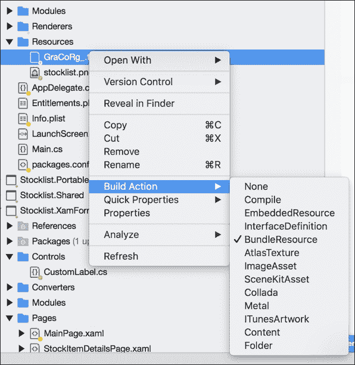

我们还希望将此字体文件添加到 Android 项目的`Assets`文件夹中，并确保将构建操作设置为`AndroidAsset`。

你可以从 GitHub 链接获取此字体文件：[`github.com/flusharcade/chapter5-stocklist`](https://github.com/flusharcade/chapter5-stocklist)。

要在 Android 上实现等效功能，我们必须在`Controls`文件夹中为`CustomLabel`项目创建一个`CustomRenderer`。打开 Android 项目，创建一个名为`Renderers`的新文件夹，并添加一个名为`CustomLabelRenderer`的新文件，然后实现以下内容：

```cs
public class CustomLabelRenderer : LabelRenderer 
    { 
        protected override void OnElementChanged (ElementChangedEventArgs<Label> e)  
        { 
            base.OnElementChanged (e); 

            if (!string.IsNullOrEmpty((e.NewElement as CustomLabel)?.AndroidFontStyle)) 
            { 
                try 
                { 
                    var font = default(Typeface); 

                    font = Typeface.CreateFromAsset(Forms.Context.ApplicationContext.Assets, (e.NewElement as CustomLabel)?.AndroidFontStyle + ".ttf"); 

                    if (Control != null) 
                    { 
                        Control.Typeface = font; 
                        Control.TextSize = (float)e.NewElement.FontSize; 
                    } 
                } 
                catch (Exception ex) 
                { 
                    Console.WriteLine(ex); 
                } 
            } 
        } 
    } 

```

在几乎所有渲染器中，我们都会暴露`OnElementChanged`函数，当在`Xamarin.Forms`中创建自定义控件以渲染相应的本地控件时会被调用。在某些情况下，`OnElementChanged`方法可能会被多次调用，因此在实例化新的本地控件时必须小心，以防止内存泄漏，这可能会对性能产生重大影响。在我们的案例中，我们并没有渲染新的控件，所以我们只需要检查当函数被调用时`NewElement`和`Control`对象不是 null。我们还必须将`NewElement`项转换为我们的自定义项，因为这个对象包含了`AndroidFontStyle`属性的定制绑定。`NewElement`始终是自定义项，所以我们总是可以将其转换。

我们现在也可以访问本地的 UI 框架；在这种情况下，我们使用 Android 的`Typeface`框架创建一个自定义的`Typeface`，它将使用我们的字体文件。然后这个`Typeface`被设置为`Control`元素的`Typeface`属性（这是实际将被显示的元素），在这种情况下，因为它是一个`LabelRenderer`，`Control`元素是一个 Android 的`TextView`。

### 注意

在其他渲染器中，我们可以将此控件元素设置为特定的本地元素，我们将在后续章节中这样做。

最后，我们必须添加以下行以导出和注册渲染器：

```cs
[assembly: Xamarin.Forms.ExportRenderer(typeof(Stocklist.XamForms.Controls.CustomLabel), typeof(Stocklist.Droid.Renderers.CustomLabel.CustomLabelRenderer))] 

```

# 为自定义元素添加样式

我们还需要添加一个额外的元素来最终确定`StockItemDetailsPage`。我们将为`CustomLabel`添加一个样式。打开`App.xaml`文件并添加以下样式：

```cs
<Style x:Key="CustomLabelStyle" TargetType="controls:CustomLabel"> 
                <Setter Property="TextColor" Value="Black" /> 
        <Setter Property="FontFamily" Value="Gravur-Condensed" /> 
        <Setter Property="AndroidFontStyle" Value="GraCoRg_" /> 
            </Style> 

```

我们为之前创建的`AndroidFontStyle`属性添加了一个`Setter`。别忘了我们还需要添加`Controls`的命名空间引用：

用户界面部分就到这里。现在让我们继续实现`StockItemDetailsPage`的视图模型。

# 创建 StockItemDetailsPageViewModel

现在我们继续到我们应用程序中的最后一个视图模型。在`Stocklist.Portable`项目的`ViewModels`文件夹中添加一个名为`StockItemDetailsPageViewModel`的新文件。

让我们先从实现`private`属性开始：

```cs
#region Private Properties 

        private readonly IStocklistWebServiceController _stocklistWebServiceController; 

        private int _id; 

        private string _name; 

        private string _category; 

        private decimal _price; 

        private bool _inProgress; 

#endregion 

```

你应该能够自己添加`public`属性。以下是一个开始示例：

```cs
public int Id 
        { 
            get 
            { 
                return _id; 
            } 

            set 
            { 
                if (value.Equals(_id)) 
                { 
                    return; 
                } 

                _id = value; 
                OnPropertyChanged("Id"); 
            } 
        } 

```

现在我们需要添加`LoadAsync`函数，它将使用`StocklistWebServiceController`从我们的 API 中获取特定`StockItem`的数据。注意`InProgress`属性的使用，这用于跟踪加载进度；因为我们是在后台下载，我们想要通过`ActivityIndicator`将此进度显示给用户界面：

```cs
#region Methods 

        protected override async Task LoadAsync(IDictionary<string, object> parameters) 
        { 
            InProgress = true; 

            if (parameters.ContainsKey("id")) 
            { 
                Id = (int)parameters["id"]; 
            } 

            var contract = await _stocklistWebServiceController.GetStockItem(Id); 

            if (contract != null) 
            { 
                this.Name = contract.Name; 
                this.Category = contract.Category; 
                this.Price = contract.Price; 
            } 

            InProgress = false; 
        } 

        #endregion 

```

然后我们添加我们的构造函数，它将提取已注册的 IoC 对象并相应地分配我们的`private`属性：

```cs
#region Constructors 

        public StockItemDetailsPageViewModel(INavigationService navigation, IStocklistWebServiceController stocklistWebServiceController, 
            Func<Action, ICommand> commandFactory) : base(navigation) 
        { 
            _stocklistWebServiceController = stocklistWebServiceController; 
        } 

        #endregion  

```

最后，我们需要在`CommonModule`中注册视图模型：

```cs
builer.RegisterType<StockItemDetailsPageViewModel>().InstancePerDependency(); 

```

将额外的枚举`StockItemDetailsPage`添加到`PageEnums.cs`中：

```cs
public enum PageNames 
    { 
        MainPage, 

        StocklistPage, 

        StockItemDetailsPage 
    } 

```

并在`NavigationService`中添加额外的 switch case：

```cs
case PageNames.StockItemDetailsPage: 
                    return IoC.Resolve<Func<StockItemDetailsPage>>()();  

```

# 设置原生平台项目

现在我们转向原生平台层，并准备 iOS、Android 和 Windows Phone 项目。我们将从 iOS 开始；让我们先添加项目所需的 NuGet 包：

+   微软 HTTP 客户端库

+   现代 HTTP 客户端

+   Autofac

+   反应式扩展（主要库）

一旦我们将这些包添加到项目中，让我们打开`AppDelegate`文件并添加我们在`Locator`项目中使用的相同的`InitIoC`函数：

```cs
private void InitIoC() 
{ 
  IoC.CreateContainer(); 
  IoC.RegisterModule(new DroidModule()); 
  IoC.RegisterModule(new SharedModule(false)); 
  IoC.RegisterModule(new XamFormsModule()); 
  IoC.RegisterModule(new PortableModule()); 
  IoC.StartContainer(); 
} 

```

然后在加载应用程序之前调用此方法：

```cs
public override bool FinishedLaunching(UIApplication app, NSDictionary options) 
        { 
            global::Xamarin.Forms.Forms.Init(); 

            InitIoC(); 

            LoadApplication(new App()); 

            return base.FinishedLaunching(app, options); 
        } 

```

在运行 iOS 应用程序之前，让我们也设置 Android 项目。我们想要从添加与 iOS 相同的库开始，然后打开`MainActivity.cs`，并添加与前面示例中相同的函数`InitIoC`。然后，最后，在我们加载应用程序之前调用`InitIoC`函数：

```cs
protected override void OnCreate(Bundle bundle) 
        { 
            base.OnCreate(bundle); 

            InitIoC(); 

            global::Xamarin.Forms.Forms.Init(this, bundle); 

            LoadApplication(new App()); 
        } 

```

简单，对吧？看看我们有多少代码是从另一个项目中复制的？

我们在其他项目中解决的问题越多，我们就能越快地拼凑出具有相似功能的应用程序。

# 本地托管 Web API 项目

在我们能够从我们的移动应用程序访问 API 层之前，我们必须设置托管。对于这个例子，我们将演示本地托管的设置。

在本地托管不需要做太多工作，但它将需要一个同时运行 Windows 和 Mac OSX 的实例。你可以通过简单地运行 parallels，或者使用一台**Windows**和**Mac**电脑来实现这一点。

我们的第一步是从我们的 Windows 实例打开 Visual Studio 并点击运行按钮：

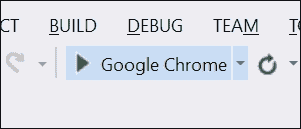

当项目启动时，它将自动打开你的默认网络浏览器并显示应用程序。

### 小贴士

由于我们没有任何可见的网页，我们不需要打开浏览器。如果项目正在运行，Web API 也将运行，因此我们可以通过 HTTP 请求 ping 它。

现在我们已经运行了后端，我们如何访问 API？

如果你通过两个独立的计算机运行，我们应该能够简单地通过计算机的 IP 地址访问 API。为了找出计算机的 IP 地址，打开一个新的命令提示符窗口并输入`ipconfig`。这将显示计算机在当前网络中分配的 IPv4 地址。

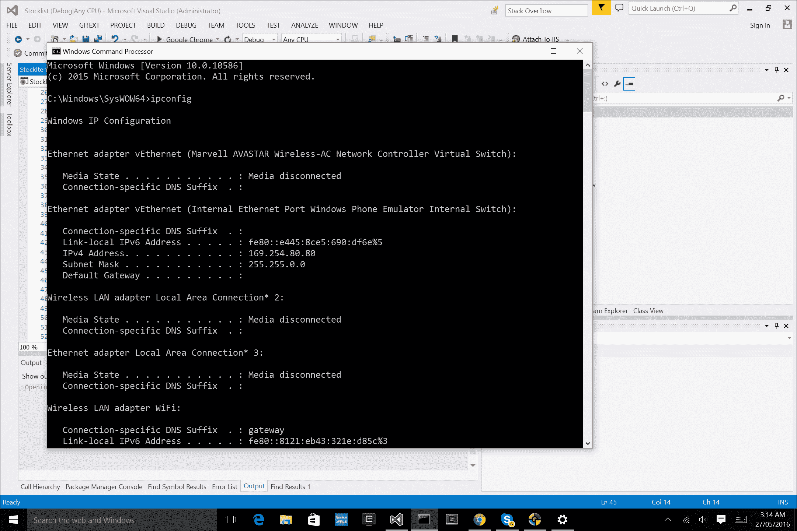

### 注意

为了本地设置能够工作，请确保移动设备和托管 WEB API 的计算机都在相同的 **WIFI/LAN** 连接上。

为了确认我们已成功设置，请将以下 URL 粘贴到 Windows 实例上的网页浏览器中，并查看是否得到结果：

```cs
"localhost:{port}/api/StockItems" 

```

### 注意

当项目运行时，端口会自动分配，所以当浏览器出现带有 localhost URL 时，粘贴 URL 扩展名 `api/StockItems`。

现在我们想在 Mac 实例上测试这个链接，但在做之前，我们必须更改位于 `"C:\Users[YourName]\Documents\IISExpress\config\applicationhost.config"` 的 `applicationhost.config` 文件中的某些设置。

如果你使用的是 Visual Studio 2015，它将位于 `/{项目文件夹}/.vs/config/applicationhost.config`。

如果你还没有开启 **Internet Information Services** (**IIS**)，请按照以下步骤安装 IIS 以提供静态内容：

1.  点击开始按钮，点击 **控制面板**，点击 **程序**，然后点击 **启用或关闭 Windows 功能**。

1.  在 **Windows 功能** 列表中，选择 **Internet Information Services**，然后点击 **确定**。

1.  查看文件，直到你可以像这样添加你的应用程序条目：

    ### 注意

    找到你的特定条目的最佳方式是通过搜索 `端口` 号码。

    ```cs
            <site name="Stocklist" id="43"> 
                            <application path="/"
                            applicationPool="Clr4IntegratedAppPool"> 
                                <virtualDirectory path="/" 
    physicalPath="C:\Users\Michael\Documents\Stocklist\Stocklist" /> 
                            </application> 
                            <bindings> 
                                <binding protocol="http" bindingInformation="*:
                                {PORT}:localhost" /> 
                            </bindings> 
            </site> 

    ```

1.  在 `<bindings>` 部分中，我们想添加另一行：

    ```cs
            <binding protocol="http" bindingInformation="*:{PORT}:{IPv4 Address}" />  

    ```

1.  现在我们想允许来自其他计算机的此 `PORT` 和 `IPv4 地址` 的入站连接。

    ### 注意

    如果你正在运行 Windows 7，大多数入站连接都是锁定状态，因此你需要特别允许应用程序的入站连接。

1.  首先，启动一个管理命令提示符并运行以下命令，将 `{IPv4}:{PORT}` 替换为你正在使用的 `IPv4 地址` 和 `PORT`：

    ```cs
            > netsh http add urlacl url=http://{IPv4}:{PORT}/ user=everyone 

    ```

1.  这只是告诉 `http.sys` 与此 URL 通信是允许的。接下来，运行以下命令：

    ```cs
     > netsh advfirewall firewall add rule name="IISExpressWeb"
            dir=in protocol=tcp localport={PORT} profile=private
            remoteip=localsubnet action=allow

    ```

1.  这在 Windows 防火墙中添加了一个规则，允许本地子网上的计算机访问该端口的入站连接。

1.  现在我们应该能够从我们的 Mac 实例访问正在运行的 API。这次，粘贴带有 IPv4 地址的 URL 而不是 `localhost: {IPv4 address}:{port}/api/StockItems`。

1.  如果一切顺利，我们应该看到以下 XML 布局显示如下：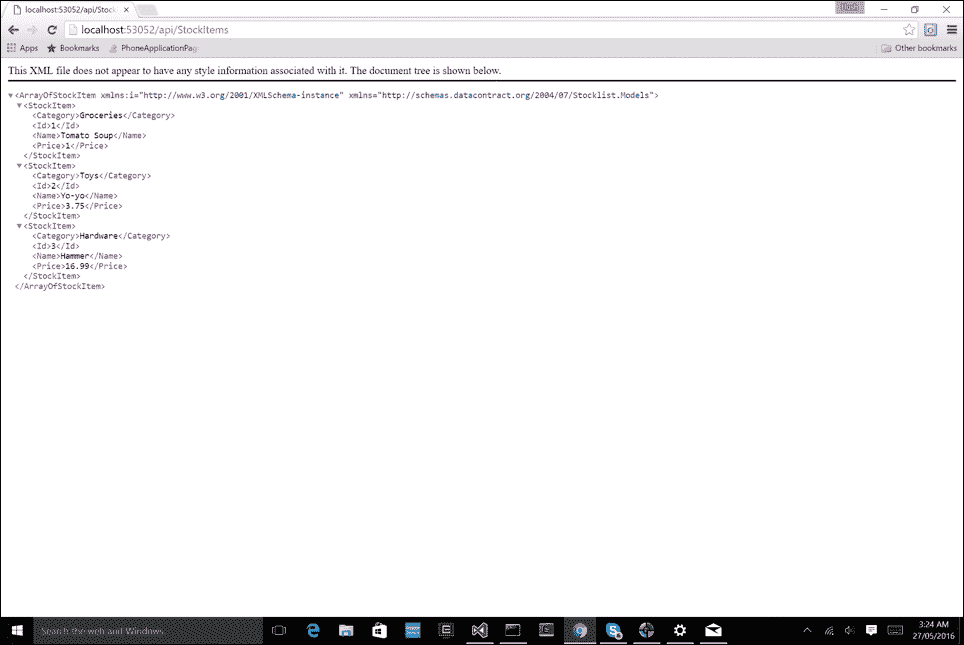

1.  优秀！现在让我们将这些 URL 设置添加到我们的移动应用程序中。打开 `Stocklist.Portable` 项目的 `Resources` 文件夹中的 `Config.resx` 文件，并填写这些值：

    ```cs
                <data name="ApiAllItems" xml:space="preserve"> 
                    <value>http://{IPv4}:{PORT}/api/StockItems</value> 
                </data> 
                <data name="GetById" xml:space="preserve"> 
                    <value>http://{IPv4}:{PORT}/api/GetItemById</value> 
                </data> 

    ```

现在，让我们在 iOS 和 Android 上测试我们的项目，我们应该能够看到我们的 `StocklistPage` 从我们的 API 控制器中填充项目。

# 摘要

在本章中，我们使用`Xamarin.Forms`构建了一个用于检索网络服务的应用程序。我们设置了一个`ListView`并创建了一个`ObservableCollection`来显示 JSON 对象。我们还学习了如何在后端设置一个简单的网络服务。在下一章中，我们将使用原生库创建一个适用于 iOS 和 Android 的应用程序。我们将在客户端和服务器端使用 Signal R，并通过客户端设置中心代理连接。
