# 第六章：建立聊天应用

在本章中，我们将回到 Xamarin 原生。我们的用户界面将远离 MVVM 设计，并遵循一个新的范式，称为**模型-视图-演示者**（**MVP**）。我们还将进一步深入后端，设置一个 SignalR Hub 和客户端来模拟聊天服务，数据将在服务器和客户端之间即时发送，因为消息变得可用。另一个关键的关注点是项目架构，花费时间将项目划分为模块，并创建一个分层结构，这将最大化不同平台之间的代码共享。

以下知识是预期的：

+   对 Xamarin 原生（iOS 和 Android）有一些了解

+   Visual Studio

+   对 OWIN 规范有一些了解

+   对 OAuth 有一些了解

在本章中，你将学习以下内容：

+   模型-视图-演示者（MVP）模式

+   架构

+   SignalR

+   从.NET 的 Open Web 接口（OWIN）开始

+   使用 OWIN OAuth 2.0 创建授权服务器

+   `OAuthAuthorizationServerProvider`

+   授权服务器提供者

+   `UseOAuthBearerAuthentication`

+   设置认证存储库

+   配置 Web API

+   构建`AccountController`

+   配置 Web API 的 OAuth 身份验证

+   构建`SignalR Hub`

+   设置移动项目

+   创建`SignalRClient`

+   构建`Web API`访问层

+   应用状态

+   设置导航服务

+   构建`iOS`导航服务

+   构建`Android`导航服务

+   构建`iOS`界面

+   处理 Hub 代理回调

+   实现`LoginPresenter`

+   创建演示者和视图之间的连接

+   构建`LoginActivity`

+   实现`ClientsListPresenter`

+   创建`ClientListViewController`

+   `TaskCompletionSource`框架

+   创建`ClientsListActivity`

+   重写`Activity`的`OnBackPressed()`

+   构建`ListAdapter`

+   构建`ChatPresenter`

+   构建`iOS`的`ChatView`

+   扩展`UIColor`框架

+   Android `TableLayouts`

+   构建`Android`的`ChatActivity`

+   运行服务器和客户端

# 模型-视图-演示者（MVP）模式

在我们所有的前几章中，我们围绕**模型-视图-视图-模型**（**MVVM**）方法进行开发模式。这次我们将围绕 MVP 设计模式设置我们的项目。在 MVP 中，演示者集中了模型和视图之间的用户界面功能，这意味着所有展示逻辑都推送到演示者。

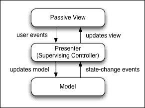

## 那为什么还要采用这种方法呢？

这种方法的优点是我们可以对我们的演示者应用单元测试，这意味着所有 UI 逻辑都是通过演示者进行测试的。我们还有能力保持我们的用户界面为原生，并在不同平台之间共享大量的 UI 逻辑。

# 架构

当涉及到跨平台应用时，我们的目标是尽可能多地共享代码。我们专注于架构，拥有一个干净的项目结构，这有助于最大化跨平台的代码共享。那么我们如何解决这个问题？问问自己：

+   有哪些不同的层级？

+   我们如何设置文件夹结构？

+   哪些部分属于哪个项目？

对于这个问题有许多不同的方法；以下是一些最常见的架构层：

+   **数据层**：这个层存储数据库

+   **数据访问层**：这个层专注于对数据层（读取、写入、更新）应用操作的对象和包装器

+   **业务层（逻辑）**：这个层专注于不同的领域（领域驱动设计），将不同的逻辑区域分离成处理每个领域操作的对象

+   **服务访问层**：这个区域专注于对 Web API 的操作，我们如何处理 JSON，以及 API 控制器之间发送和接收的数据

+   **应用/平台层**：不共享的代码，特定于原生平台

+   **通用层**：一个共享的项目，代码被共享到所有原生项目中

+   **用户界面层**：包含所有 UI 设计的层（XAML 表单，UIViewControllers，AXML）

## 我们如何确定我们的项目需要哪些层？

在这个例子中相当简单；我们没有数据库，所以不需要数据层或数据访问层。我们需要的其他所有东西，让我们从零开始构建我们的项目，先从底层开始。

我们将从服务访问层开始构建项目；它将包括与 SignalR 相关的所有内容，因此我们的第一步是构建后端 SignalR hub。

# SignalR

SignalR 是一个库，它为使用 WebSocket 传输（如果支持 HTML 5）的应用程序提供实时 Web 功能。它具有服务器实时将数据推送到其客户端的能力，这意味着我们不必反复请求服务器数据（如刷新/重新调用 Web API）。

为了设置 SignalR，我们首先必须在服务器端设置一个 SignalR **Hub**；我们的客户端（移动项目）将通过创建一个**HubConnection**并从其中创建一个**HubProxy**来访问这个**Hub**，从而服务器和客户端可以在任一侧调用函数。

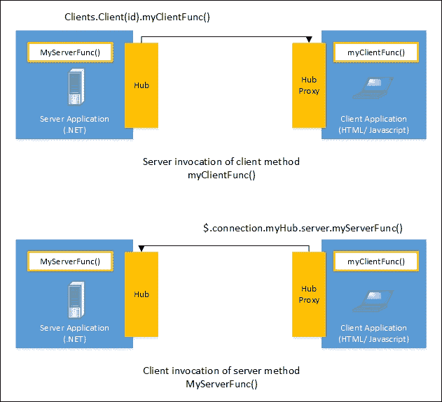

现在让我们进入开发阶段；我们将与上一章相同的硬件设置。我们将通过 Visual Studio 设置本地托管的后端，并在 MacOSX 上的 Xamarin Studio 中构建我们的移动项目。打开 Visual Studio，创建一个`newASP.NET` Web 应用，并将其命名为`Chat`。

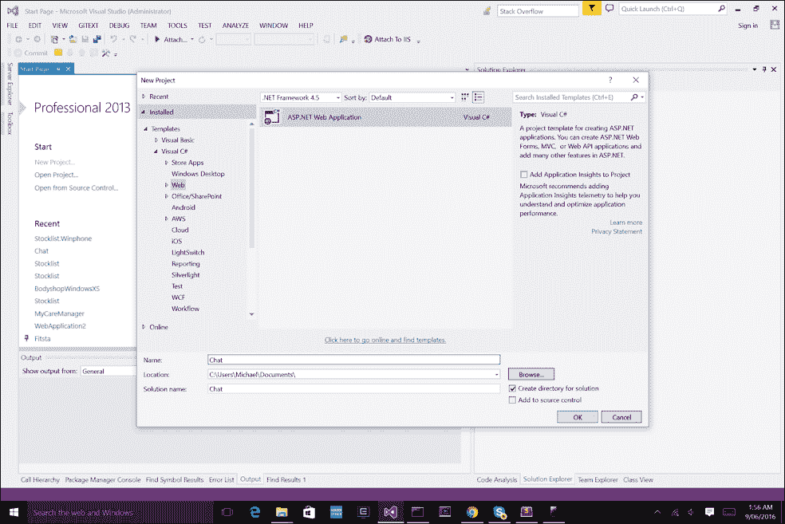

然后我们必须选择一个模板；选择**空**模板：

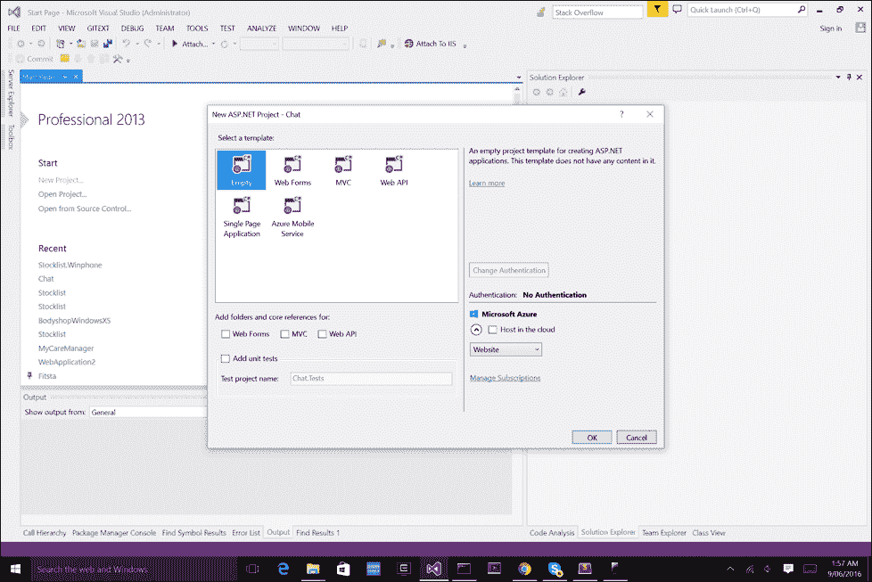

太好了！我们现在有了空项目，让我们先添加 NuGet 包，**Microsoft.AspNet.SignalR**。

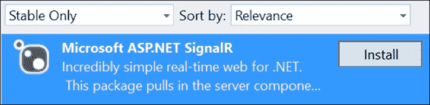

将会显示一个包含设置 SignalR **Hub** 基本方向的说明文件。我们还想为 OWIN 添加 Web API 2.2 功能，因为我们将在项目中添加一个小型 Web API 来处理登录、注册和账户功能。让我们添加以下库：

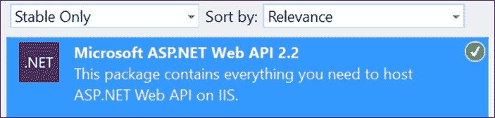

这将安装 Web API 功能，这样我们就可以创建 API 控制器并通过 `Startup` 类映射路由。然后我们想添加 Web API 2.2 OWIN 库以将 OWIN 管道集成到我们的 HTTP 配置中：

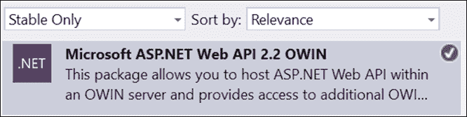

我们还想添加 `OWIN.Security` 库来处理使用 **Bearer 令牌** 的账户授权。

### 注意

在 HTTP 请求头中使用 Bearer 令牌来授权访问 OAuth 2.0 受保护的资源。

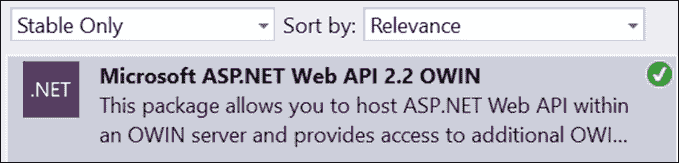

最后，我们必须添加另一个名为 `Microsoft.AspNet.Identity.Framework` 的包。这个库将用于使用 `UserManager` 框架来处理用户账户（用户名和密码）的存储。

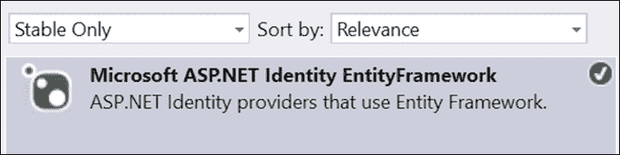

现在我们已经添加了所有包，让我们从头开始构建网络应用程序。

# 从 Open Web Interface for .NET (OWIN) 开始

**OWIN** 是 .NET 服务器和 Web 应用程序之间的标准接口。它提供了一个中间件，用于解耦 Web 服务器和 Web 应用程序。OWIN 的最大优点是我们能够将 Web 应用程序托管在任何地方，并保持服务器和应用程序完全分离。

### 注意

关于 OWIN 的更多信息，最好的起点是 Katana 项目。Katana 是一系列支持 OWIN 的项目，它们使用各种 Microsoft 组件。

那么 OWIN 与我们的项目有什么关系呢？

如果你注意上面的代码，我们会看到所有对 OWIN 命名空间的引用，并且我们在程序集中将 `OwinStartup` 对象注册到我们的 `Startup` 类。我们必须在 `OwinStartup` 属性中注册至少一个 `Startup` 类。`Startup` 类有一个名为 `Configuration` 的函数。所有 `Startup` 类都必须包含此函数，并且它必须接受 `IAppBuilder`。还可以指定其他服务，如 `IHostingEnvironment` 和 `ILoggerFactory`，在这种情况下，如果它们可用，服务器将注入这些服务。`Configuration` 指定应用程序如何响应单个 HTTP 请求。最后，在我们的 `Configuration` 方法中，我们将调用 `MapSignalR`（`IAppBuilder` 对象的扩展）。这将定义客户端用于连接到您的 **Hub/s** 的路由。

### 注意

默认情况下，路由设置为 URL `/signalr` 的应用程序构建器管道：如果需要，我们也可以自定义此 URL。

我们下一步是引入一些安全性。

## 使用 OWIN OAuth 2.0 创建授权服务器

OAuth 2.0 框架允许服务器向客户端提供对 HTTP 服务的有限访问。受保护的资源只能通过在特定时间段后过期的访问令牌访问。客户端将向域端点 URL 发送 HTTP 请求（通常是 `/token`），服务器将发送包含令牌详细信息（如过期时间、访问令牌、时间/日期）的响应，并且访问令牌将在一段时间内与其他 HTTP 请求头一起使用，以授权访问受保护资源。

### 注意

访问令牌是表示特定范围、生存期和其他访问属性的字符串。

那么我们该从哪里开始设置服务器授权？

我们的第一步是构建基于用户名和密码凭证授予客户端访问的逻辑。

## OAuthAuthorizationServerProvider

`OAuthAuthorizationServerProvider` 确定了我们如何使用 `OAuthGrantResourceOwnerCredentialsContext` 验证用户凭证。其任务是简单地处理用户的身份验证。此项目提供了我们处理资源授予的上下文。

让我们添加一个名为 `Providers` 的新文件夹，并在该文件夹中添加一个名为 `AuthorizationServerProvider.cs` 的新文件。实现以下内容：

```cs
public class AuthorizationServerProvider : OAuthAuthorizationServerProvider 
    { 
        public override async Task ValidateClientAuthentication(OAuthValidateClientAuthenticationContext context) 
        { 
            context.Validated(); 
        } 

        public override async Task GrantResourceOwnerCredentials(OAuthGrantResourceOwnerCredentialsContext context) 
        { 
            context.OwinContext.Response.Headers.Add("Access-Control-Allow-Origin", new[] { "*" }); 
            string userName = null; 

            using (AuthenticationRepository authenticationRepository = new AuthenticationRepository()) 
            { 
                IdentityUser user = await authenticationRepository.FindUser(context.UserName, context.Password); 

                if (user == null) 
                { 
                    context.SetError("invalid_grant", "Incorrect user name or password"); 
                    return; 
                } 

                userName = user.UserName; 
            } 

            var identity = new ClaimsIdentity(context.Options.AuthenticationType); 
            identity.AddClaim(new Claim("Role", "User")); 
            identity.AddClaim(new Claim("UserName", userName)); 

            context.Validated(identity); 
        } 
    }   

```

我们对 `OAuthAuthorizationServerProvider` 的实现将覆盖 `ValidateClientAuthentication` 函数，该函数简单地返回 `usercontext` 是否已验证。然后我们覆盖 `GrantResourceOwnerCredentials()` 函数，当带有 `grant_type` 为 `password` 的请求到达令牌端点（`/token`）时，该函数会被调用（此键与用户名和密码一起设置在请求头中）。该函数将简单地初始化一个新的 `AuthenticationRepository` 以访问 `UserManager` 框架并检查用户是否存在；如果不存在，我们返回，并且上下文仍然无效。如果用户存在，我们创建一个新的 `ClaimsIdentity` 对象，包含两个声明，一个用于源所有者（发送 HTTP 请求的用户）的 *角色* 和 *用户名* 原则。最后，我们将 `ClaimsIdentity` 对象放入 `context.Validated()` 函数中，以颁发访问令牌。这个 `ClaimsIdentity` 对象现在是包含与访问令牌关联的资源所有者（用户）声明的票据。

### 注意

`ClaimsIdentity` 是一个对象，它是一个 `Claim` 对象的集合，用于表示实体的身份。每个 `Claim` 对象只是一个描述身份角色、权限或其他实体质量的陈述。

## 使用 OAuthBearerAuthentication

我们接下来的步骤是添加处理携带令牌（这些是由授权服务器提供者授予的访问令牌）的逻辑。`UseOAuthBearerAuthentication` 的任务是确保只有经过身份验证的用户才能访问您的受保护服务器资源（在我们的例子中是 `ChatHub`）。添加一个名为 `OAuthBearerTokenAuthenticationProvider.cs` 的新文件并实现以下内容：

```cs
public class OAuthBearerTokenAuthenticationProvider : OAuthBearerAuthenticationProvider 
    { 
        public override Task RequestToken(OAuthRequestTokenContext context) 
        { 
            string cookieToken = null; 
            string queryStringToken = null; 
            string headerToken = null; 

            try 
            { 
                cookieToken = context.OwinContext.Request.Cookies["BearerToken"]; 
            } 
            catch (NullReferenceException) 
            { 
                System.Diagnostics.Debug.WriteLine("The cookie does not contain the bearer token"); 
            } 

            try 
            { 
                queryStringToken = context.OwinContext.Request.Query["BearerToken"].ToString(); 
            } 
            catch (NullReferenceException) 
            { 
                System.Diagnostics.Debug.WriteLine("The query string does not contain the bearer token"); 
            } 

            try 
            { 
                headerToken = context.OwinContext.Request.Headers["BearerToken"]; 
            } 
            catch (NullReferenceException) 
            { 
                System.Diagnostics.Debug.WriteLine("The connection header does not contain the bearer token"); 
            } 

            if (!String.IsNullOrEmpty(cookieToken)) 
                context.Token = cookieToken; 

            else if (!String.IsNullOrEmpty(queryStringToken)) 
                context.Token = queryStringToken; 

            else if (!String.IsNullOrEmpty(headerToken)) 
                context.Token = headerToken; 

            return Task.FromResult<object>(null); 
        } 
    } 

```

让我们更仔细地看看这个项目。我们正在重写 `RequestToken()` 函数，以便从每个击中服务器的 HTTP 请求中访问 `OAuthRequestTokenContext`。在 `OwinContext` 对象内部，我们可以访问刚刚击中服务器的 HTTP 请求，通过头部字典检查我们的 `BearerToken`，然后提取这个访问令牌并将其分配给 `OAuthRequestTokenContext.Token` 属性。

# 设置 AuthenticationRepository

现在我们转向 `AuthenticationRepository`。这是将处理访问和存储的对象，使用由 `Identity.EntityFramework` 库提供的 `UserManager` 框架。添加一个名为 `Repositories` 的新文件夹，然后添加一个名为 `AuthenticationRepository.cs` 的新文件，并实现以下内容：

### 注意

`UserManager` 类是任何 ASP.Net 应用程序提供身份管理的门面

```cs
public class AuthenticationRepository : IDisposable 
    { 
        private AuthenticationContext authenticationContext; 
        private UserManager<IdentityUser> userManager; 

        public AuthenticationRepository() 
        { 
            authenticationContext = new AuthenticationContext(); 
            userManager = new UserManager<IdentityUser>(new UserStore<IdentityUser>(authenticationContext)); 
        } 

        public async Task<IdentityResult> RegisterUser(UserModel userModel) 
        { 
            IdentityUser newUser = new IdentityUser() 
            { 
                UserName = userModel.Username 
            }; 

            var foundUser = await userManager.FindByNameAsync(newUser.UserName); 
            if (foundUser != null) 
            { 
                await userManager.RemovePasswordAsync(foundUser.Id); 
                return await userManager.AddPasswordAsync(foundUser.Id, userModel.Password); 
            } 
            else 
            { 
                return await userManager.CreateAsync(newUser, userModel.Password); 
            } 
        } 

        public async Task<IdentityUser> FindUser(string userName, string password) 
        { 
            return await userManager.FindAsync(userName, password); 
        } 

        public void Dispose() 
        { 
            authenticationContext.Dispose(); 
            userManager.Dispose(); 
        } 
    } 

```

我们在这里的主要关注点涉及两个函数，一个用于注册用户（如果他们不存在），另一个用于查找用户。授权服务器提供者使用 `FindUser` 来确定用户是否存在以确认身份验证。

我们还需要添加另一个名为 `AuthenticationContext.cs` 的文件，并实现以下内容：

```cs
public class AuthenticationContext : IdentityDbContext<IdentityUser> 
    { 
        public AuthenticationContext() 
            : base("AuthenticationContext") 
        { 
        } 
    }  

```

这是一个非常简单的类，它继承自 `IdentityDBContext` 类型的 `IdentityUser`。该对象是访问层，用于通过 `EntityFramework` 获取数据对象（`IdentityUser` 对象）。以下图表显示了您的 ASP.Net 应用程序和 `EntityFramework` 之间的逻辑层：

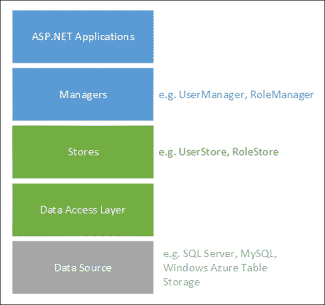

太棒了！希望那些主题没有太令人困惑。现在让我们开始构建 Web API。

## 配置 Web API

我们下一步是配置 Web API。让我们添加一个名为 `App_Start` 的新文件夹。在这个文件夹内添加一个名为 `WebApiConfig.cs` 的新文件，并实现以下内容：

```cs
public static class WebApiConfig 
    { 
        public static void Register(HttpConfiguration config) 
        { 
            config.Routes.MapHttpRoute( 
                name: "DefaultApi", 
                routeTemplate: "api/{controller}/{action}/{id}", 
                defaults: new { id = RouteParameter.Optional } 
            ); 
        } 
    } 

```

更仔细地看看 `routeTemplate`；注意到 `{action}` 的添加吗？这意味着我们必须在每个 `AccountController` 中的函数上包含 `ActionName` 属性。`ActionName` 属性代表 URL 扩展名，例如：

```cs
ActionName("Register") = http://{IP Address}:{Port}/Register 

```

现在，让我们添加另一个名为 `Startup.cs` 的文件，并实现以下内容：

```cs
public class Startup 
    { 
        public void Configuration(IAppBuilder app) 
        {  
            HttpConfiguration config = new HttpConfiguration(); 
            WebApiConfig.Register(config); 

            app.UseWebApi(config); 
        } 
    } 

```

现在让我们继续构建 `AccountController` 来处理用户登录和注册的传入 HTTP 请求。

## 构建 AccountController

现在我们已经配置了 Web API，让我们构建第一个 API 控制器。添加一个名为 `Models` 的新文件夹。在这个文件夹内，添加一个名为 `UserModel.cs` 的新文件，并实现以下内容：

```cs
public class UserModel { 

        [Required] 
        public string Username { get; set; } 

        [Required] 
        public string Password { get; set; } 
    } 

```

该对象将包含客户端通过 HTTP 请求传递的 username 和 password 字段。`Register`属性用于确保此属性包含在 HTTP 请求中。然后我们可以将此属性映射到 API 控制器的`ModelState.IsValid`检查，如果任何具有此属性的属性缺失，则`IsValid`属性将为`false`。接下来，让我们添加另一个名为`Controllers`的文件夹。在这个文件夹中添加一个名为`AccountController.cs`的新文件，并实现以下内容：

```cs
public class AccountController : ApiController 
    { 
        private AuthenticationRepository authenticationRepository; 

        public AccountController() 
        { 
            authenticationRepository = new AuthenticationRepository(); 
        } 

        [HttpPost] 
        [AllowAnonymous] 
        [ActionName("Register")] 
        public async Task<IHttpActionResult> Register(UserModel userModel) 
        { 
            if (!ModelState.IsValid) 
            { 
                return BadRequest(ModelState); 
            } 

            var result = await authenticationRepository.RegisterUser(userModel); 
            return Ok(); 
        } 
    } 

```

我们的第一步是`Register`函数，它负责通过`AccountRepository`将新用户存储到`UserManager`中。

注意到`ModalState.IsValid`上的 if 语句吗？

如果 HTTP 请求中缺少`Username`或`Password`属性，它将返回`false`。

现在让我们添加`Login`函数：

```cs
[HttpPost] 
        [AllowAnonymous] 
        [ActionName("Login")] 
        public async Task<bool> Login(UserModel userModel) 
        { 
            if (!ModelState.IsValid) 
            { 
                return false; 
            } 
            var result = await 
            authenticationRepository.FindUser(userModel.Username, 
            userModel.Password); 
            return (result != null); 
        } 

```

这与`Register`完全相同，但我们使用`FindUser`函数来检查用户是否存在于`UserManager`中。最后，为了避免任何内存泄漏，我们需要确保当 API 控制器被销毁时，`AuthenticationRepostiory`也被销毁。让我们像这样重写`Dispose`函数：

```cs
         protected override void Dispose(bool disposing) 
        { 
            if (disposing) 
                authenticationRepository.Dispose(); 

            base.Dispose(disposing); 
        } 

```

太好了！对于`AccountController`来说，这就是全部内容；现在我们必须将 OAuth 身份验证和 Web API 集成在一起。

## 使用我们的 Web API 配置 OAuth 身份验证

为了将我们的 OAuth 模块与 Web API 集成，我们必须在`Startup.cs`中添加一些额外的配置。添加一个名为`ConfigureOAuth`的新函数，如下所示：

```cs
public class Startup 
    { 
        ... 

public void ConfigureOAuth(IAppBuilder app) 
        { 
            OAuthAuthorizationServerOptions OAuthServerOptions = new OAuthAuthorizationServerOptions() 
            { 
                AllowInsecureHttp = true, 
                TokenEndpointPath = new PathString("/token"), 
                AccessTokenExpireTimeSpan = TimeSpan.FromDays(1), 
                Provider = new AuthorizationServerProvider() 
            }; 

            app.UseOAuthAuthorizationServer(OAuthServerOptions); 
            app.UseOAuthBearerAuthentication(new OAuthBearerAuthenticationOptions() 
            { 
                Provider = new OAuthBearerTokenAuthenticationProvider() 
            }); 

        } 

   ... 
} 

```

仔细观察，我们首先实例化一个新的`OAuthAuthorizationServerOptions`对象，我们设置端点 URL、访问令牌的过期期限，并将提供者设置为在先前的示例中创建的`AuthorizationServerProvider`类。然后我们使用`UseOAuthAuthorizationServer`函数将此对象添加到`IAppBuilder`对象中。最后，我们创建一个新的`OAuthBearerAuthenticationOptions`对象，其中提供者设置为在先前的示例中创建的`OAuthBearerTokenAuthenticationProvider`对象。

到此为止；我们现在已经将 OAuth 身份验证集成到我们的 Web API 中。现在让我们实现服务器应用程序的最后一部分。

## 构建 SignalR Hub

`ChatHub`将负责使用`ConnectionId`在客户端之间路由消息。让我们添加一个名为`ChatHub`的新文件，并从重写`OnConnected`和`OnDisconnected`函数开始：

```cs
[Authorize] 
    public class ChatHub : Hub 
    { 
        public static readonly ConcurrentDictionary<string, SigRUser> Users 
            = new ConcurrentDictionary<string, SigRUser>(StringComparer.InvariantCultureIgnoreCase); 

  public override Task OnConnected() 
        { 
            var userName = (Context.User.Identity as ClaimsIdentity).Claims.FirstOrDefault(claim => claim.Type == "UserName").Value; 
            string connectionId = Context.ConnectionId; 

            var user = Users.GetOrAdd(userName, _ => new SigRUser 
            { 
                Name = userName, 
                ConnectionIds = new HashSet<string>() 
            }); 

            lock (user.ConnectionIds) 
            { 

                user.ConnectionIds.Add(connectionId); 
                NotifyOtherConnectedUsers(userName); 
            } 

            return base.OnConnected(); 
        } 

        public override Task OnDisconnected(bool stopCalled) 
        { 
            var userName = (Context.User.Identity as ClaimsIdentity).Claims.FirstOrDefault(claim => claim.Type == "UserName").Value; 
            string connectionId = Context.ConnectionId; 

            SigRUser user; 
            Users.TryGetValue(userName, out user); 

            if (user != null) 
            { 
                lock (user.ConnectionIds) 
                { 
                    SigRUser removedUser; 
                    Users.TryRemove(userName, out removedUser); 

                    NotifyOtherConnectedUsers(userName); 
                } 
            } 

            return base.OnDisconnected(stopCalled); 
        } 
    } 

```

`HashSetUsers`是静态的，因为我们将在`AccountController`中使用它。

注意到这个 Authorize 属性吗？

这就是我们创建受保护服务器资源的方式；只有获得访问令牌的客户端才能连接到`ChatHub`。

现在，让我们将注意力转向`OnConnected`函数。当客户端连接到`ChatHub`时，用户名是从`HubCallerContext`属性中检索的，该属性实际上是一个`ClaimsIdentity`对象。当我们通过`AccountController`登录时，在`AuthorizationServerProvider`内部，当调用`GrantResourceOwnerCredentials`函数时，我们将身份对象存储在上下文中。我们还在身份中存储了一个类型为`username`的`Claim`对象，我们现在可以从`HubCallerContext`中的用户身份中检索它。这就是我们将 OAuth 与 SignalR 集成的样子。

现在我们已经获得了用户名，我们将尝试从`ConcurrentDictionary`中检索一个`SigRUser`对象；如果用户名不存在，我们创建一个新的`SignRUser`并将其添加到`HashSet`中。然后我们锁定`ConnectionIdsConcurrentDictionary`，使其线程安全，因为多个线程（不同的用户连接）可以对此属性进行更改。在锁定语句中，我们添加新的`ConnectionId`并使用`NotifyOtherConnectedUsers`函数通知所有连接到`ChatHub`的其他用户。现在让我们将这个函数添加到`ChatHub`中：

```cs
public void NotifyOtherConnectedUsers(string userName) 
        { 
            var connectionIds = Users.Where(x => !x.Key.Contains(userName)) 
            .SelectMany(x => x.Value.ConnectionIds) 
            .Distinct(); 

            foreach (var cid in connectionIds) 
            { 
                Clients.Client(cid).displayMessage("clients", JsonConvert.SerializeObject(Users.Select(x => x.Key))); 
            } 
        } 

```

这个函数将调用`displayMessage`，向所有其他连接的客户端发送`ConcurrentDictionary Users`的序列化 JSON 对象（我们稍后会看到原因）。

现在，让我们将注意力转向`OnDisconnected`函数。这个函数将简单地检查是否存在一个用户名为从`HubCallerContext`对象中检索到的`SigRUser`。如果此用户存在，我们尝试将其从`ConcurrentDictionary`中删除，并再次调用`NotifyOtherConnectedUsers`，将更新后的客户端字典发送给剩余的连接客户端。

### 小贴士

我们每次用户连接或断开与中心连接时都会调用这个函数，因此在我们的移动应用程序中，我们可以实时更新连接客户端的列表，而无需刷新页面。

现在我们能够处理连接客户端的更新列表，我们的最后一步是添加一个在两个客户端之间发送消息的函数。`Send`函数将通过客户端的中心代理调用，带有两个参数（消息和用户名）：

```cs
public void Send(string message, string to) 
        { 
            SigRUser receiver; 

            if (Users.TryGetValue(to, out receiver)) 
            { 
                var userName = (Context.User.Identity as ClaimsIdentity).Claims.FirstOrDefault(claim => claim.Type == "UserName").Value; 

                SigRUser sender; 
                Users.TryGetValue(userName, out sender); 

                lock (receiver.ConnectionIds) 
                { 
                    foreach (var cid in receiver.ConnectionIds) 
                    { 
                        Clients.Client(cid).displayMessage("chat", message); 
                    } 
                } 
            } 
        } 

```

这就是我们的后端全部内容。我们现在已经为服务访问层添加了第一个功能。

### 小贴士

服务器服务访问层将位于移动项目不同的服务访问层中。与服务器和客户端代码一样，系统的每一侧都将有自己的架构和层。

现在，让我们转向客户端并开始构建我们的移动应用程序。

# 设置移动项目

现在，让我们回到移动端；在我们的移动项目中，我们将原生地在 Android 和 iOS 上设置 SignalR 客户端。我们还将创建一个表示层来在两个原生平台之间共享 UI 逻辑。打开 Xamarin Studio 并创建一个名为`Chat.Common`的新共享项目；在这个项目中添加两个名为`Model`和`Presenter`的空文件夹。

然后，我们想要创建一个**单个视图 iOS 应用程序**，一个**通用 Android 应用程序**，以及一个名为`Chat.ServiceAccess`的共享项目。我们的项目结构将如下所示：

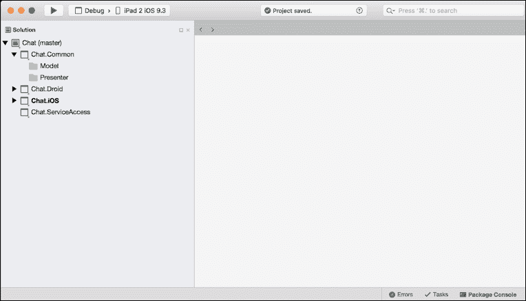

## 创建 SignalRClient

我们将开始实现一个新的类，称为`SignalRClient`。这将位于服务访问层，名为`Chat.ServiceAccess`的共享项目中。创建一个名为`SignalRClient.cs`的新文件，并实现以下内容：

```cs
public class SignalRClient
     {
         private readonly HubConnection _connection;
         private readonly IHubProxy _proxy;
         public event EventHandler<Tuple<string, string>> OnDataReceived;
         public SignalRClient()
         {
             _connection = new HubConnection("http://{IP Address}:{Port}/");
             _proxy = _connection.CreateHubProxy("ChatHub");
         }
 }  

```

现在让我们更仔细地看看。我们有两个`readonly`属性，在对象创建时只初始化一次，一个是设置到服务器 URL 的 hub 连接，另一个是从连接到服务器的`HubProxy`创建的。

现在让我们为`ChatHub`添加两个用于连接和断开连接的功能：

```cs
public async Task<bool> Connect(string accessToken)
         {
             try
             {
                 _connection.Headers.Add("Authorization",
                 string.Format("Bearer {0}", accessToken));
                 await _connection.Start();
                 _proxy.On<string, string>("displayMessage", (id, data) =>
                 {
                     if (OnDataReceived != null)
                     {
                         OnDataReceived(this, new Tuple<string,
                         string>(id, data));
                     }
                 });
                 return true;
             }
             catch (Exception e)
             {
                 Console.WriteLine(e);
             }
             return false;
         }
         public void Disconnect()
         {
             _connection.Stop();
             _connection.Dispose();
         }
```

`Connect`函数需要一个访问令牌，我们将它添加到`HubConnection`对象的`Headers`字典中。

### 注意

访问令牌用作 Bearer 令牌，以授权对`ChatHub`的访问。

从代理中调用的`On`函数接受两个参数，即我们正在监听的服务器上函数的名称，以及每次在 Hub 的已连接客户端上调用此函数时将执行的操作。在这个例子中，我们的代理将在从服务器接收两个字符串时触发此操作。第一个字符串是传递到第二个字符串中的数据的 ID（这可能是一个包含已连接客户端的 JSON 列表或一个简单的聊天消息）。然后，这些数据将通过一个`Tuple<string, string>`对象传递给`EventHandler`。

### 注意

我们可以为多个函数调用`On`，并为在`Hub`上被调用的每个不同函数触发不同的操作。

`Disconnect`函数简单地关闭连接并释放`HubConnection`对象。最后，我们添加另一个函数，通过服务器上的`ChatHub`对象调用`Send`函数：

```cs
public async Task SendMessageToClient(string user, string message)
{
    await _proxy.Invoke("Send", new object[]
    {
        message,
        user
    });
}
```

当我们调用服务器函数时，我们使用一个对象数组，以匹配服务器函数所需的参数。

由于`SignalRClient`将位于一个共享项目中，相同的代码将在每个不同的平台上使用，但引用的库将从每个平台项目提供。现在让我们让 iOS 和 Android 项目都引用这个共享项目。我们还想为所有平台项目（iOS 和 Android）添加`Microsoft.AspNet.SignalR.Client` NuGet 包。

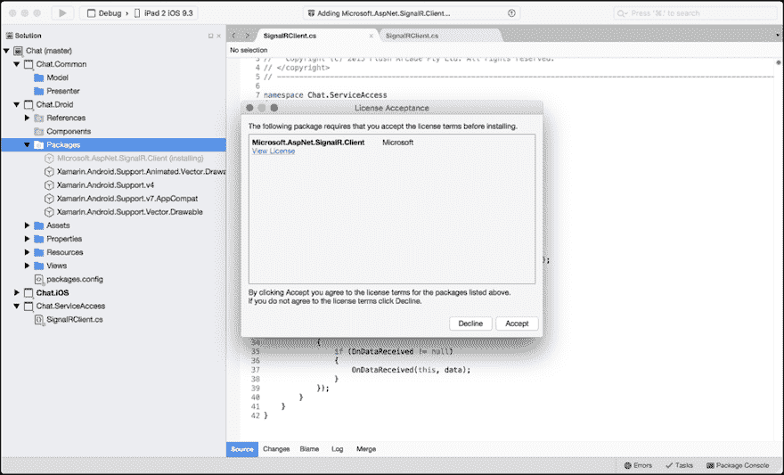

如果你尝试使用 Xamarin.iOS 1.0 添加 SignalR 版本 2.2.0 的 NuGet 包，该包将无法添加。如果出现这种情况，请访问以下链接，并将`lib`文件夹中的正确`.dll`文件添加到每个平台项目的引用中：[`components.xamarin.com/auth?redirect_to=%2fdownload%2fsignalr`](https://components.xamarin.com/auth?redirect_to=%2fdownload%2fsignalr)。

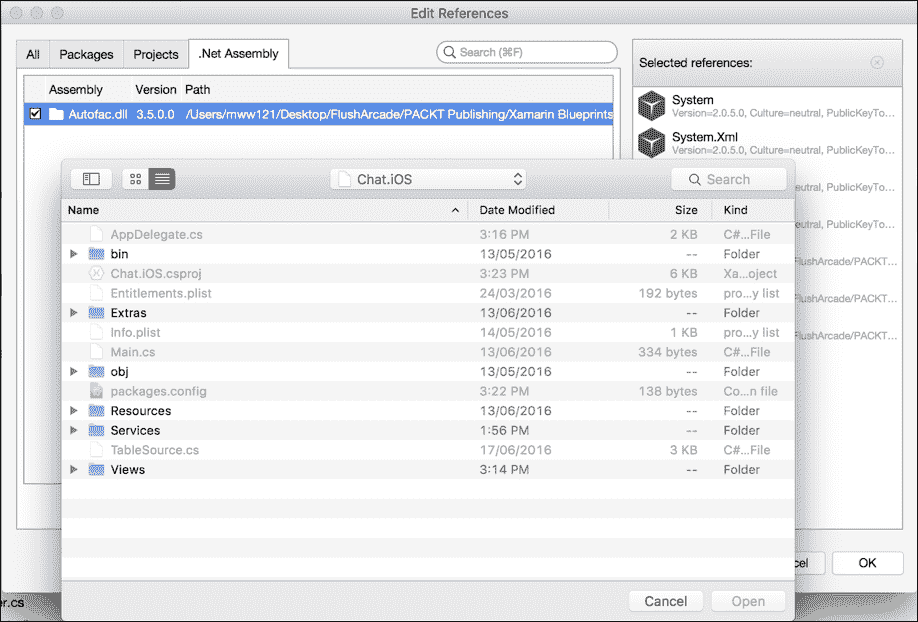

### 提示

为了正确添加引用，右键单击每个项目的**引用**文件夹，点击**.Net 程序集**选项卡，然后点击**浏览**按钮添加`.dll`文件（`Microsoft.AspNet.SignalR.Client`、`System.Net.Http.Extensions`和`System.Net.Http.Primitives`）。

对于每个平台项目，我们还需要从 NuGet 添加`Json.Net`包，然后右键单击**引用**，点击**所有**选项卡，并选择**System.Net**和**System.Net.Http**。

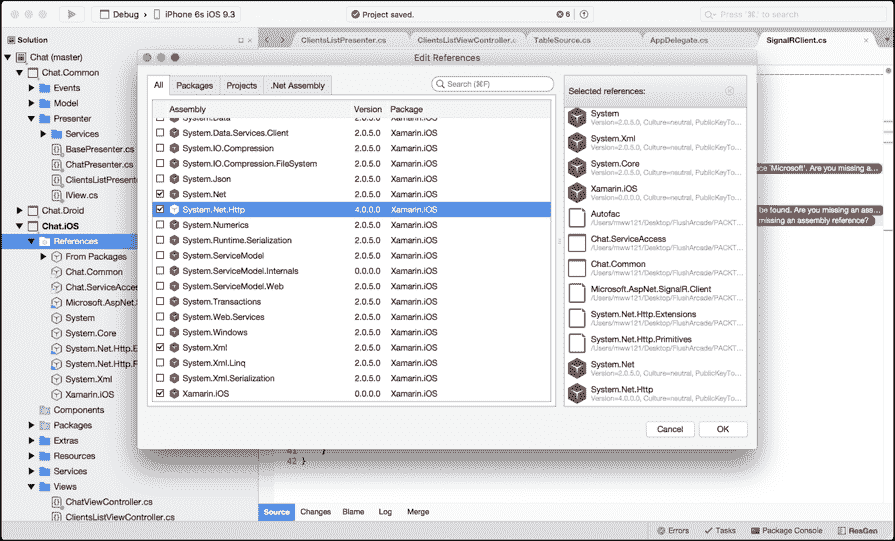

既然我们已经配置了**SignalR**，让我们继续构建`WebApiAccess`层。

## 构建 WebApiAccess 层

我们的`WebApiAccess`对象将被映射到服务器上的`AccountController`。让我们添加一个名为`WebApiAccess.cs`的新文件，并实现`LoginAsync`函数：

```cs

public class WebApiAccess
     {
         private string _baseAddress = "http://{IP Address}:{Port}/";
         public async Task<bool> LoginAsync(string name, string password,
         CancellationToken? cancellationToken = null)
         {
             var httpMessage = new HttpRequestMessage(HttpMethod.Post,
             new Uri(_baseAddress + "api/Account/Login"))
             {
                 Content = new StringContent(string.Format
                 ("Username={0}&Password={1}", name, password), Encoding.UTF8,
                  "application/x-www-form-urlencoded"),
             };
             var client = new HttpClient();
             var response = await client.SendAsync(httpMessage,
             cancellationToken ?? new CancellationToken(false));
             switch (response.StatusCode)
             {
                 case HttpStatusCode.NotFound:
                     throw new Exception(string.Empty);
             }
             var responseContent = await response.Content.ReadAsStringAsync();
             var loginSuccess = false;
             bool.TryParse(responseContent, out loginSuccess);
             return loginSuccess;
         }
     }  

```

`_baseAddress`属性将与`SignalRHubConnection`地址相同；这是我们服务器链接。在我们的`LoginAsync`函数中，我们首先创建一个新的`HttpRequestMessage`，将其设置为`HttpMethod.Post`。我们还设置了内容为一个新的`StringContent`对象，该对象包含用户名和密码。这条消息用于一个新的`HttpClient`，发送到服务器，并将接收到的响应作为字符串读取并解析为一个新的`bool`对象，以确定登录是否成功。

让我们继续实现访问层的其余部分：

```cs
public async Task<bool> RegisterAsync(string name, string password, CancellationToken? cancellationToken = null)
         {
             var httpMessage = new HttpRequestMessage(HttpMethod.Post,
             new Uri(_baseAddress + "api/Account/Register"))
             {
                 Content = new StringContent(string.Format
                 ("Username={0}&Password={1}", name, password), Encoding.UTF8,
                 "application/x-www-form-urlencoded"),
             };
             var client = new HttpClient();
             var response = await client.SendAsync(httpMessage,
             cancellationToken ?? new CancellationToken(false));
             return response.StatusCode == HttpStatusCode.OK;
         } 

```

`Register`函数与之前非常相似，但我们只检查响应状态码是否为`200(OK)`响应；如果是这样，那么我们已成功注册。

```cs
public async Task<TokenContract> GetTokenAsync(string name, string password, CancellationToken? cancellationToken = null)
         {
             var httpMessage = new HttpRequestMessage(HttpMethod.Post,
             new Uri(_baseAddress + "token"))
             {
                 Content = new StringContent(string.Format
                 ("Username={0}&Password={1}&grant_type=password", name,
                 password), Encoding.UTF8, "application/x-www-form-urlencoded"),
             };
             var client = new HttpClient();
             var response = await client.SendAsync(httpMessage,
             cancellationToken ?? new CancellationToken(false));
             switch (response.StatusCode)
             {
                 case HttpStatusCode.NotFound:
                     throw new Exception(string.Empty);
             }
             var tokenJson = await response.Content.ReadAsStringAsync();
             return JsonConvert.DeserializeObject<TokenContract>(tokenJson);
            }
```

`GetTokenAsync`函数负责从 OAuth 端点（`/token`）检索访问令牌。JSON 响应将是`TokenContract`类型；让我们继续将此对象添加到`Chat.ServiceAccess`项目中。在`Web`文件夹内创建一个名为`Contracts`的新文件夹，添加一个名为`TokenContract.cs`的新文件，并实现以下内容：

```cs
public class TokenContract
     {
         [JsonProperty("access_token")]
         public string AccessToken { get; set; }
         [JsonProperty("token_type")]
         public string TokenType { get; set; }
         [JsonProperty("expires_in")]
         public int ExpiresIn { get; set; }
         [JsonProperty("userName")]
         public string Username { get; set; }
         [JsonProperty(".issued")]
         public string IssuedAt { get; set; }
         [JsonProperty(".expires")]
         public string ExpiresAt { get; set; }
     }  

```

注意到`JsonProperty`属性吗？

我们可以将 JSON 对象中的属性映射到类的其他命名变量中。

现在是最后的 Web API 函数`GetAllConnectedUsersAsync`。当用户首次登录时，将调用此函数。我们需要同时进行 API 调用和与**SignalRClient**的实时更新，以跟踪当前连接的客户端，因为当新用户登录时，服务器将在所有其他客户端上调用`displayMessage`。即使我们调用`displayMessage`在`Clients.All`（这是对任何**SignalR Hub**上所有连接客户端的引用），新连接的客户端也不会出现在客户端列表中，因为连接存在轻微的延迟。

### 小贴士

这种轻微的延迟是我们无法控制的；只有有时新连接的客户端才会通过`HubProxy`事件接收到更新后的列表。因此，为了使事情更加可靠，我们在 API 访问层添加了这个更新。

让我们为 `GetAllConnectedUsersAsync` 添加最终的 Web API 函数。此函数将反序列化一个表示连接客户端列表的字符串的 `IEnumerable`，来自 **ChatHub**：

```cs
public async Task<IEnumerable<string>>
 GetAllConnectedUsersAsync(CancellationToken? cancellationToken = null)
         {
             var httpMessage = new HttpRequestMessage(HttpMethod.Get,
             new Uri(_baseAddress + "api/Account/GetAllConnectedUsers"));
             var client = new HttpClient();
             var response = await client.SendAsync(httpMessage,
             cancellationToken ?? new CancellationToken(false));
             switch (response.StatusCode)
             {
                 case HttpStatusCode.NotFound:
                     throw new Exception(string.Empty);
             }
             var responseContent = await response.Content.ReadAsStringAsync();
             return JsonConvert.DeserializeObject<IEnumerable<string>>
(responseContent);
         }  

```

太好了！我们现在已经有了我们的 Web API 访问层。我们的下一步是开始构建每个演示者所需的每个应用程序状态和导航服务。

## 应用程序状态

在 MVP 中，每个演示者都必须包含当前的应用程序状态。当我们跨不同屏幕时，应用程序数据的持久状态将在整个应用程序的生命周期中保持活跃（这包括搜索结果、下载的 JSON 对象等）。

### 提示

在许多 MVP 应用程序中，应用程序状态将包括一个用于在不同会话之间保存和加载此持久数据的保存和加载服务。作为一个额外的学习活动，尝试实现一个名为 `IApplicationStateService` 的新服务。这个服务将负责将 `ApplicationState` 对象本地保存到您的设备上。

太棒了！现在让我们添加另一个名为 `ApplicationState.cs` 的文件，并实现以下内容：

```cs
public class ApplicationState
     {
         #region Public Properties
         public string AccessToken { get; set; }
         public string Username { get; set; }
         #endregion
     } 

```

没有什么特别的，对吧？

我们在整个应用程序的生命周期中只想有一个此对象的实例，因此我们将基于需要在每个屏幕之间保持活跃的持久数据来构建。

# 设置导航服务

在 MVP 中实现导航服务与我们的 `Xamarin.Forms` 导航服务非常不同。这次我们的导航服务将不会在 IoC 容器中使用；相反，我们将在应用程序启动时在 `AppDelegate` 和 `MainActivity` 类中实例化这些对象之一。由于我们在原生环境中工作，我们还将为每个平台实现一个单独的导航服务，这些服务将共享相同的接口。

让我们从创建共享接口开始。在 `Chat.Common` 文件夹中的 **Presenter** | **Services** 下添加一个新文件，命名为 `INavigationService.cs`，并实现以下内容：

```cs
public interface INavigationService { void PushPresenter(BasePresenter presenter); } 

```

## 构建 iOS 导航服务

让我们从构建 iOS 导航服务开始。在 `Chat.iOS` 项目中添加一个名为 `Services` 的新文件夹，创建一个名为 `NavigationService.cs` 的新文件，并实现以下内容：

```cs
public class NavigationService : INavigationService
    {
         #region Private Properties
         private UINavigationController _navigationController;
         #endregion
         #region Constructors
         public NavigationService(UINavigationController navigationController)
         {
             _navigationController = navigationController;
         }
         #endregion
         #region INavigationService implementation
         public void PushPresenter(BasePresenter presenter)
         {
             if (presenter is LoginPresenter)
             {
                 var viewController = new LoginViewController
                 (presenter as LoginPresenter);
                 _navigationController.PushViewController(viewController, true);
             }

        }

        public void PopPresenter(bool animated)
         {
           _navigationController.PopViewController(animated);
         }

         #endregion
     }  

```

当我们实例化此对象时，我们总是想传递分配给我们在 `AppDelegate` 中创建的 `UIWindow` 对象的 `RootViewController` 的 `UINavigationController`。我们还必须实现 `Push` 函数，该函数接受一个 `BasePresenter` 对象（任何演示者），我们执行类型检查以确定传递的是哪个演示者，并将相关的 `UIViewController` 推送到导航堆栈中。我们必须始终将演示者传递给新的 `UIViewController`，这样我们就可以将新的视图注册到当前演示者。

## 构建 Android 导航服务

在我们转向 Android 导航服务之前，我们必须添加一个额外的类来在当前活动、当前演示者和当前上下文中保持持久状态。添加一个名为`Application.cs`的新文件，并实现以下内容：

```cs
[Application]
     public class ChatApplication : Application
     {
         #region Public Properties
         public object Presenter
         {
             get;
             set;
         }
         public Activity CurrentActivity
         {
             get;
             set;
         }
         #endregion
         #region Constructors
         public ChatApplication()
             : base()
         {
         }
         public ChatApplication(IntPtr javaReference,
         JniHandleOwnership transfer)
             : base(javaReference, transfer)
         {
         }
         #endregion
         #region Public Methods
         public static ChatApplication GetApplication(Context context)
         {
             return (ChatApplication)context.ApplicationContext;
         }
         #endregion
     }  

```

这个类将扩展 Android 应用程序，因此当我们在其他部分的应用程序中引用 Android 应用程序类时，我们将引用额外的持久对象。

现在让我们实现 Android 导航服务。在 Android 项目中添加一个名为`Services`的新文件夹，添加一个名为`NavigationService.cs`的新文件，并实现以下内容：

```cs
public class NavigationService : INavigationService
     {
         private ChatApplication _application;
         public NavigationService(ChatApplication application)
         {
             _application = application;
         }
         public void PushPresenter(BasePresenter presenter)
         {
             var oldPresenter = _application.Presenter as BasePresenter;
             if (presenter != oldPresenter)
             {
                 _application.Presenter = presenter;
                 Intent intent = null;
                 if (presenter is LoginPresenter)
                 {
                     intent = new Intent(_application.CurrentActivity,
                     typeof(LoginActivity));
                 }
                 if (intent != null)
                 {
                     _application.CurrentActivity.StartActivity(intent);
                 }
             }
         }
         public void PopPresenter(bool animated)
         {
             _application.CurrentActivity.Finish();
         }  
    }  

```

在构造函数中，我们传入`Application`对象，并将其作为私有变量存储在导航服务中。`Push`函数每次我们向堆栈中推送一个新的`Activity`时都需要`Application`，因为我们需要当前活动引用来从`Application`对象中启动新的意图。

现在我们已经有了导航服务和应用程序状态，让我们开始构建 iOS 的用户界面。

## 构建 iOS 界面

由于我们并不真正知道每个屏幕的用户界面将如何看起来，我们无法在我们的演示者中定义逻辑。所以让我们大致谈谈用户界面将如何看起来。

### 小贴士

在我们转向项目的 UI 层之前，我们通常应该有屏幕原型。

我们的应用程序中有三个屏幕，其中一个将是一个列表，显示服务器上**ChatHub**上所有连接的客户端。用户可以从列表中选择这个用户；当用户从列表中选择另一个客户端时，这个客户端应该收到一条请求权限的消息，以开始聊天对话。当用户接受时，这将转到另一个屏幕，显示典型的聊天对话，与任何其他短信应用程序（两侧的语音气泡）类似。以下图表是三个屏幕和工作流程的快速原型。我们看到的是第一个屏幕显示登录屏幕，然后是另一个显示连接客户端的列表，最后是显示两个连接客户端之间对话的屏幕。

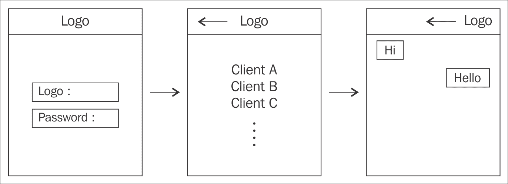

太棒了！现在我们已经有了关于屏幕外观的初步想法，让我们来谈谈第一个可以分享的屏幕背后的逻辑。我们有一个屏幕，包含两个输入框，用于输入用户名和密码。这个屏幕将能够在我们 Web API 上执行登录和注册操作，因此我们需要为每个操作提供一个按钮。如果我们登录成功，这将把列表页面推送到导航堆栈中。

让我们考虑一个跨平台的方法；我们在这里可以共享什么？

+   Web API 层

+   **事件处理器**用于处理登录和注册的点击事件

+   导航服务用于处理导航堆栈上的推送/弹出

我们对第一个屏幕背后的逻辑有一个大致的了解；让我们构建我们的第一个**演示者**。创建两个新的文件，分别命名为`BasePresenter.cs`和`IView.cs`。我们将从`IView`类开始：

```cs
public interface IView
  {
    void SetMessage(string message);
    bool IsInProgress
      {
         get;
         set;
      }
  } 

```

我们希望所有屏幕都有一个`IsInProgress`变量，如果任何屏幕正在加载或处理，我们可以向用户显示加载活动。`SetMessage`函数用于通过警告对话框向用户显示任何错误。

现在对于`BasePresenter`，这是一个抽象类，将被用于所有演示者。所有演示者都需要`ApplicationState`、`INavigationService`和`SignalRClient`。在整个应用程序中，每个屏幕都需要从`SignalRClient`接收事件才能正常工作，因此我们可以将其引入`BasePresenter`对象。我们已经创建了两个`EventHandlers`；这些是基于通过`SignalRClient`上的**hub 代理**接收到的数据触发的。如果我们收到一个**客户端**列表，我们将触发`ConnectedClientsUpdated`事件。如果我们收到一个`string`，我们将触发`ChatReceived`事件，这样我们实际上可以通过`BasePresenter`类控制所有`SignalR`数据，并将特定数据类型通道到特定事件，以便我们的视图进行注册。我们还有一个`WebApiAccess`对象用于访问 Web API，以及一个字符串用于在登录成功时保存访问令牌：

```cs
public abstract class BasePresenter
     {
         #region Private Properties
         private IDictionary<string, Action<string>> _signalREvents;
         #endregion
         #region Protected Properties
         protected INavigationService _navigationService;
         protected ApplicationState _state;
         protected SignalRClient _signalRClient;
         protected WebApiAccess _webApiAccess;
         protected string _accessToken;
         #endregion

         #region Events
         public event EventHandler<ConnectedClientsUpdatedEventArgs>
         ConnectedClientsUpdated;
         public event EventHandler<ChatEventArgs> ChatReceived;
         #endregion 
 } 

```

# 处理 Hub 代理回调

让我们把注意力转向`SignalRClient`；我们创建了一个`EventHandler`，每当从**Hub**接收到数据时都会触发。`BasePresenter`将负责处理从该`EventHandler`接收到的数据：

```cs
         #region Constructors
         public BasePresenter()
         {
             _webApiAccess = new WebApiAccess();
             _signalREvents = new Dictionary<string, Action<string>>()
             {
                 {"clients", (data) =>
                      {
                         var list = JsonConvert.DeserializeObject<IEnumerable<string>>(data);
                         if (ConnectedClientsUpdated != null)
                         {
                             ConnectedClientsUpdated(this, new ConnectedClientsUpdatedEventArgs(list.Select(x => new Client
                             {
                                 Username = x,
                             })));
                         }
                     }
                 },
                 {"chat", (data) =>
                      {
                         if (ChatReceived != null)
                         {
                             ChatReceived(this, new ChatEventArgs(data));
                         }
                     }
                 },
             };
         }
         #endregion  
         #region Protected Methods
         protected void HandleSignalRDataReceived(object sender, Tuple<string, string> e)
         {
             _signalREventse.Item1;
         }
         #endregion
```

### 提示

私有字典`_signalREvents`用于代替 switch 语句。

每次从 SignalRClient 的`OnDataReceived`事件接收到的`Tuple`，第一个字符串将是匹配字典中索引`Action<string>`的键。`Tuple`中的另一个字符串是数据字符串（要么是`HashSet<string>`的序列化 JSON，要么是表示聊天消息的字符串），它作为我们的`Action<string>`的输入参数传递，然后，从这个输入参数中，我们将创建用于指定事件的正确参数。

### 注意

我们可以将`view`对象进一步抽象到`BasePresenter`中，因为每个演示者都需要一个`view`，但由于每个视图逻辑都是独立的，将这种逻辑集中在一个区域是非常困难的。如果多个视图具有类似的行为，这种需求就会出现。然后我们可以将这些区域抽象到`BasePresenter`中。

但等等！你可能已经注意到，我们正在将两种类型的参数传递给每个`EventHandler`。在`Chat.Common`项目的`Events`文件夹中添加一个新的文件，命名为`ConnectedClientsUpdatedEventArgs.cs`，并实现以下内容：

```cs
public class ConnectedClientsUpdatedEventArgs : EventArgs
     {
         public IList<Client> ConnectedClients { private set; get;
     }
         public ConnectedClientsUpdatedEventArgs(IEnumerable<Client> connectedClients)
         {
             ConnectedClients = new List<Client>();
             foreach (var client in connectedClients)
             {
                 ConnectedClients.Add(client);
             }
         }
     } 

```

我们还需要另一个名为`ChatEventArgs.cs`的文件。将其添加到`Events`文件夹中，并实现以下内容：

```cs
public class ChatEventArgs : EventArgs
     {
         public string Message { private set; get;
     }
         public ChatEventArgs(string message)
         {
             Message = message;
         }
     } 

```

此对象是每个聊天消息接收到的消息的包装器。现在，我们已经准备好实现我们的第一个展示者对象。

# 实现登录展示者（LoginPresenter）

创建一个名为`LoginPresenter.cs`的新文件，将其添加到`Chat.Common`项目中的`Presenter`文件夹，并实现以下内容：

```cs
public class LoginPresenter : BasePresenter
     {
         #region Private Properties
         private ILoginView _view;
         #endregion
         #region IClientsListView
         public interface ILoginView : IView
         {
             event EventHandler<Tuple<string, string>> Login;
             event EventHandler<Tuple<string, string>> Register;
         }
         #endregion
         #region Constructors
         public LoginPresenter(ApplicationState state, INavigationService navigationService)
         {
             _navigationService = navigationService;
             _state = state;
             _webApiAccess = new WebApiAccess();
         }
         #endregion

#region Public Methods
         public void SetView(ILoginView view)
         {
             _view = view;
             _view.Login -= HandleLogin;
             _view.Login += HandleLogin;
             _view.Register -= HandleRegister;
             _view.Register += HandleRegister;
         }
         #endregion
     }  
```

我们的`LoginPresenter`包含一个新的`ILoginView`接口，该接口为登录屏幕上出现的两个按钮提供了两个新的事件处理器。我们还包含了一个新的`WebApiAccess`对象，因为我们将在 Web API 上执行登录和注册操作。我们还需要另一个名为`SetView`的函数，这个函数将接受用户界面对象并注册`ILoginView`接口中指定的任何`EventHandlers`。现在让我们添加处理登录的函数：

```cs
         #region Private Methods
         private async void HandleLogin(object sender, Tuple<string, string> user)
         {
             if (!_view.IsInProgress)
             {
                 _state.Username = user.Item1;
                 _view.IsInProgress = true;
                 if (user.Item2.Length >= 6)
                 {
                     var loggedIn = await _webApiAccess.LoginAsync(user.Item1, user.Item2, CancellationToken.None);
                     if (loggedIn)
                     {
                         var tokenContract = await _webApiAccess.GetTokenAsync(user.Item1, user.Item2, CancellationToken.None);
                         if (!string.IsNullOrEmpty(tokenContract.AccessToken))
                         {
                             var presenter = new ClientsListPresenter(_state, _navigationService, tokenContract.AccessToken);
                             _navigationService.PushPresenter(presenter);
                         }
                         else
                         {
                             _view.SetErrorMessage("Failed to register user.");
                         }
                     }
                     else
                     {
                         _view.SetErrorMessage("Invalid username or password.");
                     }
                 }
                 else
                 {
                     _view.SetErrorMessage("Password must be at least 6 characters.");
                 }
                 _view.IsInProgress = false;
             }
         } 

```

`HandleLogin`函数将首先检查屏幕是否正在从另一个登录操作中继续进行；我们想要确保在任何时候只能发生一次登录或注册。首先，我们调用`LoginAsync`并检查用户是否存在于`UserManager`中，然后我们调用`GetTokenAsync`函数来检索将用于我们的`HubConnection`的访问令牌。如果两者都成功，我们使用`NavigationService`将`ClientsListViewController`推入。如果任一失败，我们使用`SetErrorMessage`函数来显示错误。

### 注意

我们通过传递给`PushPresenter`/ `PopPresenter`函数的展示者类型来控制导航堆栈。

现在让我们添加处理注册的函数：

```cs
private async void HandleRegister(object sender, Tuple<string, string> user)
         {
             // make sure only once can we be registering at any one time
             if (!_view.IsInProgress)
             {
                 _state.Username = user.Item1;
                 _view.IsInProgress = true;
                 if (user.Item2.Length >= 6)
                 {
                     var registerSuccess = await _webApiAccess.RegisterAsync(user.Item1, user.Item2, CancellationToken.None);
                     if (registerSuccess)
                     {
                         _view.SetErrorMessage("User successfully registered.");
                     }
                 }
                 else
                 {
                     _view.SetErrorMessage("Password must be at least 6 characters.");
                 }
                 _view.IsInProgress = false;
             }
         }
         #endregion
```

与`LoginAsync`非常相似，但我们调用`RegisterAsync`并简单地等待调用完成并检查我们是否有 HTTP 状态码`200 (OK)`。

# 创建展示者和视图之间的连接

现在，我们转向用户界面设计，并展示我们如何设置展示者之间的链接。开发用户界面与为 iOS 和 Android 本地开发没有区别；与 MVP 的不同之处在于，我们在构造函数中初始化一个带有其相关展示者的视图。

让我们从在`Chat.iOS`项目中添加一个名为`Views`的新文件夹开始，添加一个名为`LoginViewController.cs`的新文件，并实现以下内容：

```cs
public class LoginViewController : UIViewController, LoginPresenter.ILoginView
     {
         #region Private Properties
         private bool _isInProgress = false;
         private LoginPresenter _presenter;
         private UITextField _loginTextField;
         private UITextField _passwordTextField;
         private UIActivityIndicatorView _activityIndicatorView;
         #endregion
         #region Constructors
         public LoginViewController(LoginPresenter presenter)
         {
             _presenter = presenter;
         }
         #endregion
    } 

```

我们从私有属性和构造函数开始，其中我们传递一个从`AppDelegate`创建的新`LoginPresenter`对象作为起始展示者。两个文本字段用于用户名和密码输入。我们将它们作为局部变量，因为我们将在多个函数中访问每个实例。我们还有一个`UIActivityIndicatorView`用于在登录和注册时显示进度。

让我们继续添加`ViewDidLoad`函数。我们将分几个部分来实现这个函数。首先，我们将设置展示者的视图并初始化所有 UI 元素并将它们添加到`View`中：

```cs
#region Public Methods
         public override void ViewDidLoad()
         {
             base.ViewDidLoad();
             View.BackgroundColor = UIColor.White;
             _presenter.SetView(this);
             var width = View.Bounds.Width;
             var height = View.Bounds.Height;
             Title = "Welcome";
             var titleLabel = new UILabel()
             {
                 TranslatesAutoresizingMaskIntoConstraints = false,
                 Text = "Chat",
                 Font = UIFont.FromName("Helvetica-Bold", 22),
                 TextAlignment = UITextAlignment.Center
             };
             _activityIndicatorView = new UIActivityIndicatorView()
             {
                 TranslatesAutoresizingMaskIntoConstraints = false,
                 Color = UIColor.Black
             };
             var descriptionLabel = new UILabel()
             {
                 TranslatesAutoresizingMaskIntoConstraints = false,
                 Text = "Enter your login name to join the chat room.",
                 Font = UIFont.FromName("Helvetica", 18),
                 TextAlignment = UITextAlignment.Center
             };
             _loginTextField = new UITextField()
             {
                 TranslatesAutoresizingMaskIntoConstraints = false,
                 Placeholder = "Username",
                 Font = UIFont.FromName("Helvetica", 18),
                 BackgroundColor = UIColor.Clear.FromHex("#DFE4E6"),
                 TextAlignment = UITextAlignment.Center
             };
             _passwordTextField = new UITextField()
             {
                 TranslatesAutoresizingMaskIntoConstraints = false,
                 Placeholder = "Password",
                 Font = UIFont.FromName("Helvetica", 18),
                 BackgroundColor = UIColor.Clear.FromHex("#DFE4E6"),
                 TextAlignment = UITextAlignment.Center
             };
             var buttonView = new UIView()
             {
                 TranslatesAutoresizingMaskIntoConstraints = false
             };
             var loginButton = new UIButton(UIButtonType.RoundedRect)
             {
                 TranslatesAutoresizingMaskIntoConstraints = false
             };
             loginButton.SetTitle("Login", UIControlState.Normal);
             loginButton.TouchUpInside += (sender, e) =>
                  Login(this, new Tuple<string, string>(_loginTextField.Text, _passwordTextField.Text));
             var registerButton = new UIButton(UIButtonType.RoundedRect)
             {
                 TranslatesAutoresizingMaskIntoConstraints = false
             };
             registerButton.SetTitle("Register", UIControlState.Normal);
             registerButton.TouchUpInside += (sender, e) =>
                 Register(this, new Tuple<string, string>(_loginTextField?.Text, _passwordTextField?.Text));
             Add(titleLabel);
             Add(descriptionLabel);
             Add(_activityIndicatorView);
             Add(_loginTextField);
             Add(_passwordTextField);
             Add(buttonView);
             buttonView.Add(loginButton);
             buttonView.Add(registerButton);
         }
         #endregion 

```

这是一段很大的代码块，但我们正在创建很多 UI 元素。所有元素都将 `TranslatesAutoresizingMaskIntoConstraints` 设置为 `false`，以便进行 `**NSLayout**`。看看我们如何将 `ILoginView` 实现与登录和 `RegisterEventHandlers` 集成，因为它们连接到每个按钮的 `TouchUpInside` 事件。

现在，让我们开始构建 `NSLayoutConstraints`。将以下内容添加到 `ViewDidLoad` 函数的底部：

### 小贴士

我们正在使用之前章节中使用的 `DictionaryViews` 对象。创建一个名为 `Extras` 的新文件夹，并将此对象添加到 `Extras` 文件夹中。

```cs
var views = new DictionaryViews()
             {
                 {"titleLabel", titleLabel},
                 {"descriptionLabel", descriptionLabel},
                 {"loginTextField", _loginTextField},
                 {"passwordTextField", _passwordTextField},
                 {"loginButton", loginButton},
                 {"registerButton", registerButton},
                 {"activityIndicatorView", _activityIndicatorView},
                 {"buttonView", buttonView}
             };
             buttonView.AddConstraints(
                 NSLayoutConstraint.FromVisualFormat("V:|-[registerButton]-|", NSLayoutFormatOptions.DirectionLeftToRight, null, views)
                 .Concat(NSLayoutConstraint.FromVisualFormat("V:|-[loginButton]-|", NSLayoutFormatOptions.DirectionLeftToRight, null, views))
                 .Concat(NSLayoutConstraint.FromVisualFormat("H:|-[registerButton]-30-[loginButton]-|", NSLayoutFormatOptions.DirectionLeftToRight, null, views))
                 .ToArray());
             View.AddConstraints(
                 NSLayoutConstraint.FromVisualFormat("V:|-100-[titleLabel(50)]-[descriptionLabel(30)]-10-[loginTextField(30)]-10-[passwordTextField(30)]-10-[buttonView]", NSLayoutFormatOptions.DirectionLeftToRight, null, views)
                 .Concat(NSLayoutConstraint.FromVisualFormat("V:|-100-[activityIndicatorView(50)]-[descriptionLabel(30)]-10-[loginTextField(30)]-10-[passwordTextField(30)]-10-[buttonView]", NSLayoutFormatOptions.DirectionLeftToRight, null, views))
                 .Concat(NSLayoutConstraint.FromVisualFormat("H:|-10-[titleLabel]-10-|", NSLayoutFormatOptions.AlignAllTop, null, views))
                 .Concat(NSLayoutConstraint.FromVisualFormat("H:[activityIndicatorView(30)]-10-|", NSLayoutFormatOptions.AlignAllTop, null, views))
                 .Concat(NSLayoutConstraint.FromVisualFormat("H:|-10-[descriptionLabel]-10-|", NSLayoutFormatOptions.AlignAllTop, null, views))
                 .Concat(NSLayoutConstraint.FromVisualFormat("H:|-30-[loginTextField]-30-|", NSLayoutFormatOptions.AlignAllTop, null, views))
                 .Concat(NSLayoutConstraint.FromVisualFormat("H:|-30-[passwordTextField]-30-|", NSLayoutFormatOptions.AlignAllTop, null, views))
                 .Concat(new[] { NSLayoutConstraint.Create(buttonView, NSLayoutAttribute.CenterX, NSLayoutRelation.Equal, View, NSLayoutAttribute.CenterX, 1, 1)
 })
                 .ToArray());
```

约束将 `buttonView` 定位于屏幕中心水平位置；每个按钮内部将水平并排放置。其余布局非常直观。我们只是将剩余元素垂直堆叠在页面底部。`UIActivityIndicatorView` 将位于屏幕右上角，靠近 `TitleLabel`。当我们尝试运行应用程序时，其余布局将更加合理。

最后，我们添加剩余的界面实现；我们需要 `ILoginView` 接口中的登录和 `Register`。我们还需要 `IsInProgress` 布尔值和 `SetErrorMessage` 函数；这将创建一个新的 `UIAlertView` 显示错误消息。我们还重写了 `IsInProgress` 的获取和设置，以控制 `UIActivityIndicatorView` 的开始和停止动画：

```cs
         #region ILoginView implementation
         public event EventHandler<Tuple<string, string>> Login;
         public event EventHandler<Tuple<string, string>> Register;
         #endregion
         #region IView implementation

         public void SetErrorMessage(string message)
         {
             var alert = new UIAlertView()
             {
                 Title = "Chat",
                 Message = message
             };
             alert.AddButton("OK");
             alert.Show();
         }
         public bool IsInProgress
          {
              get
             {
                 return _isInProgress;
             }
             set
             {
                 if (value == _isInProgress)
                 {
                     return;
                 }
                 // we control the activity view when we set 'IsInProgress'
                 if (value)
                 {
                     _activityIndicatorView.StartAnimating();
                 }
                 else
                 {
                     _activityIndicatorView.StopAnimating();
                 }
                 _isInProgress = value;
             }
         }
         #endregion 

```

我们的第一个视图和演示者之间的链接不如 `Xamarin.Forms` 中的 MVVM **绑定上下文** 清晰，但优点是没有在本地用户界面和要显示的数据之间有中间渲染层。

# 构建登录活动

让我们回到 `Chat.Droid` 项目；在我们创建 `Activity` 之前，我们需要使用一个新的 XML 表单创建布局。在 **资源** | **布局** 中添加一个名为 `LoginView.xml` 的新文件，并实现以下内容：

```cs

<?xml version="1.0" encoding="utf-8"?>
 <LinearLayout 
     android:id="@+id/tableLayout"
     android:layout_width="fill_parent"
     android:layout_height="fill_parent"
     android:orientation="vertical"
     android:gravity="center"
     android:background="#FFFFFF">
     <TextView
         android:id="@+id/titleTextView"
         android:text="Chat"
         android:fontFamily="helvetica"
         android:textStyle="bold"
         android:textSize="22dp"
         android:textColor="#000000"
         android:paddingBottom="20dp"
         android:layout_width="wrap_content"
         android:layout_height="wrap_content" />
     <TextView
         android:id="@+id/descriptionTextView"
         android:text="Enter your login name to join the chat room."
         android:fontFamily="helvetica"
         android:textColor="#000000"
         android:paddingBottom="20dp"
         android:layout_centerInParent="true"
         android:layout_width="wrap_content"
         android:layout_height="wrap_content" />
     <EditText
         android:id="@+id/usernameField"
         android:textColor="#000000"
         android:layout_width="fill_parent"
         android:layout_height="50dp"
         android:paddingBottom="20dp"
         android:hint="Enter Username" />
     <EditText
         android:id="@+id/passwordField"
         android:textColor="#000000"
         android:layout_width="fill_parent"
         android:layout_height="50dp"
         android:hint="Enter Password" />
     <LinearLayout
         android:id="@+id/tableLayout"
         android:gravity="center"
         android:layout_width="fill_parent"
         android:layout_height="150dp"
         android:orientation="horizontal"
         android:background="#FFFFFF">
         <Button
             android:id="@+id/registerButton"
             android:text="Register"
             android:textColor="#417BB5"
             android:background="@android:color/transparent"
             android:layout_height="50dp"
             android:layout_width="100dp" />
         <Button
             android:id="@+id/loginButton"
             android:text="Login"
             android:textColor="#417BB5"
             android:background="@android:color/transparent"
             android:paddingLeft="20dp"
             android:layout_height="50dp"
             android:layout_width="100dp" />
     </LinearLayout>
 </LinearLayout> 

```

`XMLlayout` 将页面垂直堆叠，两个按钮并排放置。

在 `Xamarin.Studio` 中快速检查布局的方法是点击 **设计师** 窗口：

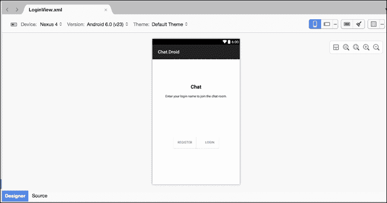

现在，让我们创建一个名为 `Views` 的新文件夹，添加一个名为 `LoginActivity.cs` 的新文件，并实现第一个部分：

```cs

[Activity(MainLauncher = true, Label = "Chat", ScreenOrientation = ScreenOrientation.Portrait)]
     public class LoginActivity : Activity, LoginPresenter.ILoginView
     {
         #region Private Properties
         private bool _isInProgress = false;
         private bool _dialogShown = false;
         private LoginPresenter _presenter;
         private EditText _loginField;
         private EditText _passwordField;
         private ProgressDialog progressDialog;
         #endregion
         #region Protected Methods
         protected override void OnCreate(Bundle bundle)
         {
             base.OnCreate(bundle);
             SetContentView(Resource.Layout.LoginView);
             progressDialog = new ProgressDialog(this);
             progressDialog.SetMessage("Loading...");
             progressDialog.SetCancelable(false);
             _loginField = FindViewById<EditText>(Resource.Id.usernameField);
             _passwordField = FindViewById<EditText>(Resource.Id.passwordField);
             var registerButton = FindViewById<Button>(Resource.Id.registerButton);
             registerButton.Touch += (sender, e) =>
                 Register(this, new Tuple<string, string>(_loginField.Text, _passwordField.Text));
             var loginButton = FindViewById<Button>(Resource.Id.loginButton);
             loginButton.Touch += (sender, e) =>
                 Login(this, new Tuple<string, string>(_loginField.Text, _passwordField.Text));
             var app = ChatApplication.GetApplication(this);
             var state = new ApplicationState();
             _presenter = new LoginPresenter(state, new NavigationService(app));
             _presenter.SetView(this);
             app.CurrentActivity = this;
         }
     #endregion 

```

由于我们已经在演示者中有了 UI 逻辑，因此构建 `LoginActivity` 的界面要容易得多，因为所有答案都在演示者中。这是使用 MVP 模式进行代码共享的优势。

在我们的 `OnCreate()` 函数中，我们将首先将 `ContentView` 设置为我们之前创建的 `XMLlayout`。然后我们将按钮的 `Touch` 事件注册到 `ILoginView` 接口，这与 iOS 版本的 `TouchUpInside` 事件非常相似。然后我们从 `GetApplication` 函数中检索应用程序**。**我们还创建了一个 `ApplicationState` 实例，并创建了一个新的 `LoginPresenter`。

我们还必须添加`ILoginView`和`IView`接口的要求。`SetErrorMessage`将使用`AlertDialog.Builder`框架创建与 iOS 版本相同的弹出窗口。我们只为此对话框设置一个按钮，当我们按下****OK**时，它将简单地关闭对话框。

```cs
         #region ILoginView implementation
         public event EventHandler<Tuple<string, string>> Login;
         public event EventHandler<Tuple<string, string>> Register;
         #endregion
         #region IView implementation
         public void SetErrorMessage(string message)
         {
             if (!_dialogShown)
             {
                 _dialogShown = true;
                 AlertDialog.Builder builder = new AlertDialog.Builder(this);
                 builder
                     .SetTitle("Chat")
                     .SetMessage(message)
                     .SetNeutralButton("Ok", (sender, e) => { _dialogShown = false ;})
                     .Show();
             }
         }
         public bool IsInProgress
         {
             get
             {
                 return _isInProgress;
             }
             set
             {
                 if (value == _isInProgress)
                 {
                     return;
                 }
                 // we control the activity view when we set 'IsInProgress'
                 if (value)
                 {
                     progressDialog.Show();
                 }
                 else
                 {
                     progressDialog.Dismiss();
                 }
                 _isInProgress = value;
             }
         }
         #endregion
     } 

```

看看结构是否与 iOS 完全相同？

我们只需要独立匹配每个平台的 UI 元素。我们活动的最后一部分是`OnResume`函数。此函数将在`Application`中重置`CurrentActivity`：

### 小贴士

每次活动恢复时重置`CurrentActivity`非常重要，否则导航服务不会在正确的`Activity`上推送/弹出。

```cs
protected override void OnResume()
         {
             base.OnResume();
             var app = ChatApplication.GetApplication(this);
             app.CurrentActivity = this;
             if (_presenter != null)
             {
                 _presenter.SetView(this);
             }
         }
         #endregion
```

太棒了！现在我们已经创建了第一个屏幕、演讲者，并将其与导航服务链接起来。让我们回到`Chat.iOS`项目，构建我们应用程序的下一个屏幕。

# 实现客户端列表演讲者

创建一个名为`ClientsListPresenter.cs`的新文件，将其添加到`Chat.Common`项目中的`Presenter`文件夹，并实现以下内容：

```cs

public class ClientsListPresenter : BasePresenter
     {
         #region Private Properties
         private IClientsListView _view;
         #endregion
         #region IClientsListView
         public interface IClientsListView : IView
         {
             event EventHandler<ClientSelectedEventArgs> ClientSelected;
             void NotifyConnectedClientsUpdated(IEnumerable<Client> clients);
         }
         #endregion
         #region Constructors
         public ClientsListPresenter(ApplicationState state, INavigationService navigationService,
                                      string accessToken)
         {
             _navigationService = navigationService;
             _state = state;
             _state.AccessToken = accessToken;
             InitSignalR(accessToken).ConfigureAwait(false);
         }
         #endregion

 }  

```

我们已声明一个新的**IClientsListView**接口，专门针对当前的**UIViewController**（这必须为每个屏幕执行）。它简单地扩展了**IView**接口，并为我们的**UITableView**中的选中项添加了一个额外的事件处理器。然后我们有我们的构造函数，我们必须传递一个**ApplicationState**、**NavigationService**和一个访问令牌。我们还初始化了**SignalRClient**：`ConfigureAwait`函数设置为 false，因为我们不希望等待此任务完成。

现在，我们需要添加另一个名为`SetView`的函数。这将采取用户界面操作对象并注册**IClientsListView**接口中指定的任何`EventHandlers`。我们还调用 Web API 以检索连接到**ChatHub**的当前客户端。我们还指定不通过`ConfigureAwait`函数等待此任务。

在每个将响应来自**SignalRClient**实时数据更新的`SetView`中，我们必须重新注册到`OnDataReceived`事件处理器，以便调用正确的演讲者函数`HandleSignalRDataReceived`：

```cs
#region Public Methods public void SetView(IClientsListView view)
         {
             _view = view;
             _signalRClient.OnDataReceived -= HandleSignalRDataReceived;
             _signalRClient.OnDataReceived += HandleSignalRDataReceived;
             _view.ClientSelected -= HandleClientSelected;
             _view.ClientSelected += HandleClientSelected;
             ConnectedClientsUpdated -= HandleConnectedClientsUpdated;
             ConnectedClientsUpdated += HandleConnectedClientsUpdated;
             GetAllConnectedClients().ConfigureAwait(false);
         }

 #endregion 

```

演讲者还可以有与`SetView`函数相反的`ReleaseView`函数。它将负责在屏幕消失时处理事件处理器。这确保了我们不会在之前的任何页面上有事件在它们不可见时执行工作。在`SetView`函数下添加以下内容：

```cs

public void ReleaseView()
         {
             _signalRClient.OnDataReceived -= HandleSignalRDataReceived;
         } 

```

现在让我们添加`Signout`函数。当用户想要从**ChatHub**断开连接（当用户离开**ClientsListViewController**）时，将调用此函数：

```cs
public void Signout()
         {
             _signalRClient.Disconnect();
             _navigationService.PopPresenter(true);
         } 

```

让我们添加两个额外的函数：`HandleClientSelected`将使用**INavigationService**将下一个屏幕推入堆栈，另一个函数`HandleConnectedClientsUpdated`将调用用户界面对象中的本地实现。我们还将使用 Linq 过滤客户列表，包括所有其他客户但排除当前用户：

```cs
#region Private Methods
         private void HandleClientSelected(object sender, ClientSelectedEventArgs e)
         {
             var presenter = new ChatPresenter(_state, _navigationService, e.Client, _signalRClient);
             _navigationService.PushPresenter(presenter);
         }
         private void HandleConnectedClientsUpdated(object sender,
         ConnectedClientsUpdatedEventArgs e)
         {
             _view.NotifyConnectedClientsUpdated(e.ConnectedClients
                                                 .Where(x => !x.Username.ToLower()
                                                 .Contains(_state.Username.ToLower())));
         }
         #endregion 

```

由于我们知道我们需要在`ClientsListView`屏幕上使用**UITableView**，我们需要创建一个**TableSource**对象来显示所有连接到**ChatHub**的客户。我们还需要一个模型对象来存储每个**Client**要显示的数据。

首先，在**Chat.Common**项目中创建一个名为**Model**的新文件夹，添加一个名为`Client.cs`的新文件，并实现以下内容：

```cs
public class Client { public string Username; }  

```

对于每个单元格，我们只将显示一个文本标签，显示连接客户的用户名。现在让我们添加一个名为`ClientsTableSource.cs`的新文件，并从以下内容开始：

```cs

public class ClientsTableSource : UITableViewSource  
{ 
         #region Public Properties 

         public event EventHandler<Client> ItemSelected; 

         #endregion 

         #region Private Properties 

         private List<Client> _clients; 

         string CellIdentifier = "ClientCell"; 

         #endregion 

         #region Constructors 

         public ClientsTableSource () 
         { 
               _clients = new List<Client> (); 
         } 

         #endregion 
} 

```

我们需要一个私有的`List`来存储最新连接的客户，我们的`CellIdentifier`标签设置为`ClientCell`，并且我们有一个`EventHandler`用于处理从`UITableView`中选中的单元格事件。

每当这些事件之一从`TableSource`触发时，我们将在我们的`ClientsListPresenter`演示者中触发事件处理器。现在让我们实现`UITableViewSource`类所需的其余重写方法：

```cs
#region Methods
         public void UpdateClients(IEnumerable<Client> clients)
         {
             foreach (var client in clients)
             {
                 _clients.Add (client);
             }
         }
         public override nint NumberOfSections (UITableView tableView)
         {
             return 1;
         }
         public override nint RowsInSection (UITableView tableview, nint section)
         {
             return _clients.Count;
         }
         public override void RowSelected (UITableView tableView, NSIndexPath indexPath)
         {
             if (ItemSelected != null)
             {
                 ItemSelected (this, _clients[indexPath.Row]);
             }
             tableView.DeselectRow (indexPath, true);
         }
         public override nfloat GetHeightForRow (UITableView tableView, NSIndexPath indexPath)
         {
             return 80;
         }
         public override UITableViewCell GetCell (UITableView tableView, NSIndexPath indexPath)
         {
             UITableViewCell cell = tableView.DequeueReusableCell(CellIdentifier);
             var client = _clients[indexPath.Row];
             if (cell == null)
             {
                  cell = new UITableViewCell(UITableViewCellStyle.Default, CellIdentifier);
              }
             cell.TextLabel.Text = client.Ip;
             return cell;
         }
 #endregion  

```

我们的`GetCell`函数将使用默认的`UITableViewCellStyle`，文本将设置为`Client`对象的用户名。我们的`RowSelected`函数将触发我们的自定义`EventHandlerItemSelected`。我们将在该`EventHandler`上注册一个代理以触发相关的演示者`Event`。最后，我们的`UpdateClients`将在收到客户端计数变化时的代理事件时被调用。

# 创建 ClientListViewController

现在我们将转向用户界面设计，并演示我们如何设置演示者之间的链接。开发用户界面与为 iOS 和 Android 本地开发没有不同；与 MVP 的不同之处在于我们在构造函数中初始化一个带有其相关演示者的视图。

让我们从向`Chat.iOS`项目添加一个名为`Views`的新文件夹开始，添加一个名为`ClientsListViewController.cs`的新文件，并实现以下内容：

```cs
public class ClientsListViewController : UIViewController, ClientsListPresenter.IClientsListView
     {
         #region Private Properties
         private UITableView _tableView;
         private ClientsTableSource _source;
         private ClientsListPresenter _presenter;
         private UIActivityIndicatorView _activityIndicatorView;
         #endregion
         #region Constructors
         public ClientsListViewController(ClientsListPresenter presenter)
         {
             _presenter = presenter;
             _source = new ClientsTableSource();
             _source.ItemSelected += (sender, e) =>
             {
                 if (ClientSelected != null)
                 {
                     ClientSelected(this, new ClientSelectedEventArgs(e));
                 }
             };
         }
         #endregion

   } 

```

注意我们是如何在`UIViewController`的构造函数中传递演示者的？

我们将对添加到导航服务中的每个视图都执行此操作。

在构造函数中，我们还注册了`itemSelected`事件来触发我们的演示者接口事件。让我们添加以下内容：

```cs

#region Public Methods
         public override void ViewDidLoad()
         {
             base.ViewDidLoad();
             // Perform any additional set up after loading the view, typically from a nib.
             UIBarButtonItem backButton = new UIBarButtonItem("< Back", UIBarButtonItemStyle.Bordered, HandleSignout);
             NavigationItem.SetLeftBarButtonItem(backButton, false);
             View.BackgroundColor = UIColor.White;
             _presenter.SetView(this);
             var width = View.Bounds.Width;
             var height = View.Bounds.Height;
             Title = "Clients";
             var titleLabel = new UILabel()
             {
                 TranslatesAutoresizingMaskIntoConstraints = false,
                 Text = "Connected Clients",
                 Font = UIFont.FromName("Helvetica-Bold", 22),
                 TextAlignment = UITextAlignment.Center
             };
             var descriptionLabel = new UILabel()
             {
                 TranslatesAutoresizingMaskIntoConstraints = false,
                 Text = "Select a client you would like to chat with",
                 Font = UIFont.FromName("Helvetica", 18),
                 TextAlignment = UITextAlignment.Center
             };
             _tableView = new UITableView(new CGRect(0, 0, width, height))
             {
                 TranslatesAutoresizingMaskIntoConstraints = false
             };
             _tableView.AutoresizingMask = UIViewAutoresizing.All;
             _tableView.Source = _source;
             Add(titleLabel);
             Add(descriptionLabel);
             Add(_tableView);
             var views = new DictionaryViews()
             {
                 {"titleLabel", titleLabel},
                 {"descriptionLabel", descriptionLabel},
                 {"tableView", _tableView},
             };
             View.AddConstraints(
                 NSLayoutConstraint.FromVisualFormat("V:|-100-[titleLabel(30)]-[descriptionLabel(30)]-[tableView]|", NSLayoutFormatOptions.DirectionLeftToRight, null, views)
                 .Concat(NSLayoutConstraint.FromVisualFormat("H:|[tableView]|", NSLayoutFormatOptions.AlignAllTop, null, views))
                 .Concat(NSLayoutConstraint.FromVisualFormat("H:|-10-[titleLabel]-10-|", NSLayoutFormatOptions.AlignAllTop, null, views))
                 .Concat(NSLayoutConstraint.FromVisualFormat("H:|-10-[descriptionLabel]-10-|", NSLayoutFormatOptions.AlignAllTop, null, views))                 .ToArray());
         }  

#endregion 

```

在 `ViewDidLoad` 函数中，我们总是会调用演示者类上的 `SetView`，并将视图本身传递给演示者。我们还将在这个屏幕上添加另一个小技巧来重写 `navbar` 返回按钮。我们必须创建一个 `UIBarButtonItem`，它将被设置为导航栏的左侧按钮。当我们实例化此项目时，当按下此按钮时将调用 `HandleSignout` 函数。让我们将其添加到 `UIViewController`：

```cs
public async void HandleSignout(object sender, EventArgs e)
         {
             bool accepted = await ShowAlert("Chat", "Would you like to signout?");
             if (accepted)
             {
                 _presenter.Signout();
             }
         }
```

该函数将显示一个警告并等待用户提供响应。在这种情况下，将是 `"是"` 或 `"否"`。我们将添加另一个函数 `ShowAlert()`，该函数将使用 `TaskCompletionSource` 框架来允许我们从 `UIAlertView` 等待响应。

# `TaskCompletionSource` 框架

`ShowAlert` 函数将实例化一个 `TaskCompletionSource` 的新实例，其类型为 `bool`。然后我们使用 `UIApplication.SharedApplication` 在主线程上调用操作，然后返回 `TaskCompletionSource` 的 `Task` 对象。这意味着我们可以等待任务返回。当我们创建 `UIAlertView` 时，我们将设置对话框的 `Clicked` 事件以调用 `TaskCompletionSource` 的 `SetResult` 函数，这样 `Task` 就不会完成，直到这个点击事件发生：

```cs
         public Task<bool> ShowAlert(string title, string message)
         {
             var tcs = new TaskCompletionSource<bool>();
             UIApplication.SharedApplication.InvokeOnMainThread(new Action(() =>
             {
                 UIAlertView alert = new UIAlertView(title, message, null, NSBundle.MainBundle.LocalizedString("Cancel", "Cancel"),
                                     NSBundle.MainBundle.LocalizedString("OK", "OK"));
                 alert.Clicked += (sender, buttonArgs) =>
 tcs.SetResult(buttonArgs.ButtonIndex != alert.CancelButtonIndex);
                 alert.Show();
             }));
             return tcs.Task;
         }

```

现在我们已经重写了返回按钮，当用户尝试在客户端列表屏幕上点击返回以返回登录时，将出现 `UIAlertView`，询问用户是否想要注销（这意味着用户将从 `ChatHub` 断开连接）。如果用户按下 **是**，我们将调用 `ClientsListPresenter` 上的 `Signout` 函数。

现在，让我们回到 `ViewDidLoad` 函数并添加 `NSLayoutConstraints` 以构建屏幕：

```cs
View.AddConstraints(NSLayoutConstraint.FromVisualFormat("V:|-100-[titleLabel(30)]-[descriptionLabel(30)]-[tableView]|", NSLayoutFormatOptions.DirectionLeftToRight, null, views)
                 .Concat(NSLayoutConstraint.FromVisualFormat("H:|[tableView]|", NSLayoutFormatOptions.AlignAllTop, null, views)) 
                .Concat(NSLayoutConstraint.FromVisualFormat("H:|-10-[titleLabel]-10-|", NSLayoutFormatOptions.AlignAllTop, null, views)) 
                .Concat(NSLayoutConstraint.FromVisualFormat("H:|-10-[descriptionLabel]-10-|", NSLayoutFormatOptions.AlignAllTop, null, views))
                 .ToArray());  

```

我们将所有元素垂直堆叠，占据整个屏幕宽度并添加填充。

最后，我们还想添加 `ViewDidUnload` 函数，以便我们可以从 `SignalRClient` 中移除 `OnDataReceived` 事件：

```cs
public override void ViewDidUnload()
         {
             base.ViewDidUnload();
             _presenter.ReleaseView();
         } 

```

# 创建 `ClientsListActivity`

让我们再次回到 `Chat.Droid` 项目。创建一个名为 `Views` 的新文件夹，添加一个名为 `ClientsListView.cs` 的新文件，并实现以下内容：

```cs
[Activity(Label = "Chat Room", Icon = "@drawable/icon", ScreenOrientation = ScreenOrientation.Portrait)]
     public class ClientsListActivity : ListActivity, ClientsListPresenter.IClientsListView
     {
         #region Private Properties
         private ClientsListPresenter _presenter;
         private ClientsListAdapter _adapter;
         private bool _dialogShown = false;
         #endregion
         #region Protected Methods
         protected override void OnCreate(Bundle bundle)
         {
             base.OnCreate(bundle);
             ListView.SetBackgroundColor(Color.White);
              var app = ChatApplication.GetApplication(this);
             app.CurrentActivity = this;
             _presenter = app.Presenter as ClientsListPresenter;
             _presenter.SetView(this);
             _adapter = new ClientsListAdapter(this);
             ListAdapter = _adapter;
         }
         protected override void OnResume()
         {
             base.OnResume();
             var app = ChatApplication.GetApplication(this);
             app.CurrentActivity = this;
             if (_presenter != null)
             {
                 _presenter.SetView(this);
             }
         }    

  #endregion
  }  

```

对于 `ClientsListActivity` 的第一个部分，让我们看看 `OnCreate` 重写方法。我们将从 `ChatApplication` 实例开始，将当前 `Activity` 设置为 `ClientsListView` 活动。然后实例化一个新的 `ClientsListPresenter`，添加状态，并添加一个新的 `NavigationService`。我们还将将演示者的视图对象设置为 `ClientsListView`。最后，我们简单地实例化一个新的 `ClientsListAdapter` 并将其设置为 `Activity` 的 `ListAdapter`，因为我们正在继承 `ListActivity`。我们将有一个与 iOS 不同的布局，只在这个屏幕上显示 `ListView` 以演示 `ListActivity`；因此，我们不需要为这个 `Activity` 的布局创建 `XMLsheet`。

`OnResume` 函数与 `LoginActivity` 相同；我们必须保持向用户显示的当前 `Activity`。我们还想覆盖 `OnPause` 函数，以便在 `ClientsListPresenter` 上调用 `ReleaseView`，这样我们就可以从 `SignalRClient` 的 `OnDataReceived` 属性中移除 `EventHandler`。这确保了当屏幕不可见时，我们不会调用 `HandleSignalRDataReceived`。

```cs
protected override void OnPause()
         {
             base.OnPause();
             if (_presenter != null)
             {
                 _presenter.ReleaseView();
             }
         }  

```

现在我们来添加 `IClientsListView` 和 `IView` 的实现。`NotifyConnectedClientsUpdated` 将会在 `ListAdapter` 上调用 `UpdateClients` 函数，并且我们必须在主线程上传播 `NotifyDataSetChanged`，因为我们正在对 `ListView` 进行数据更改：

```cs
#region IClientsListView implementation
         public event EventHandler<ClientSelectedEventArgs> ClientSelected;
         public void NotifyConnectedClientsUpdated(IEnumerable<Client> clients)
         {
             if (_adapter != null)
             {
                 _adapter.UpdateClients(clients);
                 // perform action on UI thread
                 Application.SynchronizationContext.Post(state =>
                  {
                      _adapter.NotifyDataSetChanged();
                  }, null);
             }
         }
         #endregion
         #region IView implementation
         public void SetErrorMessage(string message)
         {
             if (!_dialogShown)
             {
                 _dialogShown = true;
                 AlertDialog.Builder builder = new AlertDialog.Builder(this);
                 builder
                     .SetTitle("Chat")
                     .SetMessage(message)
                     .SetNeutralButton("Ok", (sender, e) => { _dialogShown = false; })
                     .Show();
             }         }
         public bool IsInProgress { get; set;
 }
         #endregion
```

`SetErrorMessage()` 将会启动一个类似于 iOS 的对话框，使用 `AlertDialog.Builder` 框架。在这种情况下，我们只需要设置原始按钮，因为我们只需要在对话框中有一个按钮。

# 覆盖 `OnBackPressed` 活动

在我们的 iOS 实现中，我们集成了一个覆盖导航返回按钮的功能，所以当用户离开 `ClientListViewController` 时，我们会询问用户是否想要从 `ChatHub` 中注销。我们在这里也将做同样的事情，但是在 Android 平台上。我们将从 `AlertDialog.Builder` 框架构建警报：

```cs
public override void OnBackPressed()
         {
             //Put up the Yes/No message box
             AlertDialog.Builder builder = new AlertDialog.Builder(this);
             builder
                 .SetTitle("Chat")
                 .SetMessage("Would you like to signout?")
                 .SetNegativeButton("No", (sender, e) => { })
                 .SetPositiveButton("Yes", (sender, e) =>
                      {
                          _presenter.Signout();
                     })
                 .Show();
         }
```

我们从实例化一个新的构建器对象开始，该对象必须只接受 `Activity` 上下文作为唯一参数。然后我们设置对话框的标题和消息，并为 `"Yes"` 和 `"No"` 选择设置两个按钮。只有当用户选择 `"Yes"` 时，才会通过调用与 iOS 相同的 `Signout` 来执行操作。

我们这个 `Activity` 的最后一部分是覆盖 `OnListItemClick`。当列表中的某个项目被选中时，我们希望触发接口中指定的 `ClientSelected` 事件，这样我们就可以将此事件逻辑连接到 `ClientsListPresenter`：

```cs
         protected override void OnListItemClick(ListView l, Android.Views.View v, int position, long id)
         {
             var item = _adapter[position];
             if (ClientSelected != null)
             {
                 ClientSelected(this, new ClientSelectedEventArgs(item));
             }
         }
         #endregion  

```

# 构建 `ListAdapter`

在我们构建 `ListAdapter` 之前，我们需要为 **CustomCell** 创建另一个 AXML 表格，向 **Resources** | **layout** 文件夹中添加另一个文件，名为 `CustomCell.xml`，并实现以下内容：

```cs

<?xml version="1.0" encoding="utf-8"?> <LinearLayout 
     android:orientation="horizontal"
     android:layout_width="match_parent"
     android:layout_height="match_parent"
     android:weightSum="4">
     <TextView
         android:id="@+id/username"
         android:layout_width="wrap_content"
         android:layout_height="wrap_content"
         android:layout_weight="1" />
 </LinearLayout> 

```

这是一个另一个简单的布局，其中包含一个包裹在 `LinearLayout` 中的 `TextView`。`TextView` 将显示每个 `Client` 的 `ConnectionId`。

现在我们回到 `ListAdapter`。在 `Views` 文件夹内，添加另一个名为 `ClientsListAdapter.cs` 的文件，并实现以下内容：

```cs
public class ClientsListAdapter : BaseAdapter<Client>
     {
         private List<Client> _clients;
         private Activity _context;
         public ClientsListAdapter(Activity context) : base()
         {
             _context = context;
             _clients = new List<Client>();
         } 
    } 

```

首先，我们只是创建一个新的类，该类继承自 `BaseAdapter` 类，并将其转换为 `Client` 对象。我们还有一个私有的 `List`，它将存储从 `SignalRClient` 获取到的客户端，最后我们有当前的 **Activity 上下文**。现在让我们添加来自 `BaseAdapter` 的所需覆盖函数：

```cs
public override Client this[int position]
         {
             get
             {
                 return _clients[position];
             }
         }
         public override Java.Lang.Object GetItem (int position)
         {
             return null;
         }

         public override long GetItemId(int position)
         {
             return position;
         }
         public override int Count
         {
             get
              {
                  return _clients.Count;
              }
          }

         public override View GetView(int position, View convertView, ViewGroup parent)
         {
             View view = convertView; // re-use an existing view, if one is available
             if (view == null)
             {
                  // otherwise create a new one
                 view = _context.LayoutInflater.Inflate(Resource.Layout.CustomCell, null);
             }
             // set labels
             var connectionIdTextView = view.FindViewById<TextView>
 (Resource.Id.username);
             connectionIdTextView.Text = _clients[position].Username;
             return view;
         }  

```

第一个覆盖是实现对`_clientslist`的索引引用。所有覆盖函数都与我们实现的相同，如第一章中所述，*构建画廊应用程序*。让我们将注意力转向`GetView`函数；我们只是使用`LayoutInflater`框架创建一个新的`CustomCell`布局（这将接受任何 AXML 文件并创建视图的新实例）。

然后，现在我们已经有了我们的新视图，我们将设置`CustomCell`视图中的`TextView`对象的`Text`属性为`Client`对象中的`Username`。

最后，我们的最后一步是添加一个名为`UpdateClients`的另一个函数（如展示者中指定）。这将会简单地接受一个新的`IEnumerable`的**Clients**，并且`List`将会相应地更新：

```cs
public void UpdateClients(IEnumerable<Client> clients)
         {
             foreach (var client in clients)
             {
                 _clients.Add(client);
             }
         }  

```

在展示者类的完全指导下，看看我们是如何快速开发 Android 界面的。

### 小贴士

在我们能够测试与服务器**Hub**的连接之前，我们必须在命令提示符中使用`netsh`对`application.config`和`http.sys`进行更改。遵循第五章中*在本地托管 Web API 项目*的部分，*构建股票列表应用程序*。

你可以尝试测试第一页。启动服务器**Hub**，并观察列表在连接或断开新客户端时更新。在这个例子中，使用多个在不同设备上运行的应用程序实例进行测试是一个很好的测试方法。

# 构建聊天展示者

现在我们转向下一个屏幕；这将是我们聊天窗口，我们将在此窗口中传递连接到服务器**Hub**的不同客户端之间的消息。我们的第一步是构建`ChatPresenter`：

```cs
public class ChatPresenter : BasePresenter
     {
         #region Private Properties
         private Client _client;
         private IChatView _view;
         #endregion
         #region IChatView
         public interface IChatView : IView
         {
             void NotifyChatMessageReceived(string message);
         }
         #endregion
     } 

```

我们将首先继承`BasePresenter`类。它将包括两个`private`属性，一个用于从上一个`ClientListView`屏幕中选择的`Client`，另一个用于`IChatView`接口。`IChatView`接口继承自`IView`接口，它将包括一个用于处理从接收`Client`接收到的消息的功能。

让我们实现以下内容：

```cs
#region Constructors
         public ChatPresenter(ApplicationState state, INavigationService navigationService, Client client)
         {
             _navigationService = navigationService;
             _state = state;
             _client = client;
         }
         #endregion
         #region Public Methods
         public void SetView(IChatView view)
         {
             _view = view;
             ChatReceived -= HandleChatReceived;
             ChatReceived += HandleChatReceived;
         }
         public async Task SendChat(string message)
         {
             await _signalRClient.SendMessageToClient(_client.ConnectedId, message);
         }

         #endregion
         #region Private Methods
         private void HandleChatReceived(object sender, ChatEventArgs e)
         {
             _view.NotifyChatMessageReceived(e.Message);
         }
         #endregion 

```

它与`ClientsListPresenter`的设置相同；我们的`SetView`函数将接受原生视图对象并注册事件。我们还有一个名为`SendChat`的另一个函数，它将在**Hub**上调用`SendChat`函数。不要忘记`ReleaseView`函数；这将与`ClientsListPresenter`完全相同：

```cs
public void ReleaseView()
         {
             _signalRClient.OnDataReceived -= HandleSignalRDataReceived;
         } 

```

现在我们已经构建了所有展示者对象，我们需要对导航服务实现进行小更新，以允许导航到其他屏幕。打开 Android 的`NavigationService.cs`，并在`PushPresenter`函数中更新`if`语句为以下内容：

```cs
if (presenter is LoginPresenter)
                 {
                     intent = new Intent(_application.CurrentActivity, typeof(LoginActivity));
                 }
                 else if (presenter is ClientsListPresenter)
                 {
                     intent = new Intent(_application.CurrentActivity, typeof(ClientsListActivity));
                 }
                 else if (presenter is ChatPresenter)
                 {
                     intent = new Intent(_application.CurrentActivity, typeof(ChatActivity));
                 }  

```

对于 iOS 的`NavigationService.cs`，将 if 语句更新为以下内容：

```cs
if (presenter is LoginPresenter)
             {
                 var viewController = new LoginViewController(presenter as LoginPresenter);
                 _navigationController.PushViewController(viewController, true);
             }
             else if (presenter is ClientsListPresenter)
             {
                 var viewController = new ClientsListViewController(presenter as ClientsListPresenter);
                 _navigationController.PushViewController(viewController, true);
             }
             else if (presenter is ChatPresenter)
             {
                 var viewController = new ChatViewController(presenter as ChatPresenter);
                 _navigationController.PushViewController(viewController, true);
             } 

```

# 构建 iOS 聊天视图

在`Chat.iOS`项目的`Views`项目中添加一个名为`ChatViewController`的新文件，并实现以下内容：

```cs

public class ChatViewController : UIViewController, ChatPresenter.IChatView {
         #region Private Properties
         private ChatPresenter _presenter;
         private UITextField _chatField;
         private UIScrollView _scrollView;
         private int _currentTop = 20;
         private nfloat _width;
         #endregion

         #region Constructors
         public ChatViewController(ChatPresenter presenter)
         {
             _presenter = presenter;
         }
         #endregion

} 

```

我们有多个 `Private` 属性，一个用于演示者，一个用于本地的 `UITextField`。我们需要这个 UI 对象是本地的，因为我们需要提取 `Text` 值通过 `SignalRClient` 发送，我们还需要 `UIScrollView` 是本地的，这样我们就可以更改内容大小并添加 `ChatView` 对象。整数用于记录所有聊天消息在屏幕上显示的当前顶部（y 轴 + 高度）。最后，剩余的 `nfloat` 用于记录屏幕的高度和宽度。

### 注意

我们将在后续的类函数中看到所有这些变量的使用。

现在让我们添加 `ViewDidLoad` 函数来构建用户界面：

```cs
#region Public Methods
         public override void ViewDidLoad()
         {
             base.ViewDidLoad();
             Title = "Chat Room";
             _presenter.SetView(this);
             View.BackgroundColor = UIColor.White;
             _width = View.Bounds.Width;
             var _sendButton = new UIButton(UIButtonType.RoundedRect)
             {
                 TranslatesAutoresizingMaskIntoConstraints = false
             };
             _sendButton.SetTitle("Send", UIControlState.Normal);
             _sendButton.TouchUpInside += HandleSendButton;
             _chatField = new UITextField()
             {
                 TranslatesAutoresizingMaskIntoConstraints = false,
                 BackgroundColor = UIColor.Clear.FromHex("#DFE4E6"),
                 Placeholder = "Enter message"
             };
             _scrollView = new UIScrollView()
             {
                 TranslatesAutoresizingMaskIntoConstraints = false,
             };
             Add(_chatField);
             Add(_sendButton);
             Add(_scrollView);
             var views = new DictionaryViews()
             {
                 {"sendButton", _sendButton},
                 {"chatField", _chatField},
                 {"scrollView", _scrollView},
             };
             this.View.AddConstraints(
                 NSLayoutConstraint.FromVisualFormat("V:|-68-[chatField(60)]", NSLayoutFormatOptions.DirectionLeftToRight, null, views)
                 .Concat(NSLayoutConstraint.FromVisualFormat("V:|-62-[sendButton(60)]-20-[scrollView]|", NSLayoutFormatOptions.DirectionLeftToRight, null, views))
                 .Concat(NSLayoutConstraint.FromVisualFormat("H:|-5-[chatField]-[sendButton(60)]-5-|", NSLayoutFormatOptions.AlignAllTop, null, views))
                 .Concat(NSLayoutConstraint.FromVisualFormat("H:|[scrollView]|", NSLayoutFormatOptions.AlignAllTop, null, views))
                 .ToArray());
         }  
         #endregion  

```

聊天屏幕将包含一个 `UITextField`、一个 `UIButton` 和一个 `UIScrollView`。按钮用于通知将 `UITextField` 的当前 `Text` 值发送到服务器 **Hub**，我们的 `UIScrollView` 将包含来自每个客户端发布的所有消息。

我们还希望添加 `ViewDidUnload()` 函数，以便我们可以从 `SignalRClient` 上移除 `OnDataReceived` 事件：

```cs
public override void ViewDidUnload()
         {
             base.ViewDidUnload();
             _presenter.ReleaseView();
         } 

```

然后添加 `IView` 实现：

```cs
#region IView implementation
         public void SetMessage(string message)
         {
             var alert = new UIAlertView()
             {
                 Title = "Chat",
                 Message = message
             };
             alert.AddButton("OK");
             alert.Show();
         }
         public bool IsInProgress { get; set; } #endregion  

```

`IView` 的实现与 `ClientsListViewController` 相同。

让我们创建一个名为 `ChatBoxView.cs` 的新文件，并将其添加到 `Views` 文件夹中。我们将为每条聊天消息创建一个这样的新文件：

```cs
public class ChatBoxView : UIView
     {
         private UILabel messageLabel;
         public ChatBoxView(string message)
         {
             Layer.CornerRadius = 10;
             messageLabel = new UILabel()
             {
                 TranslatesAutoresizingMaskIntoConstraints = false,
                 Text = message
             };
             Add(messageLabel);
             var views = new DictionaryViews()
             {
                 {"messageLabel", messageLabel},
             };
             AddConstraints(NSLayoutConstraint.FromVisualFormat("V:|[messageLabel]|", NSLayoutFormatOptions.AlignAllTop, null, views)
                 .Concat(NSLayoutConstraint.FromVisualFormat("H:|-5-[messageLabel]-5-|", NSLayoutFormatOptions.AlignAllTop, null, views))
                 .ToArray());
         }
     }  

```

这是一个非常简单的对象，包含一个用于聊天消息的 `UILabel`。我们还使用 `NSAutoLayout` 将这个标签的高度和宽度设置为 `UIView` 的高度和宽度。我们还使用 `Layer` 将角落的圆角设置为 `5`。

如果你曾在任何 iOS 设备上使用过 **SMS** 应用程序，你会看到我们有两种颜色，用于区分你和你要交谈的人。我们将在我们的应用程序中做同样的事情，但我们将使用自定义的十六进制颜色，而不是使用 `UIColor` 接口的标准颜色。

# 扩展 UIColor 框架

在本节中，我们将应用一种常见的扩展标准 iOS 类的技术。在 `UIColor` 类中，没有用于将十六进制字符串应用于确定颜色的函数，所以让我们在顶部添加这个功能。创建一个名为 `Extensions` 的新文件夹，添加一个名为 `UIColorExtensions.cs` 的新文件，并实现以下内容：

```cs
public static class UIColorExtensions
     {
         public static UIColor FromHex(this UIColor color, string hexValue, float alpha = 1.0f)
         {
             var colorString = hexValue.Replace("#", "");
             if (alpha > 1.0f)
             {
                 alpha = 1.0f;
             }
             else if (alpha < 0.0f)
             {
                 alpha = 0.0f;
             }
             float red, green, blue;
             switch (colorString.Length)
             {
                 case 3: // #RGB
                     {
                         red = Convert.ToInt32(string.Format("{0}{0}",
                         colorString.Substring(0, 1)), 16) / 255f;
                         green = Convert.ToInt32(string.Format("{0}{0}",
                         colorString.Substring(1, 1)), 16) / 255f;
                         blue = Convert.ToInt32(string.Format("{0}{0}",
                         colorString.Substring(2, 1)), 16) / 255f;
                         return UIColor.FromRGBA(red, green, blue, alpha);
                     }
                 case 6: // #RRGGBB
                     {
                         red = Convert.ToInt32(colorString.Substring(0, 2), 16) / 255f;
                         green = Convert.ToInt32(colorString.Substring(2, 2), 16) / 255f;
                         blue = Convert.ToInt32(colorString.Substring(4, 2), 16) / 255f;
                         return UIColor.FromRGBA(red, green, blue, alpha);
                     }
                 default:
                     throw new ArgumentOutOfRangeException(string.Format("Invalid color value {0} is invalid. It should be a hex value of the form #RBG, #RRGGBB", hexValue));
             }
         }
     }   

```

当我们通过额外的函数扩展一个类时，第一个输入参数必须始终以 `this` 关键字开头；这代表调用该函数的当前对象。接下来的两个参数是一个表示十六进制值的字符串和一个透明度百分比（介于 0 和 1 之间）。

首先，我们从十六进制字符串中移除 `#` 字符。然后我们再次检查 alpha 字符是否小于 0，如果是，则将 alpha 设置为 0，反之亦然，如果 alpha 大于 1。然后我们的 switch 语句将根据十六进制字符串的长度（RGB 或 RRGGBB 值）选择一个案例。然后我们简单地提取红色、绿色和蓝色字符串值，并从红色、绿色和蓝色值返回一个新的 `UIColor`。

现在我们可以将十六进制颜色字符串应用到`UIColor`框架中，如下所示：

```cs
UIColor.Clear.FromHex("#FFFFFF"); 

```

### 小贴士

自从 MonoTouch 5.4 以来，我们必须将`FromHex`扩展应用到`Color.Clear`上。之前我们能够使用无参构造函数，如下所示：`new UIColor().FromHex("FFFFFF")`。

现在我们有了`UIColor`的添加，让我们将这些用于我们的 chatbox `BackgroundColor`属性。我们将在`ChatView`中添加一个新函数，该函数将创建一个新的`ChatBox`并根据是发送还是接收来设置颜色。我们还将对 x 轴位置做同样的处理，如果发送则将`ChatBox`设置在左侧，如果接收则设置在右侧：

```cs
         public void CreateChatBox(bool received, string message)
         {
             _scrollView.ContentSize = new CGSize(_width, _currentTop);
             _scrollView.AddSubview(new ChatBoxView(message)
             {
                 Frame = new CGRect(received ? _width - 120 : 20, _currentTop, 100, 60),
                 BackgroundColor = UIColor.Clear.FromHex(received ? "#4CD964" : "#5AC8FA")
             });
             _currentTop += 80;
         } 

```

我们首先更新`UIScrollView`的`ContentSize`属性；这代表了滚动区域的尺寸。`currentTop`变量用于记录最后一个 ChatBox 的 y 轴值，这样我们就知道 UIScrollView 内容的长度，以及下一个 ChatBox 的下一个 y 轴位置。然后我们添加新的`ChatBox`对象，传入新的消息，并将消息分配给`UILabel`的`Title`。我们还使用我们新的扩展函数来设置`ChatBox`的`BackgroundColor`属性。

现在我们在哪里调用这个函数？

我们有两个区域，无论何时按下`Send`按钮，还是收到一条消息。让我们在`_sendButton`上添加`TouchUpInside`回调：

```cs
 #region Private Properties private void HandleSendButton(object sender, EventArgs e)
         {
             _presenter.SendChat(_chatField.Text).ConfigureAwait(false);
             CreateChatBox(false, _chatField.Text);
         }
  #endregion  

```

`HandleSendButton`也会调用表示函数`SendChat`，并将消息发送到服务器**Hub**。我们还需要添加`IChatView`的实现。`NotifyChatMessageReceived`函数也会使用`CreateChatBox`，但这次我们将`received`标志设置为`true`。这必须在主线程上调用，因为有时事件可能会在另一个线程上触发此函数：

```cs
#region IChatView implementation
         public void NotifyChatMessageReceived(string message)
         {
             InvokeOnMainThread(() => CreateChatBox(true, message));
         }
         #endregion  

```

太棒了！

现在我们已经完成了 iOS `ChatView`，尝试测试。连接两个 iOS 客户端到**Hub**，从任一客户端选择另一个客户端，尝试在`UITextField`中输入消息，按下发送，看看魔法发生。

iOS 开发已经足够了，让我们回到 Android，完成`ChatView`。

# Android TableLayouts

让我们回到 Android 实现。这部分很简单，我们已经将 UI 逻辑映射到`ChatPresenter`，所以让我们直接构建界面。对于我们的`ChatView.xml`文件，我们将引入一个`TableLayout`。TableLayouts 类似于`Xamarin.Forms`中的**Grids**；我们只是将一个区域分割成行和列。我们还可以将 UI 对象设置到特定的行和列，以及跨多行多列设置特定的 UI 对象。

让我们在**Resources** | **layout**文件夹中添加一个名为`ChatView.xml`的新文件，并实现以下内容：

```cs
<?xml version="1.0" encoding="utf-8"?>
 <TableLayout 
     android:id="@+id/tableLayout"
     android:layout_width="fill_parent"
     android:layout_height="fill_parent"
     android:background="#FFFFFF">
     <TableRow
         android:id="@+id/tableRow1"
         android:layout_width="fill_parent"
         android:layout_height="100dp"
         android:padding="5dip">
         <EditText
             android:id="@+id/chatField"
             android:hint="Enter message"
             android:textColor="#000000"
             android:layout_weight="2"
             android:layout_column="1" />
         <Button
             android:id="@+id/sendButton"
             android:text="Send"
             android:textColor="#417BB5"
             android:background="@android:color/transparent"
             android:focusableInTouchMode="false"
             android:layout_weight="1"
             android:layout_column="3" />
     </TableRow>
     <TableRow
         android:id="@+id/tableRow2"
         android:layout_width="fill_parent"
         android:layout_weight="1"
         android:padding="5dip">
         <ScrollView
             android:id="@+id/scrollView"
             android:layout_width="match_parent"
             android:layout_height="match_parent"
             android:fillViewport="true"
             android:layout_weight="2"
             android:layout_span="4">
             <LinearLayout
                 android:id="@+id/scrollViewInnerLayout"
                 android:layout_width="match_parent"
                 android:layout_height="wrap_content"
                 android:orientation="vertical" />
         </ScrollView>
     </TableRow>
 </TableLayout> 

```

每一行都使用`<TableRow>`标签声明；我们的第一行包含一个用于消息的`EditText`项和一个按钮，用于在`SignalRClient`上调用`SendChat`函数。

# 构建 Android ChatActivity

让我们回到 Android 的实现。这部分很简单，我们已经将 UI 逻辑映射到了 `ChatPresenter`，所以让我们直接开始构建界面。在 `Chat.Droid` 项目的 `Views` 文件夹中添加一个新文件，命名为 `ChatActivity.cs`，并实现第一部分：

```cs
[Activity(Label = "Chat", ScreenOrientation = ScreenOrientation.Portrait)]
     public class ChatView : ListActivity, ChatPresenter.IChatView
     {
         #region Private Properties
         private ChatPresenter _presenter;
         private LinearLayout _scrollViewInnerLayout;
         private EditText _editText;
         private long _lastSendClick = 0;
         private int _width;
         private float _currentTop;
         private bool _dialogShown = false;  
       #endregion  
         #region Protected Methods
         protected override void OnCreate(Bundle bundle)
         {
             base.OnCreate(bundle);
             SetContentView(Resource.Layout.ChatView);
             var metrics = Resources.DisplayMetrics;
             _width = (int)(( metrics.WidthPixels) /
             Resources.DisplayMetrics.Density);
             _scrollViewInnerLayout = FindViewById<LinearLayout>
             (Resource.Id.scrollViewInnerLayout);
             _editText = FindViewById<EditText>(Resource.Id.chatField);
             var sendButton = FindViewById<Button>(Resource.Id.sendButton);
             sendButton.Touch += HandleSendButton;
             var app = ChatApplication.GetApplication(this);
             app.CurrentActivity = this;
             _presenter = app.Presenter as ChatPresenter;
             _presenter.SetView(this);
             app.CurrentActivity = this;
         }
         #endregion 

    }  

```

在 `OnCreate` 函数中，我们将内容视图设置为 `ChatView` 布局。然后我们获取屏幕宽度，因为我们需要能够将聊天框的 x 轴定位在屏幕的左侧或右侧，这取决于它是发送还是接收。然后我们将 SendButton 的 `Touch` 事件分配给调用 `HandleSendButton` 函数。最后，我们检索 `ChatApplication` 对象，并将表示器强制转换为 `ChatPresenter`，调用 `SetView` 函数，并传递 `ChatActivity`。然后我们将 `ChatApplication` 对象的 `CurrentActivity` 设置为 `ChatActivity`。我们还在 `OnPause` 上添加了一个覆盖，这样我们就可以在 `ChatPresenter` 上调用 `ReleaseView` 来从 `SignalRClient` 中移除 `OnDataReceived` 事件。这相当于在 `UIViewController` 上的 `ViewDidUnload` 覆盖：

```cs
protected override void OnPause()
         {
             base.OnPause();
             if (_presenter != null)
             {
                 _presenter.ReleaseView();
             }
         } 

```

现在我们必须添加 `IChatView` 实现；`CreateChatBox` 必须传播到主线程，因为这个事件有时会在不同的线程上调用这个函数：

```cs
#region IChatView implementation
         public void NotifyChatMessageReceived(string message)
         {
             // perform action on UI thread
             Application.SynchronizationContext.Post(state =>
             {
                 CreateChatBox(true, message);
             }, null);
         }
         #endregion 

```

现在我们必须添加 `IView` 实现，我们可以简单地从先前的活动复制：

```cs
#region IView implementation
         public void SetErrorMessage(string message)
         {
             if (!_dialogShown)
             {
                 _dialogShown = true;
                 AlertDialog.Builder builder = new AlertDialog.Builder(this);
                 builder
                     .SetTitle("Chat")
                     .SetMessage(message)
                     .SetNeutralButton("Ok", (sender, e) => { _dialogShown = false; })
                     .Show();
             }
         }
         public bool IsInProgress { get; set; }
         #endregion  

```

在添加剩余的函数之前，我们将在 Android 中为 `ChatBoxView` 添加另一个布局。添加一个名为 `ChatBoxView.xml` 的新文件，将其添加到 **资源** | **布局** 文件夹中，并实现以下内容：

```cs
<?xml version="1.0" encoding="utf-8"?>
 <LinearLayout

     android:orientation="horizontal"
     android:layout_width="match_parent"
     android:layout_height="match_parent"
     android:weightSum="4">
     <TextView
         android:id="@+id/messageTextView"
         android:layout_width="wrap_content"
         android:layout_height="wrap_content"
         android:layout_weight="1" />
 </LinearLayout>  

```

这是一个非常简单的视图，它包含一个 `LinearLayout`，其中包含一个 `TextView` 来显示聊天消息。

最后，我们添加剩余的 `HandleSendButton` 和 `CreateChatBox` 函数；它们与 iOS 中的函数相同，但使用 Android 对象：

```cs
#region Private Methods
         private void HandleSendButton(object sender, View.TouchEventArgs e)
         { 
            // multiple-clicking prevention using a threshold of 1000 ms
             if (SystemClock.ElapsedRealtime() - _lastSendClick < 1000)
             {
                 return;
             }
             _lastSendClick = SystemClock.ElapsedRealtime();
             _presenter.SendChat(_editText.Text).ConfigureAwait(false);
             CreateChatBox(false, _editText.Text);
         }
         #endregion
         #region Public Methods
         public void CreateChatBox(bool received, string message)
         {
             var view = LayoutInflater.Inflate(Resource.Layout.ChatBoxView, null);
             view.SetX(received ? _width : 0);
             view.SetY(_currentTop);
             var messageTextView = view.FindViewById<TextView>
             (Resource.Id.messageTextView);
             messageTextView.Text = message;
             var color = Color.ParseColor(received ? "#4CD964" : "#5AC8FA");
             messageTextView.SetBackgroundColor(color);
             _scrollViewInnerLayout.AddView(view);
             _currentTop += 60;
         }
         #endregion  

```

`HandleSendButton` 函数将做完全相同的事情：调用表示器函数 `SendChat`，创建一个新的聊天框，并将其添加到 `ScrollView`。`CreateChatBox` 函数将使用上下文的 `LayoutInflator` 创建一个新的 `ChatBoxView`。然后我们将设置 x、y、宽度和高度属性，检索视图的 `TextView` 属性，并将 `Text` 属性设置为消息。然后我们在视图上调用 `SetBackgroundColor` 并根据是否已发送或接收更改背景颜色。最后，我们将新视图添加到 `ScrollView` 并记录当前的 y 轴值。

# 运行服务器和客户端

在我们能够一起测试所有内容之前，请重新查看第五章中的部分，名为**本地托管 Web API 项目**，即*构建股票清单应用程序*。这必须在我们可以从我们的移动客户端连接到服务器端之前完成。一旦我们有了运行的服务器应用程序，就可以从任一平台构建并运行移动应用程序，并在登录之前先注册一个用户。点击`注册`按钮将新账户放入`UserManager`中，允许我们使用这些账户详情（它们现在存在于`UserManager`中）进行**登录**。一旦我们登录，除非我们有一个可以运行应用程序并登录的另一个移动客户端，否则我们不能再做任何事情。最好使用运行移动应用程序的两个移动设备来测试这个应用程序。一旦两者都登录并且客户端列表屏幕已加载，每个用户都将连接到用户，现在两个用户都可以点击对方导航到聊天窗口并开始互相发送消息。

为了进一步了解正在发生的一切，尝试向服务器函数添加调试断点，并通过点击移动应用程序的不同屏幕来测试这些服务器函数。这将提供更好的概述，了解每个屏幕上服务器和客户端之间发生的事情。

# 摘要

在本章中，我们使用原生库为 iOS 和 Android 创建了一个应用程序。我们通过构建一个中心代理和通过客户端建立代理连接在客户端和服务器端集成了 SignalR。在下一章中，我们将看到如何使用依赖服务通过`Xamarin.Forms`在本地存储文件。你将了解共享项目和它们与 PCL 项目的不同之处。我们还将运行 SQLite，与 Android、iOS 和 WinPhone 一起设置它，并使用不同的平台特定库共享相同的代码。
