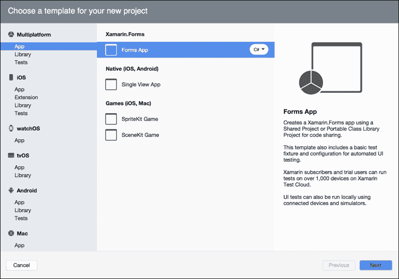
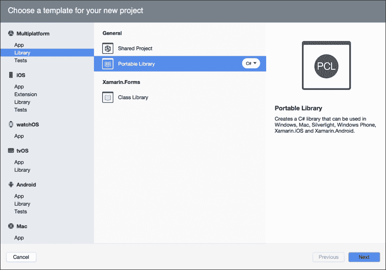
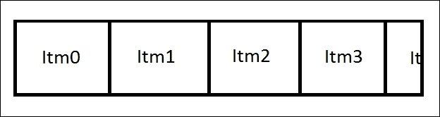
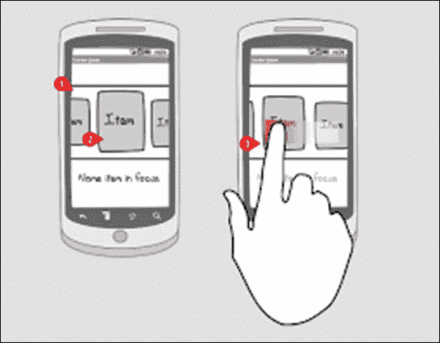
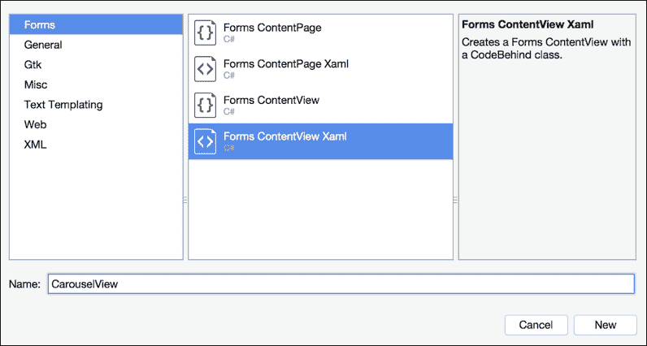
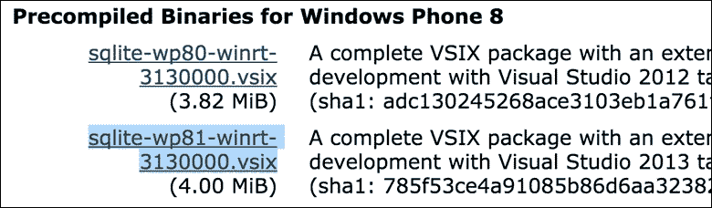
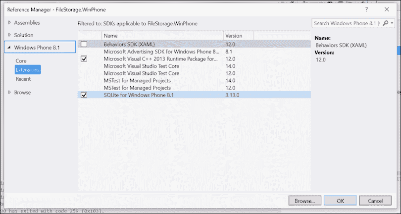

# 第七章：构建文件存储应用程序

在本章中，我们将通过 `Xamarin.Forms` 的高级开发进行讲解。我们将探讨在 UI 元素上使用 Behaviors 的用法。然后我们将使用 `Layout <View>` 框架构建一个自定义布局。我们还将构建我们的第一个 SQLite 数据库来存储文本文件。本章将涵盖以下主题：

预期知识：

+   基础 Xamarin.Forms

+   XAML

+   MVVM

+   SQL

+   C# 线程

在本章中，你将学习以下内容：

+   项目结构设置

+   使用 SQLite 构建数据访问层

+   构建 ISQLiteStorage 接口

+   其他线程技术

+   创建 AsyncSemaphore

+   创建 AsyncLock

+   实现 SQLite 的本地设置要求

+   实现 IoC 容器和模块

+   实现跨平台日志记录

+   实现 SQLiteStorage 类

+   C# 6.0 语法简介

+   在视图模型中处理警报

+   构建 IMethods 接口

+   构建 ExtendedContentPage

+   使用自定义布局构建 CarouselView

+   向 CarouselView 添加滚动控制

+   构建用于原生手势的自定义渲染器

+   构建 UI

+   使用 SynchronizationContext

+   构建 EditFilePage

+   挑战

+   构建 Windows Phone 版本

# 项目结构设置

让我们从创建一个新的 `Xamarin.Forms` 项目开始。选择 **文件** | **新建** | **解决方案**，创建一个新的 **Forms App**，如图所示：**



将项目命名为`FileStorage`。一旦项目创建，创建另一个名为`FileStorage.Portable`的可移植类库，如图所示：



我们将从底层开始，逐步构建到原生项目。

# 使用 SQLite 构建数据访问层

在上一章中，我们关注了项目架构，并讨论了数据访问层这一层，这是我们的数据库层所在的位置。我们的数据访问层是我们将存储本地文本文件的地方。

SQLite 是移动设备上最常用的数据库框架。它是一个进程内库，实现了一个自包含、无服务器、零配置、事务性的 SQL 数据库引擎，并且免费使用。

### 注意

Xamarin 还支持其他框架，如 ADO.NET 和 Realm，但已经证明 SQLite 是最有效的数据库层。

设置过程的第一个步骤是在我们的 `FileStorage.Portable` 项目中添加以下 SQLite NuGet 包：

+   `SQLite.Net.Async-PCL`

+   `SQLite.Net.Core-PCL`

+   `SQLite.Net-PCL`

一旦你在你的包中添加了这些，它们应该看起来像以下这样：


下一个步骤是在此文件夹内创建一个名为 `DataAccess` 的新文件夹。在此文件夹内，创建两个名为 `Storable` 和 `Storage` 的子文件夹。在 `Storable` 文件夹内，添加一个名为 `IStorable.cs` 的新文件并实现以下内容：

```cs
public interface IStorable
    {
       string Key { get; set; }
    }
```

这将是数据库中存储的每个对象类型的接口。在先前的例子中，我们只会有一个可存储的对象，并且每个可存储对象都必须有一个名为`Key`的字符串属性。这个属性将用作每个数据库表的主键。

在`Storable`文件夹中创建另一个名为`FileStorable.cs`的文件，并实现以下内容：

```cs
public class FileStorable : IStorable
    {
        #region Public Properties
        [PrimaryKey] public string Key { get; set; }
        public string Contents { get; set; }
        #endregion 
    }
```

`FileStorable`对象将用作数据库中文件存储表的数据模型。在 SQLite 中，在数据库设置期间，表是通过以下方式从对象创建的：

```cs
CreateTable<FileStorable>(CancellationToken.None);
```

我们将`FileStorable`对象作为类型传递给`CreateTable`函数，用于映射表中的列。

# 构建 ISQLiteStorage 接口

现在我们必须设置另一个类，该类将用于控制对数据库执行的查询。在`Storage`文件夹中添加一个名为`ISQLiteStorage.cs`的新文件，并实现以下内容：

```cs
public interface ISQLiteStorage
    {
         void CreateSQLiteAsyncConnection();
         Task CreateTable<T>(CancellationToken token) where T : class, IStorable, new();
         Task InsertObject<T>(T item, CancellationToken token) where T : class, IStorable, new();
         Task<IList<T>> GetTable<T>(CancellationToken token) where T : class, IStorable, new();
         Task<T> GetObject<T>(string key, CancellationToken token) where T : class, IStorable, new();
         Task ClearTable<T>(CancellationToken token) where T : class, IStorable, new();
         Task DeleteObjectByKey<T>(string key, CancellationToken token) where T : class, IStorable, new();
         void CloseConnection();
    }
```

前面的接口定义了将在数据库上执行的所有函数。使用 SQLite 的优势在于它执行所有处理都是异步的，所以每个执行 SQL 查询的函数都返回一个任务。如果你仔细查看`InsertObject`和`DeleteObjectByKey`函数，你会发现它们需要一个类型，这意味着我们可以使用类型执行对特定表的查询。

# 添加额外的线程技术

这是我们将添加一些技巧的地方，使用一种常见的线程方法，称为**异步锁定**。由于将只有一个**SQLiteStorage**对象实例，这意味着我们有可能出现竞态条件，因为多个线程可以同时更改相同的数据库连接。

### 小贴士

竞态条件是常见的线程问题，其中多个线程试图同时在对共享数据进行操作。

## 我们如何解决这个问题？

锁定是 C#中最常见的用于在多个线程之间限制共享资源的做法。为了避免这种情况，我们创建一个对象用于锁定，如下所示：

```cs
private Object lockObject = new Object();
```

然后，为了限制代码块在任何时候只由一个线程访问，我们执行以下操作：

```cs
lock (thisLock)
        {
            ...
        }
```

当我们的代码是同步的时候，这是一个完美的方法。我们面临的问题是我们的 SQLite 实现是异步的，而基本锁定的限制是我们不能在锁语句中执行异步代码。这就是我们必须实现 async-lock 模式的地方。

# 创建 AsyncSemaphore

让我们在`FileStorage.Portable`项目中添加一个名为`Threading`的新文件夹。在这个文件夹中，我们将添加一个名为`AsyncSemaphore.cs`的新文件，并按照以下方式实现第一部分：

```cs
public class AsyncSemaphore
    {
        private readonly static Task s_completed = Task.FromResult(true);
        private readonly Queue<TaskCompletionSource<bool>> m_waiters = new Queue<TaskCompletionSource<bool>>();
        private int m_currentCount;
        public AsyncSemaphore(int initialCount)
        {
           if (initialCount < 0) throw new ArgumentOutOfRangeException("initialCount");
           m_currentCount = initialCount; 
        }
        public Task WaitAsync()
        {
           lock (m_waiters)
            {
               if (m_currentCount > 0)
                 {
                    --m_currentCount;
                    return s_completed;
                 }
               else
                {
                   var waiter = new TaskCompletionSource<bool>();
                   m_waiters.Enqueue(waiter); return waiter.Task;
                }
         }
      }
}
```

### 注意

`SemaphoreSlim`对象用于限制可以访问资源的线程数量。

`AsyncSemaphore`保持一个计数（`m_count`属性），这是它可用于满足等待者的开放槽位数量。

从`WaitAsync`函数（静态`s_completed`属性）返回的`Task`，当`AsyncSemaphore`给它提供一个可用槽位时，将进入完成状态。如果在等待得到满足之前`CancellationToken`被触发，则相同的`Task`将进入`Canceled`状态；在这种情况下，`AsyncSemaphore`不会丢失一个槽位。

### 注意

等待者只是一个布尔类型的`TaskCompletionSource`。它包含一个`Task`，这是单个线程要执行的操作。

# 创建 AsyncLock

现在我们已经构建了`AsyncSemaphore`类，我们将在`AsyncLock`对象中使用这个对象。让我们在`Threading`文件夹中添加一个名为`AsyncLock.cs`的新文件，并实现以下内容：

```cs
public class AsyncLock
    {
        private readonly AsyncSemaphore m_semaphore;
        private readonly Task<Releaser> m_releaser;
        public AsyncLock()
          {
              m_semaphore = new AsyncSemaphore(1);
              m_releaser = Task.FromResult(new Releaser(this));
          }
        public Task<Releaser> LockAsync()
         {
              var wait = m_semaphore.WaitAsync();
              return wait.IsCompleted ?
              m_releaser :
              wait.ContinueWith((_, state) =>
              new Releaser((AsyncLock)state),
                this, CancellationToken.None,
                TaskContinuationOptions.ExecuteSynchronously, TaskScheduler.Default);
     }
       public struct Releaser : IDisposable
         {
             private readonly AsyncLock m_toRelease;
             internal Releaser(AsyncLock toRelease) { m_toRelease = toRelease; }
             public void Dispose()
               {
                   if (m_toRelease != null)
                       m_toRelease.m_semaphore.Release();
               }
        }
  }
```

`AsyncLock`类使用`AsyncSemaphore`确保在任何时候只有一个线程可以访问`LockAsync`函数之后的代码块。可以通过调用`LockAsync`异步获取锁，并通过处理该任务的输出释放锁。`AsyncLock`接受一个可选的`CancellationToken`，可以用来取消获取锁。

从`LockAsync`函数返回的`Task`，在它获取了`AsyncLock`时将进入`Completed`状态。如果在等待得到满足之前`CancellationToken`被触发，则相同的`Task`将进入取消状态；在这种情况下，`AsyncLock`不会被该任务获取。

现在让我们回到实现`SQLiteStorage`类；这是我们将要实现异步锁模式的地方。

# 实现 SQLite 的本地设置要求

我们的下一步是添加最终的设置要求。每个设备平台在设置本地数据库连接时都必须使用特定的框架。这意味着我们将添加另一个依赖注入接口来设置这些本地要求。

在`Storage`文件夹中添加一个名为`ISqliteSetup.cs`的新文件，并实现以下内容：

```cs
public interface ISQLiteSetup
    {
       string DatabasePath { get; set; }
       ISQLitePlatform Platform { get; set; }
    }
```

在我们在平台项目中实现这个类之前，我们需要为所有平台项目添加以下 SQLite NuGet 包：

+   `SQLite.Net.Async-PCL`

+   `SQLite.Net.Core-PCL`

+   `SQLite.Net-PCL`

现在让我们将注意力转向 iOS 项目。添加一个名为`DataAccess`的新文件夹，添加一个名为`SQLiteSetup.cs`的新文件，并实现以下内容：

```cs
public class SQLiteSetup : ISQLiteSetup
    { 
        public string DatabasePath { get; set; }
        public ISQLitePlatform Platform { get; set; }
        public SQLiteSetup(ISQLitePlatform platform)
          {
              DatabasePath = Path.Combine(Environment.GetFolderPath(Environment.SpecialFolder.Personal), "filestorage.db3");;
              Platform = platform; 
          }
    }
```

我们需要关注的主要属性是`ISQLitePlatform`。这来自`SQLite.Net.Interop`库。我们将在这个 IoC 容器中注册这个项目，因为我们将在便携式项目中创建数据库连接时需要这个实例。

在我们继续之前，我们需要使用 Autofac 设置 IoC 容器。

# 实现 IoC 容器和模块

就像我们之前的工程一样，我们将使用 Autofac 设置另一个 IoC 容器。首先，让我们将 Autofac nuget 包添加到解决方案中的所有项目中。然后，我们可以从第五章，*构建股票列表应用程序*中的`Stocklist.Portable`项目复制`IoC`文件夹。确保包括`IoC.cs`和`IModule.cs`文件。

现在，让我们跳转到原生项目，在 iOS 和 Android 项目中添加`Modules`文件夹，并实现`IOSModule.cs`和`DroidModule.cs`：

```cs
public class IOSModule : IModule 
    { 
        #region Public Methods
        public void Register(ContainerBuilder builder)
        {
           builder.RegisterType<SQLiteSetup>().As<ISQLiteSetup>().SingleInstance();
           builder.RegisterType<SQLitePlatformIOS>().As<ISQLitePlatform>().SingleInstance();
        }
        #endregion 
    }
```

以及 DroidModule，

```cs
public class DroidModule : IModule
    {
        #region Public Methods
        public void Register(ContainerBuilder builder) 
        {
            builder.RegisterType<SQLiteSetup>().As<ISQLiteSetup>().SingleInstance();
            builder.RegisterType<SQLitePlatformAndroid>().As<ISQLitePlatform>().SingleInstance();
        }
    #endregion 
}
```

### 注意

**注意我们如何快速拼凑事物？**

当你在构建跨平台应用程序的方向上正确时，多个平台支持带来的复杂性不应该是一个问题。

在上述两个模块内部，我们正在注册`SQLiteSetup`和`SQLitePlatformIOS/Droid`对象，以便`SQLiteStorage`实现可以在`FileStorage.Portable`项目中使用这些项。

在我们回到完成`SQLiteStorage`实现之前，我们将设置一个有用的日志方法，该方法可用于所有跨平台应用程序。

# 实现跨平台日志

现在我们有了我们的 IoC 容器，我们将使用依赖注入来进行日志记录。在跨平台应用程序中添加自定义日志功能对于跟踪所有不同项目之间的操作非常有用。第一步是添加一个名为`Logging`的新文件夹，添加一个名为`ILogger.cs`的新文件，并实现以下内容：

```cs
public interface ILogger 
    { 
        #region Methods
        void WriteLine(string message);
        void WriteLineTime(string message, params object[] args);
        #endregion 
    }
```

对于这个例子，我们的日志记录器将使用 iOS 的`System.Diagnostics`中的标准`Debug`控制台，但在 Android 中我们将使用 Android 提供的广泛日志功能。

现在，让我们在 iOS 和 Android 中添加`Logging`文件夹，并实现以下内容：

```cs
public class LoggeriOS : ILogger 
    { 
        #region Public Methods
        public void WriteLine(string text) 
        { 
            Debug.WriteLine(text);
        }
        public void WriteLineTime(string text, params object[] args)
        {
            Debug.WriteLine(DateTime.Now.Ticks + " " + String.Format(text, args));
        }
        #endregion
    }
```

iOS 的日志记录并不太花哨，但我们有一个额外的输出行来记录带有当前时间的日志语句。

现在，对于 Android 实现，我们将使用`Android.Util`库的本地日志：

```cs
public class LoggerDroid : ILogger
    {
        #region Public Methods
        public void WriteLine(string text)
        { 
            Log.WriteLine(LogPriority.Info, text, null);
        }
        public void WriteLineTime(string text, params object[] args)
        { 
            Log.WriteLine(LogPriority.Info, DateTime.Now.Ticks + " " + 
            String.Format(text, args), null);
        }
        #endregion 
    }
```

在`Android.Util`库的`Log`对象中，我们有指定优先级（`info`、`debug`、`error`）的选项。我们越能深入了解我们希望应用程序输出的具体内容，我们就能更好地跟踪底层发生的确切情况。

太棒了！现在让我们回到构建`SQLiteStorage`实现。

# 实现 SQLiteStorage 类

现在回到`FileStorage.Portable`项目。让我们在`Storage`文件夹中添加另一个名为`SQLiteStorage.cs`的文件，并实现`private`变量：

```cs
public class SQLiteStorage : ISQLiteStorage 
    {
        #region Private Properties
        private readonly AsyncLock asyncLock = new AsyncLock();
        private readonly object lockObject = new object();
        private SQLiteConnectionWithLock _conn;
        private SQLiteAsyncConnection _dbAsyncConn;
        private readonly ISQLitePlatform _sqlitePlatform;
        private string _dbPath;
        private readonly ILogger _log;
        private readonly string _tag;
        #endregion
    }
```

我们有一个私有的 `AsyncLock` 对象，因为我们将会进行同步和异步锁定实现。然后我们有两个 SQLite 对象用于创建到本地数据库的连接。`_dbPath` 变量用于保存本地数据库路径；这将用于设置连接。我们还有我们的依赖服务接口 `ILogger` 和另一个用于标记当前对象的字符串。标记在日志记录中很有用，因为它告诉记录器哪个类正在记录。

# C# 6.0 语法简介

现在让我们按照以下方式添加构造函数：

```cs
public SQLiteStorage(ISQLiteSetup sqliteSetup, ILogger log) 
    {
         _dbPath = sqliteSetup?.DatabasePath;
         _sqlitePlatform = sqliteSetup?.Platform;
         _log = log; _tag = $"{GetType()} ";
    }
```

在这里，我们可以看到一些 C# 6.0 的语法。在构造函数参数 `sqliteSetup` 后使用问号 (`?`) 表示，如果对象不为空，我们可以访问其属性。这避免了需要创建如下所示的 `if` 语句：

```cs
If (sqliteSetup != null)
    _dbPath = sqliteSetup?.DatabasePath;
```

此外，还有一些 C# 6.0 的语法，如下所示：

```cs
_tag = $"{GetType()} ";
```

美元符号 (`$`) 用于插值字符串。插值字符串表达式通过将包含的表达式替换为表达式的 `ToString` 表示形式来创建字符串。

更仔细地看看我们正在分配的项目。我们正在使用 `SQLiteSetup` 对象来设置数据库路径和 SQLite 平台属性。

让我们添加我们的前两个方法：

```cs
public void CreateSQLiteAsyncConnection() 
    { 
        var connectionFactory = new Func<SQLiteConnectionWithLock>(() =>
        {
            if (_conn == null)
            {
                _conn = new SQLiteConnectionWithLock(_sqlitePlatform, new SQLiteConnectionString(_dbPath, true));
            }
            return _conn;
        });
        _dbAsyncConn = new SQLiteAsyncConnection(connectionFactory);
     }
        public async Task CreateTable<T>(CancellationToken token) where T : class, IStorable, new()
        {
             using (var releaser = await asyncLock.LockAsync())
             {
                 await _dbAsyncConn.CreateTableAsync<T>(token);
             }
        }
```

`CreateSQLiteAsyncConnection` 函数创建一个新的 `Func` 类型为 `SQLiteConnectionWithLock`，我们使用这个 `Func` 来实例化一个新的 `SQLiteAsyncConnection`。`Func` 检查我们是否已经创建了数据库的连接。如果我们还没有建立这个连接，它将创建一个新的 `SQLiteConnectionWithLock` 对象，并传入从 `SQLSetup` 对象获取的数据库路径和平台。

在 `CreateTable` 函数中，我们将首次了解异步锁模式。`AsyncLock` 对象的伟大之处在于我们可以在 `using` 语句内包含 `await`。当一个线程在 `SQLiteAsyncConnection` 的一个实例上创建表时，另一个线程将不得不在 `using` 行处等待，直到前一个线程完成表的创建。

我们下一个函数是 `GetTable`。这个函数将再次使用异步锁模式，以确保在任何时候只有一个线程正在查询数据库。这个函数将执行一个标准的 SQL 查询，用于选择表的所有项：

```cs
SELECT * FROM {TableName};

```

表将由传递的类型 `T` 决定，从数据库接收到的结果将是所有表项的 `IEnumerable<T>` 类型：

```cs
public async Task<IList<T>> GetTable<T>(CancellationToken token) where T : class, IStorable, new()
    { 
        var items = default(IList<T>);
        using (var releaser = await asyncLock.LockAsync()) 
        {
            try
            { 
                items = await _dbAsyncConn.QueryAsync<T>(string.Format("SELECT * FROM {0};", typeof(T).Name));
            }
            catch (Exception error)
            {
                var location = string.Format("GetTable<T>() Failed to 'SELECT *' from table {0}.", typeof(T).Name);
                _log.WriteLineTime(_tag + "\n" + location + "\n" + "ErrorMessage: \n" + error.Message + "\n" + "Stacktrace: \n " + error.StackTrace);
             }
        }
        return items; 
    }
```

注意我们是如何捕获在此查询中可能发生的任何异常的？

我们正在构建一个位置字符串，以确定异常发生的确切位置。然后我们使用我们的 `ILogger` 实现将自定义的异常字符串路由到特定的原生输出控制台。

接下来是`InsertObject`函数。这个函数将负责将新条目添加到数据库的正确表中。我们还将使用 async-lock 模式来锁定连接，以防止在插入操作进行时访问连接：

```cs
public async Task InsertObject<T>(T item, CancellationToken token) where T : class, IStorable, new()
   { 
        using (var releaser = await asyncLock.LockAsync())
        { 
            try
            {
                var insertOrReplaceQuery = item.CreateInsertOrReplaceQuery();
                await _dbAsyncConn.QueryAsync<T>(insertOrReplaceQuery);
            }
           catch (Exception error)
           {
               var location = string.Format("InsertObject<T>() Failed to insert 
               or replace object with key {0}.", item.Key);
               _log.WriteLineTime(_tag + "\n" + location + "\n" + "ErrorMessage: 
               \n" + error.Message + "\n" + "Stacktrace: \n " + 
               error.StackTrace);
           }
      }
   }
```

注意到`CreateInsertOrReplaceQuery`函数吗？

我们将向`IStorable`接口添加一个扩展类。在`FileStorage.Portable`项目中，在**DataAccess**| **Storable**位置添加一个名为`StorableExtensions.cs`的新文件，并实现以下内容：

```cs
public static class StorableExtensions
    {
        #region Public Methods
        public static string CreateInsertOrReplaceQuery(this IStorable storable)
        {
           var properties = storable.GetType().GetRuntimeProperties();
           var tableName = storable.GetType().Name;
           string propertiesString = "";
           string propertyValuesString = "";
           var index = 0;
           foreach (var property in properties) 
           { 
              propertiesString += (index == (properties.Count() - 1)) ?
              property.Name : property.Name + ", ";
              var value = property.GetValue(storable);
              var valueString = value == null ? "null" : value is bool ? "'"
              + ((bool)value ? 1 : 0) + "'" : "'" + value + "'";
             // if data is serialized if (property.Name.Equals("Data") && 
             !valueString.Equals("null"))
             {
                 valueString = valueString.Replace(""", """); 
             }
             propertyValuesString += valueString + 
             ((index == (properties.Count() - 1)) ? string.Empty : ", ");
             index++;
          }
             return string.Format("INSERT OR REPLACE INTO {0}({1})
             VALUES ({2});", tableName, propetiesString, propertyValuesString);
       }
        #endregion
    }
```

前面的函数足够聪明，可以从继承自`IStorable`接口的任何条目中构建插入和替换查询。它使用`System.Reflection`库通过`GetRuntimeProperties`函数检索`IStorable`对象的全部属性。然后我们遍历所有属性，根据以下语法构建查询：

```cs
    INSERT OR REPLACE INTO names (prop1, prop2, ...) VALUES (val1, val2, ...)

```

### 小贴士

如果我们没有在`FileStorable`类的`Key`属性上设置`PrimaryKey`属性，更新将不会工作，并且每次都会添加一个新的条目。

现在是`DeleteObjectByKey`函数。这个函数将用于通过`IStorable`接口的`Key`属性从表中删除一个条目：

```cs
public async Task DeleteObjectByKey<T>(string key, CancellationToken token) where T : class, IStorable, new()
    { 
        using (var releaser = await asyncLock.LockAsync()) 
          {
            try
            {
                await _dbAsyncConn.QueryAsync<T>(string.Format("DELETE FROM {0} WHERE Key='{1}';", typeof(T).Name, key));
             }
            catch (Exception error)
             {
                 var location = string.Format("DeleteObjectByKey<T>() Failed to 
                 delete object from key {0}.", key);
                 _log.WriteLineTime(_tag + "\n" + location + "\n" + 
                 "ErrorMessage: \n" + error.Message + "\n" + "Stacktrace: \n " + 
                 error.StackTrace);
             }
          }
     }
```

太棒了！SQLite 已经设置并集成了 async-lock 模式以使其线程安全。我们的最后一步是为 IoC 容器添加`PortableModule`并注册`SqliteStorage`类。

在`FireStorable.Portable`项目中，创建一个名为`Modules`的新文件夹，添加一个名为`PortableModule.cs`的新文件，并实现以下内容：

```cs
public class PortableModule : IModule
    {
         #region Public Methods
         public void Register(ContainerBuilder builder)
          {
              builder.RegisterType<SQLiteStorage>().As<ISQLiteStorage>().SingleInstance();
          }
         #endregion
    }
```

现在我们可以开始构建用户界面层，并开始构建一些自定义 UI 对象。

# 在视图模型中处理警报

通过视图模型处理警报很重要，因为我们通过`try/catch`语句处理许多错误。为了响应这些错误，我们希望显示一个警报对话框，向用户显示错误消息。我们将有两种方法来完成这项工作：

+   使用`EventHandler`将事件推送到当前页面，以便我们可以使用不同的消息调用`DisplayAlert`函数

+   使用接口进行依赖注入，我们将实现原生警报

我们的第一步是添加`ViewModelBase`类；这是触发警报的地方。

在`FileStorage.Portable`项目中创建一个名为`ViewModels`的新文件夹，添加一个名为`ViewModelBase.cs`的新文件，并实现以下内容：

```cs
public class ViewModelBase : INotifyPropertyChanged 
    {
        #region Public Events
          public event PropertyChangedEventHandler PropertyChanged;
          public event EventHandler<string> Alert;
        #endregion
        #region Private Properties
          private IMethods _methods;
        #endregion
        #region Public Properties
          public INavigationService Navigation;
        #endregion
        #region Constructors
          public ViewModelBase(INavigationService navigation, IMethods methods) 
          {
              Navigation = navigation;
              _methods = methods; 
          }
        #endregion
    }
```

我们使用与第五章中相同的`ViewModelBase`实现，即*构建股票列表应用程序*，但我们将在构造函数中添加一个额外的`IMethods`接口（我们稍后将实现它），该接口用于显示原生警报。

接下来，添加受保护的`OnPropertyChanged`和`LoadAsync`方法，如下所示：

```cs
#region Protected Methods
protected virtual void OnPropertyChanged([CallerMemberName] string propertyName = null)
 {
    PropertyChangedEventHandler handler = PropertyChanged;
    if (handler != null) 
      {
          handler(this, new PropertyChangedEventArgs(propertyName));
      }
  }
  protected virtual async Task LoadAsync(IDictionary<string, object> parameters) 
  {
  }
#endregion
```

以及以下公共方法：

```cs
#region Public Methods
public Task<string> ShowEntryAlert(string message)
  {
    var tcs = new TaskCompletionSource<string>();
    _methods.DisplayEntryAlert(tcs, message);
    return tcs.Task; 
  }
public void NotifyAlert(string message)
  {
    if (Alert != null)
    { 
      Alert(this, message);
    }
  }
public void OnShow(IDictionary<string, object> parameters) 
  {
    LoadAsync(parameters).ToObservable().Subscribe( result =>
      { 
         // we can add things to do after we load the view model }, ex =>
          {
            // we can handle any areas from the load async function });
          }
#endregion
```

### 注意

尽管我们正在便携式项目中工作，但这仍然是架构中的表示层的一部分。

`NotifyAlert`函数用于通过`Xamarin.Forms`函数`DisplayAlert`在`ContentPage`上显示警报。`ShowEntryAlert`函数用于通过`IMethod`接口显示警报。

注意到`TaskCompletionSource`的使用吗？

这意味着我们可以等待`ShowEntryAlert`函数。当用户对警报做出响应时，`Task`将进入完成状态。这确保了代码仅在收到响应后执行一次。

# 构建 IMethods 接口

首先，在`FileStorage.Portable`项目中创建一个新的文件夹，添加一个名为`IMethods.cs`的新文件，并实现以下内容：

```cs
public interface IMethods 
  {
    #region Methods
    void Exit();
    void DisplayEntryAlert(TaskCompletionSource<string> tcs, string message);
    #endregion 
  }
```

对于所有原生项目，添加一个名为`Extras`的新文件夹。让我们从 iOS 项目开始。添加一个名为`IOSMethods.cs`的新文件，并实现以下内容：

```cs
public class IOSMethods : IMethods
  {
    #region Public Methods
    public void Exit()
     {
       UIApplication.SharedApplication.PerformSelector(new ObjCRuntime.Selector("terminateWithSuccess"), null, 0f);
     }
    public void DisplayEntryAlert(TaskCompletionSource<string> tcs, string message)
    { 
      UIAlertView alert = new UIAlertView(); alert.Title = "Title"; 
      alert.AddButton("OK");
      alert.AddButton("Cancel"); 
      alert.Message = message;
      alert.AlertViewStyle = UIAlertViewStyle.PlainTextInput; 
      alert.Clicked += (object s, UIButtonEventArgs ev) =>
        {
          if (ev.ButtonIndex == 0)
            {
              tcs.SetResult(alert.GetTextField(0).Text); 
            } 
          else
            {
              tcs.SetResult(null);
            }
        };
      alert.Show(); 
    }
  #endregion 
}
```

我们应该识别前几章中的`Exit`函数。`DisplayEntryAlert`函数创建一个`PlainTextInputUIAlertView`。此警报将通过文本框请求文本输入，我们可以使用`GetTextField`函数检索此文本值。警报还将显示一个`是`和`否`按钮，因此当用户输入文本并点击`是`时，将创建一个新文件，其文件名设置为输入的文本。

现在让我们为 Android 复制相同的程序。添加一个名为`DroidMethods.cs`的新文件，并实现以下内容：

```cs
public class DroidMethods : IMethods 
  { 
    #region Public Methods
    public void Exit() 
      { 
        Android.OS.Process.KillProcess(Android.OS.Process.MyPid());
      }
     public void DisplayEntryAlert(TaskCompletionSource<string> tcs, string message)
      {
        var context = Forms.Context;
        LayoutInflater factory = LayoutInflater.From(context);
        var view = factory.Inflate(Resource.Layout.EntryAlertView, null);
        var editText = view.FindViewById<EditText>(Resource.Id.textEntry);
        new AlertDialog.Builder(context)
         .SetTitle("Chat") 
         .SetMessage(message) 
         .SetPositiveButton("Ok", (sender, e) =>
           {
             tcs.SetResult(editText.Text); 
           })
         .SetNegativeButton("Cancel", (sender, e) =>
           { 
             tcs.SetResult(null);
           })
         .SetView(view)
          .Show(); 
        }
    #endregion 
  }
```

这次为 Android，我们使用`AlertDialog.Builder`框架。我们使用`Forms.Context`属性来检索当前上下文，我们使用它来创建一个新的`AlertDialog.Builder`。我们必须在这个框架中使用`SetView`函数来分配一个自定义视图用于文本输入。这个自定义视图是使用一个新的 XML 布局创建的。

在**资源** | **布局**文件夹中添加一个名为`EntryAlertView.xml`的新文件，并实现以下内容：

```cs
<?xml version="1.0" encoding="utf-8"?>
<EditText  
    android:id="@+id/textEntry" android:layout_height="wrap_content" 
    android:layout_width="250px" android:layout_centerHorizontal="true"
    android:singleLine="true" />
```

我们所拥有的只是一个`EditText`对象，用于在警报对话框中从用户那里检索文件名。在`DroidMethods`类中使用`FindViewById`，我们可以引用此`EditText`项以检索用户输入的文本值。

那就是全部了。我们的下一步是创建一个定制的`ContentPage`来处理每个视图模型的`Alert`事件。

# 构建扩展内容页面

在`FileStorage`项目中添加一个名为`UI`的新文件夹，添加一个名为`ExtendedContentPage.cs`的新文件，并实现以下内容：

```cs
public class ExtendedContentPage : ContentPage
  {
    #region Private Properties
      private ViewModelBase _model;
    #endregion
    #region Constructors
      public ExtendedContentPage(ViewModelBase model)
      {
        _model = model;
        _model.Alert -= HandleAlert;
        _model.Alert += HandleAlert;
      }
    #endregion
    #region Private Methods
      private async void HandleAlert(object sender, string message) 
      {
        await DisplayAlert("FileStorage", message, "OK");
      }
    #endregion 
  }
```

`_model`属性用于引用每个页面的视图模型，因为每个视图模型都继承自`ViewModelBase`类。当页面创建时，我们将`HandleAlert`函数注册到视图模型的`Alert`事件。每次此函数被调用时，它将调用`Xamarin.Forms`中的`DisplayAlert`函数。

## 为什么我们要实现两种不同的显示警报的技术？

显示警报的跨平台功能不允许我们使用我们本地构建的文本输入添加功能。

太好了！我们现在为我们的跨平台项目找到了一个很好的多种类型警报的解决方案。我们的下一步是实现我们第一个自定义布局，称为 `CarouselView`。

### 提示

`Xamarin.Forms` 有自己的 `CarouselView`，但它已被移除，直到 UI 对象更加稳定。

# 使用自定义布局构建 CarouselView

`Xamarin.Forms` 是一个非常年轻的布局系统，这意味着布局的种类相当有限。有时候，我们需要实现自己的自定义布局来控制我们的视图和控制元素在屏幕上的确切位置和方式。这种需求可能来自于需要提高显示大量视图和控制元素的屏幕性能的情况，有时标准布局不足以满足需求。我们希望实现自定义布局以执行产生所需布局所需的最小工作量。

### 注意

所有布局都派生自 `Xamarin.Forms.Layout` 类，它提供了添加和移除子项所需的机制，以及一些编写布局时的一些关键实用工具。

让我们在 `FireStorable` 项目中添加一个名为 `Controls` 的新文件夹。添加一个名为 `CarouselLayout.cs` 的新文件，并按照以下方式实现第一部分：

```cs
public class CarouselLayout : Layout<View>
  {
    #region Private Properties
      private IDisposable dataChangesSubscription;
      public double LayoutWidth;
    #endregion
  }
```

所有布局都必须继承 `Layout` 框架。`Xamarin.Forms.Layout<T>` 提供了一个公开的 `IList<T>` Children，最终用户可以访问。我们希望这个集合的所有子项都是 `View` 类型。

我们有两个 `private` 属性，一个用于布局宽度，一个 `IDisposable` 用于处理数据更改订阅。

让我们添加一些更多属性：

```cs
#region Public Properties
public Object this[int index] 
  {
    get
    {
      return index < ItemsSource.Count() ? ItemsSource.ToList()[index] : null;
    }
  }
public DataTemplate ItemTemplate { get; set; }
public IEnumerable<Object> ItemsSource { get; set; }
#endregion
```

我们有一个索引引用，它将从 **`ItemsSource IEnumerable`** 返回一个数组元素，以及 `ItemTemplate` 属性，它用于为 `ItemsSource` 中的每个子项渲染视图布局。我们必须使用 `Linq` 函数 `ToList` 来允许我们通过索引值访问 `IEnumerable`。

现在我们将添加一些对 `Layout` 框架的重写。每个自定义布局都必须重写 `LayoutChildren` 方法。这负责在屏幕上定位子项：

```cs
protected override void LayoutChildren(double x, double y, double width, double height)
  { 
    var layout = ComputeLayout(width, height);
    var i = 0;
    foreach (var region in layout)
      { 
        var child = Children[i];
        i++;
        LayoutChildIntoBoundingRegion(child, region);
      }
    }
```

前面的函数将调用另一个方法 `ComputeLayout`，该方法将返回一个 **`Rectangles`**（也称为 **`regions`**）的 `IEnumerable`。然后我们遍历 `IEnumerable` 并为每个区域调用 `LayoutChildIntoBoundingRegion`。此方法将处理元素相对于边界区域的位置。

我们的布局还必须实现 `OnMeasure` 函数。这是为了确保新布局在放置在其他布局内部时尺寸正确。在布局周期中，这个方法可能会根据其上方的布局和解决当前布局层次结构所需的布局异常数量多次被调用。在 `LayoutChildren` 函数下方添加以下内容：

```cs
protected override SizeRequest OnMeasure(double widthConstraint, double heightConstraint)
  {
    List<Row> layout = ComputeNiaveLayout(widthConstraint, heightConstraint);
    var last = layout[layout.Count - 1];
    var width = (last.Count > 0) ?
    last[0].X + last.Width : 0; var height = (last.Count > 0) ? last[0].Y + 
    last.Height : 0;
    return new SizeRequest(new Size(width, height)); 
  }
```

### 提示

因此，在实现此函数时考虑速度很重要。未能实现此函数并不总是会破坏你的布局，尤其是如果它始终在父元素内部，因为父元素无论如何都会固定子项的大小。

`ComputeNiaveLayout` 将返回一个 **行** 列表。然后我们从该列表中检索最后一行，并使用它来确定最大 x 值和最大 y 值，通过计算 x 轴和 y 轴上第一个和最后一个元素之间的差异来计算总宽度和高度。最后，我们返回一个新的 `SizeRequest` 对象，包含计算出的宽度和高度，这将用于调整布局的大小。

让我们添加缺失的函数 `ComputeNiaveLayout` 和 `ComputeLayout`，如下所示：

```cs
public IEnumerable<Rectangle> ComputeLayout(double widthConstraint, double heightConstraint)
  {
    List<Row> layout = ComputeNiaveLayout(widthConstraint, heightConstraint);
    return layout.SelectMany(s => s); 
  }
```

此函数仅用于执行 `SelectMany` 查询。`ComputeNiaveLayout` 布局是所有工作完成的地方。这将遍历所有子项；它将创建一个 **行**，并在该行内创建一个矩形，该矩形的大小将等于布局的高度，宽度将等于所有子项宽度的总和。所有子项将水平并排放置在屏幕右侧，如下面的截图所示：



但在任何时候屏幕上只能看到一个子项，因为每个子项的大小被设置为布局的完整高度和宽度：

```cs
private List<Row> ComputeNiaveLayout(double widthConstraint, double heightConstraint) 
  {
    var result = new List<Row>();
    var row = new Row();
    result.Add(row);
    var spacing = 20;
    double y = 0;
    foreach (var child in Children) 
    {
       var request = child.Measure(double.PositiveInfinity,
       double.PositiveInfinity);
       if (row.Count == 0)
       {
         row.Add(new Rectangle(0, y, LayoutWidth, Height));
         row.Height = request.Request.Height; continue; 
       }
       var last = row[row.Count - 1];
       var x = last.Right + spacing;
       var childWidth = LayoutWidth;
       var childHeight = request.Request.Height;
       row.Add(new Rectangle(x, y, childWidth, Height));
       row.Width = x + childWidth; row.Height = Math.Max(row.Height, Height); 
       }
    return result; 
 }
```

等一下！如果我有很多子项呢？这意味着它们将水平堆叠超过屏幕宽度。我们现在该怎么办？

CarouselView 的理念是每次只显示一个视图，当用户左右滑动时；当前视图左侧/右侧的视图将出现在屏幕上，而当前视图将移出视图，如下面的截图所示：



尽管我们有一个水平展示子项的自定义布局，但我们如何处理滑动事件和滚动控制？

我们将通过 `ScrollView` 实现滚动控制，并为处理滑动事件创建一个自定义渲染器。

# 向 CarouselView 添加滚动控制

在 `Controls` 文件夹中添加一个名为 `CarouselScroll.cs` 的新文件，并按照以下方式实现第一部分：

```cs
public class CarouselScroll : ScrollView 
  { 
    #region Private Properties
      private CarouselLayout _carouselLayout;
    #endregion
    public DataTemplate ItemTemplate
    {
      set
      {
        _carouselLayout.ItemTemplate = value;
      }
    }
    public CarouselScroll()
    {
      Orientation = ScrollOrientation.Horizontal;
      _carouselLayout = new CarouselLayout();
      Content = _carouselLayout;
     }
   }
```

`CarouselScroll` 将继承 `ScrollView` 对象，因为这将作为 `CarouselLayout` 的边界视图。我们还将创建一个 `DataTemplate` 变量，用于在 `CarouselLayout` 中设置 `DataTemplate` 对象。然后，在构造函数中，我们实例化一个新的 `CarouselLayout` 对象，作为 `ScrollView` 的 `Content`。

现在让我们为 `ItemsSource` 添加一个自定义绑定对象。就像 `ListView` 一样，我们将绑定一个 `ObserableCollection` 项到这个属性：

```cs
    public static readonly BindableProperty ItemsSourceProperty = BindableProperty.Create<CarouselLayout, IEnumerable<Object>>(o => o.ItemsSource,
    default(IEnumerable<Object>), propertyChanged: (bindable, oldvalues, newValues) =>
    {
      ((CarouselScroll)bindable)._carouselLayout.ItemsSource = newValues;
    });
```

注意 `propertyChanged` 事件；当绑定发生变化时，我们将更新 `CarouselLayout` 的 `ItemsSource` 属性。记住，`CarouselLayout` 负责为 `IEnumerable` 中的每个项目布局子项。

我们还需要另一个可绑定属性来处理数据变化。这将是一个`IObservable`对象，它将监听任何`DataChange`事件。如果发生事件，`CarouselLayout`将布局子项：

```cs
    public static readonly BindableProperty DataChangesProperty = BindableProperty.Create("DataChanges", 
    typeof(IObservable<DataChange>), typeof(CarouselLayout), null, propertyChanged: (bindable, oldvalue, newValue) =>
    {
         ((CarouselScroll)bindable)._carouselLayout.SubscribeDataChanges((IObservable<DataChange>)newValue);
    });
```

然后我们需要重写`LayoutChildren`函数；因此当`ScrollView`更新其子项时，我们希望更新`CarouselLayout`的高度和宽度属性，从而更新子项的布局：

```cs
protected override void LayoutChildren(double x, double y, double width, double height)
  { 
    base.LayoutChildren(x, y, width, height);
    if (_carouselLayout != null)
      {
         if (width > _carouselLayout.LayoutWidth)
          { 
             _carouselLayout.LayoutWidth = width; 
          }
         _carouselLayout.ComputeLayout(width, height); 
      }
   }
```

我们还有一个额外的函数，`GetSelectedItem`，它简单地使用索引从`CarouselLayout`返回一个子项：

```cs
public Object GetSelectedItem(int selected)
  {
     return _carouselLayout[selected]; 
  }
```

我们进入`CarouselView`的下一阶段是创建一个允许滑动手势的`CustomRenderer`。

# 构建用于原生手势的 CustomRenderer

现在我们需要为每个移动平台处理左右滑动手势。不幸的是，`Xamarin.Forms`没有提供跨平台的滑动手势功能，因此我们需要自己实现这个功能。为了做到这一点，我们将构建一个`CustomRenderer`。首先，在`Controls`文件夹中添加一个名为`GestureView.cs`的新文件并实现以下内容：

```cs
public class GestureView : View 
  {
    public event EventHandler SwipeLeft;
    public event EventHandler SwipeRight;
    public event EventHandler Touch;
    public void NotifySwipeLeft()
      {
        if (SwipeLeft != null)
        {
          SwipeLeft (this, EventArgs.Empty); 
        }
      }
    public void NotifySwipeRight()
     {
        if (SwipeRight != null)
         {
           SwipeRight (this, EventArgs.Empty);
         }
     }
    public void NotifyTouch()
     {
        if (Touch != null)
         {
           Touch(this, EventArgs.Empty); 
         }
      }
  }
```

此视图为每个手势都有一个`EventHandler`，我们还需要一个用于点击事件的手势。尽管`Xamarin.Forms`在运行时渲染在`CarouselView`之上时提供了这个功能，但`Xamarin.Forms`的手势将不再工作。

现在，在`FileStorage.iOS`项目中，让我们添加一个名为`Renderers`的新文件夹，并在其中添加一个名为`GestureView`的子文件夹。然后，在`GestureView`文件夹中，添加一个名为`GestureViewiOS.cs`的新文件并实现以下内容：

```cs
[Register("GestureViewiOS")]
  public sealed class GestureViewiOS : UIView
   { 
     private UIView _mainView;
     private UISwipeGestureRecognizer _swipeLeftGestureRecognizer;
     private UISwipeGestureRecognizer _swipeRightGestureRecognizer;
     private UITapGestureRecognizer _tapGestureRecognizer;
     public GestureViewiOS()
     {
       _mainView = new UIView ()
       {
         TranslatesAutoresizingMaskIntoConstraints = false 
        };
       _mainView.BackgroundColor = UIColor.Clear;
      Add (_mainView);
     // set layout constraints for main view AddConstraints
     (NSLayoutConstraint.FromVisualFormat("V:|[mainView]|", 
      NSLayoutFormatOptions.DirectionLeftToRight, null,
      new NSDictionary("mainView", _mainView)));
     AddConstraints (NSLayoutConstraint.FromVisualFormat("H:|[mainView]|", NSLayoutFormatOptions.AlignAllTop, null, new NSDictionary ("mainView", _mainView)));
     }
   }
```

此视图为每个手势都有一个`EventHandler`，我们还需要一个用于点击事件的手势。尽管`Xamarin.Forms`在运行时渲染在`CarouselView`之上时提供了这些功能，但`Xamarin.Forms`的手势将不再工作。

```cs
public void InitGestures(GestureView swipeView)
  {
     _swipeLeftGestureRecognizer = new UISwipeGestureRecognizer (swipeView.NotifySwipeLeft);
     _swipeLeftGestureRecognizer.Direction = UISwipeGestureRecognizerDirection.Left; 
     _swipeRightGestureRecognizer = new UISwipeGestureRecognizer (swipeView.NotifySwipeRight); 
     _swipeRightGestureRecognizer.Direction = UISwipeGestureRecognizerDirection.Right;
     _tapGestureRecognizer = new UITapGestureRecognizer(swipeView.NotifyTouch);
     _tapGestureRecognizer.NumberOfTapsRequired = 1;
     _mainView.AddGestureRecognizer (_swipeLeftGestureRecognizer);
     _mainView.AddGestureRecognizer (_swipeRightGestureRecognizer);
     _mainView.AddGestureRecognizer (_tapGestureRecognizer);
  }
```

此函数将只从`GestureViewRenderer`的`OnElementChanged`函数中调用一次。

现在让我们添加渲染器类。添加一个名为`GestureViewRenderer.cs`的新文件并实现以下内容：

```cs
public class GestureLayoutRenderer : ViewRenderer<GestureView, GestureViewiOS>
  {
    private GestureViewiOS _swipeViewIOS;
    private bool gesturesAdded;
    public GestureLayoutRenderer()
      {
        _swipeViewIOS = new GestureViewiOS (); 
      }
    protected override void OnElementChanged (ElementChangedEventArgs<GestureView> e)
     {
        base.OnElementChanged (e);
        if (Control == null) 
          {
             SetNativeControl(_swipeViewIOS); 
          }
        if (Element != null && !gesturesAdded) 
          {
             _swipeViewIOS.InitGestures(Element); 
             gesturesAdded = true;
          }
      }
   }
```

每当`UI`对象的属性发生变化时，`OnElementChanged`函数将被调用。如果渲染器的`Control`属性为 null，我们只调用一次`SetNativeControl`。渲染器的`Element`属性通常是`Xamarin.Forms`项目中的 UI 对象（在我们的案例中是`FileStorage`项目的`GestureView`）。当我们收到`GestureView`对象的引用（在`OnElementChanged`函数内部）时，我们将此传递给`InitGestures`函数，以便在`GestureView`对象上使用`EventHandlers`。现在，当我们左右滑动或点击原生`mainView`对象时，它将调用`GestureView`对象的`NotifySwipeLeft`、`NotifySwipeRight`和`NotifyTouch`函数。

不要忘记在命名空间声明上方添加以下行：

```cs
[assembly: Xamarin.Forms.ExportRenderer(typeof(FileStorage.Controls.GestureView), typeof(FileStorage.iOS.Renderers.GestureView.GestureLayoutRenderer))]
   namespace FileStorage.iOS.Renderers.GestureView
```

我们必须始终向自定义渲染器类添加`ExportRenderer`属性，以指定它将用于渲染`Xamarin.Forms`控件。

`GestureViewiOS` 对象将是我们 `FileStorage` 项目中显示在 `GestureView` 对象之上的视图。无论在 `ContentPage` 中放置新的 `GestureView` 对象的位置如何，`GestureViewRenderer` 都将在其位置渲染一个新的 `GestreViewiOS` 视图。

现在让我们为 Android 实现相同的操作。在 `FileStorage.Droid` 项目中添加一个名为 `Renderers` 的新文件夹，并在其中添加一个名为 `GestureView` 的新文件夹。然后，在 `GestureView` 文件夹中，添加一个名为 `GestureListener.cs` 的新文件并实现第一部分：

```cs
public class GestureListener : GestureDetector.SimpleOnGestureListener
  {
     private const int SWIPE_THRESHOLD = 50;
     private const int SWIPE_VELOCITY_THRESHOLD = 50;
     private GestureView _swipeView;
     public void InitCoreSwipeView(GestureView swipeView)
     {
        _swipeView = swipeView;
     }
   }
```

`GestureDetector` 用于响应特定视图的多种类型的按下事件。我们还把 `Xamarin.Forms GestureView` 对象传递到这个类中，这样我们就可以在特定事件发生时触发 `NotifySwipeLeft`、`NotifySwipeRight` 和 `NotifyTouch` 函数。阈值值用作最小滑动距离和触摸压力。当用户在这个视图中进行滑动时，必须施加一定量的压力和移动才能触发事件。

### 注意

`SimpleOnGestureListener` 扩展是一个便利类，当你只想监听所有手势的子集时使用。

现在我们必须重写以下函数（我们不会对这些函数做任何事情，但它们必须被重写）：

```cs
public override void OnLongPress (MotionEvent e)
  {
    base.OnLongPress (e); 
  }
public override bool OnDoubleTap (MotionEvent e)
  {
    return base.OnDoubleTap (e);
  }
public override bool OnDoubleTapEvent (MotionEvent e)
  { 
    return base.OnDoubleTapEvent (e);
  }
public override bool OnDown (MotionEvent e) 
  {
    return base.OnDown (e); 
  }
public override bool OnScroll (MotionEvent e1, MotionEvent e2, float distanceX, float distanceY)
  { 
    return base.OnScroll (e1, e2, distanceX, distanceY);
  }
public override void OnShowPress (MotionEvent e)
  { 
     base.OnShowPress (e);
  }
public override bool OnSingleTapConfirmed (MotionEvent e)
  { 
     return base.OnSingleTapConfirmed (e);
  }
```

现在是使用函数的时候了。`OnSingleTapUp` 函数将负责处理触摸事件，当用户对视图应用单次点击手势时调用：

```cs
public override bool OnSingleTapUp (MotionEvent e)
   {
    _swipeView.NotifyTouch(); 
    return base.OnSingleTapUp (e);
   }
```

`OnFling` 函数负责处理滑动事件。两个 `MotionEvent` 项目是用户开始滑动和手指移除时的起始点和结束点 (*x*, *y*)。我们计算拖动距离，并确保 `diffX` 的绝对值大于 `diffY` 的绝对值。这确保了我们是在水平拖动。然后我们确保 `diffX` 的绝对值大于 `Swipe_Threshold`，并且 `VelocityX` 大于 `Swipe_Velocity_Threshold`。如果所有这些条件都满足，那么当 `diffX` 为正时，我们将触发向右滑动；否则，将触发向左滑动：

```cs
public override bool OnFling (MotionEvent e1, MotionEvent e2, float velocityX, float velocityY) 
  { 
    try 
      { 
        float diffY = e2.GetY() - e1.GetY(); 
        float diffX = e2.GetX() - e1.GetX();
        if (Math.Abs(diffX) > Math.Abs(diffY)) 
          {
            if (Math.Abs(diffX) > SWIPE_THRESHOLD && Math.Abs(velocityX) > SWIPE_VELOCITY_THRESHOLD)
          {
            if (_swipeView != null)
              {
                if (diffX > 0)
                  {
                    _swipeView.NotifySwipeRight ();
                  }
                else
                  {
                    _swipeView.NotifySwipeLeft ();
                  }
              }
         }
      }
    }
    catch (Exception) { }
    return base.OnFling (e1, e2, velocityX, velocityY); 
  }
```

现在我们来构建 `GestureViewRenderer` 并将其与 `GestureDetector` 集成。在 `Gesture` 文件夹中添加一个名为 `GestureViewRenderer.cs` 的新文件并实现以下内容：

```cs
public class GestureViewRenderer : ViewRenderer<GestureView, LinearLayout>
  {
    private LinearLayout _layout;
    private readonly GestureListener _listener;
    private readonly GestureDetector _detector;
    public GestureViewRenderer ()
      {
         _listener = new GestureListener ();
         _detector = new GestureDetector (_listener);
         _layout = new LinearLayout (Context); 
      }
   }
```

我们现在将创建一个空的 `LinearLayout` 用于 `Control`。这是将接收触摸事件的空白视图。然后我们从这个上面实例化一个新的 `GestureListener` 并将其传递给一个新的 `GestureDetector`。GestureDetector 的 `OnTouchEvent` 函数被用于所有触摸和运动事件，在这个类中我们更详细地分解事件以确定确切发生的事件：

```cs
protected override void OnElementChanged (ElementChangedEventArgs<GestureView> e)
  {
    base.OnElementChanged (e);
    if (e.NewElement == null) 
      {
        GenericMotion -= HandleGenericMotion;
        Touch -= HandleTouch;
      }
    if (e.OldElement == null)
      {
        GenericMotion += HandleGenericMotion;
        Touch += HandleTouch;
      }
    if (Element != null)
      {
        _listener.InitCoreSwipeView(Element); 
      }
    SetNativeControl (_layout); 
    }
    private void HandleTouch (object sender, TouchEventArgs e) 
      {
        _detector.OnTouchEvent (e.Event);  
      }
    private void HandleGenericMotion (object sender, GenericMotionEventArgs e)
      {
        _detector.OnTouchEvent (e.Event);  
      }
```

注意到对参数的 `OldElemenet` 和 `NewElement` 属性的空值检查吗？

如果 `OldElemenet` 为空，我们必须注销触摸事件，如果 `NewElement` 为空，则注册 `GenericMotion` 和 `Touch` 事件。

现在我们已经准备好了`GestureView`和`GestureViewRenderers`，是时候创建最终控件并添加一个名为`CarouselView.xaml`的新**Forms ContentView Xaml**文件，如下面的截图所示：



我们还在`CarouselView.xaml`中实现了以下内容：

```cs
<?xml version="1.0" encoding="UTF-8"?>
<ContentView  

  x:Class="FileStorage.Controls.CarouselView">
<ContentView.Content>
  <Grid x:Name="Container">
  <Grid.RowDefinitions>
  <RowDefinition Height="*"/> 
  </Grid.RowDefinitions> 
  <Grid.ColumnDefinitions>
  <ColumnDefinition Width="*"/>
  </Grid.ColumnDefinitions>
  <controls:CarouselScroll x:Name="CarouselScroll" ItemsSource="{Binding Cells}" 
   ItemTemplate="{StaticResource CarouselTemplate}" 
   DataChanges="{Binding DataChanges}" Grid.Row="0" Grid.Column="0"/>
  <controls:GestureView x:Name="GestureView" Grid.Row="0" Grid.Column="0"/>
  </Grid>
 </ContentView.Content>
 </ContentView>
```

上述代码将创建一个`Grid`，将其覆盖在`GestureView`之上，位于`CarouselScroll`之上。这意味着`GestureView`将检测滑动和触摸事件，并将这些事件传递给`CarouselScroll`。

现在让我们按照以下内容实现`CarouselView.xaml.cs`：

```cs
public partial class CarouselView : ContentView 
  {
    private bool _animating;
    public int SelectedIndex = 0;
    public static readonly BindableProperty SelectedCommandProperty = BindableProperty.Create<CarouselView, ICommand>(w => w.SelectedCommand, default(ICommand),
    propertyChanged: (bindable, oldvalue, newvalue) => { });

    public ICommand SelectedCommand 
      {
        get
        {
          return (ICommand)GetValue(SelectedCommandProperty); 
        }
        set
        {
          SetValue(SelectedCommandProperty, value);
        }
      }
    public CarouselView() 
      {
         InitializeComponent();
         GestureView.SwipeLeft += HandleSwipeLeft;
         GestureView.SwipeRight += HandleSwipeRight;
         GestureView.Touch += HandleTouch;
       }
 }
```

第一部分显示了事件注册到`GestureView`。我们还有一个自定义的`Command`绑定，当发生`Touch`事件时将被调用。让我们添加以下`EventHandler`函数：

```cs
public void HandleTouch(object sender, EventArgs e)
  {
    if (SelectedCommand != null)
     {
        var cell = CarouselScroll.GetSelectedItem(SelectedIndex); 
        SelectedCommand.Execute(cell);
     }
   }
public async void HandleSwipeLeft(object sender, EventArgs e)
   { 
     if (((CarouselScroll.ScrollX + CarouselScroll.Width) < (CarouselScroll.Content.Width - CarouselScroll.Width)) && !_animating)
      {
        _animating = true;
        SelectedIndex++;
        await CarouselScroll.ScrollToAsync(CarouselScroll.ScrollX + Width + 20, 0, true);
        _animating = false;
      } 
   }
public async void HandleSwipeRight(object sender, EventArgs e)
   {
     if (CarouselScroll.ScrollX > 0 && !_animating)
      {
         _animating = true;
         SelectedIndex--;
         await CarouselScroll.ScrollToAsync(CarouselScroll.ScrollX - Width - 20, 0, true);
         _animating = false;
      }
   }
 }
```

`HandleTouch`函数将简单地调用`CarouselScroll`中的`GetSelectedItem`函数。这意味着我们从视图中获取绑定对象，并将其用作传递给`SelectCommand`执行参数。`HandleSwipeLeft`函数将增加所选索引的值 1，并滚动视图的整个宽度。记住，每个子项占据视图的整个宽度和高度，因此为了移动到下一个子项，我们必须水平滚动宽度。

然后我们有`HandleSwipeRight`函数，它将执行与`HandleSwipeLeft`相反的操作，并沿相反方向滚动。在每个滑动函数中，我们也执行一个检查，看看我们是否在起始子项或最后一个子项上。

恭喜你，你刚刚构建了你的第一个自定义布局。现在让我们构建用户界面的其余部分，看看我们如何使用它。

# 构建用户界面

现在是时候构建用户界面屏幕了；我们将从构建视图模型开始。在`FileStorage.Portable`项目中，添加一个名为`ViewModels`的新文件夹，添加一个名为`MainPageViewModel.cs`的新文件，并实现以下内容：

```cs
public class MainPageViewModel : ViewModelBase
  {
     #region Private Properties
     private string _descriptionMessage = "Welcome to the Filing Room";
     private string _FilesTitle = "Files";
     private string _exitTitle = "Exit";
     private ICommand _locationCommand;
     private ICommand _exitCommand;
     private ISQLiteStorage _storage;
     #endregion
  }
```

我们在这个视图模型中包含了`ISQLiteStorage`对象，因为当这个视图模型被创建时，我们将创建数据库表。别忘了我们需要为所有`private`属性实现公共属性；以下是有助于你开始的两个属性：

```cs
#region Public Properties
public ICommand LocationCommand
  {
    get
     {
       return _locationCommand; 
     }
    set
     {
       if (value.Equals(_locationCommand))
         {
            return;
         }
       _locationCommand = value; OnPropertyChanged("LocationCommand"); 
      }
   }
public ICommand ExitCommand
  {
    get
      {
        return _exitCommand;
      }
    set
      {
       if (value.Equals(_exitCommand))
         {
            return; 
         }
       _exitCommand = value; OnPropertyChanged("ExitCommand");
      }
    }
#endregion
```

然后我们添加剩余的属性。我们在构造函数中调用`SetupSQLite`函数来设置数据库，如下所示：

```cs
#region Constructors
public MainPageViewModel (INavigationService navigation, Func<Action, ICommand> commandFactory,
IMethods methods, ISQLiteStorage storage) : base (navigation, methods)
  {
     _exitCommand = commandFactory (() => methods.Exit());
     _locationCommand = commandFactory (async () => await Navigation.Navigate(PageNames.FilesPage, null));
     _storage = storage;
     SetupSQLite().ConfigureAwait(false); 
  }
#endregion
private async Task SetupSQLite()
  {
    // create Sqlite connection _storage.CreateSQLiteAsyncConnection();
    // create DB tables await _storage.CreateTable<FileStorable>
    CancellationToken.None);
  }
}
```

`SetupSQLite`函数负责创建到本地数据库的异步连接，并从`FileStorable`对象构建一个表。

现在让我们为这个视图模型构建页面。在`FileStorage`项目中添加一个名为`Pages`的新文件夹，添加一个名为`MainPage.xaml`的新文件，并实现以下内容：

```cs
<?xml version="1.0" encoding="UTF-8"?>
<ui:ExtendedContentPage  

    x:Class="FileStorage.Pages.MainPage"
    BackgroundColor="White"
    Title="Welcome">
<ui:ExtendedContentPage.Content>
      <Grid x:Name="Grid" RowSpacing="10" Padding="10, 10, 10, 10" VerticalOptions="Center">
      <Grid.RowDefinitions> 
          <RowDefinition Height="*"/>
          <RowDefinition Height="Auto"/>
          <RowDefinition Height="Auto"/>
          <RowDefinition Height="Auto"/>
      </Grid.RowDefinitions>
      <Grid.ColumnDefinitions>
          <ColumnDefinition Width="*"/>
      </Grid.ColumnDefinitions>
      <Image x:Name="Image" Source="files.png" HeightRequest="120" 
          WidthRequest="120" Grid.Row="0" Grid.Column="0"/>
      <Label x:Name="DesciptionLabel" Text="{Binding DescriptionMessage}" 
          TextColor="Black" HorizontalOptions="Center" Font="Arial, 20" 
          Grid.Row="1" Grid.Column="0"/>
      <Button x:Name="LocationButton" Text="{Binding FilesTitle}"
          Command="{Binding LocationCommand}" 
          Style="{StaticResource ButtonStyle}" Grid.Row="2" Grid.Column="0"/>
      <Button x:Name="ExitButton" Text="{Binding ExitTitle}"
          Command="{Binding ExitCommand}" Style="{StaticResource ButtonStyle}" 
          Grid.Row="3" Grid.Column="0"/>
      </Grid>
   </ui:ExtendedContentPage.Content>
</ui:ExtendedContentPage>
```

记得我们的自定义控件`ExtendedContentPage`吗？

We are going to use this for all pages so that every page has alert functionality connected with its view-model. The following line gives the reference to our custom control:

```cs
We have to declare a new `ExtendedContentPage` like the following:

```

<ui:ExtendedContentPage

```cs

The rest of the page is the same as previous projects. A simple **Grid** contains an image, label, and two buttons. Now implement the following for `MainPage.xaml.cs`:

```

public partial class MainPage : ExtendedContentPage, INavigableXamarinFormsPage

{

    #region Constructors

    public MainPage (MainPageViewModel model) : base(model)

    {

        BindingContext = model;

        InitializeComponent ();

    }

    #endregion

    #region INavigableXamarinFormsPage interface

    public void OnNavigatedTo(IDictionary<string, object> navigationParameters)

    {

        this.Show (navigationParameters);

    }

    #endregion

}

```cs

We are able to assign the `BindingContext` property through the constructor because we are registering this item inside the IoC container.Now we move on to the next page, where we will be including the `CarouselView`. We will also be loading in our files that are saved locally in our database. Our first step is to create a new view-model for each view that is going to appear in the `CarouselView`. Add a new file to the `ViewModels` folder called `FileItemViewModel.cs` and implement the following:

```

public class FileItemViewModel : ViewModelBase

{

    #region Private Properties

    private string _fileName;

    private string _contents;

    #endregion

    #region Public Properties

    public string FileName

    {

        get

        {

            return _fileName;

        }

        set

        {

            if (value.Equals(_fileName))

            {

                return;

            }

        _fileName = value; OnPropertyChanged("FileName");

        }

    }

    public string Contents

    {

        get

        {

            return _contents;

        }

        set

        {

        if (value.Equals(_contents))

            {

                return;

            }

        _contents = value; OnPropertyChanged("Contents");

        }

    }

    #endregion

    #region Public Methods

    public void Apply(FileStorable file)

    {

        FileName = file.Key ?? string.Empty;

        Contents = file.Contents ?? string.Empty;

    }

    #endregion

    #region Constructors

    public FileItemViewModel(INavigationService navigation, IMethods methods) :

    base(navigation, methods) { }

    #endregion

}

```cs

It is very simple, just two properties to contain the filename and text contents of the file. These two items will be saved in a `FileStorable` object in our local database. We have an `Apply` function that will take a `FileStorable` object to load the properties of the view-model.Now let's build the page. Inside the `ViewModels` folder, add a new file called `FilesPageViewModel.cs` and implement the following:

```

public class FilesPageViewModel : ViewModelBase

    {

        #region Private Properties

        private readonly Func<FileItemViewModel> _fileFactory;

        private readonly ISQLiteStorage _storage;

        private readonly SynchronizationContext _context;

        private ICommand _editFileCommand;

        private ICommand _createFileCommand;

        private bool _noFiles;

        #endregion

}

```cs

We have two commands for editing a file, which will be bound to the custom binding `SelectCommandProperty` on the `CarouselView`. When a user touches the current child on the `CarouselLayout`, this command will be invoked.Notice the `SynchronizationContext` property?This will be used for threading purposes to ensure we update the `ObservableCollection` on the main UI thread.Now let's add the public properties as follows:

```

#region Public Properties

public Subject<DataChange> DataChanges { get; private set; }

public ICommand EditFileCommand

{

    get

    {

    return _editFileCommand;

    }

    set

    {

    if (value.Equals(_editFileCommand))

        {

            return;

        }

    _editFileCommand = value;

    OnPropertyChanged("EditFileCommand");

    }

}

public ICommand CreateFileCommand

{

    get

    {

        return _createFileCommand;

    }

    set

    {

        if (value.Equals(_createFileCommand))

    {

        return;

    }

    _createFileCommand = value;

    OnPropertyChanged("CreateFileCommand");

    }

}

public bool AnyFiles

{

    get

    {

        return _noFiles;

    }

    set

    {

        if (value.Equals(_noFiles))

        {

            return;

        }

        _noFiles = value;

        OnPropertyChanged("AnyFiles");

    }

    }

public ObservableCollection<FileItemViewModel> Cells { get; set; }

#endregion

```cs

### Tip

Don't forget that we only need a `public` property for the properties that are going to be bound to the view.

We have an `ObservableCollection` of type `FileItemViewModel;` so, for every file we pull from the database, a new view-model will be created to show the details on the child view of the `CarouselView`. We also have an `IObservable` property called `DataChanges`; every time we update the `ObservableCollection`, we will publish a new event through the stream, and because we will be binding this property to the `CarouselView`, the list of children will be structured accordingly.Now let's add the constructor as follows:

```

#region Constructors

public FilesPageViewModel(INavigationService navigation, Func<Action<object>, ICommand> commandFactory,

    IMethods methods, ISQLiteStorage storage, Func<FileItemViewModel>

    fileFactory) : base(navigation, methods)

    {

        DataChanges = new Subject<DataChange>();

        // retrieve main thread context _context =

        SynchronizationContext.Current;

        _storage = storage;

        _fileFactory = fileFactory;

        Cells = new ObservableCollection<FileItemViewModel>();

        _editFileCommand = commandFactory(async (file) =>

            {

                await Navigation.Navigate(PageNames.EditFilePage,

                new Dictionary<string, object>()

                {

                {

                    "filename", (file as FileItemViewModel).FileName},

                    {

                        "contents", (file as FileItemViewModel).Contents} });

                    });

            _createFileCommand = commandFactory(async (obj) =>

            {

                var fileName = await ShowEntryAlert("输入文件名：");

                if (!string.IsNullOrEmpty(fileName))

                {

                    await Navigation.Navigate(PageNames.EditFilePage,

                    new Dictionary<string, object>()

                    {

                        {

                        "filename", fileName

                        }

                    });

                }

            });

            }

#endregion

```cs

```

# 使用 SynchronizationContext

在所有`Xamarin.Forms`应用程序中，当我们更新绑定到视图的视图模型属性时，它们必须在主 UI 线程上更改。

### 提示

这个规则适用于任何应用程序。UI 更改必须在主 UI 线程上发生。

`SynchronizationContext.Current`属性用于检索任何线程的当前同步上下文。

## 我们如何知道这个上下文来自主 UI 线程？

我们在构造函数中存储对这个上下文的引用，因为所有视图模型都是在主 UI 线程上创建的。这意味着我们拥有主线程的当前同步上下文。

让我们看看我们将如何使用这个同步上下文引用：

```cs
#region Private Methods
private void UpdateFiles() 
  { 
    _context.Post(async (obj) =>
      {
        Cells.Clear(); 
        var files = await _storage.GetTable<FileStorable>(CancellationToken.None);
        foreach (var file in files) 
          { 
            var fileModel = _fileFactory(); 
            fileModel.Apply(file);
            Cells.Add(fileModel);
          }
        AnyFiles = Cells.Any();
        DataChanges.OnNext(new DataChange()
          { 
            SizeChanged = true
          });
       }, null);
    }
#endregion
```

每当页面出现时，都会调用`UpdateFiles`函数。当我们对上下文对象调用`Post`时，我们必须传递一个动作，当它可用时，该动作将被传播到主 UI 线程。在这个动作内部，我们将使用`GetTable`函数从表中检索所有文件。然后，对于每个`FileStorable`对象，我们从工厂实例化一个新的`FileItemViewModel`并将其添加到`ObservableCollection`中。完成所有文件的处理后，我们向`DataChanges`序列发布一个新的事件。

最后，我们必须添加`OnAppear`函数，它将在每次页面出现时被调用；无论我们是推入还是弹出此页面，这个函数都会被调用。这意味着每次页面出现时，我们都会更新当前文件，这样`CarouselView`将始终显示数据库中最新的文件列表：

```cs
#region Public Methods
public void OnAppear() 
  {
    UpdateFiles(); 
  }
#endregion
```

现在，让我们为这个视图模型构建页面。为此，在`Pages`文件夹内，添加`FilesPage.xaml`并实现以下内容：

```cs
<ui:ExtendedContentPage.Content>
  <Grid x:Name="Grid" RowSpacing="10" Padding="10, 10, 10, 10"> 
  <Grid.RowDefinitions>
  <RowDefinition Height="*"/>
  <RowDefinition Height="60"/>
  </Grid.RowDefinitions>
  <Grid.ColumnDefinitions> 
  <ColumnDefinition Width="*"/>
  </Grid.ColumnDefinitions>
  <Label x:Name="NoFilesLabel" 
     IsVisible="{Binding AnyFiles, Converter={StaticResource notConverter}}" 
     HorizontalTextAlignment="Center" VerticalTextAlignment="Center" Grid.Row="0" 
     Grid.Column="0">
  <Label.FormattedText>
  <FormattedString>
  <Span Text="{x:Static resx:LabelResources.NoFilesLabel}" FontFamily="Arial" 
  FontSize="24" ForegroundColor="Black"/> </FormattedString> 
  </Label.FormattedText> 
  </Label>
  <controls:CarouselView x:Name="CarouselView" SelectedCommand="{Binding 
  EditFileCommand}" Grid.Row="0" Grid.Column="0"/>
  <Button x:Name="CreateFileButton" Command="{Binding CreateFileCommand}" 
  Text="{x:Static resx:LabelResources.CreateFileLabel}" Style="{StaticResource 
  ButtonStyle}" Grid.Row="1" Grid.Column="0"/> 
  </Grid>
</ui:ExtendedContentPage.Content>
```

由于我们在页面上包含了`CarouselView`，我们必须在页面的顶部添加一个新的命名空间引用，如下所示：

```cs
Notice our custom binding property on the CarouselView with the SelectCommand?Every time we click the current child, this will execute the EditFileCommand from the view-model.The page has also been set up to hide the CarouselView and display the NoFilesLabel if there are no files in local storage. Then, if we want to create a new file, we click on the CreateFileButton.
```

# 构建 EditFilePage

现在，我们将转向应用程序的最后一页。将一个名为`EditFilePage.xaml`的新文件添加到`Pages`文件夹，并实现以下内容：

```cs
<ui:ExtendedContentPage.Content> 
  <Grid x:Name="Grid" RowSpacing="10" Padding="10, 10, 10, 10"> 
    <Grid.RowDefinitions>
      <RowDefinition Height="60"/>
      <RowDefinition Height="*"/>
      <RowDefinition Height="60"/> 
      <RowDefinition Height="60"/> 
    </Grid.RowDefinitions>
    <Grid.ColumnDefinitions>
      <ColumnDefinition Width="*"/> 
    </Grid.ColumnDefinitions>
    <Entry x:Name="FileNameLabel" Text="{Binding FileName, Mode=TwoWay}" 
        BackgroundColor="Silver" 
        Grid.Row="0"
        Grid.Column="0">
     <Entry.Behaviors> 
    <beh:LowercaseEntryBehaviour/> 
    </Entry.Behaviors>
  </Entry>
    <Editor x:Name="ContentsEditor" Text="{Binding Contents, Mode=TwoWay}"
        BackgroundColor="Silver" Grid.Row="1" Grid.Column="0"/>
    <Button x:Name="SaveFileButton" Command="{Binding SaveFileCommand}" 
        Text="{x:Static resx:LabelResources.SaveFileLabel}" 
        Style="{StaticResource ButtonStyle}" Grid.Row="2" Grid.Column="0"/>
    <Button x:Name="DeleteFileButton" Command="{Binding DeleteFileCommand}"
        Text="{x:Static resx:LabelResources.DeleteFileLabel}"
        Style="{StaticResource ButtonStyle}" Grid.Row="3" Grid.Column="0"/>
    </Grid>
 </ui:ExtendedContentPage.Content>
```

我们在最顶部有一个`Entry`属性用于编辑文件名，我们还有一个`Editor`用于填写文件的文本内容。我们还有两个按钮：一个用于保存文件，一个用于删除它。

现在，让我们关注`Entry`项；我们将介绍一个新的`Xamarin.Forms`特性，称为`Behaviours`。

# Behaviours

行为使您能够实现可以简洁地附加到任何控件类型的事件和行为的对象。这意味着我们可以在类似的控件之间打包和重用行为，而无需在我们的 XAML 表单后面编写重复的代码。

让我们创建一个名为`Behaviours`的新文件夹，添加一个名为`LowercaseEntryBehaviour.cs`的新文件，并实现以下内容：

```cs
public class LowercaseEntryBehaviour : Behavior<Entry> 
  {
    protected override void OnAttachedTo(Entry entry)
     { 
       entry.TextChanged += OnEntryTextChanged; 
       base.OnAttachedTo(entry);
     }
    protected override void OnDetachingFrom(Entry entry)
     {
       entry.TextChanged -= OnEntryTextChanged;
       base.OnDetachingFrom(entry);
     }
    void OnEntryTextChanged(object sender, TextChangedEventArgs args)
      { 
         ((Entry)sender).Text = args.NewTextValue.ToLower();
      } 
    }
```

当行为附加到/从父 UI 元素分离时，将调用`OnAttachedTo`和`OnDetachingFrom`方法；因此我们订阅了`TextChanged`事件，当它触发时，我们通过调用`ToLower`函数来更新`Text`属性。这意味着无论文本在输入到`Entry`对象时的字母大小写如何，它始终将是小写。

现在，让我们添加`EditFilePage`的视图模型。在`ViewModels`文件夹中，添加另一个名为`EditFilePageViewModel.cs`的文件，并首先实现`private`属性，如下所示：

```cs
public class EditFilePageViewModel : ViewModelBase
  { 
    #region Private Properties
    private readonly ISQLiteStorage _storage;
    private ICommand _saveFileCommand;
    private ICommand _deleteFileCommand;
    private string _contents;
    private string _fileName;
    #endregion 
  }
```

我们必须使用`ISQLiteStorage`对象在本地数据库中保存和删除文件。然后我们有另外两个属性来记录文件内容和文件名。这两个命令用于调用 SQLite 的保存和删除函数。

让我们继续添加公共属性，如下所示：

```cs
#region Public Properties
public ICommand SaveFileCommand 
  { 
    get 
      { 
        return _saveFileCommand; 
      }
    set
     { 
       if (value.Equals(_saveFileCommand)) 
         { 
           return;
         }
       _saveFileCommand = value; OnPropertyChanged("FileEditCommand");
     }
  }
public ICommand DeleteFileCommand 
  { 
    get 
      {
        return _deleteFileCommand;
      }
    set 
      { 
        if (value.Equals(_deleteFileCommand)) 
          { 
            return;
          }
        _deleteFileCommand = value; OnPropertyChanged("CreateFileCommand");
      }
  }
public string Contents 
  {
    get
      { 
        return _contents; 
      }
    set { if (value.Equals(_contents)) 
      { 
        return;
      }
     _contents = value; OnPropertyChanged("Contents"); 
   }
}
public string FileName 
  { 
    get 
      { 
        return _fileName; 
      }
    set
      { 
        if (value.Equals(_fileName)) 
          { 
            return; 
          }
        _fileName = value; OnPropertyChanged("FileName"); 
      } 
    }
#endregion
```

### 小贴士

记住，我们只想公开那些将通过 XAML 绑定的变量。

现在我们添加构造函数，如下所示：

```cs
#region Constructors
  public EditFilePageViewModel (INavigationService navigation, Func<Action, ICommand> commandFactory,
     IMethods methods, ISQLiteStorage storage)
       : base (navigation, methods)
         { 
            _storage = storage;
            _saveFileCommand = commandFactory(async () => 
            {
               await _storage.InsertObject(new FileStorable()
               {  
                 Key = FileName, Contents = Contents }, CancellationToken.None);
               NotifyAlert("File saved."); 
            });
            _deleteFileCommand = commandFactory(async () =>
             {
                await _storage.DeleteObjectByKey<FileStorable>(FileName, CancellationToken.None);
                await Navigation.Pop();
              });
          }
#endregion
```

然后，最后，我们添加剩余的函数；我们有`OnDisppear`函数，该函数将在页面消失时用于清除文件名和内容。然后我们有`LoadAsync`重写，它将设置文件名和内容，这些是从前一页传递的导航参数。从`FilesPage`，当用户从轮播图中选择一个文件时，`FileItemViewModel`对象的详细信息将传递到一个字典中，作为传递给`EditFilePage`的导航参数：

```cs
#region Public Methods
public void OnDisppear()
  {
    FileName = string.Empty;
    Contents = string.Empty;
  }
protected override async Task LoadAsync (IDictionary<string, object> parameters)
  {
    if (parameters.ContainsKey("filename")) 
      { 
        FileName = (parameters["filename"] as string).ToLower(); 
      }
    if (parameters.ContainsKey("contents")) 
      { 
        Contents = parameters["contents"] as string; 
      } 
   }
#endregion 
 }
```

太棒了！我们已经完成了用户界面的实现。

# 挑战

我们在`FileStorage.Portable`和`FileStorage`项目中构建了一切，但仍然缺少一些部分。这是你的挑战；填写解决方案中缺失的部分并编译它。剩余的文件与我们的所有其他`Xamarin.Forms`解决方案完全相同，但现在轮到你来完成项目。

# 构建 Windows Phone 版本

如果你正在寻找更大的挑战，那么尝试添加 Windows Phone 版本。不要被这个练习吓倒，大部分代码都是为你共享的。在 Windows Phone 版本中，你必须实现以下内容：

+   `WinPhoneMethods`

+   `GestureViewRenderer`

+   `SQLiteSetup`

+   `LoggerWinPhone`

你还需要从以下链接下载一个 SQLite 的 Visual Studio 扩展程序 [`sqlite.org/download.html`](http://sqlite.org/download.html)。

下载**sqlite-wp81-winrt-3130000.vsix**文件：



安装扩展程序后，重新打开 Visual Studio。然后，在您的 Windows Phone 项目中，右键单击**引用**并选择**添加引用....**然后从左侧选择**Windows Phone 8.1** | **扩展**，并选择**SQLite for Windows Phone 8.1**，如图所示：



当您运行此项目时，必须确保已设置**x86**配置：


为了帮助您开始，`SQLiteSetup` 类的实现如下：

```cs
public class SQLiteSetup : ISQLiteSetup 
  { 
    #region Public Properties
    public string DatabasePath { get; set; }
    public ISQLitePlatform Platform { get; set; }
    #endregion
    #region Constructors
    public SQLiteSetup(ISQLitePlatform platform)
      { 
        DatabasePath = Path.Combine(ApplicationData.Current.LocalFolder.Path, 
        "mycaremanager.db3")
        Platform = platform; 
      }
    #endregion 
}
```

### 小贴士

要查看完成版本，请访问以下链接：[`github.com/flusharcade/chapter7-filestorage`](https://github.com/flusharcade/chapter7-filestorage)。

# 摘要

在本章中，我们探讨了在 `Xamarin.Forms` 应用程序中集成 SQLite 的教程。我们讨论了 async-lock 模式以及如何使用 SQLite 实现线程安全的数据库连接。在最后一章中，我们将构建一个跨平台相机应用程序，该应用程序将实现原生控制相机硬件。我们还将通过 `CustomRenderer` 展示相机视频输出，并在我们的可移植库中构建处理相机事件的事件。
