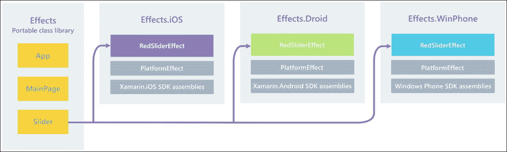

# 第八章. 构建相机应用程序

我们已经到达了一个时代的尽头，学习了使用 `Xamarin` 平台进行跨平台开发的方方面面。

在我们上一章中，我们将介绍 Effects、Triggers 以及它们如何应用于 UI 元素。然后，我们将为每个平台相机构建一个 `CustomRenderer`。本章将涵盖以下主题。

预期知识：

+   `Xamarin.Forms`

+   XAML

+   MVVM

+   C# 线程

+   HashMap 数据结构

+   自定义渲染器

+   `INotifiedPropertyChanged` 框架

在本章中，你将学习以下内容：

+   解决方案设置

+   构建 `MainPageViewModel`

+   改进 `INotifiedPropertyChanged` 实现

+   创建自定义 UI 对象

+   构建 `FocusView`

+   `Xamarin.Forms` 动画

+   `Xamarin.Forms` 复合动画

+   构建 `CameraView`

+   构建 iOS 相机的控件

+   构建 iOS 的 `CameraRenderer`

+   集成 Android Camera2 框架

+   在 Android 中构建 `CameraViewRenderer`

+   通过 `FocusView` 处理原生触摸事件

+   使用 RX 处理事件

+   构建 iOS 的 `VisualElementRenderer`

+   构建 `CustomImageRenderer`

+   构建 `UIImageEffect` 类

+   构建 Android 的 `CustomImageRenderer`

+   触发器

+   平台效果

+   构建 `CameraPage`

+   添加原生方向事件

# 解决方案设置

让我们从创建一个新的 `Xamarin.Forms` 项目并命名为 `Camera` 开始。我们还想创建 `Camera.Portable` 项目。现在我们已经构建了几个 `Xamarin.Forms` 应用程序，我们有很多可重用的部分将跨到这个应用程序中。

从 `Camera.Portable` 项目开始，我们想要复制在 第七章 中使用的 `IoC`、`Extras` 和 `Logging` 文件夹，即 *构建文件存储应用程序*。确保这些文件夹中包含的所有文件都已相应复制。

### 小贴士

不要忘记更新每个代码表中的命名空间。

然后我们想要为每个项目添加以下 NuGet 包：

+   Autofac

+   反应式扩展

接下来，我们想要创建一个名为 **Enums** 的文件夹。添加一个名为 `PageNames.cs` 的新文件夹，并实现以下内容：

```cs
public enum PageNames 
    { 
        #region Properties 

        MainPage, 

        CameraPage, 

        #endregion 
    } 

```

就像我们的其他项目一样，这将在导航设置中使用。在这个文件夹中，我们还想添加另一个名为 `Orientation.cs` 的文件，并实现以下内容：

```cs
public enum Orientation 
    { 
        Portrait, 

        LandscapeLeft, 

        LandscapeRight, 

        None 
    } 

```

这个 `enum` 将与 `CameraPage` 上的方向设置一起使用。每个不同的方向设置都将被处理以调整相机预览表面区域。

我们的下一步是创建一个名为 `UI` 的新文件夹，并复制 `INavigationService.cs`。我们还想添加另一个名为 `AlertArgs.cs` 的文件，并实现以下内容：

```cs
public class AlertArgs : EventArgs 
    { 
        #region Public Properties 

        public string Message { get; set; } 

        public TaskCompletionSource<bool> Tcs { get; set; } 

        #endregion 
    }  

```

前面的类将在我们视图模型中调用的所有警报中使用。我们使用 `TaskCompletionSource` 对象等待触发警报的方法，并为每个警报消息使用 `Message` 对象。

# 构建 `MainPageViewModel` 类

让我们添加`ViewModelBase`类，它将包含`AlertArgs`事件。创建一个名为`ViewModels`的新文件夹，添加一个名为`ViewModelBase.cs`的新文件，并实现以下内容：

```cs
public class ViewModelBase : INotifyPropertyChanged 
    { 
        #region Public Events 

        public event PropertyChangedEventHandler PropertyChanged; 

        public event EventHandler<AlertArgs> Alert; 

        #endregion 

        #region Public Properties 

        public INavigationService Navigation; 

        #endregion 

```

`ViewModelBase`类将与其他`Xamarin.Forms`项目类似。我们有`INotifiedPropertyChanged`要求，另一个用于警报的`EventHandler`，以及用于导航控制的`INavigationService`。

接下来，我们有构造函数：

```cs
       #region Constructor 

        public ViewModelBase(INavigationService navigation, IMethods methods) 
        { 
            Navigation = navigation; 

            _methods = methods; 
        } 

        #endregion 

```

# 改进`INotifiedPropertyChanged`实现

如您从以前的项目中注意到的，我们处理属性更改的标准属性实现看起来如下：

```cs
private string _descriptionMessage = "Take a Picture";  

public string DescriptionMessage 
        { 
            get 
            { 
                return _descriptionMessage; 
            } 

            set 
            { 
                if (value.Equals(_descriptionMessage)) 
                { 
                    return; 
                } 

                _descriptionMessage = value; 
                OnPropertyChanged("DescriptionMessage"); 
            } 
        } 

```

每个公共属性中的重复代码使得我们的视图模型代码看起来比实际要大得多。在你所有的代码表中，一个值得考虑的良好编码实践是如何减少代码行数，尤其是重复代码。以下`SetProperty`函数是一个例子，说明我们如何将 13 行代码转换为仅仅两行：

```cs
        protected void SetProperty<T>(string propertyName,
        ref T referenceProperty, T newProperty) 
        { 
            if (!newProperty.Equals(referenceProperty)) 
            { 
                referenceProperty = newProperty; 
            } 

            OnPropertyChanged(propertyName); 
        } 

```

在所有属性中，我们总是首先检查要分配的值是否与当前值不同，然后再触发`OnPropertyChanged`函数。由于这是一个泛型类型函数，相同的逻辑可以用于所有视图模型上的任何属性。现在`DescriptionMessage`属性将看起来如下：

```cs
public string DescriptionMessage 
        { 
            get { return _descriptionMessage; } 
            set { SetProperty(nameof(DescriptionMessage),
                  ref _descriptionMessage, value); } 
        } 

```

让我们按照以下方式添加剩余的`ViewModelBase`：

```cs
        protected virtual void OnPropertyChanged([CallerMemberName]
        string propertyName = null) 
        { 
            PropertyChangedEventHandler handler = PropertyChanged; 

            if (handler != null) 
            { 
                handler(this, new PropertyChangedEventArgs(propertyName)); 
            } 
        } 

        protected virtual async Task LoadAsync(IDictionary<string, object> parameters) 
        { 
        } 

        #endregion 

        #region Public Methods 

        public Task<bool> NotifyAlert(string message) 
        { 
            var tcs = new TaskCompletionSource<bool>(); 

            Alert?.Invoke(this, new AlertArgs() 
            { 
                Message = message, 
                Tcs = tcs 
            }); 

            return tcs.Task; 
        } 

        public void OnShow(IDictionary<string, object> parameters) 
        { 
            LoadAsync(parameters).ToObservable().Subscribe( 
                result => 
                { 
                    // we can add things to do after we load the view model 
                },  
                ex => 
                { 
                    // we can handle any areas from the load async function 
                }); 
        } 

        #endregion 
    } 

```

前面的函数与之前的实现相同。注意我们是如何触发`Alert`事件的。由于我们现在可以访问 C# 6.0，我们可以将标准空检查转换为以下事件：

```cs
If (Alert != null) 
{ 
Alert(this, new AlertArgs() 
            { 
                Message = message, 
                Tcs = tcs 
            }); 
} 

```

变成这样：

```cs
Alert?.Invoke(this, new AlertArgs() 
            { 
                Message = message, 
                Tcs = tcs 
            }); 

```

它看起来更干净，这意味着我们可以移除所有的`if`语句。

现在让我们添加一个名为`MainPageViewModel.cs`的新文件，并实现以下内容：

```cs
public class MainPageViewModel : ViewModelBase 
    { 
        #region Private Properties 

        private readonly IMethods _methods; 

        private string _descriptionMessage = "Take a Picture"; 

        private string _cameraTitle = "Camera"; 

        private string _exitTitle = "Exit"; 

        private ICommand _cameraCommand; 

        private ICommand _exitCommand; 

        #endregion 
} 

```

与其他`MainPageViewModel`对象一样，`MainPage`布局相同，有两个按钮、一个图像和一个标签。

现在让我们添加`public`属性。我们将为每个`public`属性使用新的`SetProperty`函数：

```cs
        #region Public Properties 

        public string DescriptionMessage 
        { 
            get { return _descriptionMessage; } 
            set { SetProperty(nameof(DescriptionMessage), 
                  ref _descriptionMessage, value); } 
        } 

        public string CameraTitle 
        { 
            get { return _cameraTitle; } 
            set { SetProperty(nameof(CameraTitle), ref _cameraTitle, value); } 
        } 

        public string ExitTitle 
        { 
            get { return _exitTitle; } 
            set { SetProperty(nameof(ExitTitle), ref _exitTitle, value); } 
        } 

        public ICommand CameraCommand 
        { 
            get { return _cameraCommand; } 
            set { SetProperty(nameof(CameraCommand), ref _cameraCommand, value); } 
        } 

        public ICommand ExitCommand 
        { 
            get { return _exitCommand; } 
            set { SetProperty(nameof(ExitCommand), ref _exitCommand, value); } 
        } 

        #endregion 

```

现在对于构造函数，我们将再次使用`Command`工厂来实例化我们的绑定`Command`：

```cs
        #region Constructors 

        public MainPageViewModel (INavigationService navigation, Func<Action, ICommand> commandFactory): base (navigation, methods) 
        { 
            _methods = methods; 

            _exitCommand = commandFactory (async () => 
            { 
                await NotifyAlert("GoodBye!!"); 

                _methods.Exit(); 
            }); 

            _cameraCommand = commandFactory (async () => await Navigation.Navigate(PageNames.CameraPage, null)); 
        } 

        #endregion 

```

现在让我们为`CameraPage`构建下一个视图模型。在`ViewModels`文件夹中添加一个名为`CameraPageViewModel.cs`的新文件，并首先实现私有属性：

```cs
public sealed class CameraPageViewModel : ViewModelBase 
    { 
        #region Private Properties 

        private Orientation _pageOrientation; 

        private byte[] _photoData; 

        private string _loadingMessage = "Loading Camera..." 

        private bool _canCapture; 

        private bool _cameraLoading; 

        private bool _isFlashOn; 

        private bool _photoEditOn; 

        #endregion 

} 

```

`CameraPage`将包含一个`Orientation`属性，用于使用转换器调整`Grid`的行和列。`_photoData`属性将用于记录以字节形式拍摄的图像，我们还将使用这些字节绑定到`ImageSource`。`_loadingMessage`和`_cameraLoading`属性在显示表示原生相机硬件正在忙碌的视图时使用。`_isFlashOn`将用于控制显示闪光灯状态的 UI 元素。`CameraPage`还将有一个表示聚焦目标的图像。最后，`_canCapture`用于确定相机是否已加载并且我们准备好拍照，而`_photoEditOn`用于绑定显示刚刚拍摄的照片的视图的可见性状态。

接下来，我们添加`public`属性；以下有两个以供开始：

```cs
#region Public Properties 

        public bool CanCapture 
        { 
            get { return _canCapture; } 
            set { SetProperty(nameof(CanCapture), ref _canCapture, value); } 
        } 

        public string LoadingMessage 
        { 
            get { return _loadingMessage; } 
            set { SetProperty(nameof(LoadingMessage), ref _loadingMessage, value); } 
        } 

#endregion 

```

添加构造函数如下：

```cs
        #region Constructors and Destructors 

        public CameraPageViewModel(INavigationService navigation, Func<Action, ICommand> commandFactory) : base (navigation, methods) 
        { 
        } 

        #endregion 

```

现在对于`public`函数，我们有`AddPhoto`函数，这个函数将从原生侧以字节形式获取图像，并将`PhotoData`分配给`ImageSource`绑定：

```cs
        public void AddPhoto(byte[] data) 
        { 
            PhotoData = data; 
            PhotoEditOn = true; 
        } 

```

我们还有一个用于重置当前拍摄照片所使用的变量的函数。当`PhotoEditOn`为`false`时，这意味着我们移除了显示当前拍摄照片的视图。当`PhotoData`属性被分配一个空字节数组时，这意味着我们已释放了当前显示的图像数据：

```cs
        public void ResetEditPhoto() 
        { 
            PhotoData = new byte[] { }; 
            PhotoEditOn = false; 
        } 

```

最后，当页面出现和消失时，我们有两个更多函数被调用：

```cs
        public void OnAppear() 
        { 
            CameraLoading = false; 
        } 

        public void OnDisappear() 
        { 
            CameraLoading = true; 
            ResetEditPhoto(); 
        } 

```

`OnAppear`函数简单地重置`CameraLoading`属性为`false`，而`OnDisappear`函数重置整个视图模型；当我们返回到这个页面时，状态与起点相同（即，相机没有加载，没有照片显示）

太棒了！现在我们已经构建了视图模型，让我们为我们的 IoC 容器添加`PortableModule`如下：

```cs
public class PortableModule : IModule 
    { 
        #region Public Methods 

        public void Register(ContainerBuilder builder) 
        { 
            builder.RegisterType<MainPageViewModel> ().SingleInstance(); 
            builder.RegisterType<CameraPageViewModel> ().SingleInstance(); 
        } 

        #endregion 
    }  

```

让我们开始构建用户界面屏幕。

# 创建自定义 UI 对象

回到`Camera`项目，让我们开始添加一个名为`Controls`的新文件夹。添加一个名为`OrientationPage.cs`的新文件，并实现以下内容：

```cs
public class OrientationPage : ContentPage 
    { 
        #region Static Properties 

        public static Orientation PageOrientation; 

        public static event EventHandler<Orientation> OrientationHandler; 

        public static event EventHandler<Point> TouchHandler; 

        #endregion 

        #region Static Methods 

        public static void NotifyOrientationChange(Orientation orientation) 
        { 
            if (OrientationHandler != null) 
            { 
                OrientationHandler (null, orientation); 
            } 
        } 

        public static void NotifyTouch(Point touchPoint) 
        { 
            if (TouchHandler != null) 
            { 
                TouchHandler(null, touchPoint); 
            } 
        } 

        #endregion 
    } 

```

在我们之前的章节中，我们创建了一个`ExtendedContentPage`来处理警报。这次，`ExtendedContentPage`将继承`OrientationPage`，这意味着它将处理方向事件。`CameraPage`将使用这个`OrientationPage`来跟踪方向事件，以调整相机预览区域的大小，并旋转相机视图。

我们下一个控件是`FocusView`。它将被用于自定义渲染目的，以便我们能够在视图平面上记录触摸点（*x*，*y*）坐标。这些触摸点将被用来聚焦到特定的（*x*，*y*）坐标。

我们下一个自定义控件是对`Image`类的扩展。在`Controls`文件夹中添加另一个名为`CustomImage.cs`的文件，并实现以下内容：

```cs
public class CustomImage : View 
    { 
        public static readonly BindableProperty TintColorStringProperty = BindableProperty.Create ((CustomImage o) => o.TintColorString, string.Empty, 
            propertyChanged: (bindable, oldvalue, newValue) =>  
            { 
                var eh = ((CustomImage)bindable).CustomPropertyChanged; 

                if (eh != null) 
                { 
                    eh (bindable, TintColorStringProperty.PropertyName); 
                } 
            }); 

        public string TintColorString 
        { 
            get 
            { 
                return (string)GetValue(TintColorStringProperty); 
            } 
            set 
            { 
                this.SetValue(TintColorStringProperty, value); 
            } 
        } 

        public static readonly BindableProperty TintOnProperty = BindableProperty.Create ((CustomImage o) => o.TintOn, default(bool), 
            propertyChanged: (bindable, oldvalue, newValue) =>  
            { 
                var eh = ((CustomImage)bindable).CustomPropertyChanged; 

                if (eh != null) 
                { 
                    eh (bindable, TintOnProperty.PropertyName); 
                } 
            }); 

        public bool TintOn  
        { 
            get  
            { 
                return (bool)GetValue (TintOnProperty); 
            } 
            set  
            {                  
                SetValue (TintOnProperty, value); 
            } 
        } 
} 

```

这些自定义绑定将用于着色。由于这个视图将用于 `CustomRenderer`，我们将能够访问原生着色功能。这就是我们将在此处添加一些高级技术到我们的 `CustomRenderer` 的地方。

接下来，我们将添加两个额外的自定义绑定。`Path` 属性将用于文件的绝对路径，而 `Aspect` 属性将用于图像的宽高比，这样我们就可以原生地更改图像的宽高比：

```cs
        public static readonly BindableProperty PathProperty = BindableProperty.Create((CustomImage o) => o.Path, default(string), 
            propertyChanged: (bindable, oldvalue, newValue) => 
            { 
                var eh = ((CustomImage)bindable).CustomPropertyChanged; 

                if (eh != null) 
                { 
                    eh (bindable, PathProperty.PropertyName); 
                } 
            }); 

        public string Path 
        { 
            get 
            { 
                return (string)GetValue(PathProperty); 
            } 
            set 
            { 
                SetValue(PathProperty, value); 
            } 
        } 

        public static readonly BindableProperty AspectProperty = BindableProperty.Create((CustomImage o) => o.Aspect, default(Aspect), 
            propertyChanged: (bindable, oldvalue, newValue) => 
            { 
                var eh = ((CustomImage)bindable).CustomPropertyChanged; 

                if (eh != null) 
                { 
                    eh(bindable, AspectProperty.PropertyName); 
                } 
            }); 

        public Aspect Aspect 
        { 
            get 
            { 
                return (Aspect)GetValue(AspectProperty); 
            } 
            set 
            { 
                SetValue(AspectProperty, value); 
            } 
        } 

```

查看每个 `Create` 函数作为最后一个参数传递的委托函数。这将每次属性更改时被调用；来自此委托函数的第一个参数的 `bindable` 对象是本身。我们检索 `CustomPropertyChangedEventHandler` 并触发一个新事件，以表示此对象上的属性已更改。

让我们在 `CustomImage` 类中添加以下内容：

```cs
        public event EventHandler<string> CustomPropertyChanged; 

        protected override void OnPropertyChanged (string propertyName) 
        { 
            base.OnPropertyChanged (propertyName); 

            if (propertyName == 
                CustomImage.TintColorStringProperty.PropertyName || 
                propertyName == CustomImage.TintOnProperty.PropertyName ||  
                propertyName == CustomImage.AspectProperty.PropertyName) 
            { 
                if (CustomPropertyChanged != null)  
                { 
                    this.CustomPropertyChanged (this, propertyName); 
                } 
            } 
        } 
    } 

```

`CustomImage` 类的所有内容到此为止；让我们继续下一个自定义控件。

# 构建 FocusView

`FocusView` 将用作带有目标图像的触摸聚焦点的叠加视图。这将是一个 `CustomRenderer`，因为我们必须使用原生库在触摸点上检索特定的 (*x*, *y*) 坐标。

从在 `Controls` 文件夹中添加一个名为 `FocusView.cs` 的新文件开始，并实现以下内容：

```cs
public sealed class FocusView : RelativeLayout 
    { 
        #region Constant Properties 

        const int IMG_TARGET_BOUND = 100; 

        #endregion 

        #region Private Properties 

        private bool _isAnimating; 

        private bool _startingPointsAssigned; 

        private readonly CustomImage _focalTarget; 

        private Point _pStartingOrientation; 

        private Point _pFlippedOrientation; 

        #endregion 

        #region Public Events 

        public event EventHandler<Point> TouchFocus; 

        #endregion 

} 

```

我们在这里看到的第一部分是两个 `Point` 对象，用于特定 (*x*, *y*) 坐标，作为纵向和横向方向的起始点。这两个点将在视图首次加载时设置。在纵向和横向方向上，这两个点都将设置为视图的中心。我们还有一个 `_startingPointsAssigned` 布尔值，以确保我们只设置一次起始焦点点。

`CustomImage` 对象用于目标图像的实际图像。每次用户触摸以聚焦时，我们将使用着色属性。`_isAnimating` 属性用于跟踪当前动画的进度（每次检测到触摸时，我们将动画图像的缩放）。常量属性用于硬设置目标图像的高度和宽度，我们有两个事件用于检测所有用户触摸事件。

接下来，我们有一个用于方向的公共属性：

```cs
        #region Public Properties 

        public Orientation Orientation; 

        #endregion 

```

# Xamarin.Forms 动画

`Xamarin.Forms` 有多个用于动画视图的功能。我们可以访问以下功能：

+   `FadeTo`：用于动画不透明度（即淡入/淡出）。

+   `RotateTo`：用于动画旋转。

+   `ScaleTo`：用于动画大小。

+   `TranslateTo`：用于动画 (*x*, *y*) 位置。

+   `LayoutTo`：用于动画 *x*, *y*, 宽度和高度。

### 小贴士

避免使用`LayoutTo`函数。Jason Smith（`Xamarin.Forms`的创建者）建议您坚持使用`TranslateTo`。`LayoutTo`的问题在于您调用的`LayoutTo`视图的父视图将不会意识到发生的平移/调整大小，并在下一次布局周期（例如当您旋转设备时）简单地覆盖它。这是因为`LayoutTo`调用与布局调用相同的方法来定位子视图。

现在，我们将使用一些这些动画函数来在用户触摸以聚焦时动画化我们的目标图像。`AnimateFocalTarget`函数将负责在用户每次触摸视图时执行动画。最初，它将改变图像的色调颜色为绿色，然后将（*x*，*y*）坐标平移到起始位置，放大比例，淡入图像，缩小比例，然后等待一秒钟直到色调颜色变回白色：

```cs
#region Private Methods 

        private async Task AnimateFocalTarget(Point touchPoint) 
        { 
            _focalTarget.TintColorString = "#007F00"; 

            await _focalTarget.TranslateTo(touchPoint.X - (IMG_TARGET_BOUND / 2),  
                                     touchPoint.Y - (IMG_TARGET_BOUND / 2), 0).ConfigureAwait(false); 

            await _focalTarget.ScaleTo(1, 0); 

            // fade in 
            await _focalTarget.FadeTo(0.7f, 25); 

            await _focalTarget.ScaleTo(0.5, 250); 

            _focalTarget.TintOn = true; 

            await Task.Delay(1000); 

            _focalTarget.TintColorString = "#FFFFFF"; 

            _isAnimating = false; 
        }  

        #endregion 

```

所有这些等待函数，有没有更简洁的方法？

在很多情况下，您可能需要同时结合多个过渡效果。让我们用复合动画替换前面的动画组合。

# Xamarin.Forms 复合动画

复合动画允许您将多个动画作为一个故事板组合起来。让我们用以下方式替换前面的函数，使用复合动画作为我们的新实现：

```cs
private async Task AnimateFocalTarget(Point touchPoint) 
        { 
            _focalTarget.TintColorString = "#007F00"; 

            var storyboard = new Animation(); 

            var translationX = new Animation(callback: x
             => _focalTarget.TranslationX = x, 
                                          start: touchPoint.X, 
                                          end: touchPoint.X - (IMG_TARGET_BOUND / 2), 
                                          easing: Easing.Linear); 

            var translationY = new Animation(callback: y
             => _focalTarget.TranslationY = y, 
                                          start: touchPoint.Y, 
                                          end: touchPoint.Y - (IMG_TARGET_BOUND / 2), 
                                          easing: Easing.Linear); 

            var scaleFirst = new Animation(callback: o => _focalTarget.Scale = o, 
                                          start: 0.5, 
                                          end: 1, 
                                          easing: Easing.Linear); 

            var fade = new Animation(callback: o => _focalTarget.Opacity = o, 
                                          start: 1, 
                                          end: 0.7f, 
                                          easing: Easing.Linear); 

            var scaleSecond = new Animation(callback: o => _focalTarget.Scale = o, 
                                          start: 1, 
                                          end: 0.5f, 
                                          easing: Easing.Linear); 

            storyboard.Add(0, 0.01, translationX); 
            storyboard.Add(0, 0.01, translationY); 
            storyboard.Add(0, 0.01, scaleFirst); 
            storyboard.Add(0, 0.5, fade); 
            storyboard.Add(0.5, 1, scaleSecond); 

            var tcs = new TaskCompletionSource<bool>(); 

            storyboard.Commit(_focalTarget, "_focalTarget", length: 300, finished: async (arg1, arg2) => 
            { 
                _focalTarget.TintOn = true; 

                await Task.Delay(500); 

                _focalTarget.TintColorString = "#FFFFFF"; 

                _isAnimating = false; 

                tcs.TrySetResult(true); 
            }); 

            await tcs.Task; 
        } 

```

每个`Animation`对象都有我们正在动画化的属性、一个起点和一个终点，以及`easing`（线性、弹入、弹出）。然后，所有`Animation`对象都被添加到故事板中。`Add`函数的前两个参数是特定动画的起始时间和结束时间。最后，我们调用提交，而不是等待`Commit`函数，我们将使用`TaskCompletionSource`对象等待提交完成。`finished`操作在 300 毫秒后调用。

这难道不是比我们之前的实现更优雅吗？

当我们一次需要提交多个动画时，我们应该使用这种方法。

现在，让我们向`FocusView`添加`Reset`函数。这将在发生方向变化时被调用，我们将把聚焦点分配给正确的方向起始点：

```cs
        #region Public Methods 

        public void Reset() 
        { 
            switch (Orientation) 
            { 
                case Orientation.Portrait: 
                    NotifyFocus(_pStartingOrientation); 
                    break; 
                case Orientation.LandscapeLeft: 
                case Orientation.LandscapeRight: 
                    NotifyFocus(_pFlippedOrientation); 
                    break; 
            } 
        } 

```

`NotifyFocus`函数负责控制整个触摸动画；这就是我们将设置`_focalTarget`图像的起始状态、调用`AddFocualTargetImg`函数，然后触发`TouchFocus`事件的地方。此事件将用于通过自定义渲染器聚焦`CameraView`：

```cs
        public void NotifyFocus(Point touchPoint) 
        { 
            if (_isAnimating)  
            { 
                return; 
            } 

            _focalTarget.Opacity = 0.0f; 
            _focalTarget.TintOn = false; 
            _isAnimating = true; 

            Device.BeginInvokeOnMainThread(async () => await AnimateFocalTarget(touchPoint)); 

            TouchFocus?.Invoke (this, touchPoint); 
        } 

```

最后，我们有`SetFocusPoints`函数来分配每个方向（横屏和竖屏）的起始聚焦点。这些起始点将始终是`CameraView`的中心。这是为了确保在每次方向改变时`_focalTarget`图像都在`CameraView`内部居中：

```cs
        public void SetFocusPoints(Point pStart, Point pFlipped) 
        { 
            _pStartingOrientation = pStart; 
            _pFlippedOrientation = pFlipped; 
        } 

        #endregion  

```

对于我们的`FocusView`来说，这就全部了。让我们添加我们的下一个自定义 UI 元素，`CameraView`。

# 构建 CameraView

我们下一个自定义元素是用于渲染原生相机的 UI 对象。让我们在`Controls`文件夹中添加一个名为`CameraView.cs`的新文件，并实现第一部分：

```cs
public sealed class CameraView : ContentView 
    { 
        #region Events 

        public event EventHandler<Orientation> OrientationChange; 

        public event EventHandler<Point> Focus; 

        public event EventHandler<bool> AvailabilityChange; 

        public event EventHandler<bool> OpenCamera; 

        public event EventHandler<bool> Busy; 

        public event EventHandler<bool> Flash; 

        public event EventHandler<bool> Torch; 

        public event EventHandler<bool> Loading; 

        public event EventHandler<byte[]> Photo; 

        public event EventHandler<float> Widths; 

        public event EventHandler Shutter; 

        #endregion 
} 

```

由于我们必须处理来自`Xamarin.Forms`对象的来自原生对象的事件，以便原生对象能够响应，反之亦然，因此有许多事件需要管理。

接下来，我们添加公共属性：

```cs
        #region Public Properties 

        public bool CameraAvailable; 

        public Orientation Orientation; 

        public float CameraButtonContainerWidth = 0f; 

        #endregion 

```

当我们收到`AvailabilityChangeEventHandler`的事件时，第一个`bool`被设置。每次屏幕方向改变时，都会分配`Orientation`属性。

### 小贴士

屏幕方向改变将来自原生端，这些事件将来自`AppDelegate`（iOS）、`MainActivity`（Android）和`MainPage.xaml.cs`（Windows）。

然后，我们有`CameraButtonContainerWidth`，这仅对 iOS 相关，因为我们需要在 iOS 相机方向改变时调整预览层的尺寸。

我们接下来的函数都是用于通知前一个事件：

```cs
        #region Public Methods 

        public void NotifyShutter() 
        { 
            Shutter?.Invoke(this, EventArgs.Empty); 
        } 

        public void NotifyOpenCamera(bool open) 
        { 
            OpenCamera?.Invoke(this, open); 
        } 

        public void NotifyFocus(Point touchPoint) 
        { 
            Focus?.Invoke(this, touchPoint); 
        } 

        public void NotifyBusy(object sender, bool busy) 
        { 
            Busy?.Invoke(this, busy); 
        } 

        public void NotifyOrientationChange(Orientation orientation) 
        { 
            Orientation = orientation; 

            OrientationChange?.Invoke(this, orientation); 
        } 

        public void NotifyAvailability(object sender, bool isAvailable) 
        { 
            CameraAvailable = isAvailable; 

            AvailabilityChange?.Invoke(this, isAvailable); 
        } 

        public void NotifyPhoto(object sender, byte[] imageData) 
        { 
            Photo?.Invoke(this, imageData); 
        } 

        public void NotifyFlash(bool flashOn) 
        { 
            Flash?.Invoke(this, flashOn); 
        } 

  public void NotifyTorch(bool torchOn) 
        { 
            Torch?.Invoke(this, torchOn); 
        } 

        public void NotifyLoading(object sender, bool loading) 
        { 
            Loading?.Invoke(this, loading); 
        } 

        public void NotifyWidths(float cameraButtonContainerWidth) 
        { 
            CameraButtonContainerWidth = cameraButtonContainerWidth; 

            Widths?.Invoke (this, cameraButtonContainerWidth); 
        } 

        #endregion 

```

然后，我们有构造函数：

```cs
        #region Constructors 

        public CameraView() 
        { 
            BackgroundColor = Color.Black; 
        } 

        #endregion 

```

太棒了！现在我们有了构建的最终自定义控件。添加一个新的`ContentView.xaml`，如图所示：


调用`LoadingView.xaml`文件并实现以下内容：

```cs
<?xml version="1.0" encoding="utf-8" ?> 
<ContentView  

    x:Class="Camera.Controls.LoadingView" 

    BackgroundColor="White"> 

    <Grid x:Name="MainLayout" BackgroundColor="Black"> 
        <Grid.RowDefinitions> 
            <RowDefinition Height="*" /> 
        </Grid.RowDefinitions> 

        <Grid.ColumnDefinitions> 
            <ColumnDefinition Width="*"/> 
        </Grid.ColumnDefinitions> 

        <StackLayout Orientation="Vertical" HorizontalOptions="Center" VerticalOptions="Center"  
                Grid.Row="0" Grid.Column="0"> 
            <ActivityIndicator x:Name="ProgressActivity" Color="White" IsRunning="true"  /> 
            <Label x:Name="LoadingLabel" Text="{Binding LoadingMessage}" TextColor="White"/> 
        </StackLayout> 
    </Grid> 
</ContentView> 

```

`FocusView`的布局由一个包含另一个`StackLayout`的`Grid`组成，该`StackLayout`在`Grid`中水平和垂直居中。`StackLayout`包含一个`ActivityIndicator`，每次此视图显示时都会运行，以及一个`Label`用于显示加载信息。

然后，展开`LoadingView.xaml.cs`并实现以下内容：

```cs
   public partial class LoadingView : ContentView 
    { 
        public LoadingView() 
        { 
            InitializeComponent(); 
        } 
    } 

```

此视图将在`CameraPage`中使用。当相机正在加载或处理图像时，整个屏幕将变为黑色，显示`ActivityIndicator`和加载信息，以向用户显示相机正在处理中。

# 构建 iOS 相机控件

现在我们已经在`Xamarin.Forms` PCL 中构建了`CameraView`对象，我们将为 iOS 构建`CustomRenderer`。跳转到**Camera.iOS**项目，添加一个名为`Renderers`的新文件夹，然后添加一个名为`CameraiOS.cs`的新文件，并实现以下私有属性：

```cs
public sealed class CameraIOS : UIView 
    { 
        #region Private Properties 

        private readonly string _tag; 

        private readonly ILogger _log; 

        private readonly AVCaptureVideoPreviewLayer _previewLayer; 

        private readonly AVCaptureSession _captureSession; 

        private UIView _mainView; 

        private AVCaptureDeviceInput _input; 

        private AVCaptureStillImageOutput _output; 

        private AVCaptureConnection _captureConnection; 

        private AVCaptureDevice _device; 

        private bool _cameraBusy; 

        private bool _cameraAvailable; 

        private float _cameraButtonContainerWidth; 

        private float _imgScale = 1.25f; 

        private double _systemVersion; 

        private nint _width; 

        private nint _height; 

 #endregion 
} 

```

`_tag`和`_log`属性将用于所有异常发生时的日志记录。`_previewLayer`用于显示来自相机的视频输入；这将设置为`CameraView`的整个宽度和高度。`_captureSession`与`AVCaptireVideoPreviewLayer`对象一起使用，用于从视频输入捕获图像。`_input`对象与`AVCaptureDevice`和`CaptureSession`一起使用；这提供了视频流输入，`CaptureSession`将使用它来捕获图像。我们还有一个名为`_output`的`AVCaptureStillImageOutput`对象；这用于捕获带有相关元数据的高质量静态图像。

`AVCaptureStillImageOutput` 对象还包含 `AVCaptureConnections`，我们使用它来控制视频流的方向。然后最后，我们有 `_device` 属性，它代表一个物理捕获设备。在我们的例子中，我们将使用后置摄像头。我们将通过其他函数了解剩余属性的使用方法。

接下来，我们必须添加三个事件，当相机忙碌、可用以及拍照时将会通知这些事件：

```cs
   #region Events 

  public event EventHandler<bool> Busy; 

        public event EventHandler<bool> Available; 

        public event EventHandler<byte[]> Photo; 

        #endregion 

```

然后我们有构造函数：

```cs
        #region Constructors 

        public CameraIOS() 
        { 
            _log = IoC.Resolve<ILogger>(); 
            _tag = $"{GetType()} "; 

            // retrieve system version  
            var versionParts = UIDevice.CurrentDevice.SystemVersion.Split ('.'); 
            var versionString = versionParts [0] + "." + versionParts [1]; 
            _systemVersion = Convert.ToDouble (versionString, CultureInfo.InvariantCulture); 

            _mainView = new UIView () { TranslatesAutoresizingMaskIntoConstraints = false }; 
            AutoresizingMask = UIViewAutoresizing.FlexibleMargins; 

            _captureSession = new AVCaptureSession(); 

            _previewLayer = new AVCaptureVideoPreviewLayer(_captureSession) 
            { 
                VideoGravity = AVLayerVideoGravity.Resize 
            }; 

            _mainView.Layer.AddSublayer (_previewLayer); 

            // retrieve camera device if available 
            _cameraAvailable = RetrieveCameraDevice (); 

            Add (_mainView); 

            // set layout constraints for main view 
            AddConstraints (NSLayoutConstraint.FromVisualFormat("V:|[mainView]|", NSLayoutFormatOptions.DirectionLeftToRight, null, new NSDictionary("mainView", _mainView))); 
            AddConstraints (NSLayoutConstraint.FromVisualFormat("H:|[mainView]|", NSLayoutFormatOptions.AlignAllTop, null, new NSDictionary ("mainView", _mainView))); 
        } 

        #endregion 

```

构造函数将从 `IoC` 容器中检索 `ILogger` 对象，并使用 C# 6 将 `_tag` 赋值给类型名称。然后我们检索系统版本信息并创建一个新的 `UIView`。将 `AutoresizingMask` 设置为 `UIViewAutoresizing.FlexibleMargins` 确保了 `CameraiOS` 视图调整到 `CustomRenderer` 的整个边界。然后我们实例化一个新的 `AvCaptureSession` 和一个 `AVCaptureVideoPreviewLayer`，我们将 `AVCaptureSession` 对象传递给新的 `AVCaptureVideoPreviewLayer`，并将此层添加到 `mainView` 层。然后我们使用 `RetrieveCameraDevice` 函数检索物理摄像头设备。

让我们在构造函数下方添加此函数：

```cs
public bool RetrieveCameraDevice() 
        { 
            _device = AVCaptureDevice.DefaultDeviceWithMediaType(AVMediaType.Video); 

            if (_device == null)  
            { 
                _log.WriteLineTime(_tag + "\n" + "RetrieveCameraDevice() No device detected \n "); 

                return false; 
            } 

            return true; 
        } 

```

在这一行，添加以下内容：

```cs
_device = AVCaptureDevice.DefaultDeviceWithMediaType(AVMediaType.Video); 

```

这用于检索物理后视摄像头。

现在让我们回到构造函数。在我们检索到物理设备后，我们只需将 `mainView` 添加到 `CameraiOS` 视图中，并将 `mainView` 的布局约束设置为填充 `CameraiOS` 视图的边界。

然后，我们添加 `private` 函数。我们的第一个函数 `AdjustPreviewLayer` 负责在发生方向变化时设置层的边界以填充 `CameraiOS` 视图：

```cs
        #region Private Methods 

        /// <param name="orientation">Orientation.</param> 
        private void AdjustPreviewLayer(Orientation orientation) 
        { 
            CGRect previewLayerFrame = _previewLayer.Frame; 

            switch (orientation) 
            { 
                case Orientation.Portrait: 
                    previewLayerFrame.Height = UIScreen.MainScreen.Bounds.Height - _cameraButtonContainerWidth; 
                    previewLayerFrame.Width = UIScreen.MainScreen.Bounds.Width; 
                    break; 

                case Orientation.LandscapeLeft: 
                case Orientation.LandscapeRight: 
                    if (_systemVersion >= 8) 
                    { 
                        previewLayerFrame.Width = UIScreen.MainScreen.Bounds.Width - _cameraButtonContainerWidth; 
                        previewLayerFrame.Height = UIScreen.MainScreen.Bounds.Height; 
                    } 
                    else 
                    { 
                        previewLayerFrame.Width = UIScreen.MainScreen.Bounds.Height - _cameraButtonContainerWidth; 
                        previewLayerFrame.Height = UIScreen.MainScreen.Bounds.Width; 
                    } 
                    break; 
            } 

            try 
            { 
                _previewLayer.Frame = previewLayerFrame; 
            } 
            catch (Exception error) 
            { 
                _log.WriteLineTime(_tag + "\n" + 
                    "AdjustPreviewLayer() Failed to adjust frame \n " + 
                    "ErrorMessage: \n" + 
                    error.Message + "\n" + 
                    "Stacktrace: \n " + 
                    error.StackTrace); 
            } 
        } 

```

我们还需要一个用于设置起始方向的函数：

```cs
        private void SetStartOrientation() 
        { 
            Orientation sOrientation = Orientation.None; 

            switch (UIApplication.SharedApplication.StatusBarOrientation) 
            { 
                case UIInterfaceOrientation.Portrait: 
                case UIInterfaceOrientation.PortraitUpsideDown: 
                    sOrientation = Orientation.Portrait; 
                    break; 
                case UIInterfaceOrientation.LandscapeLeft: 
                    sOrientation = Orientation.LandscapeLeft; 
                    break; 
                case UIInterfaceOrientation.LandscapeRight: 
                    sOrientation = Orientation.LandscapeRight; 
                    break; 
            } 

            HandleOrientationChange(sOrientation); 
        } 

```

然后我们有 `SetBusy` 函数，它将调用 `Busy` EventHandler 并设置 `private` 变量以保持忙碌状态：

```cs
        private void SetBusy(bool busy) 
        { 
            _cameraBusy = busy; 

            // set camera busy  
            Busy?.Invoke(this, _cameraBusy); 
        } 

```

接下来，我们有 `CaptureImageWithMetadata` 函数。每次用户点击拍照时都会调用此函数（此函数将从公共方法 `TakePhoto` 调用）。当我们调用 `CaptureImageWithMetadata` 函数时，我们必须传递一个 `AVCaptureStillImageOutput` 对象和一个 `AVCaptureConnection`。从 `AVCaptureStillImageOutput` 对象中，我们在 `AVCaptureConnection` 上调用 `CaptureStillImageTaskAsync` 函数。我们传递的连接与 `_previewLayer` 连接相关联。在此调用成功后，我们检索原始图像作为 JPEG 并检索原始字节数据以调用 `Photo` EventHandler。我们还使用 `RotateImage` 函数将原始 `UIImage` 图像旋转到正确的方向：

```cs
        private async Task CaptureImageWithMetadata(AVCaptureStillImageOutput captureStillImageOutput, AVCaptureConnection connection) 
        { 
            var sampleBuffer = await captureStillImageOutput.CaptureStillImageTaskAsync(connection); 
            var imageData = AVCaptureStillImageOutput.JpegStillToNSData(sampleBuffer); 
            var image = UIImage.LoadFromData(imageData); 

            RotateImage(ref image); 

            try 
            { 
                byte[] imgData = image.AsJPEG().ToArray(); 

                if (Photo != null) 
                { 
                    Photo(this, imgData); 
                } 
            } 
            catch (Exception error) 
            { 
                _log.WriteLineTime(_tag + "\n" + 
                    "CaptureImageWithMetadata() Failed to take photo \n " + 
                    "ErrorMessage: \n" + 
                    error.Message + "\n" + 
                    "Stacktrace: \n " + 
                    error.StackTrace); 
            } 
        } 

        #endregion
```

让我们添加 `RotateImage` 函数：

```cs

private void RotateImage(ref UIImage image) 
        { 
            CGImage imgRef = image.CGImage; 
            CGAffineTransform transform = CGAffineTransform.MakeIdentity(); 

            var imgHeight = imgRef.Height * _imgScale; 
            var imgWidth = imgRef.Width * _imgScale; 

            CGRect bounds = new CGRect(0, 0, imgWidth, imgHeight); 
            CGSize imageSize = new CGSize(imgWidth, imgHeight); 
            UIImageOrientation orient = image.Orientation; 

            switch (orient) 
            { 
                case UIImageOrientation.Up: 
                    transform = CGAffineTransform.MakeIdentity(); 
                    break; 
                case UIImageOrientation.Down: 
                    transform = CGAffineTransform.MakeTranslation (imageSize.Width, imageSize.Height); 
                    transform = CGAffineTransform.Rotate(transform, (float)Math.PI); 
                    break; 
                case UIImageOrientation.Right: 
                    bounds.Size = new CGSize( bounds.Size.Height, bounds.Size.Width); 
                    transform = CGAffineTransform.MakeTranslation(imageSize.Height, 0); 
                    transform = CGAffineTransform.Rotate(transform, (float)Math.PI / 2.0f); 
                    break; 
                default: 
                    throw new Exception("Invalid image orientation");                         
            } 

            UIGraphics.BeginImageContext(bounds.Size); 
            CGContext context = UIGraphics.GetCurrentContext(); 

            if (orient == UIImageOrientation.Right) 
            { 
                context.ScaleCTM(-1, 1); 
                context.TranslateCTM(-imgHeight, 0); 
            } 
            else 
            { 
                context.ScaleCTM(1, -1); 
                context.TranslateCTM(0, -imgHeight); 
            } 

            context.ConcatCTM(transform); 

            context.DrawImage(new CGRect(0, 0, imgWidth, imgHeight), imgRef); 
            image = UIGraphics.GetImageFromCurrentImageContext(); 
            UIGraphics.EndImageContext(); 
        } 

```

在前面的函数中，我们使用`UIGraphics`上下文来重建和旋转`UIImage`图像。我们从一个新的`CGImage`开始，从原始的`UIImage`中获取方向，然后转换这个图像，接着使用`UIGraphics.GetImageFromCurrentImageContext()`方法重新绘制。

现在我们添加公共方法。首先重写`Draw`函数，以便我们可以将最新的帧分配给`_previewLayer`。`Draw`函数在屏幕旋转时被调用。我们想要确保`_previewLayer`的帧填充屏幕的边界：

```cs
        public override void Draw(CGRect rect) 
        { 
            _previewLayer.Frame = rect; 

            base.Draw(rect); 
        } 

```

接下来，我们有`TakePhoto`函数。这个函数将从`AVCaptureStillImageOutput`中检索当前的`AVCaptureConnection`，将连接的方向设置为`_previewLayer`的方向，并将连接和输出传递给`CaptureImageWithMetadata`函数：

```cs
        public async Task TakePhoto() 
        { 
            if (!_cameraBusy)  
            { 
                SetBusy(true); 

                try  
                { 
                    // set output orientation 
                    _output.Connections [0].VideoOrientation = _previewLayer.Orientation; 

                    var connection = _output.Connections[0]; 

                    await CaptureImageWithMetadata(_output, connection); 

                    SetBusy(false); 
                } 
                catch (Exception error) 
                { 
                    _log.WriteLineTime(_tag + "\n" + 
                        "TakePhoto() Error with camera output capture \n " + 
                        "ErrorMessage: \n" + 
                        error.Message + "\n" + 
                        "Stacktrace: \n " + 
                        error.StackTrace); 

                    IoC.Resolve<ILogger>().WriteLineTime  ("CameraIOS: Error with camera output capture - " + e); 
                } 
            } 
        } 

```

### 注意

不要忘记查看所有函数的异常处理。在处理相机硬件时，有时可能会出现奇怪的错误（空连接、设备检索失败），因此我们必须处理可能发生的所有异常。

接下来，我们有`SwitchFlash`函数，它用于通过`AVCaptureDevice`配置来打开/关闭闪光灯：

```cs
        public void SwitchFlash(bool flashOn) 
        { 
            NSError err; 

            if (_cameraAvailable && _device != null)  
            { 
                try  
                { 
                    _device.LockForConfiguration(out err); 
                    _device.TorchMode = flashOn ? AVCaptureTorchMode.On : AVCaptureTorchMode.Off; 
                    _device.UnlockForConfiguration(); 
                }  
                catch (Exception error)  
                { 
                    _log.WriteLineTime(_tag + "\n" + 
                        "SwitchFlash() Failed to switch flash on/off \n " + 
                        "ErrorMessage: \n" + 
                        error.Message + "\n" + 
                        "Stacktrace: \n " + 
                        error.StackTrace); 
                } 
            } 
        } 

```

然后我们有`SetBounds`函数。这个函数是从`CustomRenderer`的`OnElementPropertyChanged`方法中调用的，在任何高度和属性更改时都会调用：

```cs
        public void SetBounds(nint width, nint height) 
        { 
            _height = height; 
            _width = width; 
        } 

```

`ChangeFocusPoint`函数用于将相机聚焦到从用户接收到的触摸点上。首先，我们必须在做出任何更改之前锁定`AVCaptureDevice`配置。

### 提示

当我们更改`AVCaptureDevice`配置时，我们必须首先调用`LockForConfiguration`来通知设备我们正在做出更改，然后，一旦我们完成，调用`UnlockForConfiguration`以使更改生效。

然后我们检查`FocusPointOfInterestSupported`是否为`true`，并将`FocusPointOfInterest`设置为一个新的`CGRect`点。我们同样通过首先检查`ExposurePointOfInterestSupported`是否为`true`，并将`ExposurePointOfInterest`设置为一个新的`CGRect`点来进行曝光：

```cs
        public void ChangeFocusPoint(Point fPoint) 
        { 
            NSError err; 

            if (_cameraAvailable && _device != null)  
            { 
                try  
                { 
                    _device.LockForConfiguration(out err); 

                    var focus_x = fPoint.X / Bounds.Width; 
                    var focus_y = fPoint.Y / Bounds.Height; 

                    // set focus point 
                    if (_device.FocusPointOfInterestSupported) 
                        _device.FocusPointOfInterest =
                        new CGPoint(focus_x, focus_y); 
                    if (_device.ExposurePointOfInterestSupported) 
                        _device.ExposurePointOfInterest =
                        new CGPoint(focus_x, focus_y); 

                    _device.UnlockForConfiguration(); 
                }  
                catch (Exception error)  
                { 
                    _log.WriteLineTime(_tag + "\n" + 
                        "SwitchFlash() Failed to adjust focus \n " + 
                        "ErrorMessage: \n" + 
                        error.Message + "\n" + 
                        "Stacktrace: \n " + 
                        error.StackTrace); 
                } 
            } 
        } 

```

我们下一个函数是`InitializeCamera`，我们用它来设置`AVCaptureDevice`。我们将焦点模式设置为`ContinuousAuto`，并使用`AVCaptureDevice`的实例创建一个新的`AVCaptureDeviceInput`。然后我们创建一个新的`AvCaptureStillImageOutput`对象。`AVCaptureDeviceInput`和`AvCaptureStillImageOutput`对象分别被分配给`AVCaptureSession`的输入/输出。之后，我们创建一个新的`NSDictionary`，使用键来设置视频编解码器为 JPEG（所有拍摄的照片都将采用这种格式）。最后，从`_previewLayer`检索`Connection`对象，根据起始方向进行设置，并在`AVCaptureSession`上调用`StartRunning`方法：

```cs
        public void InitializeCamera() 
        { 
            try  
            { 
                NSError error; 
                NSError err; 

                _device.LockForConfiguration(out err); 
                _device.FocusMode = AVCaptureFocusMode.ContinuousAutoFocus; 
                _device.UnlockForConfiguration(); 

                _input = new AVCaptureDeviceInput(_device, out error); 
                _captureSession.AddInput(_input); 

                _output = new AVCaptureStillImageOutput(); 

                var dict = new NSMutableDictionary(); 
                dict[AVVideo.CodecKey] = new NSNumber((int) AVVideoCodec.JPEG); 
                _captureSession.AddOutput (_output); 

                InvokeOnMainThread(delegate  
                    { 
                        // capture connection used for rotating camera 
                        _captureConnection = _previewLayer.Connection; 
                        SetStartOrientation(); 
                        // set orientation before loading camera 
                        _captureSession.StartRunning (); 
                    }); 
            } 
            catch (Exception error)  
            { 
                _log.WriteLineTime(_tag + "\n" + 
                    "InitializeCamera() Camera failed to initialise \n " + 
                    "ErrorMessage: \n" + 
                    error.Message + "\n" + 
                    "Stacktrace: \n " + 
                    error.StackTrace);     
            } 

            Available?.Invoke(this, _cameraAvailable); 

            _log.WriteLineTime(_tag + "\n" + "RetrieveCameraDevice() Camera initalised \n "); 
        } 

```

我们下一个函数是`SetWidths`，它将相应地分配局部`_cameraButtonConatinerWidth`属性。这个`local`属性被用作对相机流宽度的额外减少，以确保相机流不会落后于`CameraPage`上的黑色按钮面板：

```cs
        public void SetWidths(float cameraButtonContainerWidth) 
        { 
            _cameraButtonContainerWidth = cameraButtonContainerWidth; 
        } 

```

接下来，最后一个函数是`HandleOrientationChange`，每次发生方向变化时，`CustomRenderer`都会调用它，因为我们必须更新`AVCaptureConnection`对象的`VideoOrientation`属性。

### 小贴士

尽管 Xamarin.Forms 会自动为您处理视图的朝向变化，但使用这个`CustomRenderer`视图时，除非我们更改底层的`CALayers`，否则`AVCaptureVideoPreviewLayer`的视频流不会旋转。

```cs
public void HandleOrientationChange(Orientation orientation)
 {
 if (_captureConnection != null)
 {
 switch (orientation)
 {
 case Orientation.Portrait: _captureConnection.VideoOrientation = AVCaptureVideoOrientation.Portrait;
 break;
 case Orientation.LandscapeLeft: _captureConnection.VideoOrientation = AVCaptureVideoOrientation.LandscapeLeft;
 break;
 case Orientation.LandscapeRight: _captureConnection.VideoOrientation = AVCaptureVideoOrientation.LandscapeRight;
 break;
 }
 }
 AdjustPreviewLayer(orientation);
 }
```

最后，我们有`StopAndDispose`方法。这个方法将从`CustomRenderer`的`Dipose`方法中被调用。它负责释放与相机流相关的所有资源，并在开启的情况下关闭闪光灯：

```cs
public void StopAndDispose()
 {
 if (_device != null)
 {
 // if flash is on turn off if (_device.TorchMode == AVCaptureTorchMode.On)
 {
 SwitchFlash(false);
 }
 }
 _captureSession.StopRunning();
 // dispose output elements _input.Dispose();
 _output.Dispose();
 }
 #endregion
 }
```

干得好！现在我们已经构建了原生相机控制，我们将使用它作为 CustomRenderer 的控制。

# 构建 iOS CameraRenderer

现在，让我们创建实际的`CustomRenderer`，它将使用这个自定义 iOS 对象。在**Renderers** | **CameraView**中添加一个新文件，命名为`CameraViewRenderer.cs`，并实现以下内容：

```cs
public class CameraViewRenderer : ViewRenderer<CameraView, CameraIOS> 
    { 
        #region Private Properties 

        private CameraIOS bodyshopCameraIOS; 

        #endregion 

        #region Protected Methods 

        protected override void OnElementChanged(ElementChangedEventArgs<CameraView> e) 
        { 
            base.OnElementChanged(e); 

            if (Control == null) 
            { 
                bodyshopCameraIOS = new CameraIOS(); 

                bodyshopCameraIOS.Busy += Element.NotifyBusy; 
                bodyshopCameraIOS.Available += Element.NotifyAvailability; 
                bodyshopCameraIOS.Photo += Element.NotifyPhoto; 

                SetNativeControl(bodyshopCameraIOS); 
            } 

            if (e.OldElement != null) 
            { 
                e.NewElement.Flash -= HandleFlash; 
                e.NewElement.OpenCamera -= HandleCameraInitialisation; 
                e.NewElement.Focus -= HandleFocus; 
                e.NewElement.Shutter -= HandleShutter; 
                e.NewElement.Widths -= HandleWidths; 

                bodyshopCameraIOS.Busy -= Element.NotifyBusy; 
                bodyshopCameraIOS.Available -= Element.NotifyAvailability; 
                bodyshopCameraIOS.Photo -= Element.NotifyPhoto; 
            } 

            if (e.NewElement != null) 
            { 
                e.NewElement.Flash += HandleFlash; 
                e.NewElement.OpenCamera += HandleCameraInitialisation; 
                e.NewElement.Focus += HandleFocus; 
                e.NewElement.Shutter += HandleShutter; 
                e.NewElement.Widths += HandleWidths; 
            } 
        } 

        #endregion 

} 

```

我们`CustomRenderer`的第一部分显示了`OnElementChanged`的覆盖实现。在所有自定义渲染器中，`OnElementChanged`函数可能会被多次调用，因此必须小心避免可能导致性能影响的任何内存泄漏。以下是需要采取的方法：

```cs
protected override void OnElementChanged (ElementChangedEventArgs<NativeListView> e) 
{ 
base.OnElementChanged (e); 

if (Control == null) { 
// Instantiate the native control 
} 

if (e.OldElement != null) { 
// Unsubscribe from event handlers and cleanup any resources 
} 

if (e.NewElement != null) { 
        // Configure the control and subscribe to event handlers 
    } 
} 

```

现在回到`OnElementChanged`的实现，我们实例化一个新的`CameraiOS`，并将事件处理程序注册到`Xamarin.Forms`的`CameraView`函数上。这将触发另一个事件，该事件将在我们的`CameraPage`上被处理。然后我们调用`SetNativeControl`将`CameraiOS`对象分配给`CustomRenderer`控制，这样当`CameraView`对象在`ContentPage`上显示时，一个`CameraiOS`视图将出现在顶部。然后我们在两个 if 块中注册和注销事件，以正确地释放和分配`CameraView`的事件处理程序。

让我们添加`OnElementPropertyChanged`的下一个覆盖实现如下：

```cs
        protected override void OnElementPropertyChanged(object sender, System.ComponentModel.PropertyChangedEventArgs e) 
        { 
            base.OnElementPropertyChanged(sender, e); 

            if (Element != null && bodyshopCameraIOS != null) 
            { 
                if (e.PropertyName == VisualElement.HeightProperty.PropertyName || 
                    e.PropertyName == VisualElement.WidthProperty.PropertyName) 
                { 
                    bodyshopCameraIOS.SetBounds((nint)Element.Width, (nint)Element.Height); 
                } 
            } 
        } 

```

这个函数将在`CameraView`的每个属性更改时被调用。我们将调用`CameraiOS`对象的`SetBounds`方法，以确保我们的`AVCapturePreviewVideoLayer`始终保留最新的高度和宽度更新。

现在，我们必须添加以下`EventHandler`函数：

```cs
        #region Private Methods 

        private void HandleWidths (object sender, float e) 
        { 
            bodyshopCameraIOS.SetWidths (e); 
        } 

        private async void HandleShutter (object sender, EventArgs e) 
        { 
            await bodyshopCameraIOS.TakePhoto (); 
        } 

        private void HandleOrientationChange (object sender, Orientation e) 
        { 
            bodyshopCameraIOS.HandleOrientationChange (e); 
        } 

        private void HandleFocus (object sender, Point e) 
        { 
            bodyshopCameraIOS.ChangeFocusPoint (e); 
        } 

        private void HandleCameraInitialisation (object sender, bool args) 
        { 
            bodyshopCameraIOS.InitializeCamera(); 

            Element.OrientationChange += HandleOrientationChange; 
        } 

        private void HandleFlash (object sender, bool args) 
        { 
            bodyshopCameraIOS.SwitchFlash (args); 
        } 

        private void HandleFocusChange (object sender, Point args) 
        { 
            bodyshopCameraIOS.ChangeFocusPoint (args); 
        } 

        #endregion 
    } 

```

所有这些函数都将响应从`CameraView`发出的事件，并调用它们各自的本地函数来处理原生相机的控制。

现在我们已经实现了 iOS 相机的控制，让我们为 Android 做同样的操作。

# 集成 Android Camera2 框架

新的 `Camera2` 框架在 API 21（5.0 Lollipop）中引入，为控制连接到任何 Android 设备的相机设备提供了一个功能丰富的框架。

首先，在 `Camera.Droid` 项目中设置文件夹结构 **Renderers** | **CameraView**。在 `CameraView` 文件夹内，添加一个名为 `CameraCaptureListener.cs` 的文件，并实现以下内容：

```cs
public class CameraCaptureListener : CameraCaptureSession.CaptureCallback 
    { 
        public event EventHandler PhotoComplete; 

        public override void OnCaptureCompleted(CameraCaptureSession session, CaptureRequest request,  
                    TotalCaptureResult result) 
        { 
            PhotoComplete?.Invoke(this, EventArgs.Empty); 
        } 
    } 

```

我们需要做的只是每次调用 `OnCaptureCompleted` 函数时触发一个事件。这个函数在所有图像捕获处理完成后被调用。

接下来，我们必须创建一个回调来接收有关相机捕获会话状态的更新。我们将监听 `OnConfigured` 和 `OnConfigureFailed`，并触发两个不同的事件，以便我们可以处理可能发生的任何配置错误：

```cs
public class CameraCaptureStateListener : CameraCaptureSession.StateCallback 
    { 
        public Action<CameraCaptureSession> OnConfigureFailedAction; 

        public Action<CameraCaptureSession> OnConfiguredAction; 

        public override void OnConfigureFailed(CameraCaptureSession session) 
        { 
            if (OnConfigureFailedAction != null) 
            { 
                OnConfigureFailedAction(session); 
            } 
        } 

        public override void OnConfigured(CameraCaptureSession session) 
        { 
            if (OnConfiguredAction != null) 
            { 
                OnConfiguredAction(session); 
            } 
        } 
    } 

```

我们下一个类是另一个回调，用于接收有关相机设备状态的更新。在这里，我们将触发相机可用性事件，以便我们可以将原生相机的可用状态传递到 `Xamarin.Forms` 项目中的 `CameraView` 视图：

```cs
public class CameraStateListener : CameraDevice.StateCallback 
    { 
        public CameraDroid Camera; 

        public override void OnOpened(CameraDevice camera) 
        { 
            if (Camera != null) 
            { 
                Camera.cameraDevice = camera; 
                Camera.StartPreview(); 
                Camera.OpeningCamera = false; 

                Camera?.NotifyAvailable(true); 
            } 
        } 

        public override void OnDisconnected(CameraDevice camera) 
        { 
            if (Camera != null) 
            { 
                camera.Close(); 
                Camera.cameraDevice = null; 
                Camera.OpeningCamera = false; 

                Camera?.NotifyAvailable(false); 
            } 
        } 

        public override void OnError(CameraDevice camera, CameraError error) 
        { 
            camera.Close(); 

            if (Camera != null) 
            { 
                Camera.cameraDevice = null; 
                Camera.OpeningCamera = false; 

                Camera?.NotifyAvailable(false); 
            } 
        } 
    } 

```

### 注意

所有新的 `Camera2` 回调对象都提供了出色的控制以及错误处理。

`CameraDroid` 类将在 `CustomRenderer` 之上渲染，这相当于 `CameraiOS` 对象。我们希望将 `CameraDroid` 类的实例传递给 `CameraStateListener`，当相机状态改变时，我们在 `CameraDroid` 实例上更新可用状态。

接下来，我们必须添加另一个回调实例来处理图像可用性。这就是原始图像字节将来自的地方。添加一个名为 `ImageAvailableListener.cs` 的新文件，并实现以下内容：

```cs
public class ImageAvailableListener : Java.Lang.Object, ImageReader.IOnImageAvailableListener 
    { 
        public event EventHandler<byte[]> Photo; 

        public void OnImageAvailable(ImageReader reader) 
        { 
            Image image = null; 

            try 
            { 
                image = reader.AcquireLatestImage(); 
                ByteBuffer buffer = image.GetPlanes()[0].Buffer; 
                byte[] imageData = new byte[buffer.Capacity()]; 
                buffer.Get(imageData); 

                Photo?.Invoke(this, imageData); 
            } 
            catch (Exception ex) 
            { 
            } 
            finally 
            { 
                if (image != null) 
                { 
                    image.Close(); 
                } 
            } 
        } 
    } 

```

当调用 `OnImageAvailable` 函数时，这意味着我们有可用的原始图像。我们在 `ImageReader` 对象上调用 `AcquireLatestImage` 以获取最后拍摄的图像，将原始字节拉入一个 `ByteBuffer`，并将 `ByteBuffer` 转换为字节数组。

### 注意

`ByteBuffer` 来自 `Java.Lang` 框架，我们在需要实现快速低级 I/O 时使用它。

现在是时候实现 `CameraDroid` 类了。添加一个名为 `CameraDroid.cs` 的新文件，并实现以下内容：

```cs
public class CameraDroid : FrameLayout, TextureView.ISurfaceTextureListener 
    { 
        #region Static Properties 

        private static readonly SparseIntArray ORIENTATIONS = new SparseIntArray(); 

        #endregion 

        #region Public Events 

        public event EventHandler<bool> Busy; 

        public event EventHandler<bool> Available; 

        public event EventHandler<byte[]> Photo; 

        #endregion 

} 

```

`CameraDroid` 类继承自 `FrameLayout` 和 `TextureView.ISurfaceTextureListener`。静态属性 `ORIENTATIONS` 是一个 `SpareIntArray`，它的工作方式类似于 `HashMap`，但它只能将整数映射到整数。这将用于拍照时。我们必须根据屏幕方向旋转图像，以便图片方向正确显示。

我们也有三个事件处理器，类似于我们的 `CameraiOS`，用于跟踪相机是否已拍照、是否忙碌或是否可用。

接下来，我们有以下 `private` 属性：

```cs
#region Private Properties 

        private readonly string _tag; 

        private readonly ILogger _log; 

        private CameraStateListener mStateListener; 

        private CaptureRequest.Builder _previewBuilder; 

        private CameraCaptureSession _previewSession; 

        private SurfaceTexture _viewSurface; 

        private TextureView _cameraTexture; 

        private MediaActionSound mediaSound; 

        private Android.Util.Size _previewSize; 

        private Context _context; 

        private CameraManager _manager; 

        private bool _mediaSoundLoaded; 

        private bool _openingCamera; 

        #endregion 

```

`_tag` 和 `_log` 属性用于记录，就像我们的其他类一样。我们还将包括所有回调的实例。

然后我们有`public`属性。每次将`OpeningCamera`属性赋值时，它都会触发一个`Busy`事件。现在我们可以在包含`CameraView`的`CameraPage`内部跟踪相机的忙碌状态。我们还有一个`CameraDevice`实例，它代表实际的设备：

```cs
        #region Public Properties 

        public bool OpeningCamera 
        { 
            get 
            { 
                return _openingCamera; 
            } 
            set 
            { 
                if (_openingCamera != value) 
                { 
                    _openingCamera = value; 
                    Busy?.Invoke(this, value); 
                } 
            } 
        } 

        public CameraDevice cameraDevice; 

        #endregion 

```

接下来，我们有构造函数。我们首先必须传入上下文，因为我们将在类内部使用它。然后调用`LoadShutterSound`函数，该函数在声音加载完毕后会返回一个布尔值。然后我们从`IoC`容器中分配`_log`，并使用 C# 6 的`GetType`方法设置`_tag`。使用`LayoutInflator`，我们创建一个新的`CameraLayout`并设置本地的`_cameraTexture`对象。`_cameraTexture`的`SurfaceTextureListener`属性必须设置为`CameraDroid`实例本身。这就是为什么`CameraDroid`类实现了`TextureView.ISurfaceTextureListener`框架。然后我们实例化一个新的`CameraStateListener`，使用`this`关键字将`Camera`属性设置为`CameraDroid`实例，并添加方向到旋转映射：

```cs
        #region Constructors 

        public CameraDroid (Context context) : base (context) 
        { 
            _context = context; 
            _mediaSoundLoaded = LoadShutterSound (); 

            _log = IoC.Resolve<ILogger>(); 
            _tag = $"{GetType()} "; 

            var inflater = LayoutInflater.FromContext (context); 

            if (inflater != null) 
            { 
                var view = inflater.Inflate(Resource.Layout.CameraLayout, this); 

                _cameraTexture = view.FindViewById<TextureView>(Resource.Id.CameraTexture); 
                _cameraTexture.SurfaceTextureListener = this; 

                mStateListener = new CameraStateListener() { Camera = this }; 

                ORIENTATIONS.Append((int)SurfaceOrientation.Rotation0, 90); 
                ORIENTATIONS.Append((int)SurfaceOrientation.Rotation90, 0); 
                ORIENTATIONS.Append((int)SurfaceOrientation.Rotation180, 270); 
                ORIENTATIONS.Append((int)SurfaceOrientation.Rotation270, 180); 
            } 
        } 

        #endregion 

```

现在让我们转到`private`方法。我们将从`UpdatePreview`开始。这个函数负责通过表面纹理启动视频流。如果我们同时有一个会话和相机对象，我们使用`CameraRequest.Builder`实例将捕获请求模式设置为自动。创建的`Handler`对象需要运行在主 UI 线程上的`CameraPreview`：

```cs
        #region Private Methods 

        private void UpdatePreview() 
        { 
            if (cameraDevice != null && _previewSession != null) 
            { 
                try 
                { 
                    // The camera preview can be run in a background thread. This is a Handler for the camere preview 
                    _previewBuilder.Set(CaptureRequest.ControlMode, new Java.Lang.Integer((int)ControlMode.Auto)); 
                    HandlerThread thread = new HandlerThread("CameraPreview"); 
                    thread.Start(); 
                    Handler backgroundHandler = new Handler(thread.Looper); 

                    // Finally, we start displaying the camera preview 
                    _previewSession.SetRepeatingRequest(_previewBuilder.Build(), null, backgroundHandler); 
                } 
                catch (CameraAccessException error) 
                { 
                    _log.WriteLineTime(_tag + "\n" + 
                        "UpdatePreview() Camera access exception.  \n " + 
                        "ErrorMessage: \n" + 
                        error.Message + "\n" + 
                        "Stacktrace: \n " + 
                        error.StackTrace); 
                } 
                catch (IllegalStateException error) 
                { 
                    _log.WriteLineTime(_tag + "\n" + 
                        "UpdatePreview() Illegal exception.  \n " + 
                        "ErrorMessage: \n" + 
                        error.Message + "\n" + 
                        "Stacktrace: \n " + 
                        error.StackTrace); 
                } 
            } 
        } 

```

我们下一个函数负责加载点击声音。在构造函数中使用了`LoadShutterSound`方法。当它返回`true`时，这意味着我们已经成功加载了`MediaActionSoundType.ShutterClick`，所以每次用户拍照时，快门声音都会播放：

```cs
        private bool LoadShutterSound() 
        { 
            try  
            { 
                mediaSound = new MediaActionSound (); 
                mediaSound.LoadAsync (MediaActionSoundType.ShutterClick); 

                return true; 
            } 
            catch (Java.Lang.Exception error)  
            { 
                _log.WriteLineTime(_tag + "\n" + 
                    "LoadShutterSound() Error loading shutter sound  \n " + 
                    "ErrorMessage: \n" + 
                    error.Message + "\n" + 
                    "Stacktrace: \n " + 
                    error.StackTrace); 
            } 

            return false; 
        } 

        #endregion 

```

现在我们继续到`public`方法。当`CameraPage`出现时，我们首先会调用`OpenCamera`函数：

```cs
        #region Public Methods 

        public void OpenCamera() 
        { 
            if (_context== null || OpeningCamera) 
            { 
                return; 
            } 

            OpeningCamera = true; 

            _manager = (CameraManager)_context.GetSystemService(Context.CameraService); 

            try 
            { 
                string cameraId = _manager.GetCameraIdList()[0]; 

                // To get a list of available sizes of camera preview, we retrieve an instance of 
                // StreamConfigurationMap from CameraCharacteristics 
                CameraCharacteristics characteristics = _manager.GetCameraCharacteristics(cameraId); 
                StreamConfigurationMap map = (StreamConfigurationMap)characteristics.Get(CameraCharacteristics.ScalerStreamConfigurationMap); 
                _previewSize = map.GetOutputSizes(Java.Lang.Class.FromType(typeof(SurfaceTexture)))[0]; 
                Android.Content.Res.Orientation orientation = Resources.Configuration.Orientation; 
                if (orientation == Android.Content.Res.Orientation.Landscape) 
                { 
                    _cameraTexture.SetAspectRatio(_previewSize.Width, _previewSize.Height); 
                } 
                else 
                { 
                    _cameraTexture.SetAspectRatio(_previewSize.Height, _previewSize.Width); 
                } 

                // We are opening the camera with a listener. When it is ready, OnOpened of mStateListener is called. 
                _manager.OpenCamera(cameraId, mStateListener, null); 
            } 
            catch (Java.Lang.Exception error) 
            { 
                _log.WriteLineTime(_tag + "\n" + 
                    "OpenCamera() Failed to open camera  \n " + 
                    "ErrorMessage: \n" + 
                    error.Message + "\n" + 
                    "Stacktrace: \n " + 
                    error.StackTrace); 

                Available?.Invoke(this, false); 
            } 
        } 

```

在打开相机之前，我们首先检查`_context`是否为空，以及我们是否已经在打开相机。然后我们将`OpeningCamera`标志设置为 true，并使用`GetSystemService`方法从上下文中检索相机设备。

### 注意

`GetSystemService`方法可以用来检索所有硬件服务。

现在我们有了`CameraManager`对象，我们调用`GetCameraIdList`方法并从列表中检索第一个相机 ID。我们使用这个相机 ID 来检索用于检索相机输出大小的相机特性。我们首先使用相机输出大小来设置`_cameraTexture`的宽高比，然后调用`OpenCamera`，其中传入`cameraId`和`CameraStateListener`。

现在我们需要添加一个拍照的功能。我们首先检查`_context`和`cameraDevice`是否不为空。然后我们调用一个`Busy`事件来与我们的`CameraView`通信，并检查快门点击声音是否已加载，如果已加载则播放。接着我们使用相机的特性来检索 JPEG 输出大小。

### 小贴士

在每个 Android 设备上，相机都将支持视频流和图片大小的输出大小。当我们分配相机显示的高度、宽度和比例属性时，它们必须映射到支持的大小。

然后我们将第一个输出大小设置为函数的`width`和`height`属性。如果特性未能显示任何 JPEG 输出大小，我们以默认的宽度和高度（640，480）开始。

接下来，我们使用`ImageReader`从`_cameraDevice`检索图像。我们首先创建一个`ImageReader`的新实例，并传入我们所需的宽度和高度属性。`ImageRenderer`还需要一个表面，该表面映射到相机的输出。当我们拍照时，`ImageReader`知道它将从相机的输出读取。我们创建一个新的`CaptureRequest.Builder`，该`Builder`是由`_cameraDevice`的`CreateCaptureRequest`方法创建的。然后我们将表面目标设置为之前创建的表面。现在`Builder`知道我们映射到相机的输出。我们还设置了捕获请求为自动，因此大多数设置都得到了处理。然后我们从`WindowManager`属性（这是通过`GetSystemService`方法从`_context`获取的另一个服务）获取窗口的当前方向，并使用当前方向相应地设置图像的旋转。

为什么我们必须更改图像的方向？如果我们以当前方向拍摄图像，为什么图像的方向会不同？

这是我们无法控制的事情；相机显示的当前方向并不精确地映射到我们拍照时图像的解释方式，因此我们必须应用一些微小的旋转，以便将图像调整到与相机表面相同的方向。

这对相机来说是一项繁重的工作，以准备捕获图像，

准备捕获会话需要做很多工作

我们如何知道图像实际上已经被拍摄了？

我们到目前为止所做的一切都是为了准备相机拍照。我们使用`ImageAvailableListener`来通知我们图像何时准备好。由于我们设置了一个事件来提供图像字节，我们可以分配一个代表，它将触发`CameraDroid`，以便将图像字节传递回`CameraView`对象。

注意到 Handler 的使用了吗？

处理器用于在后台线程中处理生成的 JPEG。

然后，我们创建一个 `CameraCaptureListener` 的实例，以便我们知道捕获操作已完成，并将一个委托函数分配给在 `PhotoComplete` 事件被调用时重新启动摄像头流。一个新的 `CameraCaptureStateListener` 对象被传递到 `CreateCaptureSession` 方法中以启动捕获会话，并将一个委托分配给 `OnConfiguredAction` 以存储当前的 `CameraCaptureSession`。我们在会话上调用 `Capture` 方法，然后调用我们之前创建的 `captureBuilder` 上的 `Build` 方法。这发生在每次调用 `Capture` 方法时。

`captureListener` 对象和处理程序被传递到 `Capture` 方法中，以便所有捕获处理都在后台线程上完成。

### 注意

这意味着当拍照时，在准备照片之间的处理时间不会锁定 UI 线程。

```cs
        public void TakePhoto () 
        { 
            if (_context != null && _cameraDevice != null) 
            { 
                try 
                { 
                    Busy?.Invoke(this, true); 

                    if (_mediaSoundLoaded) 
                    { 
                        _mediaSound.Play(MediaActionSoundType.ShutterClick); 
                    } 

                    // Pick the best JPEG size that can be captures with this CameraDevice 
                    var characteristics = _manager.GetCameraCharacteristics(_cameraDevice.Id); 
                    Android.Util.Size[] jpegSizes = null; 
                    if (characteristics != null) 
                    { 
                        jpegSizes = ((StreamConfigurationMap)characteristics.Get(CameraCharacteristics.ScalerStreamConfigurationMap)).GetOutputSizes((int)ImageFormatType.Jpeg); 
                    } 
                    int width = 640; 
                    int height = 480; 

                    if (jpegSizes != null && jpegSizes.Length > 0) 
                    { 
                        width = jpegSizes[0].Width; 
                        height = jpegSizes[0].Height; 
                    } 

                    // We use an ImageReader to get a JPEG from CameraDevice 
                    // Here, we create a new ImageReader and prepare its Surface as an output from the camera 
                    var reader = ImageReader.NewInstance(width, height, ImageFormatType.Jpeg, 1); 
                    var outputSurfaces = new List<Surface>(2); 
                    outputSurfaces.Add(reader.Surface); 
                    outputSurfaces.Add(new Surface(_viewSurface)); 

                    CaptureRequest.Builder captureBuilder = _cameraDevice.CreateCaptureRequest(CameraTemplate.StillCapture); 
                    captureBuilder.AddTarget(reader.Surface); 
                    captureBuilder.Set(CaptureRequest.ControlMode, new Integer((int)ControlMode.Auto)); 

                    // Orientation 
                    var windowManager = _context.GetSystemService(Context.WindowService).JavaCast<IWindowManager>(); 
                    SurfaceOrientation rotation = windowManager.DefaultDisplay.Rotation; 

                    captureBuilder.Set(CaptureRequest.JpegOrientation, new Integer(ORIENTATIONS.Get((int)rotation))); 

                    // This listener is called when an image is ready in ImageReader  
                    ImageAvailableListener readerListener = new ImageAvailableListener(); 

                    readerListener.Photo += (sender, e) => 
                    { 
                        Photo?.Invoke(this, e); 
                    }; 

                    // We create a Handler since we want to handle the resulting JPEG in a background thread 
                    HandlerThread thread = new HandlerThread("CameraPicture"); 
                    thread.Start(); 
                    Handler backgroundHandler = new Handler(thread.Looper); 
                    reader.SetOnImageAvailableListener(readerListener, backgroundHandler); 

                    var captureListener = new CameraCaptureListener(); 

                    captureListener.PhotoComplete += (sender, e) => 
                    { 
                        Busy?.Invoke(this, false); 
                        StartPreview(); 
                    }; 

                    _cameraDevice.CreateCaptureSession(outputSurfaces, new CameraCaptureStateListener() 
                    { 
                        OnConfiguredAction = (CameraCaptureSession session) => 
                        { 
                            try 
                            { 
                                _previewSession = session; 
                                session.Capture(captureBuilder.Build(), captureListener, backgroundHandler); 
                            } 
                            catch (CameraAccessException ex) 
                            { 
                                Log.WriteLine(LogPriority.Info, "Capture Session error: ", ex.ToString()); 
                            } 
                        } 
                    }, backgroundHandler); 
                } 
                catch (CameraAccessException error) 
                { 
                    _log.WriteLineTime(_tag + "\n" + 
                        "TakePhoto() Failed to take photo  \n " + 
                        "ErrorMessage: \n" + 
                        error.Message + "\n" + 
                        "Stacktrace: \n " + 
                        error.StackTrace);                     
                } 
                catch (Java.Lang.Exception error) 
                { 
                    _log.WriteLineTime(_tag + "\n" + 
                        "TakePhoto() Failed to take photo  \n " + 
                        "ErrorMessage: \n" + 
                        error.Message + "\n" + 
                        "Stacktrace: \n " + 
                        error.StackTrace); 
                } 
            } 
        } 

```

使用 `Camera2` 框架在 Android 摄像头上准备捕获会话需要做很多工作，但我们的优势是能够单独控制每个步骤，并处理捕获操作过程中可能发生的任何异常。

我们接下来的函数将负责在触摸 `CameraView` 时改变摄像头的焦点，这个函数将被调用以改变原生摄像头的焦点：

```cs
        public void ChangeFocusPoint(Xamarin.Forms.Point e) 
        { 
            string cameraId = _manager.GetCameraIdList()[0]; 

            // To get a list of available sizes of camera preview, we retrieve an instance of 
            // StreamConfigurationMap from CameraCharacteristics 
            CameraCharacteristics characteristics = _manager.GetCameraCharacteristics(cameraId); 

            var rect = characteristics.Get(CameraCharacteristics.SensorInfoActiveArraySize) as Rect; 
            var size = characteristics.Get(CameraCharacteristics.SensorInfoPixelArraySize) as Size; 

            int areaSize = 200; 
            int right = rect.Right; 
            int bottom = rect.Bottom; 
            int viewWidth = _cameraTexture.Width; 
            int viewHeight = _cameraTexture.Height; 
            int ll, rr; 

            Rect newRect; 
            int centerX = (int)e.X; 
            int centerY = (int)e.Y; 

            ll = ((centerX * right) - areaSize) / viewWidth; 
            rr = ((centerY * bottom) - areaSize) / viewHeight; 

            int focusLeft = Clamp(ll, 0, right); 
            int focusBottom = Clamp(rr, 0, bottom); 

            newRect = new Rect(focusLeft, focusBottom, focusLeft + areaSize, focusBottom + areaSize); 
            MeteringRectangle meteringRectangle = new MeteringRectangle(newRect, 500); 
            MeteringRectangle[] meteringRectangleArr = { meteringRectangle }; 
            _previewBuilder.Set(CaptureRequest.ControlAfTrigger, (int)ControlAFTrigger.Cancel); 
            _previewBuilder.Set(CaptureRequest.ControlAeRegions, meteringRectangleArr); 
            _previewBuilder.Set(CaptureRequest.ControlAfTrigger, (int)ControlAFTrigger.Start); 

            UpdatePreview(); 
        } 

```

`ChangeFocusPoint` 函数首先从 `CameraManager` 中检索 `cameraId`。然后我们调用摄像头的特性 `Get` 方法来检索摄像头传感器的活动区域（即实际接收场景光线的区域）的矩形和大小。然后我们检索这个区域的右边界和下边界，并获取 `_cameraTexture` 的宽度和高度。当用户触摸以聚焦时，传递到该函数的点坐标 (*x*, *y*) 被用作聚焦区域的中心。因为我们有中间点，我们计算左点和下点，并且我们还使用 `Clamp` 函数确保这些点在 `_cameraTexture` 的宽度和高度边界内。然后我们创建一个新的 `Rect` 来表示摄像头传感器的新的活动区域。然后，为了在摄像头设备上执行实际的聚焦，我们必须首先通过调用以下行来禁用自动对焦：

```cs
_previewBuilder.Set(CaptureRequest.ControlAfTrigger, (int)ControlAFTrigger.Cancel); 

```

然后通过调用以下行来分配摄像头传感器的活动区域：

```cs
_previewBuilder.Set(CaptureRequest.ControlAeRegions, meteringRectangleArr); 

```

最后，通过调用以下行来重置自动对焦：

```cs
_previewBuilder.Set(CaptureRequest.ControlAfTrigger, (int)ControlAFTrigger.Start); 

```

该操作通过禁用自动对焦，设置活动区域，然后再次调用自动对焦来工作。当再次启动自动对焦时，我们有一个新的焦点点，其中摄像头也会调整其焦点点。

我们还调用 `UpdatePreview` 函数以将摄像头控制重置为自动。

接下来，我们有 `Clamp` 函数，它负责强制传入的值在某个范围内。我们使用以下函数：

```cs
        private int Clamp(int value, int min, int max) 
        { 
            return (value < min) ? min : (value > max) ? max : value; 
        } 

```

对于`StartPreview`函数，它将负责通过`TextureView`启动相机流。如果相机之前已经打开，我们不会调用这个单元：

```cs
        public void StartPreview() 
        { 
            if (cameraDevice != null && _cameraTexture.IsAvailable && _previewSize != null) 
            { 
                try 
                { 
                    var texture = _cameraTexture.SurfaceTexture; 

                    texture.SetDefaultBufferSize(_previewSize.Width, _previewSize.Height); 
                    Surface surface = new Surface(texture); 

                                        _previewBuilder = cameraDevice.CreateCaptureRequest(CameraTemplate.Preview); 
                    _previewBuilder.AddTarget(surface); 

                    // Here, we create a CameraCaptureSession for camera preview. 
                    cameraDevice.CreateCaptureSession(new List<Surface>() { surface }, 
                        new CameraCaptureStateListener() 
                        { 
                            OnConfigureFailedAction = (CameraCaptureSession session) => 
                            { 
                            }, 
                            OnConfiguredAction = (CameraCaptureSession session) => 
                            { 
                                _previewSession = session; 
                                UpdatePreview(); 
                            } 
                        }, 
                        null); 

                } 
                catch (Java.Lang.Exception error) 
                { 
                    _log.WriteLineTime(_tag + "\n" + 
                        "TakePhoto() Failed to start preview \n " + 
                        "ErrorMessage: \n" + 
                        error.Message + "\n" + 
                        "Stacktrace: \n " + 
                        error.StackTrace);     
                } 
            } 
        } 

```

函数从配置默认缓冲区的大小为相机预览的大小开始。然后我们想要为相机的输出表面创建一个新的`Surface`对象，然后将其分配给一个新的`CaptureRequest.Builder`。

不要忘记我们还有一个控制相机闪光灯的功能。我们简单地通过`CaptureRequest.Builder`对象调整闪光模式，并根据传入的`flashOn bool`分配`FlashMode.Torch`或`FlashMode.Off`：

```cs
        public void SwitchFlash(bool flashOn) 
        { 
            try 
            { 
                _previewBuilder.Set(CaptureRequest.FlashMode, new Integer(flashOn ? (int)FlashMode.Torch : (int)FlashMode.Off)); 
                UpdatePreview(); 
            } 
            catch (System.Exception error) 
            { 
                _log.WriteLineTime(_tag + "\n" + 
                    "TakePhoto() Failed to switch flash on/off \n " + 
                    "ErrorMessage: \n" + 
                    error.Message + "\n" + 
                    "Stacktrace: \n " + 
                    error.StackTrace); 

            } 
        } 

```

接下来，我们有一个公开的函数来调用`Available`事件，这是为了在`CmaptureStateListener`回调中跟踪捕获会话期间的相机可用性：

```cs
        public void NotifyAvailable(bool isAvailable) 
        { 
            Available?.Invoke(this, isAvailable); 
        } 

```

接下来，我们有`ConfigureTransform`函数，它负责转换纹理视图。在这里，我们处理表面方向和矩阵旋转：

```cs
        public void ConfigureTransform(int viewWidth, int viewHeight) 
        { 
            if (_viewSurface != null && _previewSize != null && _context != null) 
            { 
                var windowManager = _context.GetSystemService(Context.WindowService).JavaCast<IWindowManager>(); 

                var rotation = windowManager.DefaultDisplay.Rotation; 
                var matrix = new Matrix(); 
                var viewRect = new RectF(0, 0, viewWidth, viewHeight); 
                var bufferRect = new RectF(0, 0, _previewSize.Width, _previewSize.Height); 

                var centerX = viewRect.CenterX(); 
                var centerY = viewRect.CenterY(); 

                if (rotation == SurfaceOrientation.Rotation90 || rotation == SurfaceOrientation.Rotation270) 
                { 
                    bufferRect.Offset(centerX - bufferRect.CenterX() , centerY - bufferRect.CenterY()); 
                    matrix.SetRectToRect(viewRect, bufferRect, Matrix.ScaleToFit.Fill); 

                    matrix.PostRotate(90 * ((int)rotation - 2), centerX, centerY); 
                } 

                _cameraTexture.SetTransform(matrix); 
            } 
        } 

```

然后我们有每个`TextureView`所需的函数：

```cs
        public void OnSurfaceTextureAvailable (SurfaceTexture surface, int w, int h) 
        { 
            _viewSurface = surface; 

            ConfigureTransform(w, h); 
            StartPreview(); 
        } 

```

`OnSurfaceTextureAvailable`函数将根据当前窗口的方向配置纹理的变换矩阵，并调用`StartPreview`通过纹理视图启动视频流：

```cs
        public bool OnSurfaceTextureDestroyed (SurfaceTexture surface) 
        { 
            return true; 
        } 

        public void OnSurfaceTextureSizeChanged (SurfaceTexture surface, int width, int height) 
        { 
            ConfigureTransform(width, height); 
            StartPreview(); 
        } 

```

当表面大小改变时，我们还想配置纹理的变换矩阵：

```cs
        public void OnSurfaceTextureUpdated (SurfaceTexture surface) 
        { 
        } 

```

哇！这是一个巨大的实现。配置相机不是一个容易的任务；它涉及许多必须正确执行的逐步程序，以启动相机流和创建捕获会话。这些是任何相机实现中最重要的两个操作。

# 在 Android 中构建 CameraViewRenderer

现在我们必须添加 Android 相机的 CustomRenderer。在`Renderers`文件夹中，添加一个名为`CameraViewRender.cs`的新文件并实现以下内容：

```cs
public class CameraViewRenderer : ViewRenderer<CameraView, CameraDroid> 
    { 
        #region Private Properties 

        private CameraDroid Camera; 

        #endregion 
} 

```

我们的渲染器只包含一个`CameraDroid`类的私有实例。然后我们覆盖`OnElementChanged`方法：

```cs
        #region Protected Methods 

        protected override void OnElementChanged(ElementChangedEventArgs<CameraView> e) 
        { 
            base.OnElementChanged(e); 

            if (Control == null) 
            { 
                Camera = new CameraDroid(Context); 

                SetNativeControl(Camera); 
            } 

            if (e.NewElement != null) 
            { 

                Camera.Available += e.NewElement.NotifyAvailability; 
                Camera.Photo += e.NewElement.NotifyPhoto; 
                Camera.Busy += e.NewElement.NotifyBusy; 

                e.NewElement.Flash += HandleFlashChange; 
                e.NewElement.OpenCamera += HandleCameraInitialisation; 
                e.NewElement.Focus += HandleFocus; 
                e.NewElement.Shutter += HandleShutter; 
            } 
        } 

```

### 小贴士

在 Android 的`CustomRenderers`中，使用`OnElementChanged`方法进行销毁时存在一个 bug。在某些情况下，当视图被销毁时，该方法不会被调用，因此我们将覆盖`Dispose`方法。

在`OnElementChanged`方法中，我们遵循正确的结构并实例化新的控件，当`Control`属性为 null 时。如果新元素不为 null（事件在`CameraDroid`和`CameraView`对象上注册），我们也会注册我们的事件。

现在让我们添加覆盖功能来处理销毁：

```cs
protected override void Dispose(bool disposing) 
        { 
            Element.Flash -= HandleFlashChange; 
            Element.OpenCamera -= HandleCameraInitialisation; 
            Element.Focus -= HandleFocus; 
            Element.Shutter -= HandleShutter; 

            Camera.Available -= Element.NotifyAvailability; 
            Camera.Photo -= Element.NotifyPhoto; 
            Camera.Busy -= Element.NotifyBusy; 

            base.Dispose(disposing); 
        } 

```

在这里，我们简单地注销了`CameraView`和`CameraDroid`对象的两个事件。接下来，我们有`private`事件委托方法来调用原生相机方法：

```cs
        #region Private Methods 

        private void HandleCameraInitialisation (object sender, bool args) 
        { 
            Camera.OpenCamera(); 
        } 
        private void HandleFlashChange (object sender, bool args) 
        { 
            Camera.SwitchFlash (args); 
        } 

        private void HandleShutter (object sender, EventArgs e) 
        { 
            Camera.TakePhoto(); 
        } 

        private void HandleFocus (object sender, Point e) 
        { 
            Camera.ChangeFocusPoint(e); 
        } 

        #endregion 
    }  

```

太好了！我们已经完成了 iOS 和 Android 的相机实现。现在我们必须为`FocusView`创建另一个渲染器。

# 通过 FocusView 处理原生触摸事件

由于我们的相机实现正在处理来自触摸事件的焦距变化，因此我们需要从原生端接收这些触摸事件。`Xamarin.Forms` 没有提供包含 (*x*, *y*) 坐标的触摸事件，因此我们不得不在 `FocusView` 上进行一些额外的自定义渲染。这次我们从 Android 实现开始，在 `Renderers` 文件夹内添加一个新的文件夹名为 `FocusView`，并添加一个名为 `FocusViewGestureDetector.cs` 的新文件，并实现以下内容：

```cs
public class FocusViewGestureDetector : GestureDetector.SimpleOnGestureListener 
    { 
        #region Events 

        public event EventHandler<MotionEvent> Touch; 

        #endregion 

        #region Public Methods 

        public override void OnLongPress(MotionEvent e) 
        { 
            base.OnLongPress(e); 
        } 

        public override bool OnDoubleTap(MotionEvent e) 
        { 
            return base.OnDoubleTap(e); 
        } 

        public override bool OnDoubleTapEvent(MotionEvent e) 
        { 
            return base.OnDoubleTapEvent(e); 
        } 

        public override bool OnSingleTapUp(MotionEvent e) 
        { 
            return base.OnSingleTapUp(e); 
        } 

        public override bool OnDown(MotionEvent e) 
        { 
            if (Touch != null) 
            { 
                Touch(this, e); 
            } 

            return base.OnDown(e); 
        } 

        public override bool OnFling(MotionEvent e1, MotionEvent e2, float velocityX, float velocityY) 
        { 
            return base.OnFling(e1, e2, velocityX, velocityY); 
        } 

        public override bool OnScroll(MotionEvent e1, MotionEvent e2, float distanceX, float distanceY) 
        { 
            return base.OnScroll(e1, e2, distanceX, distanceY); 
        } 

        public override void OnShowPress(MotionEvent e) 
        { 
            base.OnShowPress(e); 
        } 

        public override bool OnSingleTapConfirmed(MotionEvent e) 
        { 
            return base.OnSingleTapConfirmed(e); 
        } 

        #endregion 
    } 

```

前面的类与我们在上一章中为 `CarouselView` 创建的手势检测器非常相似。我们只使用这个对象从 `OnDown` 方法中检索 `MotionEvent` 对象。

让我们添加另一个名为 `FocusViewRender.c` 的文件，并实现以下内容：

```cs
public class FocusViewRenderer : ViewRenderer<FocusView, LinearLayout> 
    { 
        #region Private Methods 

        private FocusViewGestureDetector _gestureDetector; 

        private GestureDetector _detector; 

        private LinearLayout _layout; 

        #endregion 
} 

```

`FocusViewRenderer` 将包含我们的 `FocusViewGestureDetector` 和 `GestureDetector` 实例，用于处理 `FocusView` 上的触摸事件。我们还有一个 `LinearLayout`，它将被分配给 `FocusView` 作为控件。这个 `LinearLayout` 将是空的，并且仅用于接收原生触摸事件。

然后我们在 `OnElementChanged` 函数中添加重写：

```cs
        #region Protected Methods 

        protected override void OnElementChanged(ElementChangedEventArgs<FocusView> e) 
        { 
            base.OnElementChanged(e); 

            if (Control == null) 
            { 
                SetGestureDetectorListener(); 
                _layout = new LinearLayout(Context); 

                SetNativeControl (_layout); 
            } 

            if (e.NewElement != null) 
            { 
                _layout.Touch += HandleTouch; 
            } 
        } 

        #endregion 

```

当 `Control` 为空时，在我们调用 `SetNativeControl` 方法之前，我们设置手势检测器。

现在我们必须按照以下方式处理销毁：

```cs
protected override void Dispose(bool disposing) 
        { 
            _layout.Touch -= HandleTouch; 

            base.Dispose(disposing); 
        }  

```

然后我们添加剩余的内容：

```cs
        #region Private Methods 

        private int ConvertPixelsToDp(float pixelValue) 
        { 
            return (int) ((pixelValue)/Resources.DisplayMetrics.Density); 
        } 

        private void SetGestureDetectorListener() 
        { 
            _gestureDetector = new FocusViewGestureDetector (); 
            _detector = new GestureDetector (_gestureDetector); 

            Observable.FromEventPattern<MotionEvent> (_gestureDetector, "Touch") 
                .Window (() => Observable.Interval (TimeSpan.FromSeconds (0.7))) 
                .SelectMany (x => x.Take (1)) 
                .Subscribe (e => Element.NotifyFocus (new Point (ConvertPixelsToDp (e.EventArgs.GetX ()), ConvertPixelsToDp (e.EventArgs.GetY ())))); 
        } 

        private void HandleTouch (object sender, TouchEventArgs e) 
        { 
            _detector.OnTouchEvent (e.Event); 
        } 

        #endregion 
    }  

```

# 使用 RX 处理事件

看一下 `SetGestureDetectorListener` 函数，我们在其中使用了来自 `Observable` 框架的 `FromEventPattern` 方法。该函数必须使用特定的对象（即 `MotionEvent`）进行类型化，该对象包含一个 `EventHandler` 属性，在这种情况下是 `Touch`。每次 `Touch` 事件被触发时，我们使用 `Window` 方法等待 0.7 秒后才进行任何操作（这确保了我们只对 `Window` 方法中设置的周期内获取的第一个事件做出响应）。一旦这个周期到达，就调用 `SelectMany` 并通过 `Take` 方法从可观察序列中检索第一个 `Touch` 事件。然后我们调用 `Subscribe` 来分配 `NotifyFocus` 方法，并传递从 `SelectMany` 方法中获取的 `MotionEvent` 对象。

总结来说，`FromEventPattern` 方法对于控制多个事件并以特定动作响应非常有用。我们应用了这种技术来处理触摸事件，因为我们想确保每 0.7 秒只处理一个触摸事件。如果我们使用简单的委托函数，用户可以非常快地处理每个触摸事件，每次都会在之前的操作完成之前运行 `ChangeFocusPoint` 操作，最终导致应用程序崩溃。

现在让我们关注 `ConvertPixelsToDp` 方法。当我们需要在原生 Android 和 `Xamarin.Forms` 视图之间转换位置坐标 (*x*, *y*) 时，我们必须将像素点转换为 DPI。这将在将坐标传递给 `CameraView` 之前为每个触摸事件（x 和 y）调用。 

### 注意

1 DP 等于 1.5 个物理像素。

# 构建 iOS 的 VisualElementRenderer

要处理 iOS 上的原生触摸事件，我们将构建一个`VisualElementRenderer`。这些工作方式类似于 CustomRenderers，但与渲染和替换整个控件不同，我们能够渲染特定的属性，因此我们能够将原生属性附加到`Xamarin.Forms`视图中。

让我们从在`Renderers`文件夹内添加一个名为`FocusView`的新文件夹开始。添加一个名为`FocusViewRendererTouchAttribute.cs`的新文件，并实现以下内容：

```cs
public class FocusViewRendererTouchAttribute : VisualElementRenderer<FocusView> 
    { 
        public override void TouchesBegan (NSSet touches, UIEvent evt) 
        { 
            base.TouchesBegan (touches, evt); 

            FocusView focusView = ((FocusView)this.Element); 

            UITouch touch = touches.AnyObject as UITouch; 

            if (touch != null)  
            { 
                var posc = touch.LocationInView (touch.View); 
                focusView.NotifyFocus (new Xamarin.Forms.Point(posc.X, posc.Y)); 
            } 
        } 
    } 

```

不要忘记在命名空间上方添加上述程序集，如下所示：

```cs
[assembly: Xamarin.Forms.ExportRendererAttribute (typeof(Camera.Controls.FocusView),  
                                                  typeof(Camera.iOS.Renderers.FocusView.FocusViewRendererTouchAttribute))] 

```

当元素被渲染时，我们现在将能够访问`TouchesBegan`的重写。在这个函数内部，我们可以访问渲染对象（`FocusView`），在那里我们可以调用`NotifyFocus`函数并将当前的触摸（*x*，*y*）坐标传递回`FocusView`。

这就是我们的`FocusView`渲染器的全部内容。现在让我们继续到`CustomImageRenderer`，这样我们就可以为图像应用颜色着色。

# 构建 CustomImageRenderers

我们将从`CustomImage`的 iOS 实现开始。在`Renderers`文件夹内，添加一个名为`CustomImage`的新文件夹，添加一个名为`CustomImageRenderer.cs`的新文件，并实现以下内容：

```cs
public class CustomImageRenderer : ViewRenderer<CustomImage, UIView> 
    { 
        #region Private Propertie 

        private readonly string _tag; 

        private ILogger _log; 

        private UIImageView _imageView; 

        private int _systemVersion = Convert.ToInt16 (UIDevice.CurrentDevice.SystemVersion.Split ('.') [0]); 

        #endregion 

        #region Constructors 

        public CustomImageRenderer() 
        { 
            _log = IoC.Resolve<ILogger>(); 
            _tag = string.Format("{0} ", GetType()); 
        } 

        #endregion 
} 

```

查看我们的`私有`属性，我们再次有日志对象，一个用于存储当前系统版本（即 iOS 版本）的整型属性，以及一个`UIImageView`作为原生控件。接下来，我们必须重写`OnElementChanged`方法：

```cs
        protected override void OnElementChanged (ElementChangedEventArgs<CustomImage> e) 
        { 
            base.OnElementChanged (e); 

            if (Control == null) 
            { 
                _imageView = new UIImageView(); 

                SetNativeControl(_imageView); 
            } 

            if (e.OldElement != null) 
            { 
                e.OldElement.CustomPropertyChanged -= HandleCustomPropertyChanged; 
            } 

            if (e.NewElement != null) 
            { 
                LoadImage(); 

                e.NewElement.CustomPropertyChanged += HandleCustomPropertyChanged; 
            } 
        } 

```

记住我们必须遵循相同的结构来实例化控件，以及注册和注销事件处理器。在这个渲染器中，我们将以稍微不同的方式应用事件处理。不是在`OnElementChanged`方法中注册多个事件，我们只需要注册和注销`CustomPropertyChanged`事件。在我们的`CustomImage`视图中，对于每个自定义绑定，当属性发生变化时，我们分配一个委托，该委托将为每个属性触发此事件。因此，我们在渲染器端添加了一个名为`HandleCustomPropertyChanged`的委托函数，在这个函数中，我们将检查哪个属性已更改，并采取相应的行动：

```cs
        private void HandleCustomPropertyChanged (object sender, string propertyName) 
        { 
            switch (propertyName) 
            { 
                case "TintColorString": 
                case "TintOn": 
                    UpdateControlColor(); 
                    break; 
                case "Path": 
                    InvokeOnMainThread(() => LoadImage()); 
                    break; 
            } 
        } 

```

比处理多个事件干净多了，对吧？

每当`Path`属性发生变化时，我们调用一个新的方法`LoadImage`。在我们添加此函数之前，我们将添加一个用于设置图像宽高比的`private`方法：

```cs
private UIViewContentMode SetAspect() 
        { 
            if (Element != null) 
            { 
                switch (Element.Aspect)  
                { 
                    case Aspect.AspectFill: 
                        return UIViewContentMode.ScaleAspectFill; 
                    case Aspect.AspectFit: 
                        return UIViewContentMode.ScaleAspectFit; 
                    case Aspect.Fill: 
                        return UIViewContentMode.ScaleToFill; 
                    default: 
                        return UIViewContentMode.ScaleAspectFit; 
                } 
            } 

            return UIViewContentMode.ScaleAspectFit; 
        } 

```

这将接受一个`Xamarin.Forms`图像宽高比值，并返回相关的原生图像宽高比。此值将被用于`UIImageView`的宽高比。

现在让我们按照以下方式添加`LoadImage`方法：

```cs
        private void LoadImage() 
        { 
            try  
            { 
                if (Element != null) 
                { 
                    if (!string.IsNullOrEmpty(Element.Path)) 
                    { 
                        _imageView.Image = ReadBitmapImageFromStorage (Element.Path); 

                        if (_imageView.Image != null) 
                        { 
                            if (_systemVersion >= 7 && Element.TintOn) 
                            { 
                                _imageView.Image = _imageView.Image.ImageWithRenderingMode (UIImageRenderingMode.AlwaysTemplate); 
                            } 

                            UpdateControlColor(); 

                            _imageView.ContentMode = SetAspect(); 
                        } 
                    } 
                } 
            } 
            catch (Exception error) 
            { 
                _log.WriteLineTime(_tag + "\n" + 
                    "LoadAsync() Failed to load view model.  \n " + 
                    "ErrorMessage: \n" + 
                    error.Message + "\n" + 
                    "Stacktrace: \n " + 
                    error.StackTrace); 
            } 
        } 

```

此函数负责使用 `Path` 属性将图像加载到 `UIImageView` 中。在此函数内部，我们还使用 `systemVersion` 属性来处理与颜色着色的向后兼容性。只有当 iOS 设备使用 iOS 版本大于或等于 iOS 7 时，我们才应用以下行：

```cs
_imageView.Image = _imageView.Image.ImageWithRenderingMode (UIImageRenderingMode.AlwaysTemplate); 

```

这告诉 `UIImageView` 其 `Image` 应始终以模板图像绘制，忽略其颜色信息。我们必须在应用着色颜色之前做这件事。

接下来，我们必须添加 `ReadBitmapImageFromStorage` 函数：

```cs
private UIImage ReadBitmapImageFromStorage(string fn) 
        { 
            var docsPath = Environment.GetFolderPath (Environment.SpecialFolder.MyDocuments); 
            string filePath = Path.Combine(Environment.CurrentDirectory, fn); 

            try  
            { 
                using (Stream stream = File.OpenRead(filePath)) 
                { 
                    NSData data = NSData.FromStream (stream); 
                    return UIImage.LoadFromData (data); 
                } 
            } 
            catch (Exception error) 
            { 
                _log.WriteLineTime(_tag + "\n" + 
                    "LoadAsync() Failed to load view model.  \n " + 
                    "ErrorMessage: \n" + 
                    error.Message + "\n" + 
                    "Stacktrace: \n " + 
                    error.StackTrace); 
            } 

            return UIImage.FromFile (Path.Combine (Environment.CurrentDirectory, "loading.png")); 
        } 

```

使用 `File.OpenRead` 方法，我们检索文件流并将其加载到一个新的 `NSData` 对象中，然后从这个 `NSData` 中加载到新的 `UIImage` 并将其返回给调用者（即，`LoadImage` 函数）。

我们还必须添加 `UpdateControlColor` 函数来分配着色颜色到 `UIImageView`：

```cs
private void UpdateControlColor() 
        { 
            if (Element.TintOn && !string.IsNullOrEmpty(Element.TintColorString))  
            { 
                var color = UIColor.Clear.FromHex (Element.TintColorString, 1.0f); 

                _imageView.Image = UIImageEffects.GetColoredImage(_imageView.Image, color); 
            } 
        } 

```

在这里，我们使用另一个 `static` 类，它将接受一个颜色和图像，并返回一个着色到传入颜色的新图像。

# 构建 UIImageEffects 类

我们在 iOS 上对图像着色的最后一部分是实现一个类，它将从模板图像和颜色返回一个着色图像。在 iOS 项目中创建一个名为 `Helpers` 的新文件夹，添加一个名为 `UIImageEffects.cs` 的新文件，并实现以下内容：

```cs
public static class UIImageEffects 
    { 
        public static UIImage GetColoredImage(UIImage image, UIColor color) 
        { 
            UIImage coloredImage = null; 

            UIGraphics.BeginImageContext(image.Size); 

            using (CGContext context = UIGraphics.GetCurrentContext()) 
            { 
                context.TranslateCTM(0, image.Size.Height); 
                context.ScaleCTM(1.0f, -1.0f); 

                var rect = new CGRect(0, 0, image.Size.Width, image.Size.Height); 

                // draw image, (to get transparancy mask) 
                context.SetBlendMode(CGBlendMode.Normal); 
                context.DrawImage(rect, image.CGImage); 

                // draw the color using the sourcein blend mode so its only draw on the non-transparent pixels 
                context.SetBlendMode(CGBlendMode.SourceIn); 
                context.SetFillColor(color.CGColor); 
                context.FillRect(rect); 

                coloredImage = UIGraphics.GetImageFromCurrentImageContext(); 
                UIGraphics.EndImageContext(); 
            } 

            return coloredImage; 
        } 
    } 

```

函数从创建一个新的 `UIImage` 并将其设置为 null 开始。然后我们通过调用 `BeginImageContext` 并传入函数中传递的 `UIImage` 的大小来创建一个新的图像上下文。然后我们将当前上下文包装在一个 `using` 语句中，以确保释放上下文中从图像处理中占用的内存。我们使用当前上下文来分配正确的 (*x*, *y*) 平移和缩放以匹配传入函数的 `UIImage`。之后，我们创建一个新的 `Rect` 以匹配传入函数的 `UIImage` 的边界。然后我们调用 `SetBlendMode` 来分配图像的不透明度并调用 `DrawImage` 来绘制图像。现在我们已经绘制了上下文中的图像，然后我们再次调用 `SetBlendMode` 使用 `CGBlendMode.SourceIn`，这样它只绘制在非透明像素上。然后我们将上下文的填充颜色设置为传入函数的颜色，这将作为着色颜色。图像上下文将然后填充我们之前创建的 `Rect` 的边界。最后，我们通过调用 `EndImageContext` 来结束图像处理，并将新的 `colouredImage` 返回给调用者。

太棒了！我们现在已经使用原生的 `UIGraphics` 框架为 iOS 实现了图像着色；让我们为 Android 也做同样的事情。

# 构建 Android 的 CustomImageRenderer

在 `Renderers` 文件夹中添加一个名为 `CusotmImage` 的新文件夹，添加一个名为 `CustomImageRenderer.cs` 的新文件，并实现以下内容：

```cs
public class CustomImageRenderer : ViewRenderer<CustomImage, ImageView>  
    { 
        #region Private Properties 

        private readonly string _tag; 

        private ImageView _imageView; 

        private CustomImage _customImage; 

        private ILogger _log; 

        private Bitmap _bitmap; 

        #endregion 

        #region Constructors 

        public CustomImageRenderer() 
        { 
            _log = IoC.Resolve<ILogger> (); 
            _tag = string.Format ("{0} ", GetType ()); 
        } 

        #endregion 

```

我们将使用 `ImageView` 作为本地控件。我们还有一个本地的 `CustomImage`，它将引用我们正在渲染的元素。我们还有一个本地的 `Bitmap`，它将是我们要着色的图像。然后我们再次有 `_log` 和 `tag` 属性，用于记录任何异常。

现在让我们添加 `OnElementChanged` 方法：

```cs
        #region Protected Methods 

        protected override void OnElementChanged (ElementChangedEventArgs<CustomImage> e) 
        { 
            base.OnElementChanged (e); 

            if (Control == null) 
            { 
                _imageView = new ImageView(Context); 

                SetNativeControl(_imageView); 
            } 

            if (e.NewElement != null) 
            { 
                _customImage = e.NewElement; 

                SetAspect(); 

                Android.App.Application.SynchronizationContext.Post(state => 
                { 
                    UpdateControlColor(); 
                }, null); 

                LoadImage().ConfigureAwait(false); 

                e.NewElement.CustomPropertyChanged += HandleCustomPropertyChanged; 
            } 
        } 

        #endregion 

```

在这里，我们创建一个新的 `ImageView` 作为控件。当 `NewElement` 不为空时，我们将其分配给 `_customImage`，设置 `ImageView` 的宽高比，添加着色颜色，并加载图像。

现在我们必须通过重写 `Dispose` 方法来处理销毁操作：

```cs
protected override void Dispose(bool disposing) 
        { 
            if (_bitmap != null) 
            { 
                _bitmap.Recycle(); 
                _bitmap.Dispose(); 
            } 

            Element.CustomPropertyChanged -= HandleCustomPropertyChanged; 

            base.Dispose(disposing); 
        }  

```

然后我们添加 `private` 方法。我们将从 `SetAspect` 函数开始。就像我们的 iOS 实现一样，我们将 `Xamarin.Forms` 图像宽高比值映射到本地的 `ImageViewScaleType`：

```cs
        private void SetAspect() 
        { 
            if (Element != null) 
            { 
                switch (Element.Aspect)  
                { 
                case Aspect.AspectFill: 
                    _imageView.SetScaleType (ImageView.ScaleType.FitXy); 
                    break; 
                case Aspect.AspectFit: 
                    _imageView.SetScaleType (ImageView.ScaleType.FitCenter); 
                    break; 
                case Aspect.Fill: 
                    _imageView.SetScaleType (ImageView.ScaleType.FitXy); 
                    break; 
                default: 
                    _imageView.SetScaleType (ImageView.ScaleType.FitCenter); 
                    break; 
                } 
            } 
        } 

```

然后我们有处理所有属性变化的 `delegate` 函数：

```cs
        private void HandleCustomPropertyChanged (object sender, string propertyName) 
        { 
            switch (propertyName) 
            { 
                case "TintColorString": 
                case "TintOn": 
                    Android.App.Application.SynchronizationContext.Post(state => 
                    { 
                        UpdateControlColor(); 
                    }, null); 
                    break; 
                case "Path": 
                    LoadImage().ConfigureAwait(false); 
                    break; 
            } 
        } 

```

我们的 `LoadImage` 比 iOS 版本要好一些，因为它可以异步加载图像：

```cs
        private async Task LoadImage() 
        { 
            try 
            { 
                _bitmap = await ReadBitmapImageFromStorage(Element.Path); 

                if (_imageView != null && _bitmap != null) 
                { 
                    Android.App.Application.SynchronizationContext.Post(state => _imageView.SetImageBitmap(_bitmap), null); 
                } 
            } 
            catch (Exception error) 
            { 
                _log.WriteLineTime(_tag + "\n" + 
                    "LoadAsync() Failed to load view model.  \n " + 
                    "ErrorMessage: \n" + 
                    error.Message + "\n" + 
                    "Stacktrace: \n " + 
                    error.StackTrace); 
            } 
        } 

```

只有当 `ImageView` 和 `Bitmap` 都不为空时，我们才在 `ImageView` 上调用 `SetImageBitmap`。

接下来我们有用于着色图像的 `UpdateControlColor` 函数。Android 提供了使用 `SetColorFilter` 函数的简单解决方案。我们必须传递一个 `PorterDuff.Mode`，`SetColorFilter` 将使用它来确定如何根据 alpha 值组合图像：

```cs
        private void UpdateControlColor() 
        { 
            try  
            { 
                if (_customImage.TintOn && !string.IsNullOrEmpty(_customImage.TintColorString)) 
                { 
                    var color = Android.Graphics.Color.ParseColor(_customImage.TintColorString); 
                    _imageView.SetColorFilter (color, PorterDuff.Mode.SrcAtop); 
                } 
            } 
            catch (Exception e)  
            { 
                _log.WriteLineTime ("CustomImageRenderer: " + e); 
            } 
        } 

```

接下来我们有 `ReadBitmapImageFromStorage` 函数，我们将从 `CustomImage` 的 `Path` 属性中加载一个 `Bitmap`。我们使用 `Resources` 框架中的 `GetIdentifier` 函数来检索我们想要加载的图像资源的整数 ID。

### 小贴士

记住，图像必须位于我们的 `drawable` 或 `mipmap` 文件夹中，才能找到图像。

我们然后使用 `OpenRawResource` 函数以流的形式打开原始文件，并使用 `BitmapFactory` 框架，我们可以使用原始资源流解码一个将返回的 `Bitmap` 对象：

```cs
        private async Task<Bitmap> ReadBitmapImageFromStorage(string fn) 
        { 
            try 
            { 
                if (!string.IsNullOrEmpty(fn)) 
                { 
                    var file = fn.Split('.').FirstOrDefault(); 

                    var id = Resources.GetIdentifier(file, "drawable", Context.PackageName); 

                    using (Stream stream = Resources.OpenRawResource(id)) 
                    { 
                        if (stream != null) 
                        { 
                            return await BitmapFactory.DecodeStreamAsync(stream); 
                        } 
                    } 
                } 
            } 
            catch (Exception error) 
            { 
                _log.WriteLineTime( 
                    "MyCareManager.Droid.Renderers.CustomImageRenderer; \n" + 
                    "ErrorMessage: Failed to load image " + fn + "\n " + 
                    "Stacktrace: Login Error  \n " + 
                    error); 
            } 

            return null; 
        } 

        #endregion 
    } 

```

太好了！我们现在已经为解决方案构建了所有的 `CustomRenderers`。让我们看看我们如何将这些与我们的用户界面屏幕一起使用。

# 触发器

第一页将包含两个按钮、一个图像、一个标签以及称为 **触发器** 的额外附加 UI 功能。触发器是在 XAML 中使用的声明性对象，当某些条件或事件发生时执行动作。触发器的主要优点是我们可以将这些处理动作封装在需要执行相同动作的许多 UI 元素中。我们有以下四种不同类型触发器的选择：

+   **属性触发器**：当控件上的属性设置为特定值时执行。

+   **数据触发器**：这与属性触发器相同，但使用数据绑定。

+   **事件触发器**：当控件上发生事件时，这会发生。

+   **多触发器**：这允许在动作发生之前设置多个触发条件。

在我们的解决方案中，我们将为按钮点击事件添加两个事件触发器。

让我们从在`Camera`项目中添加一个名为`Triggers`的新文件夹开始，添加一个名为`ButtonClickTrigger.cs`的新文件，并实现以下内容：

```cs
    public class ButtonClickedTrigger : TriggerAction<Button> 
    { 
        #region Protected Methods 

        protected override void Invoke(Button sender) 
        { 
            sender.TextColor = Color.Blue; 
            sender.BackgroundColor = Color.Aqua; 
        } 

        #endregion 
    } 

```

我们的第一个触发器是处理`CameraButton`上的`Clicked`事件。当这个按钮被点击时，按钮的背景和文字颜色将改变。我们必须重写`Invoke`函数以声明执行动作的`Button`。

现在，让我们为`Pages`添加另一个文件夹，添加一个名为`MainPage.xaml`的新文件，并实现以下内容：

```cs
    <?xml version="1.0" encoding="UTF-8"?> 
<ui:ExtendedContentPage   

    x:Class="Camera.Pages.MainPage" 
    BackgroundColor="White" 
    Title="Welcome"> 

    <ui:ExtendedContentPage.Content> 
        <Grid x:Name="Grid" RowSpacing="10" Padding="10, 10, 10, 10" VerticalOptions="Center"> 
            <Grid.RowDefinitions> 
                <RowDefinition Height="*"/> 
                <RowDefinition Height="Auto"/> 
                <RowDefinition Height="Auto"/> 
                <RowDefinition Height="Auto"/> 
            </Grid.RowDefinitions> 

            <Grid.ColumnDefinitions> 
                <ColumnDefinition Width="*"/> 
            </Grid.ColumnDefinitions> 

            <Image x:Name="Image" Source="camera.png" HeightRequest="120" WidthRequest="120"  
                    Grid.Row="0" Grid.Column="0"/> 

            <Button x:Name="CameraButton" Text="{Binding CameraTitle}"  
                Command="{Binding CameraCommand}" Style="{StaticResource BaseButtonStyle}" Grid.Row="2" Grid.Column="0"> 
                <Button.Triggers> 
                    <EventTrigger Event="Clicked"> 
                        <t:ButtonClickedTrigger/> 
                    </EventTrigger> 
                </Button.Triggers> 
            </Button> 

            <Button x:Name="ExitButton" Text="{Binding ExitTitle}"  
                Command="{Binding ExitCommand}" Style="{StaticResource ButtonStyleWithTrigger}"  
                Grid.Row="3" Grid.Column="0"/> 
        </Grid> 
    </ui:ExtendedContentPage.Content> 
</ui:ExtendedContentPage>  

```

我们必须包含对`Triggers`文件夹位置的命名空间引用。然后关注`CameraButton`，我们将附加`ButtonClickedTrigger`。当按钮被触摸时，触发器的`Invoke`方法将被调用。

我们添加的下一个触发器将在按钮被点击时执行一个漂亮的扭曲动画。让我们添加一个名为`VisualElementPopTriggerAction.cs`的新文件，并实现以下内容：

```cs
public class VisualElementPopTriggerAction : TriggerAction<VisualElement> 
    { 
        #region Public Properties 

        public Point Anchor { set; get; } 

        public double Scale { set; get; } 

        public uint Length { set; get; } 

        #endregion 

        #region Constructors 

        public VisualElementPopTriggerAction() 
        { 
            Anchor = new Point(0.5, 0.5); 
            Scale = 2; 
            Length = 500; 
        } 

        #endregion 

        #region Protected Methods 

        protected override async void Invoke(VisualElement visual) 
        { 
            visual.AnchorX = Anchor.X; 
            visual.AnchorY = Anchor.Y; 
            await visual.ScaleTo(Scale, Length / 2, Easing.SinOut); 
            await visual.ScaleTo(1, Length / 2, Easing.SinIn); 
        } 

        #endregion 
    } 

```

`Anchor`属性用于`ScaleTo`函数将引用的点（*x*，*y*）。由于参考点`X`和`Y`为`0.5`，当在按钮上动画扩展时，它将在左右和上下两边均匀扩展。当按钮被点击时，将调用`Invoke`方法开始动画。我们还在每个动画中使用 Sin 缓动：

## Easing.SinIn

慢速开始并加速：


## Easing.SinOut

快速开始并减速：


让我们看看我们如何在样式中使用`VisualElementPopTriggerAction`。在`App.Xaml`文件中添加以下样式：

```cs
            <Style x:Key="BaseButtonStyle" TargetType="Button"> 
                <Setter Property="TextColor"> 
                    <Setter.Value> 
                        <OnPlatform x:TypeArguments="Color" 
                            Android="Navy" 
                            WinPhone="Black" 
                            iOS="Black"> 
                        </OnPlatform> 
                    </Setter.Value> 
                </Setter> 
                <Setter Property="FontSize" Value="20" /> 
                <Setter Property="FontFamily" Value="Arial" /> 
                <Setter Property="BackgroundColor" Value="Silver" /> 
            </Style> 

            <Style x:Key="ButtonStyleWithTrigger" TargetType="Button" 
                    BasedOn="{StaticResource BaseButtonStyle}"> 
                <Style.Triggers> 
                    <EventTrigger Event="Clicked"> 
                        <t:VisualElementPopTriggerAction/> 
                    </EventTrigger> 
                </Style.Triggers> 
            </Style> 

```

你能看出我们在这里使用的技术吗？

这被称为**样式继承**。`ButtonStyleWithTrigger`样式通过使用`BasedOn`属性继承了`BaseButtonStyle`的所有样式属性。

等等！我们不是遗漏了`MainPage`中的`DescriptionLabel`吗？

我们还有一个元素要添加到`MainPage`中。但首先，我们将讨论另一个在 XAML 中使用的对象，称为**PlatformEffects**。

# 平台效果

平台效果用于简化原生控件定制，减少创建`CustomRenderers`进行小样式更改的需求。这意味着我们不必每次想要原生定制时都创建一个自定义渲染器。要实现`PlatformEffect`，我们首先创建一个继承自`PlatformEffect`框架的类。然后我们必须为每个平台编写特定实现。

下面是对不同项目中渲染过程的小概览：



让我们在`Camera`项目中添加一个名为`Effects`的新文件夹，添加一个名为`LabelShadowEffect.cs`的新文件，并实现以下内容：

```cs
public class LabelShadowEffect : RoutingEffect 
    { 
        #region Public Properties 

        public float Radius { get; set; } 

        public Color Color { get; set; } 

        public float DistanceX { get; set; } 

        public float DistanceY { get; set; } 

        #endregion 

        #region Constructors 

        public LabelShadowEffect() : base("Camera.LabelShadowEffect") 
        { 
        } 

        #endregion 
    } 

```

我们的`LabelShadowEffect`必须继承`PlatformEffect`框架。`Radius`属性负责阴影的圆角。然后我们有`Color`属性，它将设置阴影的颜色。最后，我们有`DistanceX`和`DistanceY`属性来分配阴影的位置。

现在我们必须创建平台实现。让我们从 iOS 开始，添加一个名为`Effects`的新文件夹，添加一个名为`LabelShadowEffectiOS.cs`的新文件，并实现以下内容：

```cs
public class LabelShadowEffectiOS : PlatformEffect 
    { 
        #region Protected Methods 

        protected override void OnAttached() 
        { 
            try 
            { 
                var effect = (LabelShadowEffect)Element.Effects.FirstOrDefault(e => e is LabelShadowEffect); 

                if (effect != null) 
                { 
                    Control.Layer.CornerRadius = effect.Radius; 
                    Control.Layer.ShadowColor = effect.Color.ToCGColor(); 
                    Control.Layer.ShadowOffset = new CGSize(effect.DistanceX, effect.DistanceY); 
                    Control.Layer.ShadowOpacity = 1.0f; 
                } 
            } 
            catch (Exception ex) 
            { 
                Console.WriteLine("Cannot set property on attached control. Error: ", ex.Message); 
            } 
        } 

        protected override void OnDetached() 
        { 
        } 

        #endregion 
    } 

```

所有`PlatformEffects`都必须重写`OnAttached`和`OnDetached`方法。`OnAttached`方法是我们设置所有原生阴影效果的地方。我们从`Element`对象的`Effects`列表中检索第一个`PlatformEffect`。像我们的`CustomRenderers`一样，我们有访问我们正在自定义的原始`Xamarin.Forms`元素。在`OnDetached`方法中，我们通常会丢弃不再需要的任何对象。

我们还必须在命名空间块上方添加类似以下的装配线：

```cs
[assembly: Xamarin.Forms.ResolutionGroupName("Camera")] 
[assembly: Xamarin.Forms.ExportEffect(typeof(Camera.Droid.Effects.LabelShadowEffectiOS), "LabelShadowEffect")] 

```

我们必须添加一个`ResolutionGroupName`来指定效果的命名空间；这防止了与同名的其他效果的冲突。我们还添加了`ExportEffect`属性，以使用由`Xamarin.Forms`使用的唯一 ID 注册效果，以及组名，以便在将效果应用于控件之前定位效果。

现在让我们添加 Android 的等效实现。在`Camera.Droid`项目中添加一个新文件夹，添加一个名为`LabelShadowEffectDroid.cs`的新文件，并实现以下内容：

```cs
public class LabelShadowEffectDroid : PlatformEffect 
    { 
        #region Protected Methods 

        protected override void OnAttached() 
        { 
            try 
            { 
                var control = Control as Android.Widget.TextView; 

                var effect = (LabelShadowEffect)Element.Effects.FirstOrDefault(e => e is LabelShadowEffect); 

                if (effect != null) 
                { 
                    control.SetShadowLayer(effect.Radius, effect.DistanceX, effect.DistanceY, effect.Color.ToAndroid()); 
                } 
            } 
            catch (Exception ex) 
            { 
                Console.WriteLine("Cannot set property on attached control. Error: ", ex.Message); 
            } 
        } 

        protected override void OnDetached() 
        { 
        } 

        #endregion 
    }  

```

在我们的 Android 实现中，我们首先将控件作为原生`TextView`检索。然后从`Element`的效果列表中检索第一个`LabelShadowEffect`对象。然后我们使用`SetShadowLayer`方法在`TextView`上创建原生阴影。

太好了！现在我们有我们的原生实现，让我们将`DescriptionLabel`对象添加到`MainPage`：

```cs
<Label x:Name="DesciptionLabel" Text="{Binding DescriptionMessage}" TextColor="Black"  
                    HorizontalOptions="Center" Font="Arial, 20" Grid.Row="1" Grid.Column="0"> 
                <Label.Effects> 
                    <e:LabelShadowEffect Radius="5" DistanceX="5" DistanceY="5"> 
                        <e:LabelShadowEffect.Color> 
                            <OnPlatform x:TypeArguments="Color" iOS="Black" Android="Blue" WinPhone="Red" /> 
                        </e:LabelShadowEffect.Color> 
                    </e:LabelShadowEffect> 
                </Label.Effects> 
            </Label> 

```

在这里，我们能够在 XAML 内部附加效果。我们还必须在`Effects`文件夹中添加命名空间：

这就是完成后的`MainPage`的外观：


# 构建 Camera 页面

现在是解决方案的最后一页，`CameraPage`引入了一些新技巧来处理`Grid`位置的朝向变化。我们将使用`Converters`来更改`Grid`上的行和列，以便在改变朝向时重新定位元素。

我们将从向项目中添加一些转换器开始。在`Camera`项目中创建一个新文件夹，添加一个名为`NotConverter.cs`的新文件，并实现以下内容：

```cs
public class NotConverter : IValueConverter 
    { 
        #region Public Methods 

        public object Convert(object value, Type targetType, object parameter, System.Globalization.CultureInfo culture) 
        { 
            var b = value as bool?; 

            if (b != null) 
            { 
                return !b; 
            } 

            return value; 
        } 

        public object ConvertBack(object value, Type targetType, object parameter, System.Globalization.CultureInfo culture) 
        { 
            throw new NotImplementedException(); 
        } 

        #endregion 
    }  

```

我们的第一个转换器负责接受一个布尔值并返回其相反值。接下来是`OrientationToBoolConverter`。添加一个新文件并实现以下内容：

```cs
public class OrientationToBoolConverter:IValueConverter 
    { 
        #region Public Methods 

        public object Convert (object value, Type targetType, object parameter, System.Globalization.CultureInfo culture) 
        { 
            try 
            { 
                var str = parameter as string; 

                if (str != null)  
                { 
                    // split string by ',', convert to int and store in case list 
                    var cases = str.Split(',').Select(x => bool.Parse(x)).ToList(); 

                    if (value is Orientation) 
                    { 
                        switch ((Orientation)value) 
                        { 
                            case Orientation.LandscapeRight: 
                            case Orientation.LandscapeLeft: 
                                return cases[0]; 
                            case Orientation.Portrait: 
                                return cases[1]; 
                            case Orientation.None: 
                                return 0; 
                        } 
                    } 
                } 
            } 
            catch (Exception error) 
            { 
                IoC.Resolve<ILogger>().WriteLineTime("OrientationToBoolConverter \n" + 
                    "Convert() Failed to switch flash on/off \n " + 
                    "ErrorMessage: \n" + 
                    error.Message + "\n" + 
                    "Stacktrace: \n " + 
                    error.StackTrace); 
            } 

            return 0; 
        }  

        public object ConvertBack (object value, Type targetType, object parameter, System.Globalization.CultureInfo culture) 
        { 
            throw new NotImplementedException (); 
        } 

        #endregion 
    }  

```

此转换器使用我们在本章开头创建的`Orientation`枚举。它将接收一个`Orientation`值和一个字符串作为参数，如下所示：

```cs
'false, true' 

```

### 注意

转换器可以接受参数以及值，因此传递一个包含多个情况的字符串允许我们使用一组特定的返回值来映射传入的值。

然后，我们将使用`Split`方法通过逗号字符拆分字符串，这意味着我们将有两个字符串被解析为布尔值。这些将被用作不同方向的返回情况。

现在让我们添加另一个转换器，它将布尔值转换为字符串：

```cs
public class BoolToStringConverter:IValueConverter 
    { 
        #region Public Methods 

        public object Convert (object value, Type targetType, object parameter, System.Globalization.CultureInfo culture) 
        { 
            try 
            { 
                var str = parameter as string; 

                if (str != null)  
                { 
                    // split string by ',', convert to int and store in case list 
                    var cases = str.Split(',').Select(x => x).ToList(); 

                    if (value is bool) 
                    { 
                        return (bool)value ? cases[0] : cases[1]; 
                    } 
                } 
            } 
            catch (Exception error)  
            { 
                IoC.Resolve<ILogger>().WriteLineTime("BoolToStringConverter \n" + 
                    "Convert() Failed to switch flash on/off \n " + 
                    "ErrorMessage: \n" + 
                    error.Message + "\n" + 
                    "Stacktrace: \n " + 
                    error.StackTrace); 
            } 

            return string.Empty; 
        } 

        public object ConvertBack (object value, Type targetType, object parameter, System.Globalization.CultureInfo culture) 
        { 
            throw new NotImplementedException (); 
        } 

        #endregion 
    } 

```

我们将在相机页面上使用这个方法，当闪光灯打开/关闭时。如果闪光灯打开，将返回字符串`*on*`。如果闪光灯关闭，我们将返回字符串`*off*`。我们使用与`OrientationToBoolConverter`相同的方法，因为我们传递了一个字符串值作为返回情况。

接下来，添加另一个名为`BoolToPartialConverter.cs`的文件并实现以下内容：

```cs
public class BoolToPartialConverter:IValueConverter 
    { 
        #region Public Methods 

        public object Convert (object value, Type targetType, object parameter, System.Globalization.CultureInfo culture) 
        { 
            try 
            { 
                var str = parameter as string; 

                if (str != null)  
                { 
                    // split string by ',', convert to int and store in case list 
                    var cases = str.Split(',').Select(x => Double.Parse(x)).ToList(); 

                    if (value is bool) 
                    { 
                        return (bool)value ? cases[0] : cases[1]; 
                    } 
                } 
            } 
            catch (Exception error)  
            { 
                IoC.Resolve<ILogger>().WriteLineTime("BoolToPartialConverter \n" + 
                    "Convert() Failed to switch flash on/off \n " + 
                    "ErrorMessage: \n" + 
                    error.Message + "\n" + 
                    "Stacktrace: \n " + 
                    error.StackTrace); 
            } 

            return 0; 
        } 

        public object ConvertBack (object value, Type targetType, object parameter, System.Globalization.CultureInfo culture) 
        { 
            throw new NotImplementedException (); 
        } 

        #endregion 
    } 

```

这将用于根据值是`true`还是`false`来更新不透明度。我们使用字符串来返回每个布尔值的不透明度值。

我们下一个转换器`OrientationToIntConverter`负责将方向值转换为整数。这是当方向改变时将改变行和列数字的转换器：

```cs
public class OrientationToIntConverter:IValueConverter 
    { 
        #region Public Methods 

        public object Convert (object value, Type targetType, object parameter, System.Globalization.CultureInfo culture) 
        { 
            try 
            { 
                var str = parameter as string; 

                if (str != null)  
                { 
                    // split string by ',', convert to int and store in case list 
                    var cases = str.Split(',').Select(x => Int32.Parse(x)).ToList(); 

                    if (value is Orientation) 
                    { 
                        switch ((Orientation)value) 
                        { 
                            case Orientation.LandscapeRight: 
                            case Orientation.LandscapeLeft: 
                                return cases[0]; 
                            case Orientation.Portrait: 
                                return cases[1]; 
                            case Orientation.None: 
                                return cases[0]; 
                        } 
                    } 
                } 
            } 
            catch (Exception error) 
            { 
                IoC.Resolve<ILogger>().WriteLineTime("OrientationToIntConverter \n" + 
                    "Convert() Failed to switch flash on/off \n " + 
                    "ErrorMessage: \n" + 
                    error.Message + "\n" + 
                    "Stacktrace: \n " + 
                    error.StackTrace); 
            } 

            return 0; 
        } 

        public object ConvertBack (object value, Type targetType, object parameter, System.Globalization.CultureInfo culture) 
        { 
            throw new NotImplementedException (); 
        } 

        #endregion 
    } 

```

同样，我们使用一个字符串来包含返回情况，然后使用`Int32.Parse`方法将这些情况解析成一个新的整数。

我们最后的转换器将负责将字节数组转换为`ImageSource`。这用于从我们的`Camera.Portable`项目中的`CameraViewModel`创建的绑定。由于我们的便携式项目中没有`ImageSource`框架，我们将使用字节数组来存储从相机接收到的图像数据：

```cs
public class ByteArrayToImageSourceConverter : IValueConverter 
    { 
        #region Public Methods 

        public object Convert(object value, Type targetType, object parameter, CultureInfo culture) 
        { 
            byte[] bytes = value as byte[]; 
            var defaultFile = parameter as string; 

            if (bytes != null && bytes.Length > 1) 
            { 
                return ImageSource.FromStream(() => new MemoryStream(bytes)); 
            } 

            if (defaultFile != null) 
            { 
                return ImageSource.FromFile(defaultFile); 
            } 

            return ImageSource.FromFile ("loading.png"); 
        } 

        public object ConvertBack(object value, Type targetType, object parameter, System.Globalization.CultureInfo culture) 
        { 
            throw new NotImplementedException(); 
        } 

        #endregion 
    } 

```

在`Convert`方法中，我们检查字节数组是否不为空且包含数据，如果是，我们使用`ImageSource`框架的`FromStream`方法从字节数组创建一个新的`MemoryStream`。

现在我们有了所有的转换器，我们必须将这些添加到`App.xaml`中：

```cs
<converters:NotConverter x:Key="notConverter"/> 
            <converters:OrientationToBoolConverter x:Key="orientationToBoolConverter"/> 
            <converters:BoolToStringConverter x:Key="boolToStringConverter"/> 
            <converters:BoolToPartialConverter x:Key="boolToPartialConverter"/> 
            <converters:OrientationToIntConverter x:Key="orientationToIntConverter"/> 
            <converters:ByteArrayToImageSourceConverter x:Key="byteArrayToImageSourceConverter"/>  

```

太棒了！让我们为`CameraPage`构建接口。我们将看到这些转换器在每个 UI 元素上的使用。

添加一个名为`CameraPage.xaml`的新文件并实现以下内容：

```cs
<?xml version="1.0" encoding="utf-8" ?> 
<ui:ExtendedContentPage  

    x:Class="Camera.Pages.CameraPage" 
    BackgroundColor="#F2F2F2"> 

    <Grid x:Name="MainLayout" BackgroundColor="Black"  
            RowSpacing="0" ColumnSpacing="0"> 
        <Grid.RowDefinitions> 
            <RowDefinition Height="*" /> 
            <RowDefinition Height="40" /> 
            <RowDefinition Height="*" /> 
            <RowDefinition Height="*" /> 
            <RowDefinition Height="*" /> 
            <RowDefinition Height="*" /> 
            <RowDefinition Height="60" /> 
        </Grid.RowDefinitions> 

        <Grid.ColumnDefinitions> 
            <ColumnDefinition Width="*"/> 
            <ColumnDefinition Width="60"/> 
            <ColumnDefinition Width="*"/> 
            <ColumnDefinition Width="*"/> 
            <ColumnDefinition Width="*"/> 
            <ColumnDefinition Width="100"/> 
        </Grid.ColumnDefinitions> 

   </Grid> 
</ui:ExtendedContentPage>  

```

我们从一个空的`Grid`开始，它有七行和六列。首先添加的元素是`CameraView`：

```cs
<controls:CameraView x:Name="CameraView" BackgroundColor="Black" Grid.Row="0"  
            Grid.RowSpan="{Binding PageOrientation, Converter={StaticResource orientationToIntConverter}, ConverterParameter='7, 6'}"  
            Grid.Column="0" Grid.ColumnSpan="{Binding PageOrientation, Converter={StaticResource orientationToIntConverter}, ConverterParameter='5, 6'}"/> 

```

在这里我们可以看到`OrientationToIntConverter`的使用。来自视图模型的`PageOrientation`属性。当此属性被设置，并且调用`OnPropertyChanged`方法时，`Convert`方法将返回一个新的整数，改变`CameraView`占用的行数。这在`ColumnSpan`属性上也是相同的；当方向改变时，`CameraView`占用的列数将改变。

接下来我们按照以下方式添加`FocusView`：

```cs
<controls:FocusView x:Name="FocusView"  
        Grid.Row="0"  
        Grid.RowSpan="{Binding PageOrientation, Converter={StaticResource orientationToIntConverter}, ConverterParameter='7, 6'}"  
            Grid.Column="0" Grid.ColumnSpan="{Binding PageOrientation, Converter={StaticResource orientationToIntConverter}, ConverterParameter='5, 6'}"/> 

```

这将匹配`CameraView`的整个空间。`FocusView`将位于`CameraView`之上以接收触摸事件并将(x, y)坐标传递给`CameraView`以执行对焦。

接下来，我们将为包含闪光灯和拍照按钮添加另一个`Grid`：

```cs
        <Grid x:Name="CameraButtonContainerPortrait" ColumnSpacing="5"  
            IsEnabled="{Binding PageOrientation, Converter={StaticResource orientationToBoolConverter}, ConverterParameter='false, true'}}"  
            Opacity="0" Grid.Row="6" Grid.Column="0" Grid.ColumnSpan="6"> 
            <Grid.RowDefinitions> 
                <RowDefinition Height="*"/> 
            </Grid.RowDefinitions> 

            <Grid.ColumnDefinitions> 
                <ColumnDefinition Width="35"/> 
                <ColumnDefinition Width="45"/> 
                <ColumnDefinition Width="*"/> 
                <ColumnDefinition Width="45"/> 
                <ColumnDefinition Width="35"/> 
            </Grid.ColumnDefinitions> 

            <ContentView BackgroundColor="Black"  
                Grid.Row="0" Grid.Column="0" Grid.ColumnSpan="5"/> 

            <controls:CustomImage x:Name="CameraButtonPortrait" Path="photo_camera_button.png"  
                    TintOn="false" WidthRequest="50" HeightRequest="50"  
                    HorizontalOptions="Center" VerticalOptions="Center" Grid.Row="0" Grid.Column="2"> 
                <controls:CustomImage.GestureRecognizers> 
                    <TapGestureRecognizer Tapped="HandleShutter"/> 
                </controls:CustomImage.GestureRecognizers> 
            </controls:CustomImage> 

            <Label x:Name="FlashLabelPortrait" 
                Text="{Binding IsFlashOn, Converter={StaticResource boolToStringConverter}, ConverterParameter='On, Off'}" 
                TextColor="#0ca6df" XAlign="Start" YAlign="Center"  
                Grid.Row="0" Grid.Column="1"> 
                <Label.GestureRecognizers> 
                    <TapGestureRecognizer Tapped="HandleFlash"/> 
                </Label.GestureRecognizers> 
            </Label> 

            <controls:CustomImage x:Name="FlashImagePortrait" Path="photo_light.png"  
                    Margin="10, 0, 0, 0"  
                    VerticalOptions="Center" 
                    TintOn="false" WidthRequest="20"  
                    HeightRequest="35" 
                    Grid.Row="0" Grid.Column="0"> 
                <controls:CustomImage.GestureRecognizers> 
                    <TapGestureRecognizer Tapped="HandleFlash"/> 
                </controls:CustomImage.GestureRecognizers> 
            </controls:CustomImage> 
        </Grid> 

```

我们在这里看到使用`CustomImage`而不是按钮，因为我们希望能够为每个按钮显示特定的图像。

这个面板位于`CameraView`下方，如下所示：


接下来，我们有`LoadingView`用于显示相机活动的初始化和拍照状态：

```cs
        <controls:LoadingView x:Name="LoadingView"  
            Grid.Row="0" Grid.RowSpan="7" Grid.Column="0" Grid.ColumnSpan="6"/> 

```

我们现在需要为横屏模式中的相机按钮添加另一个元素：

```cs
        <Grid x:Name="CameraButtonContainerLandscape" RowSpacing="5"  
                IsEnabled="{Binding PageOrientation, Converter={StaticResource orientationToBoolConverter}, ConverterParameter='true, false'}}"  
                Opacity="0" Grid.Row="0" Grid.RowSpan="7"  
                Grid.Column="{Binding PageOrientation, Converter={StaticResource orientationToIntConverter}, ConverterParameter='5, 4'}"> 
            <Grid.RowDefinitions> 
                <RowDefinition Height="45"/> 
                <RowDefinition Height="40"/> 
                <RowDefinition Height="*"/> 
                <RowDefinition Height="40"/> 
                <RowDefinition Height="45"/> 
            </Grid.RowDefinitions> 

            <Grid.ColumnDefinitions> 
                <ColumnDefinition Width="*"/> 
            </Grid.ColumnDefinitions> 

            <ContentView BackgroundColor="Black" 
                Grid.Row="0" Grid.RowSpan="5" Grid.Column="0"/> 

            <controls:CustomImage x:Name="CameraButtonLandscape" Path="photo_camera_button.png"  
                    TintOn="false" WidthRequest="50"  
                    HeightRequest="50"  
                    HorizontalOptions="Center" VerticalOptions="Center"  
                    Grid.Row="2" Grid.Column="0"> 
                <controls:CustomImage.GestureRecognizers> 
                    <TapGestureRecognizer Tapped="HandleShutter"/> 
                </controls:CustomImage.GestureRecognizers> 
            </controls:CustomImage> 

            <Label x:Name="FlashLabelLandscape"  
                    Text="{Binding IsFlashOn, Converter={StaticResource boolToStringConverter}, ConverterParameter='On, Off'}"  
                    TextColor="#0ca6df" 
                    XAlign="Center" YAlign="Start" Grid.Row="1" Grid.Column="0"> 
                <Label.GestureRecognizers> 
                    <TapGestureRecognizer Tapped="HandleFlash"/> 
                </Label.GestureRecognizers> 
            </Label> 

            <controls:CustomImage x:Name="FlashImageLandscape" Path="photo_light.png" 
                    Margin="0, 10, 0, 0" HorizontalOptions="Center"  
                    TintOn="false" WidthRequest="30"  
                    HeightRequest="30" 
                    Grid.Row="0" Grid.Column="0"> 
                <controls:CustomImage.GestureRecognizers> 
                    <TapGestureRecognizer Tapped="HandleFlash"/> 
                </controls:CustomImage.GestureRecognizers> 
            </controls:CustomImage> 
        </Grid> 

```

以下图像显示了横屏中的`CameraPage`：


最后要添加的元素是当我们拍照时出现的另一个`Grid`：


```cs
        <Grid x:Name="PhotoEditLayout" IsEnabled="{Binding PhotoEditOn}" BackgroundColor="White"  
                Opacity="{Binding PhotoEditOn, Converter={StaticResource boolToPartialConverter}, ConverterParameter='1, 0'}"  
                RowSpacing="0" Grid.Row="0" Grid.RowSpan="7" Grid.Column="0" Grid.ColumnSpan="6"> 
            <Grid.RowDefinitions> 
                <RowDefinition Height="*"/> 
                <RowDefinition Height="60"/> 
            </Grid.RowDefinitions> 

            <Grid.ColumnDefinitions> 
                <ColumnDefinition Width="10"/> 
                <ColumnDefinition Width="*"/> 
                <ColumnDefinition Width="*"/> 
                <ColumnDefinition Width="*"/> 
                <ColumnDefinition Width="10"/> 
            </Grid.ColumnDefinitions> 

            <Image x:Name="PhotoToEdit"  
                Source="{Binding PhotoData, Converter={StaticResource byteArrayToImageSourceConverter}}"  
                Aspect="AspectFit"  
                BackgroundColor="White"  
                IsOpaque="true" 
                Grid.Row="0" Grid.RowSpan="2" Grid.Column="0" Grid.ColumnSpan="5" /> 

            <BoxView BackgroundColor="Black" Grid.Row="1" Grid.Column="0" Grid.ColumnSpan="5"/> 

            <controls:CustomImage x:Name="TrashImage" Path="photo_trash.png"  
                    TintColorString="#FFFFFF" TintOn="true" HorizontalOptions="Center"  
                    WidthRequest="40" HeightRequest="40" 
                    Grid.Row="1" Grid.Column="1"> 
                <controls:CustomImage.GestureRecognizers> 
                    <TapGestureRecognizer Tapped="HandleDelete"/> 
                </controls:CustomImage.GestureRecognizers> 
            </controls:CustomImage> 
        </Grid> 

```

`Grid`包含将绑定到视图模型上的`PhotoData`属性的`Image`。这是我们使用`ByteArrayToImageSourceConverter`的地方。每当字节数组更改并且调用`OnPropertyChanged`方法时，就会从视图模型中的字节数组创建一个新的图像。还有一个`CustomImage`，它将为关闭屏幕、删除图像数据并返回相机以拍摄另一张照片添加另一个按钮。

# 添加原生方向事件

我们下一步要添加的是每次方向发生时都会触发的通知。这些事件将来自原生端，因此为了将这些传递到我们的`Xamarin.Forms`项目中，我们将使用`OrientationPage`上的静态事件。

让我们从 iOS 项目开始。打开`AppDelegate.cs`文件并添加以下函数：

```cs
        public override void DidChangeStatusBarOrientation(UIApplication application, UIInterfaceOrientation oldStatusBarOrientation) 
        { 
            // change listview opacity based upon orientation 
            switch (UIApplication.SharedApplication.StatusBarOrientation) 
            { 
                case UIInterfaceOrientation.Portrait: 
                case UIInterfaceOrientation.PortraitUpsideDown: 
                    OrientationPage.NotifyOrientationChange(Orientation.Portrait); 
                    break; 
                case UIInterfaceOrientation.LandscapeLeft: 
                    OrientationPage.NotifyOrientationChange(Orientation.LandscapeLeft); 
                    break; 
                case UIInterfaceOrientation.LandscapeRight: 
                    OrientationPage.NotifyOrientationChange(Orientation.LandscapeRight); 
                    break; 
            } 
        }  

```

`DidChangeStatusBarOrientation`函数包含在所有`AppDelegate`对象中。当我们重写它时，我们引用`AppDelegate`的`UIApplication.SharedApplication.StatusBarOrientation`属性中的确切方向。每当发生方向变化时，此方法将被调用，然后我们将调用`OrientationPage`上的静态方法`NotifyOrientationChange`来触发事件返回到`Xamarin.Forms`页面。

让我们对 Android 做同样的事情。打开`MainActivity.cs`文件并添加以下内容：

```cs
public override void OnConfigurationChanged(Android.Content.Res.Configuration newConfig) 
        { 
            base.OnConfigurationChanged(newConfig); 

            switch (newConfig.Orientation) 
            { 
                case Android.Content.Res.Orientation.Portrait: 
                    OrientationPage.NotifyOrientationChange(Portable.Enums.Orientation.Portrait); 
                    break; 
                case Android.Content.Res.Orientation.Landscape: 
                    OrientationPage.NotifyOrientationChange(Portable.Enums.Orientation.LandscapeLeft); 
                    break; 
            } 
        }  

```

### 提示

对于 Android 来说，我们只能收集方向是横屏还是竖屏。iOS 有确定我们是在横屏左还是横屏右的能力。

就像`DidChangeStatusBarOrientation`函数一样，每当方向改变时，Android 的`OnConfigurationChanged`方法都会被调用。我们再次使用 switch 语句来在`OrientationPage`上调用静态方法。

现在我们来添加`CameraPage`背后的逻辑。在这里，当这些事件发生时，我们将响应原生方向事件。

打开`CameraPage.xaml.cs`文件并实现私有属性：

```cs
public partial class CameraPage : ExtendedContentPage, INavigableXamarinFormsPage 
    { 
        #region Private Properties 

        private float CAMERA_BUTTON_CONTAINER_WIDTH = 70f; 

        private CameraPageViewModel _model; 

        #endregion 
} 

```

当我们在 iOS 上渲染相机流时，我们使用`CAMERA_BUTTON_CONTAINER_WIDTH`属性，以确保流边界不会渲染在按钮容器后面。

### 提示

当相机为 iOS 渲染时，我们必须减少渲染边界宽度的一定量，以确保相机边界不会渲染在按钮容器后面。每次方向改变时，我们将使用此值来减少渲染边界的宽度。

当我们从 IoC 容器中检索它时，我们还有`CameraPageViewModel`用于本地保持。让我们按照以下方式添加构造函数：

```cs
        #region Constructors 

        public CameraPage(CameraPageViewModel model) : base(model) 
        { 
            BindingContext = model; 
            _model = model; 

            InitializeComponent(); 

            Appearing += HandleAppearing; 
            Disappearing += HandleDisappearing; 

            CameraView.Photo += HandlePictureTaken; 
            CameraView.AvailabilityChange += HandleCameraAvailability; 
            CameraView.Loading += HandleLoading; 
            CameraView.Busy += HandleBusy; 

            FocusView.TouchFocus += HandleFocusChange; 
        } 

        #endregion 

```

在这里，我们从 IoC 容器中检索`CameraPageViewModel`。我们还注册了页面出现和消失时的事件函数。我们还注册了在拍照时、相机初始化时、相机加载时和相机忙碌时在`CameraView`上的事件函数。然后，我们为`FocusView`上的`TouchFocus`事件注册一个事件。每次接收到新的点(*x*, *y*)时，我们将此传递给`CameraView`以执行对焦。

让我们添加页面出现和消失的`EventHandler`函数。在这里，我们将注册和注销到`OrientationHandler`事件：

```cs
        private void HandleDisappearing(object sender, EventArgs e) 
        { 
            OrientationHandler -= HandleOrientationChange; 

            _model.OnDisappear(); 
        } 

        private void HandleAppearing(object sender, EventArgs e) 
        { 
            OrientationHandler += HandleOrientationChange; 

            _model.OnAppear(); 
        } 

```

让我们添加用于通过调整`ColumnDefinition`的宽度来更新按钮容器宽度的`HandleOrientationChange`方法。在我们调整`ColumnDefinition`后，我们然后在`FocusView`对象上调用`Reset`；如果相机准备好拍照，我们将相机的焦点中心对准屏幕中间。然后调用`CameraView`上的`NotifyOrientationChange`来更新渲染器相机流边界和旋转：

```cs
public void HandleOrientationChange(object sender, Orientation arg) 
        { 
            FocusView.Orientation = CameraView.Orientation = OrientationPage.PageOrientation = _model.PageOrientation = arg; 

            switch (PageOrientation) 
            { 
                case Orientation.LandscapeLeft: 
                case Orientation.LandscapeRight: 
                    MainLayout.ColumnDefinitions[5].Width = new GridLength(CAMERA_BUTTON_CONTAINER_WIDTH,  
                                                                           GridUnitType.Absolute); 
                    break; 
                case Orientation.Portrait: 
                    MainLayout.ColumnDefinitions[4].Width = new GridLength(CAMERA_BUTTON_CONTAINER_WIDTH,  
                                                                           GridUnitType.Absolute); 
                    break; 
            } 

            if (_model.CanCapture) 
            { 
                FocusView.Reset(); 
            } 

            CameraView.NotifyOrientationChange(arg); 
        } 

```

接下来，我们有`HandleBusy`和`HandleLoading`函数，它们只是简单地设置视图模型中的`CameraLoading`属性：

```cs
        private void HandleBusy(object sender, bool e) 
        { 
            _model.CameraLoading = e; 
        } 

        private void HandleLoading(object sender, bool e) 
        { 
            _model.CameraLoading = e; 
        } 

```

然后添加`HandleShutter`，它将在`CameraView`上调用`NotifyShutter`方法：

```cs
public void HandleShutter(object sender, EventArgs args) 
        { 
            CameraView.NotifyShutter(); 
        } 

```

然后，我们有负责更新视图模型的`FlashOn`属性并调用`CameraView`上的`NotifyFlash`方法的`HandleFlash`函数：

```cs
        public void HandleFlash(object sender, EventArgs args) 
        { 
            _model.IsFlashOn = !_model.IsFlashOn; 
            CameraView.NotifyFlash(_model.IsFlashOn); 
        } 

```

每次触摸相机按钮并从原生相机接收数据时，都会调用`HandlePictureTaken`函数。然后我们使用`AddPhoto`方法将字节数组传递回视图模型：

```cs
        public void HandlePictureTaken(object sender, byte[] data) 
        { 
            if (_model.CanCapture) 
            { 
                _model.AddPhoto(data); 
            } 

        } 

```

接下来，我们有`HandleCameraAvailability`方法，当原生相机可用状态改变时被调用。如果相机可用，我们设置视图模型属性，分配起始方向，并在相机按钮容器上设置`IsVisible`绑定到视图模型的`PageOrientation`属性。

### 提示

我们必须在相机可用后设置`IsVisible`绑定，因为当页面加载时，对不可见的项目不调用布局遍历。即使这些项目不可见，我们也需要设置这些项目的高度和宽度。

```cs
        public void HandleCameraAvailability(object sender, bool available) 
        { 
            _model.CanCapture = available; 

            if (available) 
            { 
                _model.CameraLoading = false; 

                // wait until camera is available before animating focus target, we have to invoke on UI thread as this is run asynchronously 
                Device.BeginInvokeOnMainThread(() => 
                    { 
                    // set starting list opacity based on orientation 
                    var orientation = (Height > Width) ? Orientation.Portrait : Orientation.LandscapeLeft; 
                    // set starting orientation 
                    HandleOrientationChange(null, orientation); 

                    // these bindings are created after page intitalizes 
                    PhotoEditLayout.SetBinding(VisualElement.IsVisibleProperty, new Binding("PhotoEditOn")); 

                    // camera button layouts 
                    CameraButtonContainerLandscape.SetBinding(VisualElement.OpacityProperty, new Binding("PageOrientation", converter: new OrientationToDoubleConverter(), converterParameter: "1, 1")); 
                        CameraButtonContainerLandscape.SetBinding(VisualElement.IsVisibleProperty, new Binding("PageOrientation", converter: new OrientationToBoolConverter(), converterParameter: "true, false")); 
                        CameraButtonContainerPortrait.SetBinding(VisualElement.OpacityProperty, new Binding("PageOrientation", converter: new OrientationToDoubleConverter(), converterParameter: "0, 1")); 
                        CameraButtonContainerPortrait.SetBinding(VisualElement.IsVisibleProperty, new Binding("PageOrientation", converter: new OrientationToBoolConverter(), converterParameter: "false, true")); 

                        FocusView.Reset(); 
                }); 
            }  

        }  

```

现在我们必须添加`OnNavigatedTo`方法。在这里，我们将设置`LoadingView`的`IsVisible`属性上的新绑定。

### 注意

记住，我们必须在页面完成布局后设置`IsVisible`绑定，以便根据`Grid`正确设置`LoadingView`的边界。

我们还必须在`FocusView`上调用`SetFocusPoints`来设置横屏和竖屏的起始焦点。这些起始点将根据高度和宽度属性计算以获得屏幕中心。然后我们调用`NotifyOpenCamera`来在原生相机上开始初始化并打开相机。仅在 iOS 上我们调用`NotifyWidths`方法，因此将按钮容器的宽度传递给 iOS 原生相机类：

```cs
        public void OnNavigatedTo(IDictionary<string, object> navigationParameters) 
        { 
            _model.CameraLoading = false; 

            LoadingView.SetBinding(VisualElement.IsVisibleProperty, new Binding("CameraLoading")); 

            _model.CanCapture = CameraView.CameraAvailable; 

            switch (PageOrientation) 
            { 
                case Orientation.Portrait: 
                    FocusView.SetFocusPoints(new Point(Width / 2, Height / 2),  
                                             new Point(Height / 2, Width / 2)); 
                    break; 
                case Orientation.LandscapeLeft: 
                case Orientation.LandscapeRight: 
                    FocusView.SetFocusPoints(new Point(Height / 2, Width / 2),  
                                             new Point(Width / 2, Height / 2)); 
                    break; 
            } 

            CameraView.NotifyOpenCamera(true); 

#if __IOS__ 
                CameraView.NotifyWidths (CAMERA_BUTTON_CONTAINER_WIDTH); 
#endif 

            this.Show(navigationParameters); 
        } 

```

最后，我们有`HandleDelete`方法用于移除照片编辑视图并清除图像字节以释放内存：

```cs
        public void HandleDelete(object sender, EventArgs args) 
        { 
            _model.ResetEditPhoto(); 
        } 

        #endregion 
    }  

```

极佳！我们现在已经实现了整个`CameraPage`以及 iOS 和 Android 的原生相机实现。

# 挑战

我们在`Camera.Portable`和`Camera`项目中构建了几乎所有内容，但仍有一些缺失的部分。这里又是一个挑战。填写解决方案的缺失部分并编译它。剩余的文件与我们的所有其他`Xamarin.Forms`解决方案完全相同，但现在轮到你来完成项目。

### 小贴士

要查看完成版本，请参阅[`github.com/flusharcade/chapter8-camera`](https://github.com/flusharcade/chapter8-camera)。

# 摘要

在本章中，我们完全控制了 iOS 和 Android 的原生相机硬件。我们探讨了使用转换器实现网格更改，并为访问原生着色功能和触摸事件构建了`CustomRenderers`。我们还为按钮创建了事件触发器，并在`MainPage`上的标签上创建了`PlatformEffects`以创建阴影。我们还在`MainPage`上创建了事件触发器。

恭喜！我们已经完成了 Xamarin 之旅的终点。
