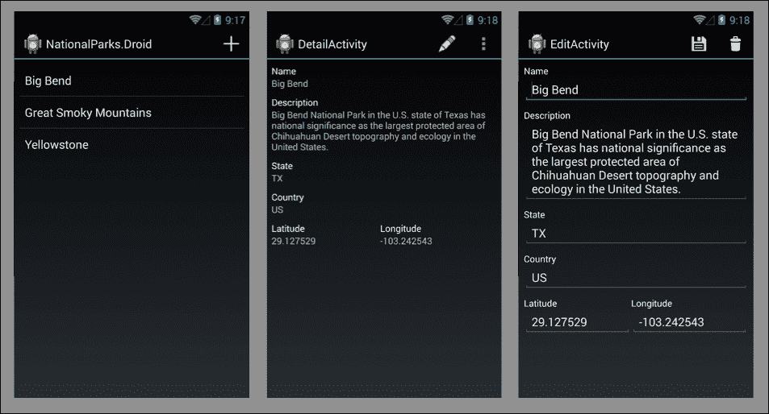
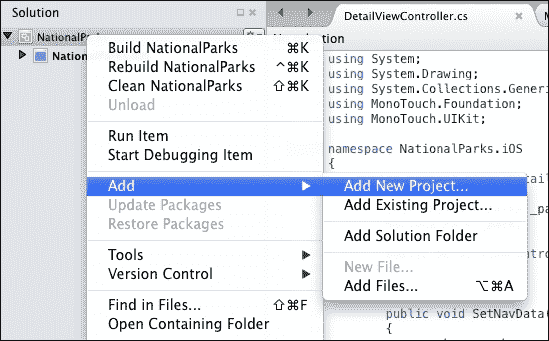
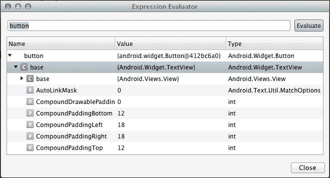
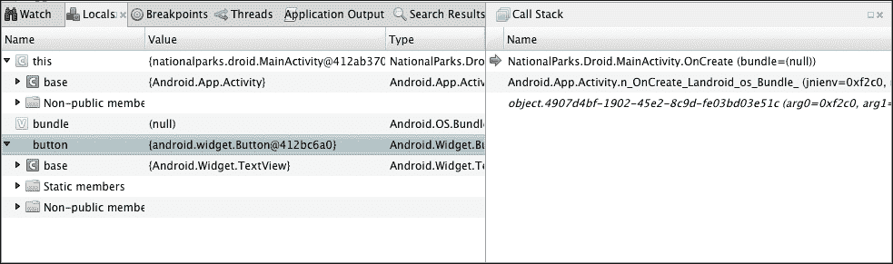
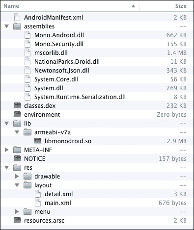

# 第五章. 使用 Xamarin.Android 开发您的第一个 Android 应用

在本章中，我们将使用 Xamarin.Android 开发一个类似于上一章中的`NationalParks.iOS`的示例应用。本章涵盖了以下主题：

+   示例应用概述

+   创建 Xamarin.Android 应用

+   使用 Xamarin Studio 编辑 Android 布局文件

+   使用 Xamarin Studio 运行和调试应用

+   使用 Visual Studio 运行和调试应用

+   检查 Xamarin.Android 应用的编译时生成元素

# 示例应用

本章我们将创建的示例应用将遵循上一章中`NationalParks.iOS`应用的基本设计。要回顾屏幕原型和一般描述，您可以参考第四章中的*示例国家公园应用*部分，*使用 Xamarin.iOS 开发您的第一个 iOS 应用*。以下截图显示了提供的解决方案中的 Android 屏幕：



我们将在应用的 Android 版本中引入一个设计变更；我们将创建一个单例类来帮助管理将公园加载和保存到 JSON 格式文件。我们将在创建单例类的下一节中进一步讨论这个问题，*创建 NationalParksData 单例*。

# 创建 NationalParks.Droid

我们将首先创建一个新的 Android 项目，并将其添加到上一章创建的现有`NationalParks`解决方案中。Xamarin Studio 允许 Android 和 iOS 项目成为同一解决方案的一部分。这在我们向后续章节过渡，特别是关注代码重用的章节时，证明是非常有用的。您会发现下一章，第六章，*分享游戏*，将向您展示如何做到这一点。

要创建国家公园 Android 应用，请执行以下步骤：

1.  您首先需要启动 Xamarin Studio 并打开上一章创建的`NationalParks`解决方案。

1.  然后，在 Xamarin Studio 左侧的**解决方案**面板中选择`NationalParks`解决方案，右键单击它，然后导航到**添加** | **添加新项目…**，如图所示：

1.  在对话框的左侧导航到**C#** | **Android**，在中间部分选择**Android 应用程序**，如下所示：

1.  现在，您需要在**名称**字段中输入`NationalParks.Droid`并点击**确定**。Xamarin Studio 将创建一个新的项目，将其添加到`NationalParks`解决方案中，并打开它。

# 检查应用

已创建一个简单的工作应用，其中包含多个文件；让我们花几分钟时间回顾一下创建了什么。

## 资源

`Resources` 文件夹对应于传统 Java Android 应用中的 `res` 文件夹。它包含可用于各种类型的子文件夹，包括布局、菜单、可绘制元素、字符串和样式。`Resources` 中的子文件夹遵循与传统 Java Android 应用相同的命名约定，如可绘制元素、布局、values 等。

## Resource.designer.cs 文件

`Resource.designer.cs` 是位于 `Resources` 文件夹中的一个 C# 源文件，由 Xamarin.Android 生成，包含应用中所有资源的常量 ID 定义；它对应于为 Java Android 应用生成的 `R.java` 文件。

## MainActivity.cs 文件

`MainActivity.cs` 是位于 `NationalParks.Droid` 项目根目录中的一个 C# 源文件，并且是项目中添加的唯一活动。打开文件查看内容。注意类顶部的属性：

```cs
[Activity (Label = "NationalParks.Droid",
    MainLauncher = true)]
```

`Label` 和 `MainLauncher` 的指定将影响 `ApplicationManifest.xml` 的内容。注意以下代码片段中的重写 `OnCreate()` 方法：

```cs
protected override void OnCreate (Bundle bundle)
{
    base.OnCreate (bundle);

    // Set our view from the "main" layout resource
    SetContentView (Resource.Layout.Main);

    // Get our button from the layout resource,
    // and attach an event to it
    Button button =
        FindViewById<Button> (Resource.Id.myButton);

    button.Click += delegate {
        button.Text = string.Format (
            "{0} clicks!", count++);
    };
}
```

除了 `OnCreate()` 使用 C# 语法外，其中的代码看起来与您可能在 Java Android 应用中找到的代码非常相似。接近顶部，内容被设置为 `Main` 布局文件；`Resource.Layout.Main` 是在 `Resource.designer.cs` 中定义的一个常量。通过调用 `FindViewById()` 获取对 `Button` 实例的引用，然后分配一个事件处理器来处理点击事件。

## 主.axml 文件

`Main.axml` 是位于 `Resources/layout` 文件夹中的一个 XML 布局文件。Xamarin.Android 使用 `.axml` 扩展名而不是简单的 `.xml` 来表示布局文件。除了使用不同的扩展名外，Xamarin.Android 以与 Java Android 应用基本相同的方式处理布局文件。打开 `Main.axml` 查看内容；屏幕底部有标签页可以切换到视觉、内容视图和源或 XML 视图。注意定义了一个使用 `LinearLayout` 的单个 `Button` 实例。

Xamarin.Android 遵循 Android 命名约定来命名布局文件夹，如下所示：

+   `Resources/layout`：这种命名约定用于正常屏幕尺寸（默认）

+   `Resources/layout-small`：这种命名约定用于小屏幕

+   `Resources/layout-large`：这种命名约定用于大屏幕

+   `Resources/layout-land`：这种命名约定用于横屏模式下的正常屏幕尺寸

## 项目选项

有许多选项可以设置，这些选项会影响您的应用编译、链接和执行的方式。这些选项可以从 **项目选项** 对话框中查看和修改。对 Android 应用最有兴趣的部分如下：

+   **构建** | **常规**：此设置用于目标框架版本

+   **构建** | **Android 构建**：此设置用于编译和链接过程以优化生成的可执行文件

+   **构建** | **Android 应用程序**：此设置提供默认包名、应用程序版本号和应用程序权限

要为`NationalParks.Droid`设置目标框架版本，请执行以下步骤：

1.  在**解决方案**选项卡中选择`NationalParks.Droid`项目。

1.  右键单击并选择**选项**。

1.  导航到**构建** | **常规**，将**目标框架**选项设置为**4.0.3 (冰激凌三明治**)，然后点击**确定**。

## Xamarin Studio 首选项

Xamarin Studio 提供了一个**首选项**对话框，允许您调整控制环境操作的各种首选项。以下是一些：

+   **项目** | **SDK 位置** | **Android**：使用此选项，您可以控制用于编译和运行应用程序的 Android SDK、Java SDK 和 Android NDK 的位置

+   **项目** | **Android**：这些设置影响 Android 模拟器的启动方式，包括命令行参数

# 使用 Xamarin Studio 运行和调试

虽然我们目前拥有的应用程序非常简单，但它可以运行，现在是时候看看如何执行和调试 Xamarin.Android 应用程序了。应用程序可以通过多种方式执行；最常见的方式是 Android 模拟器和物理设备。

## 使用 Android 模拟器运行应用程序

Xamarin.Android 与 Android 模拟器一起工作，以支持执行和调试您的应用程序。当 Xamarin.Android 安装后，会自动为您设置一系列**Android 虚拟设备**（**AVD**）。您可以通过从**工具**菜单中选择**打开 Android 模拟器管理器**来启动 AVD 管理器。

要运行`NationalParks.Droid`，请执行以下步骤：

1.  点击任务栏左侧的**启动/停止**按钮。您也可以通过按*F5*键或导航到**运行** | **开始调试**来运行应用程序。

1.  然后，在**选择设备**对话框中选择一个 AVD，然后点击**启动模拟器**。

1.  当模拟器完成启动后，在**设备**列表中选择正在运行的模拟器实例名称，然后点击**确定**。

1.  现在，您需要点击应用程序上的**Hello World**按钮，并注意标题的变化。

1.  切换回 Xamarin Studio，通过点击任务栏左侧的**启动/停止**按钮来停止应用程序。

1.  打开`MainActivity.cs`，通过在编辑器窗口的左侧边缘点击来在`OnCreate()`中的`SetContentView()`语句上设置断点，您可以在下面的屏幕截图中看到。此时，重新启动`NationalParks.Droid`；应用程序将在断点处停止：

1.  您将在任务栏中找到基本流程控制，用于逐步执行。这些允许您（从左到右的图标）继续执行、跳过当前行、进入当前函数和退出当前函数：

1.  使用步骤控件跳转到第 27 行，突出显示文本中的按钮，右键单击并选择**表达式评估器**。**表达式评估器**对话框可以用来查看程序执行期间对象的状态，如下所示：

1.  您还会注意到 Xamarin Studio 底部有一组面板，包含**观察**、**局部变量**、**断点**、**线程**、**应用程序输出**和**调用堆栈**标签页，如下所示：

1.  点击**继续**按钮以允许应用继续运行。

如您所见，Xamarin Studio 与 Android 模拟器结合使用，提供了一个强大的环境来执行和调试应用，其中包含大多数现代 IDE 中可以找到的功能。

您可以从 AVD 管理器（**工具** | **打开 Android 模拟器管理器**）修改 AVD 列表，也可以从 Android SDK 管理器（**工具** | **打开 Android SDK 管理器**）调整 Android SDK。

## 在物理设备上运行应用

Xamarin Studio 还支持在物理设备上调试应用。这通常是开发调试应用最有效的方法，因为许多设备功能在模拟器中配置和使用可能具有挑战性。要让 Xamarin Studio 与设备协同工作，实际上并没有什么特别之处；只需按照设备上启用 USB 调试的正常步骤操作，将设备连接到您的计算机，并从 Xamarin Studio 启动应用；设备将显示在 Xamarin Studio 的**选择设备**对话框中。如您所知，在 Windows 上，需要一个与所使用的设备相对应的特殊 USB 驱动程序；通常，OS X 用户无需担心。

使用模拟器或物理设备进行调试的问题并不独特，甚至与 Xamarin 的使用无关；这是所有 Android 开发者都会面临的问题。

## 使用 Genymotion 运行应用

不久前，我了解到另一种运行 Android 应用的选择。Genymotion 是一个基于 VirtualBox 虚拟化平台的产品。Genymotion 为市场上许多 Android 设备提供了一套虚拟设备模板。一旦创建了一个虚拟设备，您只需启动它，它就会像正在运行的 AVD 一样，在 Xamarin Studio 的**选择设备**对话框中可供选择。

由于 Genymotion 附带了许多不同的设备模板，它是一个出色的测试工具。Genymotion 的启动时间和执行时间也比标准 Android 模拟器快得多。根据您需要的功能，有免费和付费版本，无论您是使用 Xamarin.Android 还是原生 Java Android 开发。您可以在他们的主页[`www.genymotion.com`](http://www.genymotion.com)上找到更多关于 Genymotion 的信息。

# 扩展 NationalParks.Droid

由于我们对起点有很好的理解，现在我们可以将注意力转向增强现有功能以支持我们需要的特性。我们需要完成以下增强：

1.  在 `MainActivity` 中添加一个 `ListView` 实例以列出国家公园，并在 `ActionBar` 类中添加一个添加动作以添加新的国家公园。

1.  添加一个可以用来查看和更新国家公园的详细视图，包括保存和删除国家公园的操作，以及查看 [www.Bing.com](http://www.Bing.com) 上的照片和从地图提供商获取方向。

1.  添加逻辑以将国家公园加载和保存到 JSON 格式的文本文件中。

## 存储和加载国家公园

与 `NationalParks.iOS` 项目类似，我们将把我们的公园数据存储在 JSON 格式的文本文件中。在这个项目中，我们将创建一个单例类来帮助管理加载和保存公园。我们选择单例类有几个原因：

+   在下一章中，我们将开始探讨代码的共享和重用；这将使我们开始构建我们希望重用的解决方案。

+   在 Android 中，在 `Activities` 之间传递对象比在 iOS 中在 `ViewControllers` 之间传递对象要困难一些，而单例类将提供一种方便的方式来共享公园数据

### 添加 Json.NET

如果你完成了 第四章，*使用 Xamarin.iOS 开发您的第一个 iOS 应用*，Json.NET 将已经安装在你的机器上，你只需将其添加到你的项目中。

要将 Json.NET 添加到 `NationalParks.Droid` 项目中，请执行以下步骤：

1.  在 **解决方案** 面板中，选择 `NationalParks.Droid` 项目的 `Components` 文件夹，右键单击并选择 **编辑组件**。

1.  如果你看到 **安装在这台机器上** 部分列出了 Json.NET，点击 **添加到项目** 即可完成；否则继续下一步。

1.  在右上角，点击 **获取更多组件** 并在搜索字段中输入 `Json.NET`。

1.  从列表中选择 **Json.NET** 并选择 **添加到应用**。

### 借用实体类和 JSON 文件

我们需要一个表示我们主题领域的实体类：国家公园。如果你在 第四章，*使用 Xamarin.iOS 开发您的第一个 iOS 应用* 中工作过，这听起来很熟悉，在那里我们创建了一个。由于已经存在一个，我们无需从头创建，所以让我们从 `NationalParks.iOS` 中复制它。在 第六章，*共享游戏* 中，我们将查看如何在项目之间实际共享代码。

要复制 `NationalPark.cs` 文件，请执行以下步骤：

1.  在 `NationalParks.iOS` 项目中，选择 `NationalPark.cs` 文件，右键单击它，并选择 **复制**。

1.  选择 `NationalPark.Droid` 项目，右键单击它并选择 **粘贴**。

### 创建 NationalParksData 单例

如前所述，我们将创建一个单例类来简化共享和访问国家公园。单例是一种设计模式，它将类在应用程序中可以存在的实例数量限制为单个实例。单例有助于维护全局状态并在多个视图中共享单个对象。对于我们的目的，单例模式简化了管理单个国家公园集合以及存储加载和保存公园到 JSON 格式文件的逻辑。

要创建 `NationalParksData`，请执行以下步骤：

1.  选择 `NationalParks.Droid`，右键单击它，然后导航到 **添加** | **新建文件**。

1.  选择 **通用** | **空类**，在 **名称** 字段中输入 `NationalParksData`，然后单击 **新建**。

1.  添加一个 `static` `instance` 属性来访问 `NationalParksData` 的单个实例，并在属性的获取器中初始化单例实例，如下所示：

    ```cs
    private static NationalParksData _instance;
    public static NationalParksData Instance
    {
        get { return _instance ??
            (_instance = new NationalParksData()); }
    }
    ```

1.  添加一个 `Parks` 集合属性以将公园加载到：

    ```cs
       public List<NationalPark> Parks { get; protected set; }
    ```

    ### 注意

    注意使用 `protected set`，这可以保护 `Parks` 属性不被单例类外部修改。

1.  我们需要确定几个地方来加载和保存到 JSON 格式文件的公园的文件名。创建一个返回完全限定文件名的方法，如下所示：

    ```cs
    protected string GetFilename()
    {
      return Path.Combine (
           Environment.GetFolderPath(
               Environment.SpecialFolder.MyDocuments),
              "NationalParks.json");
    }
    ```

1.  添加一个私有构造函数，如果存在文件，则加载 `Parks` 集合。提供私有构造函数是实现单例模式的一部分，因为它有助于确保只有一个实例存在。可以使用以下代码片段添加私有构造函数：

    ```cs
    private NationalParksData ()
    {
      if (File.Exists (GetFilename())) {
        string var serializedParks = File.ReadAllText
            (GetFilename());
        Parks =
          JsonConvert.DeserializeObject<List<NationalPark>>
            (serializedParks);
      }
      else
        Parks = new List<NationalPark> ();
    }
    ```

1.  添加一个 `Save()` 方法。此方法接受一个公园，如果它是新公园，则将其添加到 `Parks` 集合中，然后将集合保存到文件中，如下所示：

    ```cs
    public void Save(NationalPark park)
    {
      if (Parks != null) {
        if (!Parks.Contains (park))
          _parks.Add (park);
        string var serializedParks =
          JsonConvert.SerializeObject (Parks);
        File.WriteAllText (GetFilename (), serializedParks);
      }
    }
    ```

1.  添加一个 `Delete()` 方法。此方法从 `Parks` 集合中删除公园，并将更新后的集合保存到文件中，如下所示：

    ```cs
    public void Delete(NationalPark park)
    {
      if (Parks != null) {
        Parks.Remove (park);
        string serializedParks =
          JsonConvert.SerializeObject (Parks);
        File.WriteAllText (GetFilename (), serializedParks);
      }
    }
    ```

## 增强 `MainActivity`

在 `NationalParksData` 单例就绪后，我们可以继续进行一些 UI 工作。Xamarin.Android 项目模板在上一章中并没有给我们太多帮助。我们需要向 `MainActivity` 添加一个列表视图，创建一个 `DetailActivity` 来查看公园，并创建一个 `EditActivity` 来更新和删除公园。`MainActivity` 是一个很好的起点。

### 添加 `ListView` 实例

当我们创建项目时生成的默认视图 (`Main.xml`) 包含一个位于 `LinearLayout` 中的 `Button` 实例。我们需要删除此按钮并添加一个 `ListView` 实例来显示我们的公园。

#### 探索 Xamarin.Android 设计器

Xamarin Studio 提供了一个图形设计工具来创建和编辑布局文件。由于这是我们第一次使用这个工具，我们将花几分钟时间熟悉它。请执行以下步骤：

1.  打开 `Main.xml`；注意视图底部的两个标签页，**内容**和**源**。选择**内容**标签页时，会显示布局的可视表示。选择**源**标签页时，会在 XML 编辑器中显示原始 XML。

1.  现在，切换到**内容**标签页。注意在 Xamarin Studio 的右侧有两个面板，**文档大纲**和**属性**。当在**内容**模式下打开布局时，**文档大纲**面板显示布局文件内容的分层视图。**文档大纲**面板显示了 `LinearLayout` 中的**按钮**控件。

1.  **属性**面板显示当前所选小部件的属性。选择**按钮**实例，切换到**属性**面板。注意**属性**面板顶部的标签：**小部件**、**样式**、**布局**、**滚动**和**行为**。这些标签将特定小部件可用的各种类型属性分组在一起。

#### 编辑 Main.xml 文件

要在 `Main.xml` 中添加 `ListView` 实例，请执行以下步骤：

1.  在**内容**模式下打开 `Main.axml`，选择**按钮**实例，右键单击它，然后选择**删除**（或按*删除*键）。

1.  在**工具箱**标签页顶部的搜索框中输入 `List`。选择显示的 `ListView` 小部件，并将其拖放到 `Main.axml` 中。

1.  在**文档大纲**面板中，选择 `ListView` 小部件。

1.  在**小部件**标签页下的**属性**面板中，将**ID**值输入为 `@+id/parksListView`。

1.  在**文档大纲**面板中，选择 `LinearLayout` 小部件。

1.  在**布局**标签页下的**属性**面板中，将**填充**值输入为 `8dp`。

### 创建适配器

我们需要一个 `ListAdapter` 实例来填充我们的 `ListView` 以显示国家公园。我们将创建一个继承自 `BaseAdapter` 的适配器。

要创建 `NationalParksAdapter.cs`，请执行以下步骤：

1.  选择 `NationalParks.Droid` 项目，右键单击它，然后选择**新建文件**。在**新建文件**对话框中，导航到**Android** | **Android 类**。

1.  在**名称**字段中输入 `NationalParks.cs` 并单击**新建**。

1.  将 `NationalParksAdapter` 修改为公共类，并使用 `NationalPark` 作为类型规范扩展 `BaseAdapter<>`，如下所示：

    ```cs
    public class NationalParksAdapter :
        BaseAdapter<NationalPark>
    {
    }
    ```

1.  将光标放在 `BaseAdapater<>` 上，右键单击它，然后导航到**重构** | **实现**抽象成员，然后按 *Enter*。Xamarin Studio 将为每个抽象方法创建一个默认的方法存根，其中包含抛出异常 `NotImplementedException` 的代码。

1.  在这个阶段，你可以实现一个接受活动并保存其引用以在 `GetView()` 中使用的构造函数，如下面的代码片段所示：

    ```cs
    private Activity _context;
    public NationalParksAdapter(Activity context)
    {
        _context = context;
    }
    ```

1.  实现`GetItemId()`方法，并返回作为 ID 传入的位置。`GetItemId()`方法旨在为在`AdapterView`中显示的数据行提供一个 ID。不幸的是，该方法必须返回一个`long`实例，而我们的 ID 是一个 GUID。我们能做的最好的事情就是返回传递给我们的位置，如下所示：

    ```cs
    public override long GetItemId(int position)
    {
        return  position;
    }
    ```

1.  实现`Count`属性，以返回`Parks`集合中的项目数量，如下所示：

    ```cs
    public override int Count
    {
        get { return NationalParksData.Instance.Parks.Count; }
    }
    ```

1.  实现索引属性，并返回位于`Parks`集合中传入位置处的`NationalPark`实例，如下所示：

    ```cs
    public override NationalPark this[int position]
    {
        get { return NationalParksData.Instance.Parks[position]; }
    }
    ```

1.  实现`GetView()`方法，并返回一个使用默认 Android 布局`SimpleListItem1`填充的`View`实例，如下所示：

    ```cs
    public override View GetView(int position,
        View convertView, ViewGroup parent)
    {
        View view = convertView;
        if (view == null) {
            view = 
                _context.LayoutInflater.Inflate(
                    Android.Resource.Layout.SimpleListItem1,
                    null);
        }

        view.FindViewById<TextView>
            (Android.Resource.Id.Text1).Text =
                NationalParksData.Instance.Parks [position].Name;

        return view;
    }
    ```

1.  为了完成这些步骤，将适配器连接到`MainActivity`上的`ListView`。这通常在`OnCreate()`方法中完成，如下所示：

    ```cs
    NationalParksAdapter _adapter;
    . . .
    protected override void OnCreate (Bundle bundle)
    {
        . . . 
        _adapter = new NationalParksAdapter (this);
        FindViewById<ListView>
           (Resource.Id.parksListView).Adapter = _adapter;
        . . .
    }
    ```

### 向 ActionBar 添加新操作

现在，我们需要向 ActionBar 添加一个`Add`操作，它可以用来创建一个新的国家公园。

要创建`Add`操作，执行以下步骤：

1.  首先，在`NationalParks.Droid`项目中选择`Resources`文件夹，右键单击它，然后导航到**添加** | **新建文件夹**。

1.  在这一点上，将文件夹命名为`menu`。

1.  选择新创建的`menu`文件夹，右键单击它，然后导航到**添加** | **新建文件**，然后选择**XML** | **空 XML 文件**，在**名称**字段中输入`MainMenu.xml`，然后点击**新建**。

1.  在新创建的 XML 文件中填写一个用于**Add**操作的菜单定义。以下示例演示了所需的内容：

    ```cs
    <menu
      >
        <item android:id="@+id/actionNew"
            android:icon="@drawable/ic_new"
            android:title="New"
            android:showAsAction="ifRoom" />
    </menu>
    ```

1.  将`Assets`文件夹中的所有图像文件（`*.png`）复制到`NationalParks.Droid`项目中的`Resources/drawable`文件夹。

1.  选择`Resources/drawable`文件夹，右键单击并选择**添加文件**，选择所有图像文件，包括`ic_new.png`，然后点击**打开**。

现在我们已经有了菜单定义和图形，我们需要添加一些代码来放置菜单。Android 提供了几个虚拟方法来创建和处理 ActionBar 项的点击事件。

#### 覆盖`OnCreateOptionsMenu()`方法

当活动启动时，会调用`OnCreateOptionsMenu()`方法，并提供了一个创建 ActionBar 项的地方。以下代码演示了如何使用`MainMenu.xml`中的定义来创建`Add`操作：

```cs
public override bool OnCreateOptionsMenu(IMenu menu)
{
    MenuInflater.Inflate(Resource.Menu.MainMenu, menu);
    return base.OnCreateOptionsMenu(menu);
}
```

#### 覆盖`OnOptionsItemSelected()`方法

当在 ActionBar 中点击操作时，会调用`OnOptionsItemsSelected()`方法，并提供了一个处理请求的地方。在我们的例子中，我们希望导航到尚未创建的详细视图。目前，只需简单地实现`OnOptionsItemSelected()`方法，并使用占位符来代替导航逻辑。以下代码演示了所需的内容：

```cs
public override bool OnOptionsItemSelected (
    IMenuItem item)
{
    switch (item.ItemId)
    {
    case Resource.Id.actionNew:
        // Navigate to Detail View
        return true;

    default :
        return base.OnOptionsItemSelected(item);
    }
}
```

### 运行应用

我们已经完成了对`MainActivity`的增强。运行应用并查看更改。当您首次启动应用时，您会注意到`ListView`是空的。您可以使用**Android Device Monitor**（**ADM**）将`NationalParks.json`文件放置在模拟器虚拟设备中。Xamarin Studio 没有配置用于 ADM 的菜单项，但您可以使用**Preferences** | **External Tools**添加一个。

使用 ADM 应用程序将`NationalParks.json`上传到模拟器。重新启动`NationalParks.Droid`；您现在应该看到公园列表。

## 创建 DetailActivity 视图

现在，让我们添加一个显示国家公园详细信息的视图。为此，我们需要创建一个简单的视图，其中`ScrollView`作为父`ViewGroup`，并为`NationalPark`实体类上的每个属性添加`EditText`小部件。

要创建`DetailActivity`视图，请执行以下步骤：

1.  在**Solution**面板中选择`NationalParks.Droid`项目，右键单击并导航到**Add** | **New File**。

1.  在此之后，导航到**Android** | **Android Activity**，将**Name**字段的值设置为`DetailActivity`，然后点击**New**。

1.  然后，在`NationalParks.Droid`中的`Resources/layout`文件夹上右键单击，并导航到**Add** | **New File**。

1.  导航到**Android** | **Android Layout**，将**Name**字段的值设置为`Detail`，然后点击**New**。

1.  在**Outline**面板中，选择`LinearLayout`，右键单击它，并选择**Delete**。

1.  从**Toolbox**面板中选择`ScrollView`小部件，并将其拖放到`Detail.axml`布局中。

1.  从**Toolbox**面板中选择`LinearLayout`，并将其拖放到`Detail.axml`布局中。

1.  在**Layout**选项卡下的**Properties**面板中，将`LinearLayout`的**Padding**设置为`8dp`。

1.  为`NationalPark`实体类上的每个属性添加`TextView`小部件（除了`ID`属性）。还要添加作为标签的`TextView`小部件。对于将用于显示属性的每个`TextView`小部件，将`ID`属性填写为与实体属性名称相对应的名称，例如`nameTextView`。根据您的偏好排列小部件；您可以使用第四章中*The sample national parks app*部分的屏幕模拟图，或作为指南的示例解决方案。

1.  在**Content**模式下查看`Detail.axml`，并根据需要调整。

1.  在`DetailActivity.OnCreate()`中，添加对`SetContentView()`的调用，并传递`Detail.axml`的布局 ID，如下所示：

    ```cs
    SetContentView (Resource.Layout.Detail);
    ```

### 添加 ActionBar 项目

现在，我们需要向操作栏添加三个项目：编辑公园的操作、在[www.bing.com](http://www.bing.com)上查看公园的照片，以及获取前往公园的路线。按照之前创建新菜单定义文件`DetailMenu.xml`的相同步骤进行操作。以下 XML 显示了需要使用的代码：

```cs
<menu >
    <item android:id="@+id/actionEdit"
        android:icon="@drawable/ic_edit"
       android:title="Edit"
       android:showAsAction="ifRoom" />
   <item android:id="@+id/actionPhotos"
       android:title="Photos"
       android:showAsAction="never" />
    <item android:id="@+id/actionDirections"
       android:title="Directions"
       android:showAsAction="never" />
</menu>
```

在添加菜单定义后，实现`OnCreateOptionsMenu()`和`OnOptionsItemSelected()`方法，就像我们为`MainActivity`所做的那样。只需添加空占位符来处理实际的动作，我们将在接下来的部分中填充逻辑。

### 填充`DetailActivity`

在`OnCreate()`中添加逻辑以填充`DetailActivity`，按照以下步骤操作：

1.  第一步是确定是否将公园`Id`作为意图附加信息传递。如果传递了，则在`NationalParksData`的`Parks`列表中定位它。如果没有，则使用以下代码片段创建一个新实例：

    ```cs
    if (Intent.HasExtra ("parkid")) {
        string parkId = Intent.GetStringExtra ("parkid");
        _park = NationalParksData.Instance.
            Parks.FirstOrDefault (x => x.Id == parkId);
    }
    else
        _park = new NationalPark ();
    ```

1.  现在根据公园的数据填充`EditText`字段。示例解决方案有一个`ParkToUI()`方法用于此逻辑，如下所示：

    ```cs
    protected void ParkToUI()
    {
        _nameEditText.Text = _park.Name;
        . . .
        _latEditText.Text = _park.Latitude.ToString();
        . . .
    }
    ```

### 处理显示照片动作

我们希望将用户引导到[www.bing.com](http://www.bing.com)以查看公园的照片。这可以通过一个简单的`ActionView`意图和一个格式正确的搜索 URI 来实现。

要处理显示照片动作，需要在`OnOptionsItemSelected()`方法中创建一个`ActionView`意图，并传入一个格式化的 URI 来搜索[www.bing.com](http://www.bing.com)上的照片。以下代码演示了所需的操作：

```cs
public override bool OnOptionsItemSelected (
    IMenuItem item)
{
    switch (item.ItemId) {
    . . .
    case Resource.Id.actionPhotos:
        Intent urlIntent =
            new Intent (Intent.ActionView);
          urlIntent.SetData (
            Android.Net.Uri.Parse (
            String.Format(
                "http://www.bing.com/images/search?q={0}",
                _park.Name)));
        StartActivity (urlIntent);
        return true;
    . . .
    }
}
```

### 处理显示路线动作

我们希望将用户引导到外部地图应用以获取前往公园的路线。同样，这可以通过一个简单的`ActionView`意图以及一个格式正确的 URI 请求地图信息来实现。

要处理显示路线动作，在`OnOptionsItemSelected()`方法中创建逻辑以创建一个`ActionView`意图，并传入一个格式化的 URI 来显示地图信息。以下代码演示了所需的操作：

```cs
case Resource.Id.actionDirections:

    if ((_park.Latitude.HasValue) &&
       (_park.Longitude.HasValue)) {
        Intent mapIntent = new Intent
           (Intent.ActionView,
            Android.Net.Uri.Parse (
            String.Format ("geo:0,0?q={0},{1}&z=16 ({2})",
            _park.Latitude,
            _park.Longitude,
            _park.Name)));
        StartActivity (mapIntent);
    }

    return true;
```

### 添加导航

现在我们已经有了`DetailActivity`，我们需要回到`MainActivity`并添加一些导航逻辑，以便当在列表中选择公园时，将显示`DetailActivity`。

当用户点击`ListView`中的项目时，可以通过为`ListView.OnItemClicked`提供事件处理程序来处理。

要从`MainActivity`添加导航，请执行以下步骤：

1.  打开`MainActivity.cs`。

1.  创建一个事件处理程序来处理`OnItemClicked`事件。以下事件处理程序代表了所需的内容：

    ```cs
    public void ParkClicked(object sender,
        ListView.ItemClickEventArgs e)
    {
        Intent intent = new Intent (this,
            typeof(DetailActivity));
        intent.PutExtra("parkid", adapter[e.Position].Id);
        StartActivity (intent);
    }
    ```

1.  在`OnCreate()`方法中连接事件处理程序，如下所示：

    ```cs
    FindViewById<ListView>
        (Resource.Id.parksListView).ItemClick   += ParkClicked;
    ```

### 运行应用程序

我们现在已经完成了`DetailActivity`。运行应用程序并选择一个公园以显示新的活动。选择显示照片和显示路线动作。如果您在模拟器中运行应用程序，您将无法查看路线，因为模拟器无法访问 Google Play 服务。

## 创建`EditActivity`

我们现在准备添加我们的最后一个活动，`EditActivity`。这个练习将与我们刚刚完成的练习类似，但我们将使用`EditText`小部件，以便用户可以修改数据。此外，`EditActivity`可以用来显示现有的公园或新的公园。

要创建`EditActivity`，请执行以下步骤：

1.  按照上一节中使用的相同步骤创建一个新的活动和一个名为`EditActivity`和`Edit.axml`的布局文件。

1.  此外，以与`Detail.axml`相同的方式添加`ScrollView`、`LinearLayout`和`Padding`。

1.  为`NationalPark`实体类上的每个属性（除了`Id`属性）添加`TextView`小部件和`EditText`小部件。`TextView`小部件应用作标签，而`EditText`小部件用于编辑属性。对于将用于显示属性的每个`EditView`小部件，将`Id`属性填充为与实体上的属性名称相对应的名称，例如`nameTextView`。根据您的偏好排列小部件；您可以使用第四章中*示例国家公园应用程序*部分的屏幕原型，或作为指南的示例解决方案。

1.  在**内容**模式下审查`Edit.axml`并根据需要调整。

1.  在`EditActivity.OnCreate()`中，添加对`SetContentView()`的调用并传入`Edit.axml`的布局`Id`，如下所示：

    ```cs
    SetContentView (Resource.Layout.Edit);
    ```

### 添加 ActionBar 项目

我们现在需要向工具栏添加三个项目：编辑公园的操作、在[www.bing.com](http://www.bing.com)上查看公园的照片，以及获取公园的路线。按照上一节中*添加新的 ActionBar 操作*部分中使用的相同步骤创建一个新的菜单定义文件，命名为`DetailMenu.xml`。以下 XML 显示了所需的代码：

```cs
<menu >
    <item android:id="@+id/actionSave"
    android:icon="@drawable/ic_save"
      android:title="Save"
      android:showAsAction="always" />
    <item android:id="@+id/actionDelete"
    android:icon="@drawable/ic_delete"
      android:title="Delete"
      android:showAsAction="always" />
</menu>
```

在添加菜单定义后，实现`OnCreateOptionsMenu()`和`OnOptionsItemSelected()`方法，就像我们为`MainActivity`所做的那样。为每个操作添加空占位符，我们将在接下来的部分中填充逻辑，如下所示：

```cs
public override bool OnOptionsItemSelected (IMenuItem item)
{
    switch (item.ItemId)
    {
        case Resource.Id.actionSave:
            // will add save logic here…
            return true;

        case Resource.Id.actionDelete: 
            // will add delete logic here…
            return true;

        default :
            return base.OnOptionsItemSelected(item);
    }
}
```

### 创建小部件的引用变量

由于我们将数据放入`EditText`小部件，然后再将其拉出来，因此为小部件创建引用变量并在`OnCreate()`方法中设置引用是有意义的。

要为小部件创建引用变量，请执行以下步骤：

1.  在`EditActivity`类中创建一组`EditText`对象的引用，如下所示：

    ```cs
    EditText _nameEditText;
    EditText _descrEditText;
    . . .
    ```

1.  在`EditActivity`的`OnCreate()`方法中，使用`FindViewById()`设置对适当小部件的引用，如下所示：

    ```cs
    _nameEditText= FindViewById<EditText>
        (Resource.Id.nameEditText);
    _descrEditText = FindViewById<EditText>
        (Resource.Id.descrEditText);
    . . .
    ```

### 填充`EditActivity`

要填充`EditActivity`，请执行以下步骤：

1.  创建一个名为`ParkToUI()`的方法，将数据从`_park`对象移动到`EditText`小部件，如下所示：

    ```cs
    protected void ParkToUI()
    {
          _nameEditText.Text = _park.Name;
          _descrEditText.Text = _park.Description;
          . . .
    }
    ```

1.  重写`OnResume()`并添加对`ToUI()`方法的调用以填充`EditText`小部件，如下所示：

    ```cs
    protected override void OnResume ()
    {
        base.OnResume ();
        ParkToUI ();
    }
    ```

### 处理保存操作

当点击`保存`操作时，会调用`OnOptionsItemSelected()`方法。在`DetailActivity`上创建一个`Save()`方法，并在`OnOptionsItemSelected()`中调用它。解决方案项目有一个`UIToPark()`方法，用于从`EditText`小部件获取内容，并在保存之前填充`Park`实体。

处理`保存`操作，请执行以下步骤：

1.  创建一个名为`ToPark()`的方法，将数据从`EditText`小部件移动到`_park`对象。此方法将在处理`保存`操作时使用，如下所示：

    ```cs
    protected void UIToPark()
    {
        _park.Name = _nameEditText.Text;
        _park.Description = _descrEditText.Text;
        . . .
        if (!String.IsNullOrEmpty (_latEditText.Text))
            _park.Latitude = Double.Parse (_latEditText.Text);
        else
            _park.Latitude = null;
        . . .
    }
    ```

1.  创建一个处理保存公园的方法，该方法调用`UIToPark()`以将更改填充到`_park`对象中，然后它调用`NationalParksData`上的`Save()`方法以将更改保存到文件，设置结果代码，并结束活动。所需的代码如下：

    ```cs
    protected void SavePark()
      {
          UIToPark ();
          NationalParksData.Instance.Save (_park);

        Intent returnIntent = new Intent ();
        returnIntent.PutExtra ("parkdeleted", false);
        SetResult (Result.Ok, returnIntent);

          Finish ();
    }
    ```

    ### 注意

    注意，名为`parkdeleted`的布尔`Extra`被设置为`false`。这用于通知调用活动公园没有被删除。

1.  更新`OnOptionsItemSelected()`以调用`SavePark()`，如下所示：

    ```cs
    case Resource.Id.actionSave:
          SavePark ();
          return true;
    ```

### 处理删除操作

处理`删除`操作与`保存`操作类似，但稍微简单一些，因为我们不需要从 UI 小部件保存更改。

要处理`删除`操作，请执行以下步骤：

1.  创建一个方法来处理删除公园的操作，通过在`NationalParksData`上调用`Delete()`方法，设置结果代码，并结束活动，如下所示：

    ```cs
    protected void DeletePark()
    {
        NationalParksData.Instance.Delete (_park);

        Intent returnIntent = new Intent ();
        returnIntent.PutExtra ("parkdeleted", true);
        SetResult (Result.Ok, returnIntent);

        Finish ();
    }
    ```

    ### 注意

    注意，名为`parkdeleted`的布尔`Extra`被设置为`true`，以通知调用活动公园已被删除。这对于`DetailActivity`很重要，因为当一个公园之前显示为已删除时，它应该结束并返回到`MainActivity`。

1.  更新`OnOptionsItemSelected()`以调用`DeletePark()`，如下所示：

    ```cs
    case Resource.Id.actionDelete:
          DeletePark ();
          return true;
    ```

### 添加导航

现在`EditActivity`已经就绪，我们需要在用户选择`新建`操作时在`MainActivity`中添加导航逻辑，以及在用户选择`编辑`操作时在`DetailActivity`中添加导航逻辑。

#### 在新操作上进行导航

如您所回忆的，在`MainActivity`的`OnMenuItemSelected()`中，我们在需要导航到`EditActivity`的地方添加了一个注释。我们现在可以用以下`StartActivity()`的使用来替换这个注释：

```cs
public override bool OnOptionsItemSelected (
    IMenuItem item)
{
    switch (item.ItemId)
    {
        case Resource.Id.actionNew:
            StartActivity (typeof(DetailActivity));
            return true;
        default :
            return base.OnOptionsItemSelected(item);
    }
}
```

#### 在编辑操作上进行导航

同样，我们还需要在`DetailActivity`的`OnMenuItemSelected()`中添加导航代码。然而，有一些区别。我们需要传递我们想要编辑的公园的`Id`属性，并且我们希望接收一个结果，指示用户是否删除了此公园。所需的代码如下：

```cs
case Resource.Id.actionEdit:
    Intent editIntent = new Intent(this, 
        typeof(EditActivity));
    editIntent.PutExtra("parkid", _park.Id);
    StartActivityForResult(editIntent, 1);
    return true;
```

`DetailActivity`还需要检测公园被删除的情况，以便它可以完成并返回到`MainActivity`查看列表。为此，重写`OnActivityResult()`并检查名为`parkdeleted`的布尔`Extra`，以确定公园是否被删除，如下所示：

```cs
protected override void OnActivityResult (
    int requestCode, Result resultCode, Intent data)
  {
      if ((requestCode == 1) && (resultCode == Result.Ok))
      {
          if (data.GetBooleanExtra ("parkdeleted", false))
              Finish ();
          }
        else
            base.OnActivityResult (
                requestCode, resultCode, data);
      }
}
```

### 在`MainActivity`中刷新 ListView

我们需要实现的最后一件事是逻辑，该逻辑将刷新`MainActivity`中的`ListView`，以反映在`EditActivity`上可能进行的任何更改。为此，在`MainActivity`的`OnResume()`方法的重写中调用适配器对象的`NotifyDataSetChanged()`，如下所示：

```cs
protected override void OnResume ()
{
    base.OnResume ();
    adapter.NotifyDataSetChanged ();
}
```

### 运行应用程序

我们现在已经完成了 `NationalParks.Droid` 应用程序。你现在应该能够运行你的应用程序并练习每个功能。

# 在 Visual Studio 中使用 Xamarin.Android 项目

如果你在一台安装了 Visual Studio 2010 或 Visual Studio 2013（当前版本）的 Windows 机器上安装了 Xamarin.Android，Xamarin.Android Visual Studio 附加组件已经安装。在 Visual Studio 中处理项目与在 Xamarin Studio 中处理项目类似，但某些功能除外。要访问项目选项，请执行以下步骤：

1.  选择 `NationalParks.Droid` 项目，右键单击并选择 **属性**。将打开一个多标签窗口，允许指定各种项目相关选项。

1.  要访问 Visual Studio 中与 Xamarin.Android 相关的选项，请转到 **工具** | **选项** | **Xamarin** | **Android 设置**。

1.  要访问 AVD 管理器，请转到 **工具** | **打开 Android 模拟器管理器**。

1.  要管理你的 Xamarin 账户并激活许可证，请转到 **工具** | **Xamarin 账户**。

如果你在一台安装了 Visual Studio 的 Windows 机器上工作，并且还没有尝试过附加组件，请打开 Visual Studio 中的 `NationalParks.Droid` 并运行应用程序。

# 查看生成的元素

在结束本章之前，让我们看看幕后发生的一些事情。

## 同伴对象

在 第三章 的 *揭秘 Xamarin.Android* 中，我们讨论了在 Xamarin.Android 应用程序中同伴对象的作用。现在，让我们看看我们项目中的一个生成的 Java 同伴对象。这些类的源代码可以在 `NationalParks.Droid/obj/Debug/android/src` 中找到。打开 `nationalparks.droid.MainActivity.java`。现在，注意以下提示：

+   `MainActivity` 继承自 `android.app.Activity`。

+   我们为每个创建覆盖的方法都创建了一个相应的方法，该方法调用我们的覆盖方法。例如，我们为 `OnCreate()` 创建了一个覆盖方法。生成的类有一个名为 `onCreate()` 的方法，该方法调用一个私有本地方法 `n_onCreate()`，该方法通过 JNI 引用指向我们的覆盖方法。

+   `MainActivity` 的静态类初始化器使用 `mono.android.Runtime.register()` 方法注册所有用于 JNI 的本地方法。

+   类构造函数使用 `mono.android.TypeManager.Activate()` 方法激活我们的托管 C# 类的实例。

## AndroidManifest.xml 文件

Xamarin.Android 在构建时使用两个源生成 `AndroidManifest.xml` 文件：第一个是 `NationalParks.Droid/Properties` 中 `AndroidManifest.xml` 文件的内容，第二个是类上指定的属性，主要是项目中的活动。你可以在 `NationalParks.Droid/obj/Debug/android` 中找到生成的 `AndroidManifest.xml`。使用文本编辑器打开文件，并注意以下提示：

+   文件中有两个 `<activity/>` 元素，`MainActivity` 被指定为启动活动。这些条目是从每个活动类中指定的属性生成的。

+   指定了一个 `INTERNET` 权限。这来自 `NationalParks.Droid/Properties` 文件夹中的 `AndroidManifest.xml` 文件。

## APK 文件

另一个值得关注的点是生成的 Xamarin.Android 应用程序的 APK。我们将在第十章 准备分发 Xamarin.Android 应用 中详细说明如何创建 APK，*准备分发 Xamarin.Android 应用*。这是一个相当简单的过程；如果您迫不及待，可以使用以下步骤：

1.  在工具栏的左上角，将构建类型设置为 **发布**。

1.  从 **项目** 菜单中选择 **发布 Android 项目**。

1.  在 **发布 Android 应用** 对话框中，选择 **创建新密钥库**，填写所有必需的信息，然后点击 **创建**。

1.  Xamarin.Android 将将 APK 发布到您选择的目录。由于 APK 是 ZIP 文件，只需解压 APK 即可查看内容。

    以下截图显示了生成的 APK 的内容：

    

以下表格提供了 APK 内容的描述：

| 内容 | 描述 |
| --- | --- |
| `assemblies/System.*` | 这些程序集包含核心 .NET 命名空间，例如 `System.IO` 和 `System.Collection` |
| `assemblies/Mono.Android.dll` | 此程序集包含 Xamarin.Android 绑定类 |
| `assemblies/NationalParks.Droid.dll` | 此程序集包含我们创建的类：`MainActivity`、`DetailActivity` 和 `NationalParksAdapter` |
| `assemblies/Newtonsoft.Json.dll` | 此程序集包含 Json.NET 类 |
| `classes.dex` | 此文件包含所有以 Dalvik 编译格式生成的 Java 同伴对象 |
| `lib/armeabi-v7a/libmonodroid.so` | 这是 Android 的 Mono CLR |
| `res/*` | 此文件夹包含所有资源；可绘制对象、布局、菜单等 |

# 摘要

在本章中，我们创建了一个示例 Xamarin.Android 应用，并演示了与 Xamarin.Android 平台一起工作时需要理解的概念。虽然我们没有演示 Android 应用中可以使用的所有功能，但您现在应该对如何访问这些功能感到舒适。

在下一章中，我们将关注跨应用共享代码等重要主题，这是使用 Xamarin 的关键优势之一。
