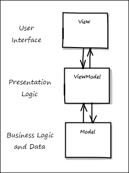
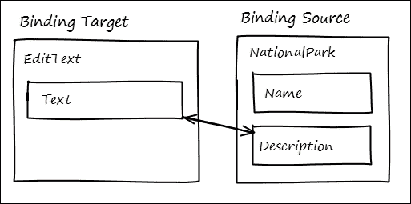
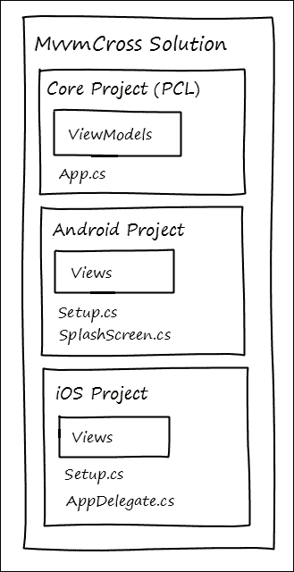
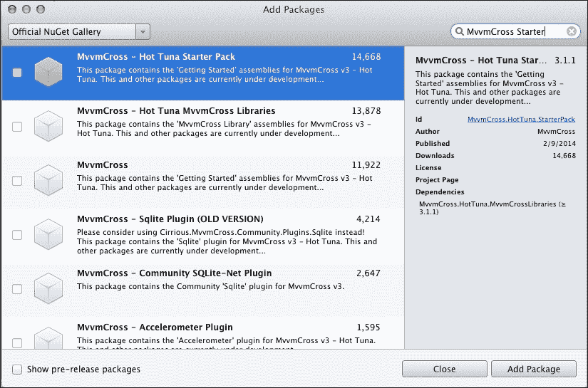
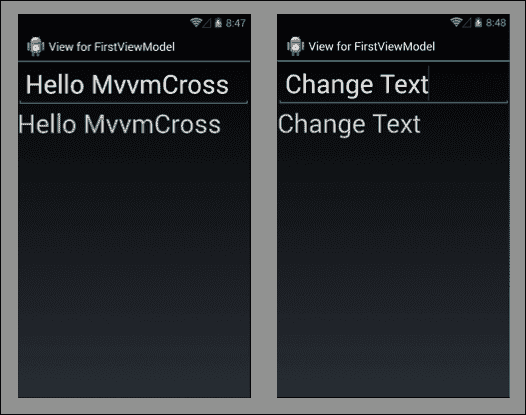
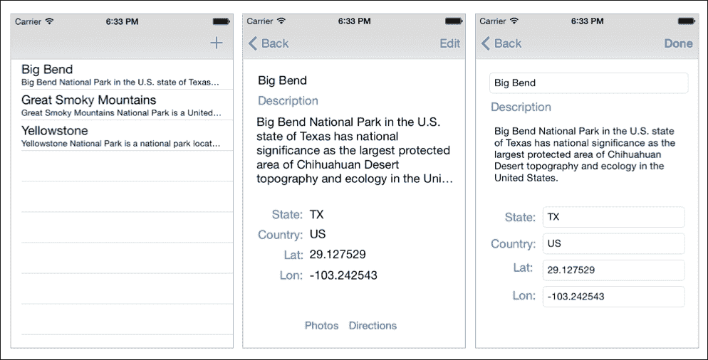

# 第七章. 与 MvvmCross 共享

在上一章中，我们介绍了跨项目和平台重用代码的基本方法。在本章中，我们将进一步探讨如何使用设计模式和框架来增加可重用代码的数量。我们将涵盖以下主题：

+   MvvmCross 简介

+   MVVM 设计模式

+   核心概念

+   视图、ViewModel 和命令

+   数据绑定

+   导航（ViewModel 到 ViewModel）

+   项目组织

+   启动过程

+   创建 `NationalParks.MvvmCross`

在一个章节中尝试涵盖 MvvmCross 以及一个工作示例，这无疑有些雄心勃勃。我们的方法将是首先从高层次介绍核心概念，然后深入其中，使用 MvvmCross 创建国家公园示例应用。这将帮助你基本了解如何使用该框架及其使用价值。考虑到这一点，让我们开始吧。

# 介绍 MvvmCross

MvvmCross 是由 Stuart Lodge 创建的开源框架。它基于 **模型-视图-ViewModel** （**MVVM**）设计模式，旨在增强跨多个平台（包括 Xamarin.Android、Xamarin.iOS、Windows Phone、Windows Store、WPF 和 Mac OS X）的代码重用。MvvmCross 项目托管在 GitHub 上，可以通过 [`github.com/MvvmCross/MvvmCross`](https://github.com/MvvmCross/MvvmCross) 访问。

## MVVM 模式

MVVM 是模型-视图-控制器模式的变体。它将传统上放置在 **视图** 对象中的逻辑分离成两个不同的对象，一个称为 **视图**，另一个称为 **ViewModel**。视图负责提供用户界面，而 ViewModel 负责表示逻辑。表示逻辑包括将数据从模型转换为用户界面可以处理的形式，以及将用户与视图的交互映射回发送回模型的请求。以下图表描述了 MVVM 中各种对象之间的通信方式：



虽然 MVVM 提供了一个更复杂的实现模型，但它具有显著的优点，如下所述：

+   ViewModels 及其与 Models 的交互通常可以使用框架（如 NUnit）进行测试，这些框架比结合用户界面和表示层的应用程序要容易得多。

+   ViewModels 通常可以在不同的用户界面技术和平台上重用。

这些因素使得 MVVM 方法既灵活又强大。

## 视图

在 MvvmCross 应用程序中，视图使用平台特定的结构实现。对于 iOS 应用程序，视图通常实现为 ViewControllers 和 XIB 文件。MvvmCross 提供了一组基类，例如`MvxViewController`，iOS ViewControllers 从中继承。也可以与自定义演示者结合使用 Storyboard 来创建视图；我们将在本章后面的标题为*实现 iOS 用户界面*的部分简要讨论此选项。

对于 Android 应用程序，视图通常实现为`MvxActivity`或`MvxFragment`，以及它们相关的布局文件。

## ViewModel

ViewModel 是提供数据表示逻辑的类，用于应用程序中的视图。数据作为 ViewModel 上的属性暴露给 View，可以从 View 中调用的逻辑作为命令暴露。ViewModel 继承自`MvxViewModel`基类。

## 命令

命令在 ViewModel 中使用，以暴露可以从 View 中调用的逻辑，以响应用户交互。命令架构基于在许多 Microsoft 框架中使用的`ICommand`接口，例如**Windows** **演示基础**（**WPF**）和 Silverlight。MvvmCross 提供了`IMvxCommand`，它是`ICommand`的扩展，以及一个名为`MvxCommand`的实现。

命令通常定义为 ViewModel 上的属性。例如：

```cs
public  IMvxCommand ParkSelected { get; protected set; }
```

每个命令都有一个定义了动作方法的实现，该方法实现了要调用的逻辑：

```cs
protected void ParkSelectedExec(NationalPark park)
{
   . . .// logic goes here
}
```

必须初始化命令，并将相应的动作方法分配：

```cs
ParkSelected =
    new MvxCommand<NationalPark> (ParkSelectedExec);
```

## 数据绑定

数据绑定通过建立允许数据交换的双向链接，促进了 View 和 ViewModel 之间的通信。MvvmCross 提供的数据绑定功能基于在许多 Microsoft 基于 XAML 的 UI 框架中找到的功能，如 WPF 和 Silverlight。基本思想是您希望将 UI 控件中的属性绑定，例如 Android 应用程序中**EditText**控制的**Text**属性绑定到数据对象的属性，如**NationalPark**的**Description**属性。以下图表描述了此场景：



### 绑定模式

可以使用四种不同的绑定模式进行数据绑定：

+   **单向绑定**：此模式指示数据绑定框架将值从 ViewModel 传输到 View，并将 ViewModel 上属性的任何更新传输到其绑定的 View 属性。

+   **单向源绑定**：此模式指示数据绑定框架将值从 View 传输到 ViewModel，并将 View 属性的更新传输到其绑定的 ViewModel 属性。

+   **双向绑定**：此模式指示数据绑定框架在 ViewModel 和 View 之间双向传输值，并且任一对象的更新都将导致另一个对象更新。当值正在编辑时，此绑定模式非常有用。

+   **一次性绑定**：此模式告诉数据绑定框架在绑定建立时从 ViewModel 转移值到 View；在此模式下，ViewModel 属性的更新不会被 View 监控。

### `INotifyPropertyChanged` 接口

`INotifyPropertyChanged` 接口是使数据绑定有效运行的重要组成部分；它充当源对象和目标对象之间的契约。正如其名称所暗示的，它定义了一个契约，允许源对象在数据发生变化时通知目标对象，从而允许目标对象采取任何必要的行动，例如刷新其显示。

该接口由一个单一的事件——`PropertyChanged` 事件组成，目标对象可以订阅该事件，并且当源对象中的属性发生变化时，该事件会被触发。以下示例演示了如何实现 `INotifyPropertyChanged`：

```cs
public class NationalPark : INotifyPropertyChanged
{
  public event PropertyChangedEventHandler
     PropertyChanged;
  // rather than use "… code" it is safer to use
  // the comment form 
  string _name;
  public string Name
  {
    get { return _name; }
    set
    {
        if (value.Equals (_name,
            StringComparison.Ordinal))
        {
      // Nothing to do - the value hasn't changed;
      return;
        }
        _name = value;
        OnPropertyChanged();
    }
  }
  . . . 
  void OnPropertyChanged(
    [CallerMemberName] string propertyName = null)
  {
      var handler = PropertyChanged;
  if (handler != null)
  {
      handler(this,
            new PropertyChangedEventArgs(propertyName));
  }
  }
}
```

### 绑定规范

绑定可以通过几种方式指定。对于 Android 应用，绑定可以在布局文件中指定。以下示例演示了如何将 `TextView` 实例的 `Text` 属性绑定到 `NationalPark` 实例的 `Description` 属性：

```cs
<TextView
    android:layout_width="match_parent"
    android:layout_height="wrap_content"
    android:id="@+id/descrTextView"
    local:MvxBind="Text Park.Description" />
```

对于 iOS，绑定必须使用绑定 API 完成。`CreateBinding()` 是可以在 `MvxViewController` 上找到的方法。以下示例演示了如何将 `Description` 属性绑定到一个 `UILabel` 实例：

```cs
this.CreateBinding (this.descriptionLabel).
    To ((DetailViewModel vm) => vm.Park.Description).
    Apply ();
```

## 导航到 ViewModel 之间

在应用内导航到各种屏幕是一个重要的功能。在 MvvmCross 应用中，这一功能是在 ViewModel 层实现的，以便导航逻辑可以被重用。MvvmCross 通过使用从 `MvxNavigatingObject` 继承的 `ShowViewModel<T>()` 方法来支持 ViewModel 之间的导航，`MvxNavigatingObject` 是 `MvxViewModel` 的基类。以下示例演示了如何导航到 `DetailViewModel`：

```cs
ShowViewModel<DetailViewModel>();
```

### 传递参数

在许多情况下，需要将信息传递到目标 ViewModel。MvvmCross 提供了多种实现这一目标的方法。主要方法是通过创建一个包含简单公共属性的类，并将该类的实例传递给 `ShowViewModel<T>()`。以下示例演示了如何在导航过程中定义和使用 `parameters` 类：

```cs
public class DetailParams
{
    public int ParkId { get; set; }
}

// using the parameters class
ShowViewModel<DetailViewModel>(
new DetailViewParam() { ParkId = 0 });
```

为了接收和使用参数，目标 ViewModel 实现了一个 `Init()` 方法，该方法接受 `parameters` 类的实例：

```cs
public class DetailViewModel : MvxViewModel
{
    . . .
    public void Init(DetailViewParams parameters)
    {
        // use the parameters here . . .
    }
}
```

### 解决方案/项目组织

MvvmCross 解决方案的组织方式与我们如何在 第六章 中组织 PCL 解决方案的方式相似，即 *共享游戏*。每个 MvvmCross 解决方案将有一个单独的核心 PCL 项目，其中包含可重用的代码，以及一系列包含各种应用的特定平台项目。以下图展示了总体结构：



### 启动过程

MvvmCross 应用通常遵循一个标准的启动序列，该序列由每个应用中特定平台的代码启动。有几个类协同完成启动；其中一些类位于核心项目中，而另一些则位于特定平台的项目中。以下各节描述了每个参与类的职责。

#### App.cs

核心项目包含一个继承自 `MvxApplication` 的 `App` 类。`App` 类包含对 `Initialize()` 方法的重写，以便至少可以注册在应用启动时应展示的第一个 ViewModel：

```cs
RegisterAppStart<ViewModels.MasterViewModel>();
```

#### Setup.cs

Android 和 iOS 项目都有一个 `Setup` 类，负责在启动期间从核心项目中创建 `App` 对象。这是通过重写 `CreateApp()` 方法来实现的：

```cs
protected override IMvxApplication CreateApp()
{
    return new Core.App();
}
```

对于 Android 应用，`Setup` 继承自 `MvxAndroidSetup`。对于 iOS 应用，`Setup` 继承自 `MvxTouchSetup`。

#### Android 启动

Android 应用使用一个特殊的 `Activity` 启动屏幕启动，该屏幕调用 `Setup` 类并启动 MvvmCross 启动过程。所有这些都会自动为你完成；你所需要做的只是包含启动屏幕定义，并确保它被标记为启动活动。定义如下：

```cs
[Activity(
  Label="NationalParks.Droid", MainLauncher = true,
  Icon="@drawable/icon", Theme="@style/Theme.Splash",
  NoHistory=true,
  ScreenOrientation = ScreenOrientation.Portrait)]
public class SplashScreen : MvxSplashScreenActivity
{
    public SplashScreen():base(Resource.Layout.SplashScreen)
    {
    }
}
```

#### iOS 启动

iOS 应用启动稍微自动化程度较低，并从 `AppDelegate` 的 `FinishedLaunching()` 方法中启动：

```cs
public override bool FinishedLaunching (
    UIApplication app, NSDictionary options)
{
    _window = new UIWindow (UIScreen.MainScreen.Bounds);

    var setup = new Setup(this, _window);
    setup.Initialize();
    var startup = Mvx.Resolve<IMvxAppStart>();
    startup.Start();

    _window.MakeKeyAndVisible ();

    return true;
}
```

# 创建 NationalParks.MvvmCross

现在我们已经对 MvvmCross 框架有了基本了解，让我们将所学知识付诸实践，将 `NationalParks` 应用转换为利用我们刚刚学到的功能。

## 创建 MvvmCross 核心项目

我们将首先创建核心项目。该项目将包含在 iOS 和 Android 应用之间共享的所有代码，主要是以 ViewModel 的形式。核心项目将作为可移植类库构建。

要创建 `NationalParks.Core`，请执行以下步骤：

1.  从主菜单导航到 **文件** | **新建解决方案**。

1.  从 **新建解决方案** 对话框中，导航到 **C#** | **可移植库**，在项目 **名称** 字段中输入 `NationalParks.Core`，在 **解决方案** 字段中输入 `NationalParks.MvvmCross`，然后点击 **确定**。

1.  从 NuGet 将 MvvmCross 启动包添加到项目中。选择 `NationalParks.Core` 项目，从主菜单导航到 **项目** | **添加包**。在搜索字段中输入 `MvvmCross starter`。

1.  选择 **MvvmCross – Hot Tuna Starter Pack** 条目，然后点击 **添加包**。

1.  由于添加了包，`NationalParks.Core` 中添加了一些内容，具体如下：

    +   包含与 MvvmCross 启动包相关联的库（`dlls`）列表的 `packages.config` 文件。这些条目是到整体解决方案 `Packages` 文件夹中实际库的链接。

    +   一个包含名为`FirstViewModel`的示例 ViewModel 的`ViewModels`文件夹。

    +   `App.cs`中的`App`类，其中包含一个`Initialize()`方法，通过调用`RegisterAppStart()`来启动`FirstViewModel`。我们最终将将其更改为启动与列出国家公园的视图关联的`MasterViewModel`类。

## 创建 MvvmCross Android 应用

下一步是在同一解决方案中创建 Android 应用项目。

要创建`NationalParks.Droid`，请完成以下步骤：

1.  选择`NationalParks.MvvmCross`解决方案，右键单击它，然后导航到**添加** | **新建项目**。

1.  从**新项目**对话框中，导航到**C#** | **Android** | **Android Application**，在**名称**字段中输入`NationalParks.Droid`，然后点击**确定**。

1.  通过选择`NationalParks.Droid`并从主菜单导航到**项目** | **添加包**，将 MvvmCross 启动套件包添加到新项目中。

1.  由于添加了包，`NationalParks.Droid`中添加了一些内容，如下所示：

    +   `packages.config`：此文件包含与 MvvmCross 启动套件包关联的库列表（`dlls`）。这些条目是到整体解决方案`Packages`文件夹中实际库的链接，其中包含实际下载的库。

    +   `FirstView`：此类位于`Views`文件夹中，对应于在`NationalParks.Core`中创建的`FirstViewModel`。

    +   `FirstView`：此布局位于`Resources\layout`中，由`FirstView`活动使用。这是一个传统的 Android 布局文件，除了它包含在`EditView`和`TextView`元素中的绑定声明。

    +   `Setup`：此文件继承自`MvxAndroidSetup`。此类负责从核心项目创建`App`类的实例，然后通过调用`RegisterAppStart()`显示第一个 ViewModel。

    +   `SplashScreen`：此类继承自`MvxSplashScreenActivity`。`SplashScreen`类被标记为主要启动活动，因此通过调用`Setup.Initialize()`初始化`MvvmCross`应用。

1.  通过选择`References`文件夹，右键单击它，选择**编辑引用**，选择**项目**选项卡，勾选`NationalParks.Core`，然后点击**确定**，为`NationalParks.Core`添加引用。

1.  删除`MainActivity.cs`，因为它不再需要，并且将创建一个构建错误。这是因为它被标记为主要启动类，新的`SplashScreen`类也是如此。同时，删除相应的`Resources\layout\main.axml`布局文件。

1.  运行应用。应用将展示 `FirstViewModel`，它与相应的 `FirstView` 实例通过 `EditView` 类链接，而 `TextView` 展示相同的 **Hello MvvmCross** 文本。当你编辑 `EditView` 类中的文本时，`TextView` 类将通过数据绑定自动更新。以下截图展示了你应该看到的内容：

### 重用 NationalParks.PortableData 和 NationalParks.IO

在我们开始创建应用中的视图和视图模型之前，我们首先需要引入之前工作中的一些代码，这些代码可以用来维护公园。为此，我们将简单地重用之前创建的 `NationalParksData` 单例和 `FileHandler` 类。

要重用 `NationalParksData` 单例和 `FileHandler` 类，请完成以下步骤：

1.  将 `NationalParks.PortableData` 和 `NationalParks.IO` 从 第六章 中创建的解决方案复制到 `NationalParks.MvvmCross` 解决方案文件夹中。

1.  在 `NationalParks.Droid` 项目中添加对 `NationalParks.PortableData` 的引用。

1.  在 `NationalParks.Droid` 项目中创建一个名为 `NationalParks.IO` 的文件夹，并将 `FileHandler.cs` 文件从 `NationalParks.IO` 项目中添加链接。回想一下，`FileHandler` 类不能包含在可移植类库中，因为它使用了无法从可移植类库引用的文件 IO API。

1.  编译项目。现在项目应该可以干净地编译。

#### 实现 INotifyPropertyChanged 接口

我们将使用数据绑定将 UI 控件绑定到 `NationalPark` 对象，因此我们需要实现 `INotifyPropertyChanged` 接口。这确保了对公园属性所做的更改被报告给适当的 UI 控件。

要实现 `INotifyPropertyChanged`，请完成以下步骤：

1.  在 `NationalParks.PortableData` 项目中打开 `NationalPark.cs` 文件。

1.  指定 `NationalPark` 类实现 `INotifyPropertyChanged` 接口。

1.  选择 `INotifyPropertyChanged` 接口，右键单击它，导航到 **重构** | **实现接口**，然后按 *Enter*。输入以下代码片段：

    ```cs
    public class NationalPark : INotifyPropertyChanged
    {
        public event PropertyChangedEventHandler
            PropertyChanged;
        . . .
    }
    ```

1.  在每个属性设置器方法中添加一个可调用的 `OnPropertyChanged()` 方法：

    ```cs
    void OnPropertyChanged(
        [CallerMemberName] string propertyName = null)
    {
        var handler = PropertyChanged;
        if (handler != null)
        {
            handler(this,
                new PropertyChangedEventArgs(propertyName));
        }
    }
    ```

1.  更新每个属性定义，以调用设置器的方式与 `Name` 属性所示相同：

    ```cs
    string _name;
    public string Name
    {
      get { return _name; }
      set
      {
        if (value.Equals (_name, StringComparison.Ordinal))
        {
          // Nothing to do - the value hasn't changed;
      return;
        }
        _name = value;
        OnPropertyChanged();
      }
    }
    ```

1.  编译项目。现在项目应该可以干净地编译。我们现在可以使用 `NationalParksData` 单例在我们的新项目中，并且它支持数据绑定。

### 实现安卓用户界面

现在，我们已准备好创建应用所需的视图和视图模型。我们正在创建的应用将遵循之前章节中使用的相同流程：

+   一个用于查看国家公园的主列表视图

+   一个用于查看特定公园详细信息的详细视图

+   一个用于编辑新或现有公园的编辑视图

在 Android 应用程序中创建视图和 ViewModel 的过程通常包括三个不同的步骤：

1.  在核心项目中创建一个 ViewModel，其中包含支持视图所需的数据和事件处理程序（命令）。

1.  创建一个包含视觉元素和数据绑定规范的 Android 布局。

1.  创建一个 Android 活动，它对应于 ViewModel 并显示布局。

在我们的案例中，这个过程将略有不同，因为我们将重用我们的一些先前工作，特别是布局文件和菜单定义。

要重用布局文件和菜单定义，请执行以下步骤：

1.  将`Master.axml`、`Detail.axml`和`Edit.axml`从第五章中创建的解决方案的`Resources\layout`文件夹复制到`NationalParks.Droid`项目的`Resources\layout`文件夹中，并通过选择布局文件夹并导航到**添加** | **添加文件**将其添加到项目中。

1.  将`MasterMenu.xml`、`DetailMenu.xml`和`EditMenu.xml`从第五章中创建的解决方案的`Resources\menu`文件夹复制到`NationalParks.Droid`项目的`Resources\menu`文件夹中，并通过选择`menu`文件夹并导航到**添加** | **添加文件**将其添加到项目中。

### 实现主列表视图

我们现在可以开始实现我们的第一个视图/ViewModel 组合，即主列表视图。

#### 创建 MasterViewModel

第一步是创建一个 ViewModel 并添加一个将提供数据给显示国家公园的列表视图的属性，以及一些初始化代码。

要创建`MasterViewModel`，请完成以下步骤：

1.  在`NationalParks.Core`中的`ViewModels`文件夹上右键单击，并导航到**添加** | **新建文件**。

1.  在**新建文件**对话框中，导航到**常规** | **空类**，在**名称**字段中输入`MasterViewModel`，然后点击**新建**。

1.  修改类定义，使`MasterViewModel`继承自`MvxViewModel`；您还需要添加几个`using`指令：

    ```cs
    . . .
    using Cirrious.CrossCore.Platform;
    using Cirrious.MvvmCross.ViewModels;
    . . .
    namespace NationalParks.Core.ViewModels
    {
      public class MasterViewModel : MvxViewModel
      {
             . . .
       }
    }
    ```

1.  在`MasterViewModel`中添加一个属性，该属性是一个`NationalPark`元素的列表。这个属性将稍后绑定到列表视图：

    ```cs
    private List<NationalPark> _parks;
    public List<NationalPark> Parks
    {
        get { return _parks; }
        set { _parks = value;
              RaisePropertyChanged(() => Parks);
        }
     }
    ```

1.  在`MasterViewModel`上重写`Start()`方法，以从`NationalParksData`单例加载数据到`_parks`集合。您需要再次添加`NationalParks.PortableData`命名空间的`using`指令：

    ```cs
    . . .
    using NationalParks.PortableData;
    . . .
    public async override void Start ()
    {
        base.Start ();
        await NationalParksData.Instance.Load ();
        Parks = new List<NationalPark> (
            NationalParksData.Instance.Parks);
    }
    ```

1.  我们现在需要修改应用程序启动顺序，以便`MasterViewModel`是第一个启动的 ViewModel。在`NationalParks.Core`中打开`App.cs`，将`RegisterAppStart()`的调用更改为引用`MasterViewModel`：

    ```cs
    RegisterAppStart<ViewModels.MasterViewModel>();
    ```

#### 更新 Master.axml 布局

更新`Master.axml`，以便利用 MvvmCross 提供的数据绑定功能。

要更新 `Master.axml`，请完成以下步骤：

1.  打开 `Master.axml` 并在 XML 的顶部添加一个命名空间定义，以包含 `NationalParks.Droid` 命名空间：

    此命名空间定义是必需的，以便允许 Android 解析将要指定的 MvvmCross 特定元素。

1.  将 `ListView` 元素更改为 `Mvx.MvxListView` 元素：

    ```cs
    <Mvx.MvxListView
        android:layout_width="match_parent"
        android:layout_height="match_parent"
        android:id="@+id/parksListView" />
    ```

1.  向 `MvxListView` 元素添加数据绑定规范，将列表视图的 `ItemsSource` 属性绑定到 `MasterViewModel` 的 `Parks` 属性，如下所示：

    ```cs
        . . .
        android:id="@+id/parksListView"
        local:MvxBind="ItemsSource Parks" />
    ```

1.  向元素定义添加一个列表项模板属性。此布局控制列表视图中将显示的每个项的内容：

    ```cs
    local:MvxItemTemplate="@layout/nationalparkitem"
    ```

1.  创建 `NationalParkItem` 布局，并提供 `TextView` 元素以显示公园的名称和描述，如下所示：

    ```cs
    <LinearLayout 

        android:orientation="vertical"
        android:layout_width="fill_parent"
        android:layout_height="wrap_content">
        <TextView
            android:layout_width="match_parent"
            android:layout_height="wrap_content"
            android:textSize="40sp"/>
        <TextView
            android:layout_width="match_parent"
            android:layout_height="wrap_content"
            android:textSize="20sp"/>
    </LinearLayout>
    ```

1.  将数据绑定规范添加到每个 TextView 元素中：

    ```cs
    . . .
            local:MvxBind="Text Name" />
    . . .
            local:MvxBind="Text Description" />
    . . .
    ```

    ### 备注

    注意，在这种情况下，数据绑定的上下文是绑定到 `MvxListView` 的集合中的一项的实例，在这个例子中，是一个 `NationalPark` 的实例。

#### 创建 MasterView 活动

接下来，创建 `MasterView`，它是一个与 `MasterViewModel` 对应的 `MvxActivity` 实例。

要创建 `MasterView`，请完成以下步骤：

1.  在 `NationalParks.Core` 中的 `ViewModels` 文件夹中，右键单击它，导航到 **添加** | **新建文件**。

1.  在 **新建文件** 对话框中，导航到 **Android** | **Activity**，在 **名称** 字段中输入 `MasterView`，并选择 **新建**。

1.  修改类规范，使其继承自 `MvxActivity`；您还需要添加一些 `using` 指令，如下所示：

    ```cs
    using Cirrious.MvvmCross.Droid.Views;
    using NationalParks.Core.ViewModels;
    . . .
    namespace NationalParks.Droid.Views
    {
        [Activity(Label = "Parks")]
        public class MasterView : MvxActivity
        {
            . . .
        }
    }
    ```

1.  打开 `Setup.cs` 并向 `CreateApp()` 方法添加代码以初始化 `NationalParksData` 单例的文件处理程序和路径，如下所示：

    ```cs
    protected override IMvxApplication CreateApp()
    {
     NationalParksData.Instance.FileHandler =
     new FileHandler ();
     NationalParksData.Instance.DataDir =
     System.Environment.GetFolderPath(
     System.Environment.SpecialFolder.MyDocuments);
     return new Core.App();
    }

    ```

1.  编译并运行应用；您需要使用 Android 设备监控器将 `NationalParks.json` 文件复制到设备或模拟器。`NationalParks.json` 中的所有公园都应显示。

### 实现详细视图

现在我们已经有了显示国家公园的主列表视图，我们可以专注于创建详细视图。我们将对详细视图执行与刚刚完成的主视图相同的步骤。

#### 创建 DetailViewModel

我们通过以下步骤开始创建 `DetailViewModel`：

1.  按照创建 `MasterViewModel` 所使用的相同程序，在 `NationalParks.Core` 的 `ViewModel` 文件夹中创建一个新的名为 `DetailViewModel` 的 ViewModel。

1.  添加一个 `NationalPark` 属性以支持视图控件的数据绑定，如下所示：

    ```cs
    protected NationalPark _park;
    public NationalPark Park
    { 
        get { return _park; }
        set { _park = value;
              RaisePropertyChanged(() => Park);
         }
    }
    ```

1.  创建一个 `Parameters` 类，可以用来传递应显示的公园 ID。在参数的类定义中创建此类很方便：

    ```cs
    public class DetailViewModel : MvxViewModel
    {
        public class Parameters
        {
            public string ParkId { get; set; }
        }
        . . .
    ```

1.  实现一个 `Init()` 方法，该方法将接受 `Parameters` 类的实例并从 `NationalParkData` 获取相应的国家公园：

    ```cs
    public void Init(Parameters parameters)
    {
        Park = NationalParksData.Instance.Parks.
            FirstOrDefault(x => x.Id == parameters.ParkId);
    }
    ```

#### 更新 Detail.axml 布局

接下来，我们将更新布局文件。需要做的主要更改是向布局文件中添加数据绑定规范。

要更新`Detail.axml`布局，执行以下步骤：

1.  打开`Detail.axml`并将项目命名空间添加到 XML 文件中：

1.  将数据绑定规范添加到每个对应于国家公园属性的`TextView`元素中，如下所示公园名称的示例：

    ```cs
    <TextView
        android:layout_width="match_parent"
        android:layout_height="wrap_content"
        android:id="@+id/nameTextView"
        local:MvxBind="Text Park.Name" />
    ```

#### 创建`DetailView`活动

现在，创建一个将与`DetailViewModel`一起工作的`MvxActivity`实例。

要创建`DetailView`，执行以下步骤：

1.  按照之前创建`MasterView`时使用的相同程序，在`NationalParks.Droid`的`Views`文件夹中创建一个名为`DetailView`的新视图。

1.  实现`OnCreateOptionsMenu()`和`OnOptionsItemSelected()`方法，以便我们的菜单可访问。现在暂时注释掉`OnOptionsItemSelected()`中与`Edit`操作相关的部分；一旦编辑视图完成，我们将填充这部分。

#### 添加导航

最后一步是添加导航，以便当在`MasterView`的`MvxListView`中点击项目时，公园将在详情视图中显示。我们将使用`command`属性和数据绑定来完成此操作：

要添加导航，执行以下步骤：

1.  打开`MasterViewModel`并添加一个`IMvxCommand`属性；这将用于处理被选中的公园：

    ```cs
    protected IMvxCommand ParkSelected { get; protected set; }
    ```

1.  创建一个`Action`委托，当执行`ParkSelected`命令时将被调用，如下所示：

    ```cs
    protected void ParkSelectedExec(NationalPark park)
    {
        ShowViewModel<DetailViewModel> (
            new DetailViewModel.Parameters ()
                { ParkId = park.Id });
    }
    ```

1.  在`MasterViewModel`的构造函数中初始化`command`属性：

    ```cs
    ParkClicked =
        new MvxCommand<NationalPark> (ParkSelectedExec);
    ```

1.  现在，最后一步，在`Master.axml`中的`MvvListView`上添加数据绑定规范，将`ItemClick`事件绑定到我们刚刚创建的`MasterViewModel`上的`ParkClicked`命令：

    ```cs
    local:MvxBind="ItemsSource Parks; ItemClick ParkClicked"
    ```

1.  编译并运行应用。现在点击列表视图中的公园应该会导航到详情视图，显示选中的公园。

### 实现编辑视图

我们现在几乎已经成为了实现新视图和视图模型的专家。接下来要做的最后一个视图是编辑视图。

#### 创建`EditViewModel`

如我们之前所做的那样，我们从 ViewModel 开始。

要创建`EditViewModel`，完成以下步骤：

1.  按照本章之前用于创建`EditViewModel`的相同过程，添加数据绑定属性并创建一个`Parameters`类用于导航。

1.  实现一个`Init()`方法，该方法将接受`Parameters`类的实例，并在编辑现有公园的情况下从`NationalParkData`获取相应的国家公园，或者如果用户选择了`New`操作，则创建一个新的实例。检查传入的参数以确定意图：

    ```cs
    public void Init(Parameters parameters)
    {
        if (string.IsNullOrEmpty (parameters.ParkId))
            Park = new NationalPark ();
        else
            Park =
                NationalParksData.Instance.
                Parks.FirstOrDefault(
                x => x.Id == parameters.ParkId);
    }
    ```

#### 更新`Edit.axml`布局

更新`Edit.axml`以提供数据绑定规范。

要更新 `Edit.axml` 布局，你首先需要打开 `Edit.axml` 并将项目命名空间添加到 XML 文件中。然后，将数据绑定规范添加到每个对应于国家公园属性的 `EditView` 元素。

#### 创建 EditView 活动

创建一个名为 `EditView` 的新 `MvxActivity` 实例，它将与 `EditViewModel` 一起工作。

要创建 `EditView`，请执行以下步骤：

1.  按照创建 `DetailView` 所使用的相同程序，在 `NationalParks.Droid` 的 `Views` 文件夹中创建一个名为 `EditView` 的新视图。

1.  实现 `OnCreateOptionsMenu()` 和 `OnOptionsItemSelected()` 方法，以便从 ActionBar 中访问 `Done` 操作。你可以从 第六章 中创建的解决方案中复制这些方法的实现，*共享游戏*。将 `Done` 的实现更改为调用 `EditViewModel` 上的 `Done` 命令。

#### 添加导航

在 `MasterView` 中点击 New (**+**) 和在 `DetailView` 中点击 **Edit** 时添加导航。让我们从 MasterView 开始。

要从 `MasterViewModel` 添加导航，完成以下步骤：

1.  打开 `MasterViewModel.cs` 并添加一个 `NewParkClicked` 命令属性以及该命令的处理程序。确保在构造函数中初始化命令，如下所示：

    ```cs
    protected IMvxCommand NewParkClicked { get; set; }
    protected void NewParkClickedExec()
    {
      ShowViewModel<EditViewModel> ();
    }
    ```

    注意，我们不会将参数类传递给 `ShowViewModel()`。这将导致创建一个默认实例并将其传递，这意味着 `ParkId` 将为 null。我们将使用这种方式来确定是否应该创建一个新的公园。

1.  现在，是时候将 `NewParkClicked` 命令连接到 `actionNew` 菜单项了。我们没有使用数据绑定来完成此操作的方法，因此我们将求助于更传统的做法——我们将使用 `OnOptionsItemSelected()` 方法。添加逻辑以调用 `NewParkClicked` 的 `Execute()` 方法，如下所示：

    ```cs
    case Resource.Id.actionNew:
        ((MasterViewModel)ViewModel).
            NewParkClicked.Execute ();
        return true; 
    ```

要从 `DetailViewModel` 添加导航，完成以下步骤：

1.  打开 `DetailViewModel.cs` 并添加一个 `EditParkClicked` 命令属性以及该命令的处理程序。确保在构造函数中初始化命令，如下面的代码片段所示：

    ```cs
    protected IMvxCommand EditPark { get; protected set;}
    protected void EditParkHandler()
    {
        ShowViewModel<EditViewModel> (
            new EditViewModel.Parameters ()
                { ParkId = _park.Id });
    }
    ```

    ### 注意

    注意，创建了一个 `Parameters` 类的实例，初始化并传递给 `ShowViewModel()` 方法。这个实例将反过来传递给 `EditViewModel` 上的 `Init()` 方法。

1.  在 `MasterViewModel` 的构造函数中初始化 `command` 属性，如下所示：

    ```cs
    EditPark =
        new MvxCommand<NationalPark> (EditParkHandler);
    ```

1.  现在，更新 `DetailView` 中的 `OnOptionsItemSelect()` 方法，以便在选择 `Edit` 操作时调用 `DetailView.EditPark` 命令：

    ```cs
    case Resource.Id.actionEdit:
        ((DetailViewModel)ViewModel).EditPark.Execute ();
        return true;
    ```

1.  编译并运行 `NationalParks.Droid`。你现在应该有一个功能齐全的应用程序，它能够创建新的公园并编辑现有的公园。对 `EditView` 所做的更改应自动反映在 `MasterView` 和 `DetailView` 中。

## 创建 MvvmCross iOS 应用

使用 MvvmCross 创建 Android 应用的过程提供了对整体架构如何工作的深入了解。由于以下两个原因，创建 iOS 解决方案应该会容易得多：首先，我们了解了如何与 MvvmCross 交互；其次，我们放置在`NationalParks.Core`中的所有逻辑都是可重用的，因此我们只需要创建应用视图部分和启动代码。

要创建`NationalParks.iOS`，请完成以下步骤：

1.  选择`NationalParks.MvvmCross`解决方案，右键单击它，然后导航到**添加** | **新建项目**。

1.  从**新建项目**对话框中，导航到**C#** | **iOS** | **iPhone** | **单视图应用**，在名称字段中输入`NationalParks.iOS`，然后点击**确定**。

1.  通过选择`NationalParks.iOS`并从主菜单导航到**项目** | **添加包**，将 MvvmCross 启动套件包添加到新项目中。

1.  由于添加了包，`NationalParks.iOS`添加了一些内容。具体如下：

    +   `packages.config`：这个文件包含与 MvvmCross 启动套件包关联的库列表。这些条目是到整体解决方案`Packages`文件夹中实际库的链接，其中包含实际下载的库。

    +   `FirstView`：这个类放在`Views`文件夹中，对应于在`NationalParks.Core`中创建的`FirstViewModel`实例。

    +   `Setup`：这个类继承自`MvxTouchSetup`。这个类负责从核心项目创建`App`类的实例，然后通过调用`RegisterAppStart()`显示第一个 ViewModel。

    +   `AppDelegate.cs.txt`：这个类包含示例启动代码，应该放置在实际的`AppDelegate.cs`文件中。

### 实现 iOS 用户界面

我们现在准备为 iOS 应用创建用户界面。好消息是我们已经实现了所有的 ViewModel，因此我们可以简单地重用它们。坏消息是我们不能轻易地重用之前工作的 storyboards；MvvmCross 应用通常使用 XIB 文件。其中一个原因是 storyboards 旨在提供导航能力，而 MvvmCross 应用将这一责任委托给了 ViewModel 和 presenter。虽然可以使用 storyboards 与自定义 presenter 结合使用，但本章的剩余部分将专注于使用 XIB 文件，因为这更为常见。屏幕布局，如第四章中所述的*使用 Xamarin.iOS 开发您的第一个 iOS 应用*，可以按照以下截图所示使用：



我们现在准备开始。

### 实现主视图

我们将首先工作的视图是主视图。

要实现主视图，请完成以下步骤：

1.  通过在`NationalParks.iOS`的`Views`文件夹上右键单击并导航到**添加** | **新建文件** | **iOS** | **iPhone 视图控制器**，创建一个名为`MasterView`的新`ViewController`类。

1.  打开`MasterView.xib`，按照屏幕布局排列控件。为每个编辑控件添加出口。

1.  打开`MasterView.cs`，添加以下模板逻辑以处理 iOS 7 上的约束，如下所示：

    ```cs
    // ios7 layout
    if (RespondsToSelector(new
        Selector("edgesForExtendedLayout")))
        EdgesForExtendedLayout = UIRectEdge.None;
    ```

1.  在`ViewDidLoad()`方法内，添加创建`parksTableView`的`MvxStandardTableViewSource`的逻辑：

    ```cs
    MvxStandardTableViewSource _source;
    . . .
    _source = new MvxStandardTableViewSource(
        parksTableView,
        UITableViewCellStyle.Subtitle,
        new NSString("cell"),
        "TitleText Name; DetailText Description",
         0);
    parksTableView.Source = _source;
    ```

    注意，示例使用的是`Subtitle`单元格样式，并将国家公园名称和描述绑定到标题和副标题。

1.  在`ViewDidShow()`方法中添加绑定逻辑。在上一步中，我们为`UITableViewCell`的属性提供了绑定上下文中的属性规范。在本步骤中，我们需要为`MasterModelView`上的`Parks`属性设置绑定上下文：

    ```cs
    var set = this.CreateBindingSet<MasterView,
        MasterViewModel>();
    set.Bind (_source).To (vm => vm.Parks);
    set.Apply();
    ```

1.  编译并运行应用程序。`NationalParks.json`中的所有公园都应显示出来。

### 实现详细视图

现在，按照以下步骤实现详细视图：

1.  创建一个名为`DetailView`的新`ViewController`实例。

1.  打开`DetailView.xib`，按照以下代码排列控件。为每个编辑控件添加出口。

1.  打开`DetailView.cs`，并在`ViewDidShow()`方法中添加绑定逻辑：

    ```cs
    this.CreateBinding (this.nameLabel).
        To ((DetailViewModel vm) => vm.Park.Name).Apply ();
    this.CreateBinding (this.descriptionLabel).
        To ((DetailViewModel vm) => vm.Park.Description).
            Apply ();
    this.CreateBinding (this.stateLabel).
        To ((DetailViewModel vm) => vm.Park.State).Apply ();
    this.CreateBinding (this.countryLabel).
        To ((DetailViewModel vm) => vm.Park.Country).
            Apply ();
    this.CreateBinding (this.latLabel).
        To ((DetailViewModel vm) => vm.Park.Latitude).
            Apply ();
    this.CreateBinding (this.lonLabel).
        To ((DetailViewModel vm) => vm.Park.Longitude).
            Apply ();
    ```

#### 添加导航

从主视图添加导航，以便当选择一个公园时，显示详细视图，显示该公园。

要添加导航，请完成以下步骤：

1.  打开`MasterView.cs`，创建一个名为`ParkSelected`的事件处理程序，并将其分配给在`ViewDidLoad()`方法中创建的`MvxStandardTableViewSource`上的`SelectedItemChanged`事件：

    ```cs
    . . .
        _source.SelectedItemChanged += ParkSelected;
    . . .
    protected void ParkSelected(object sender, EventArgs e)
    {
        . . .
    }
    ```

1.  在事件处理程序内，调用`MasterViewModel`上的`ParkSelected`命令，并传入所选公园：

    ```cs
    ((MasterViewModel)ViewModel).ParkSelected.Execute (
            (NationalPark)_source.SelectedItem);
    ```

1.  编译并运行`NationalParks.iOS`。现在，从列表视图中选择一个公园应导航到详细视图，显示所选公园。

### 实现编辑视图

我们现在需要实现 iOS 应用程序的最后几个视图之一，即编辑视图。

要实现编辑视图，请完成以下步骤：

1.  创建一个名为`EditView`的新`ViewController`实例。

1.  打开`EditView.xib`，按照布局截图排列控件。为每个编辑控件添加出口。

1.  打开`EditView.cs`，并在`ViewDidShow()`方法中添加数据绑定逻辑。您应使用与详细视图相同的数据绑定方法。

1.  添加一个名为`DoneClicked`的事件处理程序，并在事件处理程序内调用`EditViewModel`上的`Done`命令：

    ```cs
    protected void DoneClicked (object sender, EventArgs e)
    {
        ((EditViewModel)ViewModel).Done.Execute();
    }
    ```

1.  在`ViewDidLoad()`中，为`EditView`的`NavigationItem`添加`UIBarButtonItem`，并将其`DoneClicked`事件处理程序分配给它，如下所示：

    ```cs
    NavigationItem.SetRightBarButtonItem(
        new UIBarButtonItem(UIBarButtonSystemItem.Done,
            DoneClicked), true);  
    ```

#### 添加导航

在两个地方添加导航：当从主视图点击**新建（**+**）**时，以及在详细视图中的**编辑**按钮上点击。让我们从主视图开始。

要为主视图添加导航，执行以下步骤：

1.  打开`MasterView.cs`文件，添加一个名为`NewParkClicked`的事件处理程序。在事件处理程序中，在`MasterViewModel`上调用`NewParkClicked`命令：

    ```cs
    protected void NewParkClicked(object sender,
            EventArgs e)
    {
        ((MasterViewModel)ViewModel).
                NewParkClicked.Execute ();
    }
    ```

1.  在`ViewDidLoad()`中，为`MasterView`的`NavigationItem`添加`UIBarButtonItem`，并将`NewParkClicked`事件处理程序分配给它：

    ```cs
    NavigationItem.SetRightBarButtonItem(
        new UIBarButtonItem(UIBarButtonSystemItem.Add,
            NewParkClicked), true);
    ```

要为详情视图添加导航，执行以下步骤：

1.  打开`DetailView.cs`文件，添加一个名为`EditParkClicked`的事件处理程序。在事件处理程序中，在`DetailViewModel`上调用`EditParkClicked`命令：

    ```cs
    protected void EditParkClicked (object sender,
        EventArgs e)
    {
        ((DetailViewModel)ViewModel).EditPark.Execute ();
    }
    ```

1.  在`ViewDidLoad()`中，为`MasterView`的`NavigationItem`添加`UIBarButtonItem`，并将`EditParkClicked`事件处理程序分配给它：

    ```cs
    NavigationItem.SetRightBarButtonItem(
        new UIBarButtonItem(UIBarButtonSystemItem.Edit,
            EditParkClicked), true);
    ```

#### 刷新主视图列表

需要最后注意的一个细节是在`EditView`上更改项目时刷新`MasterView`上的`UITableView`控件。

要刷新主视图列表，执行以下步骤：

1.  打开`MasterView.cs`文件，并在`MasterView`的`ViewDidAppear()`方法中调用`parksTableView`的`ReloadData()`：

    ```cs
    public override void ViewDidAppear (bool animated)
    {
        base.ViewDidAppear (animated);
        parksTableView.ReloadData();
    }
    ```

1.  编译并运行`NationalParks.iOS`。你现在应该有一个功能齐全的应用程序，它能够创建新的公园并编辑现有的公园。对`EditView`所做的更改应自动反映在`MasterView`和`DetailVIew`中。

# 考虑到优缺点

完成我们的工作后，我们现在有了做一些基本观察的基础。让我们从优点开始：

+   MvvmCross 无疑增加了可以在各个平台之间复用的代码量。ViewModel 包含视图所需的数据，获取和转换数据以供查看所需的逻辑，以及由用户交互触发的命令逻辑。在我们的示例应用程序中，ViewModel 相对简单；然而，应用程序越复杂，复用性可能就越高。

+   由于 MvvmCross 依赖于使用每个平台的本地 UI 框架，每个应用程序都有一个本地的外观和感觉，并且当需要时，我们有一个自然层实现特定平台的逻辑。

+   MvvmCross 的数据绑定功能还消除了大量必须编写的繁琐代码。

所有这些优点并不一定是免费的；让我们看看一些缺点：

+   第一个缺点是复杂性；你必须在 Xamarin、Android 和 iOS 之上学习另一个框架。

+   在某些方面，MvvmCross 迫使你将应用程序在不同平台上的工作方式对齐，以实现最大的复用。由于表示逻辑包含在 ViewModel 中，视图被迫与之对齐。你的 UI 在各个平台上的偏差越大，你能够实际复用 ViewModel 的可能性就越小。

考虑到这些因素，我肯定会考虑在跨平台移动项目中使用 MvvmCross。是的，你需要学习一个额外的框架，而且你很可能需要调整一些应用布局的方式，但我认为 MvvmCross 提供了足够的价值和灵活性，使得这些问题变得可行。我是一个重用的大粉丝，MvvmCross 确实将重用提升到了新的水平。

# 摘要

在本章中，我们回顾了 MvvmCross 的高级概念，并通过一个实际练习将国家公园应用转换为使用 MvvmCross 框架并增加代码重用。在下一章中，我们将采用类似的方法来探索 Xamarin.Forms 框架，以评估其使用如何影响代码重用。
