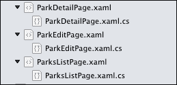
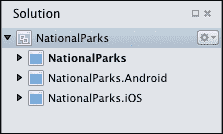

# 第八章. 使用 Xamarin.Forms 进行共享

在本章中，我们将讨论 Xamarin.Forms，这是一个跨平台开发框架。考虑到这一点，我们将涵盖以下领域：

+   页面、视图（控件）和布局

+   在 Xamarin.Forms 中的导航

+   XAML 和代码后置类

+   数据绑定

+   渲染器

+   `DependencyService` API

+   应用程序启动

+   项目组织

+   将 `NationalParks` 应用程序转换为使用 Xamarin.Forms

# 对 Xamarin.Forms 框架的深入了解

Xamarin.Forms 框架可用于为 Android、iOS 和 Windows Phone 开发移动应用程序。它为每个平台使用几乎相同的源代码库，同时仍然提供特定于平台的外观和感觉。Xamarin.Forms 可从 Xamarin 的任何付费许可证或 30 天评估版中使用。

### 小贴士

虽然我们提到 Xamarin.Forms 应用程序可以在 Windows Phone 上运行，但 Windows Phone 的许可、配置和开发细节超出了本书的范围。

与本书之前描述的方法不同，Xamarin.Forms 为您提供了一套抽象，涵盖了整个用户界面，从而允许 UI 代码和规范在多个平台之间重用。在运行时，Xamarin.Forms 使用每个平台本地的控件来渲染用户界面，这使得应用程序能够保持本地的外观和感觉。

本章分为两个主要部分：在第一部分，我们介绍在使用 Xamarin.Forms 之前需要理解的核心概念；在第二部分，我们将把我们的 `NationalParks` 应用程序转换为使用 Xamarin.Forms 框架。

## 页面

**页面**是一个视觉元素，用于组织用户在屏幕上一次性看到的全部内容。Xamarin.Forms 页面本质上类似于 Android 活动或 iOS 视图控制器。Xamarin.Forms 为您的应用程序提供了以下基本页面，其中每个类型都有相应的描述：

| 类型 | 描述 |
| --- | --- |
| `ContentPage` | 这允许您将一组控件或视图组织成布局以供显示和与用户交互 |
| `MasterDetailPage` | 这管理两个页面——主页面和详细页面——以及它们之间的导航 |
| `NavigationPage` | 这管理一组其他页面的导航 |
| `TabbedPage` | 这管理一组子页面，并允许您通过标签进行导航 |
| `CarouselPage` | 这管理一组子页面，并允许您通过滑动进行导航 |

## 视图

**视图**是一个视觉控件（或小部件），用于展示信息并允许用户与您的应用程序交互（如按钮、标签和编辑框等）。这些控件通常继承自 `View` 类。以下表格表示了在撰写本书时 Xamarin.Forms 提供的视图列表：

| `ActivityIndicator` | `BoxView` | `Button` | `DatePicker` |
| --- | --- | --- | --- |
| `Editor` | `Entry` | `Image` | `Label` |
| `ListView` | `OpenGLView` | `Picker` | `ProgressBar` |
| `SearchBar` | `Slider` | `Stepper` | `Switch` |
| `TableView` | `TimePicker` | `WebView` |   |

## 布局

控件托管在一种特殊类型的 View 中，称为**布局**。有两种不同类型的布局：托管和非托管。托管布局负责安排其托管的控件，而非托管布局需要开发者指定控件应该如何排列。Xamarin.Forms 提供了以下布局：

| 布局 | 描述 |
| --- | --- |
| `ContentView` | 这是一个可以包含子视图的布局。通常，`ContentView`不直接使用，而是用作其他布局的基础。 |
| `Frame` | 这是一个可以包含单个子视图并提供填充等框架选项的布局。 |
| `ScrollView` | 这个布局能够滚动其子视图。 |
| `AbsoluteLayout` | 这个布局允许其子视图根据应用程序的要求通过绝对位置进行定位。 |
| `Grid` | 这个布局允许内容在行和列中显示。 |
| `RelativeLayout` | 这个布局通过使用约束将视图相对于它拥有的其他视图进行定位。 |
| `StackLayout` | 这个布局将视图水平或垂直地放置在单行中。 |

## 单元格

**单元格**是一种特殊的控件，用于在列表中排列信息；具体来说，是`ListView`或`TableView`。单元格从`Element`类派生，而不是从`VisualElement`类派生，并作为模板来创建`VisualElements`。

Xamarin.Forms 提供了以下类型的 Cells：

| 单元格类型 | 描述 |
| --- | --- |
| `EntryCell` | 这是一个带有标签和单个文本输入字段的 Cell。 |
| `SwitchCell` | 这是一个带有标签和开关视图（开/关）的 Cell。 |
| `TextCell` | 这是一个带有主文本和次文本的 Cell。通常，主文本用作标题，次文本用作副标题。 |
| `ImageCell` | 这是一个包含图像的`TextCell`。 |

## 导航

在 Xamarin.Forms 应用程序中，**导航**是通过使用`VisualElement`的导航属性来实现的。这通常通过页面访问，导航属性的类型为`INavigation`接口，它提供了以下方法：

| 类型 | 描述 |
| --- | --- |
| `PushAsync()` | 此方法将页面推送到导航堆栈 |
| `PushModalAsync()` | 此方法将页面推送到导航堆栈作为模态对话框 |
| `PopAsync()` | 此方法从导航堆栈中移除当前页面 |
| `PopModalAsync()` | 此方法从导航堆栈中移除当前模态页面 |
| `PopToRootAsync()` | 此方法从导航堆栈中移除所有页面，除了根页面 |

在 Xamarin.Forms 中，导航的美丽之处在于其简单性。要导航到新页面并将数据传递到新页面，你只需要创建一个新页面的实例，在构造函数中传递数据，然后将此页面推送到导航堆栈，如下面的代码示例所示：

```cs
public partial class ParkDetailPage : ContentPage
{
    . . .
    public void EditClicked(object sender, EventArgs e)
    {
        Navigation.PushModalAsync (
            new ParkEditPage (_park));
    }
}
```

## 定义 Xamarin.Forms 用户界面

如同许多 UI 框架一样，Xamarin.Forms 允许两种不同的方法来创建用户界面：声明性和程序化：

+   **程序化方法**：当使用这种方法时，开发者将 API 调用嵌入到构建 UI 中，并控制大小和位置

+   **声明性方法**：当使用这种方法时，开发者创建 XAML 文件来定义用户界面的内容和布局

### 可扩展应用程序标记语言 (XAML)

**可扩展应用程序标记语言**（**XAML**）是由微软开发的一种基于 XML 的语言。XAML 允许开发者使用 XML 来指定要实例化的对象层次结构。它可以以多种方式使用，但最成功的是作为指定**Windows Presentation Foundation**（**WPF**）、Silverlight、Windows Runtime 和现在 Xamarin.Forms 用户界面的手段。

XAML 文件在构建时解析以验证指定的对象，并在运行时实例化对象层次结构。

除了指定对象层次结构外，XAML 还允许开发者指定属性值和分配事件处理器。但是，它不允许你嵌入代码或逻辑。

以下 XAML 文件定义了`ContentPage`视图的内容：

```cs
<?xml version="1.0" encoding="UTF-8" ?>
<ContentPage xmlns="http://xamarin.com/schemas/...
    xmlns:x="http://schemas.microsoft.com/winfx...
    x:Class="NationalParks.ParkEditPage">
  <StackLayout Orientation="Vertical"
    HorizontalOptions="StartAndExpand">
    <Grid>
      <Grid.ColumnDefinitions>
        <ColumnDefinition Width="Auto" />
        <ColumnDefinition Width="*" />
        </Grid.ColumnDefinitions>
        <Label
          Text="Name:"
          Grid.Row="0" Grid.Column="0" />
  <Entry
          x:Name="descriptionEntry"
          Text="{Binding Name}"
          Grid.Row="0" Grid.Column="1"
          HorizontalOptions="FillAndExpand" />
  . . .
   </Grid>
   <Button
       x:Name="doneButton" 
       Text="Done"
       Clicked="DoneClicked" />
  </StackLayout>
</ContentPage>
```

看一下之前的 XAML 规范：

+   类名为`ParkEditPage`，并在`ContentPage`元素中指定

+   使用`Grid`布局来组织页面中的内容

+   两个组件被分配了属性名称，`nameEntry`和`doneButton`

+   `doneButton`组件被分配了一个名为`DoneClicked`的`Clicked`事件处理器

### 代码后置类

当你在 Xamarin.Forms 应用程序中创建一个页面时，实际上会创建两个文件：一个 XAML 文件和一个类文件。Xamarin Studio 将类文件嵌套在 XAML 文件下的**解决方案**面板中，如下面的截图所示：



`.xaml.cs`文件有时被称为代码后置类。它们被创建来包含所有与页面定义一起使用的应用程序逻辑的事件处理器。以下示例显示了`ParkEditPage`的代码后置类：

```cs
public partial class ParkEditPage : ContentPage
{
  NationalPark _park;
  public ParkEditPage()
  {
    InitializeComponent ();
  }
  protected void DoneClicked(object sender, EventArgs e)
  {
    // perform event handler logic
  }
}
```

你应该注意以下类定义的方面：

+   `ParkEditPage`是一个部分类定义。

+   `DoneClicked()`事件处理器定义在这个类文件中。这是分配给 XAML 中`Done`按钮的事件处理器。

+   在早期文件中没有定义属性定义。

那么，属性定义在哪里呢？每次构建应用程序时，Xamarin Studio 都会生成第二个代码文件。对于我们的示例，文件将被命名为`ParkEditPage.xaml.g.cs`，并将包含以下代码片段：

```cs
public partial class ParkEditPage : ContentPage {
    private Entry nameEntry;    
    . . .    
    private Button doneButton;  
    private void InitializeComponent() {
        this.LoadFromXaml(typeof(ParkEditPage));
        nameEntry =
          this.FindByName <Entry>("nameEntry");
        . . .
        doneButton =
          this.FindByName <Button>("doneButton");
    }
}
```

你应该注意以下几点：

+   在`ParkEditPage`文件上定义了两个属性：`nameEntry`和`doneButton`。这些属性直接从 XAML 文件中找到的名称生成。

+   生成一个名为`InitializeComponent()`的方法。该方法必须从`ParkEditPage.xaml.cs`中定义的任何构造函数中调用。

+   `InitializeComponent()`方法调用`LoadFromXaml()`来实例化由`ParkEditPage.xaml`定义的所有对象。

+   `InitializeComponent()`方法调用`FindByName()`将每个属性绑定到其对应的实例。

## 数据绑定

数据绑定的概念在第七章“与 MvvmCross 共享”部分中详细讨论，该部分标题为“数据绑定”。Xamarin.Forms 提供了一个遵循与 MvvmCross、**Windows** **Presentation Foundation** (**WPF**)、Silverlight 和 Windows Runtime 相同架构的数据绑定功能。

在 Xamarin.Forms 应用程序中，绑定规范通常在 XAML 中指定。以下 XAML 规范演示了将`Entry`控制的`Text`属性绑定到`NationalPark`对象的`Name`属性：

```cs
    <Entry x:Name="nameEntry"
        Text="{Binding Name}"
        Grid.Row="0" Grid.Column="1"
        HorizontalOptions="FillAndExpand" />
```

通常，绑定上下文通过代码设置。以下示例演示了如何在页面级别通过编程方式设置绑定上下文为`NationalPark`对象：

```cs
public ParkEditPage (NationalPark park)
{
    InitializeComponent ();
    _park = park;
    BindingContext = _park;
}
```

在前面的示例中，为整个页面设置了绑定上下文。有时，控件提供了需要设置的绑定上下文以完成数据绑定。以下示例演示了设置`ListView`控制的绑定上下文：

```cs
parksListView.ItemsSource =
  NationalParksData.Instance.Parks;
```

### 注意

注意，`ListView`控制的绑定上下文是一个名为`ItemsSource`的属性。

## 使用 Renderer

Xamarin.Forms 使用平台原生控件来渲染用户界面，这使得应用程序能够保持用户对每个平台预期的外观和感觉。这是通过使用 Renderer 实现的。页面、布局和控制代表用于描述用户界面的抽象集合。这些元素中的每一个都是使用`Renderer`类渲染的，该类根据应用程序运行的平台创建一个原生控件。

开发者可以创建自己的 Renderer 以自定义特定控件在平台上的渲染方式。

## 原生特性和 DependencyService API

到目前为止，我们主要关注的是使用可以在所有平台上重用的抽象。那么，如果你需要访问特定平台的特定功能呢？这就是`DependencyService` API 的用武之地。`DependencyService` API 是一个允许每个平台注册一个特定于平台的服务的 API，该服务可以通过一个公共接口被共享代码调用。

使用`DependencyService` API 涉及以下三个步骤：

1.  首先，你需要创建一个接口，该接口公开了必须为每个平台实现的平台特定方法。

1.  在此步骤之后，为每个平台创建接口的实现，并使用`assembly`属性注册实现。

1.  总结来说，从共享代码中调用`DependencyService.Get<MyInterface>`以查找适当的实现并调用返回实例上的服务。

我们将在本章的*添加对 DependencyService 的调用*部分稍后演示`DependencyService` API 的使用。

## 应用启动

Xamarin.Forms 应用以原生应用的方式启动，这意味着遵循传统的启动序列。在启动序列中，应用执行以下两个任务：

1.  调用初始化 Xamarin.Forms 运行时的方法。

1.  启动第一个页面。

### 共享应用类

默认情况下，Xamarin.Forms 应用会创建一个共享的`App`类，其中包含一个返回当应用启动时应展示的第一个页面的单个静态方法。以下代码演示了这一点：

```cs
public class App
{
    public static Page GetMainPage()
    {
        return new HelloWorldPage();
    }
}
```

这种简单的方法允许每个应用的特定平台启动代码调用`GetMainPage()`方法以确定要启动哪个页面。因此，它只在一个地方指定。

### iOS 应用

在一个 Xamarin.Forms iOS 应用中，初始化是在`AppDelegate`类的`FinishedLaunching()`方法中执行的，如下所示：

```cs
[Register("AppDelegate")]
public partial class AppDelegate : UIApplicationDelegate
{
  UIWindow window;
  public override bool FinishedLaunching(UIApplication app, NSDictionary options)
  {
    Forms.Init();
    window = new UIWindow(UIScreen.MainScreen.Bounds);
    window.RootViewController =
        App.GetMainPage().CreateViewController();
    window.MakeKeyAndVisible();
    return true;
  }
}
```

### 安卓应用

在一个 Xamarin.Forms 安卓应用中，初始化是在带有`MainLauncher=true`属性的`Activity`实例中完成的。这可以在以下代码片段中看到：

```cs
namespace HelloWorld.Android
{
    [Activity(Label="HelloWorld", MainLauncher=true)]
    public class MainActivity : AndroidActivity
    {
        protected override void OnCreate(Bundle bundle)
        {
            base.OnCreate(bundle);
            Xamarin.Forms.Forms.Init(this, bundle);
            SetPage(App.GetMainPage());
        }
    }
}
```

## 项目组织

Xamarin.Forms 项目通常使用以下两种项目模板之一创建，可以通过导航到“**新建解决方案**”对话框中的**C#** | **移动应用**来找到：

+   **空白应用 (Xamarin.Forms 可移植)**

+   **空白应用 (Xamarin.Forms 共享)**

这两种模板之间的区别是用于存放共享代码的项目类型。使用第一个模板，共享代码存放在可移植类库中，而使用第二个模板，共享代码存放在共享项目中。共享项目允许所有引用项目重用其包含的代码，但代码是针对每个引用项目特定编译的。

### 小贴士

如果你计划在某个时候将 Windows Phone 项目添加到解决方案中，你将熟悉使用 PCL 解决方案。这将要求你在 PCL 的限制内工作，但将确保你的代码与更多平台兼容。

创建一个 Xamarin.Forms 解决方案后，你会看到创建了三个实际的项目。第一个项目包含共享代码，第二个项目包含 iOS 代码，第三个项目包含安卓代码。如果我们成功使用 Xamarin.Forms，大部分代码将最终位于共享项目中。以下截图显示了使用 PCL 模板创建的项目示例：



# 创建 NationalParks 的 Xamarin.Forms 应用

现在我们已经对 Xamarin.Forms 有了坚实的理解，让我们将`NationalParks`应用程序转换为使用新框架。在这个练习中，我们将遵循迄今为止在 iOS 应用程序中使用的相同应用程序流程，这意味着我们将有一个列表页面、一个用于查看的详细页面以及一个用于添加和更新的编辑页面。

## 创建解决方案

我们将首先通过以下步骤创建一个全新的项目：

1.  首先，访问**文件**菜单并导航到**新建** | **新建解决方案**。

1.  在**新建解决方案**对话框中，导航到**C#** | **移动应用**，选择**空白应用（Xamarin.Forms Portable）**模板，在**名称**字段中输入`NationalParks`，选择合适的**位置**值，然后点击**确定**。

1.  检查项目结构。您将看到以下提示：

    +   在`NationalParks.iOS`项目中打开`AppDelegate.cs`。注意对`Forms.Init()`和`App.GetMainPage()`的调用。

    +   在`NationalParks.Android`项目中打开`MainActivity.cs`。注意对`Forms.Init()`和`App.GetMainPage()`的调用。

    +   在`NationalParks`项目中打开`App.cs`。注意静态方法`GetMainPage()`。

1.  最后，运行`NationalParks.Android`和`NationalParks.iOS`项目。

### 添加 NationalParks.PortableData

我们下一步是将第七章中的存储解决方案分享与 MvvmCross 引入。按照以下步骤将存储解决方案添加到我们的新 Xamarin.Forms 解决方案中：

1.  首先，您需要将第七章中的`NationalParks.PortableData`和`NationalParks.IO`项目从解决方案文件夹复制到新的解决方案文件夹中。

1.  将每个项目添加到新的解决方案文件夹中，方法是选择解决方案，右键单击它，导航到**添加** | **添加现有项目**，然后选择项目文件，例如，`NationalParks.IO.csproj`。

1.  通过选择每个项目的**引用**文件夹，右键单击它们，选择**编辑引用**，并将`NationalParks.PortableData`项目作为引用添加到新的`NationalParks`、`NationalParks.Android`和`NationalParks.iOS`项目中。

1.  现在，我们需要将`FileHandler.cs`文件链接添加到`NationalParks.Android`和`NationalParks.iOS`项目中。对于每个项目，创建一个名为`NationalParks.IO`的新文件夹，并选择新文件夹，右键单击它，导航到**添加** | **添加文件**，选择`FileHandler`，选择**打开**，选择**添加文件链接**，然后点击**确定**。

1.  为了验证所有之前的步骤，您应该编译新的解决方案。

## 实现 ParksListPage

现在，我们可以开始工作于用户界面，从显示公园的列表视图开始，按照以下步骤操作：

1.  选择`NationalParks`项目，右键单击它，然后导航到**添加** | **新建文件**。从**新建文件**对话框中，导航到**表单** | **表单内容页 XAML**，在**名称**字段中输入`ParksListPage`，然后选择**新建**。

1.  现在，你应该打开`ParkListPage.xaml`。你会看到一个空的`ContentPage`元素。添加一个垂直方向的`StackLayout`，其中包含一个`ListView`实例和一个`Button`实例，如下所示：

    ```cs
    <StackLayout Orientation="Vertical"
        HorizontalOptions="StartAndExpand">
        <ListView x:Name="parksListView"
            IsVisible="true"
            ItemSelected="ParkSelected">
        </ListView>
        <Button Text="New"
      Clicked="NewClicked" />
    </StackLayout>
    ```

    ### 提示

    注意`parkListView`的`ParkSelected`事件处理程序和`New`按钮的`NewClicked`事件处理程序。

1.  现在，让我们为`ListView`添加行定义。`ListView`元素有一个`DataTemplate`属性，它定义了每一行的布局。以下布局应定义一个标签，用于显示公园的名称和描述。这应该放置在 XAML 中的`ListView`元素内：

    ```cs
    <ListView.ItemTemplate>
      <DataTemplate>
        <ViewCell>
           <ViewCell.View>
         <StackLayout Orientation="Vertical"
               HorizontalOptions="StartAndExpand">
               <Label Text="{Binding Name}"
                 HorizontalOptions="FillAndExpand" />
             </StackLayout>
          </ViewCell.View>
        </ViewCell>
      </DataTemplate>
    </ListView.ItemTemplate>
    ```

    注意两个`Label`视图的绑定规范。

1.  在`NationalParks`项目中打开`App.cs`，将主页面更改为`ParksListPage`。我们还需要创建`NavigationPage`作为`ParksListPage`的所有者以支持推送和弹出导航。`GetMainPage()`方法应包含以下代码：

    ```cs
    public static Page GetMainPage ()
    {
        NavigationPage mainPage =
            new NavigationPage(new ParksListPage());
        return mainPage;
    }
    ```

1.  在`NationalParks.iOS`项目中打开`AppDelegate.cs`。然后，在调用`Forms.Init()`之前，将以下初始化代码添加到`FinishedLaunching()`方法中：

    ```cs
    // Initialize data service
    NationalParksData.Instance.DataDir =
        Environment.CurrentDirectory;
    NationalParksData.Instance.FileHandler =
        new FileHandler ();
    ```

1.  在`NationalParks.Android`项目中打开`MainActivity.cs`。一旦进入，请在调用`Forms.Init()`之前在`OnCreate()`方法中添加以下初始化代码：

    ```cs
    // Initialize data service
    NationalParksData.Instance.DataDir =
        System.Environment.GetFolderPath(
            System.Environment.SpecialFolder.MyDocuments);
    NationalParksData.Instance.FileHandler =
        new FileHandler ();
    ```

1.  打开`ParksListPage.xaml.cs`，添加一个用于加载公园数据的方法，并设置绑定上下文：

    ```cs
    public async Task LoadData()
    {
      await NationalParksData.Instance.Load();
      parksListView.ItemsSource =
          NationalParksData.Instance.Parks;
    }
    ```

1.  在构造函数中添加对`LoadData()`的调用：

    ```cs
      InitializeComponent ();
      LoadData ();
    ```

    ### 注意

    你将无法在`LoadData()`方法中使用`await`，因为它是在构造函数中被调用的。在这种情况下，实际上没有必要等待调用。

1.  最后一步是创建两个用于`NewClicked`和`ParkSelected`的占位事件处理程序，我们将在完成应用程序时填充它们。

1.  我们现在可以测试我们的工作了。编译并运行`NationalParks.iOS`和`NationalParks.Android`应用程序。

## 实现`ParkDetailPage`

现在，我们需要一个页面来显示公园的详细信息。要创建`ParkDetailPage`，请执行以下步骤：

1.  添加一个名为`ParkDetailPage`的新`ContentPage`实例。

1.  对于`ParkDetailPage`，我们将在`Grid`中显示一系列`Label`视图，并在`Grid`下方显示一组`Button`以启动操作。所有这些内容都将托管在垂直方向的`StackLayout`中。首先添加与上一节相同的`StackLayout`。

1.  添加一个包含一系列`Label`视图的`Grid`布局，以显示`NationalPark`的属性，如下所示：

    ```cs
    <Grid>
        <Grid.ColumnDefinitions>
            <ColumnDefinition Width="Auto" />
            <ColumnDefinition Width="*" />
        </Grid.ColumnDefinitions>
        <Label Text="Name:"
            Grid.Row="0" Grid.Column="0" />
        <Label Text="{Binding Name}"
            Grid.Row="0" Grid.Column="1"
            HorizontalOptions="FillAndExpand" />
        . . .
    </Grid>
    ```

    ### 注意

    注意`Grid.Row`和`Grid.Column`的指定，它们控制`Label`和`Entry`视图的定位。

1.  现在，添加三个用于页面可执行操作的`Button`定义，如下所示：

    ```cs
    <Button Text="Edit"
                  WidthRequest="175"
                  HorizontalOptions="Center"
                  Clicked="EditClicked" />
    <Button Text="Directions"
                  WidthRequest="175"
                  HorizontalOptions="Center"
                  Clicked="DirectionsClicked" />
    <Button Text="Photos"
                  WidthRequest="175"
                  HorizontalOptions="Center"
                  Clicked="PhotosClicked" />
    ```

1.  添加一个构造函数，接受要显示的`NationalPark`实例。以下代码示例演示了所需的内容：

    ```cs
    NationalPark _park;
    public ParkDetailPage (NationalPark park)
    {
    InitializeComponent ();
      _park = park;
      BindingContext = _park;
    }
    ```

    ### 注意

    注意到构造函数中的最后一行设置了`BindingContext`。这告诉页面如何解析在 XAML 中声明的绑定规范。

1.  为`EditClicked`、`DirectionsClicked`和`PhotosClicked`添加存根事件处理器。

1.  现在，我们需要回到`ParksListPage`类并添加导航逻辑。打开`ParksListPage.xaml.cs`并更新`ParkSelected()`事件处理器，以便对`ParkDetailPage`的`PushAsync()`进行调用，如下所示：

    ```cs
    protected void ParkSelected(object sender,
    SelectedItemChangedEventArgs e)
    {
        Navigation.PushAsync (new
            ParkDetailPage ((NationalPark) e.SelectedItem));
    }
    ```

1.  编译并运行`NationalParks.iOS`和`NationalParks.Android`应用程序。

### 使用 DependencyService 显示方向和照片

如我们之前讨论的，`DependencyService` API 允许应用程序利用平台特定的功能。我们将演示如何使用`DependencyService`来实现显示公园方向和照片的功能。

#### 创建接口

第一步是在共享项目中创建一个接口，描述需要支持的方法。要创建`IParkInfoServices`接口，请执行以下步骤：

1.  首先，选择`NationalParks`项目，右键单击它，然后导航到**添加** | **新建文件**。

1.  导航到**通用** | **空接口**，在**名称**字段中输入`IParkInfoServices`，并选择**新建**。

1.  现在，您需要在接口上创建两个方法，一个用于显示方向，一个用于显示照片；每个都应该接受`NationalPark`作为参数：

    ```cs
    public interface IParkInfoServices
    {
        void ShowDirections(NationalPark park);
        void ShowPhotos(NationalPark park);
    }
    ```

#### 创建 iOS 实现

现在，让我们通过以下步骤创建一个 iOS 实现：

1.  选择`NationalParks.iOS`项目，右键单击它，然后导航到**添加** | **新建文件**。在这个对话框中，导航到**通用** | **空类**，在**名称**字段中输入`iOSParkInfoServices`，并选择**新建**。

1.  添加命名空间`using`子句，Xamarin.Forms、`NationalParks`、`NationalParks.PortableData`和`NationalParks.iOS`。

1.  将`iOSParkInfoServices`类规范更改，使其实现`IParkInfoServices`。

1.  选择`IParkInfoService`，右键单击它，导航到**重构** | **实现接口**，然后按*Enter*。

1.  然后，您应该提供两个方法调用的实现，如下所示：

    ```cs
    public void ShowDirections(NationalPark park)
    {
      if ((park.Latitude.HasValue) &&
          (park.Longitude.HasValue))
      {
        NSUrl url = new NSUrl (
            String.Format (
     "http://maps.apple.com/maps?daddr={0},{1}&saddr=CurrentLocation", park.Latitude, park.Longitude));

        UIApplication.SharedApplication.OpenUrl (url);
      }
    }
    public void ShowPhotos(NationalPark park)
    {
        UIApplication.SharedApplication.OpenUrl (
            new NSUrl(String.Format (
              "http://www.bing.com/images/search?q={0}",
              park.Name)));
    }
    ```

1.  最后，将以下`Dependency`属性添加到`class`文件中的`namespace`定义外部，如下所示：

    ```cs
    [assembly: Dependency (typeof (iOSParkInfoServices))]
    namespace NationalParks.iOS
    {
        . . .
    ```

    `Dependency`属性将类注册到`DependencyService`，以便当调用`Get()`时，可以找到特定平台的实现。

#### 创建 Android 实现

现在，让我们通过以下步骤创建一个 Android 实现：

1.  选择`NationalParks.Android`项目，右键单击它，然后导航到**添加** | **新建文件**。然后，在**新建文件**对话框中，导航到**通用** | **空类**，在**名称**字段中输入`AndroidParkInfoServices`，并选择**新建**。

1.  为命名空间添加`using`子句，Xamarin.Forms、`NationalParks`、`NationalParks.PortableData`和`NationalParks.Droid`。

1.  将`AndroidParkInfoServices`类的规范更改，使其实现`IParkInfoServices`。

1.  然后，选择`IParkInfoService`，右键单击它，导航到**重构** | **实现接口**，并按*Enter*。

1.  为以下两个方法调用提供实现，如下所示：

    ```cs
    public void ShowDirections(NationalPark park)
    {
      if ((park.Latitude.HasValue) &&
        (park.Longitude.HasValue))
     {
         Intent mapIntent = new Intent (Intent.ActionView,
          Android.Net.Uri.Parse (
         String.Format ("geo:0,0?q={0},{1}&z=16 ({2})",
                park.Latitude, park.Longitude,
                park.Name)));
          Forms.Context.StartActivity (mapIntent);
      }
    }
    public void ShowPhotos(NationalPark park)
    {
      Intent urlIntent = new Intent (Intent.ActionView);
      urlIntent.SetData (Android.Net.Uri.Parse (
            String.Format (
            "http://www.bing.com/images/search?q={0}",
            park.Name)));
      Forms.Context.StartActivity (urlIntent);
    }
    ```

    ### 注意

    注意`Forms.Context`的使用。在 Android 的情况下，它包含当前正在执行的`Activity`；在我们的情况下，是`MainActivity`。

1.  将以下`Dependency`属性添加到`class`文件中`namespace`定义之外，如下所示：

    ```cs
    [assembly: Dependency (typeof (AndroidParkInfoServices))]
    namespace NationalParks.iOS
    {
        . . .
    ```

#### 添加对 DependencyService 的调用

现在，我们需要向共享项目添加代码，以便实际调用`ShowDirections()`和`ShowPhotos()`。您需要做的就是打开`ParkDetailPage.xaml.cs`，并填写`DirectionsClicked()`和`PhotosClicked()`的占位符实现，如下所示：

```cs
public void DirectionsClicked(
    object sender, EventArgs e)
{
    DependencyService.Get<IParkInfoServices> ().
        ShowDirections (_park);
}
public void PhotosClicked(
    object sender, EventArgs e)
{
    DependencyService.Get<IParkInfoServices> ().
        ShowPhotos (_park);
}
```

#### 运行应用程序

我们终于准备好运行应用程序了。虽然有几个步骤，但`DependencyService` API 提供了一个非常干净的方法来分离共享和平台特定的代码。运行`NationalParks.iOS`和`NationalParks.Android`应用程序。

## 实现`ParkEditPage`

现在，我们需要一个页面来更新公园信息。要实现`ParkEditPage`，执行以下步骤：

1.  首先，添加一个名为`ParkDetailsPage`的新`ContentPage`。

1.  我们将使用与`ParkDetailPage`相似的布局来实现`ParkEditPage`，除了我们将使用`Entry`视图来允许编辑`NationalPark`的属性。向`ParkEditPage`添加一个`StackLayout`和`Grid`实例，并为`NationalPark`的每个属性添加一系列`Label`和`Entry`视图，如下面的代码片段所示：

    ```cs
    <Label Text="Name:"
        Grid.Row="0" Grid.Column="0" />
    <Entry x:Name="nameEntry"
        Text="{Binding Name}"
        Grid.Row="0" Grid.Column="1"
        HorizontalOptions="FillAndExpand" />
    ```

1.  然后，您可以在编辑过程中添加一个`Done`按钮，如下所示：

    ```cs
    <Button x:Name="doneButton"
                 Text="Done"
                  WidthRequest="175"
                  HorizontalOptions="Center"
                  Clicked="DoneClicked" />
    ```

1.  创建两个构造函数，一个接受`NationalPark`实例并将用于编辑现有公园，另一个不接受`NationalPark`实例并将用于创建新公园，如下面的代码片段所示：

    ```cs
    public ParkEditPage()
    {
    InitializeComponent ();
      _park = new NationalPark ();
      BindingContext = _park;
    }
    public ParkEditPage (NationalPark park)
    {
      InitializeComponent ();
      _park = park;
      BindingContext = _park;
    }
    ```

1.  创建一个名为`DoneClicked()`的事件处理程序，其中包含保存更新后的公园的调用，以及导航调用`PopAsync()`以返回显示`ParkEditPage`的页面，如下所示：

    ```cs
    protected void DoneClicked(object sender, EventArgs e)
    {
        NationalParksData.Instance.Save(_park);
        Navigation.PopAsync ();
    }
    ```

1.  现在，我们需要向`ParkListPage`和`ParkDetailPage`添加导航逻辑。打开`ParkDetailPage.xaml.cs`，并填写`EditClicked()`事件处理程序，其中包含调用`PushAsync()`以显示`ParkEditPage`。将正在查看的公园传递给`ParkEditPage`构造函数，如下所示：

    ```cs
    public void EditClicked(object sender, EventArgs e)
    {
       Navigation.PushAsync(new ParkEditPage(_park));
    }
    ```

1.  打开`ParkListPage.xaml.cs`，并填写`NewClicked()`事件处理程序，其中包含调用`PushAsync()`以显示`ParkEditPage`。调用空的`ParkEditPage`构造函数，以便创建一个新的公园，如下所示：

    ```cs
    protected void NewClicked(object sender, EventArgs e)
    {
        Navigation.PushAsync(new ParkEditPage());
    }
    ```

1.  现在，我们的应用程序已经准备好了；编译并运行`NationalParks.iOS`和`NationalParks.Android`应用程序。

# 考虑利弊

如我们所见，Xamarin.Forms 提供了一种稳健的方法来显著增加在您的移动应用程序中重用的代码量；它具有许多优秀功能：

+   XAML 是定义用户界面的好方法，并允许您以方便、简洁的方式创建属性和分配事件处理器

+   数据绑定功能非常出色，消除了编写大量繁琐、令人厌烦的代码

+   `DependencyService` API 提供了一种访问特定平台功能的好方法

+   `Renderer` 架构提供了极致的可定制性

然而，在撰写本书时，Xamarin.Forms 仍然有些不成熟，存在一些弱点：

+   没有可视设计器用于 XAML 代码，因此您必须构建您的 UI 并运行应用程序以查看其视觉渲染效果

+   由于框架的新颖性，可用的示例数量有限，并且许多示例使用代码构建用户界面，而不是 XAML

+   验证功能似乎相当薄弱

这些批评不应过于严重；跨平台 UI 框架很难构建，我坚信 Xamarin 正在正确的轨道上，并将迅速发展该框架。

# 摘要

在本章中，我们回顾了 Xamarin.Forms 的功能，并将我们的现有 `NationalParks` 应用程序转换为使用该框架。在下一章中，我们将探讨为 iOS 应用程序准备分发的过程。
