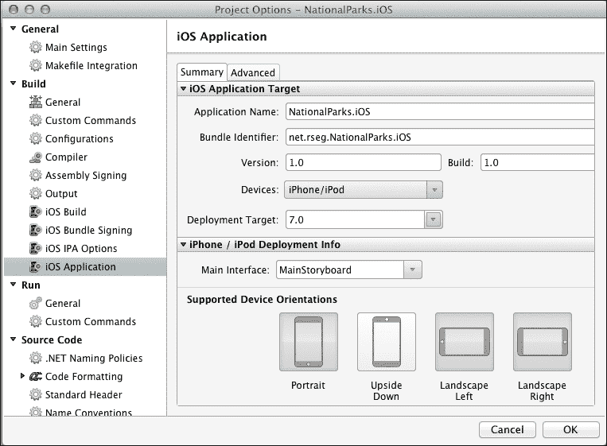
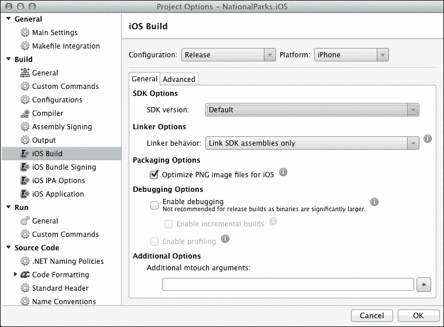
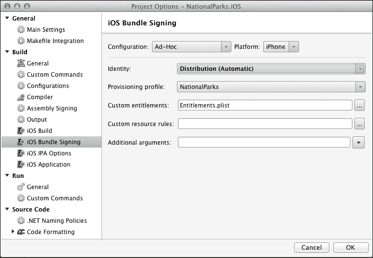
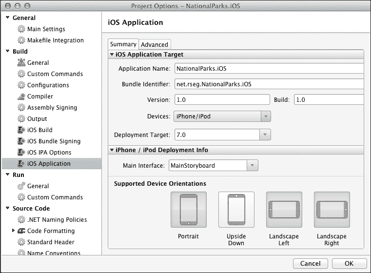
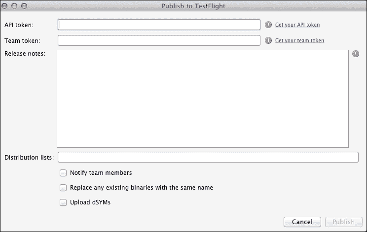

# 第九章：准备分发 Xamarin.iOS 应用

在本章中，我们将讨论与准备分发 Xamarin.iOS 应用相关的活动，并查看分发应用的多种选项。虽然我们将讨论的活动是任何 iOS 应用部署的组成部分，但我们将尝试缩小覆盖范围，仅涵盖开发 Xamarin.iOS 应用时独特的方面。我们将涵盖以下主题：

+   应用分析

+   iOS 应用分发构建设置

+   应用分发选项

# 准备分发

到目前为止，我们的应用已经构建并按预期工作；大部分工作已经完成。现在，我们将注意力转向准备应用分发。本节讨论以下三个准备应用分发的方面：

+   **应用分析**：在这里，我们将查看内存分配问题和性能瓶颈

+   **iOS 应用设置**：在这里，我们将更新版本和构建号等信息设置

+   **iOS 构建设置**：在这里，我们将调整基于目标设备、期望的性能特性和可部署大小而影响的代码生成设置

## 分析 Xamarin.iOS 应用

分析允许开发者在应用执行期间监控其应用，并识别与内存分配和性能瓶颈相关的问题。分析活动可以在应用开发的整个生命周期中执行，但将其纳入过程的后期阶段作为分发前的最终验证特别有益。

Xamarin.iOS 开发者可以选择两种工具来分析应用：MonoTouch 分析器和 Apple 的 Instruments 应用。我们不会复制这些应用的现有文档，但会提供以下链接供参考：

| 工具 | URL |
| --- | --- |
| MonoTouch 分析器 | [`docs.xamarin.com/guides/ios/deployment,_testing,_and_metrics/monotouch_profiler/`](http://docs.xamarin.com/guides/ios/deployment,_testing,_and_metrics/monotouch_profiler/) |
| Apple 的 Instruments 应用 | [`docs.xamarin.com/guides/ios/deployment,_testing,_and_metrics/walkthrough_Apples_instrument/`](http://docs.xamarin.com/guides/ios/deployment,_testing,_and_metrics/walkthrough_Apples_instrument/) |

## iOS 应用（Info.plist）设置

很可能，当你准备开始分发过程时，你需要在 `Info.plist` 中进行的设置大部分已经完成。但是，你可能需要更新一些设置，特别是版本和构建设置。以下截图显示了 **iOS 应用** 设置屏幕：



## iOS 构建设置

Xamarin.iOS 提供了许多选项来优化基于目标设备、可部署应用的大小和执行速度的构建过程。以下几节讨论了与生成最终分发构建最相关的设置。

### SDK 选项

SDK 版本应设置为应用可以部署到的最低 iOS 版本。很可能这个设置已经在开发过程中已经确定。

### 链接器选项

用于构建 Xamarin.iOS 应用的 mTouch 工具包括一个链接器，链接器的目的是减小最终应用的大小。链接器通过在您的应用中对代码执行静态分析来实现这一点，评估引用组件中哪些类和方法实际上被使用，并删除未使用的类、方法和属性。

可以在**项目选项** | **iOS 构建**下的**常规**选项卡中设置链接器的选项，如下面的截图所示：



可以设置以下选项来控制链接过程：

+   **不链接**：此选项禁用链接器并确保所有引用的组件都包含在内，而不进行修改。请注意，这是针对 iOS 模拟器的构建的默认设置，因为排除耗时的静态分析过程可以节省时间。因此，生成的大型 DLL 仍然可以相对快速地部署到模拟器。

+   **仅链接 SDK 组件**：此选项告诉链接器仅对 SDK 组件（即与 Xamarin.iOS 一起发货的组件）进行操作。这是针对设备的目标构建的默认设置。

+   **链接所有组件**：此选项告诉链接器对整个应用以及所有引用的组件进行操作。这允许链接器使用更大的优化集，并产生可能的最小应用。然而，当链接器以这种方式运行时，由于静态分析过程中做出的错误假设，它更有可能破坏您的代码的一部分。特别是，静态分析可能会因为反射、序列化或任何类型或成员实例未静态引用的代码而陷入困境。

以下表格总结了在第六章 *共享游戏*中生产的`NationalParks`应用两个版本链接的结果：

|   | 文件链接版本 | PCL 版本 |
| --- | --- | --- |
| **不链接** | 47.5 MB | 48.4 MB |
| **仅链接 SDK 组件** | 6.7 MB | 7.3 MB |
| **链接所有组件** | 5.8 MB | 6.4 MB |

如表所示，从**不链接**到**仅链接 SDK 组件**的转变实现了应用大小最大的差异。

#### 覆盖链接器

链接器在上一节中展示了其提供的巨大好处。然而，有时你可能需要覆盖链接器的默认行为，因为链接器可能会删除应用实际使用的类型和成员实例。这将导致与这些类型和/或成员未找到相关的运行时异常。以下表格描述了三种改变链接器行为的方法，以避免丢失重要的类型和成员：

| 技术 | 描述 |
| --- | --- |

| 保留代码 | 如果你在测试中确定链接器正在删除你的应用所需的类或方法，你可以通过在类和/或方法上使用`Preserve`属性来明确告诉链接器始终包含它们。要保留整个类型，请使用：

```cs
[Preserve (AllMembers = true)]
```

要保留单个成员，请使用：

```cs
[Preserve (Conditional=true)]
```

|

| 跳过程序集 | 在某些情况下，你可能需要告诉链接器跳过整个程序集，因为你没有修改源代码的能力（第三方库）。这可以通过使用命令行选项`linkskip`来完成。例如：

```cs
--linkskip=someassembly
```

|

| 禁用**链接移除** | 链接器采用的一种优化是移除在实际设备上非常不可能使用的代码；那些标记为不受支持或禁止的功能。在罕见的情况下，这些功能可能对应用的功能是必需的。此优化可以通过使用命令行选项`--nolinkaway`来禁用。 |
| --- | --- |

### 调试选项

调试选项应始终在发布构建中禁用。启用调试可能导致二进制文件显著增大。

### 代码生成选项

代码生成选项控制根据目标处理器和期望的性能特性在构建过程中创建的代码。此设置下的选项将在以下章节中解释。

#### 支持的架构

支持的架构标识了结果构建应支持的处理器架构。从原始 iPhone 到 iPhone 3G，使用了 ARMv6 CPU。较新的 iPhone 和 iPad 型号使用 ARMv7 或 ARMv7s 架构，而 iPhone 5s 引入了基于 ARMv8a 架构的 A7 处理器的使用。

ARMv6 不支持 Xcode 4.5 之前的版本。如果你需要为旧设备构建，你需要使用安装的较早版本的 Xcode。

#### LLVM 优化编译器

Xamarin.iOS 附带两个不同的代码生成引擎：普通的 Mono 代码生成引擎和基于 LLVM 优化编译器的引擎。LLVM 引擎在编译时间成本下，比 Mono 引擎生成更快、更小的代码。因此，当你在开发应用时，Mono 代码生成引擎更方便使用，而 LLVM 引擎则更适合用于将分发构建。

#### ARM thumb 指令集

ARM Thumb 指令集是 ARM 处理器使用的更紧凑的指令集。通过启用 Thumb 支持，你可以以牺牲较慢的执行时间为代价来减小可执行文件的大小。Thumb 由 ARMv6、ARMv7 和 ARMv7s 支持。

# 分发 Xamarin.iOS 应用

Xamarin.iOS 支持所有 iOS 开发者可访问的传统分发方法。Xamarin 网站和 Apple 开发者网站上关于 iOS 应用分发的信息非常丰富。我们并不试图复制那些详尽的资源库。以下章节旨在从 Xamarin.iOS 的角度提供一个概述。

## Ad Hoc 和企业分发

Ad Hoc 分发和企业分发允许应用在不经过 App Store 的情况下进行分发。Ad Hoc 通常用于支持即将发布的测试工作。企业分发用于分发不面向公众的应用，而是面向单个企业内部用户使用。在两种情况下，都必须创建一个 iOS App Store Package (IPA)。

### 注意

生成企业分发需要 Apple 的企业账户和 Enterprise Xamarin.iOS 许可证。

创建 IPA 的步骤如下：

1.  在 [developer.apple.com](http://developer.apple.com) 上为您的应用创建并安装分发配置文件。有关此过程的详细说明，请参阅 [`docs.xamarin.com/guides/ios/deployment,_testing,_and_metrics/app_distribution_overview/publishing_to_the_app_store/`](http://docs.xamarin.com/guides/ios/deployment,_testing,_and_metrics/app_distribution_overview/publishing_to_the_app_store/) 中的 *创建和安装分发配置文件* 部分。

1.  通过导航到 **项目选项** | **构建** | **iOS 包签名**，设置用于构建新安装配置文件的 **配置文件** 选项，如图所示：

1.  将应用的 **Bundle Identifier** 选项设置为在创建分发配置文件时使用的相同值，方法是通过导航到 **项目选项** | **构建** | **iOS 应用**，如图所示：

1.  IPA 创建完成后，只需在 finder 中导航到 IPA，双击它，它将在 iTunes 中打开。现在可以使用 iTunes 在设备上同步应用。

### TestFlight 分发

**TestFlight**是一个基于云的应用程序分发服务，用于分发应用程序的预发布版本。Xamarin Studio 提供了与**TestFlight**服务的集成，以便可以直接从 IDE 中上传**Ad Hoc**构建。在上传构建之前，您必须在**TestFlight**服务中创建一个账户并定义测试团队和应用程序。这可以通过[`www.testflightapp.com`](https://www.testflightapp.com)完成。

要将构建上传到 TestFlight，请执行以下步骤：

1.  选择**Ad Hoc**作为构建类型，并从主菜单中的**项目** | **发布**导航到**TestFlight**。

1.  输入**API 令牌**和**团队令牌**，这些是在您设置应用程序和团队时由**TestFlight**分配的。您可以点击这些字段旁边的链接，在浏览器中显示相应的值。

1.  输入**发布说明**，以便让测试者知道新版本中修复了什么以及/或者添加了什么。

1.  输入**分发列表**并开启**通知团队成员**，以便在发布说明中发送电子邮件通知。

1.  选择选项，**替换具有相同名称的现有二进制文件**和**上传 dSYMs**，然后点击**发布**。Xamarin Studio 将构建应用程序并将其上传到 TestFlight。

## App Store 提交

通过 App Store 分发应用程序对 Xamarin.iOS 应用程序来说与其他 iOS 应用程序几乎相同。除了生成发布构建之外，大部分工作都是在 Xamarin Studio 之外完成的。您需要在**项目选项**对话框的**iOS 捆绑签名**部分输入**配置文件**值。

以下链接提供了将 Xamarin.iOS 应用程序发布到 App Store 的详细步骤：[`docs.xamarin.com/guides/ios/deployment,_testing,_and_metrics/app_distribution_overview/publishing_to_the_app_store/`](http://docs.xamarin.com/guides/ios/deployment,_testing,_and_metrics/app_distribution_overview/publishing_to_the_app_store/)。

# 摘要

在本章中，我们讨论了准备应用程序分发相关的活动、可用的分发渠道以及分发应用程序涉及的过程。在下一章中，我们将探讨分发 Xamarin.Android 应用程序的相同方面。
