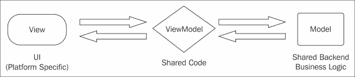
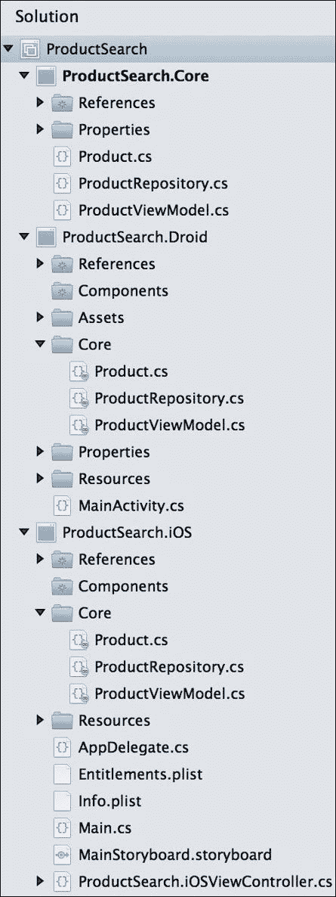
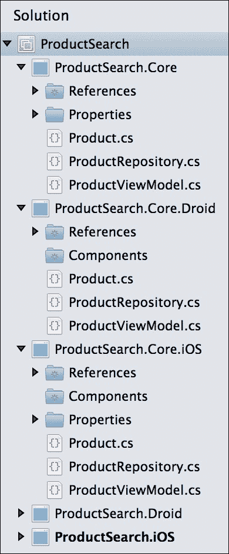

# 第三章. iOS 和 Android 之间的代码共享

Xamarin 的工具承诺在尽可能利用每个平台的本地 API 的同时，在 iOS 和 Android 之间共享大量代码。这样做更多的是一项软件工程练习，而不是编程技能或对每个平台的知识。为了构建一个支持代码共享的 Xamarin 应用程序，必须将应用程序分成不同的层。在本章中，我们将介绍这一基本概念，以及在特定情况下需要考虑的特定选项。

在本章中，我们将介绍以下内容：

+   MVVM 设计模式用于代码共享

+   项目和解决方案组织策略

+   可移植类库 (PCLs)

+   平台特定代码的预处理器语句

+   依赖注入 (DI) 简化版

+   控制反转 (IoC)

# 学习 MVVM 设计模式

**模型-视图-视图模型**（**MVVM**）设计模式最初是为使用 **XAML** 将 UI 与业务逻辑分离并充分利用 **数据绑定** 的 **Windows Presentation Foundation**（**WPF**）应用程序发明的。以这种方式构建的应用程序具有一个独立的 ViewModel 层，该层不依赖于其用户界面。这种架构本身优化了单元测试以及跨平台开发。由于应用程序的 ViewModel 类不依赖于 UI 层，因此可以轻松地将 iOS 用户界面替换为 Android 用户界面，并对 ViewModel 层进行测试。

MVVM 设计模式与之前章节中讨论的 MVC 设计模式也非常相似。

MVVM 设计模式包括以下内容：

+   **模型**：模型层是驱动应用程序及其相关业务对象的底层业务逻辑。这可以是从服务器发送网络请求到使用后端数据库的任何操作。

+   **视图**：这一层是屏幕上实际看到的用户界面。在跨平台开发的情况下，它包括驱动应用程序用户界面的任何平台特定代码。在 iOS 上，这包括应用程序中使用的控制器，在 Android 上，则是应用程序的活动。

+   **视图模型**：这一层在 MVVM 应用程序中充当粘合剂。ViewModel 层协调视图和模型层之间的操作。ViewModel 层将包含视图将获取或设置的属性，以及用户可以对每个视图执行的操作的函数。如果需要，ViewModel 层还将调用模型层的操作。

下图展示了 MVVM 设计模式：



需要注意的是，传统上，视图和视图模型层之间的交互是通过 WPF 的数据绑定创建的。然而，iOS 和 Android 没有内置的数据绑定机制，所以本书中的一般方法将是手动从视图层调用视图模型层。有一些框架提供了数据绑定功能，例如**MVVMCross**（本书未涉及）和**Xamarin.Forms**。

## 在示例中实现 MVVM

为了更好地理解这个模式，让我们实现一个常见的场景。假设我们在屏幕上有一个搜索框和一个搜索按钮。当用户输入一些文本并点击按钮时，将向用户显示产品列表和价格。在我们的示例中，我们使用了 C# 5 中可用的**async**和**await**关键字来简化异步编程。

要实现这个功能，我们将从一个简单的`model`类（也称为**业务对象**）开始，如下所示：

```cs
public class Product
{
    public int Id { get; set; } //Just a numeric identifier
    public string Name { get; set; } //Name of the product
    public float Price { get; set; } //Price of the product
}
```

接下来，我们将实现我们的模型层，根据搜索词检索产品。这是执行业务逻辑的地方，表示搜索实际上应该如何工作。这体现在以下代码行中：

```cs
// An example class, in the real world would talk to a web
// server or database.
public class ProductRepository
{
  // a sample list of products to simulate a database
  private Product[] products = new[]
  {
    new Product { Id = 1, Name = "Shoes", Price = 19.99f },
    new Product { Id = 2, Name = "Shirt", Price = 15.99f },
    new Product { Id = 3, Name = "Hat", Price = 9.99f },
  };
  public async Task<Product[]> SearchProducts(string searchTerm)
  {
    // Wait 2 seconds to simulate web request
    await Task.Delay(2000);

    // Use Linq-to-objects to search, ignoring case
    searchTerm = searchTerm.ToLower();
    return products.Where(p => p.Name.ToLower().Contains(searchTerm)).ToArray();
  }
}
```

这里需要注意的是，`Product`和`ProductRepository`类都被视为跨平台应用程序模型层的一部分。有些人可能会将`ProductRepository`视为一个**服务**，它通常是一个自包含的类，用于检索数据。将这个功能分离成两个类是一个好主意。`Product`类的任务是保存有关产品的信息，而`ProductRepository`类负责检索产品。这是**单一职责原则**的基础，该原则指出每个类应该只做一项工作或关注一个方面。

接下来，我们将实现一个`ViewModel`类，如下所示：

```cs
public class ProductViewModel
{
  private readonly ProductRepository repository = new ProductRepository();

  public string SearchTerm
  {
    get;
    set;
  }
  public Product[] Products
  {
    get;
    private set;
  }
  public async Task Search()
  {
    if (string.IsNullOrEmpty(SearchTerm))
      Products = null;
    else
      Products = await repository.SearchProducts(SearchTerm);
  }
}
```

从这里开始，你的平台特定代码开始了。每个平台将处理管理`ViewModel`类的实例，设置`SearchTerm`属性，并在按钮点击时调用`Search`。当任务完成时，用户界面层将更新屏幕上显示的列表。

### 小贴士

如果你熟悉在 WPF 中使用的 MVVM 设计模式，你可能会注意到我们没有为数据绑定实现`INotifyPropertyChanged`。由于 iOS 和 Android 没有数据绑定的概念，我们省略了这一功能。如果你计划为你的移动应用程序创建 WPF 或 Windows 8 版本，或者使用提供数据绑定功能的框架，你应该在需要的地方实现对其的支持。

# 比较项目组织策略

到目前为止，你可能正在问自己，我如何在 Xamarin Studio 中设置解决方案以处理共享代码，并且还要有特定平台的项目？Xamarin.iOS 应用程序只能引用 Xamarin.iOS 类库，因此设置解决方案可能会出现问题。有几种设置跨平台解决方案的策略，每种策略都有其自身的优缺点。

跨平台解决方案的选项如下：

+   **文件链接**：对于这个选项，你将从一个包含所有共享代码的普通.NET 4.0 或.NET 4.5 类库开始。然后，你将为想要应用运行的平台创建一个新的项目。每个特定平台的项目将有一个子目录，其中包含从第一个类库链接的所有文件。要设置此环境，将现有文件添加到项目中，并选择**添加文件链接**选项。任何单元测试都可以针对原始类库运行。文件链接的优点和缺点如下：

    +   **优点**：这种方法非常灵活。你可以选择是否链接某些文件，也可以使用预处理器指令，如`#if IPHONE`。你还可以在 Android 和 iOS 之间引用不同的库。

    +   **缺点**：你必须在三个项目中管理一个文件的存在：核心库、iOS 和 Android。如果这是一个大型应用程序或者许多人正在工作，这可能会很麻烦。这个选项也有些过时，因为共享项目的出现。

+   **克隆项目文件**：这与文件链接非常相似。主要区别在于，除了主项目外，你还有每个平台的类库。通过将 iOS 和 Android 项目放置在主项目的同一目录下，可以添加文件而不需要链接。你可以通过右键单击解决方案并导航到**显示选项** | **显示所有文件**来轻松添加文件。单元测试可以针对原始类库或平台特定版本运行：

    +   **优点**：这种方法与文件链接一样灵活，但你不需要手动链接任何文件。你仍然可以使用预处理器指令并在每个平台上引用不同的库。

    +   **缺点**：你仍然需要在三个项目中管理一个文件的存在。此外，还需要一些手动文件排列来设置此环境。你最终在每个平台上还要管理一个额外的项目。这个选项也有些过时，因为共享项目的出现。

+   **共享项目**：从 Visual Studio 2013 Update 2 开始，微软创建了共享项目的概念，以实现 Windows 8 和 Windows Phone 应用之间的代码共享。Xamarin 也在 Xamarin Studio 中实现了共享项目，作为另一个选项来启用代码共享。共享项目在本质上与文件链接相同，因为向共享项目添加引用实际上是将它的文件添加到你的项目中：

    +   **优点**：这种方法与文件链接相同，但更干净，因为你的共享代码在一个单独的项目中。Xamarin Studio 还提供了一个下拉菜单来切换到每个引用项目，这样你可以看到预处理器语句在代码中的效果。

    +   **缺点**：由于共享项目中的所有文件都会添加到每个平台的主项目中，因此在共享项目中包含特定平台的代码可能会变得很丑陋。如果你有一个大型团队或者团队成员经验不足，预处理器语句可能会迅速失控。共享项目也无法编译成 DLL，因此没有不带源代码共享此类项目的方法。

+   **可移植类库**：这是最佳选项；你开始解决方案时，为所有共享代码创建一个 **可移植类库**（**PCL**）项目。这是一个特殊的项目类型，允许多个平台引用同一个项目，让你可以使用每个平台可用的最小 C# 和 .NET 框架子集。每个特定平台的项⽬也将直接引用这个库以及任何单元测试项目：

    +   **优点**：所有共享代码都在一个项目中，所有平台使用相同的库。由于预处理器语句不可用，PCL 库通常有更干净的代码。特定平台的代码通常通过接口或抽象类来抽象化。

    +   **缺点**：你受限于你目标平台数量的 .NET 子集。特定平台的代码需要使用 **依赖注入**，这可能对于不熟悉它的开发者来说是一个更高级的话题。

## 设置跨平台解决方案

为了完全理解每个选项以及不同情况需要什么，让我们为每个跨平台解决方案定义一个解决方案结构。让我们使用本章前面使用的商品搜索示例，并为每种方法设置一个解决方案。

要设置文件链接，请执行以下步骤：

1.  打开 Xamarin Studio 并启动一个新的解决方案。

1.  在通用 **C#** 部分，选择一个新的 **库** 项目。

1.  将项目命名为 `ProductSearch.Core`，将解决方案命名为 `ProductSearch`。

1.  右键单击新创建的项目，并选择 **选项**。

1.  导航到 **构建** | **常规**，并将 **目标框架** 选项设置为 **.NET Framework 4.5**。

1.  将 `Product`、`ProductRepository` 和 `ProductViewModel` 类添加到本章前面使用的项目中。你需要在需要的地方添加 `using System.Threading.Tasks;` 和 `using System.Linq;`。

1.  从顶部菜单导航到 **构建** | **构建全部**，以确保一切构建正确。

1.  现在，让我们通过右键单击解决方案并导航到 **添加** | **添加新项目** 来创建一个新的 iOS 项目。然后，导航到 **iOS** | **iPhone** | **单视图应用程序** 并将项目命名为 `ProductSearch.iOS`。

1.  通过右键点击解决方案并导航到**添加** | **添加新项目**创建一个新的 Android 项目。通过导航到**Android** | **Android 应用**创建一个新的项目，并将其命名为 `ProductSearch.Droid`。

1.  在 iOS 和 Android 项目中添加一个名为 `Core` 的新文件夹。

1.  右键点击 iOS 项目的新的文件夹，导航到**添加** | **从文件夹添加文件**。选择 `ProductSearch.Core` 项目的根目录。

1.  检查项目根目录下的三个 C# 文件。会出现一个**添加文件到文件夹**的对话框。

1.  选择**添加文件链接**并确保选中了**为所有选定的文件使用相同的操作**复选框。

1.  对于 Android 项目，重复此过程。

1.  从菜单栏的**构建** | **构建所有**导航到**构建**，以双重检查一切。你已经成功使用文件链接设置了一个跨平台解决方案。

当一切完成后，你将有一个类似于以下截图的解决方案树：



当你需要在每个平台上引用不同的库时，你应该考虑使用这项技术。如果你正在使用 `MonoGame` 或其他需要在 iOS 和 Android 上引用不同库的框架，你可能需要考虑使用这个选项。

使用克隆项目文件的方法设置解决方案与文件链接类似，但你将不得不为每个平台创建一个额外的类库。为此，在同一个 `ProductSearch.Core` 目录下创建一个 Android 库项目和 iOS 库项目。你必须手动创建项目并将它们移动到正确的文件夹，然后重新将它们添加到解决方案中。右键点击解决方案并导航到**显示选项** | **显示所有文件**，将这些所需的 C# 文件添加到这两个项目中。你的主要 iOS 和 Android 项目可以直接引用这些项目。

你的项目将看起来像以下截图所示，其中 `ProductSearch.iOS` 引用了 `ProductSearch.Core.iOS`，而 `ProductSearch.Droid` 引用了 `ProductSearch.Core.Droid`：



# 与可移植类库一起工作

**可移植类库**（**PCL**）是一个可以在多个平台上支持，包括 iOS、Android、Windows、Windows Store 应用、Windows Phone、Silverlight 和 Xbox 360 的 C# 库项目。PCLs 是微软为了简化跨不同版本的 .NET 框架的开发而做出的努力。Xamarin 也为 PCLs 添加了对 iOS 和 Android 的支持。许多流行的跨平台框架和开源库开始开发 PCL 版本，例如 Json.NET 和 MVVMCross。

## 使用 PCLs 在 Xamarin 中

让我们创建我们的第一个可移植类库：

1.  打开 Xamarin Studio 并启动一个新的解决方案。

1.  在**通用** | **C#**部分下选择一个新的**可移植库**项目。

1.  将项目命名为 `ProductSearch.Core`，解决方案命名为 `ProductSearch`。

1.  将 `Product`、`ProductRepository` 和 `ProductViewModel` 类添加到本章中较早使用的项目中。您需要在需要的地方添加 `using System.Threading.Tasks;` 和 `using System.Linq;`。

1.  从顶部菜单导航到 **构建** | **构建所有**，以确保一切构建正确。

1.  现在，通过右键单击解决方案并导航到 **添加** | **添加新项目** 来创建一个新的 iOS 项目。通过导航到 **iOS** | **iPhone** | **单视图应用程序** 创建一个新项目，并将其命名为 `ProductSearch.iOS`。

1.  通过右键单击解决方案并导航到 **添加** | **添加新项目** 来创建一个新的 Android 项目。然后，导航到 **Android** | **Android 应用程序** 并将项目命名为 `ProductSearch.Droid`。

1.  简单地从 iOS 和 Android 项目添加对便携式类库的引用。

1.  从顶部菜单导航到 **构建** | **构建所有**，你已成功设置了一个包含便携式库的简单解决方案。

每种解决方案类型都有其独特的优缺点。PCLs 通常更好，但在某些情况下它们无法使用。例如，如果您正在使用像 `MonoGame` 这样的库，这是一个针对每个平台的独立库，那么使用共享项目或文件链接会更好。如果您需要使用像 `#if IPHONE` 这样的预处理器语句或 iOS 或 Android 上的本地库（如 Facebook SDK），也会出现类似的问题。

### 小贴士

设置共享项目几乎与设置便携式类库相同。在步骤 2 中，只需在一般的**C#**部分下选择**共享项目**，然后完成剩余的步骤。

# 使用预处理器语句

当使用共享项目、文件链接或克隆的项目文件时，您最强大的工具之一是使用预处理器语句。如果您不熟悉它们，C# 有能力定义预处理器变量，如 `#define IPHONE`，允许您使用 `#if IPHONE` 或 `#if !IPHONE`。

以下是一个使用此技术的简单示例：

```cs
#if IPHONE
  Console.WriteLine("I am running on iOS");
#elif ANDROID
  Console.WriteLine("I am running on Android");
#else
  Console.WriteLine("I am running on ???");
#endif
```

在 Xamarin Studio 中，您可以通过导航到 **构建** | **编译器** | **定义符号** 来在项目的选项中定义预处理器变量，这些变量用分号分隔。这些变量将应用于整个项目。请注意，您必须为解决方案中的每个配置设置（**调试**和**发布**）设置这些变量；这可能会是一个容易忽略的步骤。您还可以通过在 C#文件的顶部声明 `#define IPHONE` 来定义这些变量，但它们只会在 C#文件内应用。

让我们再举一个例子，假设我们想在每个平台上实现一个打开 URL 的类：

```cs
public static class Utility
{
  public static void OpenUrl(string url)
  {
    //Open the url in the native browser
  }
}
```

前面的例子非常适合使用预处理器语句，因为它非常特定于每个平台，并且是一个相当简单的函数。为了在 iOS 和 Android 上实现这个方法，我们需要利用一些本地 API。重构后的类如下所示：

```cs
#if IPHONE
  //iOS using statements
  using MonoTouch.Foundation;
  using MonoTouch.UIKit;
#elif ANDROID
  //Android using statements
  using Android.App;
  using Android.Content;
  using Android.Net;
#else
  //Standard .Net using statement
  using System.Diagnostics;
#endif

public static class Utility
{
  #if ANDROID
    public static void OpenUrl(Activity activity, string url)
  #else
    public static void OpenUrl(string url)
  #endif
  {
    //Open the url in the native browser
    #if IPHONE
      UIApplication.SharedApplication.OpenUrl(NSUrl.FromString(url));
    #elif ANDROID
      var intent = new Intent(Intent.ActionView,Uri.Parse(url));
      activity.StartActivity(intent);
    #else
      Process.Start(url);
    #endif
  }
}
```

前面的类支持三种不同类型的项目：Android、iOS 和标准的 Mono 或.NET 框架类库。在 iOS 的情况下，我们可以使用苹果 API 中可用的静态类来执行功能。Android 稍微有些问题，需要`Activity`对象来原生地启动浏览器。我们通过修改 Android 上的输入参数来解决这个问题。最后，我们有一个普通的.NET 版本，它使用`Process.Start()`来启动 URL。重要的是要注意，使用第三个选项在 iOS 或 Android 上不会原生工作，这迫使我们使用预处理器语句。

使用预处理器语句通常不是跨平台开发的最佳或最干净的方法。它们通常在狭窄的空间或非常简单的函数中使用得最好。代码很容易失控，并且随着许多`#if`语句的出现，代码的可读性会变得非常困难，因此总是最好适度使用。当类主要针对特定平台时，使用继承或接口通常是更好的解决方案。

# 简化依赖注入

**依赖注入**最初看起来像是一个复杂的话题，但实际上它是一个简单的概念。它是一种设计模式，旨在使你应用程序中的代码更加灵活，以便在需要时可以替换某些功能。这个想法围绕在应用程序中设置类之间的依赖关系，使得每个类只与接口或基类/抽象类交互。这给了你在需要填充本地功能时，在每个平台上自由覆盖不同方法的自由。

这个概念起源于**SOLID**面向对象设计原则，如果你对软件架构感兴趣，你可能想要研究一下这组规则。如果你想要了解更多关于 SOLID 的信息，维基百科上有一篇很好的文章，([`en.wikipedia.org/wiki/SOLID_%28object-oriented_design%29`](http://en.wikipedia.org/wiki/SOLID_%28object-oriented_design%29))。在 SOLID 中，我们感兴趣的是**D**，它代表**依赖**。具体来说，这个原则声明，一个程序应该依赖于抽象，而不是具体实现（具体类型）。

为了扩展这个概念，让我们通过以下例子来讲解：

1.  假设我们需要在一个应用程序中存储一个设置，这个设置用来确定声音是开启还是关闭。

1.  现在让我们声明一个简单的设置接口：`interface ISettings { bool IsSoundOn { get; set; } }`。

1.  在 iOS 上，我们希望使用`NSUserDefaults`类来实现这个接口。

1.  同样，在 Android 上，我们将使用`SharedPreferences`来实现。

1.  最后，任何需要与此设置交互的类都只会引用`ISettings`，这样就可以在每个平台上替换实现。

### 提示

**下载示例代码**

你可以从你购买的所有 Packt 书籍的账户中下载你购买的示例代码文件。[`www.packtpub.com`](http://www.packtpub.com)。如果你在其他地方购买了这本书，你可以访问[`www.packtpub.com/support`](http://www.packtpub.com/support)，并注册以直接将文件通过电子邮件发送给你。

作为参考，此示例的完整实现将如下所示：

```cs
public interface ISettings
{
  bool IsSoundOn
  {
    get;
    set;
  }
}
//On iOS
using MonoTouch.UIKit;
using MonoTouch.Foundation;

public class AppleSettings : ISettings
{
  public bool IsSoundOn
  {
    get
    {
      return NSUserDefaults.StandardUserDefaults
      BoolForKey("IsSoundOn");
    }
    set
    {
      var defaults = NSUserDefaults.StandardUserDefaults;
      defaults.SetBool(value, "IsSoundOn");
      defaults.Synchronize();
    }
  }
}
//On Android
using Android.Content;

public class DroidSettings : ISettings
{
  private readonly ISharedPreferences preferences;

  public DroidSettings(Context context)
  {
    preferences = context.GetSharedPreferences(context.PackageName, FileCreationMode.Private);
  }
  public bool IsSoundOn
  {
    get
    {
      return preferences.GetBoolean("IsSoundOn", true");
    }
    set
    {
      using (var editor = preferences.Edit())
      {
        editor.PutBoolean("IsSoundOn", value);
        editor.Commit();
      }
    }
  }
}
```

现在，你可能会有一个`ViewModel`类，它将只引用`ISettings`以遵循 MVVM 模式。以下是一个示例片段：

```cs
public class SettingsViewModel
{
  private readonly ISettings settings;

  public SettingsViewModel(ISettings settings)
  {
    this.settings = settings;
  }
  public bool IsSoundOn
  {
    get;
    set;
  }
  public void Save()
  {
    settings.IsSoundOn = IsSoundOn;
  }
}
```

对于这样一个简单的示例，使用 ViewModel 层可能不是必需的，但你可以看到，如果你需要执行其他任务，如输入验证，它将非常有用。一个完整的应用程序可能有很多设置，可能需要向用户显示加载指示器。抽象出你的设置实现还有其他好处，这些好处可以为你的应用程序增加灵活性。假设你突然需要用 iCloud 替换 iOS 上的`NSUserDefaults`；你可以通过实现一个新的`ISettings`类轻松地做到这一点，而你的其余代码将保持不变。这也有助于你针对新的平台，如 Windows Phone，在那里你可能选择以平台特定的方式实现`ISettings`。

# 实现控制反转

你可能会在这个时候问自己，我如何切换不同的类，比如`ISettings`示例？**控制反转**（**IoC**）是一种设计模式，旨在补充依赖注入并解决此问题。基本原理是，你应用程序中创建的许多对象都由一个单独的类管理和创建。而不是使用你的`ViewModel`或`Model`类的标准 C#构造函数，服务定位器或工厂类将管理它们在整个应用程序中。

IoC（控制反转）有许多不同的实现和风格，因此让我们实现一个简单的服务定位器类，以便在本书的剩余部分使用，如下所示：

```cs
public static class ServiceContainer
{
  static readonly Dictionary<Type, Lazy<object>> services = new Dictionary<Type, Lazy<object>>();

  public static void Register<T>(Func<T> function)
  {
    services[typeof(T)] = new Lazy<object>(() => function());
  }
  public static T Resolve<T>()
  {
    return (T)Resolve(typeof(T));
  }
  public static object Resolve(Type type)
  {
    Lazy<object> service;
    if (services.TryGetValue(type, out service)
    {
      return service.Value;
    }
    throw new Exception("Service not found!");
  }
}
```

这个类受到了 XNA/MonoGame 的`GameServiceContainer`类简洁性的启发，并遵循**服务定位器**模式。主要区别在于大量使用泛型和它是一个静态类。

要使用我们的`ServiceContainer`类，我们将通过调用`Register`来声明我们想要在应用程序中使用的`ISettings`或其他接口的版本，如下面的代码行所示：

```cs
//iOS version of ISettings
ServiceContainer.Register<ISettings>(() => new AppleSettings());

//Android version of ISettings
ServiceContainer.Register<ISettings>(() => new DroidSettings());

//You can even register ViewModels
ServiceContainer.Register<SettingsViewMode>(() => new SettingsViewModel());
```

在 iOS 上，你可以将此注册代码放在你的`static void Main()`方法中，或者放在你的`AppDelegate`类的`FinishedLaunching`方法中。这些方法总是在应用程序启动之前被调用。

在 Android 上，这要复杂一些。您不能将此代码放在充当主启动器的活动`OnCreate`方法中。在某些情况下，Android 操作系统可能会关闭您的应用程序，但稍后会在另一个活动中重新启动它。这种情况可能会在某个地方引发异常。确保安全的地方是将此代码放在具有在创建应用程序中的任何活动之前被调用的`OnCreate`方法的自定义 Android `Application`类中。以下代码行展示了`Application`类的使用：

```cs
[Application]
public class Application : Android.App.Application
{
  //This constructor is required
  public Application(IntPtr javaReference, JniHandleOwnership transfer): base(javaReference, transfer)
  {
  }
  public override void OnCreate()
  {
    base.OnCreate();
    //IoC Registration here
  }
}
```

要从`ServiceContainer`类中提取服务，我们可以重写`SettingsViewModel`类的构造函数，使其类似于以下代码行：

```cs
public SettingsViewModel()
{
  this.settings = ServiceContainer.Resolve<ISettings>();
}
```

同样，您将使用通用的`Resolve`方法来提取您需要在 iOS 控制器或 Android 活动内部调用的任何`ViewModel`类。这是一种管理应用程序内依赖关系的好方法，简单易行。

当然，还有一些优秀的开源库实现了 C#应用程序的 IoC。如果您需要更高级的功能来处理服务定位，或者只是想升级到一个更复杂的 IoC 容器，您可以考虑切换到其中之一。

这里有一些与 Xamarin 项目一起使用的库：

+   **TinyIoC**：[`github.com/grumpydev/TinyIoC`](https://github.com/grumpydev/TinyIoC)

+   **Ninject**：[`www.ninject.org/`](http://www.ninject.org/)

+   **MvvmCross**：[`github.com/slodge/MvvmCross`](https://github.com/slodge/MvvmCross) 包含完整的 MVVM 框架以及 IoC

+   **Simple Injector**：[`simpleinjector.codeplex.com`](http://simpleinjector.codeplex.com)

+   **OpenNETCF.IoC**：[`ioc.codeplex.com`](http://ioc.codeplex.com)

# 摘要

在本章中，我们学习了 MVVM 设计模式以及如何用它来更好地构建跨平台应用程序。我们比较了几种项目管理策略，用于管理包含 iOS 和 Android 项目的 Xamarin Studio 解决方案。我们讨论了可移植类库作为共享代码的首选选项，以及如何使用预处理器语句作为实现平台特定代码的快速且简单的方法。

完成本章后，您应该能够使用 Xamarin Studio 中的几种技术来加快 iOS 和 Android 应用程序之间共享代码的速度。使用 MVVM 设计模式将帮助您区分共享代码和平台特定代码。我们还讨论了设置跨平台 Xamarin 解决方案的几个选项。您还应该对使用依赖注入和反转控制来使共享代码访问每个平台的本地 API 有牢固的理解。在我们下一章中，我们将从编写跨平台应用程序开始，深入探讨使用这些技术。 
