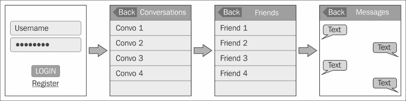
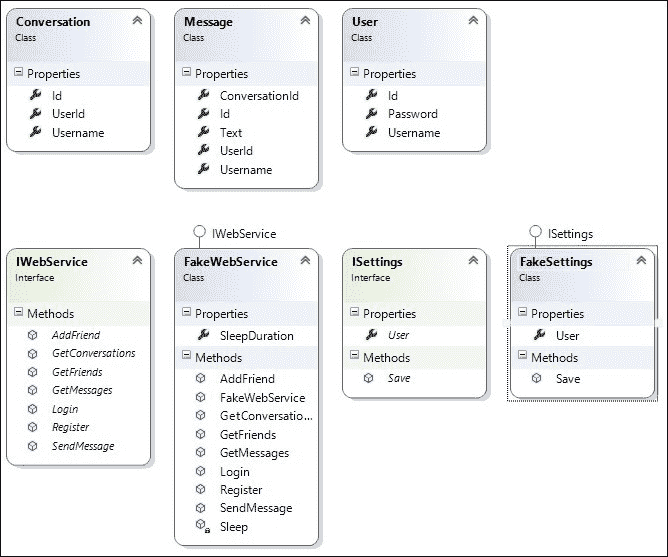
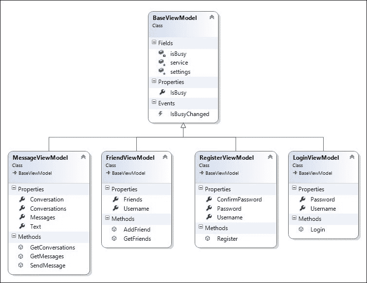
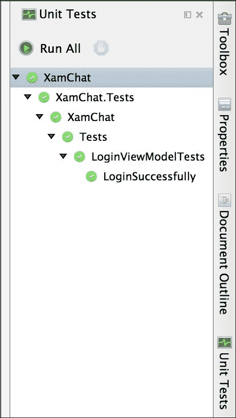
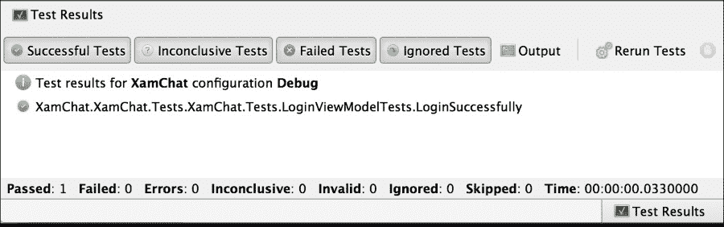
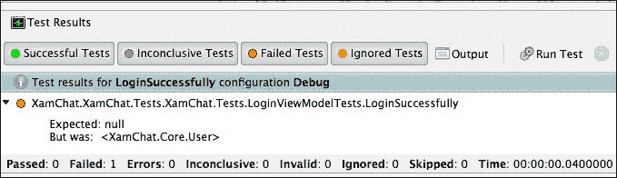

# 第四章。XamChat – 一个跨平台应用

在我看来，真正学习编程技能的最佳方式是承担一个需要你练习该技能的简单项目。这为新开发者提供了一个项目，他们可以在其中专注于他们试图学习的概念，而无需处理修复错误或遵循客户要求的开销。为了提高我们对 Xamarin 和跨平台开发的理解，让我们为 iOS 和 Android 开发一个名为**XamChat**的简单应用程序。

在本章中，我们将涵盖以下主题：

+   我们的示例应用程序概念

+   我们应用程序的模型层

+   模拟一个网络服务

+   我们应用程序的视图模型层

+   编写单元测试

# 开始我们的示例应用程序概念

概念很简单：一个使用标准互联网连接作为发送文本消息替代方案的聊天应用程序。在苹果应用商店中有几个类似的应用程序，这可能是由于短信的成本以及 iPod Touch 或 iPad 等设备的支持。这将是一个整洁的现实世界示例，对用户来说可能很有用，并将涵盖为 iOS 和 Android 开发应用程序的特定主题。

在我们开始开发之前，让我们列出我们将需要的屏幕集：

+   **登录/注册**：此屏幕将包括用户的标准登录和注册过程

+   **对话列表**：此屏幕将包括一个按钮来开始新的对话

+   **朋友列表**：此屏幕将在我们开始新对话时提供添加新朋友的方式

+   **对话**：此屏幕将显示您和另一个用户之间的消息列表，以及回复的选项

因此，一个快速的应用程序线框布局将帮助你更好地理解应用程序的布局。以下图显示了您应用程序中应包含的屏幕集：



# 开发我们的模型层

由于我们对应用程序有了很好的了解，下一步是开发这个应用程序的业务对象，即模型层。让我们先定义几个将包含整个应用程序所需数据的类。为了组织上的原因，建议将这些类添加到项目中的`Models`文件夹中。这是 MVVM 设计模式的底层。

让我们从代表用户的类开始。该类可以创建如下：

```cs
public class User
{
  public string Id { get; set; }
  public string Username { get; set; }
  public string Password { get; set; }
}
```

到目前为止，事情相当直接；让我们继续创建代表对话和消息的类的如下：

```cs
public class Conversation
{
  public string Id { get; set; }
  public string UserId { get; set; } 
  public string Username { get; set; }
}
public class Message
{
  public string Id { get; set; }
  public string ConversationId { get; set; }
  public string UserId { get; set; } 
  public string Username { get; set; }
  public string Text { get; set; }
}
```

注意，我们正在使用字符串作为各种对象的标识符。这将在后续章节中简化我们与 Azure Mobile Services 的集成。`UserId`是应用程序将设置的值，用于更改与对象关联的用户。

现在，让我们继续通过以下步骤来设置我们的解决方案：

1.  首先创建一个新的解决方案和一个新的**可移植库**项目。

1.  将项目命名为 `XamChat.Core`，解决方案命名为 `XamChat`。

1.  你也可以选择为这个项目使用一个 **共享项目**，但我选择使用可移植类库，因为它鼓励更好的编程实践。

# 编写模拟网络服务

在开发移动应用程序时，很多时候你需要在真正的后端网络服务可用之前就开始开发你的应用程序。为了防止开发完全停滞，一个很好的方法就是开发一个服务的模拟版本。这在你需要编写单元测试，或者稍后需要向你的应用程序添加真实后端时也非常有用。

首先，让我们分解我们的应用程序将对网络服务器执行的操作。操作如下：

1.  使用用户名和密码登录。

1.  注册一个新账户。

1.  获取用户的联系人列表。

1.  通过用户名添加朋友。

1.  获取用户现有对话的列表。

1.  获取对话中的消息列表。

1.  发送一条消息。

现在，让我们定义一个接口，为每个场景提供一个方法。方法如下：

```cs
public interface IWebService
{
  Task<User> Login(string username, string password);
  Task<User> Register(User user);
  Task<User[]> GetFriends(string userId);
  Task<User> AddFriend(string userId, string username);
  Task<Conversation[]> GetConversations(string userId);
  Task<Message[]> GetMessages(string conversationId);
  Task<Message> SendMessage(Message message);
}
```

如你所见，我们通过利用 .NET 基类库中的 **任务并行库**（**TPL**）简化了与网络服务的任何异步通信。

由于与网络服务的通信可能是一个漫长的过程，因此始终使用 `Task<T>` 类进行这些操作是一个好主意。否则，你可能会无意中在用户界面线程上运行一个漫长的任务，这将阻止在操作期间用户输入。`Task` 对于网络请求绝对是必需的，因为用户可能在 iOS 和 Android 上使用蜂窝互联网连接，它将使我们能够将来使用 `async` 和 `await` 关键字。

现在，让我们实现一个实现此接口的模拟服务。将 `FakeWebService` 类等放在项目的 `Fakes` 文件夹中。让我们从类声明和接口的第一个方法开始：

```cs
public class FakeWebService
{
  public int SleepDuration { get; set; }

  public FakeWebService()
  {
    SleepDuration = 1;
  }
  private Task Sleep()
  {
    return Task.Delay(SleepDuration);
  }
  public async Task<User> Login(string username, string password)
  {
    await Sleep();
    return new User { Id = "1", Username = username };
  }
}
```

我们最初使用了一个 `SleepDuration` 属性来存储一个以毫秒为单位的数字。这用于模拟与网络服务交互，这可能需要一些时间。它也有助于在不同情况下更改 `SleepDuration` 的值。例如，你可能希望在编写单元测试时将其设置为较小的数字，以便测试可以快速执行。

接下来，我们实现了一个简单的 `Sleep` 方法，该方法返回一个任务，引入了若干毫秒的延迟。这个方法将在整个模拟服务中用于在每个操作上引入延迟。

最后，`Login` 方法仅仅是在 `Sleep` 方法上使用了一个 `await` 调用，并返回了一个带有适当 `Username` 的 `new User` 对象。目前，任何用户名或密码组合都将有效；然而，你可能希望在这里编写一些代码来检查特定的凭据。

现在，让我们实现一些更多的方法，以继续我们的 `FakeWebService` 类，如下所示：

```cs
public async Task<User> Register(User user)
{
  await Sleep();

  return user;
}
public async Task<User[]> GetFriends(string userId)
{
  await Sleep();

  return new[]
  {
    new User { Id = "2", Username = "bobama" },
    new User { Id = "3", Username = "bobloblaw" },
    new User { Id = "4", Username = "gmichael" },
  };
}
public async Task<User> AddFriend(string userId, string username)
{
  await Sleep();
  return new User { Id = "5", Username = username };
}
```

对于这些方法中的每一个，我们都使用了与 `Login` 方法完全相同的模式。每个方法都会延迟并返回一些示例数据。请随意将数据与您自己的值混合。

现在，让我们按照以下方式实现接口所需的 `GetConversations` 方法：

```cs
public async Task<Conversation[]> GetConversations(string userId)
{
  await Sleep();

  return new[]
  {
    new Conversation { Id = "1", UserId = "2" },
    new Conversation { Id = "2", UserId = "3" },
    new Conversation { Id = "3", UserId = "4" },
  };
}
```

基本上，我们只是创建了一个新的 `Conversation` 对象数组，具有任意 ID。我们还确保将 `UserId` 值与迄今为止在 `User` 对象上使用的 ID 匹配。

接下来，让我们实现 `GetMessages` 以获取消息列表，如下所示：

```cs
public async Task<Message[]> GetMessages(int conversationId)
{
  await Sleep();

  return new[]
  {
    new Message
    {
      Id = "1",
      ConversationId = conversationId,
      UserId = "2",
      Text = "Hey",
    },
    new Message
    {
      Id = "2",
      ConversationId = conversationId,
      UserId = "1",
      Text = "What's Up?",
    },
    new Message
    {
      Id = "3",
      ConversationId = conversationId,
      UserId = "2",
      Text = "Have you seen that new movie?",
    },
    new Message
    {
      Id = "4",
      ConversationId = conversationId,
      UserId = "1",
      Text = "It's great!",
    },
  };
}
```

再次，我们在这里添加了一些任意数据，并主要确保 `UserId` 和 `ConversationId` 与我们迄今为止现有的数据匹配。

最后，我们将编写一个发送消息的方法，如下所示：

```cs
public async Task<Message> SendMessage(Message message)
{
  await Sleep();

  return message;
}
```

这些方法中的大多数都非常直接。请注意，服务不必完美工作；它只需在延迟后成功完成每个操作即可。每个方法还应该返回某种测试数据，以便在 UI 中显示。这将使我们能够在填充 Web 服务的同时实现我们的 iOS 和 Android 应用程序。

接下来，我们需要实现一个用于持久化应用程序设置的简单接口。让我们定义一个名为 `ISettings` 的接口，如下所示：

```cs
public interface ISettings
{
  User User { get; set; }
  void Save();
}
```

我们将 `ISettings` 设置为同步的，但如果你计划在云中存储设置，你可能希望将 `Save` 方法设置为异步并返回 `Task`。对于我们的应用程序，我们并不真正需要这样做，因为我们只会将设置保存在本地。

之后，我们将使用 Android 和 iOS API 在每个平台上实现这个接口。现在，让我们只实现一个将用于稍后编写单元测试的假版本。我们将使用以下代码行实现接口：

```cs
public class FakeSettings : ISettings
{
  public User User { get; set; }
  public void Save() { }
}
```

注意，假版本实际上不需要做任何事情；我们只需要提供一个实现接口并不会抛出任何意外错误的类。

这就完成了应用程序的模型层。以下是到目前为止我们已实现的最终类图：



# 编写 ViewModel 层

```cs
ViewModels folder within your project:
```

```cs
public class BaseViewModel
{
  protected readonly IWebService service = ServiceContainer.Resolve<IWebService>();
  protected readonly ISettings settings = ServiceContainer.Resolve<ISettings>();

  public event EventHandler IsBusyChanged = delegate { };

  private bool isBusy = false;
  public bool IsBusy
  {
    get { return isBusy; }
    set
    {
      isBusy = value;
      IsBusyChanged(this, EventArgs.Empty);
    }
  }
}
```

`BaseViewModel` 类是一个放置任何计划在整个应用程序中重用的公共功能的好地方。对于这个应用程序，我们只需要实现一些功能来指示 ViewModel 层是否忙碌。我们提供了一个属性和一个事件，UI 将能够订阅并在屏幕上显示等待指示器。我们还添加了一些需要的服务字段。还可以添加的一个常见功能是对用户输入进行验证；然而，对于这个应用程序，我们并不真正需要它。

## 实现我们的 LoginViewModel 类

现在我们已经为所有 ViewModel 层创建了一个基类，我们可以为我们的应用程序中的第一个屏幕实现一个 ViewModel 层，即 **登录** 屏幕。

现在，让我们按照以下方式实现 `LoginViewModel` 类：

```cs
public class LoginViewModel : BaseViewModel
{
  public string Username { get; set; }
  public string Password { get; set; }
  public async Task Login()
  {
    if (string.IsNullOrEmpty(Username))
      throw new Exception("Username is blank.");

    if (string.IsNullOrEmpty(Password))
      throw new Exception("Password is blank.");

    IsBusy = true;
    try
    {
      settings.User = await service.Login(Username, Password);
      settings.Save();
    }
    finally
    {
      IsBusy = false;
    }
  }
}
```

在这个类中，我们实现了以下内容：

+   我们从`BaseViewModel`派生类以获取访问`IsBusy`和包含常见服务的字段

+   我们添加了`Username`和`Password`属性，由视图层进行设置

+   我们添加了一个`User`属性，当登录过程完成时进行设置

+   我们实现了一个`Login`方法，可以从视图调用，并在`Username`和`Password`属性上进行验证

+   在调用`IWebService`上的`Login`方法时，我们设置了`IsBusy`

+   我们通过等待来自网络服务中`Login`操作的`User`属性结果来设置`User`属性

基本上，这是我们将在应用程序中其余的 ViewModel 层中遵循的模式。我们提供属性供视图层根据用户输入进行设置，并提供用于各种操作的方法。如果是一个可能需要一些时间的方法，例如网络请求，你应该始终返回`Task`并使用`async`和`await`关键字。

### 小贴士

注意，我们使用了`try`和`finally`块来将`IsBusy`重置为`false`。这将确保即使在抛出异常的情况下也能正确重置。我们计划在视图层处理错误，以便向用户显示一个包含消息的原生弹出窗口。

## 实现我们的`RegisterViewModel`类

由于我们已经完成了我们的`ViewModel`类以进行登录，我们现在需要创建一个用于用户注册的类。

让我们实现另一个 ViewModel 层来注册新用户：

```cs
public class RegisterViewModel : BaseViewModel
{
  public string Username { get; set; }
  public string Password { get; set; }
  public string ConfirmPassword { get; set; }
}
```

这些属性将处理来自用户的输入。接下来，我们需要添加一个`Register`方法，如下所示：

```cs
public async Task Register()
{
  if (string.IsNullOrEmpty(Username))
    throw new Exception("Username is blank.");
  if (string.IsNullOrEmpty(Password))
    throw new Exception("Password is blank.");
  if (Password != ConfirmPassword)
    throw new Exception("Passwords don't match.");
  IsBusy = true;
  try
  {
    settings.User = await service.Register(new User { Username = Username, Password = Password, });
    settings.Save();
  }
  finally
  {
    IsBusy = false;
  }
}
```

`RegisterViewModel`类与`LoginViewModel`类非常相似，但额外有一个用于 UI 设置的`ConfirmPassword`属性。遵循 ViewModel 层功能分割的良好规则是，当 UI 有新屏幕时，始终创建一个新的类。这有助于你保持代码整洁，并在一定程度上遵循类的**单一职责原则（SRP**）。**SRP**指出，一个类应该只有一个目的或职责。我们将尝试遵循这个概念，以保持我们的类小巧且有序，这在跨平台共享代码时可能比通常更重要。

## 实现我们的`FriendViewModel`类

接下来是处理用户朋友列表的 ViewModel 层。我们需要一个方法来加载用户的朋友列表并添加一个新朋友。

现在我们来实现`FriendViewModel`，如下所示：

```cs
public class FriendViewModel : BaseViewModel
{
  public User[] Friends { get; private set; }
  public string Username { get; set; }
}
```

现在我们需要一个方法来加载朋友。此方法如下所示：

```cs
public async Task GetFriends()
{
  if (settings.User == null)
    throw new Exception("Not logged in.");

  IsBusy = true;
  try
  {
    Friends = await service.GetFriends(settings.User.Id);
  }
  finally
  {
    IsBusy = false;
  }
}
```

最后，我们需要一个方法来添加一个新朋友并更新本地包含的朋友列表：

```cs
public async Task AddFriend()
{
  if (settings.User == null)
    throw new Exception("Not logged in.");

  if (string.IsNullOrEmpty(Username))
    throw new Exception("Username is blank.");

  IsBusy = true;
  try
  {
    var friend = await service.AddFriend(settings.User.Id, Username);

    //Update our local list of friends
    var friends = new List<User>();
    if (Friends != null)
      friends.AddRange(Friends);
    friends.Add(friend);

    Friends = friends.OrderBy(f => f.Username).ToArray();
  }
  finally
  {
    IsBusy = false;
  }
}
```

同样，这个类相当直接。唯一的新增内容是我们添加了一些逻辑来更新朋友列表并在我们的客户端应用程序中对其进行排序，而不是在服务器上。你也可以选择在有充分理由的情况下重新加载朋友列表的完整列表。

## 实现我们的`MessageViewModel`类

我们最终需要的 ViewModel 层将处理消息和对话。我们需要创建一种加载对话和消息以及发送新消息的方法。

让我们按照以下步骤开始实现我们的`MessageViewModel`类：

```cs
public class MessageViewModel : BaseViewModel
{
  public Conversation[] Conversations { get; private set; }
  public Conversation Conversation { get; set; }
  public Message[] Messages { get; private set; }
  public string Text { get; set; }
}
```

接下来，让我们实现一个方法来检索对话列表，如下所示：

```cs
public async Task GetConversations()
{
  if (settings.User == null)
    throw new Exception("Not logged in.");

  IsBusy = true;
  try
  {
    Conversations = await service.GetConversations(settings.User.Id);
  }
  finally
  {
    IsBusy = false;
  }
}
```

同样，我们还需要在对话中检索消息列表。我们需要将对话 ID 传递给服务，如下所示：

```cs
public async Task GetMessages()
{
  if (Conversation == null)
    throw new Exception("No conversation.");

  IsBusy = true;
  try
  {
    Messages = await service.GetMessages(Conversation.Id);
  }
  finally
  {
    IsBusy = false;
  }
}
```

最后，我们需要编写一些代码来发送消息并更新本地消息列表，如下所示：

```cs
public async Task SendMessage()
{
  if (settings.User == null)
    throw new Exception("Not logged in.");

  if (Conversation == null)
    throw new Exception("No conversation.");

  if (string.IsNullOrEmpty (Text))
    throw new Exception("Message is blank.");

  IsBusy = true;
  try
  {
    var message = await service.SendMessage(new Message 
    {
      UserId = settings.User.Id,ConversationId = Conversation.Id, 
      Text = Text
    });
    //Update our local list of messages
    var messages = new List<Message>();
    if (Messages != null)
      messages.AddRange(Messages);
    messages.Add(message);

    Messages = messages.ToArray();
  }
  finally
  {IsBusy = false;
  }
}
```

这就完成了我们应用程序的 ViewModel 层以及 iOS 和 Android 上使用的所有共享代码。对于`MessageViewModel`类，你也可以选择将`GetConversations`和`Conversations`属性放在它们自己的类中，因为它们可以被视为一个单独的责任，但这并不是真的必要。

这是我们的 ViewModel 层的最终类图：



# 编写单元测试

由于我们迄今为止编写的所有代码都不依赖于用户界面，我们可以轻松地为我们的类编写单元测试。这一步骤通常在`ViewModel`类的首次实现之后进行。**测试驱动开发**（**TDD**）的支持者会建议先编写测试，然后再实现功能，所以选择最适合你的方法。在任何情况下，在从视图层使用之前编写针对共享代码的测试都是一个好主意，这样你就可以在它们阻碍你的 UI 开发之前捕捉到错误。

Xamarin 项目利用一个名为**NUnit**的开源测试框架。它最初是从一个名为**JUnit**的 Java 测试框架派生出来的，并且是 C#应用程序单元测试的事实标准。Xamarin Studio 提供了几个用于编写 NUnit 测试的项目模板。

## 设置单元测试的新项目

让我们通过以下步骤设置一个新的单元测试项目：

1.  在解决方案中添加一个新的**NUnit 库**项目，该项目位于**C#**部分。

1.  将项目命名为`XamChat.Tests`以保持一致性。

1.  接下来，让我们在**项目选项**下将库设置为 Mono/.NET 4.5 项目，然后导航到**构建** | **常规** | **目标框架**。

1.  右键单击**项目引用**并选择**编辑引用**。

1.  在**项目**选项卡下，添加对**XamChat.Core**的引用。

1.  现在，打开`Test.cs`文件，你会注意到以下必需的属性，它们构成了使用 NUnit 的单元测试：

    +   `using NUnit.Framework`: 这个属性是用于与 NUnit 一起使用的主要语句

    +   `[测试用例]`: 这个装饰器用于表示一个类包含运行测试的方法列表

    +   `[测试]`: 这个装饰器用于表示一个测试方法

除了必需的 C#属性之外，还有一些其他属性对于编写测试很有用，如下所示：

+   `[TestFixtureSetUp]`: 这装饰了一个在测试固定类中所有测试之前运行的方法。

+   `[SetUp]`: 这装饰了一个在测试固定类中每个测试之前运行的方法。

+   `[TearDown]`: 这装饰了一个在测试固定类中每个测试之后运行的方法。

+   `[TestFixtureTearDown]`: 这装饰了一个在测试固定类中所有测试完成后运行的方法。

+   `[ExpectedException]`: 这装饰了一个旨在抛出异常的方法。对于应该失败的测试用例来说，它非常有用。

+   `[Category]`: 这装饰了一个测试方法，可以用来组织不同的测试；例如，你可能将它们分类为快速测试和慢速测试。

## 编写断言

在使用 NUnit 编写测试时，下一个要了解的概念是如何编写**断言**。断言是一个方法，如果某个值不正确，它将抛出一个异常。它将导致测试失败，并提供关于发生了什么的描述性解释。NUnit 有几个不同的断言 API 集；然而，我们将使用更易读的流式 API 版本。

流式 API 的基本语法是使用`Assert.That`方法。以下是一个例子：

```cs
Assert.That(myVariable, Is.EqualTo(0));
```

同样，你也可以断言相反的情况：

```cs
Assert.That(myVariable, Is.Not.EqualTo(0));
```

或者以下任何一个：

+   `Assert.That(myVariable, Is.GreaterThan(0));`

+   `Assert.That(myBooleanVariable, Is.True);`

+   `Assert.That(myObject, Is.Not.Null);`

随意探索 API。在 Xamarin Studio 中的代码补全功能，你应该能够发现`Is`类中的有用静态成员或方法，以便在测试中使用。

在我们开始为我们的应用程序编写特定测试之前，让我们编写一个静态类和方法来创建一个全局设置，以便在整个测试中使用。你可以将`Test.cs`重写如下：

```cs
public static class Test
{
  public static void SetUp()
  {
    ServiceContainer.Register<IWebService>(() =>new FakeWebService { SleepDuration = 0 });
    ServiceContainer.Register<ISettings>(() =>new FakeSettings());
  }
}
```

我们将在整个测试中使用此方法来设置模型层中的模拟服务。此外，这还替换了现有的服务，以便我们的测试针对这些类的新实例执行。这是单元测试中的一个良好实践，以确保没有从之前的测试中留下旧数据。另外，请注意我们设置了`SleepDuration`为`0`。这将使我们的测试运行得非常快。

我们将首先在我们的测试项目中创建一个`ViewModels`文件夹，并添加一个名为`LoginViewModelTests`的类，如下所示：

```cs
[TestFixture]
public class LoginViewModelTests
{
  LoginViewModel loginViewModel;
  ISettings settings;
  [SetUp]
  public void SetUp()
  {
    Test.SetUp();
    settings = ServiceContainer.Resolve<ISettings>();
    loginViewModel = new LoginViewModel();
  }
  [Test]
  public async Task LoginSuccessfully()
  {
    loginViewModel.Username = "testuser";
    loginViewModel.Password = "password";
    await loginViewModel.Login();
    Assert.That(settings.User, Is.Not.Null);
  }
}
```

注意我们使用`SetUp`方法。我们重新创建每个测试中使用的对象，以确保没有从之前的测试运行中留下旧数据。另一个需要注意的点是，在使用测试方法中的`async`/`await`时，你必须返回一个`Task`。否则，NUnit 将无法知道何时测试完成。

要运行测试，请使用位于 Xamarin Studio 右侧的 NUnit 菜单，默认情况下。点击带有齿轮图标的**运行测试**按钮来运行测试。你将得到一个类似于以下截图的成功结果：



你还可以查看**测试结果**面板，如果测试失败，它将显示扩展的详细信息，如下面的截图所示：



要查看测试失败时会发生什么，请修改你的测试以断言一个错误值，如下所示：

```cs
//Change Is.Not.Null to Is.Null
Assert.That(settings.User, Is.Null);
```

你将在**测试结果**面板中看到一个非常详细的错误，如下面的截图所示：



现在我们来实现`LoginViewModel`类的另一个测试；确保如果用户名和密码字段为空时，我们得到适当的输出。测试的实现如下：

```cs
[Test]
public async Task LoginWithNoUsernameOrPassword()
{
  //Throws an exception
  await loginViewModel.Login();
}
```

如果我们按照原样运行测试，将会抛出异常，测试将失败。由于我们预期会发生异常，我们可以装饰该方法，使得测试仅在发生异常时通过，如下所示：

```cs
[Test, 
  ExpectedException(typeof(Exception), 
  ExpectedMessage = "Username is blank.")]
```

### 小贴士

注意，在我们的视图模型中，如果字段为空，将抛出异常类型。你还可以在期望的异常类型不同的情况下更改期望的异常类型。

样本代码以及本书中包含更多测试。建议你对每个`ViewModel`类上的每个公共操作编写测试。此外，为任何验证或其他重要业务逻辑编写测试。我还建议你对模型层编写测试；然而，在我们的项目中这还不是必需的，因为我们只有模拟实现。

# 摘要

在本章中，我们探讨了构建一个名为 XamChat 的示例应用程序的概念。我们还实现了应用程序在模型层中的核心业务对象。由于我们还没有服务器来支持这个应用程序，我们实现了一个模拟的 Web 服务。这让你在不需要构建服务器应用程序的情况下继续前进有了灵活性。我们还实现了视图模型层。这一层将以简单的方式向视图层公开操作。最后，我们使用 NUnit 编写了覆盖我们迄今为止所编写代码的测试。在跨平台应用程序中对共享代码编写测试可能非常重要，因为它是多个应用程序的骨架。

完成这一章后，你应该已经完成了我们跨平台应用程序的共享库的全部内容。你应该对我们的应用程序架构及其独特的模型和视图模型层有非常牢固的掌握。你还应该很好地理解如何编写你尚未准备好实现的某些应用程序部分的模拟版本。在下一章中，我们将实现 XamChat 的 iOS 版本。
