# 第五章 XamChat for iOS

在本章中，我们将开发我们的跨平台 XamChat 应用程序的 iOS 部分。由于我们正在使用 MVVM 设计模式，我们将要做的大部分工作将在应用程序的视图层。我们将主要使用原生 iOS API，并了解我们如何利用便携式类库中的共享代码来应用它们。由于 Xamarin.iOS 允许我们直接调用 Apple API，我们的 iOS 应用程序将无法与使用 Objective-C 或 Swift 开发的程序区分开来。

要开始编写 XamChat 的 iOS 版本，请在**iOS**部分下创建一个新的**单视图应用程序**。将项目命名为`XamChat.iOS`或您选择的任何其他适当名称。项目模板将自动创建一个具有不熟悉名称的控制器；请继续删除它。我们将随着工作的进行创建自己的控制器。

在本章中，我们将涵盖以下内容：

+   iOS 应用程序的基本知识

+   使用`UINavigationController`

+   实现登录界面

+   转场和`UITableView`

+   添加好友列表

+   添加消息列表

+   消息的编写

# 理解 iOS 应用程序的基本知识

在我们开始开发我们的应用程序之前，让我们回顾一下应用程序的主要设置。Apple 使用名为`Info.plist`的文件来存储有关任何 iOS 应用程序的重要信息。这些设置用于当 iOS 应用程序通过 Apple 应用商店安装到设备上时。我们将通过填写此文件中的信息开始任何新的 iOS 应用程序的开发。

Xamarin Studio 提供了一个方便的菜单来修改`Info.plist`文件中的值，如下面的截图所示：

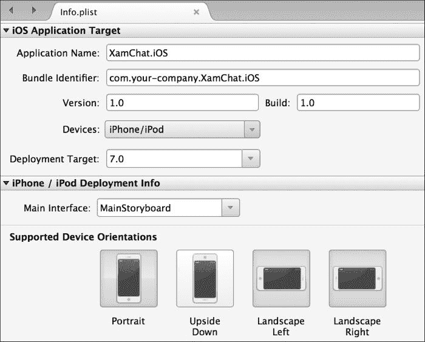

最重要的设置如下：

+   **应用程序名称**：这是 iOS 中应用程序图标下的标题。请注意，这与您在 iOS 应用商店中应用程序的官方名称不同。

+   **捆绑标识符**：这是您的应用程序的捆绑标识符或捆绑 ID。这是一个独特的名称，用于标识您的应用程序。惯例是使用以您的公司名称开始的反向域名命名风格，例如`com.packt.xamchat`。

+   **版本**：这是您的应用程序的版本号，例如`1.0.0`。

+   **设备**：在此字段中，您可以为您的应用程序选择**iPhone/iPod**、**iPad**或**通用**（所有设备）。

+   **部署目标**：这是您的应用程序运行的最小 iOS 版本。

+   **主界面**：这是您的应用程序的主要故事板文件，它声明了应用程序的大部分 UI。iOS 将自动加载此文件，并将根控制器作为初始屏幕打开。

+   **支持的设备方向**：这是您的应用程序能够旋转到的不同位置。

还有其他设置，如应用程序图标、启动画面等。您还可以在**高级**或**源**选项卡之间切换，以配置 Xamarin 不提供用户友好菜单的附加设置。

为我们的应用程序配置以下设置：

+   **应用程序名称**：`XamChat`

+   **捆绑标识符**：`com.yourcompanyname.xamchat`；请确保您将未来的应用程序命名为以`com.yourcompanyname`开头

+   **版本**：可以是您喜欢的任何版本号，但请不要留空

+   **设备**：**iPhone/iPod**

+   **部署目标**：7.0（您也可以选择 8.0，但在这个应用程序中我们没有使用任何 iOS 8 特定的 API）

+   **支持的设备方向**：仅选择**纵向**

如果您在项目上右键单击并选择**选项**，您可以找到一些 Xamarin iOS 应用程序的附加设置。了解 Xamarin Studio 中 iOS 特定项目可用的选项是个好主意。

让我们讨论一些最重要的选项。

1.  按照以下截图导航到**iOS 构建** | **通用**选项卡：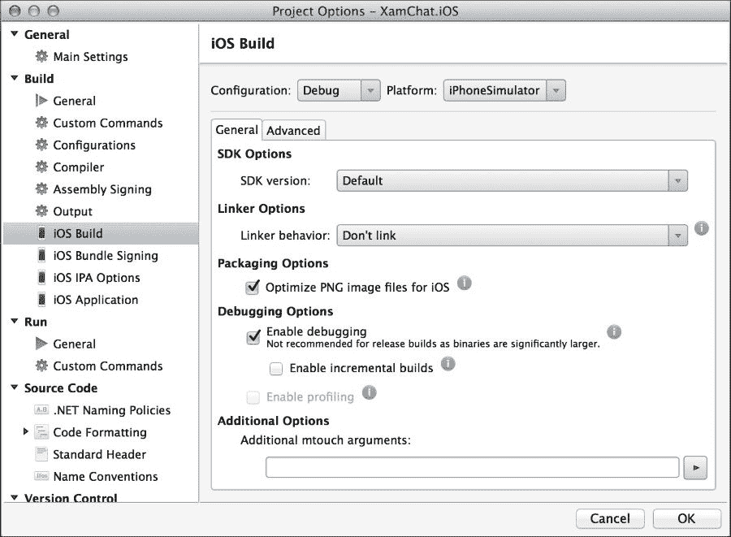

    在此选项卡下，您有以下选项：

    +   **SDK 版本**：这是编译应用程序的 iOS SDK 版本。通常最好使用**默认**。

    +   **链接器行为**：Xamarin 实现了一个名为**链接**的功能。链接器将删除在您的程序集中永远不会被调用的任何代码。这使您的应用程序保持小巧，并允许它们与您的应用程序一起发布核心 Mono 框架的精简版。除了调试构建外，最好使用**仅链接 SDK 程序集**选项。我们将在下一章中介绍链接。

    +   **优化 iOS PNG 文件**：Apple 使用自定义 PNG 格式来加快应用程序中 PNG 的加载速度。您可以选择关闭此选项以加快构建速度，或者如果您计划自己优化图像。

    +   **启用调试**：开启此选项允许 Xamarin 在应用程序中包含额外的信息，以便从 Xamarin Studio 进行调试。

    +   **额外的 mtouch 参数**：此字段用于向 Xamarin 编译器传递额外的命令行参数。您可以在[`iosapi.xamarin.com`](http://iosapi.xamarin.com)查看这些参数的完整列表。

1.  按照以下截图导航到**iOS 构建** | **高级**选项卡：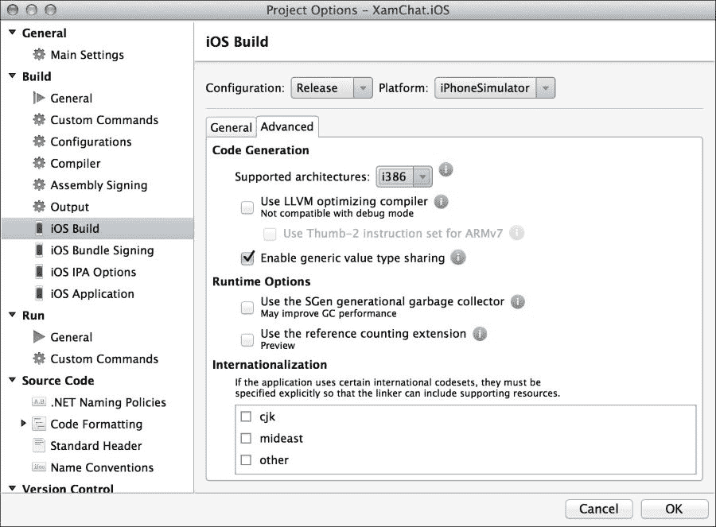

    在此选项卡下，您有以下选项：

    +   **支持的架构**：这里，选项包括**ARMv7**、**ARMv7s**和包含两者的**FAT**版本。这些是不同 iOS 设备处理器支持的指令集。如果您真的关心性能，您可能需要考虑选择支持两者的选项；然而，这将使您的应用程序更大。

    +   **使用 LLVM 优化编译器**：勾选此选项将编译出更小且运行速度更快的代码，但编译时间会更长。**LLVM**代表**低级虚拟机**。

    +   **启用通用值类型共享**：这是一个针对 Mono 的特定选项，可以从 C# 通用值类型中获得更好的性能。缺点是会使应用程序略微增大，但我建议您保留此选项。

    +   **使用 SGen 代际垃圾回收器**：这将在您的应用程序中使用新的 Mono 垃圾回收器。如果您确实需要良好的性能并且垃圾回收器（**GC**）或正在开发需要实时响应的应用程序，例如游戏，我建议您启用此功能。现在默认启用可能是安全的，因为 SGen 垃圾回收器非常稳定。

    +   **使用引用计数扩展（预览版）**：这是一个当前处于实验阶段的功能，但可以改善从 C# 访问的本地对象的内存使用。当使用此设置时，这些本地对象的引用由 GC 管理而不是对象上的后备字段。由于它仍在预览中，使用此选项时应谨慎。

1.  在 **iOS 包签名** 下，您有以下选项：

    +   **身份**：这是用于将应用程序部署到设备的创建者身份的证书。我们将在后面的章节中详细介绍。

    +   **配置文件**：这是一个将应用程序部署到设备的特定配置文件。它与身份协同工作，但还声明了分发方法和可以安装应用程序的设备。

    +   **自定义权限**：此文件包含应用于配置文件的其他设置，并包含对应用程序的其他特定声明，例如 iCloud 或推送通知。iOS 应用程序的模板项目包括一个默认的 `Entitlements.plist` 文件用于新项目。

1.  **iOS 应用程序**：这些设置与您在 `Info.plist` 文件中看到的是相同的。

对于此应用程序，您可以将所有这些选项保留在默认设置。当您自己制作真正的 iOS 应用程序时，您应该考虑根据应用程序的需求更改其中许多设置。

# 使用 UINavigationController

在 iOS 应用程序中，管理不同控制器之间导航的关键类是 `UINavigationController` 类。导航控制器是 iOS 上导航的最基本构建块，因此它是大多数 iOS 应用程序的最佳起点。它是一个包含多个子控制器在堆栈中的父控制器。用户可以通过将新控制器放在堆栈顶部或使用内置的返回按钮从堆栈中弹出控制器来前进，从而导航到上一个屏幕。

## 导航控制器中的方法

以下是在导航控制器中的方法：

+   `SetViewControllers`：这设置一个子控制器数组。它有一个可选的值来动画过渡。

+   `ViewControllers`：这是一个获取或设置子控制器数组的属性，没有动画选项。

+   `PushViewController`：这将在堆栈顶部放置一个新的子控制器，并可以选择显示动画。

+   `PopViewControllerAnimated`：这将带有动画选项从堆栈顶部的子控制器中弹出。

+   `PopToViewController`：这将弹出指定的子控制器，移除其上方的所有控制器。它提供了一个动画转换的选项。

+   `PopToRootViewController`：这将移除除了最底层的控制器之外的所有子控制器。它包括一个显示动画的选项。

+   `TopViewController`：这是一个属性，它返回当前位于堆栈顶部的子控制器。

### 小贴士

需要注意的是，如果在使用动画选项的同时尝试修改动画过程中的堆栈，将会导致崩溃。为了解决这个问题，你可以使用`SetViewControllers`方法并设置整个子控制器列表，或者避免在组合转换中使用动画。

## 设置导航控制器

执行以下步骤以设置导航控制器：

1.  双击`MainStoryboard.storyboard`文件以在 Xamarin Studio 中打开它。

1.  删除由项目模板创建的控制器。

1.  从右侧的**工具箱**面板中拖动一个**导航控制器**元素到故事板中。

1.  注意，除了**视图控制器**元素外，还创建了一个**导航控制器**元素。

1.  你将看到一个**segue**连接了两个控制器。我们将在本章的后面更详细地介绍这个概念。

1.  保存故事板文件。

如果你现在运行应用程序，你将拥有一个基本的 iOS 应用程序，顶部有一个状态栏，一个包含默认标题的导航控制器，以及一个完全白色的子控制器，如下面的截图所示：

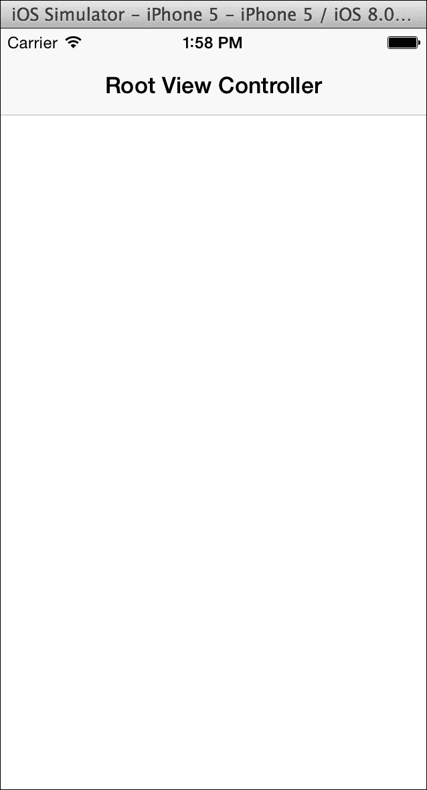

# 实现登录屏幕

由于我们应用程序的第一个屏幕将是一个登录屏幕，让我们首先在故事板文件中设置适当的视图。我们将使用 Xamarin Studio 编写 C#代码来实现登录屏幕，并使用 iOS 设计器在我们的故事板文件中创建 iOS 布局。

## 创建 LoginController 类

返回 Xamarin Studio 中的项目并执行以下步骤：

1.  双击`MainStoryboard.storyboard`文件以在 iOS 设计器中打开它。

1.  选择你的视图控制器，点击**属性**面板并选择**小部件**选项卡。

1.  在**类**字段中输入`LoginController`。

1.  注意，`LoginController`类已经为你生成了。如果你愿意，你可以创建一个`Controllers`文件夹并将文件移入其中。

以下截图显示了在做出更改后，Xamarin Studio 中控制器的设置将看起来是什么样子：

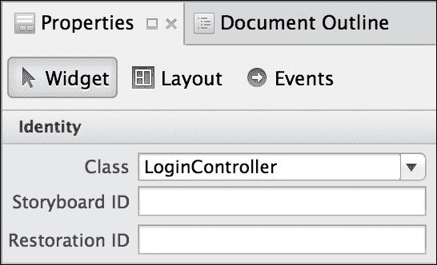

## 修改控制器的布局

现在让我们通过以下步骤修改控制器的布局：

1.  双击`MainStoryboard.storyboard`文件第二次，以返回到 iOS 设计器。

1.  点击导航栏并编辑**标题**字段，使其显示为`登录`。

1.  将两个文本字段拖放到控制器中。适当地定位和调整它们的大小，以适应用户名和密码输入。你可能还想删除默认文本，使字段为空。

1.  对于第二个字段，勾选**安全文本输入**复选框。这将使控件隐藏密码字段的字符。

1.  你可能还想分别为`用户名`和`密码`填写**占位符**字段。

1.  将一个按钮拖放到控制器中。设置按钮的**标题**为`登录`。

1.  将活动指示器拖放到控制器中。勾选**动画**和**隐藏**复选框。

1.  接下来，为每个控件创建一个出口，通过填写**名称**字段。将出口命名为`username`、`password`、`login`和`indicator`。

1.  保存故事板文件，并查看`LoginController.designer.cs`。

你会发现 Xamarin Studio 为每个出口生成了属性：

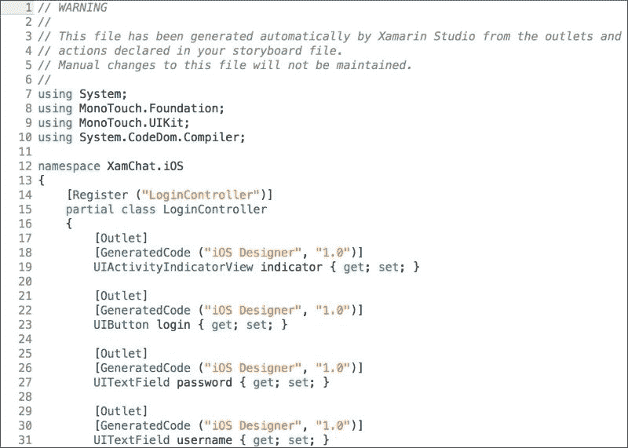

继续编译应用程序以确保一切正常。在此阶段，我们还需要将`XamChat.Core`项目添加为引用，该项目是在上一章中创建的。

## 注册和订阅视图模型和服务

接下来，让我们设置我们的 iOS 应用程序以注册其所有视图模型和其他将在整个应用程序中使用的服务。我们将使用在第四章中创建的`ServiceContainer`类，*XamChat – 一个跨平台应用*，来设置我们应用程序中的依赖项。打开`AppDelegate.cs`并添加以下方法：

```cs
public override bool FinishedLaunching(UIApplication application,NSDictionary launchOptions)
{
  //View Models
  ServiceContainer.Register<LoginViewModel>(() =>new LoginViewModel());
  ServiceContainer.Register<FriendViewModel>(() =>new FriendViewModel());
  ServiceContainer.Register<RegisterViewModel>(() =>new RegisterViewModel());
  ServiceContainer.Register<MessageViewModel>(() =>new MessageViewModel());
  //Models
  ServiceContainer.Register<ISettings>(() =>new FakeSettings());
  ServiceContainer.Register<IWebService>(() =>new FakeWebService());

  return true;
}
```

在以后，我们将用真实的服务替换假的服务。现在，让我们将登录功能添加到`LoginController.cs`中。首先，将`LoginViewModel`添加到类顶部的成员变量中，如下所示：

```cs
readonly LoginViewModel loginViewModel = ServiceContainer.Resolve<LoginViewModel>();
```

这将把`LoginViewModel`的共享实例拖入控制器中的局部变量。这是我们将在整本书中使用的模式，以便将共享视图模型从一个类传递到另一个类。

接下来，重写`ViewDidLoad`以将视图模型的功能与在出口中设置的视图连接起来，如下所示：

```cs
public override void ViewDidLoad()
{
  base.ViewDidLoad();
  login.TouchUpInside += async(sender, e) =>
  {
    loginViewModel.Username = username.Text;
    loginViewModel.Password = password.Text;
    try
    {
      await loginViewModel.Login();
      //TODO: navigate to a new screen
    }
    catch (Exception exc)
    {
      new UIAlertView("Oops!", exc.Message, null, "Ok").Show();
    }
  };
}
```

我们将在本章的后面添加代码以导航到新屏幕。

接下来，让我们将`IsBusyChanged`事件连接起来，以便执行以下操作：

```cs
public override void ViewWillAppear(bool animated)
{
  base.ViewWillAppear(animated);
  loginViewModel.IsBusyChanged += OnIsBusyChanged;
}
public override void ViewWillDisappear(bool animated)
{
  base.ViewWillDisappear(animated);
  loginViewModel.IsBusyChanged -= OnIsBusyChanged;
}
void OnIsBusyChanged(object sender, EventArgs e)
{
  username.Enabled =
    password.Enabled =
    login.Enabled = 
    indicator.Hidden = !loginViewModel.IsBusy;
}
```

现在你可能想知道，为什么我们以这种方式订阅事件。问题是`LoginViewModel`类将贯穿你的应用程序生命周期，而`LoginController`类则不会。如果我们订阅了`ViewDidLoad`中的事件，但没有在之后取消订阅，那么我们的应用程序将出现内存泄漏。我们还避免了使用 lambda 表达式来处理事件，因为这会使取消订阅事件变得不可能。请注意，我们在按钮的`TouchUpInside`事件上没有遇到相同的问题，因为它将像控制器一样在内存中持续存在。这是 C#中事件的一个常见问题，这就是为什么在 iOS 上使用前面提到的模式是一个好主意。

如果你现在运行应用程序，你应该能够输入用户名和密码，如下面的截图所示。当你按下**登录**时，你应该看到指示器出现，所有控件被禁用。你的应用程序将正确调用共享代码，并且在我们添加真正的 web 服务时应该能够正确运行。

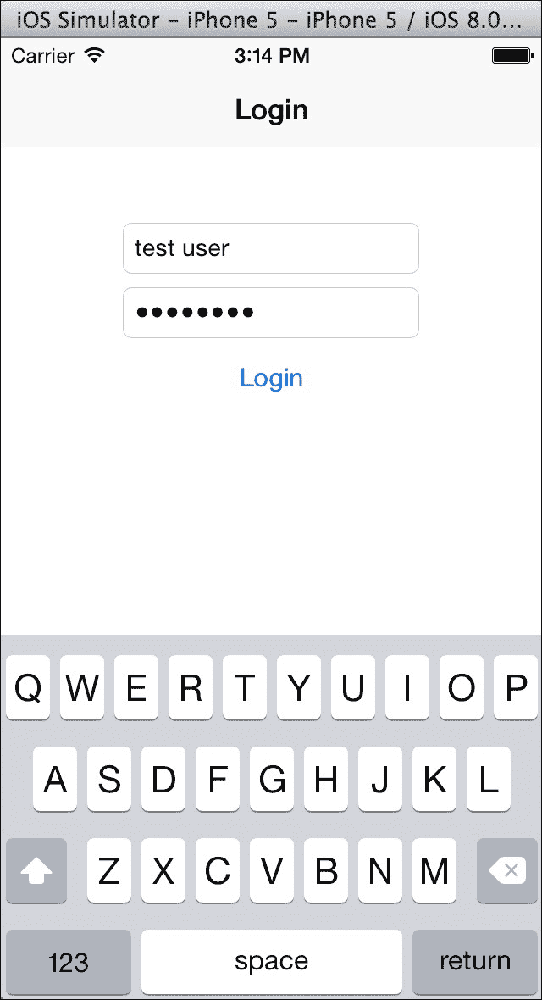

# 使用 segue 和 UITableView

segue 是从一个控制器到另一个控制器的过渡。同样，一个 storyboard 文件是由 segue 连接在一起的控制器和它们的视图的集合。这反过来又允许你同时看到每个控制器的布局和应用程序的一般流程。

segue 只有几种类型，如下所示：

+   **推送**：这用于导航控制器内部。它将新的控制器推送到导航控制器堆栈的顶部。推送使用导航控制器的标准动画技术，通常是使用最频繁的 segue。

+   **关系**：这用于设置另一个控制器的子控制器。例如，导航控制器的根控制器、容器视图或 iPad 应用程序中的分割视图控制器。

+   **模式**：使用此模式时，一个模态控制器将出现在父控制器之上。它将覆盖整个屏幕，直到被取消。有几种不同的过渡动画可供选择。

+   **自定义**：这是一个包含自定义类选项的自定义 segue，该类是`UIStoryboardSegue`的子类。这让你可以精细控制动画以及下一个控制器的呈现方式。

在执行过程中，segue 还使用以下模式：

+   目标控制器及其视图被创建。

+   创建了一个 segue 对象，它是`UIStoryboardSegue`的子类。这通常只对自定义 segue 很重要。

+   在源控制器上调用`PrepareForSegue`方法。这是一个在 segue 开始前运行任何自定义代码的好地方。

+   调用 segue 的`Perform`方法并开始过渡动画。这是自定义 segue 代码的主要部分。

在 Xamarin.iOS 设计器中，你可以选择从按钮或表格视图行自动触发 segues，或者只是给 segues 一个标识符。在第二种情况下，你可以通过在源控制器上调用其标识符的`PerformSegue`方法来自己启动 segues。

现在，让我们通过执行以下步骤设置一个新的 segues，通过设置`MainStoryboard.storyboard`文件的一些方面来设置：

1.  双击`MainStoryboard.storyboard`文件以在 iOS 设计器中打开它。

1.  在故事板中添加一个新的**表格视图控制器**。

1.  选择你的视图控制器，并导航到**属性**面板和**小部件**选项卡。

1.  在**类**字段中输入`ConversationsController`。

1.  在**视图控制器**部分下方滚动，并输入`Conversations`的**标题**。

1.  通过点击并按住*Ctrl*，从`LoginController`拖动蓝色线到另一个控制器来创建从`LoginController`到`ConversationsController`的 segues。

1.  从出现的弹出菜单中选择**推送**segues。

1.  通过点击并选择 segues，给它一个**标识符**为`OnLogin`。

1.  保存故事板文件。

你的故事板将看起来类似于以下截图所示：

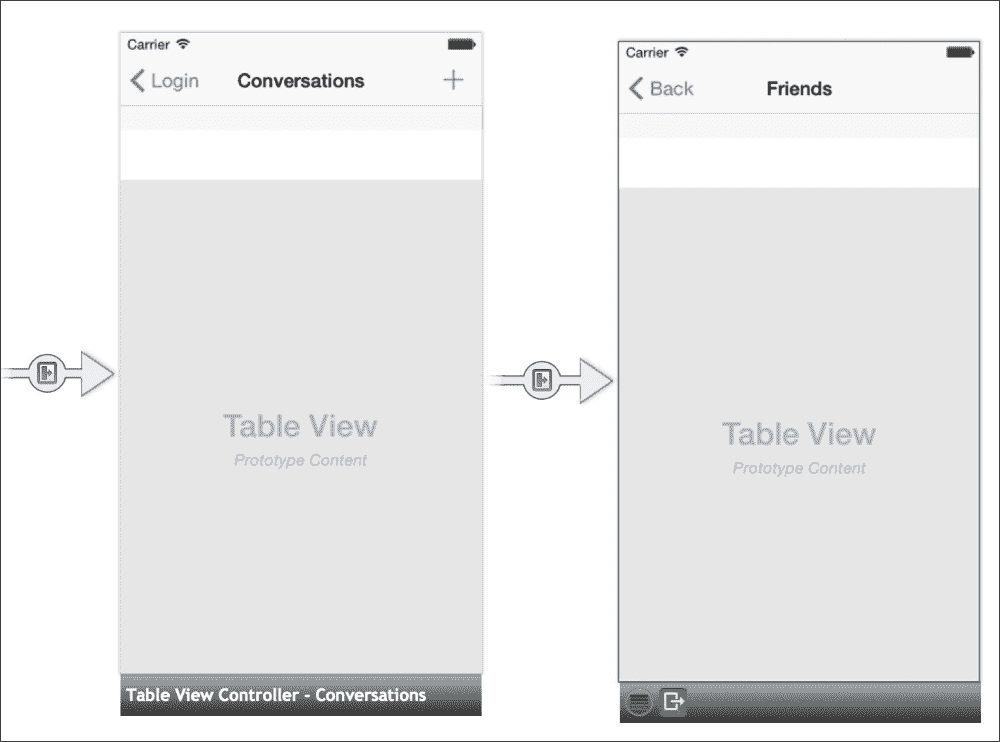

打开`LoginController.cs`，并修改本章前面标记为`TODO`的代码行如下：

```cs
PerformSegue("OnLogin", this);
```

现在，如果你构建并运行应用程序，你将在成功登录后导航到新的控制器。将执行 segues，你将看到导航控制器提供的内置动画。

接下来，让我们设置第二个控制器上的表格视图。我们在 iOS 上使用一个强大的类`UITableView`。它在许多情况下都得到使用，并且与其他平台上的列表视图概念非常相似。`UITableView`类由另一个名为`UITableViewSource`的类控制。它有你需要覆盖的方法来设置应该有多少行以及这些行应该如何显示在屏幕上。

### 提示

注意，`UITableViewSource`是`UITableViewDelegate`和`UITableViewDataSource`的组合。我更喜欢使用`UITableViewSource`以保持简单，因为很多时候需要使用这两个其他类中的任何一个。

在我们开始编码之前，让我们回顾一下在`UITableViewSource`中最常用的方法，如下所示：

+   `RowsInSection`：此方法允许你定义一个部分中的行数。所有的表格视图都有部分和行数。默认情况下，只有一个部分；然而，返回部分中的行数是一个要求。

+   `NumberOfSections`：这是表格视图中部分的数目。

+   `GetCell`：此方法必须为每一行返回一个单元格，并且应该实现。开发者负责设置单元格的外观；你还可以实现代码，在滚动时回收单元格。回收单元格将在滚动时提供更好的性能。

+   `TitleForHeader`：如果重写此方法，返回标题字符串的最简单方式。表格视图中的每个部分都有一个标准的头部视图，默认情况下。

+   `RowSelected`：当用户选择一行时，将调用此方法。

你可以重写额外的方法，但这些都足以应对大多数情况。如果你需要开发具有自定义样式的表格视图，你也可以设置自定义头部和尾部。

现在，让我们打开 `ConversationsController.cs` 文件，并在 `ConversationsController` 中创建一个嵌套类，如下所示：

```cs
class TableSource : UITableViewSource
{
  const string CellName = "ConversationCell";
  readonly MessageViewModel messageViewModel = ServiceContainer.Resolve<MessageViewModel>();

  public override int RowsInSection(UITableView tableView, int section)
  {
    return messageViewModel.Conversations == null ?0 : messageViewModel.Conversations.Length;
  }
  public override UITableViewCell GetCell(UITableView tableView, NSIndexPath indexPath)
  {
    var conversation = messageViewModel.Conversations[indexPath.Row];
    var cell = tableView.DequeueReusableCell(CellName);
    if (cell == null)
    {
      cell = new UITableViewCell(UITableViewCellStyle.Default, CellName);
      cell.Accessory = UITableViewCellAccessory.DisclosureIndicator;
    }
    cell.TextLabel.Text = conversation.Username;
    return cell;
  }
}
```

我们实现了设置表格视图所需的两个方法：`RowsInSection` 和 `GetCell`。我们返回了在视图模型中找到的对话数量，并为每一行设置了我们的单元格。我们还使用了 `UITableViewCellAccessory.DisclosureIndicator` 来为用户提供一个指示器，让他们知道可以点击该行。

注意我们实现的重用单元格。使用带有单元格标识符的 `DequeueReusableCell` 调用将第一次返回一个 `null` 单元格。如果为 `null`，你应该使用相同的单元格标识符创建一个新的单元格。随后的 `DequeueReusableCell` 调用将返回一个现有的单元格，使你能够重用它。你还可以在故事板文件中定义 `TableView` 单元格，这对于自定义单元格非常有用。我们这里的单元格非常简单，因此从代码中定义它更容易。在移动平台上重用单元格对于节省内存和为用户提供非常流畅的滚动表格非常重要。

接下来，我们需要在 `TableView` 上设置 `TableView` 的源。按照以下步骤修改我们的 `ConversationsController` 类：

```cs
readonly MessageViewModel messageViewModel = ServiceContainer.Resolve<MessageViewModel>();

public override void ViewDidLoad()
{
  base.ViewDidLoad();
  TableView.Source = new TableSource();
}
public async override void ViewWillAppear(bool animated)
{
  base.ViewWillAppear(animated);
  try
  {
    await messageViewModel.GetConversations();
    TableView.ReloadData();
  }
  catch(Exception exc)
  {
    new UIAlertView("Oops!", exc.Message, null, "Ok").Show();
  }
}
```

因此，当视图出现时，我们将加载我们的对话列表。完成此任务后，我们将重新加载表格视图，以便它显示我们的对话列表。如果你运行应用程序，你将在登录后看到一些对话出现在表格视图中，如下面的截图所示。将来，当我们从真实的网络服务加载对话时，一切都将以相同的方式运行。

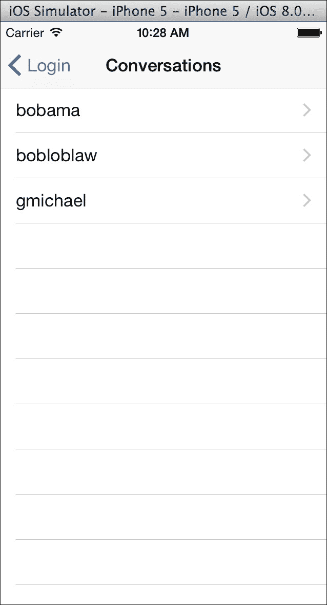

# 添加朋友列表屏幕

下一个相当重要的屏幕是我们朋友的列表。当创建新的对话时，应用将加载一个朋友列表以开始对话。我们将遵循一个非常相似的模式来加载我们的对话列表。

首先，我们将创建 `UIBarButtonItem`，通过执行以下步骤导航到一个名为 `FriendsController` 的新控制器：

1.  双击 `MainStoryboard.storyboard` 文件以在 iOS 设计器中打开它。

1.  在故事板中添加一个新的 **表格视图控制器**。

1.  选择你的视图控制器，点击 **属性** 面板，确保你已经选择了 **小部件** 选项卡。

1.  在 **类** 字段中输入 `FriendsController`。

1.  滚动到 **视图控制器** 部分，在 **标题** 字段中输入 `Friends`。

1.  从 **工具箱** 面板拖动一个 **导航项** 到 `ConversationsController`。

1.  创建一个新的**栏按钮项**元素，并将其放置在新导航栏的右上角。

1.  在按钮栏的**属性**面板中，将其**标识符**设置为**添加**。这将使用内置的加号按钮，这在 iOS 应用程序中普遍使用。

1.  通过按住*Ctrl*并从栏按钮拖动蓝色线条到下一个控制器，创建从**栏按钮项**到`FriendsController`的转换。

1.  从出现的弹出窗口中选择**推送**转换。

1.  保存故事板文件。

你对故事板的更改应类似于以下截图所示：

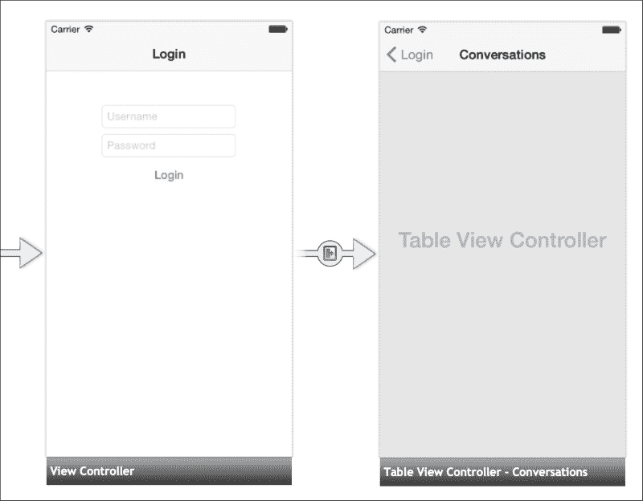

你将看到一个 Xamarin Studio 为你生成的新的`FriendsController`类。如果你编译并运行应用程序，你会看到我们创建的新栏按钮项。点击它将带你到新的控制器。

现在，让我们实现`UITableViewSource`来显示我们的朋友列表。从在`FriendsController`内部创建一个新的嵌套类开始，如下所示：

```cs
class TableSource : UITableViewSource
{
  const string CellName = "FriendCell";
  readonly FriendViewModel friendViewModel = ServiceContainer.Resolve<FriendViewModel>();

  public override int RowsInSection(UITableView tableView, int section)
  {
    return friendViewModel.Friends == null ?0 : friendViewModel.Friends.Length;
  }
  public override UITableViewCell GetCell(UITableView tableView, NSIndexPath indexPath)
  {
    var friend = friendViewModel.Friends[indexPath.Row];
    var cell = tableView.DequeueReusableCell(CellName);
    if (cell == null)
    {
      cell = new UITableViewCell(UITableViewCellStyle.Default, CellName);
      cell.AccessoryView = UIButton.FromType(UIButtonType.ContactAdd);
      cell.AccessoryView.UserInteractionEnabled = false;
    }
    cell.TextLabel.Text = friend.Username;
    return cell;
  }
}
```

就像之前一样，我们实现了表格单元格回收，并且只为每个朋友设置了标签上的文本。我们使用`cell.AccessoryView`来向用户指示每个单元格是可点击的，并开始一个新的对话。我们禁用了按钮的用户交互，以便在用户点击按钮时可以选择行。否则，我们就必须为按钮实现一个点击事件。

接下来，我们需要像修改对话一样修改`FriendsController`，如下所示：

```cs
readonly FriendViewModel friendViewModel = ServiceContainer.Resolve<FriendViewModel>();

public override void ViewDidLoad()
{
  base.ViewDidLoad();
  TableView.Source = new TableSource();
}
public async override void ViewWillAppear(bool animated)
{
  base.ViewWillAppear(animated);
  try
  {
    await friendViewModel.GetFriends();

    TableView.ReloadData();
  }
  catch(Exception exc)
  {
    new UIAlertView("Oops!", exc.Message, null, "Ok").Show();
  }
}
```

这将完全像对话列表一样工作。控制器将异步加载朋友列表并刷新表格视图。如果你编译并运行应用程序，你将能够导航到屏幕并查看我们在第四章中创建的示例朋友列表，如以下截图所示：

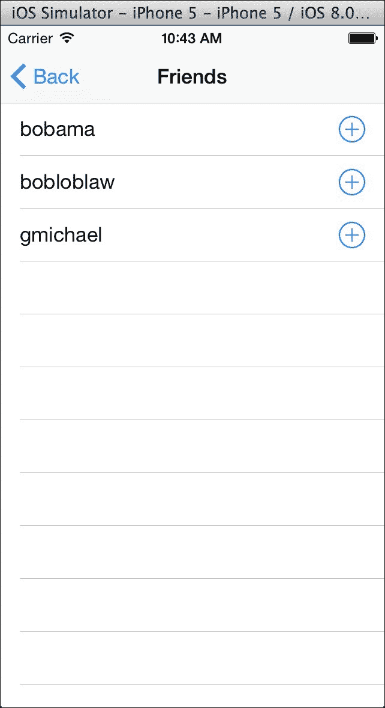

# 添加消息列表

现在，让我们实现查看对话或消息列表的屏幕。我们将尝试模仿 iOS 内置的短信应用程序。为此，我们还将介绍如何创建自定义表格视图单元格的基础知识。

首先，我们需要一个新的`MessagesController`类来执行以下步骤：

1.  双击`MainStoryboard.storyboard`文件以在 iOS 设计器中打开它。

1.  在故事板中添加一个新的**表格视图控制器**。

1.  选择你的视图控制器，点击**属性**面板，并确保你已选择**小部件**选项卡。

1.  在**类**字段中输入`MessagesController`。

1.  滚动到**视图控制器**部分，在**标题**字段中输入`Messages`。

1.  通过按住*Ctrl*并将蓝色线条从一个控制器拖动到另一个控制器，从`ConversationsController`创建到`MessagesController`的转换。

1.  从出现的弹出窗口中选择**推送**转换。在**属性**面板中输入**标识符**`OnConversation`。

1.  现在，在`MessagesController`中的表格视图中创建两个**表格视图单元格**。你可以通过默认创建的现有一个来重用。

1.  分别将`MyMessageCell`和`TheirMessageCell`输入到每个单元格的**类**字段中。

1.  分别在每个单元格上将**标识符**设置为`MyCell`和`TheirCell`。

1.  保存故事板文件。

Xamarin Studio 将生成三个文件：`MessagesController.cs`、`MyMessageCell.cs`和`TheirMessageCell.cs`。你可以通过创建一个`Views`文件夹并将单元格移动到其中来保持事物有序。同样，你也可以将控制器移动到`Controllers`文件夹。

现在让我们为这两个单元格实现一个基类：

```cs
public class BaseMessageCell : UITableViewCell
{
  public BaseMessageCell(IntPtr handle) : base(handle)
  {
  }
  public virtual void Update(Message message)
  {
  }
}
```

我们将在稍后重写`Update`方法并为每种单元格类型采取适当的行动。我们需要这个类来使与`UITableViewSource`中的两种单元格类型交互更容易。

现在打开`MessagesController.cs`并在嵌套类中实现`UITableViewSource`，如下所示：

```cs
class TableSource : UITableViewSource
{
  const string MyCellName = "MyCell";
  const string TheirCellName = "TheirCell";
  readonly MessageViewModel messageViewModel = ServiceContainer.Resolve<MessageViewModel>();
  readonly ISettings settings = ServiceContainer.Resolve<ISettings>();

  public override int RowsInSection(UITableView tableview, int section)
  {
    return messageViewModel.Messages == null ?0 : messageViewModel.Messages.Length;
  }
  public override UITableViewCell GetCell(UITableView tableView, NSIndexPath indexPath)
  {
    var message = messageViewModel.Messages [indexPath.Row];
    bool isMyMessage = message.UserId == settings.User.Id;
    var cell = tableView.DequeueReusableCell(isMyMessage ?MyCellName : TheirCellName) as BaseMessageCell;
    cell.Update(message);
    return cell;
  }
}
```

我们添加了一些逻辑来检查消息是否来自当前用户，以决定适当的表格视图标识符。由于我们为两个单元格都有一个基类，我们可以将其转换为`BaseMessageCell`并使用其`Update`方法。

现在让我们修改`MessagesController`文件以加载我们的消息列表并显示它们：

```cs
readonly MessageViewModel messageViewModel = ServiceContainer.Resolve<MessageViewModel>();

public override void ViewDidLoad()
{
  base.ViewDidLoad();

  TableView.Source = new TableSource();
}
public async override void ViewWillAppear(bool animated)
{
  base.ViewWillAppear(animated);
  Title = messageViewModel.Conversation.Username;
  try
  {
    await messageViewModel.GetMessages();
    TableView.ReloadData();
  }
  catch (Exception exc)
  {
    new UIAlertView("Oops!", exc.Message, null, "Ok").Show();
  }
}
```

这里唯一的新内容是我们将`Title`属性设置为对话的用户名。

为了完成我们的自定义单元格，我们需要在 Xcode 中执行以下步骤进行更多更改：

1.  双击`MainStoryboard.storyboard`文件以在 iOS 设计器中打开它。

1.  将一个新的**标签**拖放到自定义单元格上。

1.  使用一些创意来设计这两个标签。我选择将`MyMessageCell`中的文本设置为蓝色，将`TheirMessageCell`设置为绿色。我在`TheirMessageCell`中将标签的**对齐方式**设置为右对齐。

1.  对于每个单元格的**名称**，输入`message`。

1.  保存故事板文件并返回。

现在将以下`Update`方法添加到`MyMessageCell.cs`和`TheirMessageCell.cs`中：

```cs
public partial class MyMessageCell : BaseMessageCell
{
  public MyMessageCell (IntPtr handle) : base (handle)
  {
  }
  public override void Update(Message message)
  {
    this.message.Text = message.Text;
  }
}
```

对于每个单元格重复代码有点奇怪，但这是利用 Xamarin Studio 基于故事板文件生成的输出端口的最简单方法。你也可以选择为两个单元格使用相同的类（即使在 Xcode 中有不同的布局）；然而，这样你将失去在每个单元格中拥有不同代码的能力。

如果你现在运行应用程序，你将能够查看消息列表，如下面的截图所示：

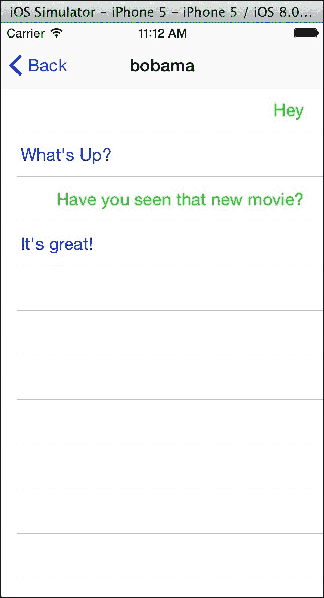

# 消息的编写

对于我们应用程序的最后一部分，我们需要实现一些苹果在他们的 API 中没有提供的自定义功能。我们需要添加一个带有按钮的文本字段，该按钮看起来像是附着在表格视图的底部。这大部分需要编写代码和连接大量事件。

让我们从向我们的`MessagesController`类添加一些新的成员变量开始，如下所示：

```cs
UIToolbar toolbar;
UITextField message;
UIBarButtonItem send;
NSObject willShowObserver, willHideObserver;
```

我们将文本字段和工具栏按钮放置在工具栏内，如下面的代码所示。`NSObject`字段将是一个 iOS 事件系统**通知**的示例。我们很快就会看到这些是如何使用的：

```cs
public override void ViewDidLoad()
{
  base.ViewDidLoad();

  //Text Field
  message = new UITextField(new RectangleF(0, 0, 240, 32))
  {
    BorderStyle = UITextBorderStyle.RoundedRect,ReturnKeyType = UIReturnKeyType.Send,ShouldReturn = _ =>
      {
        Send();
        return false;
      },
  };
  //Bar button item
  send = new UIBarButtonItem("Send", UIBarButtonItemStyle.Plain,(sender, e) => Send());

  //Toolbar
  toolbar = new UIToolbar(new RectangleF(0, TableView.Frame.Height - 44,TableView.Frame.Width, 44));
  toolbar.Items = new UIBarButtonItem[]
  {
    new UIBarButtonItem(message),
    send
  };
  NavigationController.View.AddSubview(toolbar);

  TableView.Source = new TableSource();
  TableView.TableFooterView = new UIView(new RectangleF(0, 0, TableView.Frame.Width, 44))
  {
    BackgroundColor = UIColor.Clear,
  };
}
```

这项工作的大部分涉及设置基本的 UI。在这种情况下，我们无法在 Xcode 中完成这项工作，因为它是一个自定义 UI。我们使用 C#创建一个文本字段、工具栏按钮和工具栏，并将它们添加到我们的导航控制器视图中。这将显示在表格视图顶部的工具栏，无论它滚动到何处。我们使用的另一个技巧是将一个页脚视图添加到表格视图中，其高度与工具栏相同。这将简化我们稍后设置的某些动画。

现在，我们需要按照以下方式修改`ViewWillAppear`：

```cs
public async override void ViewWillAppear(bool animated)
{
  base.ViewWillAppear(animated);

  Title = messageViewModel.Conversation.Username;

  //Keyboard notifications
  willShowObserver = UIKeyboard.Notifications.ObserveWillShow((sender, e) => OnKeyboardNotification(e));
  willHideObserver = UIKeyboard.Notifications.ObserveWillHide((sender, e) => OnKeyboardNotification(e));

  //IsBusy
  messageViewModel.IsBusyChanged += OnIsBusyChanged;
  try
  {
    await messageViewModel.GetMessages();
    TableView.ReloadData();
    message.BecomeFirstResponder();
  }
  catch (Exception exc)
  {
    new UIAlertView("Oops!", exc.Message, null, "Ok").Show();
  }
}
```

这些更改中的大多数都很直接，但请注意我们使用 iOS 通知的方式。Xamarin 提供了一个 C#友好的方式来订阅通知。在提供通知的各种`UIKit`类中有一个名为`Notifications`的静态嵌套类。否则，您将不得不使用`NSNotificationCenter`类，这并不那么容易使用。要取消订阅这些事件，我们只需销毁返回的`NSObject`。

因此，让我们为`ViewWillDisapper`添加一个覆盖，以清理这些事件，如下所示：

```cs
public override void ViewWillDisappear(bool animated)
{
  base.ViewWillDisappear(animated);
  //Unsubcribe notifications
  if (willShowObserver != null)
  {
    willShowObserver.Dispose();
    willShowObserver = null;
  }
  if (willHideObserver != null)
  {
    willHideObserver.Dispose();
    willHideObserver = null;
  }
  //IsBusy
  messageViewModel.IsBusyChanged -= OnIsBusyChanged;
}
```

接下来，让我们设置这些事件的函数，如下所示：

```cs
void OnIsBusyChanged (object sender, EventArgs e)
{
  message.Enabled = send.Enabled = !messageViewModel.IsBusy;
}
void ScrollToEnd()
{
  TableView.ContentOffset = new PointF(0, TableView.ContentSize.Height -TableView.Frame.Height);
}
void OnKeyboardNotification (UIKeyboardEventArgs e)
{
  //Check if the keyboard is becoming visible
  bool willShow = e.Notification.Name == UIKeyboard.WillShowNotification;

  //Start an animation, using values from the keyboard
  UIView.BeginAnimations("AnimateForKeyboard");
  UIView.SetAnimationDuration(e.AnimationDuration);
  UIView.SetAnimationCurve(e.AnimationCurve);

  //Calculate keyboard height, etc.
  if (willShow)
  {
    var keyboardFrame = e.FrameEnd;
    var frame = TableView.Frame;
    frame.Height -= keyboardFrame.Height;
    TableView.Frame = frame;
    frame = toolbar.Frame;
    frame.Y -= keyboardFrame.Height;
    toolbar.Frame = frame;
  }
  else
  {
    var keyboardFrame = e.FrameBegin;
    var frame = TableView.Frame;
    frame.Height += keyboardFrame.Height;
    TableView.Frame = frame;
    frame = toolbar.Frame;
    frame.Y += keyboardFrame.Height;
    toolbar.Frame = frame;
  }
  //Commit the animation
  UIView.CommitAnimations();
  ScrollToEnd();
}
```

这段代码相当多，但并不太难。`OnIsBusyChanged`用于在加载时禁用一些视图。`ScrollToEnd`是一个快速方法，用于将表格视图滚动到末尾。我们需要这样做是为了提高可用性。需要一些数学知识，因为苹果没有提供内置的方法来做这个。

另一方面，`OnKeyboardNotification`有很多事情要做。我们使用了 iOS 内置的动画系统来设置当键盘出现或隐藏时的动画。我们使用这个来移动视图以适应屏幕键盘。使用动画系统相当简单；调用`UIView.BeginAnimations`，修改一些视图，然后使用`UIView.CommitAnimations`完成。我们还使用了键盘的一些其他值来使我们的动画与键盘的动画同步。

最后但同样重要的是，我们需要实现一个函数来发送一条新消息，如下所示：

```cs
async void Send()
{
  //Just hide the keyboard if they didn't type anything
  if (string.IsNullOrEmpty(message.Text))
  {
    message.ResignFirstResponder();
    return;
  }
  //Set the text, send the message
  messageViewModel.Text = message.Text;
  await messageViewModel.SendMessage();

  //Clear the text field & view model
  message.Text = messageViewModel.Text = string.Empty;

  //Reload the table
  TableView.ReloadData();

  //Hide the keyboard
  message.ResignFirstResponder();

  //Scroll to end, to see the new message
  ScrollToEnd();
}
```

这段代码也很直接。在发送消息后，我们只需重新加载表格，隐藏键盘，然后确保我们滚动到底部以查看新消息，如下面的截图所示。使用`async`关键字使这变得容易。

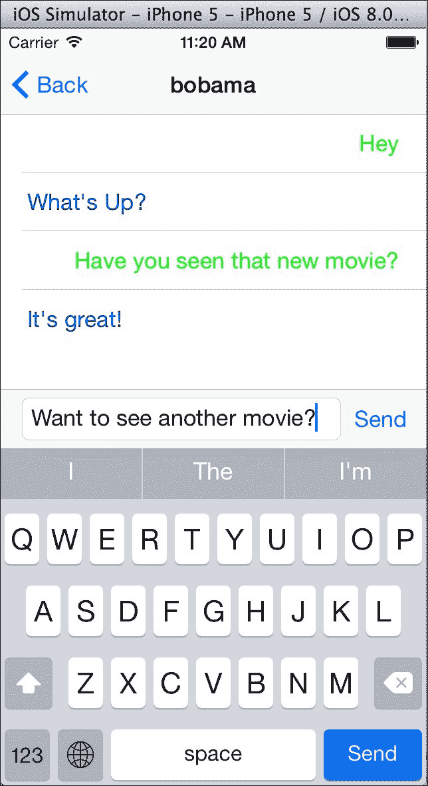

# 摘要

在本章中，我们介绍了 Apple 和 Xamarin 为开发 iOS 应用程序提供的基本设置。这包括 `Info.plist` 文件和 Xamarin Studio 中的项目选项。我们介绍了 `UINavigationController`，这是 iOS 应用程序导航的基本构建块，并实现了一个包含用户名和密码字段的登录屏幕。接下来，我们介绍了 iOS 的 segues 和 `UITableView` 类。我们使用 `UITableView` 实现了好友列表屏幕，以及消息列表屏幕，同样也是使用 `UITableView`。最后，我们添加了自定义 UI 功能；一个在消息列表底部浮动的自定义工具栏。

完成本章内容后，你将拥有一个部分功能的 iOS 版本 XamChat。你将对 iOS 平台和工具有更深入的了解，并且具备相当好的知识来应用于构建你自己的 iOS 应用程序。请自行实现本章未涵盖的剩余屏幕。如果你感到困惑，可以随意查阅本书附带的全样本应用程序。在下一章中，我们将使用原生 Android API 开发 XamChat 的 Android UI。我们的大部分步骤将与在 iOS 上所做的工作非常相似，我们将主要与 MVVM 设计模式中的 View 层进行工作。
