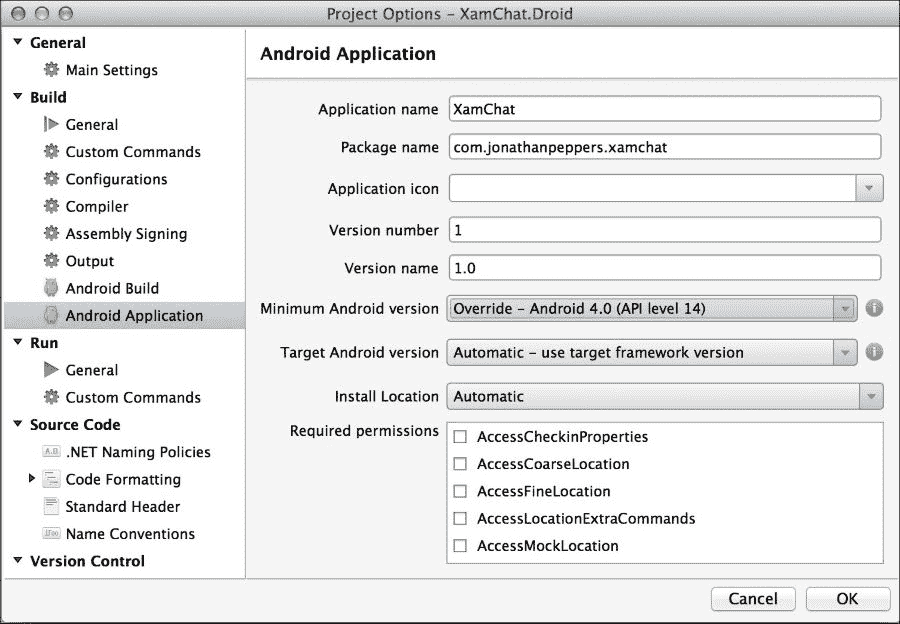
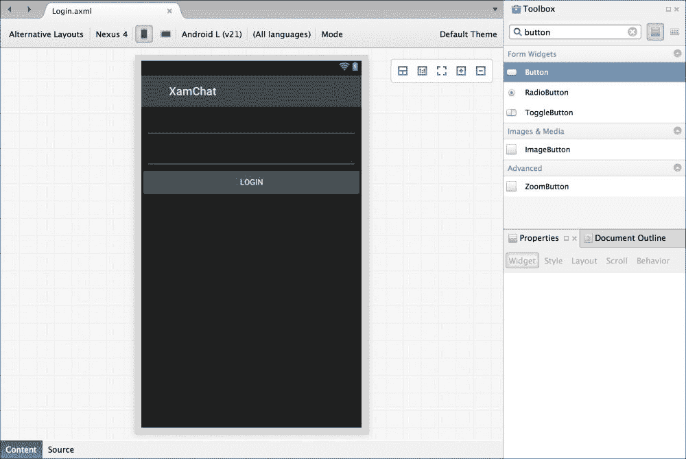
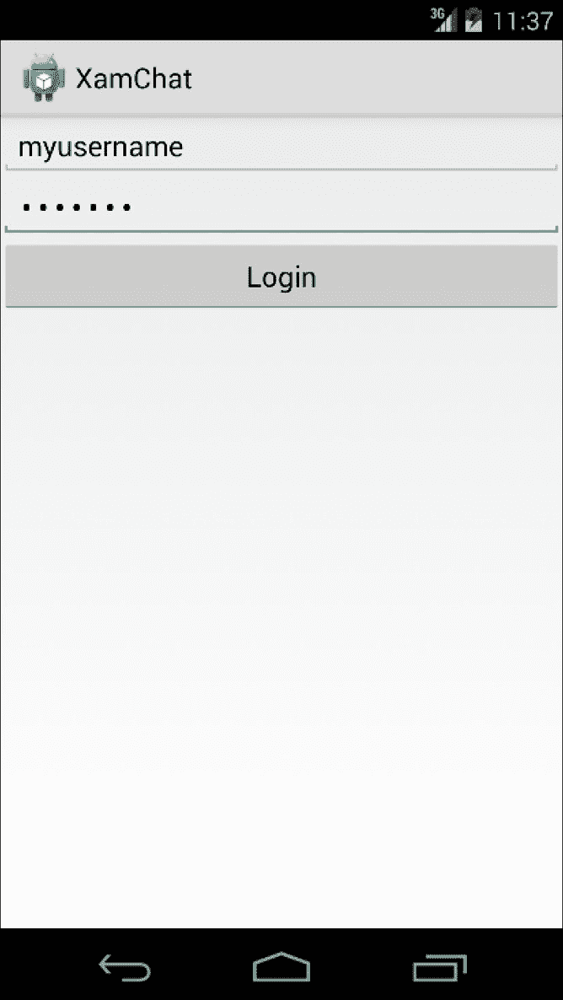
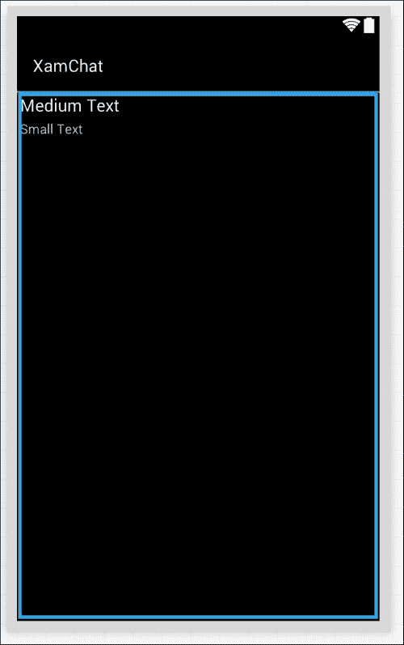
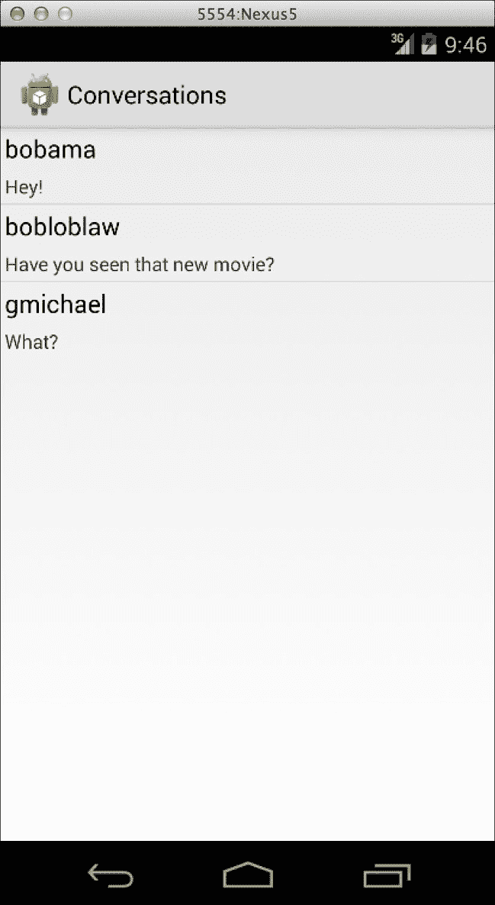
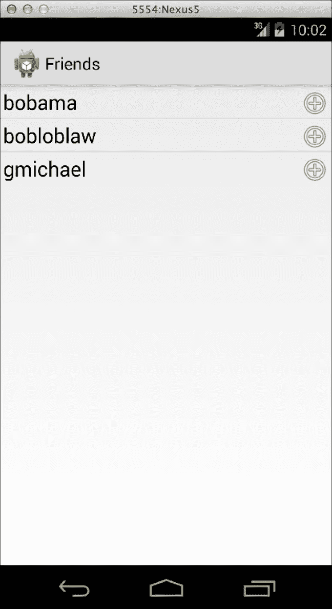
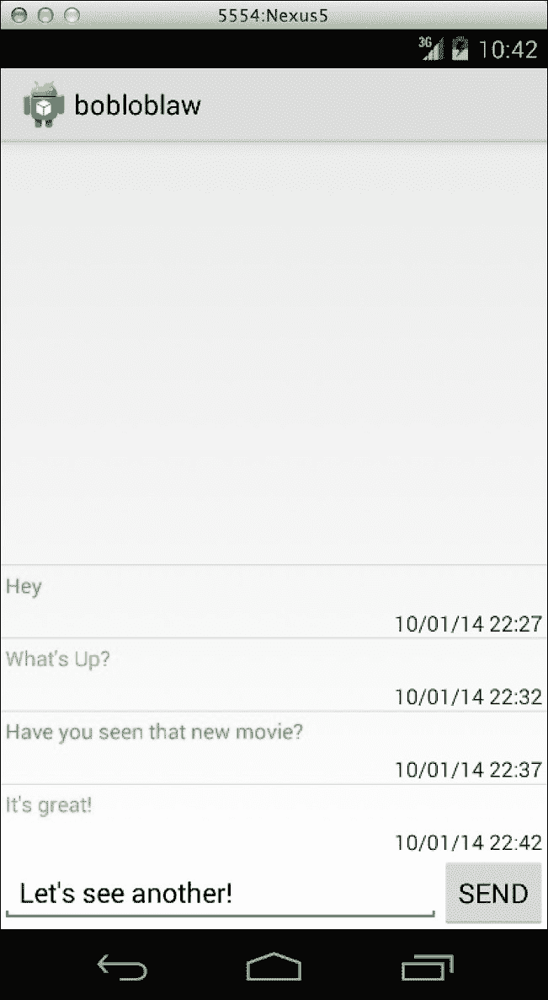

# 第六章 XamChat for Android

在本章中，我们将开始开发我们的 XamChat 示例应用程序的 Android UI。我们将直接使用原生 Android API 来创建我们的应用程序，并调用我们的共享便携式类库，类似于我们在 iOS 上所做的那样。同样，我们的 Xamarin.Android 应用程序将无法与用 Java 编写的 Android 应用程序区分开来。

要开始编写 XamChat 的 Android 版本，请打开前几章提供的解决方案，并创建一个新的**Android 应用程序**项目。将项目命名为`XamChat.Droid`或您选择的任何其他适当名称。

在本章中，我们将介绍：

+   AndroidManifest

+   为 XamChat 编写登录界面

+   Android 的 ListView 和 BaseAdapter

+   添加好友列表

+   添加消息列表

# 介绍 AndroidManifest

所有 Android 应用程序都有一个名为 AndroidManifest 的 XML 文件，它声明了关于应用程序的基本信息，例如应用程序版本和名称，并命名为`AndroidManifest.xml`。这与 iOS 上的`Info.plist`文件非常相似，但 Android 对其重要性给予了更多的重视。默认项目没有清单，因此让我们通过导航到**项目选项** | **Android 应用程序**并点击**添加 Android 清单**来创建一个。将为你的应用程序出现几个新的设置。

## 设置清单

以下截图显示的最重要设置如下：

+   **应用程序名称**: 这是应用程序的标题，它显示在图标下方。它不同于在 Google Play 上选择的名称。

+   **包名**: 这与 iOS 上的类似；它是你的应用捆绑标识符或捆绑 ID。这是一个用于标识应用的唯一名称。惯例是在公司名称开头使用反向域名风格；例如，`com.packt.xamchat`。它必须以小写字母开头，并且至少包含一个"."字符。

+   **应用程序图标**: 这是显示在 Android 主屏幕上的应用程序图标。

+   **版本号**: 这是一个代表应用程序版本的单一数字。提高这个数字表示在 Google Play 上有新版本。

+   **版本名称**: 这是用户友好的版本字符串，用户将在设置和 Google Play 上看到它；例如，**1.0.0**。

+   **最小 Android 版本**: 这是你的应用程序支持的最小 Android 版本。在现代 Android 应用程序中，你通常可以针对 Android 4.0，但这取决于你的应用程序的核心受众。

+   **目标 Android 版本**: 这是你的应用程序编译所针对的 Android SDK 版本。使用更高的数字可以让你访问新的 API，但是，你可能需要在较新的设备上调用这些 API 时进行一些检查。

+   **安装位置**: 这定义了你的 Android 应用程序可以安装的不同位置：自动（用户设置）、外部（SD 卡）或内部（设备内部存储）。



### 常见清单权限

除了这些设置外，还有一个标记为**必需权限**的复选框集合。在应用程序安装之前，这些权限会在 Google Play 上显示给用户。这是 Android 强制执行一定安全级别的方式，使用户能够看到应用程序将如何访问他们的设备以进行更改。

以下是一些常用的清单权限：

+   **相机**: 这提供了访问设备相机的权限

+   **互联网**: 这提供了通过互联网发起网络请求的访问权限

+   **读取联系人**: 这提供了读取设备联系人库的访问权限

+   **读取外部存储**: 这提供了读取 SD 卡的访问权限

+   **写入联系人**: 这提供了修改设备联系人库的访问权限

+   **写入外部存储**: 这提供了写入 SD 卡的访问权限

除了这些设置外，还需要多次手动更改 Android 清单。在这种情况下，你可以像在 Xamarin Studio 中编辑标准 XML 文件一样编辑清单文件。有关有效 XML 元素和属性的完整列表，请访问[`developer.android.com/guide/topics/manifest/manifest-intro.html`](http://developer.android.com/guide/topics/manifest/manifest-intro.html)。

现在让我们填写以下应用程序的设置：

+   **应用程序名称**: `XamChat`

+   **包名**: `com.yourcompanyname.xamchat`；确保将未来的应用程序命名为以`com.yourcompanyname`开头

+   **版本号**: 只需从数字`1`开始

+   **版本**: 这可以是任何字符串，但建议使用类似于版本号的字符串

+   **最小 Android 版本**: 选择**Android 4.0.3 (API Level 15**)

+   **必需权限**: 选择**互联网**；我们稍后会使用它

在这一点上，我们需要从我们在第四章中创建的可移植类库中引用我们的共享代码，即*XamChat – 一个跨平台应用程序*。右键单击项目的**引用**文件夹，然后单击**编辑引用...**，并添加对`XamChat.Core`项目的引用。现在你将能够访问在第四章中编写的所有共享代码，即*XamChat – 一个跨平台应用程序*。

前往`Resources`目录，然后在`values`文件夹中打开`Strings.xml`；这是你 Android 应用程序中所有文本应该存储的地方。这是一个 Android 约定，这将使添加多种语言到你的应用程序变得非常容易。让我们将我们的字符串更改为以下内容：

```cs
<?xml version="1.0" encoding="utf-8"?>
<resources>
    <string name="ApplicationName">XamChat</string>
    <string name="ErrorTitle">Oops!</string>
    <string name="Loading">Loading</string>
</resources>
```

我们将在本章后面使用这些值。如果你在向用户显示文本时需要添加新的值，请随意添加。如果你需要添加更多语言，这非常简单；你可以查看 Android 关于此主题的文档 [`developer.android.com/guide/topics/resources/localization.html`](http://developer.android.com/guide/topics/resources/localization.html)。

## 创建和实现应用程序类

现在我们来实现我们的主要应用程序类；从 **新建文件** 对话框中添加一个新的 **Activity**。在这个文件中，我们不会从 `Activity` 继承，但这个模板在文件顶部添加了几个 Android `using` 语句，用于导入代码中要使用的 Android API。创建一个新的 `Application` 类，我们可以将 `ServiceContainer` 中的所有内容注册如下：

```cs
[Application(Theme = "@android:style/Theme.Holo.Light")]
public class Application : Android.App.Application
{
  public Application(IntPtr javaReference, JniHandleOwnership transfer): base(javaReference, transfer)
  {
  }

  public override void OnCreate()
  {
    base.OnCreate();

    //ViewModels
    ServiceContainer.Register<LoginViewModel>(() => new LoginViewModel());
    ServiceContainer.Register<FriendViewModel>(() => new FriendViewModel());
    ServiceContainer.Register<MessageViewModel>(() => new MessageViewModel());
    ServiceContainer.Register<RegisterViewModel>(() => new RegisterViewModel());

    //Models
    ServiceContainer.Register<ISettings>(() => new FakeSettings());
    ServiceContainer.Register<IWebService>(() => new FakeWebService());
  }
}
```

我们使用了内置的 Android 主题 `Theme.Holo.Light`，仅仅因为它是一个整洁的主题，与我们在 iOS 中使用的默认样式相匹配。注意，我们必须为这个类创建一个奇怪的、空的构造函数才能使其正常工作。这是 Xamarin 中自定义 `Application` 类的当前要求。你可以将其视为样板代码，并且在这种情况下你需要添加它。

现在我们为应用中的所有活动实现一个简单的基类。在 `XamChat.Droid` 项目中创建一个名为 `Activities` 的文件夹，并创建一个名为 `BaseActivity.cs` 的新文件，内容如下：

```cs
[Activity]
public class BaseActivity<TViewModel> : Activitywhere TViewModel : BaseViewModel
{
  protected readonly TViewModel viewModel;
  protected ProgressDialog progress;

  public BaseActivity()
  {
    viewModel = ServiceContainer.Resolve(typeof(TViewModel)) asTViewModel;
  }
  protected override void OnCreate(Bundle bundle)
  {
    base.OnCreate(bundle);
    progress = new ProgressDialog(this);
    progress.SetCancelable(false);progress.SetTitle(Resource.String.Loading);}
  protected override void OnResume()
  {
    base.OnResume();
    viewModel.IsBusyChanged += OnIsBusyChanged;
  }
  protected override void OnPause()
  {
    base.OnPause();
    viewModel.IsBusyChanged -= OnIsBusyChanged;
  }
  void OnIsBusyChanged (object sender, EventArgs e)
  {
    if (viewModel.IsBusy)
      progress.Show();
    else
      progress.Hide();
  }
}
```

我们在这里做了几件事情来简化其他活动的开发。首先，我们使这个类成为泛型，并创建了一个名为 `viewModel` 的受保护变量来存储特定类型的 ViewModel。请注意，由于平台限制，我们在 iOS 中没有在控制器上使用泛型（有关更多信息，请参阅 Xamarin 文档网站 [`docs.xamarin.com/guides/ios/advanced_topics/limitations/`](http://docs.xamarin.com/guides/ios/advanced_topics/limitations/)）。我们还实现了 `IsBusyChanged`，并使用来自 `Strings.xml` 文件的 `Loading` 字符串显示了一个简单的 `ProgressDialog` 函数，以指示网络活动。

让我们再添加一个方法来向用户显示错误，如下所示：

```cs
protected void DisplayError(Exception exc)
{
  string error = exc.Message;
  new AlertDialog.Builder(this)
  .SetTitle(Resource.String.ErrorTitle) 
  .SetMessage(error)
  .SetPositiveButton(Android.Resource.String.Ok,(IDialogInterfaceOnClickListener)null)
  .Show();
}
```

此方法将显示一个弹出对话框，指示出了问题。请注意，我们还使用了 `ErrorTitle` 和内置的 Android `Ok` 字符串资源。

这将完成我们 Android 应用的核心设置。从这里，我们可以继续实现应用中各个屏幕的 UI。

# 添加登录屏幕

在创建 Android 视图之前，了解 Android 中可用的不同布局或视图组类型非常重要。iOS 中没有一些这些的等效功能，因为 iOS 设备的屏幕尺寸变化非常小。由于 Android 几乎有无限的屏幕尺寸和密度，Android SDK 为视图的自动调整大小和布局提供了大量的内置支持。

## Android 中的布局和 ViewGroups

以下是一些常见的布局类型：

+   `ViewGroup`：这是包含子视图集合的视图的基类。你通常不会直接使用这个类。

+   `LinearLayout`：这是一个将子视图按行或列（但不能同时按行和列）定位的布局。你还可以为每个子视图设置权重，使它们占据不同百分比的可用空间。

+   `RelativeLayout`：这是一个提供更多对其子视图位置灵活性的布局。你可以将子视图相对于彼此定位，使它们位于彼此之上、之下、左侧或右侧。

+   `FrameLayout`：这个布局将子视图直接放置在屏幕上的 **z 轴** 顺序上。这个布局最适合有大型子视图需要其他视图在其上方，并且可能停靠在一边的情况。

+   `ListView`：这个视图通过一个确定子视图数量的适配器类，以列表形式垂直显示视图。它还支持其子视图被选中。

+   `GridView`：这个视图在网格中按行和列显示视图。它还需要使用一个适配器类来提供子视图的数量。

在我们开始编写登录界面之前，删除由 Android 项目模板创建的 `Main.axml` 和 `MainActivity.cs` 文件，因为它们对这个应用程序没有用。接下来，在项目 `Resources` 目录下的 `layout` 文件夹中创建一个名为 `Login.axml` 的 Android 布局文件。

现在，我们可以按照以下方式开始向我们的 Android 布局添加功能：

1.  双击 `Login.axml` 文件以打开 Android 设计器。

1.  将两个 **Plain Text** 视图拖到 **Text Fields** 部分的布局中。

1.  在 **Id** 字段中，分别输入 `@+id/username` 和 `@+id/password`。这是你将采取的步骤，以便从 C# 代码中与任何控件一起工作。

1.  对于密码字段，将其 **Input Type** 属性设置为 `textPassword`。

1.  将一个 **Button** 拖到布局中，并设置其 **Text** 属性为 `Login`。

1.  将按钮的 **Id** 属性设置为 `@+id/login`。我们将从代码中使用这个控件。

完成布局后，你的布局看起来会像以下截图所示：



## 实现登录功能

现在在之前创建的 `Activites` 文件夹中创建一个新的 Android Activity 文件，命名为 `LoginActivity.cs`。我们将使用这个文件作为应用程序运行时启动的主要活动。让我们按照以下方式实现登录功能：

```cs
[Activity(Label = "@string/ApplicationName", MainLauncher = true)]
public class LoginActivity : BaseActivity<LoginViewModel>
{
  EditText username, password;
  Button login;

  protected override void OnCreate(Bundle bundle)
  {
    base.OnCreate(bundle);
    SetContentView(Resource.Layout.Login);
    username = FindViewById<EditText>(Resource.Id.username);
    password = FindViewById<EditText>(Resource.Id.password);
    login = FindViewById<Button>(Resource.Id.login);
    login.Click += OnLogin;
  }
  protected override void OnResume()
  {
    base.OnResume();
    username.Text = password.Text = string.Empty;
  }
  async void OnLogin (object sender, EventArgs e)
  {
    viewModel.Username = username.Text;
    viewModel.Password = password.Text;
    try
    {
      await viewModel.Login();
        //TODO: navigate to a new activity
    }
    catch (Exception exc)
    {
      DisplayError(exc);
    }
  }
}
```

注意，我们将 `MainLauncher` 设置为 `true`，使这个活动成为应用程序的第一个活动。在某些应用程序中，一个启动画面被用作第一个活动，所以如果你需要添加启动画面，请记住这一点。我们还利用了本章中早些时候设置的 `ApplicationName` 值和 `BaseActivity` 类。我们还重写了 `OnResume` 方法，以便清除两个 `EditText` 控件，以便在返回到屏幕时清除值。

现在如果您启动应用程序，您将看到我们刚刚实现的登录屏幕，如下面的截图所示：



# 使用 ListView 和 BaseAdapter

现在，让我们在 Android 上实现一个对话列表。Android 中`UITableView`和`UITableViewSource` iOS 类的对应物是`ListView`和`BaseAdapter`。这些 Android 类有并行概念，例如实现抽象方法和在滚动时回收单元格。Android 中使用了几种不同的适配器，例如`ArrayAdapter`或`CursorAdaptor`，尽管`BaseAdapter`通常最适合简单的列表。

## 实现对话屏幕

让我们实现我们的对话屏幕。让我们首先在您的`Activities`文件夹中创建一个新的 Android Activity，命名为`ConversationsActivity.cs`。让我们从对类定义的以下几个更改开始：

```cs
[Activity(Label = "Conversations")]
public class ConversationsActivity :BaseActivity<MessageViewModel>
{
  //Other code here later
}
```

执行以下步骤以实现几个 Android 布局：

1.  在`Resources`目录的`layout`文件夹中创建一个新的 Android 布局，命名为`Conversations.axml`。

1.  从**工具箱**中将**ListView**控件拖放到布局中，并设置其**ID**为`@+id/conversationsList`。

1.  在`Resources`目录的`layout`文件夹中创建第二个 Android 布局，命名为`ConversationListItem.axml`。

1.  从**工具箱**面板中将**文本（中号）**和**文本（小号）**控件拖放到布局中。

1.  将它们的 ID 设置为`@+id/conversationUsername`和`@+id/conversationLastMessage`。

1.  最后，让我们将它们的**边距**都设置为`3dp`，在**属性**框的**布局**选项卡中。

这样就会设置好我们将在对话屏幕中使用的所有布局文件。您的`ConversationListItem.axml`布局将类似于以下截图所示：



现在，我们可以在`ConversationsActivity`内部实现`BaseAdapter`作为嵌套类，如下所示：

```cs
class Adapter : BaseAdapter<Conversation>
{
  readonly MessageViewModel messageViewModel = ServiceContainer.Resolve<MessageViewModel>();
  readonly LayoutInflater inflater;

  public Adapter(Context context)
  {
    inflater = (LayoutInflater)context.GetSystemService (Context.LayoutInflaterService);
  }
  public override long GetItemId(int position)
  {
    //This is an abstract method, just a simple implementation
    return position;
  }
  public override View GetView(int position, View convertView, ViewGroup parent)
  {
    if (convertView == null)
    {
      convertView = inflater.Inflate (Resource.Layout.ConversationListItem, null);
    }
    var conversation = this [position];
    var username = convertView.FindViewById<TextView>(Resource.Id.conversationUsername);
    var lastMessage = convertView.FindViewById<TextView>(Resource.Id.conversationLastMessage);
    username.Text = conversation.Username;
    lastMessage.Text = conversation.LastMessage;
    return convertView;
  }
  public override int Count
  {
    get { return messageViewModel.Conversations == null ? 0: messageViewModel.Conversations.Length; }
  }
  public override Conversation this[int index]
  {
    get { return messageViewModel.Conversations [index]; }
  }
}
```

以下是对适配器内部发生的事情的回顾：

1.  我们继承了`BaseAdapter<Conversation>`。

1.  我们传递了`Context`（我们的活动）以便我们可以提取`LayoutInflater`。这个类使您能够加载 XML 布局资源并将它们填充到视图对象中。

1.  我们实现了`GetItemId`。这是一个用于识别行的一般方法，但我们现在只是返回位置。

1.  我们设置了`GetView`，通过仅在新视图为 null 时创建新视图来回收`convertView`变量。我们还从布局中提取了文本视图来设置它们的文本。

1.  我们重写了`Count`以返回对话的数量。

1.  我们实现了一个索引器，用于返回指定位置的`Conversation`对象。

总体来说，这应该与我们之前在 iOS 上所做的相当相似。

## 设置适配器

现在，让我们通过在`ConversationsActivity`的主体中添加以下内容来在我们的活动中设置适配器：

```cs
ListView listView;
Adapter adapter;

protected override void OnCreate(Bundle bundle)
{
  base.OnCreate(bundle);
  SetContentView(Resource.Layout.Conversations);
  listView = FindViewById<ListView>(Resource.Id.conversationsList);
  listView.Adapter = adapter = new Adapter(this);
}
protected async override void OnResume()
{
  base.OnResume();
  try
  {
    await viewModel.GetConversations();
    adapter.NotifyDataSetInvalidated();
  }
  catch (Exception exc)
  {
    DisplayError(exc);
  }
}
```

此代码将在活动出现在屏幕上时设置适配器并重新加载我们的会话列表。请注意，我们在这里调用了`NotifyDataSetInvalidated`，这样`ListView`在会话数量更新后可以重新加载其行。这与我们在 iOS 上通过调用`UITableView`的`ReloadData`方法所做的是平行的。

最后但同样重要的是，我们需要修改之前在`LoginActivity`中设置的`OnLogin`方法，以便启动我们的新活动，如下所示：

```cs
StartActivity(typeof(ConversationsActivity));
```

现在，如果我们编译并运行我们的应用程序，登录后我们可以导航到会话列表，如下面的截图所示：



# 实现朋友列表

在我们开始实现朋友列表屏幕之前，我们必须首先在我们的应用程序的`ActionBar`中添加一个菜单项。让我们首先在我们的项目的`Resources`文件夹中创建一个新的`menu`文件夹。接下来，创建一个名为`ConversationsMenu.axml`的新 Android 布局文件。删除由 XML 创建的默认布局，并用以下内容替换它：

```cs
<?xml version="1.0" encoding="utf-8"?>
<menu >
  <item android:id="@+id/addFriendMenu"android:icon="@android:drawable/ic_menu_add"android:showAsAction="ifRoom"/>
</menu>
```

我们设置了一个包含一个菜单项的根菜单。

下面的代码是我们在 XML 中为该项设置的详细说明：

+   `android:id`：我们稍后将在 C#中使用它来引用菜单项`Resource.Id.addFriendMenu`。

+   `android:icon`：这是一个用于显示菜单项的图像资源。我们使用了一个内置的 Android 通用**加号**图标。

+   `android:showAsAction`：如果空间允许，这将使菜单项可见。如果由于某种原因设备屏幕太窄，将显示一个溢出菜单来显示菜单项。

现在，我们可以在`ConversationsActivity.cs`中做一些更改，以显示菜单项，如下所示：

```cs
public override bool OnCreateOptionsMenu(IMenu menu)
{
  MenuInflater.Inflate(Resource.Menu.ConversationsMenu, menu);
  return base.OnCreateOptionsMenu(menu);
}
```

此代码将把我们的布局应用到活动动作栏顶部的菜单中。接下来，我们可以添加一些代码，以便在菜单项被选中时运行：

```cs
public override bool OnOptionsItemSelected(IMenuItem item)
{
  if (item.ItemId == Resource.Id.addFriendMenu)
  {
    //TODO: launch the next activity
  }
  return base.OnOptionsItemSelected(item);
}
```

现在，让我们实现下一个活动。让我们首先复制`Resources`目录中`layout`文件夹中的`Conversations.axml`，并将其重命名为`Friends.axml`。我们在这个文件中要做的唯一更改是将 ListView 的 ID 重命名为`@+id/friendsList`。

接下来，执行以下步骤以创建一个可用于`ListView`中列表项的布局：

1.  创建一个新的 Android 布局`FriendListItem.axml`。

1.  打开布局并切换到屏幕底部的**源**标签。

1.  将根`LinearLayout` XML 元素更改为`RelativeLayout`元素。

1.  切换回屏幕底部的**内容**标签。

1.  从**工具箱**面板拖动一个**文本（大号）**控件到布局中，并将其**Id**设置为`@+id/friendName`。

1.  从**工具箱**面板拖动一个**ImageView**控件到布局中；你可以让它保留其默认值或留空。

1.  将图像视图的图像更改为 `@android:drawable/ic_menu_add`。这是我们之前在章节中使用的相同加号图标。您可以从 **Framework Resources** 选项卡下的 **Resources** 对话框中选择它。

1.  将两个控件的高度和宽度都设置为 `wrap_content`。这可以在 **ViewGroup** 部分的 **Layout** 选项卡下找到。

1.  接下来，检查图像视图上的 **Align Parent Right** 的值。

1.  最后，在 **Properties** 窗口的 **Layout** 选项卡中，将两个控件的外边距设置为 `3dp`。

使用 Xamarin 设计器可以非常高效，但一些开发者更喜欢更高层次的控制。你可能考虑自己编写 XML 代码作为替代方案，这相当直接，如下面的代码所示：

```cs
<?xml version="1.0" encoding="utf-8"?>
<RelativeLayout 
android:layout_width="fill_parent"
android:layout_height="fill_parent">
  <TextView android:text="Large Text"
  android:textAppearance="?android:attr/textAppearanceLarge"
  android:layout_width="wrap_content"
  android:layout_height="wrap_content"
  android:id="@+id/friendName"
  android:layout_margin="3dp" />
  <ImageView 
  android:src="img/ic_menu_add" 
  android:layout_alignParentRight="true" 
  android:layout_width="wrap_content"
  android:layout_height="wrap_content"
  android:layout_margin="3dp" />
</RelativeLayout>
```

由于我们现在已经有了新屏幕所需的所有布局，让我们在 `Activities` 文件夹中创建一个名为 `FriendsActivity.cs` 的 Android Activity。让我们像之前一样创建活动的基本定义，如下所示：

```cs
[Activity(Label = "Friends")]
public class FriendsActivity : BaseActivity<FriendViewModel>
{
  protected override void OnCreate(Bundle bundle)
  {
    base.OnCreate(bundle);
  }
}
```

现在，让我们实现一个嵌套的 `Adapter` 类来设置列表视图项，如下所示：

```cs
class Adapter : BaseAdapter<User>
{
  readonly FriendViewModel friendViewModel = ServiceContainer.Resolve<FriendViewModel>();
  readonly LayoutInflater inflater;

  public Adapter(Context context)
  {
    inflater = (LayoutInflater)context.GetSystemService (Context.LayoutInflaterService);
  }
  public override long GetItemId(int position)
  {
    return position;
  }
  public override View GetView(int position, View convertView, ViewGroup parent)
  {
    if (convertView == null)
    {
      convertView = inflater.Inflate(Resource.Layout.FriendListItem, null);
    }
    var friend = this [position];
    var friendname = convertView.FindViewById<TextView>(Resource.Id.friendName);
    friendname.Text = friend.Username;
    return convertView;
  }
  public override int Count
  {
    get { return friendViewModel.Friends == null ? 0: friendViewModel.Friends.Length; }
  }
  public override User this[int index]
  {
    get { return friendViewModel.Friends [index]; }
  }
}
```

在这个适配器和之前我们为对话屏幕实现的适配器之间，实际上并没有太大的区别。我们只需要设置朋友的名字，并使用 `User` 对象而不是 `Conversation` 对象。

要完成设置适配器，我们可以更新 `FriendsActivity` 类的主体如下：

```cs
ListView listView;
Adapter adapter;

protected override void OnCreate(Bundle bundle)
{
  base.OnCreate(bundle);
  SetContentView(Resource.Layout.Friends);
  listView = FindViewById<ListView>(Resource.Id.friendsList);
  listView.Adapter = adapter = new Adapter(this);
}
protected async override void OnResume()
{
  base.OnResume();
  try
  {
    await viewModel.GetFriends();
    adapter.NotifyDataSetInvalidated();
  }
  catch (Exception exc)
  {
    DisplayError(exc);
  }
}
```

最后但同样重要的是，我们可以在 `ConversationsActivity` 类中更新 `OnOptionsItemSelected` 如下：

```cs
public override bool OnOptionsItemSelected(IMenuItem item)
{
  if (item.ItemId == Resource.Id.addFriendMenu)
  {
    StartActivity(typeof(FriendsActivity));
  }
  return base.OnOptionsItemSelected(item);
}
```

因此，如果我们编译并运行应用程序，我们可以导航到一个完全实现的联系人列表屏幕，如下面的截图所示：



# 消息编写

下一个屏幕稍微复杂一些。我们需要创建一个 `ListView`，它根据每行的类型使用多个布局文件。我们还需要进行一些布局技巧，以便在 `ListView` 下方放置一个视图并设置 `ListView` 以自动滚动。

对于下一个屏幕，让我们首先在 `Resources` 目录的 `layout` 文件夹中创建一个新的布局文件名为 `Messages.axml`，然后执行以下步骤：

1.  将一个新的 **ListView** 拖动到布局中。将其 **Id** 设置为 `@+id/messageList`。

1.  打开 **Stack From Bottom** 的复选框，并将 **Transcript Mode** 设置为 `alwaysScroll`。这将按从下到上的顺序显示项目。

1.  在 **LinearLayout** 部分的 **Layout** 选项卡下，将 **ListView** 的 **Weight** 值设置为 `1`。

1.  将一个新的 **RelativeLayout** 拖动到布局中。让其 **Id** 使用默认值，或者将其移除。

1.  将一个新的 **Button** 拖动到 **RelativeLayout** 内部。将其 **Id** 设置为 `@+id/sendButton`。

1.  在 **Layout** 选项卡中打开 **Align Parent Right** 的复选框。

1.  将 **RelativeLayout** 中 **Text Field** 部分的 **Plain Text** 拖动到按钮的左侧。将其 **Id** 设置为 `@+id/messageText`。

1.  在 **Layout** 选项卡中，将 **To Left Of** 设置为 `@+id/sendButton`，并将其 **Width** 设置为 `match_parent`。

1.  打开 **Center in Parent** 复选框以固定垂直居中。

完成后，XML 文件将如下所示：

```cs
<?xml version="1.0" encoding="utf-8"?>
<LinearLayout

  android:orientation="vertical"
  android:layout_width="match_parent"
  android:layout_height="match_parent">
  <ListView
    android:minWidth="25px"
    android:minHeight="25px"
    android:layout_width="fill_parent"
    android:layout_height="wrap_content"
    android:id="@+id/messageList"
    android:layout_weight="1"
    android:stackFromBottom="true"
    android:transcriptMode="alwaysScroll" />
  <RelativeLayout
  android:minWidth="25px"
  android:minHeight="25px"
  android:layout_width="fill_parent"
  android:layout_height="wrap_content">
  <Button
    android:text="Send"
    android:layout_alignParentRight="true"
    android:layout_width="wrap_content"
    android:layout_height="wrap_content"
    android:id="@+id/sendButton" />
  <EditText
    android:layout_width="match_parent"
    android:layout_height="wrap_content"
    android:layout_toLeftOf="@id/sendButton"
    android:layout_centerInParent="true"
    android:id="@+id/messageText" />
  </RelativeLayout>
</LinearLayout>

```

接下来，执行以下步骤以创建另外两个 Android 布局：

1.  在 `Resources` 目录的 `layout` 文件夹中创建一个名为 `MyMessageListItem.axml` 的新布局。

1.  打开布局并切换到 **Source** 选项卡。将根 XML 元素更改为 `RelativeLayout` 元素。

1.  切换回 **Content** 选项卡，并将两个 **TextView** 控件拖放到布局中。

1.  在 **Id** 字段中，分别输入 `@+id/myMessageText` 和 `@+id/myMessageDate`。

1.  对于这两个视图，设置 **Margin** 为 `3dp`，以及 **Width** 和 **Height** 为 `wrap_content`。

1.  对于第一个 TextView，在 **Style** 选项卡下将其 **Color** 设置为 `@android:color/holo_blue_bright`。

1.  对于第二个 TextView，在 **Layout** 选项卡下检查 **Align Parent Right** 复选框。

1.  创建一个名为 `TheirMessageListItem.axml` 的新布局，并重复此过程。为新布局中的第一个 TextView 选择不同的颜色。

最后，我们需要为屏幕创建一个新的活动。在 `Activities` 目录中创建一个名为 `MessagesActivity.cs` 的新 Android Activity。让我们从设置活动的标准代码开始，如下所示：

```cs
[Activity(Label = "Messages")]
public class MessagesActivity : BaseActivity<MessageViewModel>
{
  protected override void OnCreate(Bundle bundle)
  {
    base.OnCreate(bundle);
  }
}
```

接下来，让我们实现一个比之前实现的更复杂的适配器，如下所示：

```cs
class Adapter : BaseAdapter<Message>
{
  readonly MessageViewModel messageViewModel = ServiceContainer.Resolve<MessageViewModel>();
  readonly ISettings settings = ServiceContainer.Resolve<ISettings>();
  readonly LayoutInflater inflater;
  const int MyMessageType = 0, TheirMessageType = 1;

  public Adapter (Context context)
  {
    inflater = (LayoutInflater)context.GetSystemService (Context.LayoutInflaterService);
  }
  public override long GetItemId(int position)
  {
    return position;
  }
  public override int Count
  {
    get { return messageViewModel.Messages == null ? 0: messageViewModel.Messages.Length; }
  }
  public override Message this[int index]
  {
    get { return messageViewModel.Messages [index]; }
  }
  public override int ViewTypeCount
  {
    get { return 2; }
  }
  public override int GetItemViewType(int position)
  {
    var message = this [position];
    return message.UserId == settings.User.Id ?MyMessageType : TheirMessageType;
  }
}
```

这包括除了我们即将实现的 `GetView` 之外的所有内容。在这里，首先是一些 `MyMessageType` 和 `TheirMessageType` 的常量。然后我们实现了 `ViewTypeCount` 和 `GetItemViewType`。这是 Android 用于在列表视图中使用两个不同布局的机制。我们为用户的消息使用一种类型的布局，为对话中的另一个用户使用不同的布局。

接下来，让我们按照以下方式实现 `GetView`：

```cs
public override View GetView(int position, View convertView, ViewGroup parent)
{
  var message = this [position];
  int type = GetItemViewType(position);
  if (convertView == null)
  {
    if (type == MyMessageType)
    {
      convertView = inflater.Inflate(Resource.Layout.MyMessageListItem, null);
    }
    else
    {
      convertView = inflater.Inflate(Resource.Layout.TheirMessageListItem, null);
    }
  }
  TextView messageText, dateText;
  if (type == MyMessageType)
  {
    messageText = convertView.FindViewById<TextView>(Resource.Id.myMessageText);
    dateText = convertView.FindViewById<TextView>(Resource.Id.myMessageDate);
  }
  else
  {
    messageText = convertView.FindViewById<TextView>(Resource.Id.theirMessageText);
    dateText = convertView.FindViewById<TextView>(Resource.Id.theirMessageDate);
    }
  messageText.Text = message.Text;
  dateText.Text = message.Date.ToString("MM/dd/yy HH:mm");
  return convertView;
}
```

让我们通过以下步骤分解我们的实现：

1.  我们首先提取了行位置的 `message` 对象。

1.  接下来，我们获取视图类型，以确定它是当前用户的消息还是对话中的另一个用户。

1.  如果 `convertView` 为 `null`，则根据类型填充适当的布局。

1.  接下来，我们从 `convertView` 中提取两个文本视图，`messageText` 和 `dateText`。我们必须使用类型值来确保我们使用正确的资源 ID。

1.  我们使用 `message` 对象在两个文本视图中设置适当的文本。

1.  我们返回 `convertView`。

现在，让我们通过设置适配器的其余部分来完成 `MessagesActivity`。首先，让我们实现一些成员变量和 `OnCreate` 方法，如下所示：

```cs
ListView listView;
EditText messageText;
Button sendButton;
Adapter adapter;

protected override void OnCreate(Bundle bundle)
{
  base.OnCreate(bundle);

  Title = viewModel.Conversation.Username;
  SetContentView(Resource.Layout.Messages);
  listView = FindViewById<ListView>(Resource.Id.messageList);
  messageText = FindViewById<EditText>(Resource.Id.messageText);
  sendButton = FindViewById<Button>(Resource.Id.sendButton);

  listView.Adapter = adapter = new Adapter(this);

  sendButton.Click += async (sender, e) =>
  {
    viewModel.Text = messageText.Text;
    try
    {
      await viewModel.SendMessage();
      messageText.Text = string.Empty;
      adapter.NotifyDataSetInvalidated();
      listView.SetSelection(adapter.Count);
    }
    catch (Exception exc)
    {
      DisplayError(exc);
    }
  };
}
```

与本章中我们之前的活动相比，到目前为止这个活动相当标准。我们还在 `OnCreate` 中连接了 `sendButton` 的 `Click` 事件，以便发送消息并刷新列表。我们还使用了一个技巧，通过将选择设置为最后一个项目来滚动列表视图。

接下来，我们需要实现`OnResume`来加载消息，使适配器失效，然后将列表视图滚动到末尾，如下所示：

```cs
protected async override void OnResume()
{
  base.OnResume();
  try
  {
    await viewModel.GetMessages();
    adapter.NotifyDataSetInvalidated();
    listView.SetSelection(adapter.Count);
  }
  catch (Exception exc)
  {
    DisplayError(exc);
  }
}
```

所以最终，如果你编译并运行这个应用，你将能够导航到消息屏幕，并向列表中添加新的消息，如下面的截图所示：



# 摘要

在本章中，我们首先回顾了 AndroidManifest 文件中的基本设置。接下来，我们实现了一个自定义的`Application`类来设置我们的`ServiceContainer`。然后，我们介绍了 Android 的不同布局类型，并使用原生 Android 视图实现了登录屏幕。我们实现了好友列表屏幕，并学习了`ListView`和适配器的基础知识。最后，我们实现了消息屏幕，并使用了列表视图适配器和布局中更高级的功能。

完成本章学习后，你将拥有一个部分功能的 Android 版 XamChat。你将更深入地理解 Android SDK 和工具。你应该自信地使用 Xamarin 开发自己的 Android 应用。请自行实现本章未涵盖的剩余屏幕。如果你感到困惑，请随时查阅本书附带的全样本应用。在下一章中，我们将介绍如何部署到移动设备，以及为什么在实际设备上测试你的应用非常重要。
