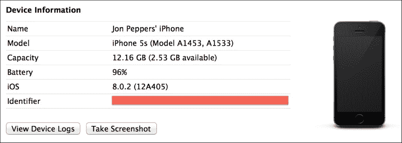
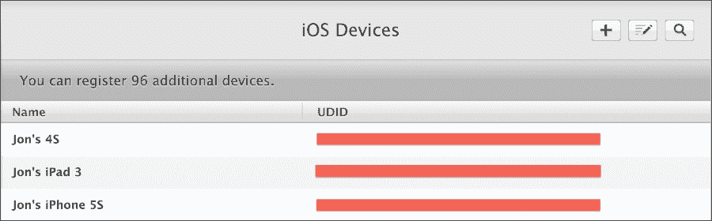
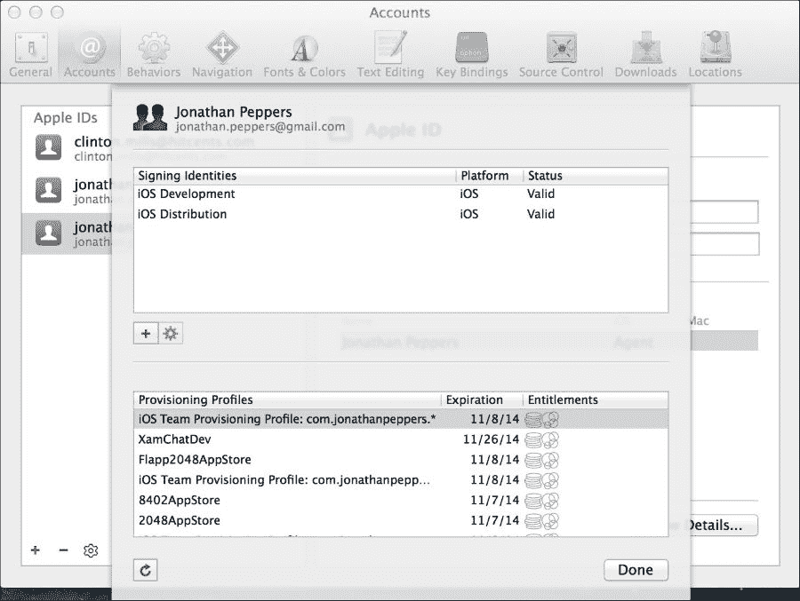
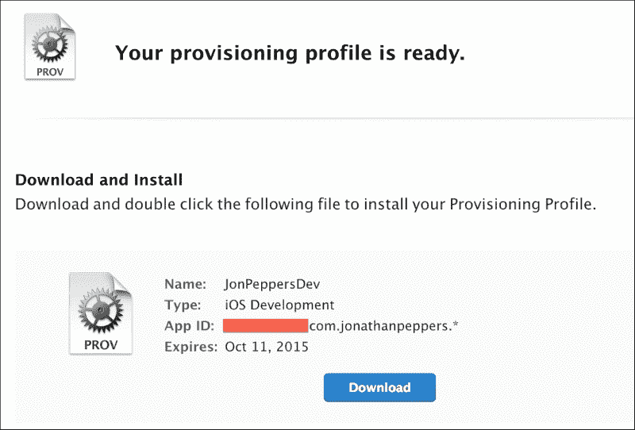
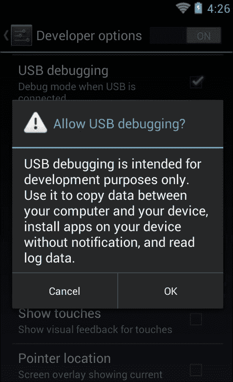
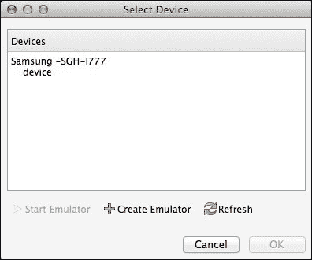

# 第七章。在设备上部署和测试

首次尝试部署到设备时，这既重要又有些麻烦。在设备上测试通常会显示在应用程序的模拟器/仿真器中不存在的性能问题。您还可以测试只能在真实设备上完成的事情，例如 GPS、摄像头、内存限制或蜂窝网络连接。在为 Xamarin 开发时，也存在一些常见的陷阱，这些陷阱只有在真实设备上测试时才会显现。

在本章中，我们将涵盖以下主题：

+   iOS 配置

+   Android 设备调试设置

+   链接器

+   预编译（AOT）

+   与 Xamarin 相关的常见内存陷阱

在我们开始本章之前，重要的是要注意，部署到 iOS 设备需要 iOS 开发者计划会员资格。您可以随时返回到第一章，*设置 Xamarin*，以了解此过程。

# iOS 配置

苹果公司对部署应用程序到 iOS 设备有一套严格的过程。虽然这对开发者来说可能相当复杂，有时甚至痛苦，但苹果可以通过阻止普通用户侧载可能有害的应用程序来提高一定级别的安全性。

## 部署到 iOS 的先决条件

在我们能够将我们的应用程序部署到 iOS 设备之前，我们需要在**iOS 开发中心**设置一些事情。我们将首先为您创建 App ID 或包 ID。这是任何 iOS 应用程序的主要标识符。

我们将首先导航到 [`developer.apple.com`](http://developer.apple.com) 并执行以下步骤：

1.  点击**iOS 应用**图标。

1.  使用您的开发者账户登录。

1.  点击右侧导航中的**证书、标识符和配置文件**。

1.  点击**标识符**。

1.  点击加号按钮添加新的 iOS App ID。

1.  在**名称**字段中，输入一些有意义的名称，例如 `YourCompanyNameWildcard`。

1.  选择**通配符 App ID**单选按钮。

1.  在**包 ID**字段中，选择一个反向域名风格的名称，例如 `com.yourcompanyname.*`。

1.  点击**继续**。

1.  检查最终设置并点击**提交**。

保持此网页打开，因为我们将在本章中一直使用它。

我们刚刚为您注册了一个通配符包 ID；请将此用作所有未来希望与该账户关联的应用程序的名称前缀。稍后，当您准备将应用程序部署到苹果应用商店时，您将创建一个**显式 App ID**，例如 `com.yourcompanyname.yourapp`。这允许您将特定应用程序部署到商店，而通配符 ID 最好用于部署到设备进行测试。

接下来，我们需要找到您计划在调试应用程序的每个设备上的唯一标识符。苹果要求每个设备都必须在您的账户下注册，每个开发者的设备数量限制为 200 台。绕过这一要求的唯一方法是注册 iOS 开发者企业计划，该计划每年费用为 299 美元，与标准 99 美元的开发者费用分开。

我们将开始启动 Xcode 并执行以下步骤：

1.  在顶部菜单中导航到**窗口** | **设备**。

1.  使用 USB 线将您的目标设备连接上。

1.  在左侧导航栏中，您应该看到您的设备名称。点击它以选择它。

1.  注意您的设备的**标识符**值。将其复制到您的剪贴板。

以下截图显示了在 Xcode 中选择您的设备时您的屏幕应该看起来像什么：



返回到[`developer.apple.com`](http://developer.apple.com)（希望它仍然在章节的早期打开）并执行以下步骤：

1.  在左侧导航栏中导航到**设备** | **所有**。

1.  点击页面右上角的加号按钮。

1.  为您的设备输入一个有意义的名称，并将剪贴板中的**标识符**值粘贴到**UDID**字段中。

1.  点击**继续**。

1.  查看您输入的信息并点击**注册**。

在将来，当您的账户完全设置好时，您只需在 Xcode 中点击**用于开发**按钮即可跳过第二组步骤。

以下截图显示了完成时您的设备列表应该看起来像什么：



接下来，我们需要生成一个代表您作为账户开发者的证书。在 Xcode 5 之前，您必须使用 Mac 上的**密钥链**应用程序创建一个证书签名请求。您可以在“应用程序”下找到它，或者使用 OS X 的搜索 spotlight 通过*Command* + *Space*。Xcode 的新版本通过将许多此过程集成到 Xcode 中，使事情变得容易得多。

打开 Xcode 并执行以下步骤：

1.  在顶部菜单中导航到**Xcode** | **首选项**。

1.  选择**账户**选项卡。

1.  点击左下角的加号按钮，然后点击**添加 Apple ID**。

1.  输入您的开发者账户的电子邮件和密码。

1.  在创建账户时，点击右下角的**查看详情**。

1.  点击左下角的**同步**按钮。

1.  如果这是一个新账户，Xcode 将显示一个警告，表示尚不存在任何证书。勾选每个框并点击**请求**以生成证书。

Xcode 现在将自动为您创建一个开发者证书并将其安装到您的 Mac 的密钥链中。

以下截图显示了设置账户后您的屏幕将看起来像什么：



## 创建配置文件

接下来，我们需要创建一个**配置文件**。这是允许应用程序安装在 iOS 设备上的最终文件。配置文件包含一个 App ID、设备 ID 列表，最后是开发者的证书。您还必须在 Mac 的密钥链中拥有开发者证书的私钥才能使用配置文件。

以下是一些配置文件类型：

+   **开发**：这用于调试或发布构建。当您的应用程序处于开发阶段时，您将积极使用此类配置文件。

+   **Ad Hoc**：这主要用于发布构建。此类证书非常适合 beta 测试或向少量用户分发。使用企业开发者帐户，您可以使用此方法向无限数量的用户分发。

+   **App Store**：这用于提交到 App Store 的发布构建。您不能使用此证书将应用程序部署到您的设备；它只能用于商店提交。

让我们回到[`developer.apple.com`](http://developer.apple.com)并按照以下步骤创建一个新的配置文件：

1.  导航到左侧面板上的**配置文件** | **所有**。

1.  点击页面右上角的加号按钮。

1.  选择**iOS 应用开发**并点击**继续**。

1.  选择本章中创建的通配符 App ID 并点击**继续**。

1.  选择本章中创建的证书并点击**继续**。

1.  选择您想要部署到的设备并点击**继续**。

1.  输入一个合适的**配置文件名称**，例如`YourCompanyDev`。

1.  点击**生成**，您的配置文件将被创建。

以下截图显示了创建过程中最终将得到的配置文件。不用担心下载文件；我们将使用 Xcode 导入最终配置文件。



要导入配置文件，请返回 Xcode 并执行以下步骤：

1.  导航到对话框顶部的菜单中的**Xcode** | **首选项**。

1.  选择**帐户**选项卡。

1.  选择您的帐户并点击**查看详情**。

1.  点击左下角的**同步**按钮。

1.  几秒钟后，您的配置文件将出现。

Xcode 将自动包括您在 Apple 开发者网站上创建的任何配置文件。Xcode 还会创建一些自己的配置文件。

在 Xamarin Studio 的最新版本中，您可以查看这些配置文件，但无法同步它们。导航到**Xamarin Studio** | **首选项** | **开发者帐户**以查看 Xamarin Studio 中的配置文件。您还可以在 Xamarin 的文档网站上查看有关 iOS 配置的文档，网址为[`docs.xamarin.com/guides/ios/getting_started/device_provisioning/`](http://docs.xamarin.com/guides/ios/getting_started/device_provisioning/)。

# 安卓设备设置

与在 iOS 设备上部署应用的麻烦相比，Android 要容易得多。要将应用部署到设备上，你只需在设备上设置一些设置即可。这是由于 Android 相对于 iOS 的开放性。大多数用户的 Android 设备调试是关闭的，但任何可能想尝试编写 Android 应用的开发者都可以轻松将其打开。

我们将首先打开**设置**应用。你可能需要通过查看设备上的所有应用来找到它，如下所示：

1.  向下滚动并点击标记为**开发者选项**的部分。

1.  在顶部的操作栏中，你可能需要将开关切换到**开启**位置。这因设备而异。

1.  向下滚动并勾选**USB 调试**。

1.  将出现一个警告确认消息。然后，点击**确定**。

### 小贴士

注意，一些较新的 Android 设备使得普通用户开启 USB 调试变得稍微困难一些。你必须点击**开发者选项**项目七次才能打开此选项。

以下截图显示了在过程中你的设备将看起来像什么：



启用此选项后，你只需通过 USB 连接你的设备，并在 Xamarin Studio 中调试 Android 应用即可。你将在**选择设备**对话框中看到你的设备。请注意，如果你使用 Windows 或非标准设备，你可能需要访问设备制造商的网站来安装驱动程序。大多数三星和 Nexus 设备会自动安装它们的驱动程序。在 Android 4.3 及以上版本中，在开始 USB 调试会话之前，设备上还会出现一个确认对话框。

以下截图显示了在**选择设备**对话框中你的设备将看起来像三星 Galaxy SII。Xamarin Studio 将显示型号编号，这并不总是你可以识别的名字。你可以在设备的设置中查看此型号编号。



# 理解链接器

为了使 Xamarin 应用在移动设备上保持小巧和轻量，Xamarin 为其编译器创建了一个名为**链接器**的功能。其主要目的是从核心 Mono 汇编（如`System.dll`）和平台特定汇编（如`Mono.Android.dll`和`monotouch.dll`）中删除未使用的代码。然而，如果它被设置为在你的自己的汇编上运行，它也可以给你带来同样的好处。不运行链接器，整个 Mono 框架大约有 30 兆字节。这就是为什么默认情况下在设备构建中启用链接的原因，这使你可以保持你的应用小巧。

链接器使用静态分析来处理汇编中的各种代码路径。如果它确定某个方法或类从未使用过，它将从该汇编中删除未使用的代码。这可能是一个耗时的过程，因此默认情况下，在模拟器中运行的构建会跳过此步骤。

Xamarin 应用程序有针对链接器的以下三个主要设置：

+   **不链接**：在此设置中，跳过链接器编译步骤。这最好用于在模拟器中运行的构建或如果您需要诊断链接器可能存在的问题。

+   **仅链接 SDK 程序集**：在此设置中，链接器将仅在核心 Mono 程序集（如`System.dll`、`System.Core.dll`和`System.Xml.dll`）上运行。

+   **链接所有程序集**：在此设置中，链接器将针对您的应用程序中的所有程序集运行，包括您使用的任何类库或第三方程序集。

这些设置可以在任何 Xamarin.iOS 或 Xamarin.Android 应用程序的**项目**选项中找到。通常，这些设置不会出现在类库中，因为它通常与将要部署的 iOS 或 Android 应用程序相关联。

链接器也可能在运行时引起潜在问题，因为在某些情况下，其分析错误地确定某些代码未使用。如果您使用的是`System.Reflection`命名空间中的功能而不是直接访问方法或属性，则可能会发生这种情况。这就是为什么您需要在物理设备上测试您的应用程序很重要的原因，因为设备构建启用了链接。

为了演示这个问题，让我们看一下以下代码示例：

```cs
//Just a simple class for holding info
public class Person
{
  public int Id { get; set; }
  public string Name { get; set; }
}

//Then somewhere later in your code
var person = new Person { Id = 1, Name = "Chuck Norris" };
var propInfo = person.GetType().GetProperty("Name");
string value = propInfo.GetValue(person) as string;
Console.WriteLine("Name: " + value);
```

使用**不链接**或**仅链接 SDK 程序集**的选项运行前面的代码将正常工作。但是，如果您尝试使用**链接所有程序集**运行此代码，您将得到一个类似于以下异常：

```cs
Unhandled Exception:
System.ArgumentException: Get Method not found for 'Name' at System.Reflection.MonoProperty.GetValue (System.Object obj, BindingFlags invokeAttr, System.Reflection.Binder binder, System.Object[] index, System.Globalization.CultureInfo culture) at System.Reflection.PropertyInfo.GetValue (System.Object obj)
```

由于`Name`属性的 getter 从未直接从代码中使用，链接器将其从汇编中移除。这导致反射代码在运行时失败。

尽管代码中可能会出现潜在问题，但**链接所有程序集**的选项仍然非常有用。只有在这种模式下才能执行一些优化，Xamarin 可以将您的应用程序减小到可能的最小大小。如果您的应用程序需要性能或极小的下载大小，您可以尝试此选项。但是，应该进行彻底的测试，以验证链接程序集不会引起任何问题。

为了解决代码中的问题，Xamarin 包含了一套完整的解决方案，以防止您的代码的特定部分被移除。

一些选项包括以下内容：

+   使用`[Preserve]`标记类成员。这将强制链接器包含具有该属性的函数、字段或属性。

+   使用`[Preserve(AllMembers=true)]`标记整个类。这将保留类中的所有代码。

+   使用`[assembly: Preserve]`标记整个程序集。这是一个程序集级别的属性，将保留其中包含的所有代码。

+   通过修改项目选项中的**附加 mtouch 参数**来跳过一个整个程序集。使用`--linkskip=System`来跳过一个整个程序集。这可以用于您没有源代码的程序集。

+   通过 XML 文件进行自定义链接。当你需要跳过没有源代码的特定类或方法的链接时，这是最佳选择。在**附加 mtouch 参数**中使用 `–-xml=YourFile.xml`。

以下是一个演示自定义链接的示例 XML 文件：

```cs
<linker>
  <assembly fullname="mscorlib">
    <type fullname="System.Environment">
      <field name="mono_corlib_version" />
        <method name="get_StackTrace" /> 
    </type>
  </assembly>
  <assembly fullname="My.Assembly.Name">
    <type fullname="MyTypeA" preserve="fields" />
       <method name=".ctor" />
    </type>
    <type fullname="MyTypeB" />                         
      <method signature="System.Void MyFunc(System.Int32 x)" />
        <field signature="System.String _myField" />
    </type>
  </assembly>
</linker>
```

自定义链接是最复杂的选择，通常是最后的手段。幸运的是，大多数 Xamarin 应用程序不需要解决许多链接器问题。

# 理解 AOT 编译

Windows 上 Mono 和 .NET 的运行时基于一个**即时**（**JIT**）编译器。C# 和其他 .NET 语言被编译成**微软中间语言**（**MSIL**）。在运行时，MSIL 被编译成原生代码以在运行应用程序的任何类型的架构上运行。Xamarin.Android 遵循这个模式。然而，由于苹果对动态生成代码的限制，iOS 上不允许使用 JIT 编译器。

为了绕过这个限制，Xamarin 开发了一个新的选项，称为**预编译**（**AOT**）编译。除了使 .NET 在 iOS 上成为可能之外，AOT 还具有其他好处，如更短的启动时间和可能更好的性能。

AOT 也有一些限制，通常与 C# 泛型相关。为了在编译前编译程序集，编译器需要对你的代码进行一些静态分析以确定信息类型。泛型给这种情况带来了麻烦。

有一些情况不支持 AOT，但在 C# 中它们是完全有效的。第一个是一个泛型接口，如下所示：

```cs
interface MyInterface<T> 
{
  T GetMyValue();
}
```

编译器无法在编译前确定可以实现此接口的类，尤其是在涉及多个程序集时。第二个限制与第一个相关。你不能重写包含泛型参数或返回值的虚拟方法。

以下是一个简单的示例：

```cs
class MyClass<T>
{
  public virtual T GetMyValue() 
  {
    //Some code here
  }
}

class MySubClass : MyClass<int>
{
  public override int GetMyValue()
  {
    //Some code here
  }
}
```

再次，编译器的静态分析无法在编译时确定哪些类可以重写此方法。

另一个限制是，你无法在泛型类中使用 `DllImport`，如下面的代码所示：

```cs
class MyGeneric<T>
{
  [DllImport('MyImport")]
  public static void MyImport();
}
```

如果你不太熟悉语言功能，`DllImport` 是从 C# 调用原生 C/C++ 方法的一种方式。在泛型类中使用它们是不支持的。

这些限制是另一个很好的理由，说明为什么在设备上进行测试很重要，因为前面的代码在其他可以运行 C# 代码但不是 Xamarin.iOS 的平台上运行良好。

# 避免常见的内存陷阱

移动设备上的内存绝对不是无限的商品。因此，你的应用程序中的内存使用可能比桌面应用程序更重要。有时，你可能需要使用内存分析器，或者改进你的代码以更有效地使用内存。

以下是最常见的内存陷阱：

+   **垃圾回收器**（**GC**）无法快速收集大对象以跟上你的应用程序

+   你的代码无意中导致内存泄漏

+   一个 C#对象被垃圾收集，但后来被原生代码尝试使用

## 垃圾收集器

让我们看看第一个问题，即 GC 无法跟上。假设我们有一个 Xamarin.iOS 应用程序，其中有一个按钮用于在 Twitter 上分享图片，如下所示：

```cs
twitterShare.TouchUpInside += (sender, e) =>
{
  var image = UImage.FromFile("YourLargeImage.png");
  //Share to Twitter
};
```

现在，假设图片是从用户的相册中获取的 10MB 图片。如果用户快速点击按钮并取消 Twitter 帖子，应用程序可能会出现内存不足的情况。iOS 通常会强制关闭使用过多内存的应用程序，您不希望用户在使用您的应用程序时遇到这种情况。

最佳解决方案是在处理完图片后调用`Dispose`，如下所示：

```cs
var image = UImage.FromFile('YourLargeImage.png");
//Share to Twitter
image.Dispose();
```

更好的方法是将 C#的`using`语句利用如下：

```cs
using(var image = UImage.FromFile('YourLargeImage.png"))
{
  //Share to Twitter
}
```

C#的`using`语句会在`try-finally`块中自动调用`Dispose`，因此即使在抛出异常的情况下，对象也会被销毁。我建议您尽可能利用`using`语句来处理任何`IDisposable`类。对于像`NSString`这样的小对象，这并不总是必要的，但对于更大、更重的`UIKit`对象来说，这是一个好主意。

### 小贴士

类似的情况也可能在 Android 的`Bitmap`类中发生。尽管略有不同，但最好在这个类上调用`Dispose`和`Recycle`方法，并使用`BitmapFactory.Options`设置`InPurgeable`和`InInputShareable`。

## 内存泄漏

内存泄漏是下一个潜在的问题。C#作为一个受管理的、垃圾回收的语言，防止了许多内存泄漏，但并非全部。在 C#中最常见的泄漏是由事件引起的。

假设我们有一个具有事件的静态类，如下所示：

```cs
static class MyStatic
{
  public static event EventHandler MyEvent;
}
```

现在，假设我们需要从 iOS 控制器中订阅事件，如下所示：

```cs
public override void ViewDidLoad()
{
  base.ViewDidLoad();

  MyStatic.MyEvent += (sender, e) =>
  {
    //Do something
  };
}
```

这里的问题在于静态类会保留对控制器的引用，直到事件取消订阅。这是很多开发者可能会忽略的情况。为了在 iOS 上解决这个问题，我会在`ViewWillAppear`中订阅事件，并在`ViewWillDisappear`中取消订阅。在 Android 上，使用`OnStart`和`OnStop`，或者`OnPause`和`OnResume`。

您将正确实现此事件如下：

```cs
public override void ViewWillAppear()
{
  base.ViewWillAppear();
  MyStatic.MyEvent += OnMyEvent;
}

public override void ViewWillDisappear()
{
  base.ViewWillDisappear ();
  MyStatic.MyEvent -= OnMyEvent;
}
```

然而，一个事件并不是内存泄漏的必然原因。例如，在`ViewDidLoad`方法中订阅按钮的`TouchUpInside`事件是完全可以的。因为按钮的生命周期与控制器一样长，所以所有内容都可以在没有问题的前提下进行垃圾回收。

## 访问 GC 已处理的对象

对于最后一个问题，垃圾收集器有时会移除 C#对象。后来，一个 Objective-C 对象尝试访问它。

以下是一个将按钮添加到`UITableViewCell`的示例：

```cs
public override UITableViewCell GetCell(UITableView tableView, NSIndexPath indexPath)
{
  var cell = tableView.DequeueReusableCell('MyCell");
  //Remaining cell setup here

  var button = UIButton.FromType(UIButtonType.InfoDark);
  button.TouchUpInside += (sender, e) =>
  {
    //Do something
  };
  cell.AccessoryView = button;
  return cell;
}
```

我们将内置的信息按钮作为附件视图添加到单元格中。这里的问题是按钮将被垃圾回收，但它的 Objective-C 对应物将保持使用状态，因为它显示在屏幕上。如果你在一段时间后点击该按钮，你将得到一个类似以下崩溃：

```cs
mono-rt: Stacktrace:
mono-rt:   at <unknown>
mono-rt:   at (wrapper managed-to-native) MonoTouch.UIKit.UIApplication.UIApplicationMain (int,string[],intptr,intptr) 
mono-rt:   at MonoTouch.UIKit.UIApplication.Main (string[],string,string)  
... Continued ...
=================================================================
Got a SIGSEGV while executing native code. This usually indicates
a fatal error in the mono runtime or one of the native libraries 
used by your application.
================================================================
```

这不是最描述性的错误信息，但一般来说，你知道原生 Objective-C 代码中出了些问题。要解决这个问题，创建一个自定义的 `UITableViewCell` 子类，并为按钮创建一个专门的成员变量，如下所示：

```cs
public class MyCell : UITableViewCell
{
  UIButton button;
  public MyCell()
  {
    button = UIButton.FromType(UIButtonType.InfoDark);
    button.TouchUpInside += (sender, e) => 
    {
      //Do something
    };
    AccessoryView = button;
  }
}
```

现在，你的 `GetCell` 实现看起来可能像以下代码：

```cs
public override UITableViewCell GetCell(UITableView tableView, NSIndexPath indexPath)
{
  var cell = tableView.DequeueReusableCell('MyCell") as MyCell;
  //Remaining cell setup here
  return cell;
}
```

由于按钮不再是局部变量，它将不会在需要之前被垃圾回收。这样可以避免崩溃，并且从某种意义上说，这段代码更加简洁。类似的情况可能在 Android 上发生，由于 C# 和 Java 之间的交互；然而，这种情况不太可能，因为两者都是垃圾回收语言。

# 摘要

在本章中，我们开始学习设置 iOS 配置文件的过程，以便部署到 iOS 设备。接下来，我们查看将应用程序部署到 Android 设备所需的设备设置。我们发现了 Xamarin 链接器以及它如何使你的应用程序更小、更注重性能。我们通过了各种设置来解决由你的代码和链接器引起的问题，并解释了 iOS 上的 AOT 编译及其局限性。最后，我们涵盖了 Xamarin 应用程序可能遇到的最常见的内存陷阱。

在移动设备上测试你的 Xamarin 应用程序对于各种原因来说都很重要。由于 Xamarin 必须解决的平台限制，一些错误只会在设备上显示。你的电脑更加强大，所以你会在模拟器上看到不同的性能，而不是在物理设备上。在下一章中，我们将使用 Windows Azure 创建一个真实的 Web 服务来驱动我们的 XamChat 应用程序。我们将使用一个名为 Azure Mobile Services 的功能，并在 iOS 和 Android 上实现推送通知。
