# 第八章. 带有推送通知的 Web 服务

现代移动应用程序由其网络连接性定义。一个不与 Web 服务器交互的移动应用既难找，又不如其他情况下那样互动或社交。在这本书中，我们将使用 **Windows Azure** 云平台来实现 XamChat 应用程序的服务器端后端。我们将使用一个名为 **Azure Mobile Services** 的功能，它非常适合我们的应用程序，并且具有内置推送通知的优势。一旦我们完成本章，我们的 XamChat 示例应用程序将更接近成为一个真实的应用程序，并允许其用户相互交互。

在本章中，我们将涵盖以下主题：

+   Windows Azure 提供的服务

+   设置您的 Azure 账户

+   Azure Mobile Services 作为 XamChat 的后端

+   创建表和脚本

+   实现 XamChat 的真实 Web 服务

+   使用 Apple Push 通知服务

+   使用 Google Cloud Messaging 发送通知

# 学习 Windows Azure

Windows Azure 是微软于 2010 年发布的一个优秀的云平台。Azure 提供了 **基础设施即服务**（**IaaS**）和 **平台即服务**（**PaaS**），用于构建现代的 Web 应用和服务。这意味着它为您提供了访问直接虚拟机的权限，您可以在其中部署您选择的任何操作系统或软件。这被称为 IaaS。Azure 还提供了多个平台用于构建应用程序，如 **Azure Websites** 或 **SQL Azure**。这些平台被称为 PaaS，因为您在较高层次上部署软件，无需直接处理虚拟机或管理软件升级。

让我们来看看 Windows Azure 提供的以下更常见的服务：

+   **虚拟机**：Azure 为您提供了访问各种大小虚拟机的权限。您可以安装您选择的任何操作系统。在 Azure 的图库中有很多预制的发行版可供选择。

+   **网站**：您可以部署任何在 Microsoft IIS 中运行的网站类型，从 ASP.NET 网站到 **PHP** 或 **Node.js**。

+   **SQL Azure**：这是 Microsoft SQL Server 的云版本，它是一个功能齐全的 **关系数据库管理系统**（**RDMS**），用于存储数据。

+   **移动服务**：这是一个用于构建移动应用 Web 服务的简单平台。它使用 **SQL Azure** 作为后端存储，以及基于 Node.js 的简单 JavaScript 脚本系统来添加业务逻辑。在 Azure Mobile Services 的最新版本中，您还可以使用 C# 和 ASP.NET Web API 来开发服务器端代码。

+   **存储**：Azure 提供了 **Blob 存储**，一种存储二进制文件的方法，以及 **表存储**，这是一种用于持久化数据的 **NoSQL** 解决方案。

+   **服务总线**: 这是一个基于云的解决方案，用于创建队列以促进其他云服务之间的通信。它还包括通知中心，作为向移动应用程序提供推送通知的简单方式。

+   **工作角色**: 在云中运行自定义过程的一种简单方式可以是普通的 Windows 可执行文件或.NET 工作角色项目。

+   **媒体服务**: 提供流式音频或视频到几乎任何设备的机制。它处理编码和交付，并可以扩展以支持大量用户。

+   **HDInsight**: 在 Windows Azure 上运行的 Apache Hadoop 版本，用于管理极其庞大的数据库，也称为大数据。

+   **云服务**: 这是由其他服务组合而成的集合。云服务允许您将多个服务捆绑在一起，并创建预生产和生产环境。这是一个出色的部署工具；您可以将更改部署到预生产环境，并交换预生产和生产环境以保持用户的正常运行时间。

除了这些服务之外，还有许多其他服务，并且新服务被定期添加。我们将使用**Azure 移动服务**，它利用 SQL Azure，来构建 XamChat 的 Web 服务。您可以通过访问[`windowsazure.com`](http://windowsazure.com)来了解定价和提供的服务详情。

在这本书中，我们选择使用 Windows Azure 作为 XamChat 的 Web 服务后端来展示解决方案，因为它与 Xamarin 应用程序配合使用非常方便，得益于 Xamarin 组件商店中发现的出色库。然而，除了 Azure 之外，还有许多其他选择，您可能想要考虑。使用 Xamarin 的开发平台并不会限制您的应用程序可以交互的 Web 服务类型。

这里还有一些更常见的例子：

+   **Parse**: 该服务提供与 Azure 移动服务类似的产品，包括数据存储和推送通知。这是许多移动开发者中流行的服务，甚至包括那些不使用 Xamarin 的开发者。您可以在[`parse.com`](http://parse.com)获取更多信息。

+   **Urban Airship**: 该服务为多个平台上的移动应用程序提供推送通知。您可以在[`urbanairship.com`](http://urbanairship.com)获取更多信息。

+   **亚马逊云服务**: 这是一项完整的云解决方案，相当于 Windows Azure。它拥有您部署云应用程序所需的一切，包括全面的支持虚拟机。主要区别在于 Azure 非常专注于 C#，并且是为.NET 开发者构建的。在亚马逊上，PaaS 选项也不如 Azure 多。您可以在[`aws.amazon.com`](http://aws.amazon.com)获取更多信息。

此外，您还可以使用您选择的编程语言和技术，在自己的本地 Web 服务器或低成本托管服务上开发自己的 Web 服务。

# 设置您的 Azure 账户

要开始使用 Windows Azure 进行开发，你可以订阅一个免费的一个月试用期，以及价值 200 美元的免费信用额度。如果你有 MSDN 订阅，你还可以获得更多优惠。与此相关，Azure 的许多服务都有免费层，提供较低性能的版本。所以如果你的试用期到期，你可以根据你使用的服务以很少或没有成本继续开发。

让我们从导航到[`windowsazure.com/en-us/pricing/free-trial`](http://windowsazure.com/en-us/pricing/free-trial)并执行以下步骤开始：

1.  点击**现在尝试**链接。

1.  使用 Windows Live ID 登录。

1.  为了安全起见，通过电话或短信验证你的账户。

1.  输入支付信息。这仅在超出你的消费限额时使用。你不会在开发应用程序时意外超出预算——直到真实用户开始与你的服务互动，才比较难意外地花费金钱。

1.  点击**我同意**政策并点击**注册**。

1.  查看最终设置并点击**提交**。

1.  如果所有必要的信息都正确输入，你现在将最终能够访问 Azure 订阅页面。你的订阅页面看起来类似于以下截图：

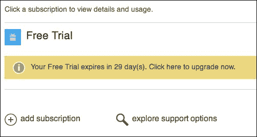

你可以点击页面右上角的**门户**链接来访问你的账户。将来，你可以在[`manage.windowsazure.com`](http://manage.windowsazure.com)管理你的 Azure 服务。

完成 Windows Azure 之旅，快速了解管理门户的功能。然后你可以访问主菜单来创建新的 Azure 服务、虚拟机等。主菜单看起来类似于以下截图：

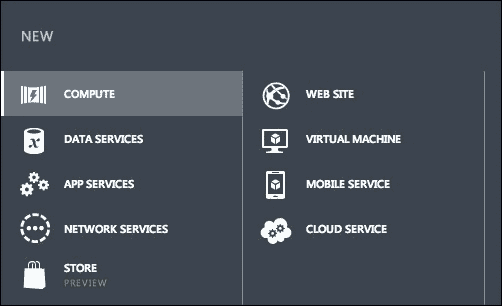

这就完成了 Windows Azure 的注册过程。与苹果和 Google Play 开发者程序相比，这相当简单。请随意尝试，但不必过于担心花钱。Azure 的大多数服务都有免费版本，并且还免费提供一定量的带宽。你可以在[`windowsazure.com/en-us/pricing/overview`](http://windowsazure.com/en-us/pricing/overview)了解更多有关定价的信息。

注意，关于 Windows Azure 昂贵的误解有很多。你可以在免费层上完成所有应用程序的开发，而不需要花费一分钱。当将应用程序投入生产时，你可以轻松地根据需要增加或减少虚拟机实例的数量，以控制成本。一般来说，如果你用户不多，你不会花很多钱。同样，如果你有很多用户，你应该能赚很多收入。

# 探索 Azure 移动服务

对于 XamChat 的服务器端，我们将使用 Azure 移动服务为应用程序提供后端存储。移动服务是加速提供数据存储和基于**REST**的 API 的移动应用开发的便捷解决方案，这是一种基于标准的通过 HTTP 与网络服务通信的方式。Azure 移动服务还包括一个.NET 客户端库，用于从 C#与该服务交互。

Azure 移动服务的一些不错特性如下：

+   使用 SQL Azure 或其他 Azure 数据服务（如 Blob 或 Table 存储）在云中存储数据

+   使用 Windows Live ID、Facebook、Google 和 Twitter 进行简单认证

+   支持 iOS、Android 和 Windows 设备的推送通知

+   使用 JavaScript 和 Node.js 或 C#编写服务器端代码

+   一个易于使用的.NET 客户端开发库

+   将 Azure 移动服务扩展以适应大量数据

您可以看到为什么使用 Azure 是简单移动应用的一个好选择。加速开发和它提供的众多功能非常适合我们的 XamChat 示例应用。

让我们导航到[`manage.windowsazure.com`](http://manage.windowsazure.com)并执行以下步骤以创建移动服务：

1.  点击窗口左下角的加号按钮。

1.  通过菜单导航到**计算** | **移动服务** | **创建**。

1.  输入您选择的域名 URL，例如`yourname-xamchat`。

1.  我们目前使用的是免费数据库选项。

1.  在**区域**下拉菜单中选择您所在位置附近的数据中心。

1.  对于**后端**下拉菜单，为了这本书，请将选择保留在**JavaScript**上。由于我们更关注客户端，设置后端将更加简单。您也可以使用 C#作为替代，但请注意，本书中的示例将使用 JavaScript 编写。

1.  现在，点击**下一步**。

1.  使用默认的数据库名称并选择**新建 SQL 数据库服务器**。

1.  输入 SQL 服务器的登录名和密码，并确保将此信息保存在安全的地方。

1.  确保区域与您的移动服务相同，以确保移动服务和其数据库之间良好的性能。

1.  检查您的最终设置并点击**完成**按钮。

管理门户将显示进度，创建您的移动服务和 SQL 服务器实例将需要几秒钟。请记住，Azure 正在为您在幕后创建和启动新的虚拟机，因此它确实在为您的要求做大量工作。

完成后，您的账户将除了包含在所有账户中的**默认目录**外，还将有一个**移动服务**和一个**SQL 数据库**，如下面的截图所示：

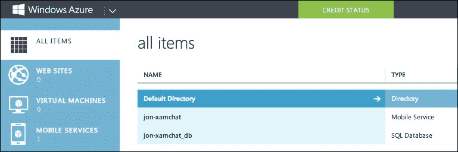

如果你查看移动服务的 **缩放** 选项卡，你会注意到它默认运行在 **免费** 层级。这是一个很好的开发场所。在撰写本书时，它可以容纳 500 个设备。当你将应用程序部署到生产环境时，你可能需要考虑 **基本** 或 **标准** 层级，这些层级也为你提供了添加多个实例的选项。

# 创建表格和脚本

在 Azure 移动服务中实现某项功能的第一步是创建一个新的表格。默认情况下，Azure 移动服务使用其 SQL 数据库的 **动态模式** 功能。当你从客户端插入一行时，新列会动态地添加到表格中。这可以防止你需要手动创建数据库模式，并且是一种整洁的代码优先的方法来开发你的后端数据库。你始终可以手动连接到 SQL 数据库来微调事物或手动更改模式。

返回管理门户，选择你的移动服务实例，并执行以下步骤：

1.  点击 **数据** 选项卡。

1.  点击页面底部中央的 **创建** 按钮。

1.  将表格名称输入为 `User`。

1.  将其他所有设置保留为默认值，然后点击 **保存** 按钮。

1.  重复此过程创建另外三个名为 `Friend`、`Message` 和 `Conversation` 的表格。

现在我们已经有了四个表格，我们需要创建一个脚本来简化我们应用用户的登录过程。Azure 移动服务允许你通过创建在 Node.js 中运行的脚本（Node.js 是一个用于开发带有 JavaScript 的网络服务的框架）来向你的表格添加自定义逻辑。你可以覆盖在 `insert`、`read`、`update` 或 `delete` 操作期间每个表格所发生的事情。此外，如果你需要其他功能，你还可以创建完全定制的脚本。

点击 `User` 表格，然后点击 **脚本** 选项卡。确保你正在查看 `insert` 操作。默认情况下，你的脚本将非常简单，如下面的代码片段所示：

```cs
function insert(item, user, request) {

  request.execute();

}
```

Azure 移动服务中的脚本有三个参数，具体如下：

+   `item`：此参数是客户端发送到服务的对象。在我们的案例中，它将是我们在前几章中创建的 `User` 对象。

+   `user`：此参数包含有关已认证用户的信息。在我们的示例中我们不会使用它。

+   `request`：此参数是一个对象，用于运行 `table` 操作并向客户端发送响应。调用 `execute` 将完成操作并向客户端返回成功响应。

我们需要修改前面的脚本，以确保只有当新用户不存在时才插入新用户。如果用户已存在，我们需要确保密码与用户名匹配。让我们对脚本进行一些修改，如下面的代码行所示：

```cs
function insert(item, user, request) { 
  var users = tables.getTable('user');
  users.where({ username : item.Username }).read({
    success: function(results) {
      if (results.length == 0) {
        //This is a new user
        request.execute();
      }
      else {
        var user = results[0];
        if (item.Password == user.Password) {
          request.respond(statusCodes.OK, user);
        }
        else {
        request.respond(statusCodes.UNAUTHORIZED, "Incorrect username or password");
        }
      }
    }
  });
}
```

让我们总结一下前面 JavaScript 中所做的工作：

1.  首先，我们获取了 `user` 表。请注意，您可以使用小写来引用表名。

1.  接下来，我们运行了一个查询来使用 `where` 函数提取任何现有的用户。我们使用了 `item.Username`，因为这与我们的 C# 中的 `User` 对象相匹配。注意这个方法与 C# 中的 `Linq` 类似。

1.  如果没有结果，我们让请求正常执行。

1.  否则，我们比较密码，如果匹配则返回 `statusCodes.OK`。

1.  如果密码不匹配，我们返回 `statusCodes.UNAUTHORIZED`。这将导致客户端收到错误。

1.  要获取可用函数和方法的完整列表，请确保查看 MSDN 上的服务器脚本参考 [`tinyurl.com/AzureMobileServices`](http://tinyurl.com/AzureMobileServices)。

从这里，只需确保点击 **保存** 按钮以应用您的更改。Azure 移动服务还提供了通过 **Git** 提供脚本源代码控制选项。如果您想在本地的首选编辑器中而不是网站编辑器中更改脚本，请充分利用此功能。

然后，我们需要创建一个额外的脚本。本书早期实现的 XamChat 允许用户通过输入朋友的用户名来添加朋友。因此，为了将数据插入到 `Friend` 表中，我们需要修改 `insert` 脚本来通过用户名查找用户。

让我们按照以下方式修改 `Friends` 表的 `insert` 脚本：

```cs
function insert(item, user, request) { 
  var users = tables.getTable('user');
  users.where({ username : item.Username }).read({
    success: function(results) {
      if (results.length === 0) {
        //Could not find the user
        request.respond(statusCodes.NOT_FOUND, "User not found");
      }
      else {
        var existingUser = results[0];
        item.UserId = existingUser.id;
        request.execute();
      }
    }
  });
}
```

这与之前我们所做的是非常相似的；我们运行了一个简单的查询来根据 `Username` 值加载 `user` 表。我们只需在执行请求之前在新的 `friend` 表上设置 `UserId` 值。

# 为 XamChat 添加后端

服务器端更改完成后，下一步是在我们的 XamChat iOS 和 Android 应用程序中实现我们的新服务。幸运的是，因为我们使用了一个名为 `IWebService` 的接口，所以我们只需实现这个接口就可以在我们的应用程序中使其工作。

现在，我们可以通过执行以下步骤在我们的 iOS 应用程序中开始设置我们的服务：

1.  打开我们在 第四章 中创建的 `XamChat.Core` 项目，*XamChat – 一个跨平台应用*。

1.  在项目中创建一个 `Azure` 文件夹。

1.  创建一个名为 `AzureWebService.cs` 的新类。

1.  创建一个 `public` 类并实现 `IWebService`。

1.  在您的代码中右键点击 `IWebService` 并导航到 **重构** | **实现接口**。

1.  将出现一行；按 *Enter* 插入方法占位符。

当此设置完成时，您的类将类似于以下内容：

```cs
public class AzureWebService : IWebService
{
  #region IWebService implementation

  public Task<User> Login(string username, string password)
  {
    throw new NotImplementedException();
  }

  // -- More methods here -- 

  #endregion
}
```

## 添加 Azure 移动服务 NuGet 包

为了使使用 Azure 移动服务开发变得更加容易，我们需要添加对 .NET 客户端库的引用。为此，我们将使用 NuGet 来添加库：

1.  右键点击 `XamChat.Core` 项目并导航到 **添加** | **添加包**。

1.  使用搜索框搜索`Azure Mobile Services`。

1.  选择`Azure Mobile Services`包，在撰写本书时，该包的版本为 1.2.5。

1.  点击**添加包**。

1.  对于`XamChat.iOS`和`XamChat.Android`项目，重复此过程。每个平台都有一些特定平台的设置。

### 小贴士

如果你喜欢，你也可以从 Xamarin 组件商店获取 Azure 移动服务库。它与使用 NuGet 非常相似。

这将下载库并自动将其添加到你的项目中。NuGet 包管理器可能会发出警告，这些警告可以忽略。NuGet 最初是为 Windows 上的 Visual Studio 开发的，因此包含 PowerShell 脚本或要求许可协议的任何包可能会发出警告。

现在，让我们修改我们的`AzureWebService.cs`文件。将`using Microsoft.WindowsAzure.MobileServices`添加到文件顶部，然后进行以下更改：

```cs
public class AzureWebService : IWebService
{
  MobileServiceClient client = new MobileServiceClient("https://your-service-name.azure-mobile.net/", "your-application-key");

  // -- Existing code here --
}
```

确保你填写了你的移动服务名称和应用密钥。你可以在 Azure 管理门户的**仪表板**选项卡下的**管理密钥**部分找到你的密钥。

现在，让我们以下述方式实现我们的第一个方法`Login`：

```cs
public async Task<User> Login(string username, string password)
{
  var user = new User 
  {
    Username = username, 
    Password = password 
  };
  await client.GetTable<User>().InsertAsync(user);
  return user;
}
```

这相当简单，因为这款库的使用非常方便。`GetTable<T>`方法知道如何根据 C#类名使用名为`User`的表。在第一次调用时，动态模式功能将根据我们类的 C#属性创建两个新列，分别命名为`Username`和`Password`。请注意，`InsertAsync`方法还将填充用户的`Id`属性，以便在应用程序中稍后使用，因为我们将在对移动服务的未来调用中需要`Id`。

接下来，打开`AppDelegate.cs`文件来设置我们的新服务并添加以下代码：

```cs
//Replace this line
ServiceContainer.Register<IWebService>(() => new FakeWebService());

//With this line
ServiceContainer.Register<IWebService>(() => new AzureWebService());
```

此外，你还需要为 Azure 移动服务添加一些特定平台的设置。将`using Microsoft.WindowsAzure.MobileServices`添加到文件顶部，并在你的`AppDelegate.cs`文件中的`FinishedLaunching`底部添加以下代码行：

```cs
CurrentPlatform.Init();
```

现在，如果你在登录后编译并运行你的应用程序，你的应用程序应该能够成功调用 Azure 移动服务并插入一个新用户。导航到 Azure 管理门户中的 Azure 移动服务的**数据**选项卡，并选择`User`表。你将看到你刚刚插入的用户，如下面的截图所示：

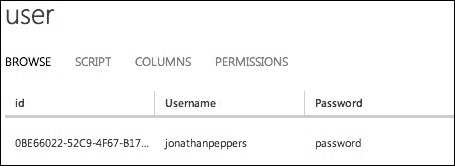

### 注意

通常来说，在数据库中以明文形式存储密码是个坏主意。为了使事情更加安全，可以将它们存储为 MD5 散列。你应该能够在用于在`User`表上插入密码的自定义 JavaScript 中实现这一更改。有关保护 Windows Azure 应用程序的完整指南，请参阅[`msdn.microsoft.com/en-us/library/windowsazure/hh696898.aspx`](http://msdn.microsoft.com/en-us/library/windowsazure/hh696898.aspx)。

接下来，让我们创建一个新的类名为 `Friend.cs`。将其添加到紧挨着其他 Azure 特定类的 `Azure` 文件夹中，如下所示：

```cs
public class Friend
{
  public string Id { get; set; }
  public string MyId { get; set; }
  public string UserId { get; set; }
  public string Username { get; set; }
}
```

我们将使用这个类来存储每个用户的关于朋友的信息。请注意，我们还有一个 `Id` 属性，并且所有保存在 Azure 移动服务中的类都应该有一个名为 `Id` 的 `string` 属性。这将是 SQL 数据库中的表的主键。

接下来，让我们修改 `Message` 和 `Conversation` 类，为未来的推送通知做准备。向 `Message` 类添加一个新属性，如下所示：

```cs
public string ToId { get; set; }
```

然后，向 `Conversation.cs` 添加以下新属性：

```cs
public string MyId { get; set; }
```

在这里，我们需要为应用程序插入或生成一些测试数据，以便它能够正确运行。最简单的方法是从 C#中插入数据，所以让我们在我们的服务中实现以下简单方法来完成此操作：

```cs
public async Task LoadData()
{
  var users = client.GetTable<User>();
  var friends = client.GetTable<Friend>();

  var me = new User
  {
    Username = "jonathanpeppers",
    Password = "password"
  };
  var friend = new User
  {
    Username = "chucknorris",
    Password = "password"
  };
  await users.InsertAsync(me);
  await users.InsertAsync(friend);
  await friends.InsertAsync(new Friend { MyId = me.Id, Username = friend.Username });
  await friends.InsertAsync(new Friend { MyId = friend.Id, Username = me.Username });
}
```

接下来，让我们向 `AppDelegate.cs` 添加以下方法，并在 `FinishedLaunching` 中调用它：

```cs
private async void LoadData()
{
  var service = ServiceContainer.Resolve<IWebService>() as AzureWebService;
  await service.LoadData();
}
```

如果你在此时运行你的应用程序，它将插入两个用户并使他们彼此成为朋友。在这样做之前，让我们向 `AzureWebService.cs` 中的 `LoadData` 方法添加一些代码，以便插入对话和消息，如下所示：

```cs
var conversations = client.GetTable<Conversation>();
var messages = client.GetTable<Message>();

var conversation = new Conversation
{
  MyId = me.Id,
  UserId = friend.Id,
  Username = friend.Username,
  LastMessage = "HEY!"
};
await conversations.InsertAsync(conversation);
await messages.InsertAsync(new Message { 
  ConversationId = conversation.Id, 
  ToId = me.Id,
  UserId = friend.Id, Username = friend.Username, 
  Text = "What's up?", Date = DateTime.Now.AddSeconds(-60)
});
await messages.InsertAsync(new Message { 
  ConversationId = conversation.Id, 
  ToId = friend.Id,
  UserId = me.Id, Username = me.Username, 
  Text = "Not much", Date = DateTime.Now.AddSeconds(-30)
});
await messages.InsertAsync(new Message { 
  ConversationId = conversation.Id, 
  ToId = me.Id,
  UserId = friend.Id, Username = friend.Username, 
  Text = "HEY!", Date = DateTime.Now
});
```

现在，如果你运行应用程序，它将使用一些良好的数据来初始化数据库。我建议你在第一次成功调用 `LoadData` 后删除对该方法的调用，也许在开发完成后完全删除该方法。

在继续之前，让我们实现 `IWebService` 接口的其余部分。它可以如下完成：

```cs
public async Task<User> Register(User user)
{
  await client.GetTable<User>().InsertAsync(user);
  return user;
}
public async Task<User[]> GetFriends(string userId)
{
  var list = await client.GetTable<Friend>().Where(f => f.MyId == userId).ToListAsync();
  return list.Select(f => new User { Id = f.UserId, Username = f.Username }).ToArray();
}
public async Task<User> AddFriend( string userId, string username)
{
  var friend = new Friend { MyId = userId, Username = username };
  await client.GetTable<Friend>().InsertAsync(friend);
  return new User { Id = friend.UserId, Username = friend.Username };
}
```

这里每个方法都很简单。`Register` 与 `Login` 非常相似，但其他方法的主要复杂之处在于需要将 `Friend` 对象转换为 `User`。我们使用了 Azure 库中的 `ToListAsync` 方法来获取 `List<T>`；然而，由于我们的接口使用数组，我们很快将列表转换为数组。我们还利用了几个基本的 `Linq` 操作符，如 `Where` 和 `Select`，来完成我们对 `IWebService` 的实现。

现在，让我们完成与对话和消息相关的其他方法，如下所示：

```cs
public async Task<Conversation[]> GetConversations(string userId)
{
  var list = await client.GetTable<Conversation>().Where(c => c.MyId == userId).ToListAsync();
  return list.ToArray();
}
public async Task<Message[]> GetMessages(string conversationId)
{
  var list = await client.GetTable<Message>().Where(m => m.ConversationId == conversationId).ToListAsync();
  return list.ToArray();
}
public async Task<Message> SendMessage(Message message)
{
  await client.GetTable<Message>().InsertAsync(message);
  return message;
}
```

这就完成了我们对 `IWebService` 的实现。如果你在这个时候运行应用程序，它将像以前一样工作，唯一的区别是应用程序实际上是在与一个真实的 Web 服务器进行通信。新消息将被持久化到 SQL 数据库中，我们的自定义脚本将处理我们需要的自定义逻辑。请随意尝试我们的实现；你可能会发现一些与 Azure 移动服务配合得很好的功能，这些功能可以应用于你自己的应用程序。

在这一点上，另一个很好的练习是在我们的 Android 应用程序中设置 Azure 移动服务。为此，您只需添加 Azure 移动服务 NuGet 包。之后，您应该能够在`Application`类中的`ServiceContainer.Register`调用中替换，并调用`CurrentPlatform.Init()`。一切都将与 iOS 上完全一样。跨平台开发不是很好吗？

# 使用 Apple 推送通知服务

在 iOS 上使用 Azure 移动服务实现推送通知非常简单，从 Azure 后端的角度来看。最复杂的部分是处理 Apple 的创建证书和配置文件的过程，以便配置您的 iOS 应用程序。在我们继续之前，请确保您有一个有效的 iOS 开发者计划帐户，因为没有它，您将无法发送推送通知。如果您不熟悉推送通知的概念，请查看 Apple 的文档[`tinyurl.com/XamarinAPNS`](http://tinyurl.com/XamarinAPNS)。

要发送推送通知，您需要设置以下内容：

+   已在 Apple 注册的显式 App ID

+   针对该 App ID 的配置文件

+   为您的服务器触发推送通知的证书

Apple 提供了开发和生产证书，您可以使用它们从您的服务器发送推送通知。

## 设置正确的配置文件

让我们从导航到[`developer.apple.com/account`](http://developer.apple.com/account)并执行以下步骤开始：

1.  点击**标识符**链接。

1.  点击窗口右上角的加号按钮。

1.  为捆绑 ID 输入一个描述，例如`XamChat`。

1.  在**显式 App ID**部分下输入您的捆绑 ID。这应该与您在`Info.plist`文件中设置的捆绑 ID 相匹配，例如，`com.yourcompanyname.xamchat`。

1.  在**App Services**下，确保您已勾选**推送通知**。

1.  现在，点击**继续**。

1.  检查您的最终设置并点击**提交**。

这将创建一个类似于以下截图中的显式 App ID，我们可以用它来发送推送通知：

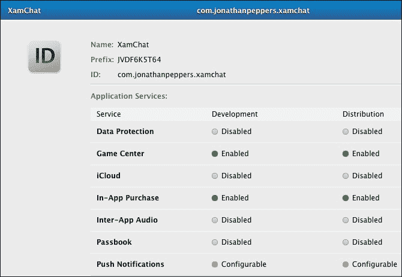

## 设置您的配置文件

对于推送通知，我们必须使用一个具有显式 App ID 的配置文件，该 App ID 不是开发证书。现在让我们设置一个配置文件：

1.  在右侧面板下点击**配置文件**下的**开发**链接。

1.  点击窗口右上角的加号按钮。

1.  选择**iOS 应用程序开发**并点击**继续**。

1.  选择我们刚刚创建的 App ID，然后点击**继续**。

1.  选择开发者并点击**继续**。

1.  选择您将使用的设备，然后点击**继续**。

1.  为配置文件输入一个名称并点击**生成**。

1.  下载配置文件并安装，或者打开**XCode**，通过导航到**偏好设置** | **帐户**来使用同步按钮。

完成后，你应该会到达一个类似以下截图的成功网页：

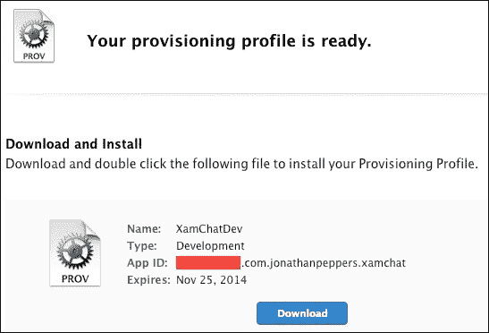

## 设置证书签名请求

然后，我们执行以下步骤来设置服务器需要的证书：

1.  点击右侧面板中的**证书**下的**开发**链接。

1.  点击右上角的加号按钮。

1.  启用**Apple Push Notifications 服务 SSL (沙盒)**并点击**继续**。

1.  如前所述，选择你的 App ID，然后点击**继续**。

1.  根据苹果的说明创建一个新的证书签名请求。你也可以参考第七章, *在设备上部署和测试*，或者定位到`*.certSigningRequest`文件。

1.  接下来，点击**继续**。

1.  上传签名请求文件并点击**生成**。

1.  接下来，点击**下载**。

1.  打开文件以将证书导入到**钥匙串**。

1.  在**钥匙串**中找到证书。它将被命名为**Apple Development iOS Push Services**，并包含你的 bundle ID。

1.  右键单击证书，将其导出到你的文件系统中的某个位置。输入一个你将记住的密码。

这将创建我们需要的证书，以便从 Azure Mobile Services 向我们的用户发送推送通知。剩下的只是返回到 Azure 管理门户，并在**Apple Push Notification Settings**下的**推送**选项卡中上传证书，如图所示：

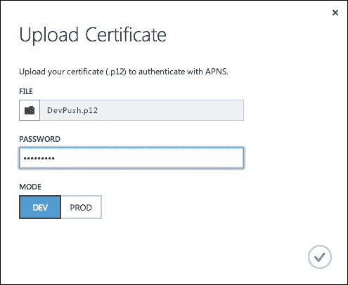

这次上传完成了我们从苹果方面需要的配置。

## 为推送通知进行客户端更改

接下来，让我们回到 Xamarin Studio 中的我们的`XamChat.iOS`项目，对客户端进行必要的推送通知更改。我们首先需要向共享代码中添加几个新类。

打开`IWebService.cs`并添加以下新方法：

```cs
Task RegisterPush(string userId, string deviceToken);
```

接下来，让我们在`FakeWebService.cs`中实现这个方法（只是为了编译），如下所示：

```cs
public async Task RegisterPush(string userId, string deviceToken)
{
  await Sleep();
}
```

现在，让我们在`Core`/`Azure`文件夹中添加一个名为`Device.cs`的新类：

```cs
public class Device
{
  public string Id { get; set;}
  public string UserId { get; set; }
  public string DeviceToken { get; set; }
}
```

最后，我们可以在`AzureWebService.cs`中实现实际的方法，如下所示：

```cs
public async Task RegisterPush( string userId, string deviceToken)
{
  await client.GetTable<Device>().InsertAsync(new Device {
      UserId = userId,
      DeviceToken = deviceToken
    });
}
```

对于 ViewModels，我们需要在`LoginViewModel.cs`中添加一个额外的新的方法：

```cs
public async Task RegisterPush(string deviceToken)
{
  if (settings.User == null)
    throw new Exception("User is null");
  await service.RegisterPush(settings.User.Id, deviceToken);
}
```

然后，我们需要对`MessageViewModel.cs`进行一个小修改。在`SendMessage`方法中创建新的`Message`对象时，添加以下行：

```cs
ToId = Conversation.UserId,
```

这个修改完成了我们需要添加到共享代码中的内容。当我们添加推送通知到 Android 时，我们将重用这个新功能，所以请花时间在你的`XamChat.Droid`项目中链接新的`Device.cs`文件以构建整个解决方案。

现在，让我们添加我们需要的 iOS 平台特定代码。将以下方法添加到你的`AppDelegate.cs`文件中：

```cs
public async override void RegisteredForRemoteNotifications(UIApplication application, NSData deviceToken)
{
  var loginViewModel = ServiceContainer.Resolve<LoginViewModel>();
  try
  {
    string token = deviceToken.Description;
    token = token.Substring(1, token.Length - 2);
    await loginViewModel.RegisterPush(token);
  }
  catch (Exception exc)
  {
    Console.WriteLine("Error registering push: " + exc);
  }
}
public override void FailedToRegisterForRemoteNotifications(UIApplication application, NSError error)
{
  Console.WriteLine("Error registering push: " + error.LocalizedDescription);
}
```

```cs
RegisteredForRemoteNotifications will occur when Apple successfully returns a device token from its servers. It is returned within angle brackets, so we do a little work to trim those off and pass the device token through LoginViewModel to Azure Mobile Services. We also implemented FailedToRegisterForRemoteNotifications just to report any errors that might occur throughout the process.
```

最后一件要做的事情是实际调用以注册远程通知。打开`LoginController.cs`文件，并在登录成功调用后直接添加以下代码行：

```cs
UIApplication.SharedApplication.RegisterForRemoteNotificationTypes( 
UIRemoteNotificationType.Alert | 
UIRemoteNotificationType.Badge | 
UIRemoteNotificationType.Sound);
```

您也可以在启动时调用该方法；然而，在我们的情况下，我们需要一个有效的用户 ID 来存储在 Azure 的`Device`表中。

现在，让我们切换到 Azure 管理门户，并在服务器端使用 JavaScript 进行剩余的更改。在**数据**选项卡下，创建一个名为`Device`的新表，使用默认设置。

接下来，我们需要修改`insert`脚本，以确保不会插入重复的设备令牌：

```cs
function insert(item, user, request)
{
  var devicesTable = tables.getTable('device');
  devicesTable.where({ userId: item.UserId, deviceToken: item.DeviceToken }).read({ success: function (devices)
    {
      if (devices.length > 0)
      {
        request.respond(200, devices[0]);
      }
      else
      {
        request.execute();
      }
    }
  });
}
```

最后但同样重要的是，我们需要修改`Message`表的`insert`脚本，以便向用户发送推送通知。消息发送如下：

```cs
function insert(item, user, request) {
  request.execute();
  var devicesTable = tables.getTable('device');
  devicesTable.where({ userId : item.ToId }).read({
    success: function(devices) {
      devices.forEach(function(device) {
        var text = item.Username + ": " + item.Text;
        push.apns.send(device.DeviceToken, {
          alert: text,
          badge: 1,
          payload: {
            message: text
          }
        });
      });
    }
  });
}
```

执行请求后，我们从数据库中检索设备列表，并为每个设备发送推送通知。为了测试推送通知，部署应用程序，并使用辅助用户（如果使用我们的示例：`chucknorris`）登录。登录后，您只需使用主页按钮将应用程序置于后台。接下来，在 iOS 模拟器上使用主要用户登录并发送消息。您应该会收到推送通知，如下面的截图所示：

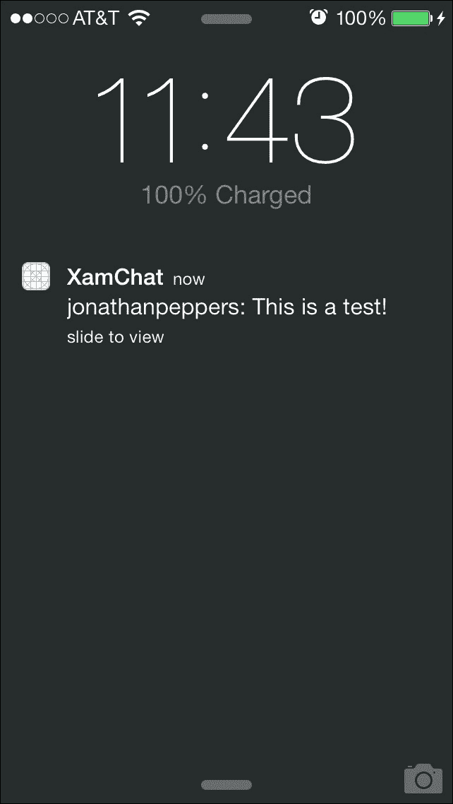

# 实现 Google Cloud Messaging

由于我们已经在共享代码和 Azure 上设置了所需的所有内容，因此在此阶段设置 Android 的推送通知将变得工作量大大减少。要继续，您需要一个带有验证电子邮件地址的 Google 账户；然而，如果您有的话，我建议您使用注册了**Google Play**的账户。您可以参考关于**Google Cloud Messaging**（**GCM**）的完整文档，网址为[`developer.android.com/google/gcm`](http://developer.android.com/google/gcm)。

### 注意

注意，Google Cloud Messaging 要求在 Android 设备上安装 Google Play，并且 Android 操作系统至少为 2.2 版本。

让我们从导航到[`cloud.google.com/console`](http://cloud.google.com/console)并执行以下步骤开始：

1.  点击**创建项目**按钮。

1.  输入一个适当的项目名称，例如`XamChat`。

1.  输入一个项目 ID；您可以使用生成的 ID。我更喜欢使用我的应用程序的 bundle ID，并用连字符替换点。

1.  同意**服务条款**。

1.  点击**创建**按钮。

1.  当创建您的第一个项目时，您可能需要验证与您的账户关联的移动电话号码。

1.  注意**项目编号**字段在**概览**页面。我们稍后会需要这个编号。

以下截图显示了**概览**选项卡：

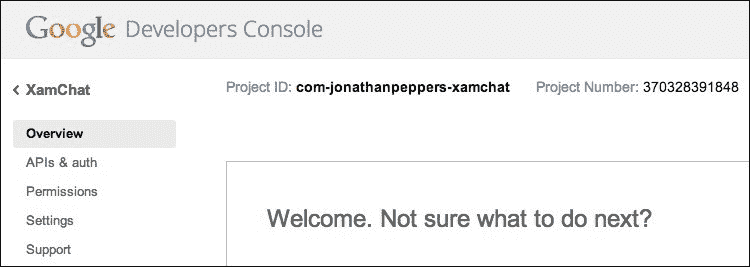

现在我们可以继续以下设置：

1.  点击左侧面板中的**APIs & auth**。

1.  滚动并点击**Google Cloud Messaging for Android**。

1.  点击顶部的**关闭**按钮以启用服务。您可能需要接受另一项协议。

1.  点击左侧面板中的**已注册应用**。

1.  点击顶部的**注册应用**按钮。

1.  在**应用名称**字段中输入 `XamChat` 并点击**注册**。您可以将**平台**选择保留在默认的**Web 应用程序**。

1.  展开**服务器密钥**部分，并将**API 密钥**值复制到您的剪贴板。

1.  切换到 Azure 管理门户，并导航到您的 Azure 移动服务实例中的**推送**选项卡。

1.  在**google cloud messaging 设置**部分粘贴 API 密钥并点击**保存**。

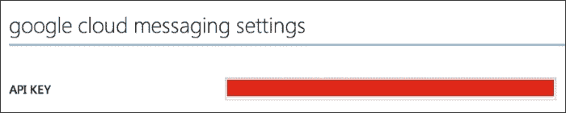

接下来，让我们修改我们的 `insert` 脚本以支持 Android，如下所示：

```cs
function insert(item, user, request) {
  request.execute();
  var devicesTable = tables.getTable('device');
  devicesTable.where({ userId : item.ToId }).read({
    success: function(devices) {
      devices.forEach(function(device) {
        if (device.DeviceToken.length > 72) {
          push.gcm.send(device.DeviceToken, {
            title: item.Username, 
            message: item.Text, 
          });
        }
        else {
          var text = item.Username + ": " + item.Text;
          push.apns.send(device.DeviceToken, {
            alert: text,
            badge: 1,
            payload: {
              message: text
            }
          });
        }
      });
    }
  });
}
```

基本上，我们将超过 72 个字符的任何 `deviceToken` 值发送到 GCM。这是做这件事的一种简单方法，但您也可以向 `Device` 表中添加一个值，以指示设备是 Android 还是 iOS。GCM 还支持在通知区域发送自定义值，因此我们发送实际标题和消息。

这就完成了我们在 Azure 侧的设置。在 Android 应用程序中设置下一部分可能有点困难，因此我们将使用名为 **PushSharp** 的库来简化我们的实现。

首先，导航到 [`github.com/Redth/PushSharp`](http://github.com/Redth/PushSharp) 并执行以下步骤：

1.  下载项目并将其放置在与您的 XamChat 解决方案相同的文件夹中。

1.  将 `PushSharp.Client.MonoForAndroid.Gcm` 项目添加到您的解决方案中。您可以在 `PushSharp.Client` 子目录中找到该项目。

1.  从您的 `XamChat.Droid` 项目引用新的项目。

1.  如果尚未安装，您需要为 Android 2.2（API 8）安装**Android SDK 平台**。您可以从 Xamarin Studio 的**工具**菜单中启动的 Android SDK 管理器中安装此软件。

接下来，创建一个名为 `PushConstants.cs` 的新类，如下所示：

```cs
public static class PushConstants
{
  public const string BundleId = "your-bundle-id";
  public const string ProjectNumber = "your-project-number";
}
```

在 `BundleId` 值中填写您应用程序的包 ID，并在 `ProjectNumber` 值中填写在 Google Cloud Console 的**概览**页面找到的项目编号。

接下来，我们需要设置一些权限以支持我们应用程序中的推送通知。在此文件中的命名空间声明上方添加以下内容：

```cs
[assembly: Permission(
  Name = XamChat.Droid.PushConstants.BundleId + 
  ".permission.C2D_MESSAGE")]
[assembly: UsesPermission(
  Name = XamChat.Droid.PushConstants.BundleId + 
  ".permission.C2D_MESSAGE")]
[assembly: UsesPermission(
  Name = "com.google.android.c2dm.permission.RECEIVE")]
[assembly: UsesPermission(
  Name = "android.permission.GET_ACCOUNTS")]
[assembly: UsesPermission(
  Name = "android.permission.INTERNET")]
[assembly: UsesPermission(
  Name = "android.permission.WAKE_LOCK")]

```

您也可以在我们的 `AndroidManifest.xml` 文件中做出这些更改；然而，使用 C# 属性可能更好，因为它在键入时提供了代码自动完成的特性。

接下来，创建另一个名为 `PushReceiver.cs` 的新类，如下所示：

```cs
[BroadcastReceiver(
  Permission = GCMConstants.PERMISSION_GCM_INTENTS)]
[IntentFilter(
  new string[] { GCMConstants.INTENT_FROM_GCM_MESSAGE }, 
  Categories = new string[] { PushConstants.BundleId })]
[IntentFilter(
  new string[] { 
  GCMConstants.INTENT_FROM_GCM_REGISTRATION_CALLBACK }, 
  Categories = new string[] { PushConstants.BundleId })]
[IntentFilter(
  new string[] { 
  GCMConstants.INTENT_FROM_GCM_LIBRARY_RETRY }, 
  Categories = new string[] { PushConstants.BundleId })]
public class PushReceiver :
  PushHandlerBroadcastReceiverBase<PushHandlerService>
{ }

```

`PushReceiver.cs` 类设置了 `BroadcastReceiver`，这是 Android 中不同应用程序之间通信的本地方式。有关此主题的更多信息，请参阅 Android 文档中的 [`developer.android.com/reference/android/content/BroadcastReceiver.html`](http://developer.android.com/reference/android/content/BroadcastReceiver.html)。

接下来，创建一个名为 `PushService.cs` 的最后一个类，如下所示：

```cs
[Service]
public class PushHandlerService : PushHandlerServiceBase
{
  public PushHandlerService() : base (PushConstants.ProjectNumber) 
  { }
}
```

现在，右键单击 `PushHandlerServiceBase` 并导航到 **重构** | **实现抽象成员**。接下来，让我们逐个实现每个成员：

```cs
protected async override void OnRegistered (Context context, string registrationId)
{
  Console.WriteLine("Push successfully registered!");
  var loginViewModel = ServiceContainer.Resolve<LoginViewModel>();
  try
  {
    await loginViewModel.RegisterPush(registrationId);
  }
  catch (Exception exc)
  {
    Console.WriteLine("Error registering push: " + exc);
  }
}
```

上述代码与我们之前在 iOS 上所做的是非常相似的。我们只需将 `registrationId` 值发送到 `loginViewModel`。

接下来，当收到消息时，我们必须编写以下代码：

```cs
protected override void OnMessage (Context context, Intent intent)
{
  //Pull out the notification details
  string title = intent.Extras.GetString("title");
  string message = intent.Extras.GetString("message");

  //Create a new intent
  intent = new Intent(this, typeof(ConversationsActivity));

  //Create the notification
  var notification = new Notification(Android.Resource.Drawable.SymActionEmail, title);
  notification.Flags = NotificationFlags.AutoCancel;
  notification.SetLatestEventInfo(this, 
    new Java.Lang.String(title), 
    new Java.Lang.String(message), PendingIntent.GetActivity(this, 0, intent, 0));

  //Send the notification through the NotificationManager
  var notificationManager = GetSystemService(Context.NotificationService) as NotificationManager;
  notificationManager.Notify(1, notification);
}
```

这段代码实际上会从通知中提取值，并在 Android 设备的通知中心显示它们。我们使用了内置资源 `SymActionEmail` 来在通知中显示电子邮件图标。

接下来，我们只需要实现两个更多的抽象方法。目前，我们可以简单地使用 `Console.WriteLine` 来报告以下事件：

```cs
protected override void OnUnRegistered(Context context, string registrationId)
{
  Console.WriteLine("Push unregistered!");
}

protected override void OnError (Context context, string errorId)
{
  Console.WriteLine("Push error: " + errorId);
}
```

在将来，当调用 `OnUnRegistered` 时，你应该考虑从 Azure 的 `Device` 表中移除注册信息。偶尔，用户的 `registrationId` 会发生变化，因此这是你的应用程序被通知这一变化的地方。

接下来，打开 `Application.cs` 并将以下行添加到 `OnCreate` 的末尾：

```cs
PushClient.CheckDevice(this);
PushClient.CheckManifest(this);
```

接下来，打开 `LoginActivity.cs` 并在成功登录后添加以下行：

```cs
PushClient.Register(this, PushConstants.ProjectNumber);
```

现在，如果你重复在 iOS 上测试推送通知的步骤，你应该能够向我们的 Android 应用发送推送通知。更好的是，你应该能够跨平台发送推送通知，因为 iOS 用户可以向 Android 用户发送消息。

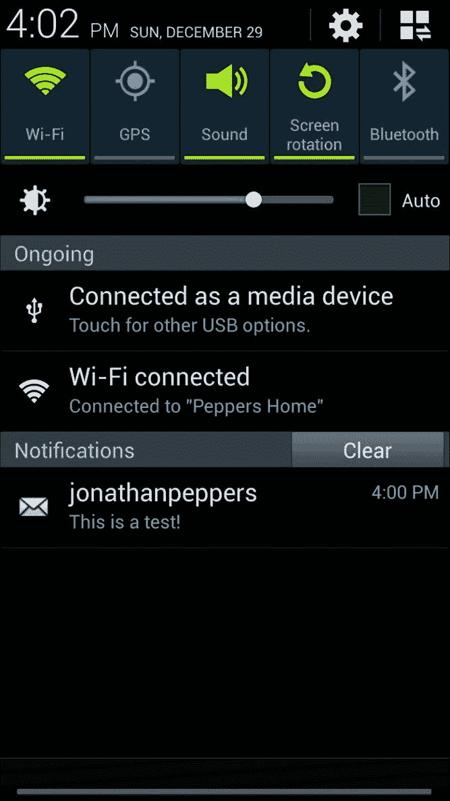

# 摘要

在本章中，我们介绍了 Windows Azure 提供的内容：基础设施即服务和平台即服务。我们设置了一个免费的 Windows Azure 账户并设置了一个 Azure 移动服务实例。接下来，我们创建了所有必要的表来存储我们的数据，并编写了一些脚本将业务逻辑添加到 Web 服务中。我们实现了客户端代码以对 Azure 移动服务进行请求。最后，我们使用 Apple 推送通知服务和 Google 云消息传递为 iOS 和 Android 实现了推送通知。

使用 Azure 移动服务，我们能够避免编写大量的服务器端代码——主要是几个简单的脚本。如果不利用 Azure 的功能来实现推送通知，这将是一项相当具有挑战性的工作。在下一章中，我们将探讨如何使用 Xamarin 与第三方库。这包括从 Xamarin 组件商店到使用原生 Objective-C 或 Java 库的所有内容。
