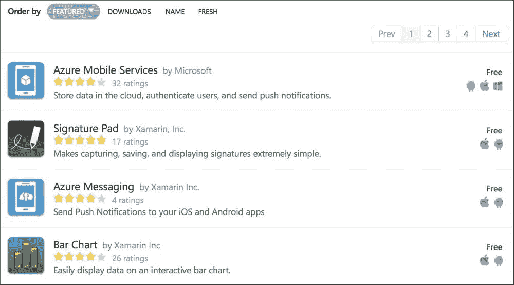
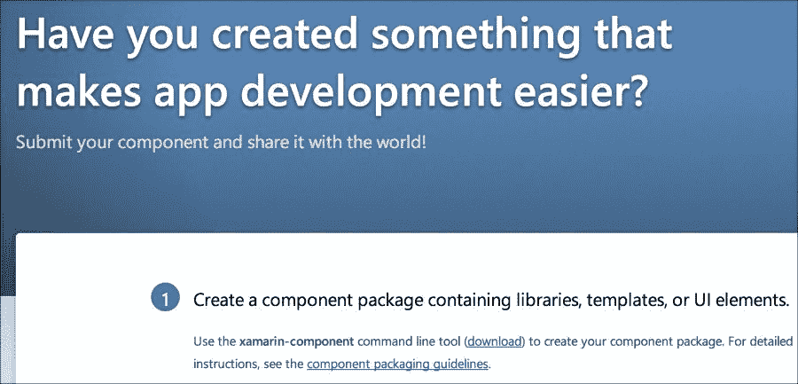
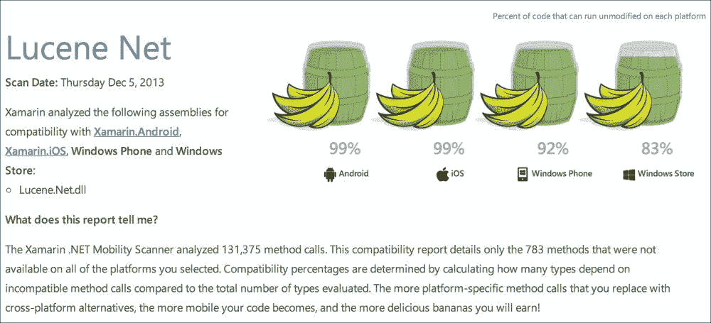
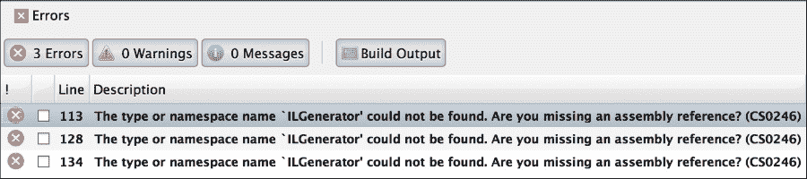
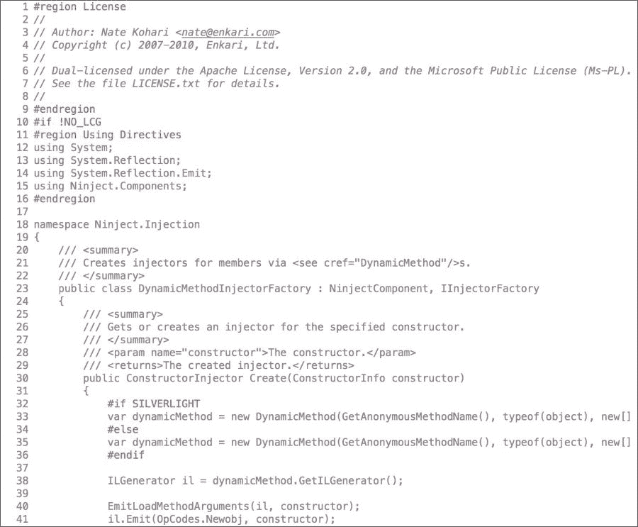
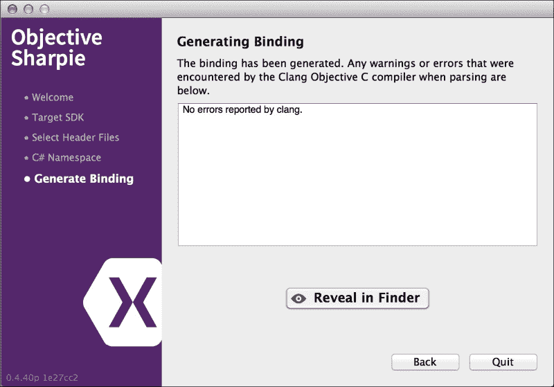
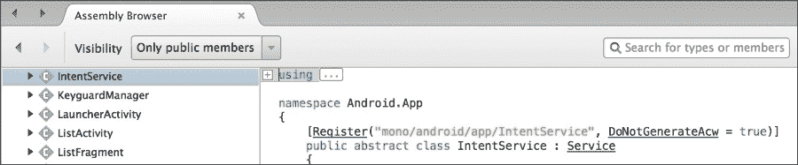

# 第九章. 第三方库

Xamarin 支持.NET 框架的一个子集，但就大部分而言，它包括了您在.NET 基类库中期望的所有标准 API。因此，大量 C#的开源库可以直接在 Xamarin 项目中使用。此外，如果一个开源项目没有 Xamarin 或可移植类库版本，将代码移植到 Xamarin 项目中通常非常直接。Xamarin 还支持调用原生 Objective-C 和 Java 库，因此我们将探讨这些作为重用现有代码的额外手段。

在本章中，我们将介绍以下内容：

+   Xamarin 组件商店

+   NuGet

+   端口现有 C#库

+   Objective-C 绑定

+   Java 绑定

# Xamarin 组件商店

向您的项目添加第三方组件的主要和明显方式是通过 Xamarin 组件商店。组件商店与稍后我们将要介绍的**NuGet**相当类似，但组件商店还包含了一些非免费的付费组件。所有 Xamarin 组件都必须包括完整的示例项目和入门指南，而 NuGet 包本身并不提供文档。

所有`Xamarin.iOS`和`Xamarin.Android`项目都包含一个`Components`文件夹。要开始，只需右键单击文件夹并选择**获取更多组件**以启动商店对话框，如图下截图所示：



在撰写本书时，有超过 200 个组件可供增强您的 iOS 和 Android 应用程序。这是一个寻找在 Xamarin 应用程序中使用最常见组件的好地方。每个组件都附带完整的艺术作品。在购买高级组件之前，您可能需要演示视频、评论和其他信息。

## 最常见的组件

最知名和最有用的组件如下：

+   **Json.NET**: 这是使用 C#解析和序列化 JSON 的事实标准

+   **RestSharp**: 这是一个常用的简单 REST 客户端，用于.NET

+   **SQLite.NET**: 这是一个简单的**对象关系映射**（ORM），用于在移动应用程序中处理本地 SQLite 数据库

+   **Facebook SDK**: 这是 Facebook 提供的标准 SDK，用于将其服务集成到您的应用程序中

+   **Xamarin.Mobile**: 这是一个跨平台库，使用通用 API 访问您的设备联系人、GPS、照片库和相机

+   **ActionBarSherlock**: 这是一个强大的 Android `ActionBar`替代品

注意，其中一些库是原生 Java 或 Objective-C 库，而另一些则是纯 C#。Xamarin 从头开始构建以支持调用原生库，因此组件商店提供了许多 Objective-C 或 Java 开发者在开发移动应用程序时可能会使用的常见库。

你还可以将你自己的组件提交到组件商店。如果你有一个有用的开源项目或者只是想赚一些额外的钱，创建一个组件很简单。我们不会在本书中介绍它，但你可以在[`components.xamarin.com/submit`](http://components.xamarin.com/submit)找到有关此主题的完整文档，如下面的截图所示：



# 端口现有 C#库

尽管 Xamarin 正变得越来越受欢迎，但许多开源.NET 库在支持`Xamarin.iOS`和`Xamarin.Android`方面显然还跟不上。然而，在这些情况下，你绝对不会失望。通常，如果库有 Silverlight 或 Windows Phone 版本，你只需创建一个 iOS 或 Android 类库，并添加文件，无需进行代码更改。

为了帮助这个过程，Xamarin 创建了一个在线服务工具，用于扫描你的现有代码并确定库距离可移植性的程度。导航到[`scan.xamarin.com`](http://scan.xamarin.com)，上传任何`*.exe`或`*.dll`文件以分析其方法进行跨平台开发。扫描过程完成后，你将获得一个端口百分比报告（你的组件/应用程序可以移植到所有平台：Android、iOS、Windows Phone 和 Windows Store）。

以下截图是**Lucene** .NET 客户端库的示例报告：



如果库的可移植性运行在较高比例，那么将库端口到 Android 或 iOS 应该相对容易。在大多数情况下，将库端口到 Xamarin 甚至可能比 Windows Phone 或 WinRT 更容易。

为了说明这个过程，让我们将一个没有 Xamarin 或可移植类库支持的开放源代码项目进行端口。我选择了一个名为**Ninject**的依赖注入库，因为它很有用，并且与忍者有关。你可以在[`www.ninject.org`](http://www.ninject.org)了解更多关于这个库的信息。

让我们开始设置库以与 Xamarin 项目一起使用，如下所示：

1.  首先，从[`github.com/ninject/Ninject`](https://github.com/ninject/Ninject)下载 Ninject 的源代码。

1.  在 Xamarin Studio 中打开`Ninject.sln`。

1.  添加一个名为`Ninject.iOS`的新**iOS 库项目**。

1.  将`Ninject`主项目中的所有文件链接起来。确保你使用**添加现有文件夹**对话框来加快这个过程。

### 小贴士

如果你不太熟悉 GitHub，我建议你下载位于[`mac.github.com`](http://mac.github.com)的 Mac 桌面客户端。

现在尝试构建`Ninject.iOS`项目；你将在名为`DynamicMethodFactory.cs`的文件中遇到几个编译错误，如下面的截图所示：



打开`DynamicMethodFactory.cs`并注意文件顶部的以下代码：

```cs
#if !NO_LCG
#region Using Directivesusing System;
  using System.Reflection;
  using System.Reflection.Emit;
  using Ninject.Components;
#endregion

/// *** File contents here ***

#endif
```

由于苹果平台限制，无法在 iOS 上使用 `System.Reflection.Emit`。幸运的是，库编写者创建了一个名为 `NO_LCG`（代表**轻量级代码生成**）的预处理器指令，以允许库在不支持 `System.Reflection.Emit` 的平台上运行。

要修复我们的 iOS 项目，请打开项目选项并导航到**构建** | **编译器**部分。在**配置**下拉菜单中，将 `NO_LCG` 添加到**定义符号**字段中的**调试**和**发布**。点击**确定**以保存您的更改。注意，现在整个文件在 Xamarin Studio 中以浅灰色突出显示，如以下截图所示。这意味着代码将不会被编译。



如果你现在编译项目，它将成功完成，并创建一个`Ninject.iOS.dll`文件，你可以从任何`Xamarin.iOS`项目中引用它。你也可以直接引用`Ninject.iOS`项目，而不是使用`*.dll`文件。

在这一点上，你可能希望重复此过程以创建一个`Xamarin.Android`类库项目。幸运的是，`Xamarin.Android`支持`System.Reflection.Emit`，因此如果你愿意，可以跳过添加额外的预处理器指令。

# Objective-C 绑定

Xamarin 开发了一个复杂的系统，可以在 iOS 项目中从 C# 调用原生 Objective-C 库。`Xamarin.iOS` 的核心使用相同的技术调用 **UIKit**、**CoreGraphics** 和其他 iOS 框架中的原生 Apple API。开发者可以创建 iOS 绑定项目，通过简单的接口和属性将 Objective-C 类和方法暴露给 C#。

为了帮助创建 Objective-C 绑定，Xamarin 创建了一个名为 **Objective Sharpie** 的小工具，可以为你处理 Objective-C 头文件，并将有效的 C# 定义导出到绑定项目中。这个工具是大多数绑定的一个很好的起点，它将你的绑定完成到三分之四，在许多情况下，你将需要手动编辑和微调以使其更符合 C#。

例如，我们将为 iOS 的 Google Analytics 库编写一个绑定。这是一个简单而有用的库，可以跟踪你的 iOS 或 Android 应用程序中的用户活动。在撰写本文时，Google Analytics SDK 的版本为 3.10，因此随着新版本的发布，一些这些说明可能会发生变化。

## 使用 Objective Sharpie

首先，从 [`tinyurl.com/ObjectiveSharpie`](http://tinyurl.com/ObjectiveSharpie) 下载并安装 Objective Sharpie，然后执行以下步骤：

1.  下载 iOS 可用的最新 Google Analytics SDK，链接为 [`tinyurl.com/GoogleAnalyticsForiOS`](https://tinyurl.com/GoogleAnalyticsForiOS)。

1.  创建一个名为 `GoogleAnalytics.iOS` 的新 **iOS 绑定项目**。

1.  运行 **Objective Sharpie**。

1.  将 **目标 SDK** 设置为 **iOS 7.1** 并点击 **下一步**。

1.  添加 Google Analytics SDK 中包含的所有头文件（`*.h`）；您可以在下载的`Library`文件夹中找到这些文件。点击**下一步**。

1.  选择一个合适的命名空间，例如`GoogleAnalytics`，然后点击**生成**。

1.  将生成的`ApiDefinition.cs`文件复制到您的 iOS 绑定项目中。

1.  几秒钟后，您的 C#文件将被生成。点击**退出**。

在整个过程中，您不应该从 Objective Sharpie 收到任何错误消息，完成之后，您的屏幕应该看起来像下面的截图：



### 小贴士

在编写这本书的时候，Objective Sharpie 与 Xcode 6.0 及以上版本不兼容。如果您遇到这个问题，我建议您下载 Xcode 5.1.1。您可以通过在 Finder 中重命名现有版本并安装第二个版本来并排安装两个版本的 Xcode。您可以在[`developer.apple.com/downloads/index.action`](https://developer.apple.com/downloads/index.action)找到旧的 Xcode 下载。

现在如果您回到您的绑定项目中，您会注意到 Objective Sharpie 已经为库的头文件中发现的每个类生成了一个接口定义。它还生成了许多库使用的`enum`值，并在可能的情况下更改了大小写和命名约定以更接近 C#。

当您阅读绑定时，您会注意到几个 C#属性，它们定义了 Objective-C 库的不同方面，如下所示：

+   `BaseType`：这声明了一个接口作为 Objective-C 类。将基类（也称为超类）传递给属性。如果没有基类，应使用`NSObject`。

+   `Export`：这声明了一个 Objective-C 类上的方法或属性。传递一个字符串，将 Objective-C 名称映射到 C#名称。Objective-C 方法名称通常以下列形式：`myMethod:someParam:someOtherParam`。

+   `Static`：这标记一个方法或属性在 C#中为`static`。

+   `Bind`：这用于属性，将获取器或设置器映射到不同的 Objective-C 方法。Objective-C 属性可以重命名属性的获取器或设置器。

+   `NullAllowed`：这允许将`null`传递给方法或属性。默认情况下，如果发生这种情况，会抛出异常。

+   `Field`：这声明了一个 Objective-C 字段，在 C#中作为公共变量公开。

+   `Model`：这标识了一个类，让`Xamarin.iOS`有可选项覆盖的方法。这通常用于 Objective-C 的代理。

+   `Internal`：这使用 C#的`internal`关键字标记生成的成员。它可以用来隐藏您不想公开给外部世界的某些成员。

+   `Abstract`：这标识了一个 Objective-C 方法为必需的，与`Model`一起使用。在 C#中，它将生成一个抽象方法。

唯一需要知道的其他规则是如何定义构造函数。由于 C# 接口不支持构造函数，Xamarin 必须发明一个约定。

要定义除了默认构造函数之外的构造函数，请使用以下代码：

```cs
[Export("initWithFrame:")]
IntPtr Constructor(RectangleF frame);
```

这将为类定义一个接受 `RectangleF` 作为参数的构造函数。方法名 `Constructor` 和返回类型 `IntPtr` 会让 Xamarin 编译器生成一个构造函数。

现在，让我们回到我们的绑定项目，完成所有设置。如果你现在编译项目，你会得到一些编译错误。让我们逐一修复它们，如下所示：

1.  将项目的默认命名空间更改为 `GoogleAnalytics`。此设置在项目选项中，通过导航到 **General** | **Main Settings** 可以找到。

1.  将 SDK 下载中的 `libGoogleAnalyticsServices.a` 添加到项目中。

1.  在 `ApiDefinition.cs` 文件顶部添加 `using` 语句，包括 `MonoTouch.Foundation`、`MonoTouch.UIKit` 和 `MonoTouch.ObjCRuntime`。

1.  删除 `GAILogLevel` 的多重重复声明。你可能还希望将枚举移动到 `StructsAndEnums.cs` 文件中。

1.  删除 `GAIErrorCode` 的声明。

1.  在 `GAIDictionaryBuilder` 的 `SetAll` 方法中，将 `params` 参数重命名为 `parameters`，因为 `params` 是 C# 中的一个保留字。

1.  删除 `GAILogger`、`GAITracker`、`GAITrackedViewController` 和你找到的任何其他重复类。

1.  检查任何 `Field` 声明，并将 `[Field("Foobar")]` 改为 `[Field("Foobar", "__Internal")]`。这告诉编译器字段的位置；在这种情况下，它将包含在我们的绑定项目中。

1.  删除所有 `Verify` 属性。这些是 Objective Sharpie 在执行操作时不确定的地方。在我们的例子中，它们都很好，所以可以安全地删除它们。

还有一个错误是关于 Objective Sharpie 无法为具有回调的方法生成 C# 委托。导航到 GAI 接口并更改以下方法：

```cs
[Export ("dispatchWithCompletionHandler:")]void DispatchWithCompletionHandler (
    GAIDispatchResultHandler completionHandler);
```

你还需要在文件顶部定义以下委托：

```cs
public delegate void GAIDispatchResultHandler(
    GAIDispatchResult result);
```

经过这些问题后，你应该能够编译绑定并得到没有错误。你可以阅读 Objective-C 头文件并手动编写定义；然而，使用 Objective Sharpie 通常意味着工作量会少很多。

在这一点上，如果你尝试在一个 iOS 项目中使用库，你会得到如下错误：

```cs
Error MT5210: Native linking failed, undefined symbol: 
    _FooBar. Please verify that all the necessary frameworks 
    have been referenced and native libraries are properly 
    linked in.
```

我们需要定义 Objective-C 库使用的其他框架和库。这与 C# 中的引用工作非常相似。如果我们审查 Google Analytics 文档，它说必须添加 `CoreData`、`SystemConfiguration` 和 `libz.dylib`。此外，你必须添加对 `AdSupport` 的弱引用。

打开自动创建在 `*.a` 文件下嵌套的 `libGoogleAnalyticsServices.linkwith.cs`，并做出以下更改：

```cs
[assembly: LinkWith ("libGoogleAnalyticsServices.a",
  LinkTarget.ArmV7 | LinkTarget.ArmV7s | LinkTarget.Simulator,
  LinkerFlags = "-lz",
  Frameworks = "CoreData SystemConfiguration",
  WeakFrameworks = "AdSupport",
  ForceLoad = true)]

```

我们以以下方式添加了对框架的引用：

+   **框架**：将它们添加到`LinkWith`属性的`Frameworks`值中，用空格分隔。

+   **弱框架**：以相同的方式将它们添加到`LinkWith`属性的`WeakFrameworks`属性中。弱框架是如果找不到可以忽略的库。在这种情况下，`AdSupport`是在 iOS 6 中添加的；然而，这个库仍然可以在旧版本的 iOS 上工作。

+   **动态库**：例如`libz.dylib`这样的库可以在`LinkerFlags`中声明。通常，你删除`.dylib`扩展名，并将`lib`替换为`–l`。

实施这些更改后，你将能够从 iOS 项目中成功使用库。有关 Objective-C 绑定的完整文档，请访问 Xamarin 文档网站[`docs.xamarin.com/ios`](http://docs.xamarin.com/ios)。

# Java 绑定

与 iOS 类似，Xamarin 通过`Xamarin.Android`提供了对从 C#调用 Java 库的全面支持。原生 Android SDKs 以这种方式运行，开发者可以利用`Android Java Bindings`项目在 C#中利用其他原生 Java 库。这里的主要区别是，与 Objective-C 绑定相比，手动要做的事情很少。Java 语法与 C#非常相似，因此许多映射是一对一的。此外，Java 在其库中包含元数据信息，Xamarin 使用这些信息自动生成调用 Java 所需的 C#代码。

作为一个例子，让我们为 Google Analytics SDK 的 Android 版本创建一个绑定。在我们开始之前，从[`tinyurl.com/GoogleAnalyticsForAndroid`](http://tinyurl.com/GoogleAnalyticsForAndroid)下载 SDK。在撰写本文时，Android SDK 的版本是 3.01，因此这些说明可能会随着时间的推移而改变。

让我们按照以下步骤开始创建 Java 绑定：

1.  在 Xamarin Studio 中启动一个新的`Android Java Bindings Library`项目。如果你愿意，可以使用我们为 iOS 所做的相同解决方案。

1.  将项目命名为`GoogleAnalytics.Droid`。

1.  将 Android SDK 中的`libGoogleAnalyticsServices.jar`添加到项目的`Jars`文件夹下。默认情况下，文件的构建操作将是`EmbeddedJar`。这会将 jar 文件打包到 DLL 中，这是使用最方便的选项。

1.  构建项目。你将得到一些错误，我们将在稍后解决。

大部分时间你花费在 Java 绑定上的工作将是修复那些阻止生成的 C#代码编译的小问题。不要担心；许多库在第一次尝试时无需任何更改即可正常工作。一般来说，Java 库越大，你需要做的工作就越多，才能从 C#中使其正常工作。

以下是你可能会遇到的问题类型：

+   **Java 混淆**：如果库通过混淆工具（如**ProGuard**）运行，类和方法名称可能不是有效的 C#名称。

+   **协变返回类型**：Java 在重写虚拟方法中的返回类型规则与 C#不同。因此，你可能需要修改生成的 C#代码的返回类型才能编译。

+   **可见性**：Java 的可访问性规则与 C#不同；子类中方法的可见性可以改变。有时，你可能需要更改 C#中的可见性才能使其编译。

+   **命名冲突**：有时，C#代码生成器可能会出错，生成具有相同名称的两个成员或类。

+   **Java 泛型**：Java 中泛型类的使用往往会在 C#中引起问题。

因此，在我们开始解决 Java 绑定中的这些问题之前，让我们首先清理项目中的命名空间。Java 命名空间默认为`com.mycompany.mylibrary`，所以让我们将定义更改为更接近 C#。在项目的`Transforms`目录中，打开`Metadata.xml`并在根元数据节点内添加以下 XML 标签：

```cs
<attr path="/api/package[@name='com.google.analytics.tracking
  .android']" name="managedName">GoogleAnalytics.Tracking</attr>
```

`attr`节点告诉 Xamarin 编译器需要在 Java 定义中替换什么值。在这种情况下，我们正在将包的`managedName`替换为`GoogleAnalytics.Tracking`，因为它在 C#中会更有意义。路径值可能看起来有点奇怪，这是因为它使用了一个名为**XPath**的 XML 匹配查询语言。一般来说，只需将其视为 XML 的模式匹配查询即可。有关 XPath 语法的完整文档，请查看网上许多资源，例如[`w3schools.com/xpath`](http://w3schools.com/xpath)。

到目前为止，你可能正在问自己，XPath 表达式是在匹配什么？回到 Xamarin Studio，在顶部的解决方案上右键单击。导航到**显示选项** | **显示所有文件**。在`obj/Debug`文件夹下打开`api.xml`。这是描述 Java 库中所有类型和方法的 Java 定义文件。如果你注意到，这里的 XML 直接关联到我们将要编写的 XPath 表达式。

在我们的下一步中，让我们删除所有我们在这个库中不打算使用的包（或命名空间）。对于大型库来说，这通常是一个好主意，因为你不想浪费时间修复你甚至不会从 C#中调用的库的部分问题。请注意，这实际上并不会删除 Java 代码；它只是阻止从 C#生成任何调用它的 C#声明。

在`Metadata.xml`中添加以下声明：

```cs
<remove-node
  path="/api/package[@name='com.google.analytics
  .containertag.common']" />
<remove-node
  path="/api/package[@name='com.google.analytics
  .containertag.proto']" />
<remove-node
  path="/api/package[@name='com.google.analytics
  .midtier.proto.containertag']" />
<remove-node
  path="/api/package[@name='com.google.android
  .gms.analytics.internal']" />
<remove-node
  path="/api/package[@name='com.google.android
  .gms.common.util']" />
<remove-nodepath="/api/package[@name='com.google.tagmanager']" />
<remove-node
  path="/api/package[@name='com.google.tagmanager.proto']" />
<remove-node
  path="/api/package[@name='com.google.tagmanager.protobuf.nano']" />

```

现在当你构建库时，我们可以开始解决这些问题。你将收到的第一个错误可能如下所示：

```cs
GoogleAnalytics.Tracking.GoogleAnalytics.cs(74,74): 
    Error CS0234: The type or namespace name 'TrackerHandler' 
    does not exist in the namespace 'GoogleAnalytics.Tracking'. 
    Are you missing an assembly reference?
```

如果我们在`api.xml`文件中定位到`TrackerHandler`，我们将看到以下类声明：

```cs
<class
  abstract="true" deprecated="not deprecated"
  extends="java.lang.Object"
  extends-generic-aware="java.lang.Object"
  final="false" name="TrackerHandler"
  static="false" visibility=""/>
```

那么，你能找到问题吗？我们需要填写`visibility` XML 属性，但不知何故它是空的。将以下行添加到`Metadata.xml`中：

```cs
<attr
  path="/api/package[@name='com.google.analytics
  .tracking.android']/class[@name='TrackerHandler']"
  name="visibility">public</attr>
```

这个 XPath 表达式将在`com.google.analytics.tracking.android`包内找到`TrackerHandler`类，并将`visibility`改为`public`。

如果你现在构建项目，它将成功完成，但有一个警告。在 Java 绑定项目中，修复警告是一个好主意，因为它们通常表明某个类或方法被省略了。注意以下警告：

```cs
GoogleAnalytics.Droid: Warning BG8102: 
    Class GoogleAnalytics.Tracking.CampaignTrackingService has   
    unknown base type android.app.IntentService (BG8102)  
    (GoogleAnalytics.Droid)
```

要解决这个问题，找到`api.xml`中`CampaignTrackingService`的类型定义，如下所示：

```cs
<class
  abstract="false" deprecated="not deprecated"
  extends="android.app.IntentService"
  extends-generic-aware="android.app.IntentService"
  final="false" name="CampaignTrackingService"
  static="false" visibility="public">
```

解决这个问题的方法是将基类改为`Xamarin.Android`定义的`IntentService`。将以下代码添加到`Metadata.xml`中：

```cs
<attr
  path="/api/package[@name='com.google.analytics
  .tracking.android']/class[@name='CampaignTrackingService']"
  name="extends">mono.android.app.IntentService</attr>
```

这将`extends`属性更改为使用`Mono.Android.dll`中找到的`IntentService`。我通过在 Xamarin Studio 的**Assembly Browser**中打开`Mono.Android.dll`来找到这个类的 Java 名称。让我们看一下下面的截图中的`Register`属性：



要检查 Xamarin Studio 中的`*.dll`文件，你只需打开它们。你还可以在你的项目中的`References`文件夹中双击任何程序集。

如果你现在构建绑定项目，我们将剩下最后一个错误，如下所示：

```cs
GoogleAnalytics.Tracking.CampaignTrackingService.cs(24,24): 
    Error CS0507: 
    'CampaignTrackingService.OnHandleIntent(Intent)': 
    cannot change access modifiers when overriding 'protected'    
    inherited member 
    'IntentService.OnHandleIntent(Android.Content.Intent)' 
    (CS0507) (GoogleAnalytics.Droid)
```

如果你导航到`api.xml`文件，你可以看到`OnHandleIntent`的定义如下：

```cs
<method
  abstract="false" deprecated="not deprecated" final="false"
  name="onHandleIntent" native="false" return="void"
  static="false" synchronized="false" visibility="public">
```

我们可以看到，这个类的 Java 方法是`public`的，但基类是`protected`。因此，最好的办法是将 C#版本也改为`protected`。编写一个匹配这个的 XPath 表达式稍微复杂一些，但幸运的是，Xamarin 有一个简单的方法来检索它。如果你在 Xamarin Studio 的**Errors**面板中双击错误消息，你将在生成的 C#代码中看到以下注释：

```cs
// Metadata.xml XPath method reference:
  path="/api/package[@name='com.google.analytics
  .tracking.android']/class[@name='CampaignTrackingService']
  /method[@name='onHandleIntent' and count(parameter)=1 and
  parameter[1][@type='android.content.Intent']]"

```

将此值复制到`path`，并在`Metadata.xml`中添加以下内容：

```cs
<attr path="/api/package[@name='com.google.analytics
  .tracking.android']/class[@name='CampaignTrackingService']
  /method[@name='onHandleIntent' and count(parameter)=1 and
  parameter[1][@type='android.content.Intent']]"
  name="visibility">protected</attr>
```

现在，我们可以构建项目，得到零错误和零警告。库现在可以在你的`Xamarin.Android`项目中使用了。

然而，如果你开始使用这个库，请注意方法参数的名称是`p0`、`p1`、`p2`等等。以下是`EasyTracker`类的一些方法定义：

```cs
public static EasyTracker GetInstance(Context p0);
public static void SetResourcePackageName(string p0);
public virtual void ActivityStart(Activity p0);
public virtual void ActivityStop(Activity p0);
```

你可以想象，如果不了解正确的参数名称，消费 Java 库会有多困难。参数被这样命名的原因是，Java 库的元数据不包括设置每个参数正确名称的信息。因此，`Xamarin.Android`做了它能做的最好的事情，并为每个参数按顺序自动命名。

要重命名这个类中的参数，我们可以在`Metadata.xml`中添加以下内容：

```cs
<attr path="/api/package[@name='com.google.analytics
  .tracking.android']/class[@name='EasyTracker']
  /method[@name='getInstance']/parameter[@name='p0']"
  name="name">context</attr>
<attr path="/api/package[@name='com.google.analytics
  .tracking.android']/class[@name='EasyTracker']
  /method[@name='setResourcePackageName']/parameter[@name='p0']"
  name="name">packageName</attr>
<attr path="/api/package[@name='com.google.analytics
  .tracking.android']/class[@name='EasyTracker']
  /method[@name='activityStart']/parameter[@name='p0']"
  name="name">activity</attr>
<attr path="/api/package[@name='com.google.analytics
  .tracking.android']/class[@name='EasyTracker']
  /method[@name='activityStop']/parameter[@name='p0']"
  name="name">activity</attr>
```

在重建绑定项目时，这将有效地重命名`EasyTracker`类中这四个方法的参数。此时，我建议您检查您计划在应用程序中使用的类，并重命名参数，这样对您来说会更有意义。您可能需要参考谷歌分析文档以获取正确的命名。幸运的是，SDK 中包含一个`javadocs.zip`文件，它为库提供了 HTML 参考。

要全面了解实现 Java 绑定的信息，请确保查看 Xamarin 的文档网站[`docs.xamarin.com/android`](http://docs.xamarin.com/android)。在为谷歌分析库创建绑定时，我们遇到的场景肯定比我们遇到的更复杂。

# 摘要

在本章中，我们将 Xamarin 组件商店的库添加到 Xamarin 项目中，并将现有的 C#库 Ninject 移植到`Xamarin.iOS`和`Xamarin.Android`。接下来，我们安装了 Objective Sharpie 并探讨了其使用方法以生成 Objective-C 绑定。最后，我们为 iOS 的谷歌分析 SDK 编写了一个功能性的 Objective-C 绑定，为 Android 的谷歌分析 SDK 编写了一个 Java 绑定。我们还编写了几个 XPath 表达式来清理 Java 绑定。

有几种方法可以从您的`Xamarin.iOS`和`Xamarin.Android`应用程序中使用现有的第三方库。我们探讨了从使用 Xamarin 组件商店、移植现有代码到设置 Java 和 Objective-C 库以便从 C#中使用的一切。在下一章中，我们将介绍`Xamarin.Mobile`库，作为访问用户联系人、相机和 GPS 位置的方式。
