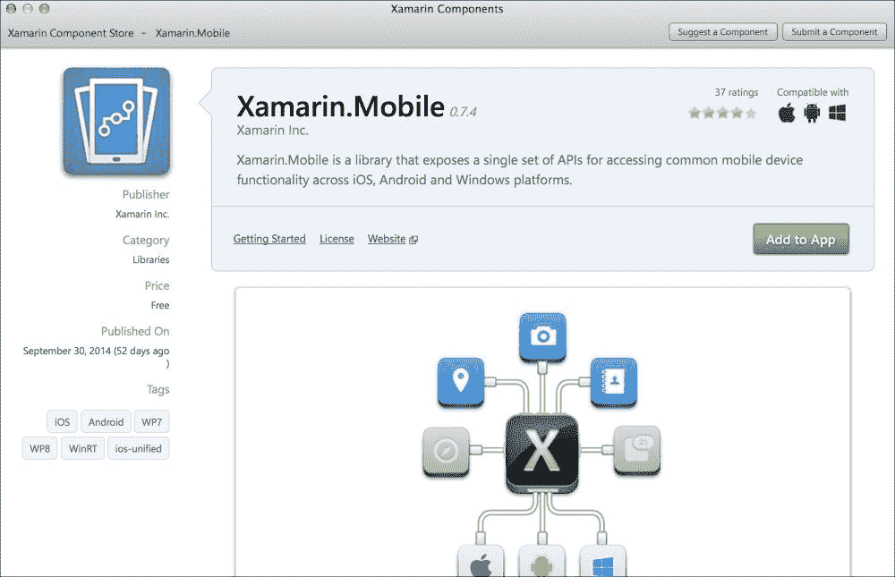
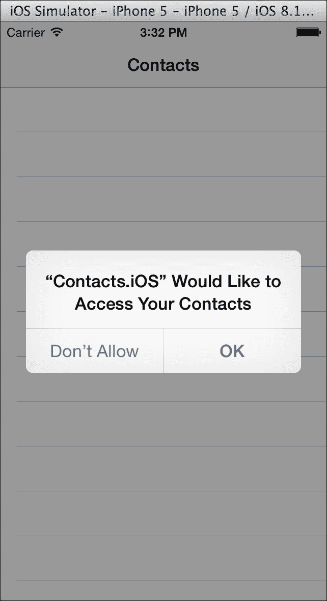
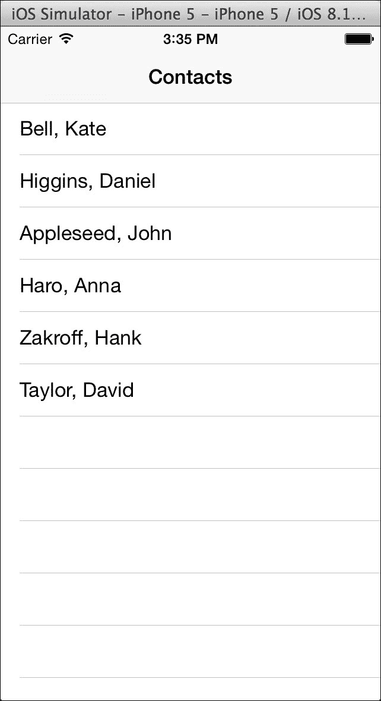
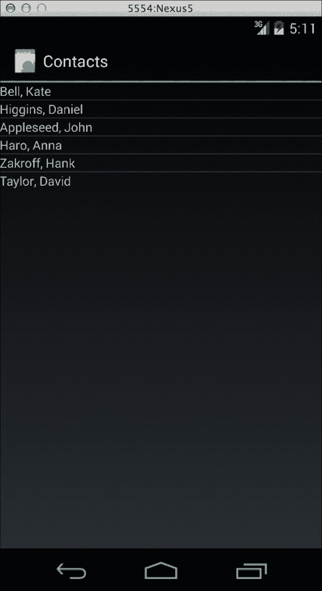
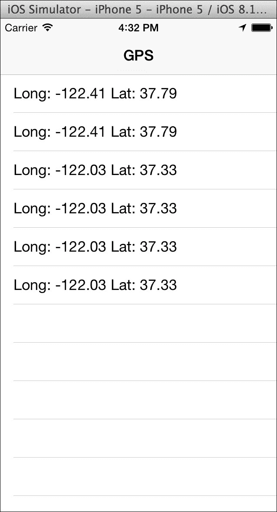
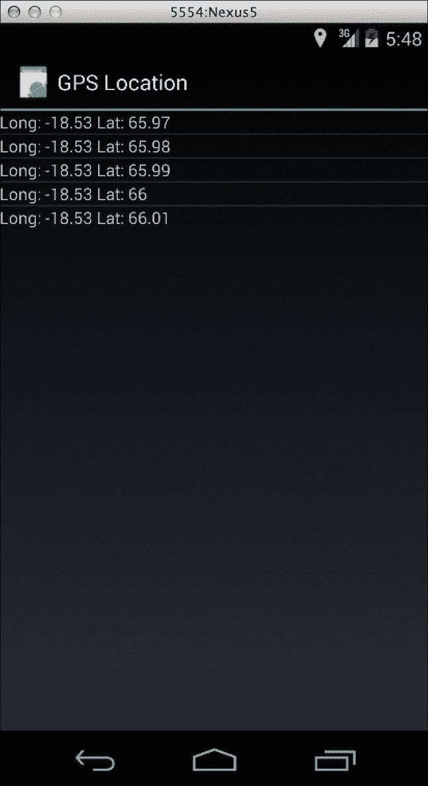
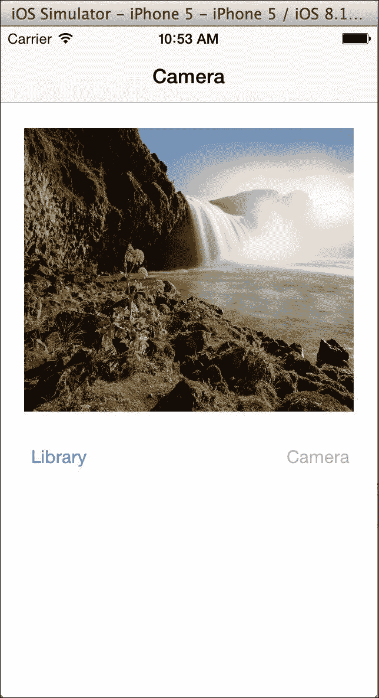
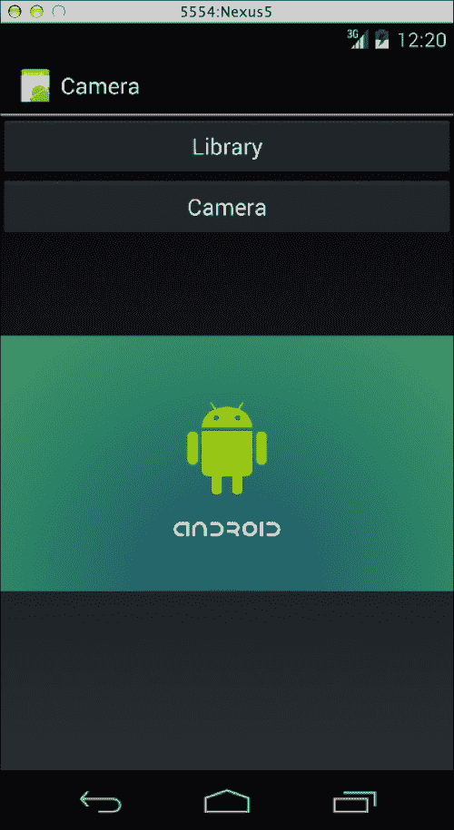

# 第十章. 联系人、相机和位置

当今移动应用程序中使用的许多关键功能都基于我们设备可以收集的新类型数据。例如，GPS 位置和相机是 Instagram 或 Twitter 等现代应用程序的必备功能。开发一个应用程序而不使用这些原生功能是很困难的。因此，让我们探索使用 Xamarin 利用这些功能的方法。

在本章中，我们将做以下事情：

+   介绍 Xamarin.Mobile 库

+   在 Android 和 iOS 上读取通讯录

+   获取我们设备的 GPS 位置

+   从相机和照片库中拉取照片

# 介绍 Xamarin.Mobile

为了简化跨多个平台开发这些功能，Xamarin 开发了一个名为**Xamarin.Mobile**的库。它提供了一个单一的 API 来访问 iOS、Android 甚至 Windows 平台上的联系人、GPS 位置、屏幕航向、相机和照片库。它还利用**任务并行库**（**TPL**）来提供一个现代的 C# API，这将使我们的开发者比他们的本地替代品更有效率。这使您能够使用 C#中的`async`和`await`关键字编写优雅、干净的异步代码。您还可以在 iOS 和 Android 上重用相同的代码，除了 Android 平台所需的少数差异。

要安装 Xamarin.Mobile，请打开**Xamarin 组件商店**，并在**Xamarin Studio**中添加**Xamarin.Mobile**组件，如图所示。您将使用以下功能（组件的功能）：



在我们进一步探讨使用 Xamarin.Mobile 之前，让我们回顾一下库中可用的命名空间和功能：

+   `Xamarin.Contacts`：这个库包含了一些类，使您能够与完整的通讯录进行交互。它包括联系人的照片、电话号码、地址、电子邮件、网站等内容。

+   `Xamarin.Geolocation`：结合加速度计，它为您提供设备 GPS 位置的信息，包括海拔、航向、经度、纬度和速度。您可以显式跟踪设备的位置，或者监听 GPS 位置随时间的变化。

+   `Xamarin.Media`：这个库允许访问设备的相机（如果有多个的话）和内置的照片库。这是向任何应用程序添加照片选择功能的一种简单方法。

要获取 Xamarin.Mobile 的完整文档，请访问包含组件商店的 API 文档，网址为[`componentsapi.xamarin.com`](http://componentsapi.xamarin.com)。您也可以在 Xamarin Studio 中查看它，通过在查看组件时点击**打开 API 文档**。

Xamarin.Mobile 也是一个开源项目，拥有标准的 Apache 2.0 许可证。您可以为项目做出贡献或向 GitHub 页面[`github.com/xamarin/Xamarin.Mobile`](https://github.com/xamarin/Xamarin.Mobile)提交问题。您可以在您的应用程序中使用 Xamarin.Mobile，也可以将其分叉，并根据自己的需求进行修改。

# 访问联系人

要开始探索 Xamarin.Mobile 提供的内容，让我们在 Xamarin 应用程序中访问地址簿。对于 iOS，第一步是通过导航到**iOS** | **iPhone Storyboard**来创建一个**单视图应用程序**项目。确保您从组件商店将 Xamarin.Mobile 添加到项目中。

现在，让我们实现一个简单的`UITableView`，其中包含联系人列表：

1.  打开`MainStoryboard.storyboard`文件。删除由项目模板创建的任何现有控制器。

1.  创建一个以`UITableViewController`作为其根子控制器的`UINavigationController`。

1.  通过在 iOS 设计器中导航到**属性** | **小部件**，将`UITableViewController`的**类**设置为`ContactsController`。

1.  保存故事板文件并返回到 Xamarin Studio。

打开自动生成的`ContactsController.cs`文件，并开始实现表格视图。在文件顶部添加`using Xamarin.Contacts;`，并对控制器进行以下更改：

```cs
public partial class ContactsController :UITableViewController, IUITableViewDataSource
{
  public ContactsController (IntPtr handle) : base (handle)
  {
    Title = "Contacts";
  }
}
```

我们填写了导航栏的标题`"Contacts"`，并将其类设置为实现`IUITableViewDataSource`。这是 Xamarin 创建的一种新类型接口，用于简化从 C#使用 Objective-C 协议。这与我们在前面的章节中创建继承自`UITableViewSource`的类完全相同，但您也可以从控制器中完成。Xamarin 在这里做了一些技巧。他们创建了一个具有可选实现方法的接口，这是 C#不支持的功能。这种类型的接口可以通过减少对新类的需求来使您的代码更加简洁，这对于非常简单的控制器来说是非常好的。

接下来，让我们添加一些代码来加载联系人：

```cs
Contact[] contacts;

public async override void ViewDidLoad()
{
  base.ViewDidLoad();
  try
  {
    var book = new AddressBook();
    await book.RequestPermission();
    contacts = book.ToArray();
  }
  catch
  {
    new UIAlertView("Oops!","Something went wrong, try again later.",null, "Ok").Show();
  }
}
```

要使用 Xamarin.Mobile 加载联系人，您必须首先创建一个`AddressBook`对象。接下来，我们必须调用`RequestPermissions`来请求用户允许访问地址簿。这是一个重要的步骤，因为 iOS 设备在应用程序可以访问用户的联系人之前需要这一步骤。这防止了恶意应用程序在用户不知情的情况下检索联系人。另一方面，Android 设备只在安装应用程序之前展示这些权限。

接下来，我们使用了`System.Linq`扩展方法`ToArray`来遍历地址簿，并将其存储在名为`contacts`的成员变量中。根据您的需求，您也可以在`AddressBook`对象上使用`foreach`。

如果您现在编译并运行应用程序，您将看到一个标准的 iOS 弹出窗口请求访问联系人，如下面的截图所示：



如果你意外地点击了**不允许**，你可以通过在设备上导航到**设置** | **隐私** | **联系人**来更改此设置。在 iOS 模拟器中，你还可以通过关闭应用程序并导航到**设置** | **通用** | **重置** | **重置位置与隐私**来重置模拟器中的所有隐私提示。这是一个在开发过程中需要重新测试时的好提示。

因此，对于下一步，我们需要实现`IUITableViewDataSource`接口，以便我们可以处理联系人数组并在屏幕上显示它们。就像添加到`UITableViewSource`一样，在控制器中添加以下方法：

```cs
public override int RowsInSection(UITableView tableview, int section)
{
  return contacts != null ? contacts.Length : 0;
}
public override UITableViewCell GetCell(UITableView tableView, NSIndexPath indexPath)
{
  var contact = contacts [indexPath.Row];
  var cell = tableView.DequeueReusableCell(CellName);
  if (cell == null)
    cell = new UITableViewCell(UITableViewCellStyle.Default, CellName);
  cell.TextLabel.Text =contact.LastName + ", " + contact.FirstName;
  return cell;
}
```

此外，通过选择一个字符串标识符，如`ContactCell`，向类中添加一个`CellName`常量字符串。现在，如果你编译并运行程序，你将能够在设备上看到联系人列表。以下截图显示了 iOS 模拟器中的默认联系人列表：



## 在 Android 中检索联系人

以非常相似的方式，我们可以使用 Xamarin.Mobile 在 Android 中检索联系人列表。Xamarin.Mobile 中的所有 API 在 Android 中都是相同的，除了需要在几个地方传递`Android.Content.Context`的要求。这是因为许多原生 Android API 需要当前活动（或到其他上下文，如`Application`）的引用才能正常工作。首先，通过在 Xamarin Studio 中导航到**Android** | **Android Application**来创建一个标准的 Android 应用程序项目。确保您从组件存储库中将 Xamarin.Mobile 添加到项目中。

在并行 iOS 中，让我们创建一个简单的`ListView`来显示联系人列表，如下所示：

1.  从`Resources`目录中的`layout`文件夹打开`Main.axml`文件。

1.  从项目模板中删除默认按钮，并将**ListView**添加到布局中。

1.  将其**Id**设置为`@+id/contacts`。

1.  保存文件并打开`MainActivity.cs`，以便我们可以对代码进行一些修改。

让我们从删除大部分代码开始；我们不需要来自项目模板的代码。您还需要添加一个`using`语句用于`Xamarin.Contacts`。接下来，让我们在`MainActivity`类中实现一个简单的`BaseAdapter<Contact>`类，如下所示：

```cs
class ContactsAdapter : BaseAdapter<Contact>
{
  public Contact[] Contacts { get; set; }

  public override long GetItemId(int position)
  {
    return position;
  }
  public override View GetView(int position, View convertView, ViewGroup parent)
  {
    var contact = this [position];
    var textView = convertView as TextView;
    if (textView == null)
    {
      textView = new TextView(parent.Context);
    }
    textView.Text = contact.LastName + ", " + contact.FirstName;
    return textView;
  }
  public override int Count
  {
    get { return Contacts == null ? 0 : Contacts.Length; }
  }
  public override Contact this[int index]
  {
    get { return Contacts [index]; }
  }
}
```

这将在`ListView`的每一行中显示一个`TextView`来显示每个联系人。我们在这里为了简化事情所做的另一件事是为联系人数组添加一个属性。这应该相当直接，类似于我们在前面的章节中所做的。

现在，让我们在`OnCreate`中设置适配器，如下所示：

```cs
protected async override void OnCreate(Bundle bundle)
{
  base.OnCreate(bundle);

  SetContentView(Resource.Layout.Main);
  var listView = FindViewById<ListView>(Resource.Id.contacts);
  var adapter = new ContactsAdapter();
  listView.Adapter = adapter;
  try
  {
    var book = new AddressBook(this);
    await book.RequestPermission();
    adapter.Contacts = book.ToArray();
    adapter.NotifyDataSetChanged();
  }
  catch
  {
    new AlertDialog.Builder(this).SetTitle("Oops").SetMessage("Something went wrong, try again later.").SetPositiveButton("Ok", delegate { }).Show();
  }
}
```

此代码调用 Xamarin.Mobile，与我们在 iOS 代码中所做的一样，只是在这里，`this`必须传递给`AddressBook`构造函数中的 Android `Context`。我们的代码更改已完成；然而，如果您现在运行应用程序，将会抛出异常。Android 需要在清单文件中请求权限，这将通知用户在从 Google Play 下载时其访问地址簿的权限。

我们必须创建一个`AndroidManifest.xml`文件并声明一个权限，如下所示：

1.  打开 Android 项目的项目选项。

1.  在**构建**下选择**Android 应用程序**选项卡。

1.  点击**添加 Android 清单**。

1.  在**必需权限**部分下，勾选**读取联系人**。

1.  点击**确定**保存您的更改。

现在，如果你运行应用程序，你将得到设备上所有联系人的列表，如下面的截图所示：



# 查找 GPS 位置

使用 Xamarin.Mobile 跟踪用户的 GPS 位置就像访问他们的联系人一样简单。iOS 和 Android 的设置过程类似，但在位置方面，您不需要在代码中请求权限。iOS 会自动显示标准警报请求权限。另一方面，Android 只需在清单中设置一个设置。

例如，让我们创建一个显示 GPS 位置随时间更新的应用程序。让我们从一个 iOS 示例开始，创建一个单视图应用程序项目。这可以通过导航到**iOS** | **iPhone Storyboard**并点击**Single View Application**来完成，就像我们在上一节中所做的那样。确保您从组件存储库中将 Xamarin.Mobile 添加到项目中。

现在，让我们实现一个简单的`UITableView`来显示 GPS 更新的列表，如下所示：

1.  打开`MainStoryboard.storyboard`文件。删除由项目模板创建的任何现有控制器。

1.  使用`UITableViewController`创建`UINavigationController`作为其根子控制器。

1.  通过在 iOS 设计器中导航到**属性** | **小部件**，将`UITableViewController`的类设置为`LocationController`。

1.  保存故事板文件并返回到 Xamarin Studio。

打开`LocationController.cs`文件，我们首先设置 GPS 以在一段时间内更新表格视图。将`using Xamarin.Geolocation;`添加到文件顶部。我们可以在控制器的构造函数中设置一些成员变量并创建我们的`Geolocator`对象，如下所示：

```cs
Geolocator locator;
List<string> messages = new List<string>();
public LocationController (IntPtr handle) : base (handle)
{
  Title = "GPS";
  locator = new Geolocator();
  locator.PositionChanged += OnPositionChanged;
  locator.PositionError += OnPositionError;
}
```

接下来，我们可以设置如下的事件处理程序：

```cs
void OnPositionChanged (object sender, PositionEventArgs e)
{
  messages.Add(string.Format("Long: {0:0.##} Lat: {1:0.##}",e.Position.Longitude, e.Position.Latitude));
  TableView.ReloadData();
}
void OnPositionError (object sender, PositionErrorEventArgs e)
{
  messages.Add(e.Error.ToString());
  TableView.ReloadData();
}
```

当出现错误或位置变化时，这些会向列表中添加一条消息。我们使用了`string.Format`来仅显示经纬度到小数点后两位。

接下来，我们必须实际告诉`Geolocator`开始监听 GPS 更新。我们可以在`ViewDidLoad`中这样做：

```cs
public override void ViewDidLoad()
{
  base.ViewDidLoad();
  locator.StartListening(1000, 50);
}
```

在前面的代码中，`1000`是更新 GPS 位置的最小时间提示，而`50`是触发位置更新的米数提示。

最后但同样重要的是，我们需要设置表格视图。将`LocationController`设置为实现`IUITableViewDataSource`，并将以下方法添加到控制器中：

```cs
public override int RowsInSection(UITableView tableview, int section)
{
  return messages.Count;
}
public override UITableViewCell GetCell(UITableView tableView, NSIndexPath indexPath)
{
  var cell = tableView.DequeueReusableCell(CellName);
  if (cell == null)
    cell = new UITableViewCell(UITableViewCellStyle.Default, CellName);
  cell.TextLabel.Text = messages [indexPath.Row];
  return cell;
}
```

如果您编译并运行应用程序，您应该会看到 iOS 权限提示，随后在表格视图中随着时间的推移显示经纬度，如下面的截图所示：



## 在 Android 上实现 GPS 位置

就像在上一节中一样，使用 Xamarin.Mobile 进行 GPS 定位几乎与我们在 iOS 中使用的 API 相同。首先，在我们的 Android 示例中，转到 Xamarin Studio 中的**Android** | **Android Application**。确保您从组件商店将 Xamarin.Mobile 添加到项目中。

让我们创建`ListView`以显示 GPS 位置更新的消息列表，如下所示：

1.  在 Android 设计师中，从`Resources`目录下的`layout`文件夹中打开`Main.axml`文件。

1.  从项目模板中删除默认按钮，并将`ListView`添加到布局中。

1.  将其**Id**设置为`@+id/locations`。

1.  保存文件并打开`MainActivity.cs`，以便我们可以进行一些代码更改。

与往常一样，删除由项目模板创建的任何额外代码。接下来，添加`Xamarin.Geolocation`的`using`语句。然后，将一个简单的`BaseAdapter<string>`添加到`MainActivity`类中，如下所示：

```cs
class Adapter : BaseAdapter<string>
{
  List<string> messages = new List<string>();

  public void Add(string message)
  {
    messages.Add(message);
    NotifyDataSetChanged();
  }
  public override long GetItemId(int position)
  {
    return position;
  }
  public override View GetView(int position, View convertView, ViewGroup parent)
  {
    var textView = convertView as TextView;
    if (textView == null)
      textView = new TextView(parent.Context);
    textView.Text = messages [position];
    return textView;
  }
  public override int Count
  {
    get { return messages.Count; }
  }
  public override string this[int index]
  {
    get { return messages [index]; }
  }
}
```

这与其他我们过去设置的 Android 适配器类似。这里的一个区别是我们创建了一个包含消息`List<string>`的成员变量和一个将新消息添加到列表中的方法。

现在，让我们向`MainActivity`类中添加一些方法，以便设置 GPS 位置更新，如下所示：

```cs
Geolocator locator;
Adapter adapter;

protected override void OnCreate(Bundle bundle)
{
  base.OnCreate(bundle);
  SetContentView(Resource.Layout.Main);
  var listView = FindViewById<ListView>(Resource.Id.locations);
  listView.Adapter = adapter = new Adapter();
  locator = new Geolocator(this);
  locator.PositionChanged += OnPositionChanged;
  locator.PositionError += OnPositionError;
}
protected override void OnResume()
{
  base.OnResume();
  locator.StartListening(1000, 50);
}
protected override void OnPause()
{
  base.OnPause();
  locator.StopListening();
}
void OnPositionChanged (object sender, PositionEventArgs e)
{
  adapter.Add(string.Format("Long: {0:0.##} Lat: {1:0.##}",e.Position.Longitude, e.Position.Latitude));
}
void OnPositionError (object sender, PositionErrorEventArgs e)
{
  adapter.Add(e.Error.ToString());
}
```

再次，这看起来与 iOS 的代码相同，只是`Geolocator`的构造函数不同。如果您此时运行应用程序，它将无错误启动。然而，`Geolocator`对象不会触发任何事件。我们首先需要从 Android Manifest 文件中添加一个权限来访问位置。在`OnResume`中启动定位器并在`OnPause`中停止定位器也是一个好主意。这将通过在活动不在屏幕上时停止 GPS 位置来节省电池。

让我们创建一个`AndroidManifest.xml`文件，并声明以下两个权限：

1.  打开 Android 项目的项目选项。

1.  在**构建**下选择**Android Application**选项卡。

1.  点击**添加 Android 清单**。

1.  在**必需权限**部分，勾选**AccessCoarseLocation**和**AccessFineLocation**。

1.  点击**确定**以保存您的更改。

现在，如果您编译并运行应用程序，您将随着时间的推移获得 GPS 位置更新，如下面的截图所示：



# 访问照片库和相机

Xamarin.Mobile 的最后一个主要功能是访问照片，以便用户能够将他们自己的内容添加到你的应用程序中。使用名为`MediaPicker`的类，你可以从设备的相机或照片库中提取照片，并可选择显示自己的 UI 进行操作。

让我们创建一个应用程序，该应用程序在按钮按下时从相机或照片库加载图像，并在屏幕上显示。首先，通过在 Xamarin Studio 中转到**iOS** | **iPhone Storyboard** | **Single View Application**来创建一个单视图应用程序项目。确保从组件商店将 Xamarin.Mobile 添加到项目中。

现在，让我们实现一个包含两个`UIButton`和一个`UIImageView`的屏幕，如下所示：

1.  打开`MainStoryboard.storyboard`文件。删除由项目模板创建的任何现有控制器。

1.  创建一个包含一个`UIImageView`和两个名为`Library`和`Camera`的`UIButton`的`UIViewController`。

1.  通过在 iOS 设计器中导航到**属性** | **小部件**，将`UITableViewController`的类设置为`ContactsController`。

1.  在名为`imageView`、`library`和`camera`的控制器中分别为每个视图创建**名称**字段。

1.  保存故事板文件并返回到 Xamarin Studio。

现在，打开`PhotoController.cs`文件，并在`ViewDidLoad`中添加以下代码：

```cs
MediaPicker picker;
public override void ViewDidLoad()
{
  base.ViewDidLoad();

  picker = new MediaPicker();
  if (!picker.IsCameraAvailable)
    camera.Enabled = false;
  camera.TouchUpInside += OnCamera;
  library.TouchUpInside += OnLibrary;
}
```

注意，我们必须检查`IsCameraAvailable`并禁用`camera`按钮。有些 iOS 设备，如第一代 iPad，可能没有摄像头。除此之外，我们只需要创建一个`MediaPicker`实例，以便在点击每个按钮时使用。

现在，让我们为每个按钮的`TouchUpInside`事件添加一个方法，以及几个其他辅助方法，如下所示：

```cs
async void OnCamera (object sender, EventArgs e)
{
  try
  {
    var file = await picker.TakePhotoAsync(new StoreCameraMediaOptions());
    imageView.Image = ToImage(file);
  }
  catch
  {
    ShowError();
  }
}
async void OnLibrary (object sender, EventArgs e)
{
  try
  {
    var file = await picker.PickPhotoAsync();
    imageView.Image = ToImage(file);
  }
  catch
  {
      ShowError();
  }
}
UIImage ToImage(MediaFile file)
{
  using (var stream = file.GetStream())
  {
    using (var data = NSData.FromStream(stream))
    {
      return UIImage.LoadFromData(data);
    }
  }
}
void ShowError()
{
  new UIAlertView("Oops!", "Something went wrong, try again later.", null, "Ok").Show();
}
```

使用`MediaPicker`相当简单；你只需调用`TakePhotoAsync`或`PickPhotoAsync`来检索`MediaFile`实例。然后，你可以调用`GetStream`来对图像数据进行操作。在我们的例子中，我们创建了`UIImage`以直接在`UIImageView`中显示。如果发生意外情况或用户取消，还需要使用`try-catch`块。

你现在应该能够运行应用程序并选择一张要在屏幕上查看的照片。以下截图显示了从照片库中选择的 iOS 模拟器中的默认照片：



## 在 Android 上访问照片

与 iOS 相比，在 Android 上检索相机或照片库中的照片时，我们必须使用稍微不同的模式。Android 中的一种常见模式是它调用 `StartActivityForResult` 从另一个应用程序启动活动。当此活动完成时，`OnActivityResult` 将从您的活动中被调用。正因为如此，Xamarin.Mobile 无法在 Android 上使用与其他平台相同的 API。为了开始我们的示例，请通过在 Xamarin Studio 中转到 **Android** | **Android Application** 创建一个 Android 应用程序项目。确保您从组件商店将 Xamarin.Mobile 添加到项目中。

让我们创建两个 **按钮** 和一个 **ImageView** 来模拟我们的 iOS UI，如下所示：

1.  在 Android 设计器中，从 `Resources` 目录下的 `layout` 文件夹中打开 `Main.axml` 文件。

1.  从项目模板中删除默认按钮，并添加两个新的 `Button`，分别命名为 `Library` 和 `Camera`。

1.  将它们的 **Id** 分别设置为 `@+id/library` 和 `@+id/camera`。

1.  创建一个具有 **Id** 为 `@+id/imageView` 的 `ImageView`。

1.  保存文件并打开 `MainActivity.cs`，以便我们可以修改我们的代码。

如同往常，删除由项目模板创建的任何额外代码。接下来，添加一个 `using` 语句用于 `Xamarin.Media`。然后，我们可以添加一个新的 `OnCreate` 方法以及一些用于我们活动的成员变量，如下所示：

```cs
MediaPicker picker;
ImageView imageView;

protected override void OnCreate(Bundle bundle)
{
  base.OnCreate(bundle);
  SetContentView(Resource.Layout.Main);
  var library = FindViewById<Button>(Resource.Id.library);
  var camera = FindViewById<Button>(Resource.Id.camera);
  imageView = FindViewById<ImageView>(Resource.Id.imageView);
  picker = new MediaPicker(this);
  library.Click += OnLibrary;
  camera.Click += OnCamera;
  if (!picker.IsCameraAvailable)
    camera.Enabled = false;
}
```

我们检索了视图的实例，并通过将活动作为 `Context` 传递给其构造函数创建了一个新的 `MediaPicker`。我们连接了一些 `Click` 事件处理程序，并禁用了 `camera` 按钮，因为相机不可用。

接下来，让我们实现两个 `Click` 事件处理程序，如下所示：

```cs
void OnLibrary (object sender, EventArgs e)
{
  var intent = picker.GetPickPhotoUI();
  StartActivityForResult (intent, 1);
}
void OnCamera (object sender, EventArgs e)
{
  var intent = picker.GetTakePhotoUI(new StoreCameraMediaOptions
  {
    Name = "test.jpg", Directory = "PhotoPicker"
  });
  StartActivityForResult (intent, 1);
}
```

在每种情况下，我们都会调用 `GetPickPhotoUI` 或 `GetTakePhotoUI` 来获取一个 Android `Intent` 对象的实例。此对象用于在应用程序内启动新的活动。`StartActivityForResult` 也会启动 `Intent` 对象，并期望从新活动返回结果。我们还使用 `StoreCameraMediaOptions` 设置一些值，以指定存储照片的文件名和临时目录。

接下来，我们需要在 Android 中实现 `OnActivityResult` 以处理新活动完成时会发生的情况：

```cs
protected async override void OnActivityResult(
  int requestCode, Result resultCode, Intent data)
{
  if (resultCode == Result.Canceled)
  return;
  var file = await data.GetMediaFileExtraAsync(this);
  using (var stream = file.GetStream())
  {
    imageView.SetImageBitmap(await
      BitmapFactory.DecodeStreamAsync(stream));
  }
}
```

如果这成功，我们将检索 `MediaFile` 并使用返回的 `Stream` 加载一个新的 `Bitmap`。接下来，所需做的就是调用 `SetImageBitmap` 在屏幕上显示图像。

让我们创建一个 `AndroidManifest.xml` 文件并声明两个权限，如下所示：

1.  打开 Android 项目的项目选项。

1.  在 **构建** 下的 **Android 应用程序** 选项卡下选择。

1.  点击 **添加 Android 清单**。

1.  在 **必需权限** 部分下，勾选 **Camera** 和 **WriteExternalStorage**。

1.  点击 **确定** 保存您的更改。

您现在应该能够运行应用程序并将照片加载到屏幕上显示，如下面的截图所示：



# 摘要

在本章中，我们发现了 Xamarin.Mobile 库以及它是如何以跨平台的方式加速常见原生任务的。我们从地址簿中检索了联系人，并设置了随时间推移的 GPS 位置更新。最后，我们从相机和照片库中加载了照片。直接使用原生 API 意味着每个平台上的代码量将是两倍，因此我们看到了 Xamarin.Mobile 库是如何作为一个有用的抽象，可以减少一些开发时间。

完成本章后，你应该对 Xamarin.Mobile 库及其为跨平台开发提供的常用功能有全面的理解。它提供了干净、现代的 API，这些 API 提供了跨 iOS、Android 和 Windows Phone 访问的`async`/`await`功能。使用 Xamarin.Mobile 跨平台访问联系人、GPS 和照片非常直接。

在下一章中，我们将介绍如何将应用程序提交到 iOS App Store 和 Google Play 的步骤。这包括如何准备您的应用程序以通过 iOS 指南，以及如何正确注册您的应用程序以供 Google Play 使用。
