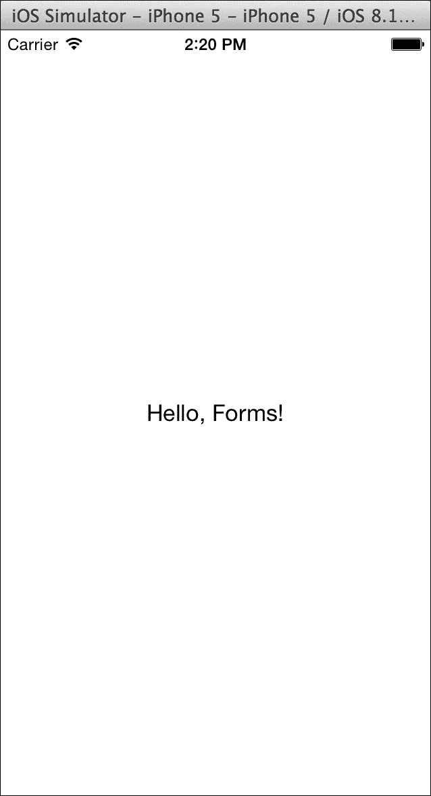
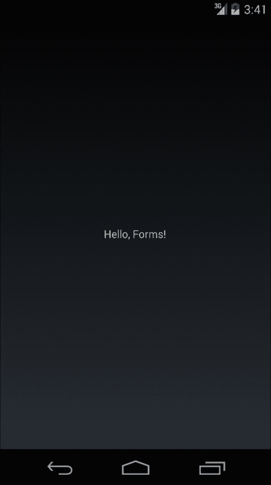
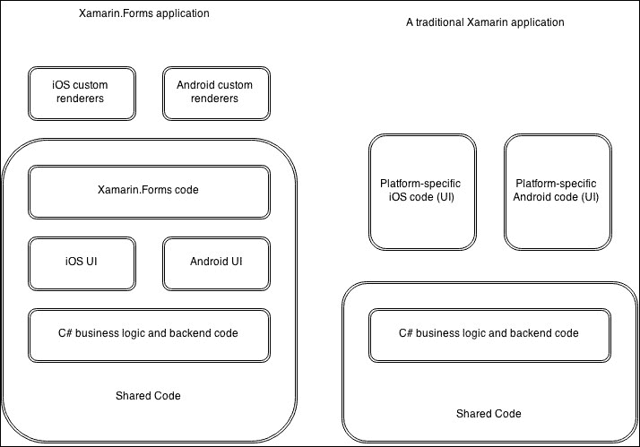
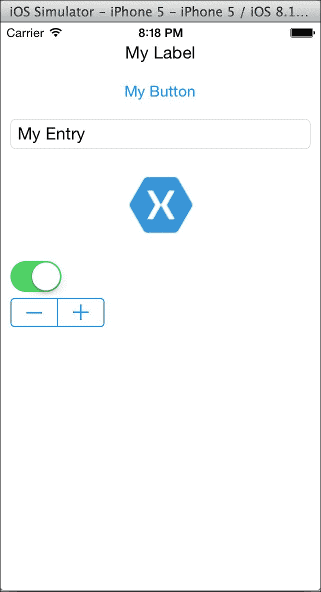
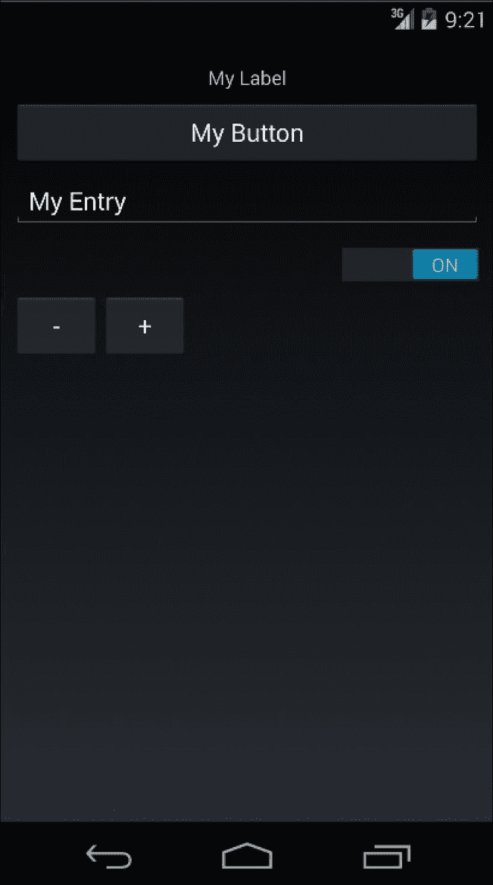
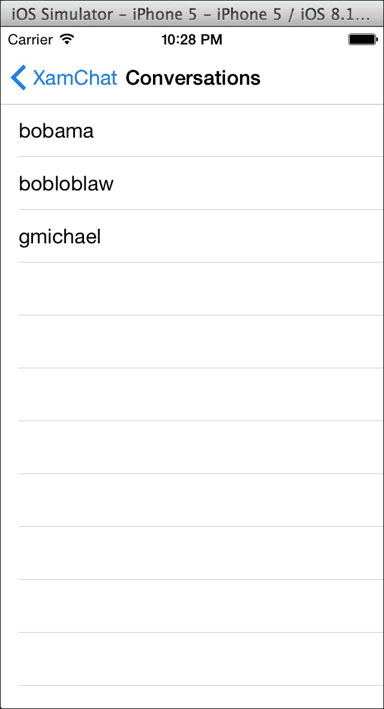

# 第十一章。Xamarin.Forms

自从 Xamarin 作为公司开始以来，他们的座右铭一直是直接将 iOS 和 Android 的本地 API 暴露给 C#。这是一个很好的策略，因为使用 Xamarin.iOS 或 Xamarin.Android 构建的应用程序几乎与本地 Objective-C 或 Java 应用程序无法区分。代码共享通常限于非 UI 代码，这可能在 Xamarin 生态系统中留下一个潜在的空白：一个跨平台 UI 抽象。Xamarin.Forms 是解决这个问题的方案，这是一个跨平台 UI 框架，在每个平台上渲染本地控件。对于知道 C#（和 XAML）的人来说，Xamarin.Forms 是一个很好的解决方案，但也可能不想深入了解使用本地 iOS 和 Android API 的细节。

在本章中，我们将涵盖以下内容：

+   在 Xamarin.Forms 中创建“Hello World”

+   讨论 Xamarin.Forms 架构

+   使用 XAML 与 Xamarin.Forms

+   使用 Xamarin.Forms 实现数据绑定和 MVVM

# 在 Xamarin.Forms 中创建“Hello World”

要了解 Xamarin.Forms 应用程序是如何组合的，让我们先创建一个简单的“Hello World”应用程序。

打开 Xamarin Studio 并执行以下步骤：

+   创建一个新的解决方案。

+   导航到**C#** | **移动应用**部分。

+   创建一个新的**空白应用（Xamarin.Forms Portable）**解决方案。

+   将你的解决方案命名为合适的名称，例如`HelloForms`。

注意成功创建的三个新项目：`HelloForms`、`HelloForms.Android`和`HelloForms.iOS`。在 Xamarin.Forms 应用程序中，你大部分的代码将是共享的，而每个平台特定项目只是启动 Xamarin.Forms 框架的一小部分代码。

让我们检查 Xamarin.Forms 应用程序的最小部分：

+   在`HelloForms` PCL 库中的`App.cs`。这个类包含 Xamarin.Forms 应用程序的启动页面。一个简单的静态方法`GetMainPage()`返回应用程序的启动页面。在默认项目模板中，

+   创建了一个带有单个标签的`ContentPage`，在 iOS 上渲染为`UILabel`，在 Android 上渲染为`TextView`。

+   在`HelloForms.Android` Android 项目中，`MainActivity.cs`。这是 Android 应用程序的主要启动活动。对于 Xamarin.Forms 来说，这里重要的是对`Forms.Init(this, bundle)`的调用，它初始化了 Xamarin.Forms 框架的 Android 特定部分。接下来是对`SetPage(App.GetMainPage())`的调用，它显示主 Xamarin.Forms 页面的本地版本。

+   在`HelloForms.iOS` iOS 项目中的`AppDelegate.cs`。这与 Android 非常相似，只是 iOS 应用程序通过`UIApplicationDelegate`类启动。`Forms.Init()`将初始化 Xamarin.Forms 的 iOS 特定部分，而`App.GetMainPage().CreateViewController()`将生成一个可以用于应用程序主窗口的`RootViewController`的本地控制器。

继续运行 iOS 项目；你应该能看到以下截图类似的内容：



如果您运行 Android 项目，您将得到一个非常类似于 iOS 的 UI，但使用的是原生 Android 控件，如下面的截图所示：



### 提示

尽管本书没有涉及，但 Xamarin.Forms 也支持 Windows Phone 应用程序。然而，要为 Windows Phone 开发，需要一个运行 Windows 和 Visual Studio 的 PC。如果您能让一个 Xamarin.Forms 应用程序在 iOS 和 Android 上运行，那么让 Windows Phone 版本运行应该易如反掌。

# 理解 Xamarin.Forms 背后的架构

开始使用 Xamarin.Forms 非常简单，但总是好的，看看幕后发生了什么，以了解幕后发生的事情。在这本书的早期章节中，我们使用原生 iOS 和 Android API 直接创建了一个跨平台应用程序。某些应用程序更适合这种开发方法，因此了解 Xamarin.Forms 应用程序和纯 Xamarin 应用程序之间的区别对于选择最适合您应用程序的框架非常重要。

Xamarin.Forms 是一个在原生 iOS 和 Android API 之上的抽象层，您可以直接从 C# 中调用。因此，Xamarin.Forms 使用与纯 Xamarin 应用程序相同的 API，同时提供了一个框架，允许您以跨平台的方式定义您的 UI。这种抽象层在许多方面是非常好的，因为它让您能够共享驱动 UI 的代码以及任何可能也在标准 Xamarin 应用程序中共享的后端 C# 代码。然而，主要的缺点是性能略有下降，并且受限于 Xamarin.Forms 框架，在可用的控件类型方面有所限制。Xamarin.Forms 还提供了编写 **渲染器** 的选项，允许您以特定平台的方式覆盖您的 UI。然而，在我看来，渲染器的功能仍然相对有限。

在以下图中查看 Xamarin.Forms 应用程序与传统 Xamarin 应用程序之间的区别：



在这两个应用程序中，应用程序的业务逻辑和后端代码可以共享，但 Xamarin.Forms 通过允许共享 UI 代码为您提供了巨大的好处。

此外，Xamarin.Forms 应用程序有两个项目模板可供选择，因此让我们分别介绍每个选项：

+   **Xamarin.Forms 共享**：这会创建一个包含所有您的 Xamarin.Forms 代码、iOS 项目和 Android 项目的共享项目。

+   **Xamarin.Forms 可移植**：这会创建一个包含所有共享 Xamarin.Forms 代码、iOS 项目和 Android 项目的可移植类库。

通常，这两种选项对任何应用程序都适用。共享项目基本上是一组代码文件集合，这些文件会自动添加到引用它的另一个项目中。使用共享项目允许您使用预处理器语句来实现平台特定代码。另一方面，可移植类库项目创建了一个可移植的 .NET 程序集，可以在 iOS、Android 和各种其他平台上使用。PCL 不能使用预处理器语句，因此您通常使用接口或抽象/基类设置平台特定代码。在大多数情况下，我认为可移植类库是一个更好的选择，因为它本质上鼓励更好的编程实践。您可以参考 第三章，*iOS 和 Android 之间的代码共享*，以了解这两种代码共享技术的优缺点。

# 使用 XAML 在 Xamarin.Forms 中

除了从 C# 代码中定义 Xamarin.Forms 控件外，Xamarin 还提供了使用 **可扩展应用程序标记语言** (**XAML**) 开发 UI 的工具。XAML 是一种声明性语言，基本上是一组映射到 Xamarin.Forms 框架中特定控件的 XML 元素。使用 XAML 与您认为使用 HTML 定义网页 UI 相似，但区别在于 Xamarin.Forms 中的 XAML 创建代表原生 UI 的 C# 对象。

要理解 XAML 在 Xamarin.Forms 中的工作原理，让我们创建一个带有许多 UI 元素的新页面：

1.  通过导航到 **C#** | **移动应用** | **空白应用 (Xamarin.Forms Portable)** 创建一个新的 Xamarin.Forms Portable 解决方案。

1.  将项目命名为合适的名称，例如 `UIDemo`。

1.  通过导航到 **Forms** | **Forms ContentPage XAML** 项模板添加一个新文件。将页面命名为 `UIDemoPage`。

1.  打开 `UIDemoPage.xaml`。

现在，让我们编辑 XAML 代码。在 `<ContentPage.Content>` 标签之间添加以下 XAML 代码：

```cs
<StackLayout Orientation="Vertical" Padding="10,20,10,10"> <Label Text="My Label" XAlign="Center" /> <Button Text="My Button" /> <Entry Text="My Entry" /> <Image Source="xamagon.png" /> <Switch IsToggled="true" /> <Stepper Value="10" /> </StackLayout>
```

在 iOS 和 Android 上运行应用程序。您的应用程序将类似于以下截图：



然后，在 Android 上，Xamarin.Forms 将以相同的方式渲染屏幕，但使用原生 Android 控件：



首先，我们创建了一个 `StackLayout` 控件，这是一个其他控件的容器。它可以根据 `Orientation` 值垂直或水平逐个布局控件。我们还为侧面和底部添加了 10 像素的填充，以及从顶部到 iOS 状态栏的 20 像素填充，以调整 iOS 状态栏。如果您熟悉 WPF 或 Silverlight 中的矩形定义语法，您可能对这种语法很熟悉。Xamarin.Forms 使用相同的语法，即由逗号分隔的左、上、右和底部值。

我们还使用了几个内置的 Xamarin.Forms 控件来查看它们的工作方式：

1.  `Label`：我们在本章前面已经使用过这个控件。它仅用于显示文本。在 iOS 上对应于 `UILabel`，在 Android 上对应于 `TextView`。

1.  `Button`：这是一个通用按钮，用户可以点击。这个控件在 iOS 上对应于 `UIButton`，在 Android 上对应于 `Button`。

1.  `Entry`：这个控件是一个单行文本输入。在 iOS 上对应于 `UITextField`，在 Android 上对应于 `EditText`。

1.  `Image`：这是一个简单的控件，用于在屏幕上显示图像，在 iOS 上对应于 `UIImage`，在 Android 上对应于 `ImageView`。我们使用了这个控件的 `Source` 属性，从 iOS 的 `Resources` 文件夹和 Android 的 `Resources/drawable` 文件夹加载图像。你也可以在这个属性上设置 URL，但最好是将图像包含在你的项目中以提高性能。

1.  `Switch`：这是一个开关或切换按钮。在 iOS 上对应于 `UISwitch`，在 Android 上对应于 `Switch`。

1.  `Stepper`：这是一个通用输入，可以通过两个加号和减号按钮输入数字。在 iOS 上，这对应于 `UIStepper`，而在 Android 上，Xamarin.Forms 使用两个 `Button` 来实现这个功能。

这只是 Xamarin.Forms 提供的一些控件中的一部分。还有更多复杂的控件，如你期望用于开发移动 UI 的 `ListView` 和 `TableView`。

尽管在这个例子中我们使用了 XAML，但你也可以用 C# 实现这个 Xamarin.Forms 页面。下面是一个这样的例子：

```cs
public class UIDemoPageFromCode : ContentPage
{
  public UIDemoPageFromCode()
  {
    var layout = new StackLayout 
    {
      Orientation = StackOrientation.Vertical,
      Padding = new Thickness(10, 20, 10, 10),
    };

    layout.Children.Add(new Label 
    {
      Text = "My Label",
      XAlign = TextAlignment.Center,
    });

    layout.Children.Add(new Button 
    {
      Text ="My Button",
    });

    layout.Children.Add(new Image 
    {
      Source = "xamagon.png",
    });

    layout.Children.Add(new Switch 
    {
      IsToggled = true,
    });

    layout.Children.Add(new Stepper 
    {
      Value = 10,
    });

    Content = layout;
  }
}
```

因此，你可以看到使用 XAML 可以使代码更易读，并且通常在声明 UI 方面表现得更好。然而，使用 C# 来定义你的 UI 仍然是一个可行且直接的方法。

# 使用数据绑定和 MVVM

到目前为止，你应该已经掌握了 Xamarin.Forms 的基础知识，但你可能想知道 MVVM 设计模式如何融入其中。MVVM 设计模式最初是为了与 XAML 和 XAML 提供的强大数据绑定功能一起使用而构思的，因此它自然是一个与 Xamarin.Forms 一起使用的完美设计模式。

让我们来看看如何使用 Xamarin.Forms 设置数据绑定和 MVVM 的基本知识：

1.  你的模型和视图模型层将主要保持与本书前面介绍的 MVVM 模式不变。

1.  你的视图模型层应该实现 `INotifyPropertyChanged` 接口，这有助于数据绑定。为了简化 Xamarin.Forms，你可以使用 `BindableObject` 基类，并在视图模型中的值发生变化时调用 `OnPropertyChanged`。

1.  在 Xamarin.Forms 中，任何页面或控件都有一个 `BindingContext` 属性，它是与之数据绑定的对象。通常，你可以将相应的视图模型设置为每个视图的 `BindingContext` 属性。

1.  在 XAML 中，你可以使用如下形式的语法 `Text="{Binding Name}"` 来设置数据绑定。这个例子将控件的 Text 属性绑定到 `BindingContext` 中对象的 Name 属性。

1.  结合数据绑定，事件可以通过 `ICommand` 接口转换为命令。例如，一个按钮的点击事件可以绑定到由 ViewModel 提供的命令。Xamarin.Forms 中有一个内置的 `Command` 类来支持这一点。

### 小贴士

在 Xamarin.Forms 中，也可以通过 `Binding` 类从 C# 代码设置数据绑定。然而，通常从 XAML 设置绑定要简单得多，因为那里的语法已经被简化了。

现在我们已经涵盖了基础知识，让我们一步一步地来，并将之前在书中讨论的 XamChat 示例应用程序部分转换为使用 Xamarin.Forms。大部分情况下，我们可以重用大部分的 Model 和 ViewModel 层，尽管我们需要进行一些小的修改以支持从 XAML 的数据绑定。

让我们从创建一个名为 `XamChat` 的 PCL 支持的新 Xamarin.Forms 应用程序开始：

1.  首先，在 `XamChat` 项目中创建三个文件夹，分别命名为 `Views`、`ViewModels` 和 `Models`。

1.  从之前章节中 XamChat 应用程序中添加适当的 `ViewModels` 和 `Models` 类。这些在 `XamChat.Core` 项目中可以找到。

1.  构建项目并确保所有内容都已保存。你将得到一些编译错误，我们将在稍后解决。

我们需要编辑的第一个类是 `BaseViewModel` 类。打开它并做出以下更改：

```cs
public class BaseViewModel : BindableObject
{
  protected readonly IWebService service = DependencyService.Get<IWebService>();
  protected readonly ISettings settings = DependencyService.Get<ISettings>();

  private bool isBusy = false;
  public bool IsBusy
  {get {return isBusy;}
      set {isBusy = value; OnPropertyChanged();}}
}
```

首先，我们移除了对 `ServiceContainer` 类的调用，因为 Xamarin.Forms 提供了自己的 IoC 容器，称为 `DependencyService`。它的工作方式与我们在上一章中构建的容器非常相似，但它只有一个方法，即 `Get<T>`，并且注册是通过我们将要设置的程序集属性来设置的。

此外，我们移除了 `IsBusyChanged` 事件，转而使用支持数据绑定的 `INotifyPropertyChanged` 接口。从 `BindableObject` 继承给我们一个辅助方法 `OnPropertyChanged`，我们使用它来通知绑定在 Xamarin.Forms 中值已更改。请注意，我们没有将包含属性名的 `string` 传递给 `OnPropertyChanged`。此方法使用 .NET 4.0 的一个不太为人所知的功能 `CallerMemberName`，该功能将在运行时自动填充调用属性的名称。

接下来，让我们使用 `DependencyService` 设置所需的服务。在 PCL 项目的根目录中打开 `App.cs` 文件，并在命名空间声明之上添加以下两行：

```cs
[assembly: Dependency(typeof(XamChat.Core.FakeWebService))]
[assembly: Dependency(typeof(XamChat.Core.FakeSettings))]
```

`DependencyService` 将会自动获取这些属性并检查我们声明的类型。这些类型实现的任何接口都将被返回给任何未来调用 `DependencyService.Get<T>` 的调用者。我通常将所有的 `Dependency` 声明放在 `App.cs` 文件中，以便于管理和集中处理。

接下来，让我们通过添加一个新属性来修改 `LoginViewModel`：

```cs
public Command LoginCommand { get; set; }
```

我们将很快使用这个来绑定按钮的命令。在 ViewModel 层的最后一个小改动是为 `MessageViewModel` 设置 `INotifyPropertyChanged`：

```cs
Conversation[] conversations;

public Conversation[] Conversations
{get {return conversations; }
  set {conversations = value; OnPropertyChanged();}
}
```

同样，你可以重复这个模式来处理 ViewModel 层中剩余的公共属性，但在这个例子中我们只需要这些。接下来，在 `Views` 文件夹下创建一个新的 `Foms ContentPage Xaml` 项目，命名为 `LoginPage`。在 `LoginPage.xaml.cs` 代码背后文件中，我们只需做一些修改：

```cs
public partial class LoginPage : ContentPage
{
  readonly LoginViewModel loginViewModel = new LoginViewModel();

  public LoginPage()
  {
    Title = "XamChat";
    BindingContext = loginViewModel;

    loginViewModel.LoginCommand = new Command(async () =>
    {
      try
      {
        await loginViewModel.Login();

        await Navigation.PushAsync(new ConversationsPage());
      }
      catch (Exception exc)
      {
        await DisplayAlert("Oops!", exc.Message, "Ok");
      }
    });

    InitializeComponent();
  }
}
```

在这里，我们做了几件重要的事情，包括将 `BindingContext` 设置为我们的 `LoginViewModel`。我们设置了 `LoginCommand`，它基本上调用 `Login` 方法，如果出现问题则显示消息。如果成功，它还会导航到新页面。我们还设置了标题，这将在应用程序的顶部导航栏中显示。

接下来，打开 `LoginPage.xaml`，我们将在内容页的内容中添加以下 XAML 代码：

```cs
<StackLayout Orientation="Vertical" Padding="10,10,10,10">
  <Entry Placeholder="Username" Text="{Binding Username}" />
  <Entry Placeholder="Password" Text="{Binding Password}" IsPassword="true" />
  <Button Text="Login" Command="{Binding LoginCommand}" />
  <ActivityIndicator IsVisible="{Binding IsBusy}" IsRunning="true" />
</StackLayout>
```

这将设置两个文本字段、一个按钮和一个带有所有绑定以使一切正常工作的旋转按钮的基本设置。由于我们从 `LoginPage` 代码背后设置了 `BindingContext`，所以所有属性都绑定到了 `LoginViewModel`。

接下来，创建一个名为 `ConversationsPage` 的 XAML 页面，就像我们之前做的那样，并编辑其背后的 `ConversationsPage.xaml.cs` 代码：

```cs
public partial class ConversationsPage : ContentPage
{
  readonly MessageViewModel messageViewModel = new MessageViewModel();

  public ConversationsPage()
  {
    Title = "Conversations";
    BindingContext = messageViewModel;

    InitializeComponent ();

    Appearing += async (sender, e) => 
    {
      try
      {
        await messageViewModel.GetConversations();
      }
      catch (Exception exc)
      {
        await DisplayAlert("Oops!", exc.Message, "Ok");
      }
    };
  }
}
```

在这种情况下，我们重复了很多相同的步骤。例外的是，我们使用了 `Appearing` 事件作为加载屏幕上显示的对话的方式。

现在，让我们将以下 XAML 代码添加到 `ConversationsPage.xaml` 中：

```cs
<ListView ItemsSource="{Binding Conversations}">
  <ListView.ItemTemplate>
    <DataTemplate>
      <TextCell Text="{Binding Username}" />
    </DataTemplate>
  </ListView.ItemTemplate>
</ListView>
```

在这个例子中，我们使用了 `ListView` 来绑定一个项目列表并在屏幕上显示。我们定义了一个 `DataTemplate` 类，它代表了一个集合，用于表示 `ItemsSource` 绑定到的列表中的每个项目的单元格。在我们的例子中，为 `Conversations` 列表中的每个项目创建了一个显示 `Username` 的 `TextCell`。

最后但同样重要的是，我们必须回到 `App.cs` 文件并修改启动页面：

```cs
public static Page GetMainPage()
{
  return new NavigationPage(new LoginPage());
}
```

我们在这里使用了 `NavigationPage`，这样 Xamarin.Forms 就可以在不同的页面之间推送和弹出。这在 iOS 上使用 `UINavigationController`，这样你就可以看到每个平台上如何使用原生 API。

到目前为止，如果你编译并运行应用程序，你将得到一个功能齐全的 iOS 和 Android 应用程序，它可以登录并查看对话列表：



# 摘要

在本章中，我们介绍了 Xamarin.Forms 的基础知识，并学习了它如何非常有用，可以用来构建自己的跨平台应用程序。Xamarin.Forms 在某些类型的应用程序中表现出色，但如果需要编写更复杂的 UI 或利用原生绘图 API，可能会受到限制。我们发现了如何使用 XAML 来声明我们的 Xamarin.Forms UI，并理解了 Xamarin.Forms 控件在每个平台上是如何渲染的。我们还深入探讨了数据绑定的概念，并发现了如何使用 MVVM 设计模式与 Xamarin.Forms 结合。最后但同样重要的是，我们开始将书中之前讨论过的 XamChat 应用程序移植到 Xamarin.Forms，并且能够重用大部分后端代码。
