# Unity 编辑器和场景创建

在本章中，我们将为您 Unity 之旅打下基础。您将熟悉 Unity 编辑器，创建一个基本场景，并探索基本照明方面。我们将涵盖安装 Unity、导航编辑器、使用**GameObject**、导入资源和尝试各种照明设置。到那时，您将拥有深入 Unity 并创建越来越复杂和引人入胜场景的坚实基础。

我们将在接下来的内容中涵盖以下主题：

+   设置 Unity 开发环境

+   了解 Unity 编辑器和其界面

+   理解 GameObject 和组件

+   在 Unity 中创建基本场景并添加对象

# 技术要求

在深入 Unity 编辑器之前，确保您的系统满足运行 Unity 的最低要求非常重要。为了成功完成本章的练习，您需要一个已安装*Unity 2021.3* LTS 或更高版本的计算机。为了确保您的硬件满足要求，您可以在 Unity 网站上交叉检查（[`docs.unity3d.com/Manual/system-requirements.html`](https://docs.unity3d.com/Manual/system-requirements.html)）。

# 设置 Unity 开发环境

首先，让我们在您的开发机器上启动 Unity。在整个本书中，我们将利用 Unity 3D 游戏引擎的强大功能来创建令人鼓舞的项目。Unity 是一个功能强大的跨平台 3D 开发环境，配备直观且视觉上吸引人的编辑器。

如果您尚未在计算机上安装 Unity，我们将引导您完成安装过程。安装完成后，我们将继续创建我们的初始场景。让我们开始设置和探索 Unity。

## 安装 Unity Hub

在本书的整个过程中，**Unity Hub**将成为您管理不同 Unity 项目、Unity 编辑器版本和模块的可靠指挥中心。要启动 Unity Hub 的安装过程，请按照以下步骤操作：

1.  访问官方 Unity 网站（[`unity3d.com/get-unity/download`](https://unity3d.com/get-unity/download)）并导航到最新版本的 Unity Hub。

1.  按照屏幕上的说明安装 Unity Hub。

1.  安装 Unity Hub 后，打开它并使用您的 Unity 账户登录。如果您是 Unity 的新用户，请创建一个账户以加入其他创作者的行列。

如果没有安装 Unity 编辑器，Unity Hub 就像没有 CD 的 CD 播放器一样强大。下一节将介绍如何在 Unity Hub 中安装 Unity 编辑器。

## 安装 Unity 编辑器

**Unity 编辑器**是魔法发生的地方——一个用于设计、构建和测试游戏项目的 workspace。要安装它，请按照以下步骤操作：

1.  在 Unity Hub 中，导航到**安装**选项卡，然后点击**添加**按钮以添加新的 Unity 编辑器版本。

1.  选择 Unity 编辑器的最新 LTS 版本，并点击**下一步**以启动安装过程。

1.  在安装过程中，别忘了包括满足您特定需求的必要平台和模块。根据您 PC 的操作系统，添加*Windows/Mac/Linux 构建支持*。同样，根据您智能手机的性质，选择*Android*或*iOS 构建支持*，以便您能跟随本书中的 AR 教程。最后，如果您使用的是运行 Android 的 VR 头盔，例如*Quest 2*或*Quest Pro*，请务必添加*Android 构建支持*模块及其子模块：*OpenJDK*和*Android SDK & NDK Tools*。

由于我们已经安装了 Unity 编辑器，现在是时候创建一个项目了。

## 将示例场景作为新 Unity 项目加载

安装完 Unity Hub 和 Unity 编辑器后，现在是时候创建一个新的 Unity 项目了。为了简单起见，我们首先使用一个示例场景。Unity 中的示例场景是由 Unity 预先构建的场景，用于向开发者展示如何实现各种功能和技巧。Unity 提供了各种示例场景，从简单的 2D 游戏到复杂的 3D 环境，可以作为您自己项目的起点。示例场景可以通过资产商店或直接从 Unity Hub 下载。以下是直接从 Unity Hub 进行操作的方法。

*图 2.1*显示了在 Unity Hub 中创建项目的过程。

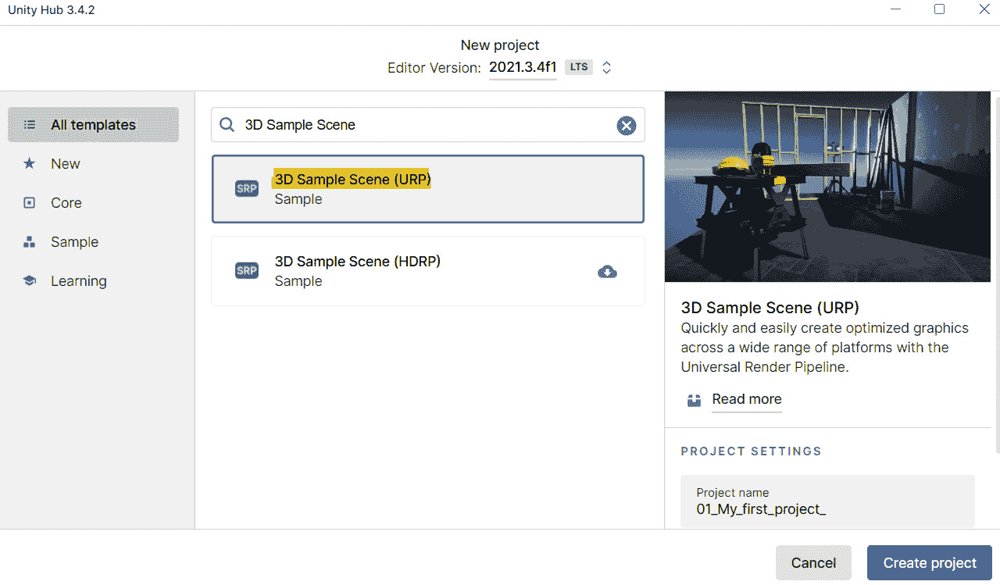

图 2.1 – 在 Unity Hub 中使用示例场景创建项目的方法

要将示例场景作为新项目加载，只需按照以下步骤操作：

1.  打开 Unity Hub 并转到**项目**标签页。

1.  点击**新建**按钮以创建一个新项目。

1.  选择**3D 示例场景（URP）**，给你的项目命名，并选择一个保存位置。对于这个项目，我们选择了**3D 示例场景（URP）**，因为它提供了一个预配置的环境，展示了**通用渲染管线**（**URP**）的功能，非常适合 Unity 新手或寻求参考的人。虽然标准的**3D（URP）**模板通常受到开发者的青睐，因为它提供了一个干净的起点，允许自定义设置，但他们通常通过包管理器或 Unity 资产商店导入额外的包或资产来增强这些项目。

1.  点击**创建**按钮以创建项目。

现在我们已经解决了这个问题，让我们来看看如何选择正确的渲染管线。

## 选择正确的渲染管线

在检查示例场景选项时，你可能已经注意到了 URP 和**高清渲染管线**（**HDRP**）之间的选择。但哪一个更好，渲染管线究竟是什么？本质上，渲染管线是一系列步骤和过程，它决定了引擎如何渲染图形。它将 3D 资产、光照和其他场景组件转换成最终出现在你屏幕上的 2D 图像。虽然 URP 和 HDRP 共享一些底层任务，但每个管线都是针对特定项目需求和目标平台定制的。

*表 2.1*显示了 URP 和 HDRP 如何相互比较：

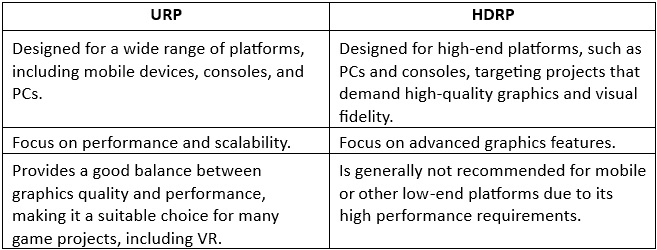

表 2.1 – URP 和 HDRP 的比较

一个舒适的 VR 体验需要高帧率，通常超过 90 FPS。URP 强调性能，确保在各种 VR 设备上，包括独立 VR 头戴式设备、基于 PC 的 VR 和移动 VR，都能保持流畅的帧率。随着市场上独立 VR 头戴式设备的数量不断增长，URP 因其适应性和项目优化的简便性而变得非常有价值。

虽然 URP 可能不具备 HDRP 的视觉能力，但它平衡了图形质量和性能，使其适合大多数对性能至关重要的 VR 项目。

Unity 的通用性不仅限于 HDRP 和 URP 管线，它还允许经验丰富的图形程序员创建自定义的**可脚本渲染管线**（**SRP**）管线。然而，开发自定义 SRP 管线需要深入了解 3D 图形编程、渲染管线和 C#语言的熟练度。对于那些缺乏这些技能的人来说，HDRP 和 URP 提供了灵活性和易用性之间的最佳平衡。

由于其众多优势，URP 成为了大多数 VR 项目的首选选择。在这本书中，我们将专注于 URP。然而，HDRP 对于追求高端 PC VR 体验的人来说仍然是一个值得考虑的竞争者。

在安装了 Unity、选择了渲染管线并且你的项目在你的指尖上时，是时候熟悉 Unity 编辑器了。

# 了解 Unity 编辑器和其界面

如果你刚开始使用 Unity，编辑器的界面一开始可能会有些令人不知所措。但别担心——我们将引导你通过 Unity 编辑器，并展示如何导航其各种菜单和面板。经验丰富的用户也可以通过保持对最新最佳实践和技术的新鲜感而受益，因为为 VR 设计会带来独特的挑战，可能需要与传统游戏开发不同的方法。

## 探索 Unity 界面

当你启动一个新的 Unity 项目时，你会看到 Unity 编辑器。这个多功能的 workspace 由几个称为面板的独立窗口组成。

*图 2.2*显示了刚刚创建的示例场景项目的窗口布局。

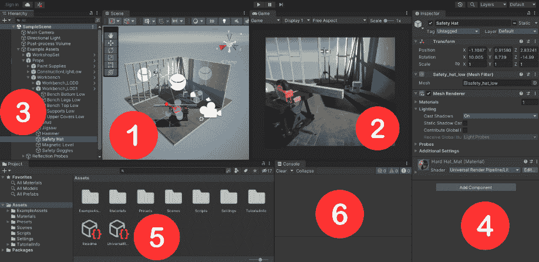

图 2.2 – 示例场景项目的窗口布局

*图 2.2* 展示了多个面板，包括：(*1*) **场景**视图，(*2*) **游戏**视图，(*3*) **层级**，(*4*) **检查器**，(*5*) **项目**，和(*6*) **控制台**。

让我们探索构成 Unity 界面的这些基本面板。

将**场景视图** (*1*) 想象成你的画布，你将在上面让你的游戏世界栩栩如生，创造迷人的景观，并将你的角色放置在奇幻的环境中。这个面板是游戏的核心，每个对象都被放置和排列，以讲述一个引人入胜的故事。例如，你可以在我们的示例场景中选择**安全帽**GameObject，并移动、旋转、缩放或删除它。

**游戏视图** (*2*) 是你可以从玩家视角体验游戏的地方。它提供了游戏玩法的实时预览，包括你实现的视觉渲染和用户界面元素。

**层级面板** (*3*) 或 **场景层级窗口** 是你游戏的设计蓝图，展示了构成你游戏世界的每个 GameObject 的有序列表。它就像一张建筑图纸，帮助你导航、管理和可视化游戏元素之间的关系，确保体验连贯且结构化。我们的示例场景展示了良好结构化的层级是什么样的。所有添加的 GameObject 都隶属于**示例资产**父对象。这包括**道具**GameObject，它本身也作为任何装饰场景并增加游戏世界细节和背景的 GameObject 或资产的父对象——例如，拼图、锤子、工作台等等。因此，请记住，将相关对象分组放在父 GameObject 下，可以更容易地管理和操作它们作为一个单一实体。此外，命名约定可以用来使层级更易于阅读和理解。

**检查器面板**（*4*）或**检查器窗口**是微调游戏元素的控制中心。在这里，您可以调整 GameObject 或资产的所有细微细节，确保您的游戏世界精确地符合您的设想。从位置和缩放到添加组件和修改脚本，**检查器**面板是您通往完美的通行证。让我们通过导航到**示例资产** | **道具** | **安全帽**在**场景层次结构**窗口中选择**安全帽**对象。**检查器**窗口显示了**安全帽**对象的所有定义组件。**变换**组件负责定位、旋转和缩放对象。您将在场景视图中找到它的 Gizmo 表示，这允许我们直接在那里变换对象。**检查器**窗口中还可以看到的其他两个组件是**网格过滤**和**网格渲染器**组件。**网格过滤**和**网格渲染器**组件提供了一种在场景中创建和显示 3D 模型的方法。**网格过滤**组件定义了模型的几何形状，而**网格渲染器**组件应用了如材质和纹理等视觉属性。没有这些组件，您在场景视图中将看不到对象。

**项目**面板（*5*）包含了您游戏的所有构建块，从**纹理**和模型到声音和脚本。它就像是一个资源库，其中每个导入或创建的资产都触手可及，等待在您的 XR 项目中使用。

最后，**控制台**面板（*6*）是一个重要的工具，在开发过程中帮助识别和解决问题。它提供详细的日志、警告和错误消息，允许进行高效的故障排除，并确保游戏性能的完整性。

您现在熟悉了 Unity 中的默认面板。接下来，我们将了解 Unity 网格和吸附系统，这在构建场景时是一个变革性的工具。

小贴士

您可以保持默认布局，或者使用 Unity 编辑器右上角的下拉菜单在**布局**下自定义您的面板。我们通常更喜欢 2x3 布局，但为了简单起见，本书中将使用默认布局。

## 使用网格和吸附系统

**Unity 网格和吸附系统**帮助在游戏环境中以更组织化的方式对齐和放置对象。它允许您将对象吸附到网格上，也可以吸附到其他对象上，以便更容易地进行放置和排列。

*图 2**.3*显示了您可以在哪里找到该系统。

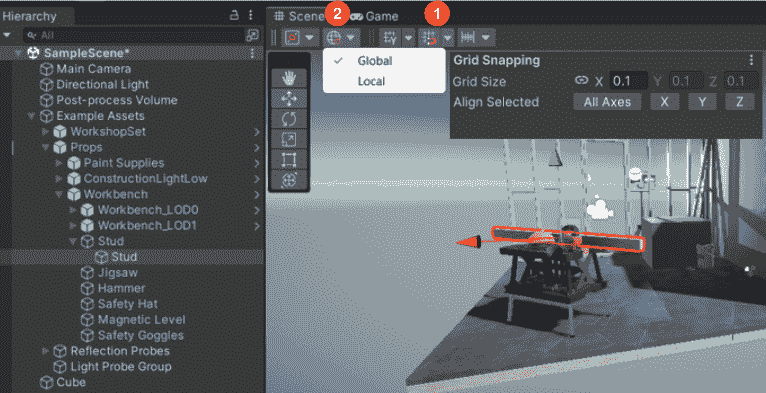

图 2.3 – 如何使用网格和吸附系统

要使用此系统，您需要启用**网格吸附**按钮，该按钮由一个带有网格和磁铁图标的图标表示（*1*）。此外，请确保通过选择位于**网格** **吸附**字段旁边的**全局**图标（*2*）来激活**全局**句柄。

所有三个轴（**X**、**Y**和**Z**）的`1`，意味着每个网格方格的宽度、高度和深度都是一单位。此设置可以根据需要调整，以匹配场景中对象的缩放。**网格大小**字段决定了对象吸附到网格的增量，因此较大的网格大小会导致更粗糙的吸附，而较小的网格大小会导致更精细的吸附。

你的回合

1. 选择与*图 2**.3*中相同的支架，并将其沿**Y**方向移动两个单位。激活**网格吸附**，并尝试不同的网格大小，将支架放回工作台上。

2. 通过在场景中移动、环绕和缩放来熟悉**场景**视图中的导航。以下文档可能对你有所帮助：[`docs.unity3d.com/510/Documentation/Manual/SceneViewNavigation.html`](https://docs.unity3d.com/510/Documentation/Manual/SceneViewNavigation.html))

3. 选择另外两个游戏对象，并按你的喜好移动、缩放和旋转它们。

# 理解游戏对象和组件

游戏对象和**组件**是 Unity 项目的核心构建模块，允许开发者创建交互性和动态内容。现在，我们将提供一个关于游戏对象和组件的全面概述，以及它们是如何协同工作的。

## 理解默认新场景

Unity 赋予开发者能够在编辑器内创建多个场景的能力。这一功能有助于管理复杂性、提升性能，并促进更模块化和可重用的游戏项目。要创建一个与我们的示例场景并列的新默认场景，请访问编辑器最上方的菜单，并选择名为你选择的`Scenes`文件夹。按照这些步骤操作后，你将看到一个包含**主摄像机**游戏对象和**方向光**游戏对象的 Unity 新场景。这两个游戏对象都位于**场景层次结构**窗口中，并在**场景**窗口中显示，该窗口具有无限参考地面网格。在 Unity 中，游戏对象是游戏场景的基础构建模块。它们代表可见或交互式元素，如角色、道具、光源或摄像机。每个游戏对象都有一个**变换**组件，它定义了其位置、旋转和缩放，并且可以通过添加额外的组件来增强**物理**、**碰撞检测**或**游戏逻辑**。

让我们创建我们的第一个 GameObject。请注意，虽然 Unity 主要是一个游戏引擎，但它确实提供了一些基本的建模能力。您可以使用 Unity 内置的 3D 对象**原语**创建简单的 3D 模型，或者导入在其他 3D 建模软件中创建的更复杂的模型。还有第三方插件可以进一步增强 Unity 的建模能力。然而，重要的是要记住，Unity 无法与专门的 3D 建模软件如*Blender*、*3ds Max*或*Maya*相提并论，它更适合创建和操作用于游戏开发的模型。

我们将首先创建一个平面原语作为我们的地板。为此，在`(0,0,0)`的默认位置右键单击，而是在不同的位置。默认情况下，新创建的对象被放置在`Ground`的激活对象下。

在`Ground`对象的**检查器**窗口中，您会注意到，除了负责 GameObject 视觉外观的**网格过滤器**和**网格渲染器**组件外，还有一个**网格碰撞器**组件。接下来，您将了解更多关于这个和其他类型碰撞器的信息。

## 添加碰撞器

**碰撞器**是定义对象形状的组件，用于确定场景中与其他对象的物理交互。Unity 中提供了几种类型的碰撞器，每种都有其特定的用途，如下所示：

+   **盒子碰撞器**：此类碰撞器定义了矩形形状，非常适合类似盒子的对象。

+   **球体碰撞器**：此类碰撞器定义了球形形状，非常适合圆形对象，例如球。

+   **胶囊碰撞器**：此类碰撞器是圆柱体和两个球体的组合，适用于形状像胶囊的对象，例如角色。

+   **网格碰撞器**：此类碰撞器根据对象的网格定义其形状，允许精确的碰撞检测。

+   **轮式碰撞器**：此类碰撞器专门为基于轮子的对象设计，例如车辆。它允许实现逼真的轮子和悬挂行为。

通过集成碰撞器组件，您可以定义对象与其他场景碰撞器之间的交互，例如反弹、停止或穿透。此外，碰撞器可以触发事件，例如在碰撞时激活声音效果。将碰撞器应用于地面是合理的，因为它建立了环境边界，并使场景中的其他对象能够进行逼真的交互，例如防止角色穿过地面。

组件是可变的工具，可以被分配给 GameObject，塑造其行为、外观和功能。考虑**主摄像机**，它配备了如**变换**（定义位置、旋转和缩放）和**摄像机**（指定如**视野**（**FOV**）和裁剪平面）等组件。同样，**方向光**GameObject 具有如**变换**和**灯光**等组件，这些组件决定了灯光的类型、颜色和强度，以及其他属性。

其他组件的例子包括用于引入基于物理行为的**刚体**，用于播放声音的**音频源**，以及用于制作如火焰、烟雾或魔法咒语等视觉效果**粒子系统**。每个组件都执行独特的功能，并显著影响你的游戏世界及其交互。

随着我们这本书的进展，我们将探索和利用一系列基本组件，从下一节开始，我们将为我们的初始基本场景注入生命。

# 在 Unity 中创建基本场景并添加对象

在本节中，我们将向您展示如何构建图*2**.4*中所示的场景，该场景集成了如原始形状、材质、预制件、光照和导入资源等元素。

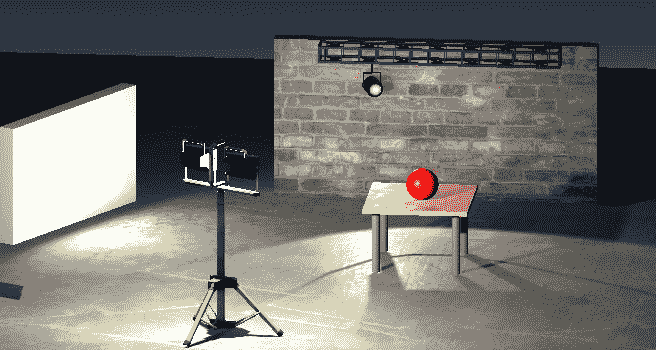

图 2.4 – 我们将要创建的基本场景

通过参与这个逐步教程，你将在组装一个美观的场景的同时，对这些核心概念有一个深入的了解。我们的初始任务包括使用原始形状制作一个表格。

## 使用原始形状构建桌子

如其名所示，原始形状是简单的几何形状，它们构成了我们场景中更复杂模型的构建块。想象一把椅子逐渐成形，一个立方体形成座位，两个圆柱体成为坚固的腿，另外两个圆柱体变成支撑的后腿。靠背是由一个平面制成的，其大小和位置完美地补充了座位和腿。

对于我们的场景，可以用类似的方式制作一个桌子——一个立方体作为桌面，而四个圆柱体则作为腿。应用纹理，使桌面和腿看起来更加逼真。调整每个原始形状的大小和位置，结果是一个看起来像是从现实世界中摘取的桌子。

要创建桌子，我们建议遵循图*2**.5*中所示的操作顺序。

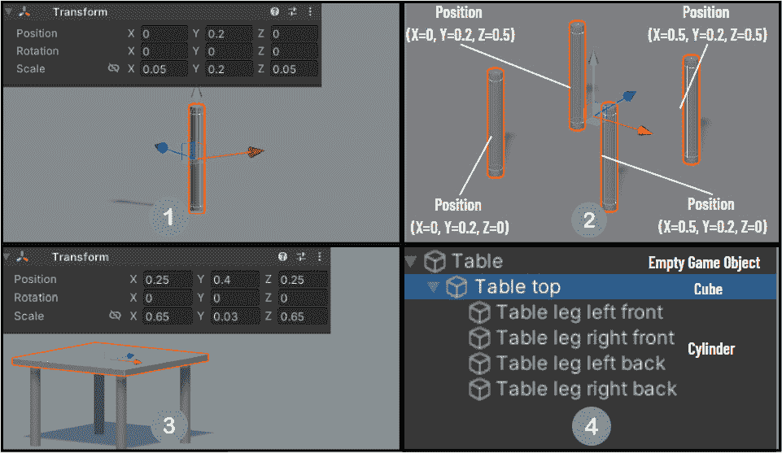

图 2.5 – 如何使用网格和吸附系统

要构建你的桌子，请按照以下步骤进行：

1.  通过将一个圆柱体引入场景来创建一个单独的桌腿。这可以通过在`0.05`, `0.2`, `0.05`)处右键单击并定位在(`0`, `0.2`, `0`)来实现。

1.  桌子需要四条相同的腿。为了实现这一点，通过复制（在**Scene Hierarchy**窗口中右键单击对象并点击**Copy**）和粘贴三次来复制原始腿。根据前面的参考图像，根据需要调整复制腿的位置。

1.  接下来，向场景添加一个**Cube**原始对象，该对象将作为桌面。调整立方体的缩放和位置，使其 resting on the table legs。为了更简单地实现缩放和定位，切换到**Wireframe**模式，如图*图 2**.6*所示。

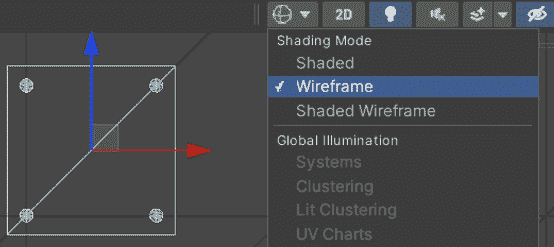

图 2.6 – 如何使用线框模式

小贴士

我们的建议是首先仅缩放**Y**值，并使用网格和吸附系统将立方体放置在腿上。随后，您可以切换视图从场景到顶部，并将**Shading**模式从**Shaded**更改为**Wireframe**。这种更改揭示了圆柱体和立方体，简化了缩放**X**和**Z**值以及定位**Cube**对象的任务。

1.  要组织桌子组件，创建一个嵌套的父子对象层次结构。首先，通过重命名`Table top`和圆柱体为相应的桌子腿来为对象分配适当的名称。随后，选择所有腿（*cmd*/*Ctrl* + 左键点击）。点击并拖动它们到`Table top`对象中的`Table top`对象上，建立父子关系。

1.  要进一步细化表格结构，通过选择`Table`创建一个空 GameObject。将`Table top`对象设置为`Table`对象的子对象。这样，就得到了一个由五个相互连接的原始对象组成的和谐结构的桌子。使用这种布局，可以轻松地缩放和移动桌子，无需单独选择每个 GameObject。

要完成场景，放置一个名为`Table`的球体原始对象。您可以为此使用前面讨论过的网格和吸附技术。为了获得更精致的外观，您可以自由地缩放球体。在下一节中，我们将使用材质增强`Table`和**Sphere**对象的外观。

## 如何更改地面、桌子和球体的外观

到目前为止，场景由一个地面和一个桌子组成，球体放在桌子上，所有这些都显示标准的灰色。让我们通过以下步骤创建一个新的红色材质来增强球体的外观：

1.  导航到`Assets` | `Materials`中的`Materials`文件夹。

1.  点击`Red Material`。

1.  在**Inspector**窗口中，选择**Base Map**字段旁边的白色方块。此操作将启动**Color**窗口。选择**#FF0000**十六进制代码。

1.  现在，您可以通过将`Red Material`材质拖放到**Sphere**对象上方来应用该材质。

现在，球体应该呈现红色。到目前为止，我们已经使用了最简单的材质形式，将简单的红色应用到球体几何形状上。

在创建 3D 游戏或应用程序中的物体材质时，通常需要在物体表面添加额外的细节和深度，而不仅仅是使用单个纹理所能达到的。这就是基础地图、金属地图、法线地图、高度地图和遮挡地图等地图发挥作用的地方。

让我们依次了解这些地图：

+   我们可以将材质指定为**红色材质**（Red Material）或者我们可以分配一个纹理（例如砖墙的图片）来定义物体表面的颜色和图案。

+   **金属地图**：金属地图定义了物体表面看起来应该是金属的程度，地图中白色区域看起来非常金属，而黑色区域看起来非金属。

+   **法线地图**：法线地图是一种纹理，定义了物体的表面法线向量，给表面带来额外的深度和细节的错觉。法线地图通常用于在物体的表面上创建凹凸、坑洼和其他小细节的外观，而不需要添加额外的几何形状。

+   **高度地图**：高度地图是一种黑白图像，定义了物体表面的高度。高度地图用于在表面上创建深度和立体感，例如地形上的山脉和山谷或指纹的脊和谷。

+   **遮挡地图**：遮挡地图是一种纹理，定义了物体的哪些部分被遮挡或隐藏在视线之外。遮挡地图用于创建阴影和环境遮挡的效果，通过使物体看起来能够投射阴影和具有深度，从而让物体看起来更加真实和有质感。

为了可视化这些地图，想象一张画有墙壁图片的纸张。**基础地图**将是墙上的油漆，**法线地图**将为表面添加凹凸感，**高度地图**将创造出深度和立体感，而**遮挡地图**将添加阴影效果。当这些地图结合在一起时，它们可以创建一个更加详细和逼真的墙壁表示。你可能已经注意到这个例子没有涵盖**金属地图**。你不需要为一种材质使用所有这些地图。选择使用哪些地图取决于所需的材质外观和想要达到的细节程度。例如，一个简单材质的平面单色物体可能只需要一个**基础地图**（或反照率颜色）来定义其外观。一个更复杂的材质，如具有复杂细节的金属物体，可能需要一个**基础地图**、**法线地图**、**高度地图**和**金属地图**来实现期望的外观。

创建地图可能是一个复杂且耗时的工作，尤其是对于复杂的物体。为了节省时间和精力，通常最好利用市场上现成的材质或模型，例如**Unity Asset Store**、**ArtStation**和**Sketchfab**。这些网站提供了丰富的免费内容供选择。

在我们的示例场景中，我们有各种预制的材质可供使用。让我们为桌面使用木质材质。以下是您需要做的：

1.  打开`Materials`文件夹（`Assets` | `ExampleAssets` | `Materials`）。

1.  搜索**OBS_Mat**材质并将其拖放到桌面的顶部。

现在，桌面应该显示出木质纹理，如图*图 2.7*所示。

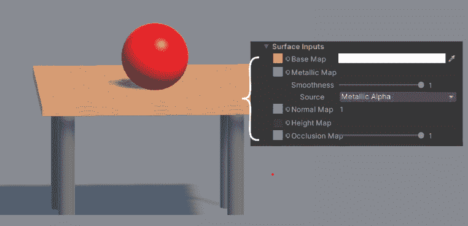

图 2.7 – 带有木质纹理的桌面

在**检查器**窗口中检查表面输入，木质材质包括基础图、金属图、法线图和遮挡图。要预览每个图，请*cmd*/*Ctrl* + 左键单击图旁边的相应方块。

让我们也为地面选择一个合适的材质。在`Materials`文件夹（`Assets` | `ExampleAssets` | `Materials`）中搜索**Ground_Mat**材质。将其拖放到地面上，现在表面应该看起来更加逼真。

接下来，您将学习如何在场景中创建砖墙材质。

## 创建砖墙材质

在前面的章节中，我们探讨了将红色漫反射颜色应用于球体以及使用更高级的材质为地面和桌子。值得注意的是，材质在确定表面渲染方式方面起着至关重要的作用，它不仅包括物体表面的纹理，还包括它与光源的交互。

纹理是应用于 3D 模型或 2D 表面以添加细节或颜色的图像。它可以被视为覆盖在物体表面的皮肤，以赋予它特定的外观或感觉。纹理可以在 Unity 中创建或从外部图像文件导入，然后分配给场景中 GameObject 应用的材质。这种技术增强了渲染对象的细节和真实感。

在本节中，我们将通过开发砖墙材质并将其应用于由变换后的立方体构建的墙壁，深入了解创建和应用更复杂材质的过程。按照以下步骤开始：

1.  让我们先在场景中插入一个新的立方体来创建墙壁，将其重命名为`Wall`，将其缩放为（`2`，`1`，`0.1`），并将其定位在（`0.2`，`0.5`，`1.8`）在桌子后面。

1.  导航到`Textures`中的`Assets`文件夹。

1.  为了使`Wall`立方体呈现出砖块般的外观，请下载并使用本书 GitHub 仓库中提供的`BrickWall.jpg`纹理文件，或者通过在线搜索找到合适的砖墙纹理。将图像导入新创建的`Textures`文件夹。这可以通过简单地从您的本地文件系统拖动图像并将其放入相应的 Unity 文件夹中完成。

1.  保持处于`Materials`文件夹中。在这里，生成一个新的材质并将其重命名为`Brick_Mat`。您可以通过在文件夹内右键单击，选择**创建**，然后选择**材质**来创建材质。

1.  在选择`Brick_Mat`材质后，导航到**检查器**窗口。寻找位于**基础贴图**字段旁边的较小**环状符号**并选择它。然后继续搜索并选择导入的**BrickWall**图像。

1.  最后一步是将`Brick_Mat`材质从**场景**窗口中现有的`Wall`立方体移动出来。这可以通过简单的拖放操作完成。

通过这些步骤，您的场景现在应该看起来与图*2.8*中所示相似。

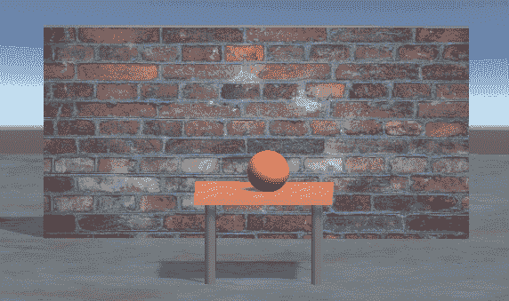

图 2.8 – 场景中的砖墙

您现在已经见证了材质在转换场景真实感方面的能力。在下一节中，我们将更详细地了解 Unity 场景的另一个重要组件：预制件。

## 解包预制件

在本节中，我们将学习如何将样本场景中的预制件转换为 Unity 中的普通 GameObject。预制件是可重复使用的预制对象，可以在场景中多次使用，类似于构建环境的积木。它们是保存在单独文件中的对象的副本，允许您创建多个实例并简化场景管理。

要导入预制件，导航到`Assets` | `ExampleAssets` | `Prefabs`。将**场景层次结构**窗口中的**ConstructionLight_Low**对象拖放到场景中。在**场景层次结构**窗口中，您会注意到一个蓝色立方体图标，表示它是一个预制件实例。

我们现在将解包**ConstructionLight_Low**对象，将其转换为普通 GameObject。在**场景层次结构**窗口中右键单击并选择**预制件** | **解包**。这样，对预制件的修改不会影响解包实例。请将其放置在砖墙前面。

重要的是要记住，在 Unity 中使用预制件在各种场景中都有优势，例如以下情况：

+   **重复的游戏对象**：通过一次创建一个对象，将其转换为预制件，并在需要时进行复制，可以节省时间和精力

+   **自定义游戏对象**：使用包含所有可能修改的预制件，更有效地管理自定义，根据需要调整实例

+   **模块化游戏设计**：通过为单个级别组件创建预制件并将它们组装成完整级别，促进模块化设计

在 Unity 中使用预制件有助于节省时间、管理复杂 GameObject 以及支持可适应的模块化游戏设计。接下来，我们将讨论如何从 Unity 资产商店导入资产。

## 从 Unity 资产商店导入

让我们学习如何导入和使用资产商店中可用的模型。Unity 资产商店是一个市场，用户可以在此处找到、购买和下载各种资产，包括 3D 模型、动画、音频、视觉效果等，用于他们的 Unity 项目。

这是如何从资产商店导入聚光灯模型的方法：

1.  打开你喜欢的网络浏览器，导航到 Unity 资产商店[`assetstore.unity.com/`](https://assetstore.unity.com/)。在这里，在搜索栏中输入`Spotlight and Structure`。或者，你可以直接通过[`assetstore.unity.com/packages/3d/props/interior/spotlight-and-structure-141453`](https://assetstore.unity.com/packages/3d/props/interior/spotlight-and-structure-141453)访问包页面。

1.  一旦将包添加到你的资产中，寻找**在 Unity 中打开**按钮并点击它。

1.  Unity 应用应该会打开，提示导入包。进行**导入**操作。

1.  成功导入后，导航到`Assets` | `SpaceZeta_Spotlight` | `Assets`目录下的包目录。

1.  将`Spotlight.fbx`和`SpotlightStructure1.fbx`文件拖入场景并解包（右键单击，然后选择**预制体** | **解包**）。

如果物体呈现品红色，这通常表明相关的材料要么不存在，要么与当前使用的渲染管线不兼容。要解决这个问题，请在**检查器**窗口中选择**聚光灯**，并将着色器更改为**通用渲染管线** | **Lit**。

如果你的`Spotlight_basecolor.png`、`Spotlight_roughness.png`、`Spotlight_normal.png`和`Spotlight_emission.png`文件。

现在，根据*图 2.9*所示，将你的`BrickWallLight`和`BrickWallLightStructure`进行变换。

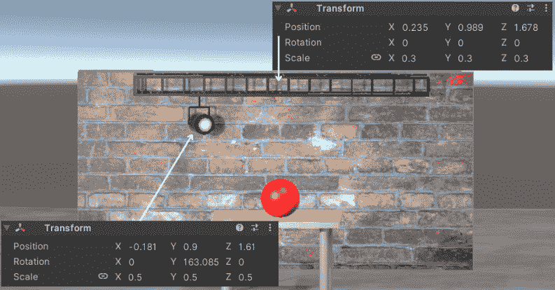

图 2.9 – 导入的 BrickWallLight 模型及其 BrickWallLightStructure 模型

你可以使用相同的程序来查找和导入你场景所需的其它 3D 模型、动画、音频和视觉效果。与刚刚导入的`BrickWallLight`模型一致，下一节将处理照明的最关键方面。

## 理解 Unity 的照明管线

在实施项目之前考虑的一个关键方面是规划照明。在这里，我们介绍了一种经过验证的方法，这种方法多年来一直在各种 XR 项目中提供了卓越的照明效果，并与 Unity 的最佳实践照明管线紧密一致([`docs.unity3d.com/Manual/BestPracticeLightingPipelines.html`](https://docs.unity3d.com/Manual/BestPracticeLightingPipelines.html))。此过程包括三个主要步骤，如*图 2.10*所示。

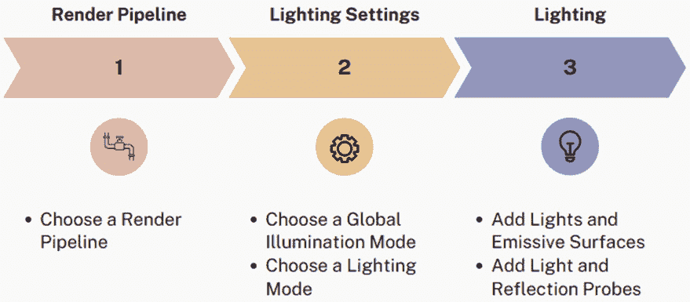

图 2.10 – Unity 的最佳实践照明管线

为你的项目选择合适的渲染管线是整体照明管线流程的第一步。如*表 2.1*中所述，我们建议对于 XR 项目使用 URP，这为有效的照明奠定了基础。

照明管道的第二步是通过选择合适的**全局照明（GI）系统**和相应的**照明模式**来确定如何生成**间接照明**。

想象一下在一个阳光明媚的日子里，只有一个窗户的房间。直射光就像通过窗户直接进入房间的明亮阳光——如果你站在窗户的路径上，这就是你直接感受到的光。这与我们在 Unity 中说的直射光类似。

现在，看看房间的角落或不在窗户正前方的地方。它们并不是完全黑暗的，对吧？它们被照亮了，但不是那么明亮。这是因为进入的阳光击中了不同的表面——地板、墙壁或家具——并反射到这些部分。这就是我们所说的间接照明。

Unity 中的 GI 系统模仿了光线在房间中反弹的规则。它是计算光线根据其击中表面的反射量到达房间较暗部分的系统。

最后，Unity 中的照明模式类似于选择房间中的表面类型。是光滑、反光的 marble 地板还是暗淡、哑光的木地板？根据您的选择，光线会以不同的方式反射并以独特的方式照亮房间。这就是照明模式控制的内容——它决定了光线如何与不同的表面相互作用，以在游戏场景中创建整体照明效果。

根据 GI 设置调整到您项目的需求，现在是时候释放您的艺术想象力了。照明管道的最后一步是将灯光、发射表面、反射探针和灯光探针整合到您的场景中，以和谐地编织场景的照明。通过遵循这种方法，您将构建一个统一且详细的照明环境，增强虚拟空间的真实感和参与度，并确保高质量的用户体验。

现在，是时候将照明管道的步骤应用到我们的场景中了。由于 URP 已经为您的项目选择，让我们继续到照明管道的第二阶段。在这里，我们将专注于理解和选择适合您场景的适当照明设置。这一关键步骤确保您的虚拟世界得到有效的照明。

## 选择正确的照明设置

由于您已为您的 XR 项目选择了 URP，接下来的任务是配置间接照明。这个过程包括选择一个合适的 GI 系统和照明模式。**GI**模仿 3D 环境中的间接光，导致柔和的阴影和自然的外观，因为光线在物体和表面之间反弹。

对于简单的移动 XR 场景，**减法模式**是最具性能的选项，它依赖于预先计算的光图来最小化**GPU**负载并提高性能。**阴影遮罩**模式紧随其后，提供**实时照明**和静态对象的烘焙阴影，通过减少 GPU 负载并使用预先计算阴影来在视觉效果和性能之间取得平衡。另外，**烘焙间接照明**模式提供了实时照明、阴影和烘焙间接照明的理想组合，适用于高质量的 XR 视觉效果。

要设置间接照明，导航到`Assets`文件夹，其中可以重命名。我们建议默认选择**混合照明**，在**照明**设置窗口中启用**烘焙全局照明**选项。对于照明模式，**阴影遮罩**在质量和性能之间提供了最佳平衡。

小贴士

虽然**烘焙全局照明**允许自动生成光图，但我们建议不要这样做。相反，在测试场景或实施更改后手动生成光图，因为它提供了测试不同照明场景和迭代设计的灵活性，而无需承受不断自动更新的开销。

在确定这些之后，你可以继续在你的场景中放置光源对象。

## 添加光源和天空盒

**Unity 中的轻量级对象**是创建沉浸式和逼真环境的重要组成部分。你可以选择多种不同的光源对象，包括点光源、聚光灯、方向光和区域光。它们可以被归类为**直接照明**，这指的是直接从光源发出的光线。让我们更详细地看看每种光源对象。

**点光源**从单个点均匀地发出光线，非常适合局部光源，如灯具和蜡烛。**聚光灯**以圆锥形投射光线，非常适合方向光源，如手电筒和车灯。**方向光**以单一方向投射光线，类似于太阳或月亮，而**区域光**从特定区域散布光线，类似于天花板灯板。

每种光源类型都有其独特的属性，当它们组合在一起时，可以产生不同的照明效果。理解这些光源类型是实现 Unity 中有效照明的关键。

首先，在**场景层次结构**窗口中选择**方向光**GameObject，并在其**检查器**窗口顶部取消勾选复选框。你会观察到它对场景照明的显著影响。然而，你可能好奇为什么场景比预期的更亮——原因在于激活的**天空盒**。

在 Unity 中，天空盒充当场景的背景，环绕场景，赋予环境感和深度，类似于现实生活中的天空和周围景观。天空盒是通过将特定材质应用于包围场景的大立方体来创建的，这个立方体始终出现在所有其他元素之后。这个立方体产生了天空和环境延伸到场景实际边界之外的错觉。

天空盒在间接照明中扮演着至关重要的角色，因为它们影响场景的整体照明氛围。例如，晴朗的天空和炽热的太阳在场景上投射出温暖的光线，营造出欢迎和邀请的氛围。相反，一个有满月的天空投射出凉爽的蓝色光线，营造出更加诡异和神秘的氛围。Unity 中其他间接照明的例子包括全局光照（GI）、环境光和光照贴图，它们都为最终的视觉体验做出了贡献。

让我们按照以下步骤创建并应用一个完全黑暗的天空盒：

1.  要创建一个新的材质，导航到**项目**窗口中的`Materials`文件夹。右键单击并选择**创建** | **材质**。

1.  将新材质命名为`DarkSkybox_Mat`并选择它，以在**检查器**窗口中查看其属性。

1.  通过转到**天空盒** | **程序化**来选择着色器类型，并保持默认设置。

1.  将新的**天空盒**材质拖放到天空上。

你的场景现在应该类似于*图 2.11*中所示的场景。

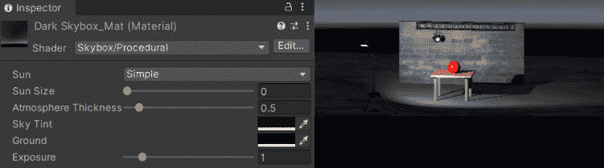

图 2.11 – 应用到场景中的天空盒

现在，你可以看到场景中的元素之所以可见，仅仅是因为从**ConstructionLightLow**对象发出的激活聚光灯。由于间接照明条件的影响已被消除，现在是时候尝试剩余的不同光照类型了。

首先，选择**ConstructionLightLow**对象的**Spot Light**子对象，然后转到**检查器**窗口。在这里，将光照类型更改为**点光源**，虽然它并不完全适合建筑灯光，但可以用来说明行为的变化。点光源，正如你所看到的，向所有方向辐射其亮度，与聚光灯的聚焦光束不同。

现在，让我们让导入的`BrickWallLight`对象充满生机。要做到这一点，向其现有的子对象添加一个空子对象。将其重命名为`Light`，然后选择`Light`。选择**聚光灯**作为类型后，你可以自由调整**位置**、**颜色**、**强度**和其他参数。为了见证你创作的影响的全貌，暂时禁用**ConstructionLightLow**对象。

最后，我们来到了光照类型中的最后一个未知领域——区域光源。*图 2.12*展示了将区域光源融入我们的场景，将其提升到新的亮度高度。

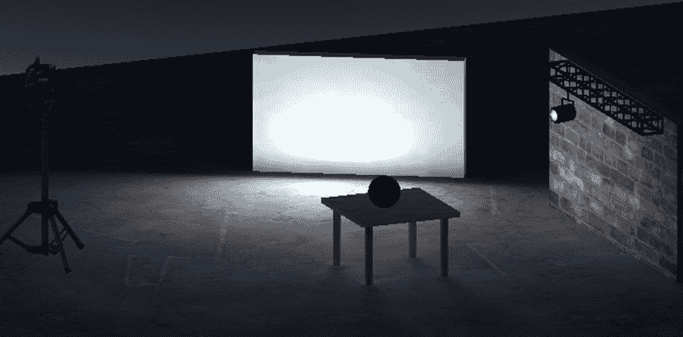

**图 2.12** – 区域光源照亮场景

要在你的场景中添加区域光源，请按照以下步骤操作：

1.  添加一个 `1.3`，`0.75`，`0.1`），并更改其 **位置** 和 **旋转** 参数，使其大致与 *图 2**.12* 中显示的白色立方体光源对齐。

1.  将对象命名为 `Cube Light`。

1.  创建一个空子对象。右键单击并选择 `Area Light`。

1.  在 `Light` 中，现在你可以找到将灯光类型更改为 **区域（仅烘焙）** 的选项。通过在 **检查器** 窗口中取消选中相应的复选框，暂时熄灭场景中所有其他光源。你可能观察到场景陷入黑暗，区域光源似乎无法履行其照明职责。

Unity 提供了两种照明系统：**实时照明** 和 **预计算照明**。实时照明动态地照亮场景，随着玩家在环境中的移动而变化。相比之下，预计算照明在游戏开始前计算场景的亮度，提供稳定且优化的照明体验。第三种混合照明模式结合了两者之长，允许灵活地确定场景的哪些部分使用实时和预计算照明。

区域光源仅允许预计算光照，这要求我们首先烘焙光照贴图，并将其 **发射表面** 分配给被光照照亮的游戏对象。烘焙光照贴图涉及预先计算光照数据并将其存储在纹理中，优化场景在运行时的光照。烘焙是一个一次性过程，仅在光照条件改变时重复。

首先，确定受 `Area Light` 影响的游戏对象，例如 `Wall` 对象和 `Cube Light` 对象本身，并在 **检查器** 窗口中激活它们的 **静态** 复选框。接下来，通过导航到 **窗口** | **渲染** | **照明**，切换到 **烘焙光照贴图** 选项卡，来烘焙光照贴图。点击 **生成光照** 以查看转换。

注意，只有 `Wall` 对象看起来在发光，而 `Cube Light` 对象没有。这是因为没有对象来反射其光线，就像下面的 `Ground` 对象一样。

为了增强场景，关注 `Ground`，`BrickWallLight`，`BrickWallLightStructure` 对象及其相应的子对象。启用它们的 **静态** 复选框，并再次烘焙光照贴图。观察场景的转换。

**图 2**.13 强调了使用发射表面与区域光源一起使用时的差异。

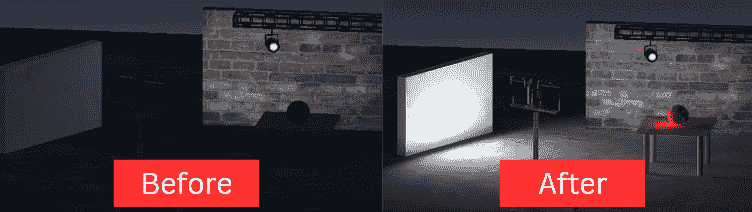

**图 2.13** – 区域光源发射表面的影响

**图 2**.13 的左侧图像仅展示了墙面和区域光源作为发射表面，而右侧图像则包含了多个游戏对象，从而带来更加动态、视觉上更具吸引力的体验。

让我们重新激活`BrickWallLight`和**ConstructionLightLow**对象的灯光。通过这样做，我们遵循混合光照的原则，结合了实时和预计算光照的优点。结果，场景中的对象以和谐的方式被照亮。

作为一名 XR 开发者，光照的选择反映了你的艺术视野和场景的需求。实时光照以其动态性吸引人，预计算光照以其稳定性著称，混合光照则以其多功能性迷人。在本章的最后部分，我们将介绍光照和反射探针。

## 探索光照和反射探针

最后，让我们通过重新访问**SampleScene**对象来深入了解**反射探针**和**光照探针**。要访问它，请在**项目**窗口中导航到**资产** | **场景**，然后双击**SampleScene**对象。

在 Unity 中，反射探针和光照探针有助于在场景中创建逼真的光照和反射效果。反射探针从周围环境中捕获反射数据并将其应用于场景中的对象。通过捕获环境的 360 度视图并将其存储为立方体贴图，反射探针能够在场景中的反射表面上实现精确的反射。例如，如果你想在游戏中让一辆闪亮的汽车反射附近的树木和天空，你可以在汽车附近放置一个反射探针来收集环境数据并将其应用于汽车的反射。

相反，光照探针从周围环境中捕获光照数据并将其应用于场景中的对象。通过在场景中的不同位置放置探针，它们收集光照信息并将其存储为纹理。然后，这个纹理被用来为场景中的对象提供逼真的光照。例如，如果一个角色站在森林中，你可以在角色周围放置光照探针来捕获树木的光照信息并将其应用于角色的皮肤。

在**场景层次结构**窗口中检查**SampleScene**对象，我们可以看到它包含三个反射探针和一个包含多个光照探针的光照探针组。*图 2.14*中的图像展示了所选反射探针（左侧）和光照探针（右侧）的外观。

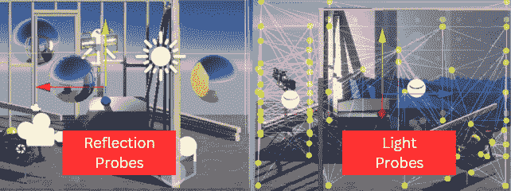

图 2.14 – 样场景中的反射和光照探针

从本质上讲，在场景中不使用反射探针和光照探针可能会导致光照和反射效果不够真实。然而，如果你的场景中没有高度反光的物体，或者光照主要是均匀的，移除探针可能不会在最终结果中产生明显的差异。对于这个**SampleScene**对象来说，这种情况很可能成立。

如所示，反射和光照探针是显著增强 Unity 场景真实感的有力工具。然而，在简单的场景中，它们的使用并不总是必需或明显的，因为 Unity 内置的光照贴图技术擅长在没有探针的情况下近似光照和反射。

掌握了这些原则，你就有能力创建沉浸式和视觉上引人入胜的 XR 体验。

# 摘要

在本章中，你构建了一个基本场景，熟悉了 Unity 编辑器，开始学习如何将资产导入到自己的项目中，并介绍了照明的关键方面。

你通过 Unity Hub 安装 Unity 并使用 URP 创建一个带有示例场景的新项目开始了这段旅程。然后，你探索了 Unity 编辑器的基础，例如导航其众多窗口和利用场景编辑选项，包括网格和吸附。此外，你深入研究了 GameObject 及其组件，例如碰撞体。

此后，你制作了自己的基本场景，包括地面平面、砖墙和一个支撑球体的桌子。在这个过程中，你发现了材质的强大作用，应用了一些材质，并使用导入的图像作为纹理设计了你自己高级的砖墙材质。你还考察了预制件的有用性，并学习了如何将它们转换为常规 GameObject。

此外，你通过在资产商店中搜索并导入聚光灯来理解导入资产的重要性，解决了由于渲染管线不兼容可能出现的潜在问题。最后，你深入研究了照明、理解和实施 Unity 最佳实践照明管线的基本场景。在这个过程中，你确定了理想的渲染管线，选择了正确的照明设置，并试验了各种灯光，包括点光源、聚光灯、方向光源和区域光源。你还使用了天空盒，并熟悉了光照和反射探针。

在这个坚实的基础之上，你现在准备深入 Unity，创建越来越复杂和引人入胜的场景。在下一章中，我们将构建我们的第一个 VR 场景，部署它，并在各种 VR 头盔或模拟器上测试它，进一步扩展你对 Unity 的理解和掌握。

# 第二部分 – 使用自定义逻辑、动画、物理、声音和视觉效果进行交互式 XR 应用

在本书的第一部分深入 Unity 引擎的复杂性并探索各种 XR 技术之后，本部分涵盖了 XR 开发的全部基本要素，将你的技能从初学者提升到中级水平。在本部分中，你将掌握创建你的第一个 VR 和 AR 体验，包括将应用部署到不同设备，并使用模拟器进行测试，而无需特定的 VR 头盔或智能手机。一旦你对创建和部署基本的 XR 场景有了扎实的理解，你将进步到开发更高级的 XR 应用。

你将为你的 XR 应用添加交互性，利用无代码选项，如按钮点击，并通过 C#脚本深入更复杂的逻辑。虽然这部分包含许多代码片段，但请放心——我们将以初学者友好的方式解释 C#。此外，你还将了解如何通过结合声音和粒子效果来增强你的 XR 场景的真实感，同时确保这些物理现象遵循现实世界的物理定律。

本部分包含以下章节：

+   *第三章*，*Unity 中的 VR 开发*

+   *第四章*，*Unity 中的 AR 开发*

+   *第五章*，*构建交互式 VR 体验*

+   *第六章*，*构建交互式 AR 体验*

+   *第七章*，*添加声音和视觉效果*
