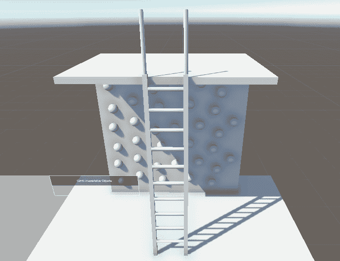

# Unity 中的 VR 开发

让我们探索 VR 的世界，从在 Unity 中创建你的第一个 VR 项目到在头戴式设备或模拟器上部署我们的第一个 VR 场景。在本章中，我们将介绍 Unity 中可用的最重要的 VR 工具包和插件，帮助你熟悉每个的功能。

你将通过 **XR Interaction Toolkit** 的演示场景获得实际操作经验，了解其最重要的组件和脚本，并学习如何在未来的 VR 项目中使用它们。我们将帮助你理解 VR 开发与传统游戏开发之间的细微差别，以及分享确保 VR 头盔计算能力的不同策略。

本章中你将获得的重要技能之一是学习如何在各种设备上测试和部署 VR 体验，从模拟器到 VR 头盔。本章将为你提供一个坚实的基础，为你提供创建越来越复杂和沉浸式 VR 场景所需的必要技能和知识。

我们将在接下来的内容中涵盖以下主题：

+   什么是 VR 开发？

+   在 Unity 中设置 VR 项目和 XR Interaction Toolkit

+   探索 XR Interaction Toolkit 演示场景

+   将 VR 体验部署和测试到不同的 VR 平台或模拟器

# 技术要求

为了有效地跟随本章关于 Unity 中 VR 开发的说明，拥有适当的硬件和软件设置至关重要。为了获得最有效和无缝的体验，我们强烈建议使用 Windows PC 或坚固的 Windows 笔记本电脑，即使你的目标平台是独立 VR 头盔。

## Windows

Windows 是大多数 VR 头盔制造商，包括 **Meta Quest** 和 **HTC**，支持的平台。这种支持源于 Windows 对硬件的全面支持以及其对游戏的优化。无论你是为 PC 绑定式还是独立 VR 头盔开发，Windows 环境将为 Unity 中的 VR 开发提供最丰富的资源和兼容性。

为了获得流畅的体验，我们建议以下最低要求：

+   操作系统：Windows 10 或更高版本

+   处理器：Intel i5-4590/AMD Ryzen 5 1500X 或更高

+   内存：8 GB RAM 或更多

+   图形：NVIDIA GTX 1060/AMD Radeon RX 480 或更高

## macOS

虽然 macOS 很少被 VR 头盔支持，但 Unity 仍然可以通过 ARKit 等平台在苹果设备上实现 VR 开发，这些平台主要针对 AR 而不是 VR。如果你正在使用 macOS 并针对独立 VR 头盔进行开发，考虑通过 **Boot Camp** 设置 Windows 分区，这允许你使用任何兼容 Windows 的 VR 头盔。这种设置将使你能够无重大问题地跟随本章中的说明。

## Linux

Linux 对 VR 的支持相对有限，但**Valve**通过 SteamVR 在 Linux 平台上扩展了对**Valve Index**和**HTC Vive**头戴设备的支持。如果你针对的是如**Oculus Quest**这样的独立 VR 头戴设备，可以通过在 Unity 中创建 VR 应用程序的 Android 版本来进行 Linux 平台上的开发，然后将这些构建转移到头戴设备上进行测试。然而，独立 VR 头戴设备通常运行 Android 版本而不是 Linux，这可能会带来独特的挑战。

如果你正在使用 Linux 平台，请确保你的系统满足以下最低要求：

+   操作系统：Ubuntu 18.04 LTS 或更新版本

+   处理器：双核 CPU 带超线程技术

+   内存：8 GB RAM 或更高

+   图形：Nvidia GeForce GTX 970，AMD RX480

# 什么是 VR 开发？

当开始 Unity 中 VR 开发的迷人旅程时，了解 VR 开发的特性和独特之处非常重要。这包括欣赏软件和硬件限制，以及该领域存在的挑战。在接下来的章节中，我们将深入探讨 VR 开发和传统 2D 计算机屏幕游戏开发的差异。

此外，我们将探讨 VR 头戴设备技术的当前轨迹和未来趋势。这种探索包括每个 VR 头戴设备带来的独特优缺点。这种理解至关重要，因为它不仅指导你做出明智的选择，选择适合你需求的 VR 头戴设备，还使你具备判断在特定情境下哪种 VR 头戴设备理想或不理想所必需的知识。

到本节结束时，你将具备充分的知识和技能，以在 Unity 中导航沉浸式和动态的 VR 开发世界。

## 探索经典游戏与 VR 游戏开发的差异

经典游戏开发和 VR 开发，尽管存在于游戏光谱的不同端点，但它们都源于创造沉浸式、虚拟景观的相同愿望。有趣的是，这两个类别不仅共享吸引观众的共同目标，它们还建立在类似的游戏设计基础元素之上，并需要相应的工具集。

游戏创作的两个领域都要求仔细规划和考虑游戏玩法机制、用户界面、目标、关卡和剧情。开发者，无论是从事传统游戏还是 VR 项目，通常使用相同的编程语言套件，如 C++、C#或 Python 进行脚本编写。

**游戏资产**（纹理、模型、动画和声音）的创建是这两个领域的另一个共同点。VR 开发可能略微偏向于 3D 模型和空间音频，以丰富环境的沉浸感。然而，创建和整合这些资产的整体过程在两个学科中仍然是一致的。无论游戏媒介是 2D 屏幕还是 VR 头盔，实现逼真的物理效果对于沉浸式体验至关重要。

虽然它们有这些相似之处，但经典游戏开发和 VR 开发之间的差异同样引人入胜，这主要归因于 VR 的独特性质和能力。

其中一个显著的对比在于设计的维度。经典 2D 游戏主要在一个平面上运行，其中物体以二维形式呈现：高度和宽度。《超级马里奥兄弟》就是一个经典的例子，其动作从左到右展开，角色的移动主要限制在这个平面上。

相反，VR 游戏将深度作为一个重要的第三维度引入游戏，从而使用户能够从任何角度或位置探索场景，类似于他们在现实世界中的体验。例如，在*Beat Saber*这样的 VR 游戏中，玩家可以四处张望，伸手，并以模仿现实世界空间交互的方式与游戏环境互动。

这些微妙但影响深远的不同为经典游戏开发和 VR 开发中的各种体验铺平了道路，每种体验都有其独特的魅力和挑战。

同样重要的是，玩家移动的范围在经典 2D 游戏和 VR 游戏体验之间表现出明显的区别。传统的 2D 游戏通常将玩家的动作限制在*x*和*y*轴上，将移动限制在一定的平面上。相反，VR 引入了不同程度的自由度。

例如，**三个自由度**（**3DoF**）设备，通常与**移动 VR**解决方案如*Google Cardboard*搭配使用，允许用户自由地四处张望（俯仰、偏航和翻滚），但不会跟踪空间内的物理位移。这提供了一种基本的沉浸感，使用户能够站在原地从多个角度观看场景或物体。

进一步深入 VR 领域的是**六自由度**（**6DoF**）设备。这些设备不仅跟踪玩家的视角，还能记录他们在*x*、*y*和*z*轴上的物理移动，从而创造一个更加沉浸和互动的环境。为 6DoF 创造体验可能相当复杂，需要完整的 3D 空间交互。例如，现代 VR 头戴设备如*Meta Quest 2*与 VR 控制器配对，甚至提供手势追踪功能。用户可以以极其直观的方式与虚拟世界交互，按按钮、转动双手，进行一系列动作，VR 头戴设备上 AI 驱动的摄像头能够准确捕捉并实时翻译这些动作。

**玩家安全**的重要性是区分 VR 开发与传统游戏制作的独特方面。虽然物理安全问题是经典 2D 游戏开发中几乎不存在的，但 VR 中运动范围的扩大可能导致现实世界的意外。因此，开发者需要设计安全特性，如虚拟边界或警报系统，以防止事故发生。

最终的区分因素在于**玩家习惯**。经典的 2D 游戏通常依赖于玩家对标准游戏控制和机制的熟悉度——考虑到 PC 在日常生活中的普及，这是一个安全的假设。然而，VR 往往开创了新颖的交互形式，可能会让初次用户感到困惑。为了弥合这一差距，开发者可能需要整合教程或指南来帮助玩家导航并交互 VR 游戏世界。

VR 开发不仅与传统游戏制作有显著差异，而且展示了为 VR 头戴设备供电的更广泛的技术范围。这些多样化的方法对于 VR 技术的运行至关重要，将在下一节中揭晓。

## 理解为 VR 头戴设备供电的不同方法

虚拟现实头戴设备的功率可以显著影响你 VR 应用的成败。让我们深入了解其中最常见的情况。

### PC VR（也称为基于 PC 的 VR 或有线 VR 头戴设备）

**基于 PC 的 VR 头戴设备**，包括如*Valve Index*和*HTC Vive Pro*等型号，依赖于台式机或笔记本电脑的计算能力。它们将繁重的工作，如密集计算、图形渲染和 3D 模拟，委托给连接的电脑。时至今日，相当一部分 VR 头戴设备要么完全是基于 PC 的，要么在独立版本之外还支持 PC VR 模式。这主要是因为 PC VR，得益于 PC 卓越的计算能力和图形能力，提供了最丰富和沉浸式的 VR 体验。在基于 PC 的 VR 中，细节级别、帧率和响应速度都是一流的。

基于 PC 的 VR 系统主要采用两种连接方式将 VR 头盔与电脑连接。有线电缆连接通常使用 HDMI 或 DisplayPort 进行视频传输，USB 进行数据传输，这是传统的连接方式。一种较新的创新是无线连接，例如*Meta Quest*系列中的*Air Link*连接。然而，由于无线 PC VR 连接的延迟较高，可能会影响 VR 体验的响应速度，因此在现实中很少使用。视频质量也会根据网络条件而波动，需要强大的稳定 Wi-Fi 信号才能实现最佳操作。

尽管无线连接方便，但为了获得无缝的 VR 体验，即使头戴式设备支持无线连接，有线连接仍然是首选。然而，需要注意的是，有线 PC VR 系统由于物理连接到电脑，牺牲了便携性。无论选择有线还是无线，VR 设置的移动性都受到限制。例如，你无法轻松地将 VR 头盔打包用于度假、活动、会议或朋友的聚会。如果你决定携带 VR 设备，则需要携带一台强大的电脑或确保目的地有所需的计算资源。加上高性能或游戏电脑可能高昂的价格，这可能会使 PC VR 系统对某些用户来说是一项重大投资。

### 独立式 VR 头盔

针对基于 PC 的 VR 头盔的局限性，**独立式 VR 设备**在市场上引起了轰动，获得了巨大的流行度。处于领先地位的是*Meta Quest*系列。这些设备将所有必要的计算组件都集成在头戴式设备中，使其成为独立的单元。大多数现代独立式头戴式设备由*Qualcomm Snapdragon*芯片驱动，提供强大的处理能力。

独立式 VR 头盔推崇便携性和自由移动，消除了连接到单独计算设备的需要。这些一体化系统为基于 PC 的 VR 提供了一种经济实惠的替代方案。此外，许多独立式头戴式设备，如*Meta Quest*系列中的设备，支持 PC VR 模式，提供了在需要时处理更密集计算应用（如*Half-Life Alyx*）的灵活性。

然而，一个缺点是独立式头盔的电池寿命相对较短，通常最多只能使用两个小时。尽管如此，也存在一些补救措施，例如购买配备额外电池寿命延长器的舒适头带。在大多数情况下，我们推荐更经济实惠的独立式头盔，如*Meta Quest*系列，而不是基于 PC 的头盔。在学术和商业环境中，独立式头盔是一个高效的选择。简单的解决方案，如购买多个独立式头盔或一套增强电池寿命的头带，与传统 PC VR 解决方案相比，仍然可以节省大量费用。在活动或会议中使用独立式 VR 头盔展示产品或研究时，它们也表现出色，提供了一种方便且便携的解决方案。

### 基于控制台（Console-based）的 VR 头盔

**基于控制台的 VR 头盔**，如*PlayStation VR 2*，主要针对游戏社区。它们利用游戏控制台的处理能力，提供高质量的 VR 体验，无需单独的 PC。然而，拥有游戏控制台的成本并不低。此外，就像它们的 PC 基对手一样，由于它们的连接性质，基于控制台的 VR 头盔牺牲了便携性。VR 体验的质量也可能受到控制台能力的限制。总的来说，除非你的主要关注点是游戏，否则基于控制台的 VR 头盔可能不是在个人、商业或学术环境中创建 VR 体验的最佳选择。即使在游戏圈中，也可能有更好的选择可以考虑。

### 基于智能手机的 VR 头盔

**基于智能手机的 VR 头盔**，例如*Google Cardboard*和*Samsung Gear VR*，利用了智能手机的显示和计算能力，这些设备是大多数人已经拥有的。这些头盔提供了一种经济实惠且高度便携的解决方案。然而，由于它们的计算和图形能力有限，它们提供的沉浸式体验本质上会降低。此外，由于与其他 VR 头盔类型相比传感器范围更窄，它们在 VR 环境中的交互能力也受到限制。因此，我们很少推荐它们。即使在没有 VR 头盔的情况下进行 VR 体验的初步测试，Unity 的 XR 设备模拟器等工具也提供了一种免费、方便甚至更优的解决方案。

### 基于云的 VR 头盔

虚拟现实（VR）社区中越来越多的声音正在倡导开发**基于云的 VR 头盔**。这项新兴技术利用强大的服务器来承担计算任务，通过互联网将结果流式传输到 VR 头盔。这种安排有可能在不依赖于本地计算能力的情况下提供高分辨率的 VR 体验，从而进一步增强沉浸感和用户满意度。

基于云的方法可以使 VR 头戴设备更轻便、更易于使用，吸引更广泛的受众投资自己的 VR 硬件。另一个吸引人的方面是，为 VR 头戴设备提供动力的数据中心中的硬件可以由提供商定期升级，从而避免用户频繁投资新设备。

那么，为什么这种计算方法在当代 VR 头戴设备中并不普遍呢？主要原因是需要一个稳定、高带宽、低延迟的互联网连接——这是一个并非普遍可用的先决条件。此外，与通过互联网传输敏感数据相关的潜在隐私和安全问题。

随着技术的进步和这些挑战得到解决，我们可能会看到更多基于云的 VR 系统的采用。然而，截至目前，它们的使用仍然主要处于实验阶段，尚未成为主流。

经过对 VR 头戴设备的独特特性和 VR 开发的细微之处的探索，你现在已准备好开始创建你的首个 Unity VR 场景。这一里程碑将使你能够尝试 Unity 为 VR 提供的某些引人入胜的工具包，包括高度通用的 XR 交互工具包。

# 在 Unity 和 XR 交互工具包中设置 VR 项目

在接下来的章节中，你将获得创建专门针对 VR 开发的 Unity 项目的知识。此外，你将熟练掌握安装和配置两个对 Unity 中 VR 开发至关重要的插件：**XR 插件管理**和 XR 交互工具包。

## 在 Unity 中为 VR 开发创建项目

让我们从在最新版本的 Unity 中创建一个全新的项目开始。为了确保与不同设备和平台兼容，启用`Installs`文件夹至关重要，点击你的 Unity 版本的**设置**图标，选择**添加模块**，并安装缺失的构建支持。

要使 VR 场景生动起来，我们首先需要导航到 Unity 中的**项目**部分，并使用最新的 Unity 版本创建一个新的项目。虽然 Unity 确实在可供选择的各种项目类型中提供 VR 模板，但我建议选择**3D URP** **模板**。

这些建议背后的原因是 Unity 的 VR 模板不包括 XR 交互工具包，如果你选择 VR 模板，这将导致广泛的设置修改。因此，创建一个 3D URP 项目是一个更简洁、更无烦恼的方法。

在下一节中，你将学习如何为基于 PC 和独立 VR 头戴设备安装 XR 插件管理和额外的 XR 插件。

## 安装 XR 插件管理和 XR 插件

现在，让我们转到**编辑** | **项目设置** | **XR 插件管理**。从这里，通过点击**安装 XR 插件管理**来继续操作。将 XR 插件管理视为 Unity 和不同 VR、MR 和 AR 系统之间的桥梁。它就像一个中间人，允许 Unity 与这些设备进行通信和有效工作。在 XR 插件管理成功安装后，你可以导航到**编辑** | **项目设置** | **XR 插件管理**，选择各种插件提供商，这将使你的 VR 应用程序能够在你的 VR 头显上以 PC VR 模式运行。以下是一些选项的简要概述：

+   **Unity 模拟 HMD**：非常适合可能无法直接访问 VR 头显的游戏开发者。Unity 的模拟 HMD 模仿了 VR 头显的功能，提供了一个平台，可以在 Unity 环境中设计、开发和测试你的游戏，而无需物理硬件。

+   **Oculus 集成包**：一个专门针对 Oculus 设备的 Unity 开发包。这包括平台特定的功能、Avatar 和 LipSync SDKs、空间音频、守护者系统以及对手部追踪的支持。然而，这个包可能会限制你的项目在非 Oculus 平台上的可移植性。

+   **OpenXR**：由*Khronos Group*开发的一个卓越的开放标准，为开发者提供了自由，可以针对广泛的 XR 设备提供相同的输入，从而消除碎片化。这消除了需要单独的 Oculus 或 SteamVR 插件的需求，通过允许单个代码库在任何 XR 系统上运行，简化了维护工作。

如果你是一个雄心勃勃的开发者，旨在创建一个能够吸引广泛受众的 VR 体验，无论他们的 VR 硬件如何，OpenXR 将是你的首选。因此，我们将在这本书中利用 OpenXR 插件。

要开始，请在**PC**和**Android**标签上启用**OpenXR**复选框。

此操作将触发 OpenXR 下载到你的 Unity 项目中。下载完成后，将出现一个请求权限重新启动项目的提示。点击**是**，因为重启是必要的，以便从 Unity 的旧输入模式过渡到新模式。Unity 重启后，你会发现 XR 插件管理中的**OpenXR**选项现在已激活。然而，还需要添加交互配置文件，如*图 3.1*旁边所示警告符号所示。

图 3.1 – 如何在 XR 插件管理中为 PC 标签选择 OpenXR 插件

导航到**XR 插件管理** | **OpenXR**，然后在**交互配置文件**部分点击**+**图标。在这里，您可以包含您旨在支持的 所有头显的交互配置文件。例如，如果您使用的是*Meta Quest*系列的 VR 头盔，您应该选择**Oculus Touch Controller Profile**选项，如图*图 3.2*所示。

图 3.2 – 选择 Oculus Touch Controller Profile 作为交互配置文件的 OpenXR 选项卡

OpenXR 的**交互配置文件**是一组标准化的用户输入集，用于 XR 设备，确保了跨各种平台的一致性和兼容性。它们允许开发者一次编程，同时满足多个设备，使开发过程更加高效。例如，来自不同制造商的两个 VR 控制器可能有不同的按钮布局，但通过 OpenXR，它们可以被映射到一组标准交互。这意味着如果 XR 开发者编程一个动作，如*抓取*或*跳跃*，只要实现了适当的交互配置文件，它就会在任何控制器上工作，而不管具体使用的是哪种控制器。通过仅添加少量交互配置文件，开发者限制了他们应用程序的兼容性，使其仅限于特定设备集，可能会排除一些用户。相反，尽可能多地包含交互配置文件可以扩大应用程序的覆盖范围，确保它可以在广泛的 XR 设备上无缝使用。

确保为**PC**和**Android**都添加交互配置文件。如果您找不到**Android**选项卡，这意味着您在 Unity 初始设置过程中错过了下载模块。在这种情况下，您必须返回 Unity Hub，并将模块添加到您安装的 Unity 版本中。

你可能想知道为什么我们必须配置相同的设置两次，一次在**Windows**选项卡下，然后是在**Android**选项卡下。原因是**Windows**选项卡启用了 PC VR 的 VR 功能，而**Android**选项卡允许添加来自不同提供商的插件，以便在您的 VR 头盔上以独立模式运行您的 VR 应用程序。

接下来，让我们讨论**Windows**和**Android**选项卡的**渲染模式**。默认渲染模式是**单遍实例化**（**SPI**），但还有一个**多遍**（**MP**）渲染模式的选项。这两个都是针对 VR 环境定制的，每个都有自己的优点和局限性。

SPI 提供了相当的性能优势，最显著的是将绘制调用次数减半。这对于独立 VR 耳机至关重要，优化是确保应用程序平稳运行的关键。在 VR 中保持一致的帧率和流畅性对于避免运动病至关重要。此外，SPI 通过从同一实例渲染两只眼睛，保证了视觉一致性，减少了可能导致不适的视觉差异。然而，问题是 SPI 通常需要对着色器进行修改以进行准确的几何处理，这可能会引入另一层开发复杂性。

另一方面，MP 由于不需要特定的着色器修改而具有更好的着色器兼容性。如果您的场景使用了多种着色器，这可能是有益的。在 MP 中，每只眼睛都是独立渲染的，这有时可以通过减少视觉伪影来提高视觉质量。然而，这伴随着性能上的权衡：MP 将绘制调用次数加倍，这可能会使低端设备不堪重负。此外，分别渲染每只眼睛可能会产生轻微的视觉差异，这在 VR 中可能会令人不快。

对于独立 VR 开发，由于其优化优势，SPI 通常是首选。对于提供视觉上引人入胜且在独立 VR 耳机上表现良好的体验至关重要。尽管如此，最近的 Unity 版本在桌面模式下倾向于使用 MP 进行编辑器测试。

在使我们的项目准备好 VR 之后，我们现在可以继续安装 XR 交互工具包及其演示场景。

## 安装 XR 交互工具包和示例

通过安装 XR 插件管理，我们已经使 Unity 能够与我们的 VR 耳机进行通信。但如何使 Unity 能够从我们的耳机接收信息？以及如何将 Unity 应用程序从 VR 耳机接收到的输入转换为游戏中的动作？这就是 XR 交互工具包发挥作用的地方。要下载 XR 交互工具包，请按照以下步骤操作：

1.  导航到**窗口** | **包管理器**。在**包管理器**中，您可以查看您当前已导入的所有包，例如**OpenXR**插件。

1.  通过点击`com.unity.xr.interaction.toolkit`并选择`2.5.1`作为**版本**来下载 XR 交互工具包。

重要提示

在安装包时添加特定版本号是可选的。默认情况下，如果您没有指定版本，包管理器将自动安装 XR 交互工具包的最新版本。虽然对于新项目来说，保持与最新版本的同步通常是建议的，但为了本书的目的，我们强烈建议坚持使用工具包的版本*2.5.1*。使用这个特定版本确保了在跟随我们的教程时的一致性和易于理解。即使新版本可能保持相似的结构，引入的额外功能和元素可能会使导航我们的教程更具挑战性。因此，为了确保学习体验顺畅，请在阅读本书时使用版本*2.5.1*。

1.  按下**Enter**键，XR 交互工具包将自动下载到您的项目中。如果您看到一个带有警告的弹出窗口，要求您重新启动 Unity 编辑器，请点击**是**。这仅仅意味着 XR 交互工具包正在使用一个新的输入系统来验证交互。

1.  在`Samples`文件夹中展开 XR 交互工具包的有用附加组件列表，并导入**起始资产**。这是一个包含使设置行为更简单的工具的集合。它包括一组预先制作的行为，您可以用作输入，以及专门为依赖于输入系统的 XR 交互工具包行为设计的预设。

关闭`XR 交互工具包`文件夹后是实际的 XR 交互工具包，而`Samples`文件夹包括我们下载的示例附加组件。首先，让我们打开**起始资产**中包含的**演示场景**资产。为此，导航到**Samples** | **XR Interaction Toolkit** | **2.5.1** | **Starter Assets**，然后双击**演示场景**。

在下一节中，我们将探索**演示场景**资产的不同组件。

# 探索 XR 交互工具包的演示场景

在本节中，我们将深入了解 XR 交互工具包的**演示场景**资产。这个场景提供了所有关键概念的全面概述，这些概念对于开发您自己的沉浸式 VR 体验至关重要。如果您已经遵循了上一节中的步骤，现在应该会看到图*3.3*中所示的场景。

图 3.3 – XR 交互工具包演示场景的场景视图和场景层次结构窗口

通过项目窗口的搜索栏找到**攀爬样本**。将此预制体从项目窗口拖放到场景层次结构窗口中，将在您的新场景中呈现相同的梯子和攀爬墙，同时结合相关的脚本和功能。同样，**XR 交互设置**预制体，作为 XR 交互工具包最重要的预制体，将成为本书中讨论的许多即将到来的 XR 项目的标准。您将在下一节中了解更多关于它的信息。

## 检查预配置的玩家

虽然**传送环境**、**交互样本**、**UI 样本**和**攀爬样本**预制体都为你提供了将不同类型的交互轻松集成到 VR 场景中的方法，但**XR 交互设置**预制体是与这些交互组件交互的实体。本质上，它是一个预配置的玩家，旨在在场景中实现无缝导航和交互。您可以将它集成到任何未来 VR 场景中，其中您导入了 XR 交互工具包。让我们开始探索它。

通过在场景层次结构窗口中点击**XR 交互设置**预制体旁边的箭头，您可以看到其子组件，包括**输入动作管理器**、**交互管理器**、**事件系统**和**XR 原点（XR Rig）**。通过打开所有子组件，您可以检查该预制体的结构，如图*3.4*所示。

图 3.4 – 完整 XR 交互设置预制体的组件

为了理解这些组件以及它们如何相互交互，让我们想象一个 VR 游戏场景，其中玩家扮演餐厅的厨师角色，并使用 VR 头盔和控制器与厨房环境进行交互。在这个虚构的例子中，**XR 交互设置**预制体的组件将承担以下角色：

+   **输入动作管理器**：该组件负责处理 VR 控制器输入。例如，控制器按钮的按下可以启动诸如握住锅或拿起食材等动作。

+   **XR 交互管理器**：该组件负责玩家与虚拟对象之间的交互。例如，它管理玩家 VR 手与虚拟按钮（如门打开或灯光开启）交互的结果。同样，如果玩家手持锅，将手移至炉灶上方并释放握把按钮，锅可能会落在炉灶上。

+   **事件系统**：该组件负责游戏内事件的触发和处理。例如，在成功准备和上菜后，可以触发事件，例如掌声或屏幕上亮起的视觉祝贺信息。

+   **XR 起点（XR Rig）**：这个组件作为玩家在虚拟世界中的锚点，负责管理用户在 XR 环境中的移动和定位。通过利用 VR 设备的数据，**XR 起点**通过其附加的**XR 起点**脚本来更新相机和控制器的位置和朝向，从而在虚拟环境中创造移动和交互的错觉。在我们的游戏场景中，**XR 起点**代表玩家在虚拟厨房中的位置；如果玩家向前迈一步，他们的角色将相应地向前迈一步靠近炉灶。

+   **相机偏移**与**主相机**：这个组件跟踪玩家的头部动作。例如，如果玩家将头部转向放在架子上的食谱书，游戏的视角将相应调整以聚焦于书本。

+   **左控制器**和**右控制器**：这些组件监控玩家的手部动作，通常与 VR 控制器的位置相对应。如果玩家使用控制器将手伸出来抓取虚拟锅具，场景中的 VR 手将模仿这个动作。这就是为什么手部包含子对象，如**戳击交互器**用于触摸、**直接交互器**用于抓取、**射线交互器**用于指向和**传送交互器**用于快速移动。

+   **注视交互器**：这个组件根据玩家的视线或头部注视方向促进交互。例如，如果玩家将注意力集中在特定的食材上，可能会出现一个工具提示来提供更多关于它的信息。由于并非每个 VR 头盔都支持眼动追踪，**注视交互器**也支持头部追踪。

+   **运动系统**：正如其名称所暗示的，这个具有相关**运动系统**脚本的 GameObject 负责为玩家配备不同的移动形式，如转向、行走、传送或攀爬。让我们来看看它的每个子组件：

    +   **转向**：**转向**GameObject 附有两个重要的脚本，您可以通过在场景层次窗口中选择**转向**并导航到其检查器窗口来查看。首先，有一个**快照转向提供者**脚本。这个脚本允许玩家使用 VR 控制器在 VR 环境中以离散的步骤，或“快照”，旋转他们的视角。这在物理转向不方便或不可能的情况下非常有用。

    +   第二，有一个**连续转向提供者**脚本。它允许在 VR 环境中使用 VR 控制器进行平滑、连续的转向，这个脚本提供了**快照转向提供者**脚本提供的逐步转向的替代方案。

    +   **Move**: 例如，在我们的 VR 餐厅游戏中，玩家可以通过 VR 头显的控制器导航穿过厨房。尽管他们在物理世界中保持静止，但他们的视角在虚拟空间中发生变化，给人一种像真正在虚拟厨房中行走一样穿越环境的错觉。这种功能来自附加到**Move**游戏对象的**Dynamic Move Provider**脚本。

    +   **抓取移动**: XR 交互工具包的**XR 交互设置**预制件中的这个组件促进了 VR 空间中的直观移动。通过将两个**抓取移动提供者**脚本附加到这个游戏对象上，玩家可以用任何一只手模拟抓住虚拟世界的感受。随着玩家移动控制器，VR 原点反向调整，保持控制器相对于虚拟环境的相对位置一致。与此相辅相成的是，**双手抓取移动提供者**脚本使玩家能够使用两个控制器来操纵他们的位置，就像抓住两根杆子并拉动或推动自己一样。这种双手交互允许玩家不仅能够在 VR 餐厅游戏中移动，还可以在场景中调整他们的方向和比例。

    +   **传送**: 仅通过**Move**游戏对象提供的连续移动在虚拟世界中导航，可能会让一些 VR 用户感到恶心，即使他们经常沉浸在 VR 中。这就是为什么大多数 VR 应用主要使用传送功能，它允许玩家通过在 VR 控制器上移动摇杆，在虚拟空间中瞬间出现在新的位置。在此过程中，一个视觉提示，通常是一个圆形覆盖层，指示目标目的地。一旦释放摇杆，玩家就会直接传送到那个位置。XR 交互工具包中的**传送**游戏对象为我们虚构的 VR 餐厅游戏玩家提供了丰富的传送方式，可以在厨房或用餐区周围传送。例如，玩家可能只能导航到 VR 餐厅中的特定地点，使游戏玩法更加直接和结构化，这对于教育环境或针对 VR 新手的应用程序来说非常理想。如果探索和自发性是 VR 餐厅游戏的核心任务，允许玩家传送到地板上没有椅子、桌子或厨房橱柜的任何部分可能更为有利。

由于传送在 VR 应用中的重要性，我们将在下一节中深入了解 XR 交互工具包提供的哪些传送功能。

## 传送

**Demo Scene**资产中的**传送环境**预制件由一个**传送区域**预制件和四个**传送锚点**预制件组成。您可以在*图 3*.5 中看到这些组件。

图 3.5 – 传送区域和四个传送锚点，它们都是传送环境预制件的一部分

**传送区域**脚本，配备了一个**传送区域**预制件和一个子立方体，代表了一个可用于传送的空间。用户可以在这个指定区域内指向任何点进行传送，从而在立方体的范围内实现传送。

相比之下，**传送锚点**预制件作为一个特定的传送点，使用户能够轻松地导航到确切的位置。

想象一个 VR 游戏，用户必须通过从水中的一块石头跳到另一块石头上来穿越河流。河流的另一边是一个森林，一些树下隐藏着金币，他们必须找到这些金币。在这种情况下，**传送锚点**可以用于水中的每一块石头。这将使用户能够轻松地穿越河流，更多地关注实际的游戏玩法。然而，对于河流的另一边，**传送区域**脚本将更适合，使用户能够按自己的意愿探索该区域。

在下一节中，你将了解所有关于可抓取对象及其移动类型的内容。

## 探索可抓取对象

**交互式样本**预制件，**演示场景**资产的一部分，包含三个 3D 角色，突出了**XR 抓取交互**脚本的能力，这是 XR 交互工具包中的一个基本工具。这个脚本很可能会成为你未来 VR 项目中每次想要使对象可抓取时的必备工具。一旦你集成了 XR 交互工具包并在你的任何 VR 项目中配置了 XR 插件管理，使对象可抓取就变得轻而易举。只需在场景层次窗口中突出显示对象，然后在检查器中点击**添加组件**选项，然后搜索并选择**XR 抓取交互**脚本。此外，确保**XR 交互设置**预制件在场景中，因为它提供了所需的玩家以进行交互。

将**XR 抓取交互**脚本添加到对象中的这一步将其转换成了一个 VR 交互物品。这种易用性和效率是 XR 交互工具包在 VR 开发者中受欢迎的重要原因之一。你不必手动编写大量代码来实现这一功能，你可以将时间集中在通过调整集成的物理设置来完善用户体验。这些调整可以显著提高你的 VR 应用的沉浸感和真实感。

现在，让我们深入了解**XR 抓取交互式**脚本提供的各种物理配置，以增强物体抓取体验。**交互式样本**预制件的三个图例分别展示了**XR 抓取交互式**脚本的**运动类型**设置的不同选项，如图*图 3.6*所示。

图 3.6 – 场景视图中演示场景的交互式样本预制件

让我们逐个分析这些图例：

+   **可交互运动学环面**：当您在场景层次结构窗口中选择此对象并检查其属性时，您将看到其**运动类型**设置被标记为**运动学**。运动学对象由软件的计算而不是外部力引导。这意味着它根据游戏引擎的指令平滑移动，不会像普通对象那样受到重力或碰撞的影响。这种类型的运动在需要物体放入特定位置的应用程序中非常有用，例如益智游戏，确保一旦放置，物体就保持静止。

+   **可交互的即时金字塔**：此图例已将**即时**选为其**运动类型**设置。即时运动正如其名：立即。与移动时产生重量或惯性的感觉不同，此对象将立即响应并重新定位，没有任何明显的延迟或漂移。这就像在电脑屏幕上移动光标一样；你指向哪里，它就去哪里。这对于 VR 中的**用户界面**（**UI**）交互非常理想，例如选择菜单选项或拖放虚拟文件。在时间敏感的场景中也非常有用，例如快节奏的游戏，玩家必须快速将物体移动到不同的位置，而无需模拟物理交互的延迟。

+   **可交互速度追踪楔形物**：此图例的**运动类型**设置为**速度追踪**。在这里，运动依赖于您手部动作的速度和方向。想象一下扔球；你扔的速度和角度将决定球飞行的轨迹。在 VR 空间中，此对象的运动反映了您手势的速度和轨迹。这种运动类型非常适合体育模拟，如 VR 棒球或篮球，其中玩家的手部速度和方向在游戏动作的执行中起着作用。

您可以通过在您的 VR 头盔上运行演示场景或通过 XR 设备模拟器并导航到**抓取交互式对象**展台，亲自观察这三种运动类型。

下一节将向您介绍 XR 交互工具包提供的不同类型的用户界面元素。

## 检查不同类型的用户界面元素

**UI 样本**预制体在**Demo Scene**资产中展示了 XR 交互工具包目前提供的不同类型的 UI 元素。您可以在*图 3.7*中看到它们。

图 3.7 – 示例场景的 UI 样本预制体在场景视图中

在场景层次窗口中点击预制体旁边的箭头以检查其子组件。让我们逐一查看：

+   **ModalSingleButton**：这个 UI 元素展示了一段简短的文本消息和按钮。这种布局使其成为在需要向 VR 体验用户显示重要弹出通知时理想的 UI 预制体。例如，它可以用来在 VR 会话开始时通知用户他们即将开始一个计时体验。或者，它可以确保用户已经理解了说明或确认了他们对 VR 研究数据使用的同意。

+   **交互控件**：与**ModalSingleButton**预制体相比，这个预制体包含多个 UI 元素，为用户提供更详细的输入选项。例如，**MinMaxSlider**允许用户通过 VR 控制器在最小到最大范围内滑动，以精确指定一个特定状态。**Dropdown**预制体、**Text Toggle**预制体和**Icon Toggle**预制体为用户提供了在 VR 世界中精确表达偏好的方式。这些**交互控件**预制体的组件在需要复杂用户反馈或指令的上下文中表现突出。例如，用户可以通过**Dropdown**菜单选择他们想要在 VR 公寓查看体验中看到的房间。他们可以使用**MinMaxSlider**调整房间照明的强度，并通过**Text Toggle**和**Icon Toggle**在地板材料和墙面画作之间切换。

+   **滚动 UI 样本**：这个预制体包含一个简单的文本块，用户可以使用 VR 控制器滚动浏览。这个元素是 VR 教育部分的一个实用工具，例如在虚拟博物馆游览中深入了解一件艺术品的历程。

通过在场景层次窗口中右键单击 UI 样本预制体并选择 UI 下提供的选项之一，您可以轻松地将更多 UI 元素添加到**Canvas**组件中，按需操作。

**TrackedDeviceGraphicRaycaster**脚本是所有使用 XR 交互工具包的 VR 场景中 UI 交互的另一个重要组件。它应该附加到展示 UI 元素的**Canvas**组件上。在**Demo 场景**资产的情况下，**UI 样本**预制件是**Canvas**组件，因此脚本附加到它上，正如你可以在其检查器窗口中看到的那样。**TrackedDeviceGraphicRaycaster**脚本给你的**Canvas**组件提供了 X 光般的视力，以辨别玩家的控制器是否瞄准**Canvas**组件上的元素。在 VR 环境中，它将控制器动作转换为与**Canvas**组件上显示的 UI 元素之间的交互。

在下一节中，你将学习如何在与你的 VR 场景中的按钮进行交互。

## 通过按钮进行交互

我们**Demo 场景**资产中的**Poke 交互样本**GameObject 展示了三个独特的按钮，如图*3.8*所示。

图 3.8 – 演示场景的戳击交互样本中的三个独特按钮

与普通按钮不同，这些按钮被设计成以独特的方式对你的触摸做出反应。左侧的按钮一旦被戳，就会触发粒子动画；中间的按钮会播放声音，而右侧的按钮每次被按下时都会增加其附加到 UI 元素上的数字。

这些按钮都附加了相同的三个脚本：**XR 简单交互脚本**、**XR 戳击过滤器**和**XR 戳击交互器**。尽管它们的风格各不相同，但这些脚本提供了所有这些按钮都需要的重要功能：

+   **XR 简单交互脚本**：这是使我们的按钮交互式和触摸响应的魔法。没有它，它们在虚拟世界中将仅仅是静态对象，对我们的触摸无动于衷。在场景层次结构窗口中，选择第一个**Push**按钮并导航到检查器窗口。现在，点击**XR 简单交互脚本**的**交互事件**菜单旁边的箭头，以查看与此脚本关联的所有交互事件。向下滚动到**选择**部分，观察当用户进入或退出此按钮的选择时，**粒子系统**事件是如何播放或停止的。重复此步骤，查看其他两个按钮的**选择**部分看起来如何。在本书的后续章节中，你将在**交互事件**部分创建自己的独特游戏逻辑。

+   **XR 戳击过滤器**：此脚本评估触摸的真实性。如果触摸不符合其标准，戳击过滤器会阻止其进入。

+   **XR 戳击跟随行为**：此脚本为按钮提供了逼真的、触觉上的响应。戳击时，相应的按钮被按下，模仿现实世界按钮的运动。释放时，它反弹回原始位置。

在本书的整个过程中，我们将深入探讨创建多样化的 POKE 交互，教你如何自定义这些组件以满足你的特定需求。

在我们探索**演示场景**资产的最后一步，你将一瞥 XR 交互工具包的更多高级功能。

## 探索注视交互和攀爬

**注视交互**是 VR 中的一种沉浸式功能，它允许用户通过指向他们的眼睛或头部注视来触发事件和控制 VR 环境的各个方面。XR 交互工具包的演示场景包含一个专门的展位，用于展示不同类型的基于注视的交互。这些交互类型是 XR 交互工具包中最先进的功能之一，这就是为什么你将在*第八章*中学习如何将它们实现到你的 VR 场景中，以及其他高级技术。

虽然攀爬在现实生活中是一个要求较高的概念，但在 VR 场景中启用它比人们想象的要容易，尤其是在与注视跟踪等技术相比时。**演示场景**资产中的**攀爬样本**预制体展示了两个可攀爬物体：一个梯子和一个攀岩墙。你可以在*图 3.9*中观察到它们。

图 3.9 – **攀爬样本**预制体，包括梯子和攀岩墙等元素

初看之下，它们可能看起来不同，但本质上，它们共享相同的脚本。

要了解如何在你的 VR 场景中使一个物体可攀爬，请按照以下步骤操作：

1.  在场景层次窗口中打开**攀爬样本**预制体。

1.  探索**梯子**和**攀岩墙**预制体中所有带有*可攀爬*标签的子组件。在检查器窗口中，你会发现每个这些可攀爬组件都附有 XR 交互工具包的两个相同的脚本：**攀爬交互**脚本和**XR 交互能力状态提供者**脚本。

简单地将这两个脚本添加到你的 VR 环境中的任何对象，通过检查器窗口，就可以给它提供可攀爬属性。现在，让我们更深入地探讨这两个脚本的作用：

+   **攀爬交互**：这个脚本本质上使一个物体可攀爬。当玩家与具有此脚本的物体交互时，他们可以虚拟地攀爬它。

+   **XR 交互能力状态提供者**：这个脚本有助于微调玩家与可攀爬物体之间的交互。这是一个规定攀爬体验应该如何运作并响应用户交互的系统。

现在我们已经探索了演示场景的所有关键组件，现在是时候让你测试和探索它了。在接下来的部分，我们将讨论几个选项，帮助你开始这段激动人心的旅程。

# 将 VR 体验部署和测试到不同的 VR 平台或模拟器

创建 VR 场景不仅涉及设计，还包括测试和部署。虽然测试侧重于确保 VR 场景正确运行并提供良好的用户体验，但部署则是将场景传输并优化以在特定的 VR 头戴设备上播放，例如*Meta Quest*系列、*HTC Vive*或*Valve Index*。在早期开发阶段，可能会使用 XR 设备模拟器等工具进行快速测试，但随着项目接近完成，在实际 VR 头戴设备上进行彻底测试变得至关重要。

现在，让我们根据您可用的硬件，逐一介绍测试和部署您 VR 场景的各种选项：

+   *没有可用的 VR 头戴设备*：在没有 VR 头戴设备的情况下，您可以使用 XR 交互工具包的 XR 设备模拟器来测试您 VR 场景的功能。即使您有可用的 VR 头戴设备，模拟器也可以提供一种比物理连接和测试 VR 头戴设备更快的替代方案，尤其是在您进行简单修改时。

+   *自带 VR 头戴设备*：大多数自带 VR 头戴设备支持 PC 模式。启用此模式通常是测试您 VR 场景最有效和最强大的方式。然而，有时您可能没有激活 PC 模式的必要电缆。在这种情况下，您有两个主要的测试 VR 场景的替代方案。XR 设备模拟器通常是首选方法，因为直接在自带 VR 头戴设备上测试需要将其部署到设备上。这个过程可能既耗时又费力。在 Android 平台上，这个过程是通过项目的*构建设置*完成的。因此，如果 PC 模式不可用，您可能需要使用 XR 设备模拟器进行快速调整和场景的微小修改。对于实质性的修改或全面的用户体验测试，直接部署到头戴设备上可能是更可取的。

+   *基于 PC 的 VR 头戴设备或启用 PC 模式的自带 VR 头戴设备*：如果您拥有基于 PC 的 VR 头戴设备或已启用 PC 模式的自带 VR 头戴设备，您的测试和部署选项将得到扩展。对于您 VR 场景的微小修改，XR 设备模拟器可能就是您所需要的。对于中等至重大的修改，只要 VR 头戴设备连接到*SteamVR*或*Oculus*软件，您就可以通过在 Unity 场景中按**播放**按钮轻松地在头戴设备上测试 VR 场景。对于相当大的修改或分析整体用户体验时，您可以通过在**构建设置**中连接到*SteamVR*或*Oculus*软件的 VR 头戴设备，通过**Windows/Mac/Linux**部署您的 VR 场景。

您可能对*SteamVR*或*Oculus*软件的内容以及何时需要它们感到好奇。简单来说，这两个都是软件平台，不仅让您能够玩 PC VR 游戏，还能在您的耳机上测试和部署 VR 体验。您将在本章接下来的部分中了解更多关于这两个平台的信息。一般来说，我们会根据您拥有的耳机类型推荐以下内容：

+   *Meta Quest 系列耳机*：在您的电脑上安装 SteamVR 和 Oculus 软件，并学习如何通过这两个 VR 平台将您的 VR 场景部署到 VR 耳机上，因为这些耳机支持两者。这两种部署方式都非常容易操作，但它们不仅让您能够更彻底地测试您的场景，而且可以轻松地触及更广泛的受众。

+   *Valve Index、HTC Vive 系列或其他非 Meta 耳机*：只需安装 SteamVR，并学习如何将您的 VR 场景部署到 VR 耳机上。

以下章节将更深入地探讨这些选项中的每一个，提供安装 XR 设备模拟器、SteamVR 和 Oculus 软件的详细指南。请随意跳转到与您相关的部分。

## 安装 XR 设备模拟器

现在，我们将了解安装和使用 XR 设备模拟器的要点，这是 VR 开发工作流程中的一个宝贵工具，它允许您在模拟环境中模拟用户输入以控制 XR 设备。从导入工具包到在 Unity 项目中有效使用它，我们将通过综合示例详细说明每个方面。

作为 XR 交互工具包的一部分，您可以通过 Unity 的包管理器轻松导入 XR 设备模拟器。以下是进行此操作的步骤指南：

1.  在您的 Unity 项目中，导航到**Windows** | **包管理器** | **XR 交互工具包**。

1.  通过选择**XR 交互工具包**包的**样本**选项卡，您将在列出的元素中找到**XR 设备模拟器**。

1.  通过点击 XR 设备模拟器旁边的**导入**按钮，将其导入到您的项目中。

在成功安装 XR 设备模拟器后，让我们使用它来测试 XR 交互工具包的**演示场景**资产。

## 使用 XR 设备模拟器

要将 XR 设备模拟器集成到演示场景或您未来的任何 VR 场景中，通过项目窗口的搜索栏搜索`XR 设备模拟器`。这样，您将找到**XR 设备模拟器**预制件，这是您需要添加到希望模拟 XR 输入的场景中的资产。现在，只需将这个预制件拖放到您的 VR 场景的场景层次结构窗口中。在继续之前，请确保**XR 交互设置**预制件也已添加到您的场景中。现在，点击**播放**按钮以探索 XR 设备模拟器的功能。*图 3.10*显示了 XR 设备模拟器在**播放**模式下的外观。

图 3.10 – 当 XR 设备模拟器添加到场景时，XR 交互工具包演示场景的播放模式

您现在已经准备好使用模拟器提供的按键绑定来导航您的场景，特别是*WASD*键。按下*Tab*键可以在左侧控制器、右侧控制器和 VR 头盔之间切换活动控制。使用您的鼠标，您可以探索场景或调整控制器的角度，这取决于您是在头盔模式还是控制器模式下操作。按下*G*键可以使您与场景中的对象进行交互，包括按下按钮。在尝试了 XR 设备模拟器并熟悉了不同的按键后，您将迅速体会到它作为 VR 场景测试工具的简单性和有效性，然后再转向真实 XR 硬件部署。

尽管 XR 设备模拟器可能非常强大和方便，但将您的场景测试和部署到 VR 头盔上的体验没有比这更沉浸的。下一节将解释如何使用 SteamVR 来完成这项工作。

## 设置 SteamVR

SteamVR 是由*Valve Corporation*为 VR 应用程序和内容开发的一个平台。它是更大的**Steam**平台的一部分，这是一个非常流行的游戏和软件在线市场，以其庞大的图书馆和活跃的社区而闻名。对于 VR 开发者来说，使用 SteamVR 可以非常有优势，因为 SteamVR 中的 VR 内容有可能触达全球数百万用户。SteamVR 支持广泛的 VR 头盔，包括*HTC Vive*、*Valve Index*、*Windows Mixed Reality*和*Meta Quest*系列。在撰写本书时，我们不知道有任何商业上可用的 VR 头盔不支持 SteamVR。它基本上是 VR 头盔市场的一个默认标准。

有趣的是，即使是基于 Android 而非主要基于 PC 的 VR 的*Meta Quest*系列，也允许开发者将 VR 场景和应用部署到 Meta 的专有 Oculus 平台，以及 SteamVR 平台。这种多功能性非常有益。如果您是*Meta Quest*系列头盔的拥有者，我们强烈建议您学习在两个平台上测试和部署您的场景。让我们用一个例子来说明这一点。

假设您正在创建一个需要复杂手部交互的 VR 游戏，如物体操作和复杂操作。您的目标是满足*HTC Vive*、*Valve Index*和*Meta Quest*系列头盔的用户。通过利用 SteamVR 及其 SteamVR Unity 插件，您可以一次开发游戏并确保所有这些头盔的兼容性。SteamVR 的精确跟踪系统增强了游戏在各种设备上的沉浸感和响应性。开发完成后，您可以在 Steam 平台上发布您的游戏，从而接触到庞大的用户群，包括使用 SteamVR 的*Meta Quest*系列头盔的用户。

在下一节中，您将学习如何安装 SteamVR。

### 安装 SteamVR

要针对 SteamVR 进行开发，你必须首先安装和设置 SteamVR。为此，请执行以下步骤：

1.  从官方网站([`store.steampowered.com/about/`](https://store.steampowered.com/about/))下载 Steam 到你的 PC，创建一个 Steam 账户，并通过 Steam 软件登录此 Steam 账户。

1.  在 Steam 内，在 Steam 商店中搜索`SteamVR`，选择**玩游戏**按钮，并按照屏幕上的说明开始安装 SteamVR。

1.  SteamVR 安装完成后，通过有线连接或无线连接（如*Air Link*用于*Meta Quest*系列）将你的头戴设备连接到你的 PC。然后，你可以在 Steam 软件内搜索 SteamVR 插件，并在你的常规 PC 应用中点击`SteamVR`，或者以任何方式，你应该很快就能看到你的 VR 头戴设备已连接到你的 PC 上的 SteamVR。在你的 VR 头戴设备内，你现在应该能看到 SteamVR 环境和游戏商店。

虽然一些 VR 头戴设备，如*Valve Index*，只需要安装 SteamVR 软件来测试和部署 VR 体验，但许多其他头戴设备制造商要求安装额外的软件与 SteamVR 一起使用。例如，*Windows Mixed Reality*设备，包括*HP Reverb*系列，也需要安装*Mixed Reality Portal*。这些安装通常很简单，通常不需要你采取任何其他步骤，除了每次你想将你的 VR 头戴设备连接到 PC 时打开下载的软件。由于这些软件要求可能会随时间变化，我们建议你检查是否需要为你的特定 VR 头戴设备型号安装制造商特定的软件以进行测试或部署。

安装和设置 SteamVR 以及可能的一些制造商特定的软件后，下一节将揭示你如何最终测试和部署你的场景到你的 VR 头戴设备上。

### 使用 SteamVR 测试和部署你的 VR 场景

在 Unity 中为 SteamVR 开发时，你可以使用**播放**按钮直接在编辑器中测试你的 VR 场景。安装了 SteamVR 插件后，Unity 编辑器将识别连接的 SteamVR 兼容头戴设备，并将场景以 VR 模式渲染。这使你能够在不离开 Unity 环境的情况下快速评估更改、解决问题和优化你的 VR 内容。

当你准备好部署你的场景时，你可以将项目构建成一个可执行文件，该文件可以在 Unity 之外运行。

在将 VR 头戴设备连接到 SteamVR 后，返回你的 Unity 项目。在这里，在你的 Unity 项目中转到**文件** | **构建设置**。确保你的首选**目标平台**字段，例如 Windows，已被选中，并且**架构**字段设置为 64 位。最后，你可以通过点击**构建设置**中的**构建和运行**按钮将你的 VR 场景部署到头戴设备上。一旦构建完成，项目可以通过 Steam 客户端在 SteamVR 中启动，让你像最终用户一样在头戴设备上体验 VR 场景。

如果你拥有*Meta Quest*系列的 VR 头戴设备，为 Oculus 设置你的 VR 场景对你来说将和为 SteamVR 设置一样重要。下一节将解释如何进行此操作。

## 设置 Oculus

在本节中，我们将探讨为你的 VR 开发项目设置 Oculus 的步骤。我们将详细介绍在 PC 上安装 Oculus 应用，如何使用 Oculus 测试你的 VR 场景，以及如何使用 Oculus 部署你的 VR 场景。

### 安装 Oculus

要在 Unity 中使用 Oculus，你首先需要在你的 PC 上下载并安装 Oculus 应用。完成以下步骤：

1.  在你的网络浏览器中导航到[www.oculus.com/setup](http://www.oculus.com/setup)。

1.  在你选择的 VR 头戴设备，如*Meta Quest Pro*下方，点击**下载软件**。

1.  打开下载的 Oculus 应用并点击**立即安装**按钮。

1.  按照屏幕上的说明创建 Oculus 账户并设置你的 VR 头戴设备。

安装和设置完成后，终于到了测试和部署你的 VR 场景到 Oculus 的时候。这个过程将在下一节中描述。

### 使用 Oculus 测试和部署你的 VR 场景

一旦 Oculus 软件安装到你的 PC 上，你就可以直接在 Unity 编辑器中测试你的 VR 场景。以下步骤将指导你如何操作：

1.  将你的 Oculus 兼容 VR 头戴设备连接到你的 PC。确保 Oculus 应用识别到它。

1.  在 Unity 中打开你的 VR 项目。

1.  在 Unity 编辑器中点击**播放**按钮以开始场景。Unity 将自动在 VR 中渲染场景，允许你使用 Oculus 头戴设备与场景交互。

在测试和改进你的 VR 场景后，你可以构建和部署它，以便在 Unity 之外体验。完成以下步骤：

1.  在 Unity 中打开你的 VR 项目，转到**文件** | **构建设置**。

1.  确保你的首选**目标平台**字段，例如 Windows，已被选中。

1.  确保**架构**设置为 64 位。

点击**构建和运行**按钮。Unity 将构建你的项目可执行文件并运行它。构建完成后，可执行文件可以通过 Oculus 软件启动。现在，你可以使用 Oculus 头戴设备完全体验你的 VR 场景，就像你的最终用户一样。

# 摘要

在本章中，您已经探索了 Unity 中 VR 开发的激动人心的领域。您已经学会了从头开始创建基本的 VR 场景，并掌握了在多种设备上的部署过程。现在，您应该已经掌握了 XR 交互工具包及其演示场景中的信息元素，这将使您能够更有信心和熟练地生成基本的 VR 场景。

此外，这些获得的技能并不仅限于特定类型。无论是工业应用还是学术研究，您在 VR 开发方面的新技能应该允许您有效地复制此过程，以适应您遇到的任何用例。

随着我们进入下一章，我们将拓宽我们的视野，包括在 Unity 中创建和部署 AR 场景。
