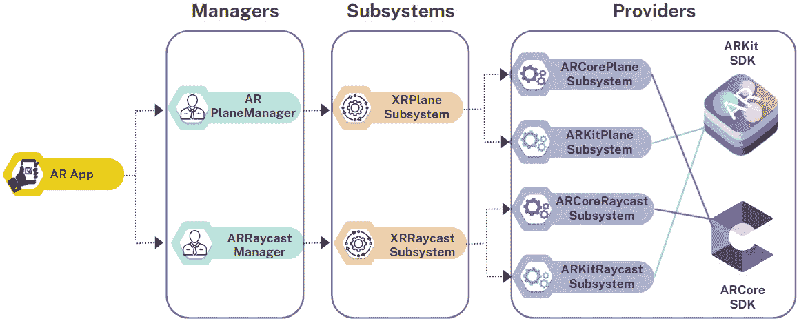
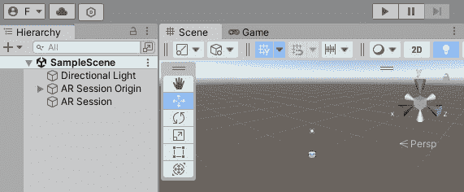
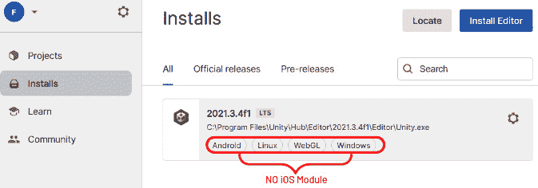
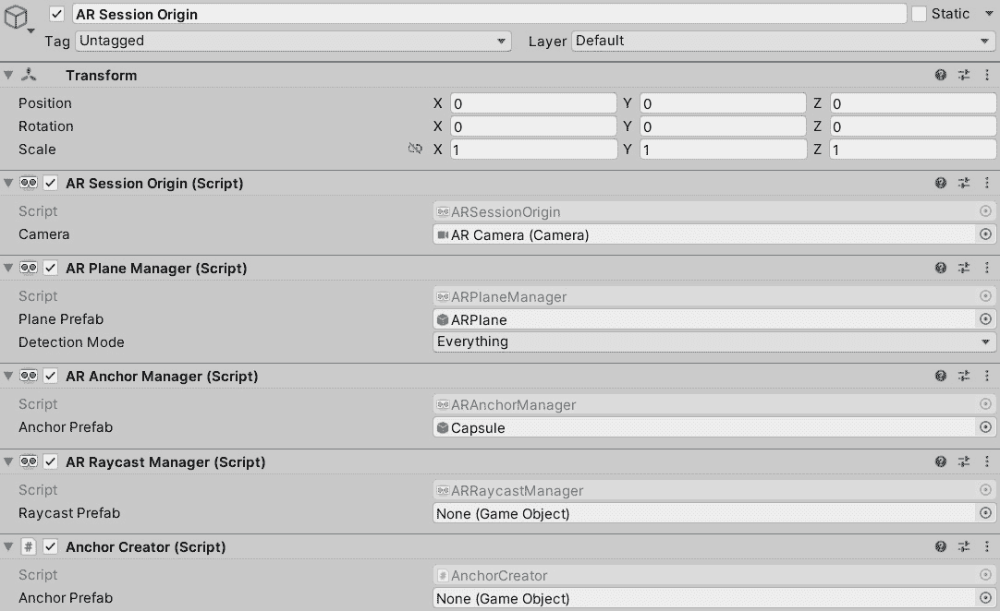
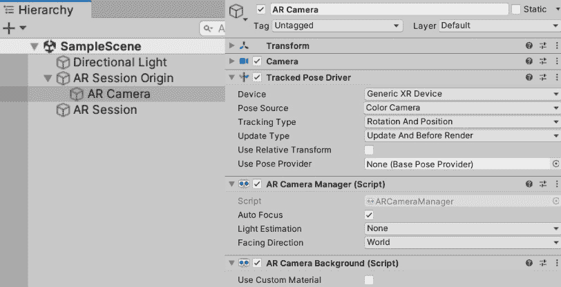
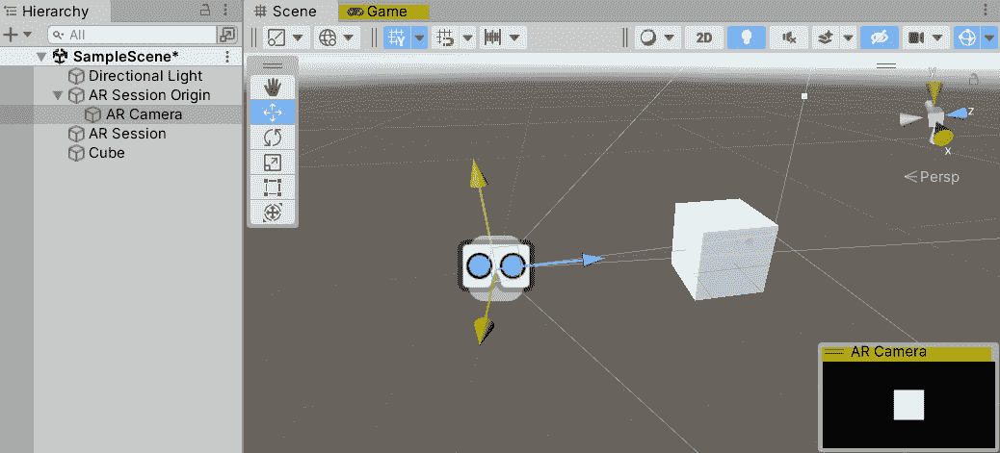
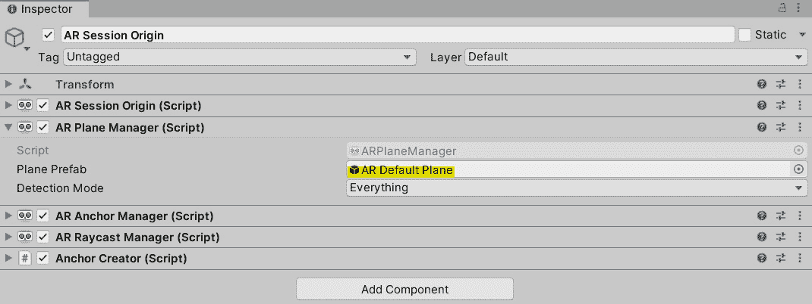
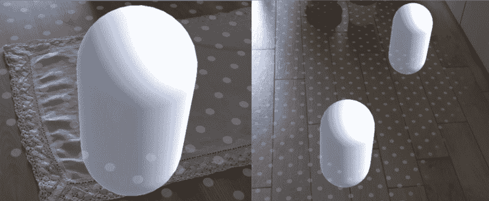
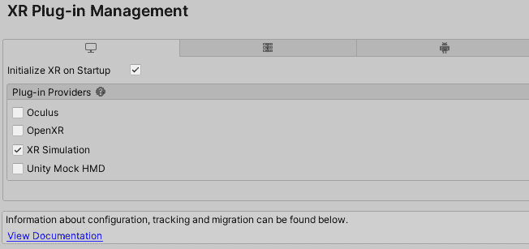
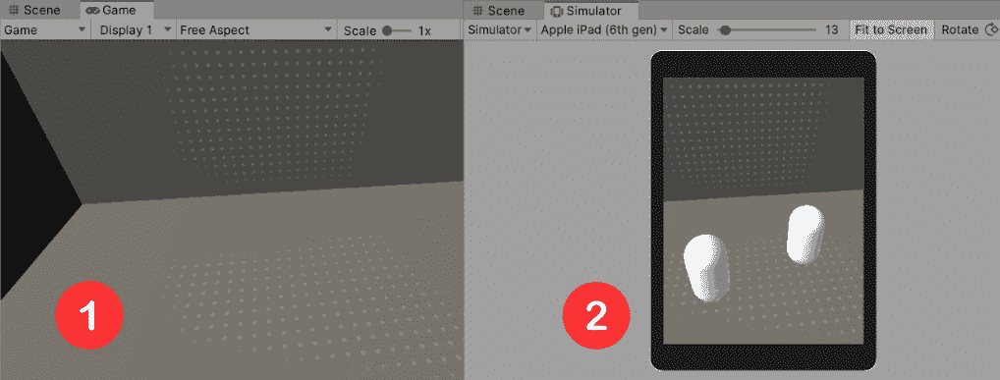

# 第四章：Unity 中的 AR 开发

在本章中，我们将沉浸在 AR 开发的迷人领域，从在 Unity 中创建我们的第一个 AR 项目到在设备或模拟器上启动我们的第一个 AR 场景。我们将向您介绍 Unity 提供的众多 AR 工具包和插件，并指导您了解它们的独特功能。

我们将逐步讲解在 Unity 中建立 AR 项目的过程，确保它为顺利部署到任何支持 AR 的设备做好准备。

本章将涵盖以下主题：

+   理解 AR 领域

+   使用 AR Foundation 在 Unity 中设置 AR 项目

+   在 Unity 中直接测试 AR 体验

+   将 AR 体验部署到移动设备上

# 技术要求

在我们深入探讨 Unity 编辑器的实用性之前，确保您的计算机系统能够胜任这项任务是非常重要的。需要**Unity 2021.3 LTS**或更高版本，才能完成本书中将要探索的练习。通过比较 Unity 网站上提供的系统要求来检查您的硬件兼容性，网址为[`docs.unity3d.com/Manual/system-requirements.html`](https://docs.unity3d.com/Manual/system-requirements.html)。

由于我们将在本章中探索 AR 开发，我们需要一个能够支持 ARKit 或 ARCore 的 Android 或 iOS 设备。请查看您的设备是否满足这些要求，网址为[`developers.google.com/ar/devices`](https://developers.google.com/ar/devices)。

# 理解 AR 领域

当我们开始探索 AR 时，首先理解使这项技术成为可能的基础元素至关重要。我们的日常设备是如何如此轻松地将我们的物理现实与数字世界交织在一起的？是什么机制允许您的设备感知、解释和与周围的世界互动？也许最引人入胜的是，一个简单的屏幕如何变成通往增强现实的大门？

在本节中，我们的目标是解开 AR 的复杂原理和机制，将它们提炼成易于理解的形式。

如果 AR、MR 和 VR 等术语对您来说仍然模糊不清或可以互换，请考虑回顾*第一章*以获得澄清。现在，我们的重点仍然是 AR，它通过叠加数字域的元素来改变我们的世界。让我们看看 AR 提供的不同类型体验。

## 存在哪些类型的 AR 体验？

AR 领域是多样化的，体验通常通过以下几种媒介之一呈现：手持移动 AR、AR 眼镜或其他类型的 AR，如基于投影的 AR 或空间 AR。每种形式都有其独特的特点，其应用取决于上下文和所需的沉浸程度。让我们了解更多关于这些的信息：

+   **手持移动增强现实**：手持移动增强现实可能是最普遍的增强现实形式，因为智能手机的普及。想象一下这种类型的增强现实就像是一个通向丰富现实的窗口。通过智能手机或平板电脑的屏幕，用户见证了数字和现实的交织。这种数字内容叠加在实时摄像头流上的做法为原本静态的物理世界注入了活力。这一点的典型例子是流行的游戏*宝可梦 GO*，其中用户在看似居住在我们自己世界中的数字生物中狩猎。

+   **增强现实眼镜**：另一方面，增强现实眼镜提供了一种更沉浸式和无手操作的增强现实体验。当用户戴上这些眼镜时，他们直接进入一个增强世界，无需额外的设备。得益于眼镜中集成的透明显示屏、传感器和摄像头，数字信息无缝地融入用户的视野。这项技术的意义深远，潜在应用范围广泛，从制造业和医疗保健到娱乐行业。专为增强现实眼镜设计的游戏示例是名为*宝可梦 GO AR+*的新版本游戏。宝可梦 GO AR+彻底改变了游戏的原有概念，充分利用了增强现实眼镜的功能。当佩戴增强现实眼镜时，玩家可以更深入地沉浸在宝可梦世界中。他们可以看到在现实世界环境中的宝可梦，就像它们真的在那里一样。宝可梦站和道馆在现实世界的位置可见，玩家可以直接与之互动。例如，如果出现宝可梦，玩家可以伸手触摸它并启动捕捉序列。游戏还允许使用增强现实环境与其他玩家进行实时战斗模拟。

注意

尽管手持移动增强现实和增强现实眼镜都作为进入增强现实的途径，但它们在形态、用户体验和沉浸程度方面存在显著差异。移动增强现实作为通向增强世界的便携式门户，可以通过用户的智能手机或平板电脑访问。另一方面，增强现实眼镜提供了一种完全沉浸式的体验，其中增强世界直接呈现在用户的视野中。鉴于智能手机的普及，本书将主要关注 Android 和 iOS 手持设备的增强现实开发。

然而，这并不意味着增强现实眼镜缺乏潜力或用途。对手持设备的关注主要反映了它们当前的更广泛使用和可及性。尽管如此，增强现实眼镜提供了手持设备无法比拟的显著机会和沉浸程度。尽管本书专注于手持增强现实，但它涵盖的增强现实开发的基本原则，如理解三维空间、用户交互和用户体验设计，在很大程度上也适用于增强现实眼镜。对增强现实眼镜开发感兴趣的读者仍然可以从中获得宝贵的见解，尽管他们可能需要通过专注于增强现实眼镜技术的额外资源来补充他们的学习。

+   **基于投影的 AR**：基于投影的 AR 将数字图像投射到现实世界的表面上。基于投影的 AR 在汽车行业中有显著的应用，其中 AR 已经开始产生重大影响。如导航、速度和其他重要数据等信息可以投射到车辆的挡风玻璃上，为驾驶员提供实时视觉提示，而无需他们离开路面。

+   **空间 AR**：空间 AR 使用全息显示屏来创造虚拟对象与我们的物理环境共存的错觉。全息显示屏可以比作数字海市蜃楼，通过结合光投影和光学技术来创建三维虚拟对象，使其看起来像在空间中漂浮。这种形式的 AR 不需要额外的设备或可穿戴设备，使用户能够像它们物理存在一样与全息图进行交互。

在探讨了 AR 体验的类型之后，我们现在将深入研究使虚拟对象在现实世界中叠加的技术和概念。

## 什么是基于标记和无标记 AR？

AR 建立在一系列基础原则上，这些原则允许虚拟对象在我们的物理世界中准确定位并实现真实交互。这些原则涉及各种技术和方法，例如**基于标记的 AR**和**无标记 AR**。

让我们现在更深入地了解这些技术。

### 基于标记的 AR

基于标记的 AR 依赖于特定的标记或目标来启动 AR 内容的显示。这些标记可以有多种形式，例如具有可识别图案的物理对象、二维码或图像。当 AR 系统检测到标记时，它会在其上叠加数字内容。

在开发 AR 应用时，可以使用多种类型的标记来触发 AR 内容的显示。以下是 AR 中常用的一些标记的概述：

+   **图像标记**：这些是作为 AR 内容触发器的独特视觉图案或图像。当 AR 系统通过摄像头检测到这些标记时，它会在其上叠加相应的数字内容。

+   **二维码**：快速响应（QR）码，这是一种包含特定信息的二维条码，也可以作为 AR 标记。当摄像头或二维码扫描库识别这些代码时，它可以触发显示特定的 AR 内容或交互。

+   **3D 对象标记**：这些标记涉及使用特定的物理对象作为 AR 内容的触发器。AR 系统识别对象的形状和特征，并使用这些数据来叠加数字内容。

+   **基于位置的标记器**：这些标记器利用用户的地理位置数据来触发 AR 内容。通过利用 GPS 或其他位置跟踪技术，AR 系统可以在与用户当前位置相关的数字内容上叠加。

+   **基于代码的标记**：这些是专门设计的图案或符号，可以被 AR 系统识别并用作触发器。这些标记使用特定的算法创建和解码，为 AR 体验提供高度的可定制性和灵活性。

要使用的标记类型取决于你的 AR 应用的具体要求。如期望的用户体验、跟踪精度和标记识别的简便性等因素将指导标记的选择。

虽然许多 AR 体验使用标记，但并非所有都如此，你将在下一小节中了解到。

### 无标记 AR

无标记 AR，也称为**基于位置的 AR**或**同时定位与地图构建**（**SLAM**）-基于 AR，不依赖于预定的标记或视觉线索。它使用机载传感器和复杂的算法将数字信息叠加到物理世界中。传感器可以包括**全球定位系统**（**GPS**）、加速度计和摄像头，以确定用户在物理环境中的位置和朝向。了解用户的位置后，这些 AR 系统根据地理坐标在物理周围叠加虚拟内容。

让我们深入了解实现无标记 AR 的各种选项，并探索它们的实际应用：

+   **基于地理位置的 AR**：这种方法主要使用 GPS，适合在户外环境中将 AR 对象放置在更大规模的位置。

    这里的一个例子是 Niantic 的游戏《精灵宝可梦 GO》。使用设备的 GPS，游戏在现实世界中的位置放置虚拟宝可梦生物，允许玩家找到并捕捉它们。

+   **Wi-Fi 定位系统**（**WPS**）：这种方法根据 Wi-Fi 信号强度和来源确定设备的位置。它对于室内 AR 体验特别相关，因为 GPS 可能不太有效。例如，*室内地图*提供了一个结合磁性信息和 Wi-Fi 信号的室内导航平台。这已被用于增强购物中心中的 AR 体验，使用数字标记引导用户到特定的商店或景点。

+   **蓝牙**和**超宽带**（**UWB**）：这些定位技术旨在为微定位体验而设计，在较小的空间如房间或展览中提供高精度。一个实际的应用案例可以在博物馆和画廊中看到，在那里蓝牙信标被用于增强现实（AR）应用中。这些应用根据访客与特定艺术品或展览的接近程度，向他们提供多媒体内容。

+   **SLAM（同步定位与建图）**：SLAM 是一种更高级的技术，在跟踪用户位置的同时创建环境的数字地图。这项技术涉及复杂的算法，并使用设备的摄像头和其他传感器。想象一下你在一个黑暗的房间里，你打开了一盏手电筒。当你移动手电筒时，你开始看到并记住不同物品的位置，比如椅子或桌子。随着时间的推移，你在脑海中构建了整个房间的地图。SLAM 做的是类似的事情。它最适合需要在小空间内准确放置和交互物体的应用。

    这的一个例子是宜家的应用*IKEA Place*。在应用中，用户可以从宜家目录中选择一件家具，应用将 3D 模型叠加到摄像头视图中，使用户能够看到该物品在家中会是什么样子。

+   **深度感应**：这涉及到使用高级传感器，如**飞行时间**（ToF）或**光探测与测距**（LIDAR）传感器来捕捉周围环境的深度信息。这种方法允许更精确地放置和遮挡虚拟对象，基于深度信息，数字对象可以正确地出现在真实世界物体后面。

    这的一个例子是苹果的*ARKit 4.0*平台，该平台集成了利用某些 iPad 和 iPhone 型号上可用的 LIDAR 扫描器的**深度 API**。深度 API 使得 AR 体验更加逼真。《*Complete Anatomy*》应用程序使用 ARKit 的深度感应将详细的 3D 人体解剖模型放置到现实世界中，使用户能够像它真实存在一样探索和与之交互。由于深度感应，这个模型不会意外地出现在你的沙发中间，而是会正确地站在它旁边。

+   **机器学习和人工智能**：人工智能和机器学习的最新进展为无标记增强现实（AR）开辟了新的可能性。机器学习模型可以被训练以识别不同类型的环境和物体，为更智能和互动的 AR 体验提供上下文。

    这的一个例子是谷歌的*ARCore*平台，该平台使用机器学习来识别和增强特定的物体或物体类型。谷歌的*AR Animals*功能使用 ARCore 让用户在谷歌上搜索动物，然后通过 AR 在他们的空间中查看该动物的 3D 模型。

无标记 AR 为创建沉浸式和互动的 AR 体验提供了巨大的可能性。无论是在游戏、室内设计、教育还是其他无数的应用中，它都有潜力彻底改变我们与数字世界的互动方式。

## 理解 AR 交互输入类型

步入增强现实（AR）的领域，人们很快就会意识到，这不仅仅关乎人们所能看到的物理与虚拟现实的迷人融合。它同样关乎人们如何与这些层叠的数字增强进行交互，这是一个由 AR 输入定义的维度。这些输入——用户与 AR 内容交互的模式——作为连接点，塑造了整体的 AR 体验。

随着我们进一步探讨这个话题，让我们聚焦于各种 AR 输入类型以及它们如何为现实世界应用注入活力：

+   **触摸输入**：触摸输入是 AR 交互的基础。简单来说，用户可以通过在 AR 设备屏幕上触摸手势来与数字叠加层进行交互，无论是智能手机还是平板电脑。AR 中的触摸输入不仅包括点击，还包括其他手势，如滑动、捏合和拖动。可以使用的手势将取决于 AR 应用程序的编程方式。例如，捏合手势可能用于放大或缩小 AR 对象，滑动可能旋转对象，拖动可以在 AR 场景中移动对象。目标是使与 AR 元素的交互尽可能直观和自然。*Snapchat 镜头*提供了触摸输入在应用中的经典例子。用户只需轻触不同的屏幕区域，就可以使 AR 滤镜动画化或引起变化。

+   **设备运动**：设备运动是另一个关键的 AR 输入。通过利用设备上的加速度计、陀螺仪和磁力计的数据，AR 应用程序可以将设备的朝向和运动作为输入。这种输入类型对于涉及在环境中导航或控制虚拟元素的用户体验特别有用。以游戏 Pokémon Go 为例，玩家可以通过挥动设备来模拟*投掷*宝可梦球的行为。

+   **语音命令**：语音命令为 AR 应用程序注入了免提和易于访问的交互方式。*Google Glass*这款 AR 眼镜设备将语音命令作为其核心输入方法之一。用户只需说出“好的，Glass”，然后跟上一个命令，如“获取路线”或“拍照”，就可以与设备交互。

+   **眼动追踪**：眼动追踪通常用于高级 AR 眼镜。通过跟踪用户的眼动，这些系统允许用户仅通过注视即可与 AR 内容进行交互。*North Focals* AR 眼镜是这一技术在应用中的良好例子。用户只需移动眼睛，就可以控制一个小型的虚拟光标。

+   **手势追踪**和**手势识别**：在高度沉浸式的 AR 系统中，手势追踪和手势识别可以用来解释和追踪手部动作，使用户能够直接触摸和与虚拟对象交互。微软的*HoloLens 2*就是这一技术的例子，它允许用户用手势操作全息图像，捏合来调整大小，或轻触进行交互。

+   **物理控制器**：物理控制器可以从手持设备到提供触觉反馈和精确控制的可穿戴技术（如手套）不等，适用于特定的 AR 应用。例如，*Magic Leap One* AR 头戴式设备配有手持控制器，通过允许用户以更细腻的方式与虚拟内容交互，将用户沉浸在 AR 体验中。

正如我们所见，AR 输入可以显著影响 AR 体验的沉浸感。输入方法的选择取决于 AR 应用的具体性质。因此，理解和实施最合适的输入方法可以极大地增强 AR 系统的真实性和可用性。

注意

由于本书主要关注手持式移动 AR 设备，为确保读者能够轻松复制书中展示的所有项目，我们选择将范围限制在触摸输入。

在下一小节中，我们将探讨 Unity 中可用的 AR 工具包，这些工具包可以用来实现我们刚刚讨论的技术。

## Unity 的流行 AR 工具包

在本节中，我们深入探讨 Unity 的 AR 工具包系列，为寻求在 AR 开发之旅中导航的新手和经验丰富的开发者提供概述。每个工具包都提供独特的功能，帮助开发者制作引人入胜的 AR 体验。现在让我们看看其中的一些：

+   **Vuforia**：Vuforia 是一个广泛采用的 AR 平台，提供了一组计算机视觉能力，可以适应基于标记和无标记的 AR 体验。其丰富的功能集包括图像跟踪、物体识别和目标识别，具有广泛的平台支持。另一个值得注意的功能是 Vuforia 的云识别，允许开发者远程托管大量目标图像，进一步扩展 AR 体验的潜力。

+   **ARKit**：在苹果的游乐场中，ARKit 是针对 iOS 设备体验的最佳工具包。它专门为 iOS 生态系统量身定制，为开发者提供了一系列高级功能，如世界跟踪、面部跟踪和场景理解。这些元素共同丰富了用户的 AR 体验。ARKit 主要使用 Swift 和 Objective-C，这是苹果的专有编程语言。然而，通过 AR Foundation 包与 Unity 集成时，开发者可以利用 C#，从而提供一个更易于访问和熟悉的编程环境。

+   **ARCore**：谷歌的 ARCore 是 ARKit 的 Android 版本，专为全球最受欢迎的移动操作系统量身定制。ARCore 为开发者提供了环境理解、运动跟踪和光估计等功能，这些都是制作逼真 AR 体验的必要元素。主要来说，ARCore 使用 Java 进行本地开发。但与 ARKit 的集成类似，ARCore 可以通过 AR Foundation 包集成到 Unity 项目中，允许开发者使用 C#。

+   **AR Foundation**: AR Foundation 是 Unity 的高级 API 包，用于构建 AR 应用程序，统一了 ARKit 和 ARCore 的功能。这个巧妙的包使得创建跨平台的 AR 体验变得单一且流程化，消除了为 iOS 和 Android 编写单独代码库的需要。这就像拥有一本通用的食谱集，而不是每种菜肴的单独食谱书。使用 AR Foundation，开发者可以利用广泛使用、功能多样的 C# 编程语言，使制作 AR 应用的过程更加高效和直观。

    如果你分别使用 ARCore 和 ARKit，你需要为每个平台编写不同的代码集。你需要使用 ARCore 在 Android 上构建你的 AR 应用，然后使用 ARKit 重新编写代码，使其在 iOS 上运行。

    然而，通过使用 AR Foundation 开发 AR 应用，你只需要编写一套适用于 iOS 和 Android 的代码。AR Foundation 提供了一个统一的 API，与 ARCore 和 ARKit 兼容，这意味着你不需要为每个平台编写不同的代码。它简化了开发过程，节省了大量时间和精力。

注意

在本章中，我们将专注于使用 AR Foundation 创建 AR 应用程序。

然而，重要的是要记住，在特定场景下，使用 ARCore 或 ARKit 可能会提供独特的优势，这得益于每个平台独有的特定功能。例如，从 *版本 3.5* 开始，ARKit 带来了 LIDAR 支持。这个功能利用了集成到某些 iPhone 和 iPad 模型中的 LIDAR 扫描仪，提供了精细的场景理解和精确的深度估计。另一个 ARKit 独有的功能是从 *ARKit 3* 开始的 *运动捕捉* 功能，它允许开发者记录人类动作并将其应用于 3D 角色模型，有效地将设备转变为动作捕捉工作室。

另一方面，ARCore 也为 Android 设备提供了一套独特的功能。其中一个功能是 Depth API，它使用单个 RGB 相机生成深度图。虽然 ARKit 也具有深度感知能力，但 ARCore 的 Depth API 可以在更广泛的设备上运行，甚至在没有专用深度传感器的设备上。ARCore 的另一个独特功能是 *增强图像*，它允许应用程序在固定位置跟踪和增强图像，为与海报、壁画和类似物品的交互提供了可能性。

重要提示

在本节中提到的示例，在阅读这本书时可能不适用。由于 ARKit、ARCore 和 AR Foundation 不断演变，查阅最新的文档([`docs.unity3d.com/Packages/com.unity.xr.arfoundation@5.0/manual/index.html`](https://docs.unity3d.com/Packages/com.unity.xr.arfoundation@5.0/manual/index.html))对于获取最新和最准确的信息非常重要。

现在，我们终于可以开始我们的第一个 Unity AR 项目了。

# 使用 AR Foundation 在 Unity 中设置 AR 项目

在本节中，您将学习如何使用 AR Foundation 在 Unity 中设置一个简单的 AR 项目。您将了解如何放置简单的对象，如立方体，添加平面检测功能，并将触摸输入和锚点实现到您的 AR 场景中。

然而，在使用 AR Foundation 在我们的第一个 AR 应用程序之前，我们首先必须了解这个包的架构。

## 理解 AR 基础架构

在本节中，我们将深入探讨 Unity 的 AR 基础架构的激动人心的世界，这是一个使您能够在各种平台上创建 AR 体验的包。无论您旨在为 Android、Apple 还是 HoloLens 创建应用程序，AR Foundation 都极大地简化了这一过程。其广泛的功能包括平面检测、图像和对象跟踪、面部和身体跟踪，以及点云等。*图 4.1* 将 AR Foundation 的架构分解为组件的层次结构，这些组件无缝协作，为不同设备提供一致的 AR 体验。

图 4.1 – AR 基础架构

**AR 应用** 代表开发者构建 AR 体验的应用程序。它与 **管理器** 直接相关联，这些管理器作为特定 AR 功能的主要接口。

**AR PlaneManager** 对于检测和跟踪现实世界的平面至关重要，例如地板或墙壁。它提供了一个与用户周围物理环境交互的一致方式，向应用提供用户周围表面数据。

同样，**ARRaycast 管理器** 在理解这个 AR 空间中的用户交互方面发挥着至关重要的作用。它将射线投射到 AR 场景中，确定这些射线与真实世界表面的交点。当用户打算在这些表面上放置虚拟对象或希望与虚拟元素相关联地与真实世界交互时，这一点尤为重要。

深入研究，这些管理器与 **子系统** 交互，这些子系统是抽象层，与实际的平台特定模块进行通信。**XRPlane 子系统** 标准化了与平面检测相关的数据，确保无论底层工作是由 ARKit 还是 ARCore 完成，平面相关的事件和数据都是统一的。**XRRaycast 子系统** 提供了一个一致的射线投射接口，抽象了每个平台方法的细微差别。

最后，**提供者** 代表为每种设备类型提供 AR 功能的平台特定 SDK。ARKit SDK 是苹果为其 iOS 设备做出的贡献，具有专门的平面检测和射线投射子系统。另一方面，ARCore SDK 是谷歌为 Android 提供的解决方案，与 ARKit 提供的功能类似，但针对 Android 生态系统进行了定制。

如您所见，AR Foundation 通过允许开发者集中精力在他们的 AR 体验上，而不必担心平台特定的复杂性，为 XR 开发者提供了一个统一的框架。通过其分层架构，它确保无论部署在 iPhone 还是 Android 设备上，应用程序都保持一致且高质量。

有了这个理解，现在是时候在 Unity 中创建我们的第一个 AR 项目了。

## 使用 Unity 的 AR 模板创建 AR 项目

在 Unity 中创建一个 AR 项目相当简单。按照以下步骤开始：

1.  根据你的目标 AR 平台——Android 或 iOS——你首先需要导航到 Unity Hub 中的`Installs`文件夹，点击你版本旁边的**设置**图标，选择**添加模块**，并安装适当的构建支持。

    要在 AR Unity 模板中展示你的项目，你需要遵循后续的步骤。

1.  在 Unity Hub 的项目窗口中，点击右上角的**新建项目**按钮。

1.  选择**AR**模板，并为你的项目起一个独特的名字，如图*图 4.2*所示。

图 4.2 – Unity Hub 中可用的 AR 模板

为什么选择 AR 模板？

在 Unity 的世界里，AR 模板就像一个富饶的花园，已经预装了 AR 基础、ARKit Face Tracking、ARKit XR-、ARCore XR-、Magic Leap XR-和 OpenXR 插件等预安装包，更不用说一个示例场景了。然而，你可能会注意到这个茂密的花园里有一些对你目标景观不必要的植物：Android 或 iOS。为了保持花园的整洁，你可以从 Unity 自己的苗圃——包管理器中，有选择地挑选你需要的种子——OpenXR 插件、AR 基础、输入系统和 ARCore XR 插件（用于 Android）或 ARKit XR 插件（用于 iOS），并将它们种植在一个普通的 3D 场景中。

1.  最后，点击**创建项目**。

一旦场景在 Unity 编辑器中加载，它应该看起来像*图 4.3*所示的那样。

图 4.3 – Unity 的 AR SampleScene

重要提示

如果你没有在 Unity 编辑器中看到*图 4.3*所示的场景，你可以通过选择**资产** | **示例资产** | **SampleScene**手动打开它。

新打开的场景包含**方向光**、**AR 会话原点**和**AR 会话**GameObject。如果你希望将这些对象带入一个新的场景，你可以在层次结构中右键点击，选择**XR** | **AR 会话**来召唤一个**AR 会话**GameObject。通过选择**XR** | **AR 会话原点**，可以以类似的方式召唤**AR 会话原点**GameObject。这就是最初施展的魔法。

重要提示

在本书出版时，**AR 会话原点** 和 **AR 会话** 代表了集成到 *AR 基础* 模板中的默认 GameObjects。然而，鉴于 *AR 基础* 的动态特性，预计会有持续更新和修订。有迹象表明，**AR 会话原点** 将在未来的版本中演变为 *XR 原点* (*移动 AR*)。

如果您遇到此类更改，请不要担心。本章的精髓保持不变，并且可以轻松导航。我们建议访问我们的 *GitHub* 仓库以克隆我们已工作的特定项目版本，确保与 Unity 兼容。通常，从过时的 GameObjects 转换到它们的较新版本是无缝的，可能需要最少的，如果不是任何，对现有逻辑的调整。

保持适应性，并记住：这里提出的核心概念和基础仍然是您的指南，即使工具在不断发展。

在我们开始检查这些 GameObjects 之前，我们首先需要调整我们 AR 场景的一些项目设置。

## 修改项目设置

要定义我们想要针对我们的 AR 场景使用的提供者，请转到 **编辑** | **项目设置** 下的 **XR 插件管理**。根据我们针对的平台，无论是 Android 还是 iOS 设备，我们激活相应的 ARCore 或 ARKit 复选框。如果您想同时拥抱这两个平台，请启用两个复选框。这将安装提供者包到您的项目中。

重要提示

如果您看不到 Android、iOS 或两者都的选项卡，那么很可能是 *Android* 或 *iOS 构建支持* 模块尚未集成到您的编辑器中。让我们看看我们如何解决这个问题。

*图 4**.4* 显示了在 Unity Hub 中标记的构建支持模块的已安装 Unity 编辑器。

图 4.4 – 已安装的 Unity 编辑器，已标记的构建支持模块

显示的图像表明 Unity 编辑器中缺少 *iOS 构建支持* 模块。要调整此问题，请转到 Unity Hub 中的 **安装** 选项卡。点击 Unity 编辑器安装右上角的 **设置** 图标。然后，选择 **添加模块**，为 **iOS 构建支持** 或 **Android 构建支持**（如果您愿意，也可以两者都选）启用复选框，并安装它们。安装完成后，返回到您项目的 **XR 插件** **管理** 窗口。

现在，您应该在 **XR 插件管理** 下的 **ARCore** 和 **ARKit** 选项卡下找到它们。

现在，选择 **ARCore** 选项卡以探索与您 Unity 项目中 ARCore 包的配置和设置相关的字段。*图 4**.5* 显示了带有其默认设置的 **ARCore** 选项卡。

图 4.5 – 默认设置的 ARCore 选项卡

让我们逐一介绍每个字段的函数：

+   **需求**：此参数决定了 ARCore 对您应用程序的必要性。如果设置为**必需**，则将 ARCore 确立为目标设备的一个基本组件。相反，当标记为**可选**时，ARCore 被视为一个附加功能，当存在时补充应用程序的功能，但不是应用程序核心功能的必需品。

+   **深度**：这是赋予您的设备在其环境中深度感知能力的工具。对于遮挡和其他高级 AR 效果非常有用，它允许您在 ARCore 中切换深度估计。如果您将**深度**设置为**必需**，则您的 AR 应用程序将需要深度估计功能才能运行。另一方面，选择**可选**意味着如果设备支持，您的 AR 应用程序可以利用深度估计功能，但如果这些功能不存在，也不会影响基本功能。

+   **忽略 Gradle 版本**复选框：这是您对 Gradle 构建系统的控制，它是构建 Android 应用程序的必备工具。当未选中时，Unity 将遵循项目指定的 Gradle 版本。然而，如果选中，Unity 将获得自主权，忽略指定的版本，并选择使用其默认版本。

虽然默认设置——**需求**和**深度**字段都设置为**必需**，以及**忽略 Gradle 版本**复选框未选中——适用于大多数项目，但也有一些例外。例如，如果您正在创建一个针对具有不同能力的各种设备的 AR 应用程序，或者如果您的应用程序的主要功能并不严重依赖于 ARCore 的深度感知，您可能希望将**深度**字段设置为**可选**。此外，如果您正在处理需要特定 Gradle 版本或与较新版本存在冲突的项目，选中**忽略 Gradle 版本**复选框将是必要的。然而，对于本章，我们可以保持默认设置。

接下来，我们将注意力转向**ARKit**选项卡。就像其 ARCore 对应物一样，这些字段与您的 Unity 项目中 ARKit 包的配置和设置相关联。*图 4.6*显示了具有默认设置的**ARKit**选项卡。

图 4.6 – 具有默认设置的 ARKit 选项卡

让我们来解码*图 4.6*中显示的所有字段的含义：

+   **需求**：与 ARCore 的**需求**字段作用类似，此指示器宣布 ARKit 是否被认为是您项目的重要部分。

+   **面部追踪**：作为一个开关，此复选框启用或禁用 ARKit 中的面部追踪功能。当激活时，它允许使用设备的前置摄像头跟踪和识别一系列面部特征和表情。

目前，我们将遵循默认设置——**需求**字段保持为**必需**，并且**人脸追踪**复选框保持关闭状态，因为目前不需要。

在接下来的章节中，我们将深入研究与**AR**模板一起的 GameObject。我们将探讨它们的作用，并揭示它们为何如此重要。让我们从 AR 会话 GameObject 开始。

## 理解 AR 会话 GameObject

**AR 会话**GameObject 管理着你的 AR 应用的生命周期。要了解它，请在场景层次结构中点击它，并导航到检查器窗口。如图*图 4.7*所示，**AR 会话**GameObject 包含**AR 会话**和**AR 输入****管理器**组件。

图 4.7 – 选择 AR 会话 GameObject 时的检查器窗口

让我们了解*图 4.7*中显示的每个字段：

+   **尝试更新**复选框：当勾选此复选框时，这是你对 AR 会话的指示，要求它对保持设备的姿态和追踪状态与每一帧和每一滴答保持更新保持警觉。勾选此框命令 AR 会话勤奋地获取新的追踪数据，确保即使设备的追踪暂时波动，AR 元素也能保持与真实世界的对齐。想象一个 AR 投篮游戏。在这个游戏中，你通过设备的屏幕看到虚拟篮筐叠加在你的真实世界环境中。为了使游戏运行良好，确保你的设备的追踪数据持续更新至关重要。这就是**尝试更新**复选框的作用所在。

    激活**尝试更新**命令指示游戏持续刷新追踪状态，确保虚拟对象与真实世界环境的和谐，即使出现暂时的追踪损失。

+   **匹配帧率**复选框：当勾选此复选框时，意味着你要求 AR 会话与设备的相机帧率同步。AR 会话调整其节奏以匹配相机的，最终实现和谐的视觉体验。考虑一个允许用户在他们的实际空间中构想虚拟家具的 AR 应用。

    勾选的**匹配帧率**复选框确保 AR 会话的帧率与相机同步，抑制实际空间和虚拟家具之间的视觉不协调，从而实现精确的美学评估。

+   **追踪模式**下拉菜单：这是定义你的 AR 会话追踪质量的关键。所选模式决定了 AR 系统对设备在真实世界中的运动和位置的感知和响应。想象一个在物理世界之上叠加虚拟箭头的 AR 导航应用，以引导用户。

    在这个导航应用程序中，选择 **旋转和位置跟踪** 提供了完整的跟踪能力，确保虚拟箭头准确追踪现实世界的轮廓，精确地引导用户沿着他们的路径。

对于我们当前的探索，我们将坚持默认设置 – 两个 **尝试更新** 和 **匹配帧率** 复选框都被勾选，并且 **跟踪模式** 设置为 **位置和旋转**。在未来，你的这些设置选择应反映你的项目目标和预期的用户体验。为了发现最适合你需求的最佳组合，我们鼓励你尝试不同的设置和配置。

在 AR 会话之下，第二个组件是 **AR 输入** **管理器**组件。

AR 输入管理器组件将用户的 AR 场景交互转换为有意义的输入。它感知和处理各种用户输入，如点击、触摸和手势。它是使你的 AR 应用程序交互性无形之手，允许放置对象或与虚拟元素交互。例如，想象一个 AR 游戏，用户通过点击来消除虚拟目标。**AR 输入管理器脚本**读取屏幕上的点击，并提供必要的信息来释放游戏中的射击动作。

现在，我们的重点转向 AR 会话起源 GameObject。

## 探索 AR 会话起源 GameObject

**AR 会话起源** GameObject 是控制物理世界与 AR 中投射的虚拟对象之间同步的主要元素。它包含各种组件，如 AR 会话起源、AR 平面管理器、AR 锚点管理器、AR 光线投射管理器和锚点创建器，正如我们在 *图 4.8* 中所看到的。

图 4.8 – 选择 AR 会话起源时的检查器

对于我们 AR 开发的启动阶段，我们只需要 AR 会话起源组件。因此，你现在可以暂时禁用所有其他组件。

将 AR 会话起源视为你的 AR 体验的支点。它为在 AR 环境中锚定虚拟对象提供了一个基础。让我们想象一个 AR 应用程序，允许用户将虚拟家具放置在他们家中。在这里，AR 会话起源组件正确地安排和定位虚拟家具在用户的物理空间内。

AR 会话起源确保用户的环境与显示的 AR 场景的位置和方向对齐。例如，当用户放置一个虚拟椅子时，此脚本会保持椅子的定位和方向，无论用户在房间内的移动。这就是为什么这个组件对于创建真实的 AR 体验至关重要。

为了将虚拟物体与真实世界的视频混合，AR 会话需要存在一个相机。在你场景中已经存在主相机的情况下，你可以安全地移除它。AR 会话原点集成了自己的子**AR 相机**。这个相机没有用于单色背景的天空盒，预先配备了必要的组件，如**相机**、**跟踪姿态驱动器**、**AR 相机管理器**和**AR 相机背景**，如图*图 4.9*所示。

图 4.9 – 当选择 AR 会话原点的子 AR 相机时的检查器

现在我们来详细了解每一个：

+   就像现实世界的相机一样，**相机**组件捕捉并显示游戏场景的一部分给玩家看——本质上，就是你在玩 AR 游戏时在设备屏幕上看到的内容。它可以定位和旋转，以捕捉游戏场景中的不同视角。

+   **AR 相机管理器**组件控制手机相机的设置，如**面向方向**、**光估计**和**自动对焦**。**自动对焦**使相机自动调整其焦点以保持 AR 物体清晰，就像普通相机中的自动对焦一样。**光估计**允许你选择 AR 系统如何估计真实世界的光照条件，以使虚拟物体看起来更真实。选项范围从根本不估计光照（**无**）到估计光照的各个方面，如**环境光强度**和**颜色**，以及主光源的**方向**和**强度**。**面向方向**决定 AR 相机面向的方向。**世界**设置通常是用于后置摄像头（查看环境），而**用户**是用于前置摄像头（自拍模式）。**无**禁用此设置。目前，我们可以保持这些设置不变。

+   **跟踪姿态驱动器**组件获取关于设备物理位置和方向的信息，统称为姿态，并使用这些信息来设置 Unity 游戏场景中相机的位置、旋转和缩放。这被称为相机的**变换**。这确保了 AR 场景与手机的移动保持一致。为了方便这一过程，跟踪姿态驱动器提供了几个可配置的选项。**设备**允许你选择正在跟踪的设备类型。**姿态源**允许你选择提供跟踪数据的设备部分。**跟踪类型**下拉菜单指示跟踪哪种类型的运动（旋转、位置或两者）。 

    **更新类型**决定了跟踪信息何时更新，是在常规更新周期中、在渲染下一帧之前，还是两者都更新。如果勾选了**使用相对变换**复选框，则跟踪数据基于设备相对于其初始状态的位置和旋转。

    最后，可以启用**使用姿态提供程序**字段以利用外部源进行跟踪数据，这对于专门的跟踪系统可能很有用。这些设置共同赋予**跟踪姿态驱动器**处理广泛 AR 场景的灵活性。

+   **AR 相机背景**组件控制您的设备相机捕获的真实世界视图在 AR 场景中的显示方式。**使用自定义材质**复选框允许您应用自定义材质，例如，为真实世界视图添加特殊视觉效果。如果未选中，则真实世界视图将按原样显示，不添加任何额外效果。

AR 会话原点 GameObject 执行将 AR 会话空间转换为 Unity 世界空间的临界任务。鉴于 AR 中使用的独特坐标系（称为 AR 会话空间），这种转换对于准确定位 GameObject 相对于 AR 相机至关重要。

在心中牢记我们 AR 场景中最重要的 GameObject 的信息，现在是时候在我们的 AR 场景中放置一个简单对象了。

## 将一个简单的立方体放入 AR 场景

为了开始测试我们的 AR 功能，我们需要在场景中有一个 3D 对象来可视化 AR 效果。为此目的，您可以创建一个简单的立方体对象。在项目层次结构中右键单击，选择`0`,`0`,`3`)并应用旋转(`30`,`0`,`0`)，如图*图 4**.10*所示。

图 4.10 – 立方体的变换值

这些特定的坐标和旋转只是示例，可以根据您的需求进行修改。

关键目标是将对象放置在 AR 相机方向上，并在一个明显的距离处。这种放置将有助于验证 AR 系统是否正确地将虚拟内容叠加到真实世界中，因为它为您与物理环境对齐提供了一个基准。它还允许您评估 AR 系统的深度感知能力。

为了验证立方体是否会在 AR 视图中正确显示，您可以选择层次结构中的 AR 相机 – 这将在**场景**窗口的右下角显示一个相机视图 – 或者切换到**游戏**窗口，如图*图 4.11*所示。11*。

图 4.11 – Unity 项目展示如何验证立方体是否会在 AR 视图中正确显示

在 AR 应用程序中，AR 会话原点通常对应于 AR 体验开始时您的设备相机的起始位置。然而，直接在**会话原点**放置虚拟对象确实可能引起一些问题。以下是一些可能出现的潜在问题：

+   **不准确的缩放比例**：如果你将一个虚拟立方体直接放置在**会话原点**，它相对于现实世界中的物体可能会显得不成比例地很大或很小。这就像将一个真实物体非常靠近你的眼睛看——即使是小物体也会显得很大。

+   **跟踪干扰**：**会话原点**作为跟踪设备在现实世界中的运动的参考点。如果你在这个确切点放置一个虚拟物体，AR 系统可能难以准确跟踪物体和设备的运动。

+   **不愉快的用户体验**：如果一个虚拟物体直接放置在**会话原点**，它可能会显得离用户太近，甚至遮挡用户对其他 AR 场景的视线，从而造成不愉快的体验。

小贴士

为了避免这些问题，通常建议将虚拟物体放置在**会话原点**的合理距离之外。确切的定位将取决于你的 AR 体验的具体要求。例如，如果你正在创建一个 AR 家具摆放应用，你可能根据检测到的现实世界表面（如地板和桌子）来定位虚拟家具。这样做可以确保虚拟家具以适当的比例出现，不会干扰跟踪，并在现实世界中出现在正确的位置，从而提供愉快的用户体验。

在放置你的立方体后，你可以按照本章“将 AR 体验部署到移动设备”部分中概述的说明进行测试。目前，你的 AR 应用很简单，只在前方用户面前放置了一个静态对象。然而，我们希望提供更互动的体验，因此将在下一节深入探讨锚点和平面检测功能。

## 在 AR Foundation 中实现平面检测

在本节中，我们将利用 AR Foundation 的**平面检测**功能。AR Foundation 的平面检测通过提供对现实世界环境的基石理解，为众多实际应用奠定了基础。它识别和解析平坦表面的能力使得数字对象能够与物理空间进行有意义的、真实的交互，从而增强整体增强现实体验。

在零售和电子商务领域，平面检测对于准确的产品可视化至关重要。它确保虚拟沙发被放置在你的客厅墙壁前，而不是在你房间中的随机位置。

这种技术也为 AR 游戏中的沉浸式体验奠定了基础。通过识别现实世界表面，如《精灵宝可梦 GO》等游戏可以准确放置虚拟元素，增强追逐的乐趣。其他游戏使用这项技术来在你的咖啡桌上创建世界，通过确保虚拟对象与物理平面进行令人信服的交互来维持这种错觉。

要使用平面检测，启用在*探索 AR 会话原点 GameObject*部分中禁用的**AR Plane Manager**组件。然后，您还可以删除立方体，因为我们不再需要它了。现在，选择**AR Session Origin**并检查层次结构中的**AR Plane Manager**组件。

Unity 的 AR Foundation 中的**AR Plane Manager**组件负责通过您的设备摄像头检测和跟踪现实世界表面或平面。它利用 AR 技术来理解物理环境，创建可以与虚拟对象交互的数字表示。

下面是**AR Plane** **Manager**所做的工作的分解：

+   **平面预制件**：这实际上是用于表示检测到的平面的数字模板或蓝图。当**AR Plane Manager**在现实世界中识别到一个平坦的表面（一个平面）时，它会在 AR 空间中创建一个**Plane Prefab**实例。每个预制件实例对应于一个特定的现实世界平面，提供了一个可以放置或与之交互的虚拟对象的表面。

    假设，例如，您正在创建一个 AR 游戏，其中虚拟猫四处游荡。**Plane Prefab**实例可以是一个猫可以行走的平坦表面。如果您的客厅地板被检测为一个平面，将创建一个**Plane Prefab**实例，为您的猫提供嬉戏的表面。

+   **检测模式**：此设置确定**AR Plane Manager**应检测的平面的方向。以下是**检测模式**中一些对您有用的组件：

    +   **一切**：此设置通过**AR Plane Manager**结合了水平和垂直平面的检测。如果您正在创建一个 AR 家具放置应用，您可能会使用此设置。该应用可以检测地板（水平平面，用于放置椅子）和墙壁（垂直平面，用于挂画）。

    +   **水平**：**AR Plane Manager**将仅检测水平方向的平坦表面，例如地板和桌面。例如，如果您正在创建一个 AR 游戏，其中角色在地板上跑来跑去，您可能会使用这种模式。

    +   **垂直**：相反，此设置将仅检测垂直方向的表面，例如墙壁和门。这可能在允许用户在墙上放置虚拟画作或墙纸的 AR 室内设计应用中使用。

由于我们想要检测水平和垂直平面，下拉选择可以保持在**一切**。

接下来，您会注意到 AR 模板已经分配了一个**ARPlane**预制件。这个预制件就是您将在检测到的表面上方看到的。由于这个预制件已经配置好了，您可以使用**ARPlane**预制件。然而，您也可以创建您定制的平面预制件。这可以通过在层次结构窗口中右键单击并选择**XR** | **AR** **默认平面**来完成。

**Unity 的 AR Foundation 中的 AR 默认平面 GameObject**由各种组件组成，每个组件在整体系统中执行特定功能。以下是每个组件所做工作的分解：

+   **AR 平面**：此脚本控制 AR 环境中平面的基本行为。此脚本中有两个值得注意的字段如下：

    +   **移除时销毁**复选框：如果选中，当检测到的飞机被移除或不再需要时，相应的**平面**GameObject 将被销毁或从 Unity 场景中移除以释放资源。想象一下，这就像在玩完玩具后打扫玩具，为其他活动腾出空间。

    +   **顶点变化阈值**：此字段控制飞机对其检测到的形状变化的敏感度。如果现实世界表面发生变化，飞机的网格顶点需要更新。此阈值确定在更新发生之前需要多少变化。这就像决定何时调整拼图，因为拼图已经移动——太频繁可能是不必要的，而太稀少则图片可能没有意义。

+   **AR 平面网格可视化器**：此脚本负责渲染检测到的平面的视觉表示。想象一下，你正在使用手机上的 AR 应用来预览在购买之前房间里的家具。当你用手机的摄像头指向地板时，应用检测到一个平坦的表面——一个平面。**AR 平面网格可视化器**随后在你的手机屏幕上创建一个可见的网格或图案叠加，代表这个检测到的平面。

+   **跟踪状态可见性**下拉菜单（**无**，**有限**，**跟踪**）：此设置确定飞机何时应该可见，基于跟踪质量。例如，你可能只想在飞机完全被跟踪（高质量）时看到它，或者当跟踪有限（低质量）时也看到它。这就像决定何时显示图片——如果它模糊不清，你可能更喜欢等待它加载到清晰为止。

+   **隐藏包含**复选框：如果选中，当一个检测到的平面被另一个平面包含（即完全被更大的平面覆盖）时，较小的平面将被隐藏。这可以使 AR 场景更简洁、更高效。想象一下，这就像在放下一个完全覆盖它们的更大地毯时移除较小的地毯。

+   **网格碰撞器**：此组件允许虚拟对象以固体表面的方式与飞机进行物理交互。例如，如果你将一个虚拟球体扔到平面上，**网格碰撞器**确保球体弹回而不是穿过表面。

+   **网格过滤器**和**网格渲染器**：它们共同创建并显示平面的 3D 网格。**网格过滤器**生成平面的形状（网格），而**网格渲染器**应用材质和纹理并在屏幕上渲染它。它们分别像雕塑家和画家一样，共同工作以创建逼真的雕像。

+   **线渲染器**：这个组件通常用于绘制检测到的平面的边界，帮助用户看到平面的范围。就像在某个区域周围画上粉笔轮廓来指示其边界一样。

所有这些组件协同工作，以检测、表示和与你的 AR 应用程序中的真实世界表面进行交互，确保虚拟对象与物理环境的无缝融合。你可以保留我们场景的默认设置。

在创建 `Prefabs` 后，接下来拖动 `Prefabs` 文件夹。这样做将自动将其创建为预制件。现在选择 **AR 会话原点**，将 **AR 默认平面** 预制件拖动到检查器中 **AR 平面管理器** 组件的适当 **平面预制件** 字段，如图 *图 4.12* 所示。

图 4.12 – 分配给 AR 平面管理组件适当平面预制件字段的 AR 默认平面预制件

现在，你的应用程序将能够检测你环境中的平面，并将你选择的平面预制件放置在其上方。

*图 4.13* 展示了 Unity AR 模板的默认平面预制件。

图 4.13 – Unity AR 模板的平面预制件检测公寓的木地板

如我们所见，使用 AR 基础库，将平面检测集成到项目中并将图案投影到检测到的表面上非常简单。在下一节中，我们将结合使用锚点和触摸输入来合并这些概念。这种组合将使我们能够通过在屏幕上轻触来简单地放置一个对象到检测到的表面上。

## 实现触摸输入和锚点

要开始使用触摸输入和锚点，当选择 **AR 会话原点** 时，在检查器中启用 **AR 锚点管理器**、**AR 光线投射管理器** 和 **锚点创建器** 组件。这些组件就是我们需要的，以便使触摸输入和锚点工作。让我们逐一分析它们：

+   **AR 锚点管理器** 脚本：**AR 锚点管理器**作为你 AR 空间中对象稳定性的守护者。当你在你 AR 场景中为虚拟对象指定位置时，**锚点管理器**确保对象始终与该特定真实世界位置相连，无论设备视角如何变化。它就像一个监管者，保持每个虚拟对象相对于真实世界坐标的正确位置。

+   **AR Raycast Manager**脚本：作为您 AR 应用的触觉感知，**AR Raycast Manager**从您的设备向场景发射不可见的射线。当这些射线遇到表面时，它们会返回有关其位置和方向的数据。这个过程对于放置虚拟对象在现实世界表面上的交互等操作至关重要，因为它使您的应用能够感知和理解环境的拓扑结构。

+   **Anchor Creator**脚本：此脚本作为一个高效的工具，简化了在场景中创建和放置新锚点的过程。鉴于锚点对于在一致的现实世界位置固定虚拟对象至关重要，**Anchor Creator**简化了生成这些锚点的过程。这可以包括放置新的虚拟对象到使正在运输的对象固定不动。

尽管所有组件都有一个**Prefab**字段，但我们只需要将一个预制体分配给**AR Anchor Manager**组件。当我们在屏幕上点击时，这个预制体会被实例化。

当您点击屏幕时，**AR Raycast Manager**通过从屏幕触摸点向 AR 场景发射射线来确定您在现实世界中的指示位置。如果这个射线击中了一个检测到的表面，**AR Anchor Manager**就会在这个现实世界位置创建一个锚点，并将预制体与之绑定。这个过程确保了您的虚拟对象在 AR 场景中的稳定定位。

附在**AR Anchor Manager**上的预制体本质上充当了您想在 AR 环境中实例化（或创建）的对象的模板，无论何时屏幕被点击。这就是为什么将预制体分配给**AR** **Anchor Manager**至关重要的原因。

其他组件不需要预制体，因为它们不直接负责在您的 AR 场景中创建对象。**AR Raycast Manager**负责检测您与之交互的现实世界表面，而**Anchor Creator**则促进锚点本身创建和放置。这些任务都不需要从预制体中创建新对象。

为了演示目的，我们使用了一个简单的胶囊原形。只需在层次结构中右键单击，然后选择`0.2`,`0.2`,`0.2`)。现在，在`Project`文件夹中创建一个名为`Prefabs`的新文件夹（右键单击 + **创建** | **文件夹**），并将胶囊拖入此文件夹。这将自动创建一个胶囊的预制体，您可以将它拖入**AR Anchor** **Manager**组件的**Anchor Prefab**字段。

现在，当您触摸屏幕时，您的应用应该会在触摸输入处实例化胶囊。*图 4.14*显示了部署的应用。

图 4.14 – 部署的应用

上一张图片说明了屏幕点击后实例化的胶囊预制件。这些胶囊位于检测到的表面之上，证实了 AR 系统的有效运行。具体来说，**AR Raycast Manager** 准确地将射线从屏幕触摸点投射到检测到的表面，作为回应，**AR Anchor Manager** 成功创建锚点，将预制件锚定在指示的位置。现在一切应该都运行得很好，是时候将场景构建到您的设备上了。根据您是否使用 Android 或 iOS 设备，您可以在下一节的相关子节中导航。

# 在 Unity 中直接测试 AR 体验

自 *AR Foundation 5.0* 以来，开发者可以使用 **XR 模拟** 功能方便地在 Unity 编辑器中测试 AR 场景，而无需不断在移动设备上部署。到您阅读这本书的时候，这个功能可能已经预先安装。让我们通过以下步骤快速检查：

1.  导航到**编辑** | **项目设置**。

1.  选择**XR 插件管理**。

1.  在**插件提供者**下查找**XR 模拟**选项并启用它。

如果您看不到**XR 模拟**选项，您需要手动安装 *AR Foundation 5.0* 或更高版本。下一节将解释如何进行此操作。

## 安装 AR Foundation 5.0 或更高版本及相关包

当您编辑项目清单时，您控制着 Unity 将哪些包版本加载到您的项目中。有两种方法可以编辑项目清单：在**包管理器**中按名称添加包，或手动编辑项目清单文件。让我们在**包管理器**中完成它：

1.  选择**窗口** | **包管理器**以打开**包管理器**窗口。

1.  点击小图标 `com.unity.xr.arfoundation`。这将自动添加最新版本。在撰写本文时，这是版本 **5.1.0**。

    如果您想使用特定版本，您可以在**版本（可选）**字段中输入您想要的版本。

1.  继续更新 `com.unity.xr.openxr`。此操作将导入 **OpenXR** 插件的最新版本。

1.  如果您是从 *AR Foundation 4* 升级到较新版本，请卸载 `com.unity.xr.arkit-face-tracking` 和 `com.unity.xr.arsubsystems`。如果它们出现在搜索结果中，请继续卸载；否则，它们不在您的项目中。

1.  接下来，根据您目标移动设备平台，更新 *ARCore* 或 *ARKit* 包非常重要。导航到 `com.unity.xr.arcore` 并确保其版本与 *AR Foundation* 保持一致。对于 iOS 平台，输入 `com.unity.xr.arkit`，确保其版本与 *AR Foundation* 匹配。

注意

总是记得查阅 *AR 基础* 文档以获取最新版本细节和编辑器兼容性：[`docs.unity3d.com/Packages/com.unity.xr.arfoundation@5.0/manual/project-setup/install-arfoundation.html`](https://docs.unity3d.com/Packages/com.unity.xr.arfoundation@5.0/manual/project-setup/install-arfoundation.html)。

现在，如果你通过上述快速检查重新访问**XR 插件管理**，**XR 模拟**选项应该会在**Windows、Mac、Linux 设置**标签页中可见，如图 *4.15* 所示。

图 4.15 – 启用 XR 模拟复选框的 XR 插件管理窗口的 Windows、Mac、Linux 设置标签页

此功能激活后，你就可以选择一个环境并在 Unity 中测试 AR 场景了。

## 选择环境和测试场景

要在 Unity 中测试 AR 场景，你需要一个模拟真实世界设置的环境。为了找到正确的模拟设置，请转到 **窗口** | **XR** | **AR 基础** | **XR 环境**。在 **XR 环境** 界面的中间位置，有一个 **环境** 下拉菜单。最初，你的项目将只提供一个环境选项。虽然可以通过导入示例环境来添加更多选项，但 **DefaultSimulationEnvironment** 通常足以满足大多数测试需求。只需选择此选项。一旦做出选择，点击播放按钮以激活播放模式并开始模拟。现在你将能够实时查看你的场景，如图 *4.16* 所示。

图 4.16 – 运行时的 XR 模拟

按下播放按钮会将你切换到 **XR 模拟** 的 **游戏** 模式，展示模拟的 AR 场景（如图 *4.16* 中的 *1* 所示）。在此模式下，你可以根据需要调整视角，实时见证如平面检测等特性。一旦对视角满意，你可以通过左上角的下拉菜单从 **游戏** 模式切换到 **模拟器** 模式（如图 *4.16* 中的 *2* 所示）。切换到 **模拟器** 模式对于访问 **XR 模拟** 的功能，如触摸输入，非常重要。观察图 *4.16* 中显示为 *2* 的场景，你会注意到如独特的白色点图案，指示检测到的平面，以及白色胶囊，标记鼠标点击的位置。

然而，了解**XR 模拟**的限制至关重要。一些元素可能看起来比预期的要小，分辨率可能不是最清晰的。尽管**XR 模拟**提供了一个方便的测试途径，但它并不是在真实设备上部署 AR 场景的完整替代品。将其视为在您对部署到目标移动设备有信心之前进行迭代测试的工具。

现在，让我们继续在智能手机上启动场景并观察结果。

# 将 AR 体验部署到移动设备上

现在是时候将您的 AR 体验部署到智能手机或平板电脑上了。主要来说，您有两个途径来完成这个任务：部署到 Android 或 iOS 设备。

对于个人项目，如果 AR 应用程序仅用于个人使用，您可以选择仅部署到 Android 或 iOS，具体取决于您的设备操作系统。然而，对于涉及多个用户的更大规模项目——无论是学术的、工业的还是任何其他规模的组织——建议在 Android 和 iOS 平台上部署和测试 AR 应用程序。

这种策略有多个好处。首先，如果您的应用程序获得动力或其使用范围扩大，它将已经与两个主要平台兼容，从而消除了以后进行耗时移植的需要。其次，从一开始就在两个平台上提供您的应用程序可以吸引更多用户，并可能吸引更多的资金或支持。

这还有另一个关键优势，那就是 Unity 提供的跨平台兼容性。这使您可以为两个平台维护一个单一的代码库，简化了应用程序的管理和更新过程。任何修改都需要在一个位置完成，然后部署到两个平台。

在下一节中，我们将深入探讨将您的 AR 场景部署到 Android 设备上所需的步骤。

## 部署到 Android

本节概述了将您的 AR 场景部署到 Android 设备上的步骤。过程的前一部分涉及在您的手机上启用一些设置，以准备测试。以下是一个逐步指南：

1.  确认您的设备与 ARCore 兼容。ARCore 是 AR Foundation 正确工作的必要条件。您可以在[`developers.google.com/ar/devices`](https://developers.google.com/ar/devices)找到支持的设备列表。

1.  安装 ARCore，这是 AR Foundation 用来在 Android 设备上启用 AR 功能的应用。ARCore 可以从 Google Play Store 下载，链接为[`play.google.com/store/apps/details?id=com.google.ar.core`](https://play.google.com/store/apps/details?id=com.google.ar.core)。

1.  激活**开发者选项**。为此，打开您的 Android 设备上的**设置**，向下滚动，并选择**关于手机**。找到**构建号**并连续点击七次，直到出现消息提示**您现在**是**开发者**！

1.  返回到主**设置**菜单后，你现在应该会看到一个名为**开发者选项**的选项。如果它不存在，请进行在线搜索以了解如何为您的特定设备启用开发者模式。虽然前一步中描述的方法是最常见的，但可用的各种 Android 设备可能需要略微不同的步骤。

1.  在**开发者选项**启用后，打开**USB 调试**。这将允许您通过 USB 电缆将您的 AR 场景传输到您的 Android 设备。导航到**设置** | **开发者选项**，向下滚动到**USB 调试**，并将其打开。确认任何弹出提示。

1.  根据您的 Android 版本，您可能需要允许安装来自未知来源的应用：

    +   对于 Android 7（牛轧糖）及更早版本：导航到**设置** | **安全设置**，然后勾选**未知来源**旁边的框以允许安装来自 Google Play Store 之外的应用。

    +   对于 Android 8（奥利奥）及更高版本：选择**设置** | **应用与通知** | **特殊应用访问** | **安装未知应用**并激活**未知来源**。您将看到一个可以授予安装未知来源权限的应用列表。这就是您选择*文件管理器*应用的地方，因为您正在使用它从 Unity 下载未知应用。

1.  使用 USB 电缆将您的 Android 设备连接到您的计算机。通常您可以使用设备的充电电缆进行此操作。您的 Android 设备上会出现提示，要求允许计算机进行 USB 调试。确认它。

在您的 Android 设备为测试 AR 场景做好适当准备后，您现在可以继续部署您的 Unity AR 场景。这涉及到在 Unity 编辑器的**构建设置**和**玩家设置**中调整几个参数。

这里有一个逐步指南，说明如何进行此操作：

1.  选择**文件** | **构建设置** | **Android**，然后点击**切换平台**按钮。现在，您的**构建设置**应该看起来像*图 4.17*中所示。17*。

图 4.17 – Unity 为 Android 的构建设置配置

1.  接下来，点击`Android 7.0 Nougat (API level 24)`或更高版本。这是至关重要的，因为 ARCore 至少需要 Android 7.0 才能正常工作。

1.  保持处于`com.company_name.application_name`。这种模式是 Android 中广泛采用的命名应用包的惯例，用于确保每个应用在 Google Play Store 中的唯一标识。

1.  返回到`构建`。选择此文件夹后，Unity 将在新创建的`构建`文件夹中构建场景。

这就是如何设置您的 Android 设备以部署 AR 场景到它。在下一节中，您将学习如何将您的 AR 场景部署到 iOS 设备，例如 iPhone 或 iPad。

## 部署到 iOS

在我们深入讨论将 AR 场景部署到 iOS 设备的过程之前，讨论某些硬件先决条件是很重要的。遗憾的是，如果你正在使用 Windows PC 和 iOS 设备，这并不像部署在 Unity 中制作的 AR 场景那样简单。原因在于，苹果以其特有的风格，要求使用*Xcode*，其专有开发环境，作为中间步骤。这只能在 Mac 设备上使用，不能在 Windows 或 Linux 上使用。

如果你没有 Mac，仍然有方法将你的 AR 场景部署到 iOS 设备上。以下是一些替代方案：

+   **借用 Mac**：获取 Xcode 并部署你的应用程序到 iOS 设备的最简单方法是向朋友或同事借用 Mac。也值得检查当地图书馆、大学或共享工作空间是否提供对 Mac 的公共访问。对于商业或学术项目，强烈建议投资购买 Mac 以测试你的 AR 应用程序在 iOS 上的运行情况。

+   **使用虚拟机**：另一个无需成本的替代方案是在你的非苹果 PC 上建立 macOS 环境。然而，由于潜在的法律问题和稳定性问题，苹果既不推荐也不建议这种方法。因此，我们不会进一步阐述或推荐它。

+   **使用 Unity 插件**：幸运的是，一个广泛使用的 Unity 插件可以相对轻松地将 AR 场景部署到你的 iOS 设备上。通过 Pierre-Marie Baty 的`iOS Project Builder for Windows`导航。尽管这个插件需要 50 美元，但它比购买 Mac 便宜得多。购买插件后，将其导入到 AR 场景中，并按照插件的文档（[`www.pmbaty.com/iosbuildenv/documentation/unity.html`](https://www.pmbaty.com/iosbuildenv/documentation/unity.html)）正确配置一切。

在这本书中，我们专注于使用 Mac 运行 Unity 和 Xcode 将 AR 应用程序部署到 iOS 设备上。这是由于其他上述方法可能存在的不一致性和维护问题。

在开始部署设置之前，请确保你的 Mac 和 iOS 设备已安装必要的软件和设置。以下步骤详细说明了这个准备过程：

1.  确保你的 MacOS 和 iOS 设备上安装了最新版本的软件。通过在每个设备上导航到**设置** | **通用** | **软件更新**来检查更新，并安装任何可用的更新。

1.  确认你的 iOS 设备支持 ARKit，这对于 AR Foundation 的正确运行至关重要。你可以在[`developer.apple.com/documentation/arkit/`](https://developer.apple.com/documentation/arkit/)检查兼容性。一般来说，任何运行 iPadOS 11 或 iOS 11 及更高版本的设备都是兼容的。

1.  你将需要 Apple ID 来完成以下步骤。如果你没有，你可以在[`appleid.apple.com/account`](https://appleid.apple.com/account)创建一个。

1.  从 Apple 的开发者网站[`developer.apple.com/xcode/`](https://developer.apple.com/xcode/)下载**Xcode**软件。

1.  通过前往**设置** | **隐私与安全** | **开发者模式**，启用**开发者模式**，然后重新启动你的设备。如果你找不到**开发者模式**选项，请使用数据线将你的 iOS 设备连接到 Mac。打开**Xcode**，然后导航到**窗口** | **设备和模拟器**。如果你的设备没有在左侧面板中列出，请确保你在设备上信任该计算机，通过连接设备到 Mac 后出现的提示进行确认。随后，你可以在 iOS 设备上启用**开发者模式**。

在正确设置好你的 Mac 和 iOS 设备后，现在让我们继续了解如何将你的 AR 场景部署到 iOS 设备上。每次你想将你的 AR 场景部署到 iOS 设备上时，请按照以下步骤操作：

1.  使用 USB 线将你的 iOS 设备连接到你的 Mac。

1.  在你的 Unity 项目中，导航到**文件** | **构建设置**，从**平台选项**中选择**iOS**，然后点击**切换平台**按钮。

1.  在 iOS 的**构建设置**中检查**开发构建**选项。这使你能够将应用用于测试目的部署到 iOS 设备。这一步对于避免每年 Apple 开发者账户的订阅费用至关重要。

注意

使用免费 Apple 开发者账户将应用部署到 iOS 设备有一定的限制。你一次只能部署最多三个应用到你的设备，并且由于免费配置文件到期，它们需要每 7 天重新部署。出于工业或学术目的，我们建议在彻底使用**开发构建**功能测试后订阅付费开发者账户。

1.  保持处于`com.company_name.application_name`。

1.  返回到**构建**并选择它。

1.  **Xcode**会打开并显示构建，由于需要签名证书而显示错误消息。要创建此证书，请点击错误消息，导航到**签名和功能**选项卡，并选择复选框。在**团队**下拉菜单中，选择**新建团队**，创建一个仅由你自己组成的团队。现在，从下拉菜单中选择这个新创建的团队。确保**捆绑标识符**字段中的信息与在**编辑** | **项目设置** | **玩家**中找到的 Unity 项目相匹配。

1.  在**Xcode**中，点击**任何 iOS 设备**菜单，并选择你的特定 iOS 设备作为输出。

1.  在**Xcode**的左上角点击**播放**按钮，等待显示**构建成功**的消息。现在，你的 AR 应用应该已经在你的 iOS 设备上了。然而，你将无法打开它，直到你信任开发者（在这种情况下，即你自己）。在你的 iOS 设备上导航到**设置** | **通用** | **VPN 与设备管理**，点击你的**Apple ID**下的**开发者应用证书**，然后点击**信任（你的** **Apple ID**）**。

1.  在你的 iOS 设备主屏幕上，点击你的 AR 应用的图标。授予必要的权限，例如相机访问权限。恭喜你，你已经成功将你的 AR 应用部署到你的 iOS 设备上！

你现在已经知道了如何将你的 AR 体验部署到 Android 和 iOS 设备上。

在继续创建交互式 XR 体验之前，让我们回顾一下本章到目前为止所学的内容。

# 摘要

在本章中，我们深入探讨了围绕 AR 眼镜的复杂性和微妙之处，探讨了为什么这些设备在得到公众广泛接受之前面临许多物理和技术挑战。我们检查了在你的 AR 应用中基于标记和无标记方法之间的关键选择，并讨论了这一看似简单的决策如何显著影响你的应用程序的开发旅程，以及其可访问性、多功能性和用户参与度。

通过探索和安装 Unity 的 AR Foundation 包，你现在可以创建自己的简单 AR 体验，并准备好将它们部署到广泛的、兼容 AR 的手持移动设备上。

我们还发现，将 AR 场景部署到 iOS 设备上可能是一个复杂且耗时的工作，这主要归因于苹果生态系统相对于安卓生态系统的各种限制。然而，这些限制不应阻止你为你的 AR 应用追求跨平台的方法。通过旨在跨两个操作系统部署，你确保了更大的可访问性，并增加了触及更广泛受众的潜力。

通过通过 Unity 理解 AR 开发的各个方面，你正朝着创建真正引人入胜的 AR 体验迈进。在下一章中，你将学习如何使用 C#脚本和其他技术给你的 VR 应用程序添加复杂逻辑。
