# 构建交互式 VR 体验

在本章中，我们深入到更复杂的 VR 应用领域，让您能够为各种用例创建沉浸式和交互式体验。您将学习如何使用强大的 Unity 引擎来创建无代码的交互式 VR 应用和 C#。

本章的美丽之处在于其实用性。您将获得实际操作技能，以构建一个反映我们自然世界响应性和真实性的 VR 环境。尽管一些 C#的背景知识可能有益，但这绝对不是先决条件。我们的教程旨在面向初学者，让任何对 XR 应用感兴趣的人都能舒适地跟随。

本章分为以下主题：

+   无代码构建交互式 VR 体验

+   使用 C#构建交互式 VR 体验

# 技术要求

在我们开始这段激动人心的旅程之前，让我们确保您满足完成本章所需的技术要求。除了安装最新的 Unity 版本外，您还需要根据您的 VR 设备是独立运行还是基于 PC 的 VR 模式，启用*Windows*/*Linux*/*Mac*或*Android Build Support*。如果您不确定您的 PC 或笔记本电脑是否满足 Unity 的硬件要求，请查看此页面：[`docs.unity3d.com/Manual/system-requirements.html`](https://docs.unity3d.com/Manual/system-requirements.html)。

# 无代码构建交互式 VR 体验

在探索了*第三章*中的演示场景后，让我们自己构建交互式 VR 体验，从虚拟车展开始。在我们将要构建的体验中，用户应该能够通过连续移动（使用摇杆行走）和传送（仅限于传送锚点）在地面周围走动。

为了开始我们的体验，请按照*第三章*中的“在 Unity 和 XR 交互工具包中设置 VR 项目”部分创建一个新的项目。如果您已经按照*第三章*中的步骤操作，您可以直接打开本章的现有项目并按照以下步骤进行。

一旦您的项目加载完成，首先创建一个新的空场景。这可以通过导航到`CarExhibition`来完成。

通过双击它，您现在已进入新创建的场景，该场景仅包含一个**主相机**和一个**方向光**。您可以删除**主相机**，因为它不是必需的。

在我们深入 VR 设置之前，我们必须首先为我们的交互设置舞台。在这种情况下，这意味着创建一个专门区域来容纳我们的两个汽车展览。为了简化，我们将从简单的立方体原形制作展览场地。通过在场景层次结构中右键单击并选择`20`, `0.1`, `20`)来实现。现在，将立方体重命名为`ground`。这将形成我们汽车展览的基础。

下一个部分详细说明了如何从 Asset Store 导入汽车。

## 从 Asset Store 导入汽车

在我们的场景中动画化汽车需要先导入它们。让我们一步步来导入 Unity Asset Store 中的`simple cars pack`：

1.  前往 Unity Asset Store ([`assetstore.unity.com/`](https://assetstore.unity.com/))。搜索`simple cars pack`，或者，为了更直接的方式，通过此链接访问包页面：[`assetstore.unity.com/packages/3d/vehicles/land/simple-cars-pack-97669`](https://assetstore.unity.com/packages/3d/vehicles/land/simple-cars-pack-97669)。

1.  在将包添加到你的资产后，找到**在 Unity 中打开**按钮并点击它。

1.  此操作应提示 Unity 应用程序打开，并为你提供导入包的选项。请继续进行**导入**操作。

1.  导入成功后，前往项目窗口中包的目录。你正在寻找的路径是**Assets** | **Simple Vehicle Pack** | **Prefabs**。

1.  将出租车放置在坐标(`-6`,`0`,`0`)处，并调整其缩放到(`2`,`2`,`2`)。

有时，你可能会在物体上遇到一种奇特的洋红色调。这通常意味着相关的材料缺失或不兼容当前的渲染管线。为了解决这个问题，请按照以下步骤操作：

1.  *URP 安装*：在继续之前，请确保你已经安装了 URP，因为它默认不包括在 VR 模板项目中。如果没有安装，请转到**窗口** | **包管理器**。然后，搜索 URP 并安装它。

1.  打开`Assets` | `Simple Vehicle Pack` | `Materials` | `Cars_1`。

1.  在选择`Cars_1`材质后，在**检查器**窗口的**着色器**下拉菜单中选择**URP |** **Lit**。

1.  然后，点击`cars_albedo`旁边的较小圆环符号到`cars_metallic`，再到**金属贴图**，以及将`cars_AO`到**遮挡贴图**。

    这应该恢复汽车的正常外观。

1.  对于`Bus_1`、`Bus_2`和`Cars_2`材料，重复此过程，确保相应的`bus_albedo`、`bus_albedo_2`、`bus_metallic`、`bus_AO`和`cars_albedo_2`纹理分配到相关贴图。

注意

你可能已经注意到，手动调整可能相当耗时。幸运的是，Unity 为这种场景提供了一个更简化的解决方案。**渲染管线转换器**旨在处理大量资产和着色器的批量转换为 URP 格式。以下是使用方法：

1. 前往**窗口** | **渲染** | **渲染管线转换器**。

2. 在打开的窗口中，选择您想要转换的材质或着色器。

3. 点击**转换**。工具将尝试自动调整您选择的材质或着色器以与 URP 兼容。

请记住，虽然这对于批量操作来说很方便，但您可能仍然需要验证每个材质，以确保其正确转换。

完成此任务后，请回到`Assets` | `Simple Vehicle Pack` | `Prefabs`，并发挥您的创造力，将所有车辆资产放入我们的场景中。请注意，除了出租车外，我们特别感兴趣的是位于(`6`,`0`,`0`)的`Police_car`。

现在我们已经将汽车运送到场景中，我们准备在下一节添加玩家和按钮预制体。

## 将玩家、传送锚点和按钮添加到场景中

在我们将游戏逻辑实现到 VR 体验之前，我们必须首先向场景中添加一些额外的 GameObject 和预制体，它们的功能与汽车本身一样重要。让我们从添加玩家开始。

### 添加玩家

让我们想象我们的场景就像一个舞台，而我们自己是导演。在我们的工具箱中，我们有这个可爱的 XR 交互设置预制体，这是一种我们可以在虚拟舞台上进行动画的木偶。我们强烈建议您按照*第三章*中的[*安装 XR 交互工具包和示例*]部分，使用建议的 XR 交互工具包版本*2.5.1*。虽然工具包会持续更新，但新版本可能包含不同的预制体。让我们按照以下步骤添加和配置此预制体：

1.  XR 交互设置预制体很容易找到；它位于`Assets` | `Samples` | `XR Interaction Toolkit`文件夹中。搜索您拥有的版本，可能是建议的*2.5.1*，或者可能是更新的版本。然后，在**起始资产**中查找**预制体**。

1.  获取`Prefabs`文件夹，并将其直接拖放到场景中。根据需要调整，使其正好位于中心，坐标为(`0`,`0`,`0`)。

成功地将玩家集成到我们的场景中。现在，让我们通过在环境中的各个兴趣点设置传送锚点来增强体验。

### 设置两个传送锚点

对于刚开始接触 VR 的用户来说，防止运动病的一个好方法是将移动限制在传送。XR 交互工具包为我们提供了三个传送预制体选项：**传送锚点**、**吸附传送锚点**和**传送区域**。将**吸附传送锚点**想象成我们舞台上的一个特定点，传送射线会吸附到这个点上。相比之下，使用**传送锚点**时，传送射线会滑动而不会吸附。然而，这两个锚点本质上都服务于相同的目的：它们是用户可以传送的指定地点。另一方面，**传送区域**是广阔的区域，允许用户在其边界内进行传送。

对于这个特定的场景，我们将使用两个吸附传送锚点来确保用户只能传送到特定位置。以下是设置它们的方法：

1.  在我们的项目窗口中，导航到`资产` | `示例` | `XR 交互工具包` | `2.5.1` | `起始资产` | `演示场景资产` | `预制体` | `传送`。在这个位置，你会遇到刚才描述的**传送** **锚点**、**吸附传送锚点**和**传送区域**。

1.  将吸附传送锚点从“传送”文件夹中拖出，并将其放入“Taxi 传送锚点”。将其放置在坐标(`-2`, `0`, `0`)，并调整其大小为(`2`, `1`, `2`)。

1.  将另一个吸附传送锚点拖放到“Police_car 传送锚点”中。将其放置在(`2`, `0`, `0`)，并调整其大小与之前的锚点相同：(`2`, `1`, `2`)。

一旦设置好，你的场景应该看起来像图 5.1.*所展示的那样。

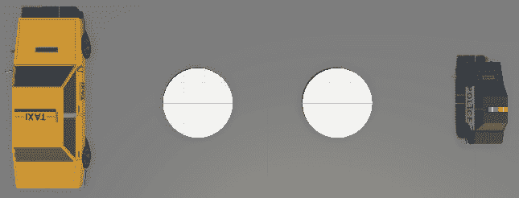

图 5.1 – 出租车和警车及其传送锚点

接下来，我们将通过在`Taxi 传送锚点`上直接添加一个按钮来增强`Taxi 传送锚点`。

### 添加出租车动画的按钮

为了使出租车动画的按钮突出并易于访问，我们将将其放置在一个使用圆柱体创建的底座上。这个圆柱体将作为按钮的专用支架：

1.  要创建这个底座，在“出租车按钮支架”上右键点击。调整其大小为尺寸(`0.2`, `0.5`, `0.2`)，并将其放置在(`-2.7`, `0.55`, `0`)的位置。

1.  要找到`资产` | `示例` | `XR 交互工具包` | `2.5.1` | `起始资产` | `演示场景资产` | `预制体` | `交互式对象`。一旦找到，将其拖放到`5`, `5`, `5`)的“出租车按钮支架”上，并调整其 y 坐标到`1.075`，使其正确地放置在底座上。

参考图 5.1.2*，确保新添加的按钮使场景看起来符合预期。在下一节中，我们将专注于设置用于警车动画的文本按钮。

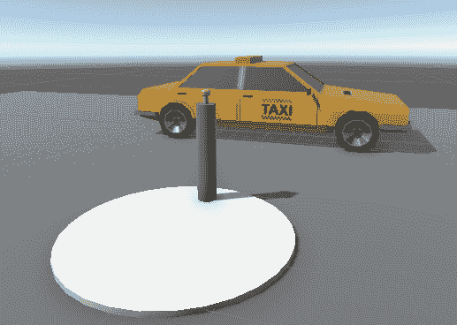

图 5.2 – 我们刚刚添加到场景中的出租车按钮支架

### 为警车动画添加文本按钮

对于我们的警车，我们将创建一个包含两个按钮的画布，使用户能够缩小或放大警车。

#### 设置画布

1.  首先创建一个画布：在层次结构中右键单击并选择**XR** | **UI Canvas**。

1.  调整其尺寸。我们用于此目的的正确尺寸是（`0.001`, `0.001`, `0`），使其成为一个正方形。这种缩放对于在 VR 环境中的最佳观看至关重要。

1.  将画布定位在坐标（`3`,`1`,`-1`）并绕玩家方向旋转（`0`, `90`, `0`）。

1.  如果你遇到困难，无法更改 UI Canvas 属性，请转到画布组件的检查器窗口。在这里，将**Render Mode**从**Screen Space – Overlay**更改为**World Space**。

#### 调整画布组件

1.  在**场景层次结构**中选择画布，打开**检查器**窗口。单击**添加组件**以将新组件附加到画布上。

1.  首先，添加一个`5`。

1.  将**Child Alignment**选择为**Middle Center**。

1.  对于宽度和高度都检查**Child Force Expand**。

1.  为了视觉效果，向画布添加一个**Image**组件。在**Image**组件的设置中，将源图像设置为**UISprite**，并选择一个与场景相协调的背景颜色。

#### 添加按钮

1.  导航到`Assets` | `Samples` | `XR Interaction Toolkit` `2.5.1` | `Starter Assets` | `Prefabs` | `DemoSceneAssets` | `Prefabs` | `UI`。在这里，你应该找到**TextButton**预制体。

1.  将此预制体拖放到**画布**上两次。这将自动在**画布**下方放置两个**TextButton**预制体作为子对象。由于**Vertical Layout Group**，它们将整齐对齐。

1.  将它们缩放到（`0.4`, `0.4`, `0`），并将第一个按钮重命名为`Scale Big Button`，第二个按钮重命名为`Scale Small Button`。

#### 标记按钮

通过展开两次修改每个按钮的子文本对象。选择`Text` GameObject 后，转到检查器窗口并搜索文本组件。将一个按钮标记为`Scale Big`，另一个标记为`Scale Small`。

通过遵循这些步骤，你将有一个整齐组织的 UI，准备好你的警车动画，如图*图 5.3*所示。

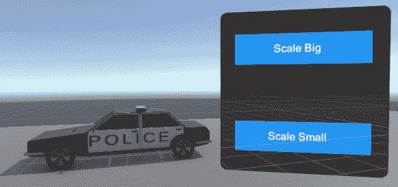

图 5.3 – 警车动画的文本按钮

现在我们已经布置好舞台，准备表演，应该看起来像*图 5.4*。

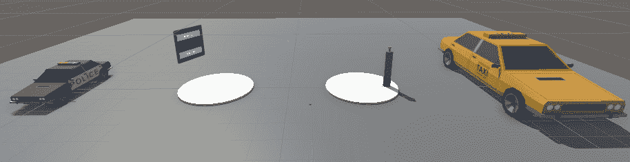

图 5.4 – CarExhibition 场景的当前状态

接下来，我们将了解提线木偶，或者说，在 Unity 中我们可以操作的按钮事件。

## 可交互事件

可交互事件，尤其是在**XR Simple Interactable**组件中找到的事件，在增强用户体验方面发挥着关键作用。这些事件通常与推按钮相关联，在 VR 环境中促进多样化的交互。有众多不同的可交互事件选项。想象你在一个虚拟现实汽车展览中，你可以与每辆车旁边的推按钮进行交互。以下是如何将这些事件应用于此场景的示例：

+   **First Hover Entered**: 你第一次接近一辆车并指向其信息按钮。此事件触发按钮周围微妙的发光，表明它已被选中。

+   **Hover Entered**: 每次你指向按钮时，事件会更新光泽，显示按钮目前是您注意力的焦点。

+   **Hover Exited**: 当你的手或指针从按钮移开时，光泽消散，表明按钮不再被选中。

+   **Last Hover Exited**: 最后一次你从按钮移开时，光泽消散，按钮似乎微妙地回到了原始位置，表明它不再在焦点上。

+   **First Select Entered**: 第一次你按下信息按钮时，此事件被触发。它可能会使汽车的信息面板以平滑的动画出现。

+   **Select Entered**: 每次你按下按钮，无论是否是第一次按下，汽车的信息面板都会出现。

+   **Select Exited**: 当你释放按钮时，面板开始淡出，表明交互结束。

+   **Last Select Exited**: 最后一次你释放按钮时，面板不仅淡出，还似乎缩回到按钮中，标志着交互的结束。

+   **Activated**: 此事件可能与汽车上的一个按钮相关联，该按钮可以启动引擎。按下后，你会听到汽车引擎轰鸣着启动。

+   **Deactivated**: 当你按下按钮关闭汽车的引擎时，此事件被触发。你会听到引擎逐渐减速至停止。

这一系列事件为用户提供了一种自然直观的交互流程，增强了 VR 汽车展览的沉浸感。

在下一节中，我们将深入探讨如何编排这些交互并使动画生动起来，而无需编写任何代码。

## 理解动画和动画师系统

Unity 的**动画系统**通过控制 GameObject 的运动、旋转、大小、颜色等来操纵 GameObject，就像一个机制。它通过定义关键帧（特定时间点的特定状态）来工作，并从这些关键帧中构建动画剪辑。

考虑虚拟门的例子。一个动画剪辑可以展示门从关闭到打开的运动，另一个剪辑可以描绘门返回到关闭位置。

为了确保这些剪辑之间的平滑过渡，使用 Unity 的**动画控制器**。这是一个控制系统，它指导动画剪辑的时间安排和顺序，根据特定条件在它们之间进行切换。

对于门示例，动画控制器将管理开门、关门以及在这些状态之间切换的剪辑，可能基于用户输入在正确的时间进行。

这里是使用 Unity 的动画系统可以制作的其它示例：

+   **对象移动**：对于在屏幕上移动的对象，动画系统可以创建移动，但可能需要额外的脚本根据用户交互来控制它。

+   **对象旋转**：可以动画化一个持续旋转的齿轮，但玩家控制的旋转则需要代码。

+   **对象缩放**：缩放动画可以描绘对象的生长，但将其与其他因素（如能量水平）关联起来则需要编写脚本。

+   **颜色变化**：可以为变化的光颜色制作动画，但与游戏条件同步则需要编码。

+   **摄像机移动**：可以使用关键帧在角色之间创建摄像机移动，但与玩家移动的复杂交互可能需要额外的代码。

+   **混合形状**：可以使用混合形状来控制面部表情，但可能需要编写脚本来使其与特定的游戏对话相匹配。

+   **UI 动画**：可以动画化图形 UI 元素，如闪烁的按钮，但当满足某些条件（例如，比赛开始）时停止动画则需要脚本。

如这些示例所示，Unity 中的动画系统为使对象和场景生动提供了强大的工具。然而，向这些动画添加脚本或编码可以解锁更高层次的精炼和交互性。

通常，编码使我们能够在 Unity 中创建可以响应各种输入和游戏状态的动画，使它们更加动态。编码还提供了对动画的精确控制，允许实现仅使用 Unity 的动画系统无法实现的复杂逻辑和定制交互。

虽然 Unity 的动画系统可能没有编码提供的相同复杂性和精细控制，但它仍然在 Unity 内创建交互的主要工具中占据着重要的位置。直观的视觉界面和直观的控制允许快速且用户友好的方式来动画化 GameObject，即使不深入脚本。这使得它既适合新手也适合经验丰富的开发者，使他们能够为游戏场景添加生命和动作。

在本章的下一节中，我们只将使用动画系统，展示它单独使用时的强大和实用性。通过实际示例，您将看到如何在不依赖编码的情况下实现引人入胜和交互式的动画，以及这个工具如何成为您 XR 开发工具包的重要组成部分。

## 动画 360 度汽车旋转。

让我们深入动画的世界。想象一个旋转的陀螺：它一圈又一圈地旋转，当我们按下按钮时，我们希望我们的出租车也能这样做。转折在于，当我们松开按钮时，出租车应该停止旋转。听起来很有趣吗？我们将如何利用 Unity 动画系统和 UnityEvents 的魔力来实现这一点，而无需编写一行代码。

首先，我们需要为我们的出租车编排这个旋转。想象它就像一个旋转，在出租车 y 轴上的 360 度旋转。按照以下步骤将这个舞蹈变成现实：

1.  在`Assets`文件夹中右键单击并选择**Create** | **Folder**。

1.  在你的场景中选择出租车对象，转到`RotateCar`，并将其保存在我们新创建的`Animations`文件夹中。

1.  通过选择**Transform** | **Rotation**并修改你的关键帧，为 y 轴定义 360 度旋转，如*图 5.5*所示。

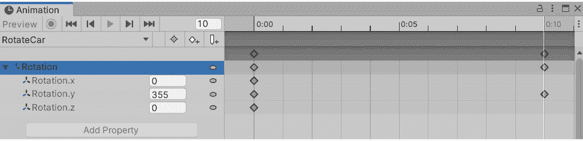

图 5.5 – 定义 y 轴 360 度旋转的修改后的关键帧

在`0:00`处设置初始关键帧，旋转为`0`；这是我们的出租车起始姿势。然后，跳到`0:10`并给予`355`度的旋转。为什么不旋转 360 度？那就像转动一枚硬币，对我们温柔的旋转来说太突然了。

1.  在项目窗口中单击`RotateCar`动画剪辑以在检查器中查看其设置。在检查器中，勾选**Loop Time**框，让我们的出租车持续重复其旋转。

1.  将`RotateCar`动画剪辑附加到**Animator**组件的**Controller**字段。

这将使我们的出租车旋转在我们进入虚拟世界时立即开始。但记住，我们希望旋转只在按下按钮时开始。是时候让它发生：

1.  首先，我们需要打开 Animator Controller。选择我们的出租车**Animator Controller**，双击以打开 Animator Controller 窗口。

1.  就像一张空白画布，在`Idle`上右键单击；这是出租车旋转风暴前的平静。

1.  接下来，在`Idle`状态上右键单击，将其设置为**Layer Default State**。这告诉 Animator Controller 从该状态开始，当场景开始时什么都不做。

1.  然后，我们从`Idle`状态到`RotateCar`状态建立一座桥梁：这个状态启动我们的出租车旋转。为此，在`Idle`上右键单击，选择`RotateCar`。

1.  现在，让我们导航到`Rotate`。这个参数将启动从`Idle`状态到`RotateCar`状态的过渡。

1.  单击表示从`Idle`到`RotateCar`过渡的箭头。在刚刚创建的`Rotate`参数中，如*图 5.6*所示。

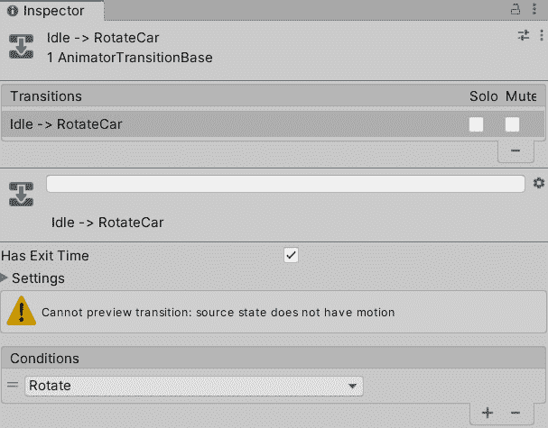

图 5.6 – 显示新添加条件的检查器窗口：旋转触发器

1.  接下来，我们需要在按钮释放时停止出租车的旋转。在`RotateCar`状态上右键单击，选择`Idle`状态。

1.  返回到`StopRotation`。这将启动从`RotateCar`状态回到`Idle`状态的过渡。现在，你的参数应该与*图 5.7*中显示的相匹配。

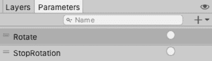

图 5.7 – 动画器窗口的参数选项卡，显示了新添加的参数

1.  点击从`RotateCar`到`Idle`状态的转换箭头。在`StopRotation`参数下，就像我们之前对`Rotate`参数所做的那样。现在，你的**Animator**窗口应该类似于*图 5.8*。

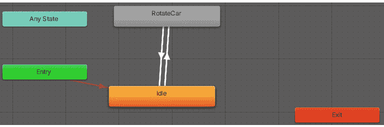

图 5.8 – 显示当前状态及其转换的动画器窗口

1.  选择`Animator.SetTrigger()`。将其视为我们的出租车开始或停止舞蹈的提示。当按钮被按下时（`Rotate`），当按钮被释放时（`StopRotation`）。如果设置正确，你的事件将反映在*图 5.9*中。

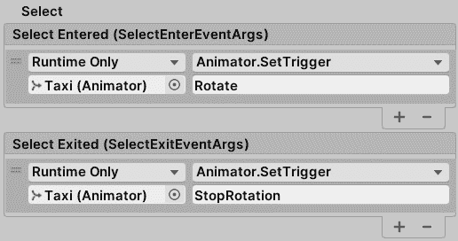

图 5.9 – 选择进入和选择兴奋事件

干得好！你的出租车现在可以随着按钮的节奏跳舞了，每次按下按钮都会旋转一整圈。别忘了试试：用力按下按钮，看看出租车如何完成 360 度的旋转。

在下一节中，我们将深入了解画布上 2D 文本按钮的魔法，学习它们如何通过按按钮来改变警车的大小，使其缩小或放大。

## 缩放警车

想象一下在我们的 VR 汽车展览中加入两个额外交互功能的迷人可能性：一个按钮可以缩小汽车，另一个按钮可以放大它。类似于我们之前的交互，我们将使用一系列程序，但这次是在画布上的 2D 按钮上。首先，我们创建两个动画剪辑，捕捉汽车缩放上下时的本质变化。接下来，我们创建一个动画控制器：这是一个关键组件，用于定义和管理动画状态。最后，我们将相应的触发事件分配给按钮。

让我们按照以下步骤将这个魔法变为现实：

1.  在层次结构中选择警车。打开动画窗口（`ScaleCar`）并将其存储在`Animations`文件夹中。

1.  现在，让我们编排这个变换。在动画窗口的时间轴上，用关键帧（菱形图标）标记开始（`0:00`）和结束（`1:00`）。开始时，汽车的缩放比例（`0`）。结束时，缩放比例应该是最大尺寸；让我们使用 `3`。这样我们就得到了一个动画，展示了汽车从微小到巨大的缩放过程。

1.  我们不希望我们的汽车持续地缩小和放大。所以，在检查器中取消选择**Loop** **Time**框。

1.  我们的警车需要一个`ScaleCar`动画剪辑放入**Animator Component**的**Controller**字段中。

1.  我们已经掌握了增长的部分，现在让我们来处理缩小部分。创建一个名为`ShrinkCar`的第二个动画片段。

1.  与*步骤 2*类似，用关键帧标记开始和结束。这次，在开始时，汽车的缩放比例应该是其最大尺寸（`3`）。在结束时，缩放比例应该是其最小尺寸（`0`）。我们现在已经反转了变形，创建了一个从巨大到微小缩小的动画。

到目前为止，我们已经成功创建了两个动画片段和一个动画控制器。如果我们播放场景，由于未勾选“未检查循环”复选框以及我们的动画控制器中没有缩小动画，警车会因循环而放大一次。我们离我们的变形车又近了一步。准备好下一部分了吗？让我们深入探讨。

现在，是我们让我们的警车按照我们的曲调跳舞的时候了。我们希望它在需要时改变大小，在我们不需要时处于空闲状态。这就是动画控制器发挥作用的地方。它是我们的指挥家，决定汽车何时增长、缩小或休息。以下是我们将它实现的方法：

1.  首先，我们需要打开动画控制器。在项目窗口中找到分配给警车的动画控制器，并双击打开它。

1.  记得我们的缩小舞蹈吗？将`ShrinkCar`动画片段拖放到**动画控制器**窗口中。它现在既有增长也有缩小的程序。

1.  现在，我们需要一个休息状态，在舞蹈序列之间的喘息。在`Idle`上右键单击。就像暴风雨前的平静。

1.  我们不希望汽车在帷幕升起时立即开始跳舞。因此，将`Idle`状态设置为默认状态。这确保了当场景开始时，我们的汽车静止不动，等待其提示。

1.  我们的指挥家已经准备好指挥了。在`Idle`状态上右键单击，选择`ScaleCar`，然后再次选择`ShrinkCar`状态。现在，我们已经为我们的汽车从静止不动过渡到变大和变小做好了准备。

1.  但是，是什么触发了过渡？我们需要为此设置触发参数。在`ScaleBig`和`ScaleSmall`中。

1.  选择过渡箭头。在`ScaleBig`中触发从`Idle`到`ScaleCar`的过渡，而`ScaleSmall`触发从`Idle`到`ShrinkCar`的过渡。

    舞蹈永远不会是单向的。我们的汽车需要从增长到缩小，反之亦然，平滑地移动。因此，从`ShrinkCar`到`ScaleCar`创建过渡，为下方的过渡箭头设置`ScaleBig`触发器，为上方的过渡箭头设置`ScaleSmall`触发器，如图*图 5.10*所示。

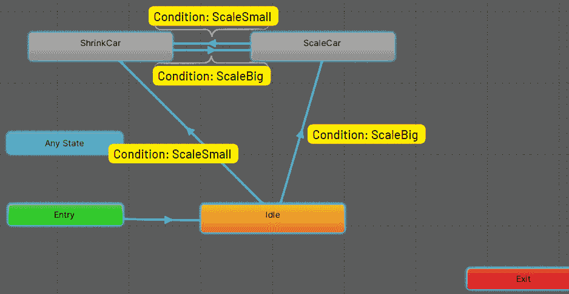

图 5.10 – 警车的动画控制器

哇！我们的警车现在可以按照我们的指令旋转了。尝试这个场景，并观察它如何在你意愿下优雅地放大和缩小，方法是将场景测试或部署到你的 VR 头盔上，如*第三章*中“将 VR 体验部署和测试到不同的 VR 平台或模拟器”部分所述。这不是一件令人愉快的事情吗？

# 使用 C#构建交互式 VR 体验

到目前为止，我们只是通过使用 Unity 的动画系统，没有写一行代码，就为我们的场景添加了交互。在接下来的章节中，你将学习如何使用 C#脚本为你的 GameObject 和场景添加更复杂的交互。

我们将要回答的第一个问题是：我们何时需要为动画和交互编写 C#代码？

## 理解何时使用 C#进行动画和交互

理解 Unity 的动画和动画师系统以及 C#脚本的使用不是相互排斥的非常重要。它们经常一起使用，其中动画师控制预定义的动画，而 C#根据用户输入或其他游戏事件添加交互性。

在上一节中，我们使用 Unity 的动画和动画师系统旋转和缩放了汽车。这些系统主要用于创建预定义的动画。我们可以将这个过程分为以下三个步骤：

1.  **初始化事件**：首先，必须发生一个事件来启动动画。这可以是一个按钮按下、游戏事件、碰撞或其他触发器。在我们的例子中，为了缩放和旋转汽车，我们使用了一个物理按钮和一个 2D UI 按钮。Unity 内置的动画和动画师系统主要是围绕预定义的动画在特定条件下触发的理念设计的。这些条件通常在 Animator Controller 本身中定义，并且通常基于你事先设置的参数，例如一个布尔值来跟踪角色是否在跳跃，或者当按钮被按下时激活的触发器。这意味着，使用内置系统，我们没有能力根据游戏中的任何事件或条件触发动画，而必须与可用的事件一起工作。

1.  **动画**：使用 Unity 的动画系统，我们通过创建关键帧来定义动画期间发生的变化（位置、旋转、缩放等）。例如，我们使用关键帧改变了汽车的旋转和缩放。

1.  将`ShrinkCar`状态转换为`ScaleCar`状态。

这个系统非常适合创建预定义的动画，这些动画在特定条件下发生；例如，角色动画（行走、跑步、跳跃）或环境动画（门打开、电梯移动）。

虽然 Unity 的内置系统在预定义动画方面表现出色，但当动画需要动态响应用户输入或其他游戏事件时，C#就派上用场。在这里，我们遵循与之前类似的步骤：

1.  **初始化事件**：启动动画的事件可以是任何东西，例如按钮点击、用户输入或游戏状态的变化。与 Unity 内置系统最大的不同之处在于，使用 C#脚本，你对动画的初始化事件有更大的灵活性和控制力。例如，你可以响应复杂的输入序列，如格斗游戏动作连招。你可以基于游戏逻辑或游戏状态来创建动画，例如敌人的健康水平或玩家的当前得分。你可以根据碰撞、进入/退出特定区域或其他物理事件来触发动画。

1.  **AI 决策**：你可以根据 AI 系统做出的决策来启动动画。在多人游戏中，你可以根据网络事件（如其他玩家的动作）触发动画。

1.  **动画**：动画可以通过两种方式创建：

    +   你可以使用动画系统创建关键帧，就像之前一样，然后使用 C#来控制这些动画的播放（例如，播放、暂停、停止或改变速度）。

    +   或者，你可以使用 C#直接修改 GameObject 的属性，以编程方式创建动画。

1.  **状态控制**：使用 C#，你可以更直接地控制动画和过渡何时以及如何发生。你可以根据游戏状态的任何方面创建条件，而不仅仅是动画控制器中的参数。例如，你可以根据玩家的健康或库存更改 NPC 的动画。

当动画需要以复杂的方式对游戏状态或用户输入做出响应时，使用 C#进行动画是理想的。这在以下场景中尤其如此：

+   **实时用户输入**：你通常使用 C#来根据实时用户输入动画 GameObject。例如，在飞行模拟器中，你可能根据玩家的操纵杆输入来动画化飞机的控制面（如副翼、升降舵和方向舵）。由于这些表面的确切位置取决于玩家的输入，这不是可以通过关键帧预先确定的事情。

+   **基于物理的动画**：如果你的动画需要包含或响应物理效果，通常通过编程方式动画化是合理的。例如，在台球游戏中，球体的移动和旋转是基于物理计算而不是预定义路径。

+   **程序生成内容**：当你的游戏内容是程序生成时，通常需要通过编程方式动画化事物，因为动画的确切性质无法预先确定。例如，在类似《暗黑破坏神》的地下城探险游戏中，地下城的布局和敌人的位置是即时生成的，因此与这些元素相关的任何动画也必须在运行时生成。

+   **复杂 AI 行为**：在创建复杂 AI 行为时，你可能使用 C#来根据 AI 的决策过程来动画化 GameObject。例如，一个敌人角色可能有一个空闲动画、一个行走动画和一个攻击动画，你可以使用 C#来决定根据 AI 的当前状态和玩家的位置播放哪一个。

现在我们已经了解了在哪些场景下使用 C#进行动画和交互是有用的，让我们在下一节通过使用滑块缩放汽车来应用我们的新知识。这属于“实时用户输入”类别。当我们想使用滑块缩放汽车时，是用户输入（移动滑块）在驱动动画（汽车的缩放）。这种交互不能通过关键帧预先定义，因为汽车的精确缩放取决于玩家在任何给定时刻的输入。但在我们将这些添加到场景之前，我们首先需要了解 C#语言的基础知识，这些知识将在下一节中解释。

## 在 Unity 中使用 C#进行脚本编写理解

在 Unity 中进行 VR 开发的脚本创建涉及使用 C#。作为一种高级语言，它简化了许多计算复杂性，与 C++等语言相比，它更加用户友好。

通过其强大且静态的类型系统，C#可以帮助你在 Unity 中运行游戏之前发现编程错误，这对开发者来说非常有帮助。此外，它擅长管理内存使用，因为它最小化了**内存泄漏**的风险——一种游戏消耗越来越多的内存，可能引起崩溃的情况。

C#由微软支持，这确保了你能够获得可靠的帮助、大量的工具以及访问一个庞大的开发者社区。而且，重要的是，就像 Unity 一样，C#支持多个平台。

当在 Unity 中使用 C#时，你的编码主要是基于事件的。这意味着你覆盖了某些在特定时间被触发的 Unity 函数，例如游戏的`Start()`或`Update()`函数。

现在，当谈到在 Unity 中使用 C#进行 VR 开发时，有三个关键的对象导向编程概念你需要理解：变量、函数和类。让我们更深入地了解这些概念。

### 变量

**变量**就像是你的脚本用来存储数据的存储盒。每个变量都有一个类型，它告诉你它可以存储什么类型的数据。例如，如果你正在使用 XR 交互工具包，你可能会有变量来存储诸如 VR 控制器位置、虚拟世界中的对象状态等数据。让我们看看以下代码片段中我们如何使用变量在 Unity 的 C#脚本中的例子：

```cs
public class XRGrab : MonoBehaviour
{
    public XRGrabInteractable grabInteractable;
    private bool isGrabbed = false;
}
```

在前面的代码中，`grabInteractable`是一个`XRGrabInteractable`对象，它代表了一个可以与之交互的 VR 对象。`isGrabbed`是一个私有的布尔变量，用于跟踪对象是否当前被抓住。

### 函数

将 C#中的**函数**（或方法）想象成烹饪食谱。就像食谱提供一步步的指导来烹饪一道特定的菜肴一样，C#中的函数由一组执行特定任务的指令组成。你可以多次重用这些食谱，无论是在同一脚本中还是在不同的脚本中。

在 Unity 中，有一些特殊函数，如独特的烹饪食谱，在脚本的生命周期中的特定时间被触发。以下是它们的概述：

+   `Awake()`: 这就像是你脚本的闹钟。当脚本首次唤醒（或加载）时，这个函数会响起。通常，它用于设置变量或游戏的状态。

+   `Start()`: 这就像是在起跑线上准备起跑的运动员。在游戏的第一帧显示之前，这个函数会被调用。它也用于设置事物，但与 `Awake()` 不同，如果脚本未启用，则不会运行。

+   `Update()`: 这个函数是游戏的心脏，每帧跳动一次。它通常用于需要定期执行的任务，例如移动对象、检查用户输入等。

+   `FixedUpdate()`: 这就像 `Update()`，但它以恒定的速度运行，不受帧率的影响。它通常用于与物理相关的任务。

+   `LateUpdate()`: 这是一个在其他人之后整理的函数。它在所有 `Update()` 函数执行完毕后运行，执行所有其他任务。

+   `OnEnable()`: 这是一个特殊的 Unity 方法，当脚本附加的对象在游戏中变为活动状态时会被调用。

现在，当涉及到 VR 交互时，Unity 的 XR 交互工具包提供了一组自己的特殊函数，这些函数会对 VR 动作做出反应。以下是一些你想要了解的重要函数：

+   `OnSelectEntered()`: 当你在 VR 中选择一个可交互对象时，会调用这个函数。想象一下，当你用 VR 控制器指向一个虚拟对象的那一刻。

+   `OnSelectExited()`: 这个函数是在你停止选择一个可交互对象的那一刻。想象一下，就像是你放开了你指向的对象。

+   `OnActivate()`: 这是在你激活一个可交互对象时发生的。这有点像在你已经拿着对象的同时按下按钮。

+   `OnDeactivate()`: 这是在你停用对象时发生的。这就像是你放开了你刚刚按下的按钮。

+   `OnHoverEntered()`: 当你开始悬停在可交互对象上时，会调用这个函数。这可以用来使对象发光，例如。

+   `OnHoverExited()`: 这个函数是在你停止悬停在某个对象上时触发的。

这些函数可以通过不同的方式组合起来，以在虚拟世界中创建各种交互。这就像堆叠积木来创建更复杂的东西。

### 类

使用`MonoBehaviour`、`ScriptableObject`或其他类来展示 C#中类的特性。让我们通过一个名为`XRGrab`的示例类来了解，它继承自基类`MonoBehaviour`。这个类的第一部分包括以下内容：

```cs
public class XRGrab : MonoBehaviour
{
    public XRGrabInteractable grabInteractable;
    private bool isGrabbed = false;
```

在前面的例子中，`XRGrab`类包含两个字段。`public XRGrabInteractable grabInteractable`是对`XRGrabInteractable`对象的引用。这个脚本通常附加到你想要在 VR 或 AR 环境中使其可交互的 GameObject 上；例如，用户应该能够抓取的对象。`isGrabbed`是一个布尔变量，用于跟踪可交互对象是否当前被抓取。

我们类的下一部分是方法。我们类中的第一个方法是`OnEnable()`：

```cs
    void OnEnable()
    {
        grabInteractable.onSelectEntered
            .AddListener(Grabbed);
        grabInteractable.onSelectExited
            .AddListener(Released);
    }
```

`OnEnable()`方法将`Grabbed()`和`Released()`方法作为监听器添加到`grabInteractable`对象的`onSelectEntered`和`onSelectExited`事件。这意味着当用户通过选择在 VR/AR 世界中与对象交互时，将调用`Grabbed()`方法，而当用户停止与它交互并取消选择时，将调用`Released()`方法。

让我们看看这两个方法可能的样子：

+   下面是`Grabbed()`方法：

    ```cs
        void Grabbed(SelectEnterEventArgs args)
    ```

    ```cs
        {
    ```

    ```cs
            isGrabbed = true;
    ```

    ```cs
        }
    ```

    `Grabbed()`方法将`isGrabbed`设置为 true，表示对象已被抓取。

+   下面是`Released()`方法：

    ```cs
        void Released(SelectExitEventArgs args)
    ```

    ```cs
        {
    ```

    ```cs
            isGrabbed = false;
    ```

    ```cs
        }
    ```

    ```cs
    }
    ```

    `Released()`方法将`isGrabbed`设置为 false，表示对象已被释放。

正如你所见，在 Unity 中使用 C#进行脚本编写涉及定义变量来存储数据，实现函数来操作这些数据或实现游戏玩法，并将这些变量和函数组织成代表游戏中对象或概念的类。然后 Unity 引擎使用这些脚本来驱动场景中 GameObject 的行为。

在 C#的领域里，类名通常遵循**PascalCase**约定，即每个单词以大写字母开头，且没有下划线。你可以自由选择任何你喜欢的名字，只要它符合 C#的一般命名约定。以下是命名指南：

+   名称应该以大写字母开头，而不是下划线或数字。

+   名称可以包含字母和数字，但不能包含下划线。

+   空格或特殊字符不应成为名称的一部分。

+   最后，名称不能是 C#中的保留词。例如，“class”、“int”、“void”等都是保留的，不能用作名称。这是因为它们在 C#中有特定的含义，作为其语法的一部分。编译器期望它们以特定的方式使用，因此将它们用作标识符会导致混淆并导致编译错误。

这就是 Unity 中用于 VR 开发的脚本编写的温和介绍。如果它听起来仍然有点复杂，请不要担心；就像任何语言一样，熟能生巧，这正是您将在下一节中要做的！

## 使用滑块和 C#缩放公交车

我们即将开始一项令人兴奋的任务：通过向公交车添加动态缩放功能来丰富我们的汽车展览体验。之前，我们使用固定动画来缩放警车。然而，这次，我们将根据用户与滑块的交互实时缩放公交车。

通过这些步骤，我们将实现我们的目标。所以，让我们开始吧：

1.  首先，我们需要将公交车带入我们的场景。转到`Assets` | `Simple Vehicle Pack` | `Prefabs`，将`Bus_2`拖放到场景中。将其定位在坐标(`0,0,-6`)，y 轴上有一个`-90`度的旋转。

1.  接下来，我们需要一个滑块和一个描述性文本，表明可以通过滑块调整公交车的大小。为了完成这个任务，我们首先需要创建一个画布。在层次结构中右键单击，选择`0.01,0.01,0`），将其定位在(`0,1.5,-5`)，并旋转到(`0,180,0`)。现在它面向玩家的方向。请注意，您必须设置`Bus Scale Canvas`以提高清晰度。

    在向画布添加 UI 元素之前，还缺少一件事情：**垂直布局组**组件。让我们在检查器中添加这个组件，并将**子对齐**属性更改为**上居中**。这确保了滑块和文本都将垂直对齐在画布的上居中位置。

1.  接下来，我们可以添加滑块。在`0`和`5`上右键单击，允许公交车在这两个值之间缩放。让我们将滑块重命名为`Bus Scale Slider`以区分。

1.  为了增强用户体验，我们还将滑块上方放置一个文本。通过在`Bus Scale Slider`上右键单击，选择`Bus` `Scale Text`来添加一个`Slider`游戏对象。

我们现在已经设置了滑块，它作为我们的初始化事件，如*图 5**.11*所示。

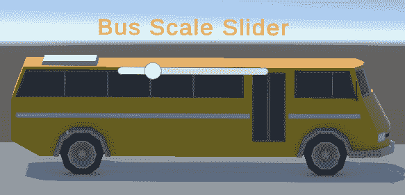

图 5.11 – 公交缩放滑块

在此之后，我们将通过单个 C#脚本将缩放动画和状态控制链接起来。想法是将滑块的值绑定到公交车的缩放。

在进行脚本编写之前，建议通过创建一个新的文件夹来保持组织：

1.  在`Assets`文件夹中右键单击，选择`Scripts`。

1.  在这个新文件夹内，创建一个新的 C#脚本并将其重命名为`BusScaler`。这个脚本将是我们将动态缩放变为现实的主要工具。

1.  现在双击脚本。这将打开您计算机上安装的 IDE。这是我们将要开发的代码。

### 编写动画脚本

以下说明指导您了解`BusScaler`脚本的主要组件如何相互交互：

1.  从以下两行代码开始，定义您的命名空间：

    ```cs
    using UnityEngine;
    ```

    ```cs
    using UnityEngine.UI;
    ```

    任何 Unity 中的 C#脚本的第一步是使用`using`关键字来包含命名空间。`UnityEngine`包含创建 Unity 游戏所需的所有类，而`UnityEngine.UI`包含创建和操作 UI 元素的类。

1.  类声明接下来。在我们的脚本中，让我们声明一个新的类`BusScaler`，以下代码序列：

    ```cs
    public class BusScaler : MonoBehaviour
    ```

    此类从`MonoBehaviour`继承，它是所有 Unity 脚本的基础类。

1.  接下来，声明`BusScaler`类的变量，以下代码序列：

    ```cs
    public GameObject bus;
    ```

    ```cs
    public Slider slider;
    ```

    `public`关键字表示这些变量可以从其他脚本访问，也可以从 Unity 的`bus`变量中设置，它将在场景中持有公共汽车对象，而`slider`变量将在场景中持有滑块 UI 对象。

1.  接下来，让我们重写`Awake()`函数，在游戏开始之前设置初始设置和引用。这包括将公共汽车的初始比例在 x、y 和 z 轴上设置为`1`。我们使用以下代码片段来完成：

    ```cs
    private void Awake()
    ```

    ```cs
    {
    ```

    ```cs
    bus.transform.localScale = new Vector3(1f, 1f, 1f);
    ```

    ```cs
    }
    ```

1.  我们的最后一步是重写`Update()`函数。输入或粘贴以下代码行：

    ```cs
    private void Update()
    ```

    ```cs
    {
    ```

    ```cs
    float scaleValue = slider.value;
    ```

    ```cs
    bus.transform.localScale = new Vector3(scaleValue, scaleValue, scaleValue);
    ```

    ```cs
    }
    ```

    此代码检索滑块的值（该值在 Unity 的 Inspector 中设置的滑块最小值和最大值之间），并将公共汽车在 x、y 和 z 轴上的比例设置为该值。这意味着如果滑块的值为`0.5`，公共汽车将变为原来大小的一半。

### 测试我们的动画

现在我们已经完成了 C#脚本，只剩下几个步骤就可以完成测试我们的动画：

1.  在我们的 C#脚本中，`BusScaler`类从`MonoBehaviour`派生。为了使用此脚本，它需要在 Unity 编辑器中的 GameObject 中关联。为此，在层次结构中右键单击并选择`Bus` `Scaler Controller`。

1.  接下来，你可以将你的脚本拖放到新 GameObject 的**Inspector**面板中。这个动作将把你的脚本附加为一个组件。

1.  完成此操作后，你会在 Unity 编辑器中的脚本组件中注意到公共字段`bus`和`slider`变得可见。这些字段需要填充实际的`bus` GameObject 和此脚本将要与之交互的滑块对象。为此，只需将这些对象拖放到相应的字段中，如图*图 5**.12*所示。

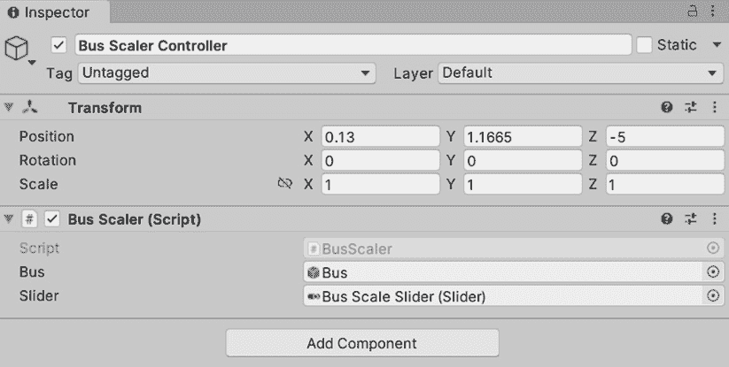

图 5.12 – 将公共汽车缩放器脚本中的公共汽车和滑块对象放入相应字段的公共汽车缩放器控制器的 Inspector 窗口

1.  在你可以测试你的交互式滑块之前，最后的步骤是在它前面放置一个传送锚点。这可以通过回到我们的工具箱，导航到`Assets` | `Samples` | `XR` `Interaction Toolkit`来完成：

    1.  在这里，你可以找到`Bus` `Teleport Anchor`。

    1.  将此锚点放置在坐标（`0`,`0`,`-2.5`）处，并调整其大小为（`2`,`1`,`2`）。使用这种设置，用户现在可以传送到滑块前方的一个位置，使他们能够交互式地缩放公交车，如图 *图 5.13* 所示。

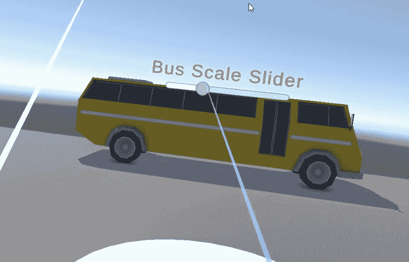

图 5.13 – 用户在 VR 中与滑块交互时公交车如何缩放

欢呼，你已经成功完成了制作此动画所需的所有步骤。现在，是时候再次探索你的交互式 VR 场景了。为此，请遵循*第三章*中“将 VR 体验部署和测试到不同的 VR 平台或模拟器”部分所描述的步骤。

# 摘要

在本章中，你学习了如何在 Unity 中为 VR 场景添加交互性，使用代码依赖和无代码方法。到目前为止，通过成功完成本章提供的步骤，你应该已经让你的 Unity 场景变得生动，并获得了对何时选择 Unity 的动画系统以及何时利用 C# 的力量来满足你的交互场景创建需求的理解和舒适度。

我们深入探讨了触发按钮事件和利用动画系统，从而为你提供了在 VR 场景中创建简单而有效的交互技能，而不必编写一行代码。对于更复杂的交互设计，你现在应该非常熟悉 Unity 中 C# 的基本功能，并且熟悉 XR Interaction Toolkit 提供的强大功能。

不论是工业应用还是学术项目，这些技能和技术应该能够让你利用 XR Interaction Toolkit 和其演示场景在 Unity 中创建沉浸式 VR 场景。你应该准备好将所学知识应用到你的独特用例中。

但我们的旅程并未结束。在接下来的章节中，我们将通过探索在 Unity 中创建交互式 AR 和 MR 体验来拓宽我们的视野。这将确保你能够全面地添加 XR 场景中的交互。让我们继续我们激动人心的探索，进入沉浸式技术的世界。
