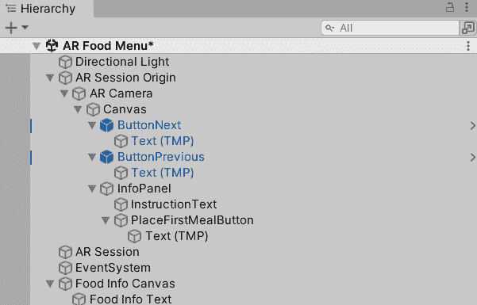
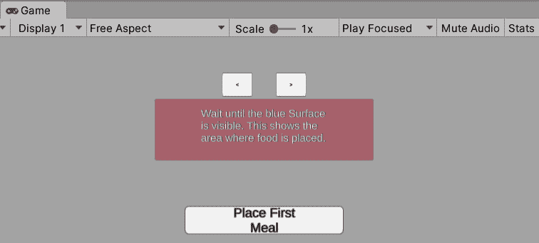
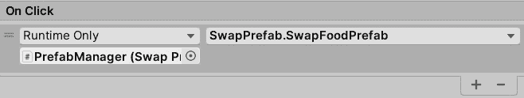
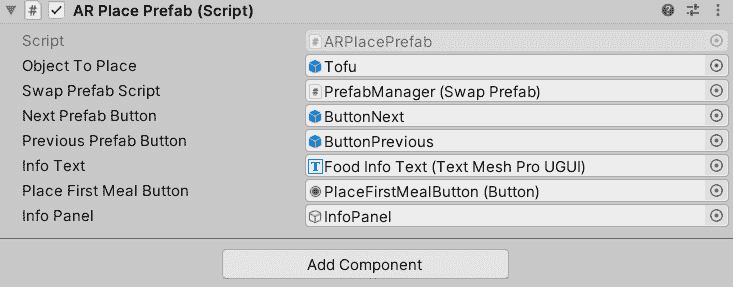
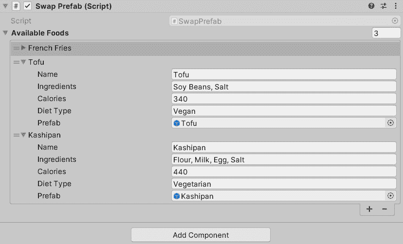
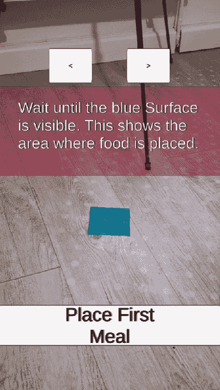
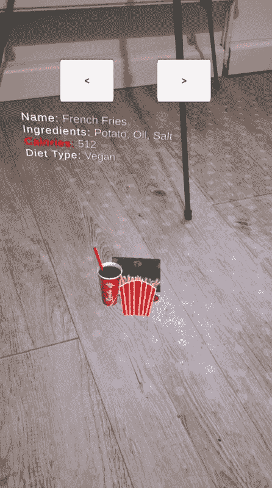

# 6

# 构建交互式 AR 体验

在*第四章*中掌握了在 Unity 中为 Android 和 iOS 平台制作和实现 AR 体验的基础知识后，我们现在将开始一段有趣的旅程，通过引人入胜的交互来增强您的 AR 场景。随着我们努力通过基于实用性的叠加来增强现实，这一章节将为您开启一个全新的用户体验世界。

利用 C#强大的功能，我们的冒险将转向创建一个针对食品行业的创新 AR 应用程序。这个应用程序将彻底改变客户选择的方式，提供一种前所未有的点餐方法。

在我们揭开这个 AR 应用程序的创建过程时，您将发现如何将 3D 模型锚定和缩放在现实世界中，促进用户与 AR 应用程序元素的交互，并理解在构建自己的 AR 应用程序时需要考虑的广泛原则。这次沉浸式的旅程将为您配备一套丰富的技能，提供对 AR 无限可能性的更深入理解。

本章节涵盖了以下主题：

+   理解交互式 AR 应用程序的设计模式和核心组件

+   构建我们的 AR 菜单应用程序的基础

+   为我们的 AR 菜单应用程序添加交互性

# 技术要求

要充分参与并从本章详细介绍的 AR 应用开发过程中受益，您的硬件必须满足以下技术要求。如果您跟随我们在*第四章*中构建的项目，您可以跳过这些要求，只要您的 Unity 设置没有改变。

为了确保您能够跟随本书中的内容和示例，请确认您的计算机系统可以处理*Unity 2021.3* LTS 或更高版本，包括 Android 或 iOS 构建支持。

此外，随着我们深入探索 AR 的迷人世界，拥有一个可以支持*ARKit*或*ARCore*的 Android 或 iOS 设备将非常有帮助。您可以在[`developers.google.com/ar/devices`](https://developers.google.com/ar/devices)检查您的设备兼容性。

然而，如果您没有符合这些要求的设备，您仍然可以参与这些教程，并在您的 PC 上测试您的应用程序。*第四章*中的*将 AR 体验部署到移动设备*部分详细说明了如何做到这一点。

# 理解交互式 AR 应用程序的设计模式和核心组件

在本节中，我们将深入研究 AR 常用的设计模式和应用程序，为您提供选择您 AR 应用程序适当用例的知识。这包括熟悉我们将在本章中构建的 AR 菜单应用程序的核心概念和基本组件。

在开始开发你的第一个完整 AR 应用之前，理解互动 AR 应用的正确应用至关重要。让我们来看看目前存在的各种 AR 应用类型，突出它们增强用户体验的不同方式。这不仅会给你一个关于当前 AR 应用状态的清晰图景，还会揭示哪些类型的 AR 体验最能引起用户的共鸣。

让我们来看看这些不同种类的应用：

+   **增强现实游戏应用**：例如《精灵宝可梦 GO》和《我的世界地球版》这样的游戏是 AR 应用的流行例子。它们将虚拟对象如生物或方块放置在用户的真实世界环境中。交互通常通过触摸屏命令完成，游戏会响应设备 GPS 提供的物理位置数据。

+   **AR 导航应用**：例如 Google Maps Live View 和 CityViewAR 这样的应用将方向提示和兴趣点叠加到现实世界的图像上。这些应用使用 GPS 数据和设备方向来决定显示哪些 AR 元素以及在哪里显示。这些元素可以包括箭头、标签，甚至建筑的 3D 模型。用户主要通过移动和环顾四周进行交互。一些应用还允许用户触摸屏幕元素以获取更多信息。

+   **AR 购物应用**：IKEA Place 和 Amazon AR View 允许用户在购买前在自己的家中可视化产品。这些应用访问用户的摄像头流，以便将产品的 3D 模型放置在他们的房间里。高级应用使用环境理解将对象放置在表面上并正确缩放。用户四处走动以从不同角度查看产品，并使用触摸命令选择不同的项目、更改颜色或功能，并完成购买。

+   **AR 教育应用**：例如 Star Walk 2 和 AR 解剖学习这样的应用旨在提供沉浸式、互动的学习体验。这些应用通常使用图像识别将如星系或人体器官的 3D 模型锚定到现实世界中的特定位置。用户可以通过触摸命令与 3D 模型交互，例如旋转模型或激活动画。用户还可以四处走动以从不同角度查看模型。

这些不同的 AR 应用可能针对不同的用户群体和行业，但它们有一个共同的模式：使用 AR 将 3D 模型投射到现实世界环境中。这些应用使用摄像头流、设备方向和 GPS 数据来定位和缩放 3D 模型。用户交互通过触摸命令或物理动作实现，交互通常集中在操纵 3D 模型的特定功能上。这种强调简单和专注的模式是当前 AR 应用开发的标准，也将成为我们本章讨论的交互式 AR 应用的蓝图。它也是我们推荐用于我们自己的 AR 项目的模式。

注意

记住，目标不是将 AR 功能强行嵌入到应用中，而是要在增强用户体验的地方使用它。例如，使用 AR 在桌子上显示餐厅菜单可能看起来很新颖，但并不一定能为用户提供价值。传统的 2D 应用或实体菜单也能达到同样的目的。然而，如果你创建一个 AR 体验，让用户能够可视化桌子上每一道菜，并按实际份量缩放，用户就能清楚地了解可以期待什么。这增强了用餐体验和整体满意度，展示了 AR 如何通过适当的应用创造有意义的和有益的交互。这正是我们在后续章节中将要创建的内容。

基于这种理解，让我们继续前进，构建我们 AR 菜单应用的基础。

# 构建我们 AR 菜单应用的基础

当我们开始制作这个 AR 菜单应用时，您将通过组装基本组件来为您的 AR 项目打下基础。以下章节将指导您通过 Unity Asset Store 获取和导入各种菜肴，并将 UI 按钮和文本元素添加到场景中，为您的交互式 AR 菜单应用提供基础。

## 定义我们 AR 应用的关键组件

在本章中，我们将构建一个 AR 应用，允许用户将他们的移动设备摄像头检测到的食物 3D 模型放置到现实世界的表面上。在我们进入项目之前，可视化我们即将创建的应用的功能总是很好的。我们的 AR 应用将包括几个关键组件：

+   **AR 会话和 AR 会话原点**：这些是任何 AR Foundation 应用的主要组件。它们构成了我们表演的舞台。为了深入了解 AR 会话原点和 AR 会话，您被邀请重新阅读*第四章*中的*探索 AR 会话原点 GameObject*和*理解 AR 会话 GameObject*部分。

+   **AR 射线投射管理器和 AR 平面管理器**：这些组件默认与 AR 会话原点一起提供。AR 射线投射管理器会对跟踪的 AR 特征和几何形状执行射线投射，例如检测到的平面。我们将使用它来找到我们可以在现实世界中放置 3D 模型的位置。另一方面，AR 平面管理器允许您检测和跟踪现实世界中的水平和垂直表面。

+   **食物预制件**：这些是用户可以在现实世界中放置的食物的 3D 模型。它们是用户将与之交互的有形对象。

+   **UI 按钮和文本元素**：这些 UI 元素用于指导用户了解应用的工作方式，切换当前食物预制件到下一个或上一个，以及显示每道菜的营养成分信息。将这些 UI 元素视为我们应用的交互元素，用户可以参与其中。

+   **ARPlacePrefab 脚本**：这是我们主要的脚本，负责管理 3D 模型和 UI 按钮在 AR 空间中的放置。它还处理放置对象的用户交互，并根据 AR 射线结果更新放置指示器。

+   **SwapPrefab 脚本**：此脚本与 **ARPlacePrefab** 脚本协同工作，当 UI 按钮被点击时，在不同的食物预制件之间切换。

+   `Food`，它使我们能够创建具有特定特征或属性（如名称、成分、卡路里和饮食类型）的 `Food` 对象。

通过实现这些组件，我们将拥有一个可工作的 AR 应用程序，允许用户使用智能手机代替传统的打印菜单，在他们的真实世界环境中放置、查看和交换不同的 3D 食物模型。为了确保用户理解在这个应用程序中他们应该做什么，将在应用程序的开始场景中添加专门的 UI 元素。通过使用如网格等视觉提示，将有助于用户找到放置菜肴的最佳位置。通过添加缩放功能，用户将能够调整显示菜肴的大小，以增强用户体验。

在下一节中，我们将设置我们的 AR 应用程序，以便我们更接近构建一个交互式 AR 应用程序。

## 设置环境

为了开始我们的旅程，让我们首先创建一个新的项目，正如在 *第四章* 中 *使用 Unity 的 AR 模板创建 AR 项目* 部分所解释的那样。如果您已经完成了这些步骤，您可以简单地打开本章的现有项目。在项目加载后，按照以下步骤逐步设置您的环境：

1.  让我们通过创建一个新的空场景来启动这个过程。这可以通过转到 `ARFoodMenu` 来实现。

1.  快速双击将带您进入您新创建的场景，该场景目前仅包含 **主相机** 和 **方向光**。**主相机** 可以被移除，因为它将不再需要。

1.  在深入到 AR 设置之前，为我们的 AR 应用程序打下基础是很重要的。在我们的情况下，这意味着要整合 **AR Session Origin** 和 **AR Session**。您可以通过在 **场景层次** 窗口中右键单击，选择 **XR** | **AR Session Origin**，然后为 **AR Session** 重复相同的步骤来完成此操作。

1.  一旦 `AR Plane Manager` 脚本加载，并选择它。为 **AR Raycast** **Manager** 脚本重复此过程。

1.  在 `ARPlane` 中拖动预制件到 **Inspector** 窗口中 **AR Plane Manager** 脚本组件的 **Plane Prefab** 单元格。由于我们只想检测用于我们的 AR 菜单应用程序的水平平面，因此将 **Detection Mode** 设置为 **Horizontal**。我们不需要为 **AR Raycast Manager** 分配任何预制件，因为我们只需要计算射线何时遇到表面的功能。

就这样！通过几点击，我们已经将**AR 会话**、**AR 会话原点**、**AR 射线管理器**和**AR 平面管理器**添加到了我们的场景中。我们的下一步是导入来自 Asset Store 的食品模型，这将展示我们打算向用户展示的餐点。

## 设计 3D 食品模型

作为一家餐厅的业主，您需要在这个阶段制作您餐点的 3D 模型。以下是一些您可以采用的策略来设计食品或菜肴的 3D 模型：

+   **3D 建模软件**：有许多 3D 建模软件工具可以帮助您创建 3D 模型。这些包括*Blender*、*3ds Max*、*Autodesk Maya*和*SketchUp*。在这些工具中，*Blender*是一个流行的选择，因为它免费且开源。有许多在线教程可以帮助初学者开始使用*Blender*，例如*CGFastTrack*的 YouTube 频道([`www.youtube.com/@CGFastTrack/featured`](https://www.youtube.com/@CGFastTrack/featured))。

+   **摄影测量法**：摄影测量是一种技术，您需要从不同的角度拍摄多个物体的照片，然后使用软件将它们拼接成一个 3D 模型。像*Luma Labs*、*Reality Capture*、*Meshroom*和*Agisoft Metashape*这样的工具可以帮助您完成这项工作。对于食品模型，这可以产生非常逼真的效果，但可能也更复杂，尤其是对于颜色或纹理均匀的食品。

+   **下载预制 3D 模型**：如果您觉得创建模型太耗时或超出了您当前的技术范围，您可以从像*Sketchfab*、*TurboSquid*或*Unity Asset Store*这样的网站上下载预制模型，这是我们在这个项目中将要做的。只需确保您检查许可条款，看看它们是否符合您的需求。

+   **聘请 3D 艺术家**：如果您为项目预留了预算，您可能考虑聘请 3D 艺术家为您创建定制的食品模型。这可以为您提供完全符合您规格的模型。

正如我们之前指出的，为了这个增强现实菜单应用，我们将通过 Unity Asset Store 导入我们的模型。按照以下说明进行操作：

1.  前往 Unity Asset Store([`assetstore.unity.com/`](https://assetstore.unity.com/))并搜索`French Fries – Free`包。或者，您也可以通过此链接访问**French Fries**包页面：[`assetstore.unity.com/packages/3d/props/food/french-fries-free-164017`](https://assetstore.unity.com/packages/3d/props/food/french-fries-free-164017)。

1.  在将包添加到您的资产后，点击现在出现在 Asset Store 网站上的**在 Unity 中打开**按钮。

1.  您的 Unity 项目应该已经打开，您应该会看到一个选项提示您导入包。点击**导入**按钮继续。

1.  一旦包成功导入到您的项目中，重复之前的三个步骤，用于**日本食物豆腐 – 免费**包([`assetstore.unity.com/packages/3d/props/food/japanese-food-tofu-free-203533`](https://assetstore.unity.com/packages/3d/props/food/japanese-food-tofu-free-203533))和**日本食物 Kashipan – 免费**包([`assetstore.unity.com/packages/3d/props/food/japanese-food-kashipan-free-210938`](https://assetstore.unity.com/packages/3d/props/food/japanese-food-kashipan-free-210938))。

现在我们已经将适当的食物餐点导入到我们的场景中，我们已经满足了食物预制件的要求。在下一节中，我们将添加 UI 按钮和文本组件，以引导用户通过 AR 菜单应用程序。

## 向我们的 AR 菜单应用程序添加 UI 按钮和文本元素

在本节中，我们将专注于将三个按钮和两个文本元素集成到我们的场景中。这些按钮分为一个用于启动应用程序和一个用于在菜品之间切换的两个按钮。第一个文本元素用于指导用户通过 AR 菜单应用程序，而第二个则用作占位符，以包含有关显示菜品的详细信息，例如其名称、成分、卡路里含量和饮食类型。

除了第二个文本元素外，这些 UI 元素应始终位于用户的视野内，无论设备如何旋转。这可以通过将它们分配为 AR 摄像机的子对象来实现。

让我们从两个交换菜品的按钮开始。按照以下步骤操作：

1.  导航到**场景层次结构**窗口，右键点击**AR Camera**组件，选择**UI** | **Canvas**。此操作将**Canvas**添加为**AR Camera**的子对象。**Canvas**组件对于所有 UI 元素都是必要的。

1.  将 Canvas 的`0.01`、`0.01`、`0.01`调整到`480`和`90`。将`0`,`0`,`1`定位。

1.  通过右键点击`ButtonNext`和`ButtonPrevious`创建按钮。将两个按钮缩放调整为`0.07`、`0.32`、`1`，并定位到`10`、`40`、`0`和`-10`、`40`、`0`)。

1.  对于两个按钮的子对象，在**检查器**窗口中输入箭头，如`->`和`<-`作为文本输入。这些箭头告诉用户哪个按钮切换到下一道或上一道菜。

在这个阶段，两个按钮已经完全初始化。接下来，我们需要创建一个指导性文本，以指导用户如何使用 AR 菜单应用程序。为了实现这一点，请按照以下逐步说明操作：

1.  右键点击`0.17`、`0.17`、`0.17`。调整面板顶部为`-46.5`，面板底部为`-3.4`。这个面板将作为我们的文本的背景。您可以选择其颜色；在我们的案例中，我们选择了红色。将此面板重命名为`InfoPanel`。

1.  对于指导性文本，右键点击`InstructionText`。将其缩放调整为`0.7`、`0.7`、`0.7`，并定位到`600`和`150`；然后，将其定位到`0`、`0`、`0`。

1.  输入以下文本：`等待蓝色表面可见。这显示了放置食物的区域`。这条指令对于用户来说至关重要，因为我们将在场景中实现一个蓝色网格区域，以指示食物预制件将被放置的位置。

1.  为了防止用户在应用程序启动时直接看到一顿饭，在说明文本下方创建另一个按钮。这个按钮负责生成第一道菜。为此，右键点击 `PlaceFirstMealButton`，将其缩放至 (`2.2`, `2.2`, `2.2`)，并将其定位在 (`0`, `-292`, `0`)，宽度为 `160`，高度为 `30`。

1.  在 **检查器** 窗口中打开 `Place First Meal` 的子文本组件作为文本输入。激活 **活动自动大小** 复选框以确保文本与按钮一起调整。**InstructionText** 和 **PlaceFirstMealButton** 都是 **InfoPanel** 的子对象。它们被设计为在放置第一顿饭之后消失。这意味着我们只需要在我们的代码中针对 **InfoPanel** 而不是三个对象分别进行操作。

最后，我们还需要另一个文本元素，但这次它不应是 **AR 相机** 的子对象。这个文本需要生成在盘子上方并保持一致。

为了完成这个任务，让我们执行以下步骤：

1.  创建另一个 (`0.1`, `0.1`, `0.1`) 并将其定位在 (`0.3`, `0.3`, `1`)，宽度为 `480`，高度为 `90`。将此重命名为 `FoodInfoCanvas`。

1.  右键点击 `FoodInfoText`，将其缩放至 (`0.005`, `0.005`, `0.005`)，并将其定位在 (`-3.4`, `0`, `31`, `0`)，宽度为 `200`，高度为 `50`。**FoodInfoText** 不需要文本输入，因为这将通过程序与显示的菜肴相对应。

在这一点上，你的 **场景层次结构** 窗口应该看起来像 *图 6.1* 中所示的那样。



图 6.1 – 我们项目的场景层次结构窗口，展示了场景中的所有组件

同样，你所有的 UI 元素都应该在游戏视图中对齐，如图 *图 6.2* 所示。



图 6.2 – 我们项目的游戏视图，展示了场景中不同 UI 元素的排列

请注意，所有 UI 元素都是根据 **Canvas** 组件进行定位和缩放的。如果你的 UI 元素与 *图 6.2* 中显示的对齐方式不同，你可以手动调整你的 **Canvas** 组件的位置和缩放。

通过这样，我们已经成功地将所有必要的 UI 元素添加到我们的场景中，因此完成了添加 UI 按钮和文本元素以创建一个交互式 AR 应用程序。接下来，我们将向场景添加脚本以引入一些交互性和活力。

# 为我们的 AR 菜单应用程序添加交互性

为了给我们的当前简陋的 AR 场景注入活力，我们必须将一些 C#脚本整合到我们的项目中。这一关键步骤将赋予我们 AR 应用的用户动态且吸引人的交互能力。

在下一节中，你将概述简短但决定性的**Food**脚本。

## 将 Food 脚本添加到场景中

在我们深入脚本编写之前，让我们首先组织我们的项目工作空间，以便我们可以通过快速找到所需组件来更有效地工作。

首先，在`Scripts`目录下的`Assets`目录中添加一个新的文件夹，并进入该文件夹。在这个空文件夹中右键点击，选择`Food`。双击这个脚本后，它应该会在你偏好的**集成开发环境**（**IDE**）中打开。

创建的`Food`对象将具有某些特性或属性，就像每辆车都有品牌、型号和颜色一样。

下面是这个脚本的简单分解：

```cs
[System.Serializable]
public class Food
{
    public string name;
    public string ingredients;
    public string calories;
    public string dietType;
    public GameObject prefab;
}
```

`[System.Serializable]`是一个指令，告诉 Unity 使这个类可序列化。这意味着 Unity 将能够保存和加载`Food`对象，你将能够在 Unity 编辑器中直接编辑`Food`对象。

在定义一个新的公共类`Food`之后，声明了一个名为`name`的公共属性。这个属性代表食物的名称，例如`French Fries`。接下来，我们声明了额外的属性，如`ingredients`、`calories`和`dietType`。后者属性存储食物适合的饮食类型，如`Vegetarian`、`Vegan`或`Paleo`。

最后，声明了一个公共属性，它将持有代表将在 AR 环境中显示的 3D 模型的`GameObject`。

当我们进入下一节时，我们将通过整合场景中最关键的 C#脚本——**ARPlacePrefab**脚本，继续我们的旅程。正是这个关键组件将真正打开我们 AR 菜单应用中的交互之门。

## 将 ARPlacePrefab 脚本添加到场景中

与本章中我们创建的先前脚本类似，导航到`ARPlacePrefab`中的`Assets`文件夹。

注意

我们强烈建议你克隆本书 GitHub 仓库中的*第六章*项目，并在并行打开它，这样你可以更容易地回顾并模仿本项目教程中描述的步骤。

我们可以通过双击来打开刚刚创建的`ARPlacePrefab`脚本。

小贴士

脚本将在你通常使用的默认 IDE 中启动。如果你希望切换到不同的 IDE，只需在 Unity 编辑器中转到**编辑** | **首选项**。在新打开的**首选项**窗口中，导航到**外部工具**选项卡，并将**外部脚本编辑器**更改为你偏好的 IDE。

如前所述，`ARPlacePrefab`脚本将作为我们的主要脚本。它执行处理 3D 模型和 UI 按钮在 AR 空间内放置的关键角色。此外，它管理用户交互，以便它可以定位对象并根据 AR 射线投射结果动态更新放置指示器。

接下来，让我们看看`ARPlacePrefab`脚本中的各种方法和函数。

### 理解`ARPlacePrefab`脚本

由于`ARPlacePrefab`脚本是我们 AR 菜单应用的核心，我们必须了解它的每一个方法，才能真正掌握交互式 AR 体验的机制，并在各种项目和环境中成功复制脚本的功能。

在下面的代码片段中，您会注意到一些被注释掉的行。这是因为它们引用了尚未创建的**SwabPrefab**脚本，如果取消注释，将导致编译错误。

在`ARPlacePrefab`脚本顶部，声明了各种公共和私有变量：

```cs
public class ARPlacePrefab : MonoBehaviour
{
    public GameObject ObjectToPlace;
    //public SwapPrefab SwapPrefabScript;
    public GameObject NextPrefabButton;
    public GameObject PreviousPrefabButton;
    public TextMeshProUGUI InfoText;
    public Button PlaceFirstMealButton;
    public GameObject InfoPanel;
    private ARRaycastManager _arRaycastManager;
    private Pose _placementPose;
    private bool _placementPoseIsValid = false;
    private GameObject _placedObject;
    private GameObject _nextButton;
    private GameObject _previousButton;
    private Vector2 _oldTouchDistance;
    private GameObject _placementIndicator;
    private GameObject _placementGrid;
```

`ARPlacePrefab`脚本的公共变量允许用户与 AR 空间交互，例如定位`ObjectToPlace`或使用`NextPrefabButton`和`PreviousPrefabButton`在 3D 模型之间循环。它们还允许用户通过`InfoText`和`InfoPanel`查看详细信息，以及使用`PlaceFirstMealButton`激活特定的 AR 放置。此外，它们为扩展的详细信息或选项提供了空间。

另一方面，私有变量控制着 AR 体验的内部机制。`_arRaycastManager`处理真实世界环境中的表面检测，而`_placementPose`表示 AR 对象的期望位置。其有效性通过`_placementPoseIsValid`跟踪。一旦对象放置在 AR 空间中，它就被称为`_placedObject`。触摸手势使用`_oldTouchDistance`。最后，`_placementIndicator`和`_placementGrid`为用户提供视觉提示，指示 AR 对象将放置的位置。

重要提示

一些与尚未引入的**SwapPrefab**脚本相关的行已被注释掉，以防止任何编译问题。我们将在脚本编写过程的最后取消注释它们。

`ARPlacePrefab`脚本的第一种方法是`Start()`方法：

```cs
void Start()
    {
        _arRaycastManager =
            FindObjectOfType<ARRaycastManager>();
        //_nextButton = InstantiateButton(NextPrefabButton,
        //SwapPrefabScript.SwapFoodPrefab);
        //_previousButton =
        //InstantiateButton(PreviousPrefabButton,
        //SwapPrefabScript.SwapToPreviousFoodPrefab);
        _placementGrid = CreatePlacementGrid();
        PlaceFirstMealButton.onClick
            .AddListener(PlaceObjectIfNeeded);
    }
```

当程序首次启动时，会调用此函数。这是脚本初始设置的地点，例如找到被注释掉的`_nextButton`和`_previousButton`，因为它们引用了尚未创建的**SwapPrefab**脚本。此脚本与两个按钮相关联，允许用户在各种食物选择之间循环。

在`ARPlacePrefab`类中调用的下一个方法是`Update()`方法：

```cs
void Update()
    {
        if (Input.touchCount == 2)
        {
            PinchToScale();
        }
        UpdatePlacementPose();
        UpdatePlacementIndicator();
        if (_placementPoseIsValid && Input.touchCount > 0
            && Input.GetTouch(0).phase == TouchPhase.Began)
        {
            PlaceObject();
        }
    }
```

`Update()` 方法就像是脚本的脉搏，在游戏运行时的每一刻都在不断检查事物。如果检测到两指触摸输入，它会根据手指之间距离的变化调整放置对象的缩放，类似于捏合或拉伸动作。它还会更新放置姿态和指示器，这决定了对象将被放置的位置，并监听单一触摸输入。如果检测到单一触摸输入，它会放置对象。

`PlaceObject()` 方法紧随 `Update()` 方法之后，其形式如下：

```cs
public void PlaceObject()
    {
        if (_placedObject != null)
        {
            Destroy(_placedObject);
        }
        _placedObject = Instantiate(ObjectToPlace,
            _placementPose.position,
            _placementPose.rotation);
        _placedObject.transform.localScale = new
            Vector3(0.5f, 0.5f, 0.5f);
        PositionButton(_nextButton, new Vector3(0.5f, 0f,
            0f));
        PositionButton(_previousButton, new Vector3(-0.5f,
            0f, 0f));
        UpdateFoodInfoText();
        _placementGrid.SetActive(false);
    }
```

当在 `Update()` 函数中检测到单一触摸输入时，此函数会被调用。它将选定的对象放置在现实世界中，位置由放置姿态确定。然后，它定位并激活下一个和上一个按钮。接着，它获取有关当前选定食物项目的某些信息，并使用这些信息更新 `InfoText` UI。

`ARPlacePrefab` 类中的下一个方法是 `UpdatePlacementPose()` 方法：

```cs
private void UpdatePlacementPose()
    {
        var screenCenter =
            Camera.current.ViewportToScreenPoint(
            new Vector3(0.5f, 0.5f));
        var hits = new List<ARRaycastHit>();
        _arRaycastManager.Raycast(screenCenter, hits,
            TrackableType.Planes);
        _placementPoseIsValid = hits.Count > 0;
        if (_placementPoseIsValid)
        {
            _placementPose = hits[0].pose;
            PositionGrid(hits[0].pose.position,
                hits[0].pose.rotation);
        }
        else
        {
            _placementGrid.SetActive(false);
        }
    }
```

此方法在 `Update()` 函数中被调用。它就像脚本的眼睛，因为它总是在屏幕中间寻找，并确定在现实世界中对应于虚拟世界中的哪个位置。该方法更新放置姿态，即新对象将被放置的位置和方向。它是通过从屏幕中心发射一条射线并检查它是否击中 AR 环境中的平面来做到这一点的。

`UpdatePlacementIndicator()` 方法与 `UpdatePlacementPose()` 方法类似，其形式如下：

```cs
private void UpdatePlacementIndicator()
    {
        if (_placementPoseIsValid)
        {
            _placementIndicator.SetActive(true);
            _placementIndicator.transform
                .SetPositionAndRotation(
                _placementPose.position,
                _placementPose.rotation);
        }
        else
        {
            _placementIndicator.SetActive(false);
        }
    }
```

此函数也在 `Update()` 函数中被调用。它简单地移动和旋转放置指示器以匹配放置姿态，向用户显示对象将被放置的位置。它还根据是否找到了放置对象的合适位置来打开或关闭 `LineRenderer`。

下一个方法被称为 `InstantiateButton()`，其形式如下：

```cs
private GameObject InstantiateButton(GameObject
buttonPrefab, UnityEngine.Events.UnityAction onClickAction)
    {
        var button = Instantiate(buttonPrefab);
        button.SetActive(false);
        button.GetComponent<Button>().onClick
            .AddListener(onClickAction);
        return button;
    }
```

`InstantiateButton` 方法在 `ARPlacePrefab` 类中扮演着至关重要的齿轮角色。其主要作用是创建并设置用户与之交互以在食物选择之间导航的按钮。当被调用时，该方法接收两个参数：一个按钮预制件和一个在点击按钮时要执行的操作。

该方法首先使用提供的预制件创建一个新的按钮实例。一旦实例化，按钮最初被设置为不活动状态，确保它不会立即出现或干扰用户界面。然后，该方法获取按钮内置的 **On Click** 事件并将其指定操作附加到它，确保在按下按钮时执行所需的函数。最后，该方法返回新创建和配置的按钮，以便在 AR 界面中使用。

脚本中的下一个两个方法充当辅助函数。它们被命名为 `CreatePlacementGrid()` 和 `PlaceObjectIfNeeded()`：

```cs
private GameObject CreatePlacementGrid()
    {
        var grid =
           GameObject.CreatePrimitive(PrimitiveType.Plane);
        grid.transform.localScale = new Vector3(0.01f,
            0.01f, 0.01f);
        grid.GetComponent<Renderer>().material =
            Resources.Load<Material>("GridMaterial");
        grid.SetActive(false);
        return grid;
    }
    private void PlaceObjectIfNeeded()
    {
        if (_placementPoseIsValid)
        {
            PlaceObject();
            InfoPanel.SetActive(false);
        }
    }
```

`CreatePlacementGrid()` 方法在虚拟世界中创建一个小网格，帮助你看到你的菜肴将被放置的位置。如果一切设置正确，`PlaceObjectIfNeeded()` 方法将在虚拟世界中放置食物预制件，然后隐藏 `InfoPanel`，清理你的屏幕。注意 `CreatePlacementGrid()` 方法中的以下行：

```cs
grid.GetComponent<Renderer>().material =
Resources.Load<Material>("GridMaterial");
```

在这里，我们分配一个 `grid`，以便用户看到食物预制件将被放置的视觉提示。除了使用 Unity 编辑器的界面外，C# 脚本还为我们提供了另一种将材料分配给 `GameObject` 的方法——即通过定义我们想要使用的材料的精确路径和名称。在这种情况下，一个名为 `GridMaterial` 的材料预计将位于我们项目的 `Resources` 文件夹中。

在继续介绍接下来的几种方法之前，让我们快速在我们的项目“资源”文件夹中创建一个名为 `GridMaterial` 的材料。只需前往 `Assets` 文件夹，选择 `Resources` 并进入。在文件夹内右键点击，选择 `GridMaterial` 并选择你喜欢的蓝色漫反射颜色。

现在，回到 `ARPlacePrefab` 类，让我们看看 `PinchToScale()` 和 `ScalePlacedObject()` 方法，它们看起来是这样的：

```cs
private void PinchToScale()
    {
        Touch touchZero = Input.GetTouch(0);
        Touch touchOne = Input.GetTouch(1);
        if (touchZero.phase ==
        TouchPhase.Moved || touchOne.phase ==
        TouchPhase.Moved)
        {
            Vector2 touchDistance =
                touchOne.position - touchZero.position;
            float pinchDistanceChange =
                touchDistance.magnitude –
                _oldTouchDistance.magnitude;
            float pinchToScaleSensitivity = 0.001f;
            if (_placedObject != null)
            {
                ScalePlacedObject(pinchDistanceChange,
                    pinchToScaleSensitivity);
            }
            _oldTouchDistance = touchDistance;
        }
    }
private void ScalePlacedObject(float pinchDistanceChange, float pinchToScaleSensitivity)
    {
        Vector3 newScale =
            _placedObject.transform.localScale + new
            Vector3(pinchDistanceChange,
            pinchDistanceChange, pinchDistanceChange) *
            pinchToScaleSensitivity;
        newScale = Vector3.Max(newScale, new Vector3(0.1f,
            0.1f, 0.1f));
        newScale = Vector3.Min(newScale, new Vector3(10f,
            10f, 10f));
        _placedObject.transform.localScale = newScale;
    }
```

如这两个方法的名称所暗示的，它们启用了食物预制件的缩放功能。`PinchToScale()` 方法检查你是否正在使用两只手指捏屏幕，如果是，它通过调用 `ScalePlacedObject()` 方法来改变你放置对象的大小。这种功能在我们的 AR 菜单应用程序的上下文中非常有用，因为它使用户能够将显示的食物预制件缩放到所需的大小。

`PositionButton()` 方法为应用程序用户提供了另一个有用的功能。它由以下组件组成：

```cs
private void PositionButton(GameObject button,
Vector3 offset)
    {
        button.transform.position =
            _placedObject.transform.position + offset;
        button.SetActive(true);
    }
```

`PositionButton()` 方法确保下一个和上一个按钮始终靠近你的放置对象，这样你可以轻松地按下它们。因此，这个方法对于确保在不同设备上提供令人满意的 AR 菜单应用程序的用户体验是基本的。

`UpdateFoodInfoText()` 方法是 `ARPlacePrefab` 类的另一个重要部分。让我们看看这个方法的样子：

```cs
private void UpdateFoodInfoText()
    {
        /*Food currentFood =
            SwapPrefabScript.GetCurrentFood();
        InfoText.text = $"<b>Name:</b>
        {currentFood.name}\n<b>Ingredients:</b>
        {currentFood.ingredients}\n
        <b><color=red>Calories:</color></b>
        {currentFood.calories}\n<b>Diet Type:</b>
        {currentFood.dietType}";*/
        InfoText.transform.position =
            _placedObject.transform.position + new
            Vector3(-0.2f, 0.3f, 0f);
        InfoText.transform.rotation =
            _placedObject.transform.rotation;
    }
```

一旦你在环境中放置了一个食物预制件，`UpdateFoodInfoText()` 方法会告诉你更多关于这个特定菜肴的信息，例如它的名称、成分、有多少卡路里以及它符合哪种饮食。与之前一样，由于它们引用尚未创建的 **SwapPrefab** 脚本，初始行已被注释掉。

最后，在 `ARPlacePrefab` 类中，你还需要理解一个小脚本。它是 `PositionGrid()` 方法，看起来是这样的：

```cs
private void PositionGrid(Vector3 position,
Quaternion rotation)
    {
        _placementGrid.transform.SetPositionAndRotation(
            position, rotation);
        _placementGrid.SetActive(true);
    }
```

这个方法简单地将放置网格移动到虚拟世界中的正确位置，以便它与你在现实世界中的指示器所指的位置相匹配。

这样，您就成功理解了 `ARPlacePrefab` 脚本，这是我们 AR 菜单应用中使用的首要脚本。在下一节中，您将学习如何将此脚本作为组件附加到 **AR Session Origin**。

### 将 ARPlacePrefab 脚本作为组件分配

在 Unity 编辑器的 **Inspector** 窗口中，在进入下一步之前，将任何 AR 应用程序的主脚本作为组件附加到 `ARPlacePrefab` 脚本。为此，只需遵循以下步骤：

1.  选择 `ARPlacePrefab` 脚本。通过选择它，脚本的可公开字段将在 **Inspector** 窗口中显示。

1.  对于 **Object to Place** 字段，您可以通过从 **Project** 窗口中将其拖放到相应的单元格来分配一个食物预制件，例如 **Tofu**。

1.  按照同样的原则，您可以将 **ButtonNext** 拖放到 **Next Prefab Button** 单元格，**ButtonPrevious** 拖放到 **Previous Prefab Button** 单元格，**FoodInfoText** 拖放到 **InfoText** 单元格，**PlaceFirstMealButton** 拖放到 **Place First Meal Button** 单元格，以及 **InfoPanel** 拖放到 **Info** **Panel** 单元格。

重要提示

**SwapPrefab** 单元格期望的是 **SwapPrefab** 脚本，我们将在接下来的章节中创建并分配它。

恭喜您 – 您已成功完成我们路线图上创建交互式 AR 菜单应用的 `ARPlacePrefab` 脚本要求！在下一节中，您将通过深入研究交换我们的食物预制件的脚本：**SwapPrefab** 脚本来更接近最终应用。

## 将 SwapPrefab 脚本添加到场景中

要将 `SwapPrefab` 中的 `Assets` 文件夹添加到场景中，双击脚本以在您首选的 IDE 中打开它。

`SwapPrefab` 脚本与允许用户循环选择不同食物选项的两个按钮相关联。它看起来是这样的：

```cs
public class SwapPrefab : MonoBehaviour
{
    public Food[] AvailableFoods;
    private int CurrentFoodIndex = 0;
    private ARPlacePrefab ARPrefabPlacement;
```

在前面的代码片段中，您可以看到名为 `AvailableFoods` 的 `Food` 对象列表的声明，一个用于跟踪当前食物的变量 `currentFoodIndex`，以及一个指向 `ARPlacePrefab` 脚本的引用 `ARPlacePrefab`。

接下来，让我们看看 `SwapPrefab` 类的方法，以了解用户如何循环选择不同的菜肴。

与此相关的第一个方法是 `Start()` 方法。它看起来是这样的：

```cs
void Start()
    {
        ARPrefabPlacement =
            FindObjectOfType<ARPlacePrefab>();
        if (AvailableFoods.Length > 0)
        {
            ARPrefabPlacement.ObjectToPlace =
                AvailableFoods[0].prefab;
        }
    }
```

此方法在场景开始时被调用。它获取 `ARPlacePrefab` 脚本的引用并将列表中的第一个食物对象设置为在 AR 环境中放置的对象。

接下来，是 `SwapFoodPrefab()` 方法，它看起来是这样的：

```cs
public void SwapFoodPrefab()
    {
        CurrentFoodIndex = (CurrentFoodIndex + 1) %
            AvailableFoods.Length;
        ARPrefabPlacement.ObjectToPlace =
            AvailableFoods[CurrentFoodIndex].prefab;
        ARPrefabPlacement.PlaceObject();
        // Update the InfoText
        ARPrefabPlacement.InfoText.text = $"<b>Name:</b>
        {AvailableFoods[CurrentFoodIndex].name}\n
        <b>Ingredients:</b>
        {AvailableFoods[CurrentFoodIndex].ingredients}\n
        <b><color=red>Calories:</color></b>
        {AvailableFoods[CurrentFoodIndex].calories}\n
        <b>Diet Type:</b>
        {AvailableFoods[CurrentFoodIndex].dietType}";
    }
```

此方法与一个按钮相关联。当按钮被点击时，它将 `currentFoodIndex` 进度推进到列表中的下一个食物，或者如果它在末尾则回到开始，并在 `ARPlacePrefab` 脚本中更新 `objectToPlace` 到新的食物。然后，它立即在 AR 环境中放置新的食物对象并更新显示的食物信息。

`SwapPrefab`类中的`SwapToPreviousFoodPrefab()`方法由以下代码行组成：

```cs
public void SwapToPreviousFoodPrefab()
    {
        CurrentFoodIndex--;
        if (CurrentFoodIndex < 0)
        {
            CurrentFoodIndex = AvailableFoods.Length - 1;
        }
        ARPrefabPlacement.ObjectToPlace =
            AvailableFoods[CurrentFoodIndex].prefab;
        ARPrefabPlacement.PlaceObject();
        // Update the InfoText
        ARPrefabPlacement.InfoText.text = $"<b>Name:</b>
        {AvailableFoods[CurrentFoodIndex].name}\n
        <b>Ingredients:</b>
        {AvailableFoods[CurrentFoodIndex].ingredients}\n
        <b><color=red>Calories:</color></b>
        {AvailableFoods[CurrentFoodIndex].calories}\n
        <b>Diet Type:</b>
        {AvailableFoods[CurrentFoodIndex].dietType}";
    }
```

此方法与`SwapFoodPrefab()`类似，但它会回到列表中的上一个食物，而不是向前移动。如果它已经在列表的起点，它会循环回末尾。像`SwapFoodPrefab()`一样，然后它会立即放置新的食物对象并更新显示的信息。

最后，还有一个简短的`GetCurrentFood()`方法：

```cs
public Food GetCurrentFood()
    {
        return AvailableFoods[CurrentFoodIndex];
    }
```

这是一个简单的辅助方法，其他程序部分可以调用它来找出当前的食物是什么。

记得我们在`ARPlacePrefab`脚本中注释掉的那些行吗？因为它们引用了`SwapPrefab`脚本？现在是我们回到`ARPlacePrefab`脚本并取消注释那些行的时候了。一旦完成，我们就可以深入到最后缺失的 AR 菜单应用程序片段。

## 为按钮设置点击事件

现在，我们需要通过为两个添加**点击**事件来链接`SwapPrefab`脚本。按照以下步骤进行操作：

1.  我们需要将`SwapPrefab`脚本附加到场景中的`GameObject`对象上。我们可以在`GameObject`到`PrefabManager`中创建一个空的`GameObject`对象，并将`SwapPrefab`脚本附加到它上面。

1.  现在，我们必须链接`SwapPrefab`脚本。让我们从将`PrefabManager` `GameObject`拖放到对象单元格开始。在下拉菜单中，选择`SwapPrefab` | `SwapFoodPrefab()`函数。这将在**ButtonNext**被按下时调用`SwapPrefab`脚本的`SwapFoodPrefab()`函数。*图 6**.3*显示了**ButtonNext**的**点击**事件应该看起来像什么。



图 6.3 – ButtonNext 的点击事件

1.  重复此过程，从下拉菜单中选择`SwapPrefab` | `SwapToPreviousFoodPrefab()`函数。

你还记得在*将 ARPlacePrefab 脚本作为组件分配*部分中的要点吗？即`SwapPrefab`脚本是附加到`SwapPrefab`脚本的`ARPlacePrefab`脚本中最后缺失的单元格输入。你可以通过以下几个简单的步骤来完成：

1.  在**场景****层次结构**窗口中选择**AR Session Origin**。

1.  通过**项目**窗口的搜索栏搜索`SwapPrefab`。

1.  现在，将脚本拖放到 AR Session Origin 的`ARPlacePrefab`脚本组件的相应单元格中。`ARPlacePrefab`脚本组件现在应该看起来像这样。



图 6.4 – 当所有单元格都正确分配后，AR Session Origin 的 ARPlacePrefab 脚本组件

在在您的 PC 上测试场景或将其部署到手机之前，您必须采取最后一步：为我们的食物预制件添加一些营养信息。这可以非常容易地完成：

1.  在**场景层次结构**窗口中选择**PrefabManager**，然后导航到**检查器**窗口。

1.  在`SwapPrefab`脚本组件中，点击**+**按钮三次，将三个菜品添加到我们的 AR 菜单应用中。

1.  将我们三个菜品的名称、营养成分信息、饮食类型和预制件，即**薯条**、**豆腐**和**咖喱饭**，插入到相应的单元格中，如图*图 6.5*所示。



图 6.5 – 在 PrefabManager 的 SwapPrefab 脚本组件中插入的三个菜品的名称、营养成分信息、饮食类型和预制件

有了这些，您已经完成了创建交互式 AR 菜单应用的路线图中的最后一步。为了庆祝这一里程碑，下一节将解释您如何在您的移动设备上探索您新开发的 AR 应用的不同功能。

## 在移动设备上探索完成的交互式 AR 菜单应用

要在您的 PC 上测试您的交互式 AR 菜单应用或将它部署到您的移动设备上，请参阅*第四章*中“将 AR 体验部署到移动设备”部分提供的逐步说明。*图 6.6*展示了您成功将 AR 菜单应用部署到您的移动设备并打开后屏幕上应该显示的内容。



图 6.6 – 在移动设备上新部署的 AR 菜单应用的初始屏幕

注意我们如何看到说明文本，它使用户熟悉应用的本质，以及应用底部的按钮，用户必须按下此按钮才能将第一道菜放置在检测到的平面上。您还可以看到用户可以按下的两个按钮，用于查看下一个或上一个预制件。如果您的场景中有一个水平平面，您将在屏幕中央看到蓝色的放置网格元素。

*图 6.7* 展示了您按下**放置第一餐**按钮后，设备屏幕应该看起来是什么样子。



图 6.7 – 按下“放置第一餐”按钮后，移动设备上的 AR 菜单应用屏幕

通过用两个手指触摸屏幕并将它们靠近或分开，您可以调整**薯条**的大小，使其变大或变小。在放置第一个食物预制件后，更改您的移动设备的旋转并点击**->**按钮，下一个食物预制件应该放置在新的位置，如蓝色放置网格元素所示。

即将到来的部分为您在 Unity 中创建 XR 应用之旅中获得的宝贵技能提供了一个总结。具体来说，您已经利用 C#脚本来制作交互式 AR 应用。这种新获得的专业技能对您的技能组合是一个重大的提升，扩大了您开发复杂 XR 体验的能力。

# 摘要

在本章中，您开始了构建您第一个交互式 AR 应用的激动人心的旅程，并在您的移动设备上对其进行了细致的测试。这次经历应该使您能够从实用性角度批判性地评估潜在的 AR 应用想法。

利用直观的设计模式，您现在应该感到有足够的装备来创建引人入胜的 AR 应用，使用户能够无缝地在现实世界环境中与虚拟对象互动。从建立 AR 应用的核心组件，如用户界面和文本元素，到通过 C#脚本调用它们的交互性，您现在已经准备好创建各种交互式 AR 应用。

这些应用将为放置在现实世界环境中的虚拟对象注入生命，邀请用户以重要且引人入胜的方式与之互动。恭喜您在 AR 开发之旅中达到这一里程碑。您现在完全有能力将您的创意 AR 想法变为现实。

展望未来，下一章将承诺将您的 VR 开发技能提升到新的水平。这全部都是为了通过音效和视觉效果为您的 VR 场景增添魔力。即将到来的章节将深入探讨 Unity 中音频的理论，引导您通过整合音频源和混音器的过程，并揭示将粒子效果和动画添加到您的 VR 体验中的秘密。前方的道路注定是一场激动人心的发现与应用之旅。
