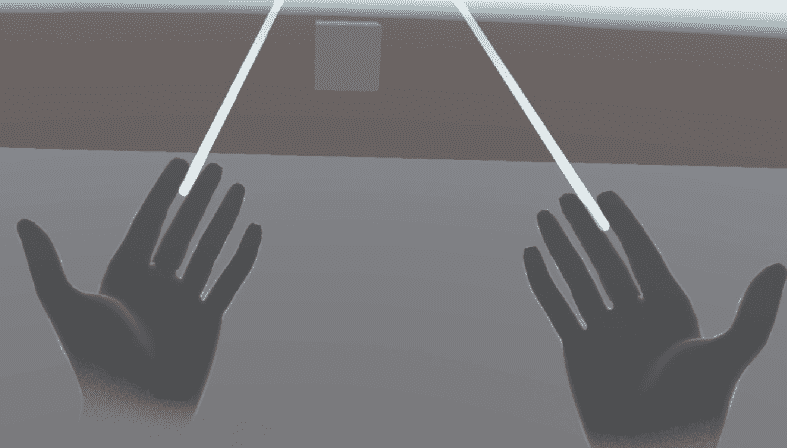

# 8

# 构建高级 XR 技术

迄今为止，您已经探索了 XR 开发的各个方面，制作了适合广泛用例的沉浸式和交互式 XR 应用程序。随着您进一步掌握 XR 开发，不仅要熟练创建从基础到中级的应用程序，还要掌握提升您 XR 产品商业可行性和影响力的高级技术至关重要。

本章旨在通过实践方法使您熟悉关键的高级 XR 方法。您将深入了解手部追踪集成，使用眼动和头动进行复杂交互，并了解如何建立多人服务器以创建引人入胜的多人 XR 体验。

本章的内容可能听起来令人畏惧，但请放心——我们将全程指导您将这些复杂的 XR 策略融入各种场景。利用您在前几章中建立的稳固 XR 基础，您会发现这些高级技术比预期的更直观。

无论您拥有哪种 XR 设备，本章都承诺提供丰富的知识，所有技术都适用于不同的设置。我们将在*技术要求*部分深入探讨这一点。

本章包括以下部分：

+   将手部追踪添加到 XR 体验中

+   通过眼动或头动在 XR 体验中与对象交互

+   构建 VR 多人应用程序

# 技术要求

要导航本章中的手部追踪、眼动和多人方面，需要了解共享和独特的技术先决条件。为了获得无缝的开发体验，我们建议您熟悉所有列出的要求。尽管本章深入探讨了高级主题，并且与早期章节相比可能最初显得有些令人生畏，但您可以确信本章中的所有教程都是为简单执行而设计的——即使您手头没有 VR 头显。 

首先，让我们解决整体的技术要求。为了跟随本章中的教程，您需要 Unity *2021.3 LTS* 或更高版本。通过将您的硬件与 Unity 网站上描述的系统要求进行比较来验证其适用性：[`docs.unity3d.com/Manual/system-requirements.html`](https://docs.unity3d.com/Manual/system-requirements.html)。根据您的 VR 头显规格，确保您的设置支持 *Windows*/*Linux*/*Mac* 或 *Android* *构建支持*。

大多数现代 VR 头显，尤其是具有内向外置摄像头追踪的头显，都集成了手部追踪功能。例如，包括 Meta Quest 系列、HTC Vive Cosmos Elite、PlayStation VR2、Pico Neo 2 Eye、Lynx-R1、Valve Index、HP Reverb G2、Varjo VR-3 以及即将发布的 Apple Vision Pro。请始终参考您 VR 头显的技术规格，以了解它是否支持手部追踪。

如果你无法访问支持手部追踪的头显，你仍然可以遵循本章，因为 XR 设备模拟器可以完美地复制 VR 头显的手部追踪功能。

虚拟现实中的眼动追踪是一个不断发展的领域，有趣的是，无论你的 VR 头显规格如何，你都可以深入了解本章眼和头部注视追踪部分的眼动追踪教程。即使你仅使用 XR 设备模拟器而没有物理 VR 头显，你也会发现我们的教程易于访问。虽然我们现在不会透露所有细节，但值得注意的是，XR 交互工具包为那些 VR 头显缺乏标准眼动追踪功能的情况提供了创新解决方案。截至本书出版时，提供眼动追踪功能的 VR 头显包括 PlayStation VR2、HP Reverb G2 Omnicept Edition、Pico Neo 3 Pro Eye、HTC Vive Pro Eye、Pico Neo 2 Eye 和 Meta Quest Pro。此外，即将推出的 Apple Vision Pro 预计也将具备眼动追踪功能。这个列表可能在你阅读本书时不会涵盖所有可用选项，所以请始终检查你的 VR 头显规格以确认是否支持眼动追踪。

现在硬件都设置好了，让我们开始使用 XR 交互工具包探索手部追踪。

# 为 XR 体验添加手部追踪

在本节中，你将学习如何将手部追踪功能添加到你的 XR 体验中。然而，在创建新的 Unity 项目之前，你必须了解手部追踪的技术概念以及它如何比常规控制器更丰富 XR 体验。

## 理解手部追踪和潜在用例

在虚拟现实中，**手部追踪**的核心是指直接检测、捕捉和解释用户在虚拟环境中裸手和手指的细微动作和定位的技术能力。

与基于控制器的追踪不同，后者依赖于外部设备来调解和将用户输入转换为 VR 动作，如 Xbox 控制器，手部追踪无需中介硬件，直接将现实世界的手势和动作映射到虚拟领域。这种方法利用了复杂的传感器、摄像头和算法来构建用户手的实时动态模型。从抓取物体到用手指手势施法，手部追踪提供了一系列潜在交互。它促进了复杂和细微的交互，这些交互难以用传统控制器复制，允许在 VR 中实现更自然和直观的交互。

要使 VR 头显能够利用手部追踪的潜力，它应该配备高分辨率传感器和摄像头，能够捕捉到详细的动作，包括单个手指的细微动作。这些摄像头通常需要以提供宽阔视野的方式定位，以便持续追踪手部的移动。

手部追踪需要实时解释复杂的手部和手指动作，这需要强大的处理能力。VR 头显应该有一个内置处理器或连接到一台可以无延迟处理这些计算的机器。

除了硬件之外，头显的软件必须设计或可适应以有效地识别和解释手部动作。这包括拥有能够区分有意手势和无意手部动作的算法。

在这些基础要求的基础上，下一节将指导你设置 Unity 项目，以便有效地利用和启用手部追踪，为你的 XR 体验用户提供更丰富、更沉浸式的体验。

## 使用 XR 交互工具包实现手部追踪

为了启动我们将手部追踪功能添加到 XR 项目的流程，我们必须执行以下步骤：

1.  前往 Unity Hub，通过导航到`AdvancedXRTechniques`并点击**创建项目**按钮来创建一个新项目。

1.  在**场景层次结构**窗口中，你会看到你的场景只包含**主相机**和**方向光**。你可以删除**主相机**，因为它不是必需的。

1.  导入`com.unity.xr.interaction.toolkit`，然后按*Enter*键。工具包现在应该会自动添加到你的项目中。在**包管理器**窗口中，导航到新添加的**XR 交互工具包**包的**示例**选项卡，并通过点击每个旁边的**导入**按钮来导入**入门资产**、**XR 设备模拟器**和**手部交互演示**。

1.  为了在我们的场景中启用手部追踪，我们不仅需要`com.unity.xr.hands`，还需要按*Enter*键。一旦该包被添加到你的项目中，导航到**包管理器**窗口中**XR 手部**包的**示例**选项卡，并点击**HandVisualizer**示例旁边的**导入**按钮。

1.  现在，我们通常会拖放`XR Interaction Hands Setup`到`0`,`0`,`0`的搜索栏中。

1.  是时候正确设置**XR 插件管理**以启用手部追踪了。导航到**编辑** | **项目设置** | **XR 插件管理**，并根据你的 VR 头显需求，在**Windows/Mac/Linux**选项卡或**Android**上选择**OpenXR**复选框。

1.  一旦安装了**OpenXR**插件，导航到左侧**XR Plug-in Management**标签下的子标签页。在这里，转到**Windows/Mac/Linux**或**Android**标签。点击**+**按钮将**Interaction Profile**项目添加到你的项目中。除了在新建菜单中选择你的 VR 头盔的控制器外，你还应该添加另一个名为**Hands Interaction Profile**的**Interaction Profile**。在**OpenXR**的核心中，**Hand Interaction Profile**提供了一种标准化的方式来解释不同 VR 头盔之间的手势和动作。不同的 VR 头盔可能有自己追踪手部的技术和方法。如果没有标准化的系统，开发者需要为每个头盔的手部追踪系统编写独特的代码，这可能会非常耗时且不切实际。

1.  保持处于**OpenXR**子标签页，勾选**Hand Interaction Poses**和**Hand Tracking Subsystem**复选框，无论你使用哪种 VR 头盔。

    当你勾选**Hand Interaction Poses**时，你是在告诉 Unity 使用由**OpenXR**标准定义的标准姿势或手势集。这些包括抓取（握持）、指向（瞄准）、捏合和戳击。因此，你不需要手动编写这些手势的检测代码，Unity 会根据这个标准为你完成。通过勾选**Hand Tracking Subsystem**复选框，Unity 使用**OpenXR**标准来跟踪手的位置和移动方式。这个子系统就像引擎盖下的引擎，时刻关注手部的移动。

    如果你有一个 Meta Quest 设备，你还必须勾选**Meta Hand Tracking Aim**复选框。这个功能通过理解手的方向或瞄准，增强了现有的手部追踪，给你的 VR 应用提供了更好的用户指向感或用户可能试图交互的对象感。虽然我们的**Hand Interaction Profile**提供了对手部动作的基础理解，但这些复选框深入到具体的手势、实际追踪和特定设备的功能。

1.  现在，让我们在场景中添加一个简单的平面作为地面，并添加一个立方体来进行交互测试手部追踪。你可以通过在层次结构中右键单击，选择`Ground Floor`并将其定位在原点(`0``0``0`)来实现。

重复上一步，但不要选择`Hand Tracking Cube`。将其定位在(`0`, `1.25`, `1`)，并缩放到(`0.1`, `0.1`, `0.1`)。在`Hand Tracking Cube`中，在搜索栏中点击`XR Grab Interactable`。通过双击选择**XR Grab Interactable**脚本。你应该能看到一个**Rigidbody**组件已经自动添加到**InteractableCube**中，与**XR Grab Interactable**脚本并列。在**Rigidbody**组件内部，确保选中了**Use Gravity**和**Is Kinematic**复选框，这样我们的与立方体的交互就可以在遵守重力定律的情况下进行。

重要提示

如果你没有访问具有手势追踪功能的 VR 头盔，你可以简单地通过使用 XR 设备模拟器来测试此功能，如*第三章*中的*安装 XR 设备模拟器*和*使用 XR 设备模拟器*部分所述。要切换到手势追踪模式，只需按下*H*键。

是时候使用你的 VR 头盔测试场景了。像平时一样启动场景。你甚至不需要手头有 VR 头盔的控制器。一旦场景开始运行，调整你的头部，使 VR 头盔上的外部摄像头指向你的手。

你应该注意到控制器视觉已经被手部视觉所取代，精确地反映了你真实手的准确位置和动作，如图*图 8.1*所示。



图 8.1 – 当你放下控制器并将目光转向你的手时，你将看到的视觉

尝试分别移动每个手指，转动你的手，甚至将一只手藏在背后。如果一切设置正确，并且你的 VR 头盔完全支持手势追踪，虚拟手应该能够准确模仿你的真实手部动作。如果你将一只手藏在背后，对应的虚拟手也应该消失。

最后，让我们使用仅手势追踪的方式测试场景中的立方体交互。将右手激光笔对准立方体。将右手拇指和食指指尖相触，形成一个近似的三角形形状，如图*图 8.2*所示。


图 8.2 – 在现实生活中，当你将右手拇指和右手食指指尖相触时的叠加手部视觉

现在，你正在抓取立方体。在保持这个位置的同时，指向各个方向，观察立方体相应地移动。

恭喜！你现在已经在你的 VR 场景中实现了与使用标准 VR 控制器相似的手势交互体验。

要探索 XR 交互工具包的手势追踪功能如何与其他类型的对象（如 UI 元素或按钮）协同工作，请深入了解**手部交互演示**，它位于我们最初导入的工具包的**样本**区域中。要访问它，请按照以下步骤操作：

1.  前往**项目**窗口中的**资产**。从那里，导航到**样本** | **XR 交互工具包** | **版本号** | **手部交互演示** | **运行时**。

1.  然后，双击**HandsDemoScene** Unity 场景。如果你喜欢，可以使用**项目**窗口中的搜索栏快速定位**HandsDemoScene**。

1.  一旦你在 Unity 编辑器中打开场景，点击**播放**按钮。这将让你亲身体验如何与 UI 元素互动、按按钮，甚至仅用双手操纵 3D 对象。

到现在为止，你应该感觉自己已经是一名手部追踪专家了。下一节将向你介绍 XR 开发中的另一个高级概念：眼动追踪。

# 通过眼动或头动在 XR 体验中与物体交互

在本节中，你不仅将了解眼动追踪本身及其如何丰富你的 XR 体验，你还将实现眼动追踪功能到你的 XR 体验中，无论你的 VR 头盔是否支持眼动追踪。

## 理解眼动追踪及其潜在应用场景

从读取人的意图到增强数字交互，眼动技术正在改变各种技术感知和解释人类行为的方式。

由于眼睛能够表达和传达情绪、意图和注意力，它们通常被称为“灵魂之窗”。从生物学的角度来看，眼睛的几个关键方面对此有所贡献：

+   **瞳孔扩张**：通常是一种无意识的反应，瞳孔可以根据情绪状态、注意力水平或对刺激的反应而扩张或收缩。例如，当看到吸引他们的人时，某人的瞳孔可能会扩张，而在暴露在明亮光线中时可能会收缩。

+   **眼跳**：这些是在眼球从一个点转向另一个点时发生的快速、突然的运动。我们往往没有注意到眼跳，但它在我们从周围环境中收集视觉信息方面起着关键作用。

+   **眨眼和微表情**：眨眼的频率可以表明各种状态，从放松到压力。此外，眼睛周围的微妙动作可以透露瞬间的情绪——这些被称为微表情。

眼动技术围绕监测和记录眼球运动和注视点展开。以下是它通常的工作原理：

+   **光源**：红外光指向眼睛。这种光从角膜和视网膜反射。

+   **传感器和摄像头**：这些检测眼睛反射的光。先进的系统可能会使用来自不同角度的多个摄像头来捕捉眼睛运动的立体视图。

+   **数据处理**：传感器捕获的原始数据通过算法处理，以推断注视方向和焦点点。

+   **表示**：注视数据通常以热图或注视图的形式表示在观察介质上，无论是计算机屏幕还是物理环境。

眼动技术通过使虚拟交互更接近人类行为，弥合了数字世界和现实世界之间的差距。当 XR 中的社交虚拟形象通过眨眼、注视和展示情绪来模仿真实的眼球运动时，它加深了用户的临场感和沉浸感。

同样，眼动追踪可以极大地提高 XR 空间中对用户意图的理解。这意味着 XR 环境可以实时适应用户的焦点。例如，一个恐怖游戏只有在用户看向正确的方向时才会触发惊吓，从而最大化情感冲击。通过分析用户注视的位置、频率和持续时间，开发者可以获取有价值的见解。这可以指导设计选择，确保重要元素吸引注意力，并优化用户界面。

眼动追踪为更直观的用户界面铺平了道路。例如，用户无需使用笨拙的手控制器在菜单中导航，只需凝视菜单选项即可选择它。

幸运的是，无论您的 VR 头盔是否支持眼动追踪，您都可以通过眼动追踪来丰富您的 XR 场景。如果这激发了您的兴趣，请跟随下一节的教程。

## 设置 XR 场景以支持眼动和头动追踪

XR 交互工具包支持眼动和头动追踪，增强 XR 应用的用户参与度。虽然眼动追踪专门捕捉用户的目光焦点，但头动追踪确定用户头部指向或注视的方向。让我们通过回顾我们在上一会话中创建的基本 VR 场景来亲自尝试这些追踪技术。

XR 交互工具包的眼动和头动追踪功能的关键组件已经包含在我们的场景中。要观察它们，请在项目的**场景层次结构**窗口中点击**XR Interaction Hands Setup**预制件旁边的箭头按钮，以查看其子项。导航到**XR Origin (XR Rig)** | **Camera Offset**并启用**XR Gaze Interactor**和**Gaze Stabilized**预制件。这些预制件不仅是**XR Interaction Hands Setup**预制件的一部分，也是**XR Interaction Setup**预制件的一部分，如果您不包含手部追踪，您将在场景中使用它。

这些预制件与所有类型的 VR 头盔一起工作，无论它们是否支持眼动追踪。如果您的头戴式设备不支持眼动追踪，它将使用 VR 头戴式设备的内置头动追踪功能来估计头部注视。

虽然将眼动和头动追踪纳入我们的场景是一个重要的进步，但这只是 XR 中构建直观的基于注视交互方程的一部分。如果事情这么简单，那么就没有必要写这一章了，尤其是考虑到我们在本书中的每个 VR 场景都使用了这个预制件。要真正利用眼动追踪的能力，我们还必须在场景中添加可以与**XR Gaze Interactor**预制件交互的对象。让我们创建这些对象：

1.  为了保持我们的场景井然有序，在“眼动追踪和手部追踪交互”中的`Hand Tracking Cube`上右键单击。这个 GameObject 将存储两个额外的立方体，使我们能够创建与已创建的立方体不同的眼动追踪交互。

1.  让我们把所有的立方体都放在一个非常简单的桌子上。通过点击`Table`创建桌子，将其定位在(`0`, `0.5`, `0`)，并将其缩放到(`3`, `1`, `1`)。

1.  将`Hand Tracking Cube`缩放到(`0.5`, `0.5`, `0.5`)，并通过将值更改为(`-1`, `0`, `0`)将其放置在`Table`上。同时，确保你取消选中`Hand Tracking Cube`并选择`Hand Tracking Cube`。将两个立方体重命名为`Eye Tracking Cube 1`和`Eye Tracking Cube 2`。将`Eye Tracking Cube 1`的位置更改为(`0`, `0`, `0`)，将`Eye Tracking Cube 2`的位置更改为(`1`, `0`, `0`)。

1.  接下来，让我们添加一个功能，当用户的注视点指向`Eye Tracking Cube 1`时，在其上方会出现一个球体。我们可以通过在`0`、`1`、`0`)中选择`Eye Tracking Cube 1`并将它缩放到(`0.5`, `0.5`, `0.5`)来向场景中添加一个球体。

1.  与`Eye Tracking Cube 1`类似，当我们的 VR 场景的用户看向`Eye Tracking Cube 2`时，应该出现一些文本。为了使交互更加复杂，文本应根据用户是否看向立方体以及是否通过控制器按钮按下选择或取消选择立方体而改变。为了创建所需的 UI 元素，在`Eye Tracking Cube 2`的`0`、`-1`、`-1.01`)上右键单击并选择其`1`。现在，在`Interactable Text`中的`No state detected!`上右键单击，将其所有方向上的缩放设置为`0.005`，并将其定位在(`0.1`, `0.1`, `0`)。

1.  让我们在场景中添加一些彩色材料，使其更具视觉吸引力。具体来说，我们想要为我们的立方体添加两种材料——一种用于它们的默认外观，另一种用于它们被悬停时。因此，我们将为`Table`创建一个材料，并为`Materials`创建一个材料，然后双击它以打开它。通过右键单击，选择`HighlightedCube`在`Materials`文件夹内创建一个新的材料。在`HighlightedCube`中，点击旁边带有`240`、G: `240`、B: `140`的彩色单元格，并设置`70`。

1.  在`Materials`文件夹内右键单击并选择`CubeMaterial`、`TableMaterial`和`SphereMaterial`材料。对于`CubeMaterial`，我们选择了一种复杂的红色（R: `186`、G: `6`、B: `6`）；`TableMaterial`已被分配了一种深棕色（R: `58`、G: `40`、B: `3`）；而对于`SphereMaterial`，我们选择了一种蓝色（R: `29`、G: `120`、B: `241`）并通过设置`1`使其看起来像金属。所有这些材料都有`255`。通过简单地从`TableMaterial`和`SphereMaterial`拖放材料，将`CubeMaterial`应用到场景中的所有三个立方体上。

*图 8**.3*显示了你的 VR 场景当前应该看起来是什么样子。


图 8.3 – 眼睛追踪的 VR 场景当前状态

在下一节中，你将学习如何通过眼神或头部注视与这些立方体进行交互。

## 使用 XR 交互工具包通过眼神和头部注视与对象交互

当用户注视我们为注视跟踪创建的两个立方体之一时，他们应该能够像上一节所述那样与之交互。为了实现这一点，我们需要调整场景中的某些组件。

**XR Gaze Interactor** 预制件只会与场景中具有 **XR Simple Interactable** 或 **XR Grab Interactable** 脚本的对象交互，并且相应的脚本启用了 **Allow Gaze Interaction** 复选框。这意味着我们必须将这两个脚本之一添加到我们的两个新立方体上。

在我们的情况下，我们将为每个眼动立方体添加 **XR Simple Interactable** 脚本。为了实现这一点，我们需要执行以下三个步骤：

1.  按 *Ctrl*/*Cmd* 并在 **Scene Hierarchy** 窗口中选择两个立方体。

1.  将 `XR Simple Interactable` 点击到搜索栏中，然后双击脚本将其添加到两个立方体上。

1.  点击 `XR Simple Interactable` 脚本组件旁边的 **Gaze Configuration** 属性旁边的箭头以打开与注视相关的属性。选择 **Allow Gaze Interaction** 复选框。

现在，我们需要指定如何通过注视与我们的两个立方体交互。让我们从第一个立方体开始。记住，我们的目标是只有当我们的眼睛、头部或控制器指向它时，蓝色球体才出现在第一个立方体的顶部。我们可以通过以下步骤将此逻辑添加到立方体中：

1.  在 `Eye Tracking Cube 1` 中，导航到 **XR Simple Interactable** 脚本组件的末尾。点击 **Interactable Events** 旁边的箭头以打开它。通过点击 **+** 按钮两次，向 **First/Last Hover** 的 **First Hover Entered** 函数添加两个新事件。

1.  让我们填写我们新创建的交互事件的缺失信息。根据 **Scene Hierarchy** 窗口中的 `Eye Tracking Cube 1` 将其指示到第一个 **None (Object)** 单元格。通过将第二个事件分配给 **Sphere** 重复此操作。

1.  要在通过控制器、眼睛或头部悬停在 `Eye Tracking Cube 1` 上时更改其材质，我们必须为每个交互事件分配必要的函数并提供所需的参数。通过搜索栏选择 `HighlightedCube` 材质并选择它。对于使用控制器、眼睛或头部悬停在 `Eye Tracking Cube 1` 上的情况，你将看到蓝色球体出现在其顶部。

1.  一旦你的控制器、眼睛或头部不再指向 `Eye Tracking Cube 1`，立方体的材质应恢复到默认颜色，球体应消失。为了实现这一点，转到 `Eye Tracking Cube 1` 和 `CubeMaterial`，并选择它。通过将 **GameObject** | **SetActive (bool)** 函数分配给 **Sphere** 重复此过程，并确保这次新出现的复选框未勾选。

1.  为了评估我们迄今为止放置的逻辑，有必要在我们的场景中禁用或隐藏蓝色的**球体**对象。这确保了当用户首次进入场景时，看不到它。你可以通过在**场景层次结构**窗口中选择**球体**，然后在**检查器**窗口顶部取消选中其名称旁边的复选框来实现这一点。

哇哦——我们已经完成了所有必要的步骤，为我们的第一个立方体添加了强大的眼动追踪功能。*图 8.4*显示了当你将眼睛或头部指向立方体时，立方体应该看起来是什么样子。


图 8.4 – 由于你的眼睛或头部在立方体上方悬停，因此出现了高亮的立方体和蓝色球体

如果你正在使用头部注视功能，当你戴着 VR 头盔或使用 XR 设备模拟器时，只有当立方体位于你当前视野的中心时，你才会看到蓝色的球体。当你控制器指向立方体时，你也可以观察到相同的效果。

我们将为第二个立方体添加更强大的交互功能。与第一个立方体一样，当眼睛、头部或控制器指向第二个立方体时，会在其下方出现一个文本元素。然而，这次显示的文本本身将根据是否使用眼睛、头部和控制器交互悬停、选择或取消选择立方体而改变。按照以下步骤完成此目标：

1.  使用以下修改重复为`Eye Tracking Cube 1`执行的步骤：将`Eye Tracking Cube 2`和**画布**拖放到**First Hover Entered**函数和**Last Hover Exited**函数的两个事件中。

1.  到目前为止，当立方体被悬停时，立方体的颜色会改变，文本元素也会变得可见。然而，文本本身也应该从`Hovered`变为新出现的空白文本单元格中的`Interactable Text`。

1.  当你悬停在立方体上方并通过按下控制器按钮（通常用于移动物体）选择立方体时，立方体下方的文本应该改变。要实现这个逻辑，请滚动到`Selected`中的`Interactable Text`元素，并将其拖放到空白的文本字段中。

1.  当立方体不再通过控制器选择时，文本应该再次改变。这可以通过向`Interactable Text`添加一个新事件到`Deselected`并拖放到新创建的文本单元格中来实现。

1.  在测试第二个立方体的逻辑之前，通过在**检查器**窗口中取消选中它，就像对第一个立方体所做的那样，在场景中隐藏它。

是时候尝试与这个立方体进行交互了。*图 8.5*显示了立方体的三种交互状态——悬停、悬停并选择，以及悬停但取消选择。


图 8.5 – 立方体的三种可交互状态

欢呼——你已经成功地为场景添加了不同的眼动交互！在下一节中，你将学习如何在 Unity 中设置多人 XR 游戏。

# 构建 VR 多人游戏应用

在本节中，你将构建你的第一个 VR 多人游戏应用。尽管这涉及到相当数量的 C#编程，但你已经获得了足够的知识来顺利地导航这个教程。但在我们深入之前，让我们暂停一下，深入探讨构建多人游戏应用的细微差别、必要组件以及 XR 环境中多人体验的吸引力。

## 理解多人应用和多人网络系统

在本质上，**多人**体验允许多个用户同时在一个共享的数字环境中交互。这个环境可以从简单的基于文本的界面到复杂的虚拟现实。多人体验的关键组件通常包括托管游戏环境的服务器、处理数据同步和通信的网络系统、玩家化身以及管理交互规则的游戏逻辑。

将多人模式添加到游戏中可以使游戏更具不可预测性，因为人类的行为和决策。相比之下，**单人**模式通常更加可控，并且可以围绕预定义的叙事来设计。

通过将多人功能添加到 XR 中，用户被鼓励共同参与任务、挑战或体验，使环境感觉更加生动和动态。例如，包括合作解谜、虚拟团队建设练习和联合探索。

重要提示

如果你认真考虑成为一名 XR 开发者，你应该感到舒适地创建多人 XR 体验。在 VR Chat 等论坛上的虚拟聚会是目前最受欢迎的 XR 应用之一。这些聚会凸显了人们希望在虚拟世界中与其他真实人类聚会的愿望，而不是仅仅被虚拟资产所包围。

任何多人游戏中最关键的部分是**多人网络系统**。本质上，多人网络系统是数字骨架，使得各种玩家能够在共享环境中无缝交互。该系统确保一个玩家执行的动作能够被其他所有玩家准确且一致地反映出来，从而创造出一个和谐的虚拟体验。

每个多人网络系统的关键组件是**服务器**。这些是强大的计算机，它们托管游戏的数字环境。它们是玩家连接的中心点，并维护游戏的主权状态。在某些配置中，一个玩家可能充当服务器，称为**对等网络**，但在大型游戏中，由于稳定性和可扩展性，专用服务器更为常见。

玩家使用的单个设备或计算机被称为**客户端系统**。它们将玩家动作或行为等数据发送到服务器，并接收有关游戏世界和其他玩家的更新。

在实时游戏中，即使是微小的延迟也可能影响游戏体验。多人网络系统使用诸如**延迟补偿**等技术，以确保玩家拥有流畅的体验。这涉及到预测动作或行为，然后在实际数据到达后进行协调。

为了避免多人游戏成为作弊或黑客的目标，网络系统采用诸如数据加密、权威服务器和作弊检测工具等措施。

除了游戏本身之外，玩家经常希望进行沟通，无论是通过文本、语音还是其他媒介。网络系统为这些交互提供了基础设施，确保实时且清晰的沟通。

下面是三个对 Unity 开发者来说有趣的主要多人网络提供商的概述：

+   **Photon Unity Networking** (**PUN**): PUN 是为 Unity 多人游戏量身定制的解决方案。其基于云的方法意味着开发者无需担心服务器的创建或维护。PUN 提供免费层。尽管它附带某些限制，但免费版本被许多刚开始多人游戏开发旅程的独立游戏开发者和小型项目爱好者广泛使用。

+   **镜面反射**: 镜面反射提供了一款由社区驱动的开源网络工具，专为 Unity 量身定制。它是已废弃的 Unity 网络系统的进化版本。作为开源软件，它不收取许可费用，这使得它成为一个经济实惠的选择。镜面反射因其灵活性而闻名，为开发者提供了对其多人游戏逻辑的更高控制度。然而，其可定制性意味着对于初学者来说，学习曲线稍微有些挑战。

+   **网络代码**: 网络代码是 Unity 的专有游戏网络解决方案，之前被称为*MLAPI*。这一演变和品牌重塑标志着 Unity 对持续改进的承诺，以及其致力于为开发者提供顶级多人游戏开发工具的奉献。作为 Unity 的内在解决方案，网络代码承诺与 Unity 生态系统无缝集成。

在接下来的章节中，我们将创建自己的多人游戏。为此，我们将利用 Photon PUN 2 的免费层。其零成本障碍，加上对初学者直观的设置过程，使其成为快速原型设计和较小规模项目的理想选择。

下一节将教授您如何为即将创建的 VR 多人游戏设置 PUN。

## 为我们的 VR 多人游戏设置 PUN

我们这个 VR 多人游戏的目的是既简单又稳健，涵盖了多人体验所需的所有基本元素。我们的目标是设计一个 VR 场景，其中多个用户可以同时加入。用户应该通过由头部和两个控制器组件组成的化身看到自己和他人。他们应该实时观察在这个共享空间中他人的动作，观察他们如何操纵或旋转控制器。此外，通过手部动画，他们应该能够辨别出他人何时按下他们的手。

在我们将 Photon PUN 2 导入项目之前，让我们为这一章节的这一部分创建一个新的场景。按照以下步骤开始：

1.  打开我们在本章前几节中创建的 `AdvancedXRTechniques` 项目。通过导航到 **文件** | **另存为** 并输入您选择的场景名称，例如 `HandAndEyeTrackingScene` 来保存当前场景。

1.  前往 `MultiplayerScene`。

1.  在您新场景的 Unity 编辑器中，通过搜索栏删除 `XR Interaction Setup`（位置为 `0`,`0`,`0`）。

现在我们已经设置了场景，按照以下步骤安装和设置我们的网络系统，PUN：

1.  我们可以通过 Unity Asset Store 安装 PUN，就像安装其他包一样。访问 [`assetstore.unity.com/packages/tools/network/pun-2-free-119922`](https://assetstore.unity.com/packages/tools/network/pun-2-free-119922) 或在 Unity Asset Store 中搜索 `PUN 2 – FREE`（**窗口** | **资产商店**）。点击**添加到我的资产**按钮将包添加到您的资产中。一旦包被添加，Asset Store 网站上会出现一个名为**在 Unity 中打开**的新按钮。点击它以在项目的**包管理器**窗口中打开包。按下**下载**和**导入**按钮将资产导入到您的项目中。

1.  在 *图 8.6* 中显示的**PUN 向导**窗口将在 Unity 编辑器中弹出。


图 8.6 – PUN 向导弹出窗口

如果您已经有了 Photon 账户，您可以直接在这里输入您的**AppId**。否则，完成输入您的电子邮件并点击**设置项目**按钮。这将创建一个账户并将您转发到一个网页，您可以在那里设置您的密码。

重要提示

如果您意外关闭了这个弹出窗口，只需前往 [`www.photonengine.com/`](https://www.photonengine.com/) 并在那里注册。

1.  一旦您登录到您的账户，前往 [`dashboard.photonengine.com/`](https://dashboard.photonengine.com/) 并点击**创建新应用**按钮。您将被转发到 *图 8.7* 中显示的页面。


图 8.7 – 在 Photon 网站上创建新应用后将被转发的网页

1.  选择`我的第一个多人游戏`。点击**创建**按钮 – 注意您在仪表板中新建的应用程序。如图*图 8**.8*所示，您可以在仪表板的布局元素之一中找到您的 Photon **App ID**。将其复制以稍后连接到服务器。


图 8.8 – 包含您的 App ID 的仪表板元素

1.  返回到您的 Unity 项目。如果您仍然看到**PUN 向导**窗口，您可以直接将其中的**App Id**粘贴进去，然后点击**设置项目**按钮。或者，您可以直接在**Photon 服务器设置**中输入您的**App Id**，方法是导航到**窗口** | **Photon Unity Networking** | **高亮服务器设置**，如图*图 8**.9*所示。


图 8.9 – 如何在 Unity 中将 App Id 添加到 Photon 服务器设置中

现在，是时候将我们的 Unity 项目连接到服务器了。下一节将向您展示如何做到这一点。

## 通过网络管理器连接到服务器

要将我们的 Unity 项目连接到 PUN 服务器，我们必须在我们的场景中添加一个新的 GameObject，并关联一个 C#脚本。让我们一步一步地完成这个过程：

1.  通过在`网络管理器`中右键单击来创建一个新的空 GameObject。

1.  现在，我们想要添加一个脚本到这个 GameObject，我们可以使用它来连接到 PUN 服务器并检查是否有人加入了服务器。要创建这个脚本，导航到`网络管理器`并点击**添加** **组件**按钮。

1.  搜索`NetworkManager`，选择**新建脚本**选项，然后按**创建并添加**按钮来创建一个名为**NetworkManager.cs**的 C#脚本，该脚本将自动添加到**NetworkManager**作为组件。双击脚本以在您首选的 IDE 中打开它。

1.  **NetworkManager**脚本作为在 VR 多人应用程序中使用 PUN 框架启动和管理网络交互的基础元素。删除**NetworkManager**脚本中当前的所有内容，以便您可以从一个干净的基础开始。

让我们通过导入以下库来开始添加我们的代码逻辑：

```cs
using UnityEngine;
using Photon.Pun;
using Photon.Realtime;
```

`Photon.Pun`和`Photon.Realtime`库对于任何 PUN 应用程序都是至关重要的，因为它们提供了访问核心多人网络功能的能力。

接下来，让我们定义`NetworkManager`类和一些重要的常量：

```cs
public class NetworkManager : MonoBehaviourPunCallbacks
{
    private const string ROOM_NAME = "Multiplayer Room";
    private const byte MAX_PLAYERS = 5;
}
```

`NetworkManager`类继承自`MonoBehaviourPunCallbacks`。这种继承意味着它不仅仅是一个标准的 Unity 脚本（`MonoBehaviour`），而且它还拥有 PUN 提供的特殊回调函数，这些函数会通知我们的脚本各种网络事件。

虽然`ROOM_NAME`代表玩家将加入或创建的房间名称，但`MAX_PLAYERS`定义了房间中允许的最大玩家数，在这个例子中是`5`名玩家。我们稍后需要在脚本中使用这两个常量。

让我们继续，将我们的应用程序连接到 Photon 服务器：

```cs
private void Awake()
{
    InitiateServerConnection();
}
private void InitiateServerConnection()
{
     if (!PhotonNetwork.IsConnected)
    {
        PhotonNetwork.ConnectUsingSettings();
        Debug.Log("Attempting server connection...");
    }
}
```

一旦调用`Awake()`方法，它将通过调用`InitiateServerConnection()`方法来启动与 PUN 服务器的连接。如果客户端尚未连接到 Photon，`InitiateServerConnection()`方法将尝试使用我们之前插入的**App Id**值连接到服务器空间。请参阅*图 8**.9，以防您错过了这一步。此方法的第二行通过调试消息记录了我们的尝试。

如果连接尝试成功，以下方法将被执行：

```cs
public override void OnConnectedToMaster()
{
    base.OnConnectedToMaster();
    Debug.Log("Connected to Master Server.");
    JoinOrCreateGameRoom();
}
```

此方法是对 Photon 的`OnConnectedToMaster`回调的重写。一旦应用程序成功连接到 Photon 主服务器，它就会被触发。此方法是 PUN 框架的一个组成部分，允许我们在成功连接后执行特定的逻辑。在此方法内部，我们记录了成功连接到主服务器。我们还调用了`JoinOrCreateGameRoom()`方法，它使用了我们在脚本开头定义的常量：

```cs
private void JoinOrCreateGameRoom()
    {
        RoomOptions options = new RoomOptions
        {
            MaxPlayers = MAX_PLAYERS,
            IsVisible = true,
            IsOpen = true
        };
        PhotonNetwork.JoinOrCreateRoom(ROOM_NAME, options, TypedLobby.Default);
}
```

在此方法的最后一行，客户端尝试加入或创建一个名为**多人房间**的房间，房间内最多允许五名玩家。如果房间不存在，它将使用提供的选项创建一个。

我们代码中的下一个方法是重写：

```cs
public override void OnJoinedRoom()
{
    base.OnJoinedRoom();
    Debug.Log("Successfully joined a room.");
}
```

此方法是对 Photon 的`OnJoinedRoom`回调的重写。当客户端成功加入房间时，它会被触发。在最后一行，打印了一条调试消息以确认成功进入房间。

为了管理新玩家，我们可以使用以下方法：

```cs
public override void OnPlayerEnteredRoom(Player newParticipant)
{
    base.OnPlayerEnteredRoom(newParticipant);
    Debug.Log("Another player has joined the room.");
}
```

此`OnPlayerEnteredRoom()`方法也是对 Photon 的`OnPlayerEnteredRoom`回调的重写。每当有新玩家进入房间时，它就会被调用。同样，在最后一行打印了一条调试消息，通知另一个玩家已加入。

欢呼，您已经将所有必要的组件实现到了`NetworkManager`脚本中！正如您所看到的，它提供了一个连接到 Photon 服务器、管理多人房间以及在 VR 环境中处理玩家交互的基础结构。让我们看看我们的代码逻辑是否工作。在下一节中，您将了解到如何在单个设备上测试多人应用程序。

## 从一个设备测试多人场景

要从单个设备测试多人场景，我们需要运行场景两次。这可以通过首先在计算机上构建和运行场景，然后从编辑器内部启动它来实现。以下是逐步分解：

1.  在 Unity 编辑器中，转到**文件** | **构建设置**并选择**Windows/ Mac/ Linux**选项卡。添加您想要测试的打开场景，点击**构建**按钮，并为即将构建的可执行文件选择一个文件夹。

1.  文件构建完成后，点击 Unity 编辑器中的**播放**按钮以启动场景。

1.  现在，打开您刚刚构建的可执行文件。

1.  前往 Unity 编辑器的 **控制台** 窗口并检查 **调试** 语句。如果你一切都做得正确，你将看到我们在脚本中之前定义的调试线条，如图 *8.10* 所示。


图 8.10 – 如果一切按预期工作，你应该看到的调试线条

为了确保我们的场景功能最优，我们必须彻底测试其 VR 功能。根据我们的评估，场景导航流畅，头戴式设备和控制器都被准确追踪和定位。目前，我们的场景在初始玩家激活时立即建立服务器连接，并且我们已经设置了检测新玩家进入的方法。

然而，我们的 **XR 交互设置** 并非完全适合多人操作。它在管理移动和交互方面表现出色，但并没有为不同身体部位提供动画模型。简单来说，如果有人此时进入我们的多人场景，他们可能只能看到控制器。更糟糕的是，他们可能检测不到我们化身的一部分，因为控制器模型没有网络意识。这意味着当前场景中的对象没有在会话中的所有玩家之间同步。但别担心，我们将在下一节中解决这个问题。

## 使用脚本显示我们的化身的手和脸

我们下一个目标是当化身连接到服务器时显示其手和脸。为了实现这一点，让我们在点击 `NetworkPlayerPlacer` 后选择 `Network Manager` 并在 `NetworkPlayerPlacer` 中添加一个新的脚本。通过双击打开脚本。

### 管理玩家存在

我们即将深入探讨的 `NetworkPlayerPlacer` 脚本专门用于监控玩家存在，这是多人虚拟现实应用的核心元素。具体来说，这意味着创建和删除玩家化身或其在游戏中的表示。`NetworkPlayerPlacer` 脚本专门为此角色定制。它从以下声明开始：

```cs
using UnityEngine;
using Photon.Pun;
public class NetworkPlayerPlacer : MonoBehaviourPunCallbacks
{
    private GameObject playerInstance;
    private const string PLAYER_PREFAB_NAME = "Network Player";
}
```

导入语句和类声明与 `NetworkManager` 脚本中的非常相似。这两个类都继承自 `MonoBehaviourPunCallbacks`。`playerInstance` 作为场景中实例化玩家对象的引用。同时，`PLAYER_PREFAB_NAME` 是一个常量字符串，它保存了为实例化设置的玩家预制件的名称。预计这个预制件已在 Photon 资源目录中注册并可访问。

让我们创建 `NetworkPlayerPlacer` 脚本的第一个方法：

```cs
public override void OnJoinedRoom()
{
    base.OnJoinedRoom();
    SpawnPlayer();
}
```

`OnJoinedRoom()` 方法覆盖了 Photon 的 `OnJoinedRoom` 回调，当本地玩家成功加入房间时会被触发。

使用 `base.OnJoinedRoom()` 调用 `OnJoinedRoom` 的基类实现。在最后一行，调用了 `SpawnPlayer()` 方法，其外观如下：

```cs
private void SpawnPlayer()
{
     playerInstance = PhotonNetwork.Instantiate(PLAYER_PREFAB_NAME, transform.position, transform.rotation);
}
```

此方法使用 Photon 的网络实例化方法创建一个新的玩家对象。新玩家将在`NetworkPlayerPlacer`对象的位置和旋转处生成。这确保了玩家对象在网络上是网络化的，并且在房间中的所有客户端上都是同步的。

我们脚本中的下一个方法覆盖了 Photon 的`OnLeftRoom`回调，当本地玩家离开房间时调用：

```cs
public override void OnLeftRoom()
{
    base.OnLeftRoom();
    DespawnPlayer();
}
```

`OnLeftRoom()`方法包含两个调用：一个是对`OnLeftRoom`基类实现的调用，另一个是对`DespawnPlayer()`的调用，这是一个销毁玩家的方法。让我们看看`DespawnPlayer()`方法：

```cs
private void DespawnPlayer()
{
    if (playerInstance)
    {
        PhotonNetwork.Destroy(playerInstance);
    }
}
```

此方法处理玩家对象的销毁。

`if`语句检查`playerInstance`引用是否不为空。如果是这样，则存在玩家对象。`PhotonNetwork.Destroy(playerInstance);`这一行销毁了网络玩家对象。这将确保对象不仅在本地上被移除，而且在所有客户端上都被移除。

从本质上讲，`NetworkPlayerSpawner`脚本，通过其两个关键回调函数`OnJoinedRoom()`和`OnLeftRoom()`，无缝地处理了玩家在 VR 多人空间中的出现和消失，补充了`NetworkManager`脚本提供的功能。

### 创建面部和双手

之前，我们提到脚本预期一个名为`Resources`的预制件。Unity 在通过名称引用对象时使用此默认命名约定。要创建所需的文件夹，请点击`Resources`。

接下来，我们需要创建代表我们角色的**网络玩家**预制件。按照以下步骤完成此操作：

1.  在`网络玩家`上右键点击。

1.  通过按下**添加组件**按钮并在**检查器**窗口中搜索它，将**光子视图**组件添加到其中。光子需要此组件在服务器上实例化玩家。如果没有它，系统将无法识别所有权或准确同步玩家的身体部位。

1.  通过在`Head`、`左手`和`右手`中选择`Network Player`，将其他三个空 GameObject 作为子对象添加到`Network Player`中。

1.  现在，我们需要创建 3D 对象来表示我们角色的三个组成部分。对于`Head`，我们可以在`Head`中使用一个简单的`Head`并将其缩放到（`0.1`，`0.1`，`0.1`）

1.  我们也可以为我们的角色双手使用原始形状。然而，由于互联网上有许多可用的动画手模型，我们可以简单地使用其中之一。对于这个项目，我们使用了 Unity 资产商店上的**Oculus 双手**示例，该示例来自**Oculus 集成**包（[`assetstore.unity.com/packages/tools/integration/oculus-integration-82022`](https://assetstore.unity.com/packages/tools/integration/oculus-integration-82022)）。然而，我们建议直接从这本书的 GitHub 仓库克隆双手。这避免了由于**Oculus** **集成**包频繁更新而导致的额外内容和不必要的资产丢失。

1.  现在，在`Scene Hierarchy`窗口中，不再需要选择`Resources`文件夹中的`Network Player`，可以将其删除。

我们必须在`Network Manager`中添加另一个脚本，以确保`Head`、`Left Hand`和`Right Hand`组件跟随用户头戴式设备和控制器的位置。为此，在`NetworkPlayer`中选择`Network Manager`并输入到搜索栏中，然后创建一个具有此名称的新脚本。

现在我们已经创建了脚本，让我们学习如何使用它来跟踪玩家的位置和移动。

### 跟踪玩家位置和移动

`NetworkPlayer`脚本控制玩家在多玩家 VR 环境中的移动跟踪和表示。该脚本封装了确保角色头部、左手和右手的准确跟踪和更新的功能。

让我们看看这个脚本的开始部分：

```cs
using UnityEngine;
using UnityEngine.XR;
using Photon.Pun;
using UnityEngine.InputSystem;
public class NetworkPlayer : MonoBehaviour
{
    public Transform head;
    public Transform leftHand;
    public Transform rightHand;
    private PhotonView photonView;
    public InputActionAsset xriInputActions;
    private InputActionMap headActionMap;
    private InputActionMap leftHandActionMap;
    private InputActionMap rightHandActionMap;
    private InputAction headPositionAction;
    private InputAction headRotationAction;
    private InputAction leftHandPositionAction;
    private InputAction leftHandRotationAction;
    private InputAction rightHandPositionAction;
    private InputAction rightHandRotationAction;
}
```

除了导入常规的 Unity 和 PUN 命名空间外，还声明了一个名为`NetworkPlayer`的类，该类继承自`MonoBehaviour`。`Transform`变量，如`head`、`leftHand`和`rightHand`，代表玩家在游戏中的 VR 角色组件的 3D 位置、旋转和缩放。`PhotonView`组件对于 PUN 至关重要，它决定了多玩家游戏中对象的拥有权和同步。`InputActionAsset`，称为`xriInputActions`，是 Unity 配置的一组针对 VR 头戴式设备的输入定义。`InputActionMap`变量，例如`headActionMap`，将相关的输入动作分组，以便有组织地处理如头部或手部动作等输入。最后，`InputAction`变量，如`headPositionAction`和`headRotationAction`，检测来自 VR 头戴式设备的单个输入动作。为了同步玩家的现实世界 VR 动作与其游戏中的角色，我们需要在脚本中实现方法。让我们从第一个方法开始：

```cs
void Start()
    {
        photonView = GetComponent<PhotonView>();
        // Get the Action Maps
        headActionMap = xriInputActions.FindActionMap("XRI Head");
        leftHandActionMap = xriInputActions.FindActionMap("XRI LeftHand");
        rightHandActionMap = xriInputActions.FindActionMap("XRI RightHand");
        // Get the Position and Rotation actions for each action map
        headPositionAction = headActionMap.FindAction("Position");
        headRotationAction = headActionMap.FindAction("Rotation");
        leftHandPositionAction = leftHandActionMap.FindAction("Position");
        leftHandRotationAction = leftHandActionMap.FindAction("Rotation");
        rightHandPositionAction = rightHandActionMap.FindAction("Position");
        rightHandRotationAction = rightHandActionMap.FindAction("Rotation");
        // Enable actions
        headPositionAction.Enable();
        headRotationAction.Enable();
        leftHandPositionAction.Enable();
        leftHandRotationAction.Enable();
        rightHandPositionAction.Enable();
        rightHandRotationAction.Enable();
    }
```

在`Start()`方法中，初始化`photonView`。然后，使用它们的名称检索头部、左手和右手的动作图。这些名称（`XRI Head`、`XRI LeftHand`和`XRI RightHand`）在头部的`Position`和`Rotation`动作以及每个手的动作中是预定义的。最后，启用所有这些动作，以便它们开始读取输入值。

我们脚本中的下一个方法是`Update()`方法：

```cs
void Update()
    {
        if (photonView.IsMine)
        {
            rightHand.gameObject.SetActive(false);
            leftHand.gameObject.SetActive(false);
            head.gameObject.SetActive(false);
            MapPosition(head, XRNode.Head);
            MapPosition(leftHand, XRNode.LeftHand);
            MapPosition(rightHand, XRNode.RightHand);
        }
    }
```

在一个由光子驱动的多人游戏环境中，将出现许多 `NetworkPlayer` 实例，代表游戏中的每个玩家。然而，在每个玩家的设备上，只有一个实例真正代表该特定玩家，其余的则表示远程玩家。在 `Update()` 方法的 `if` 语句中检查 `photonView.IsMine` 属性，可以确定给定机器上的 `NetworkPlayer` 实例是否对应于使用该机器的玩家。这种区分在多人场景中至关重要，用于识别谁控制某些活动或决策。如果返回值为 `true`，则表示该 `NetworkPlayer` 实例属于该设备的本地玩家。因此，该玩家头部和手部的视觉表示被禁用，确保用户体验的流畅性。

在我们的多人场景中，存在两个主要玩家：我们的本地玩家（通过 `Network Player`）。这个远程玩家对所有其他多人环境中的参与者都是可见的。由于本地玩家已经有了手部模型，引入远程玩家的额外手部模型可能会导致令人困惑的体验，尤其是在网络更新延迟的情况下，如 *图 8.11* 所示。11*。


图 8.11 – 当未实现 SetActive(false) 语句时会发生什么

因此，我们确保 `Network Player` 的元素对用户不可见。相反，如果属性返回 `false`，则表示该实例代表从该设备看到的另一个参与者。最后，`if` 语句还使用 `MapPosition()` 方法根据 VR 头盔或 VR 控制器的移动更新手部和头部位置和旋转。

现在，让我们看看 `MapPosition()` 方法：

```cs
void MapPosition(Transform target, XRNode node)
    {
        Vector3 position = Vector3.zero;
        Quaternion rotation = Quaternion.identity;
        if (node == XRNode.Head)
        {
            position = headPositionAction.ReadValue<Vector3>();
            rotation = headRotationAction.ReadValue<Quaternion>();
        }
        else if (node == XRNode.LeftHand)
        {
            position = leftHandPositionAction.ReadValue<Vector3>();
            rotation = leftHandRotationAction.ReadValue<Quaternion>();
        }
        else if (node == XRNode.RightHand)
        {
            position = rightHandPositionAction.ReadValue<Vector3>();
            rotation = rightHandRotationAction.ReadValue<Quaternion>();
        }
        target.position = position;
        target.rotation = rotation;
    }
```

`MapPosition()` 方法的目的是为传入的 `if` 语句分配正确的位置和旋转，并读取相应的输入值。例如，如果节点是 `XRNode.Head`，它分别从 `headPositionAction` 和 `headRotationAction` 读取位置和旋转值。这些 `InputAction` 变量在每一帧从 VR 头盔获取最新的位置和旋转值。最后，`MapPosition()` 方法将获取到的位置和旋转分配给传入的目标变换。

从本质上讲，此方法确保玩家在游戏中的表示与他们在现实世界中的 VR 移动同步。

此脚本中的最后一个方法是 `OnDestroy()` 方法：

```cs
void OnDestroy()
    {
        headPositionAction.Disable();
        headRotationAction.Disable();
        leftHandPositionAction.Disable();
        leftHandRotationAction.Disable();
        rightHandPositionAction.Disable();
        rightHandRotationAction.Disable();
    }
```

`OnDestroy()` 方法在脚本被销毁时简单地禁用所有输入动作，确保在后台没有发生不想要的输入读取。

总体而言，`NetworkPlayer`脚本充当一座桥梁，将玩家的现实世界 VR 动作转换为虚拟多玩家空间。通过将此脚本添加到我们的场景中，玩家可以体验同步和沉浸式的 VR 多玩家环境。

当我们现在测试应用程序时，我们可以在场景中某个位置看到头部和两只手与我们的控制器位置对齐。接下来，我们将当按下扳机和握持按钮时动画化我们的手。

## 手部模型动画

您的多玩家应用程序已经取得了长足的进步。现在，让我们通过手部动画进一步增加沉浸感。通过将这些控制器输入映射到这些动画，用户将在虚拟世界中体验到更高的真实感。如果您对动画感到陌生，我们建议您快速浏览*第五章*中的*理解动画和动画系统*部分。

在`Prefabs`文件夹中，然后按照以下步骤操作：

1.  添加一个`Animator`。

    在*第五章*中，我们提到了 Unity 中的**Animator**，这对于控制角色动画至关重要。**Animator**需要**Animator Controller**来管理动画的过渡和交互。它还需要**Avatar**，这是一个映射角色骨骼结构的图，确保动画适合并在角色上真实地移动。

2. 对于我们的头像，我们可以从**Multiplayer Scene** | **Oculus Hands** | **Models**中选择**L_hand_skeletal_lowres**和**R_hand_skeletal_lowres**选项。

3. 然而，我们还没有获得`Left Hand Animator`和`Right Hand Animator`。

双击`Left Hand Animator`以显示一个**Animator**窗口，展示**Layers**和**Parameters**选项卡。从**Parameters**选项卡开始，引入**Grip**和**Trigger**参数，它们都是*float*类型。它们表示扳机和握持动作的压力强度：

+   **Trigger**确定手部捏合的程度

+   **Grip**控制拳头的弯曲程度

然而，仅仅拥有这些参数并不能神奇地让手指活动起来。为了让它们栩栩如生，我们需要将这些参数绑定到特定的动画状态或集成到混合树中。这些概念在连接动画状态方面有不同的方法，所以让我们比较一下，看看哪种方法最适合我们的需求：

+   `0.5`，手可能会过渡到**HandClosed**状态；否则，它将保持在**HandOpen**状态。

+   **混合树**可以根据一个或多个参数在多个动画之间实现无缝过渡。这就像使用音乐混音器混合歌曲一样。

对于手部动画，拥有三个状态很有用：**HandOpen**、**HandHalfClosed**和**HandFullyClosed**。而不是基本过渡，这可能会感觉生硬，可以使用混合树在状态之间流畅地移动，所有这些都基于**Grip**值。这就是为什么它是我们需求的最佳选择。

要设置混合树，在**基础层**窗口的中心处右键单击，并选择**创建状态**|**从新混合树**。你的**基础层**窗口应该类似于*图 8.12*中所示。


图 8.12 – 动画器窗口中的基础层

通过双击**混合树**并随后选择它，你会被提示选择一个**混合类型**属性，它包括以下内容：

+   **1D**：这围绕一个单一参数旋转，例如步伐，以在行走和跑步等动画之间切换

+   **2D 自由形式笛卡尔坐标系**：这使用两个独立的参数，例如，根据角色的情绪和能量水平确定动画强度

+   **2D 自由形式方向性**：在这里，两个参数作为方向向量，例如，在水平和垂直方向上瞄准武器

+   **2D 简单方向性**：通常，这使用两个参数，通常是*X*和*Y*输入，类似于摇杆的运动，以确定角色方向

对于使用**握把**和**扳机**的细微手部动画，**2D 自由形式笛卡尔坐标系**是理想的。每个参数独立操作：**握把**决定了拳头强度，而**扳机**则负责捏合手势。将**混合类型**调整为**2D 自由形式笛卡尔坐标系**，然后在**检查器**窗口中将**握把**指定为*X*轴，将**扳机**指定为*Y*轴。在同一个窗口中，我们需要定义一些关键动作。

对于一个固定位置，你应该考虑以下四个关键动作，描述手部动作的极限：

+   `0`。幸运的是，我们不需要自己创建这样的动画剪辑，因为`Multiplayer Scene`|`Oculus Hands`|`Animations`文件夹中已经有了。

+   `0`和`1`。这将是在同一文件夹中**Take 001**的**l_hand_pinch_anim**动画剪辑。

+   `1`和`0`。这将是之前的`Animations`文件夹。

+   在这两种情况下都是`1`。这也会是`1`。

如果你一切操作正确，你的**混合树**应该看起来像*图 8.13*中所示的那样。


图 8.13 – Unity 中的混合树设置

为**右手**动画控制器重复此过程。一旦我们完成这个，我们可以将刚刚创建的**左手**和**右手**动画控制器拖入**左手模型**和**右手模型**预制件的相应字段。

接下来，我们只需要创建一个脚本，将**握把**和**扳机**变量的浮点值链接到控制器的按钮输入。

## 在运行时启用手部动画

在本节中，我们将深入探讨在多人 VR 应用程序中实时启用手部动画的过程。这意味着在实际游戏过程中，当用户与虚拟环境和其他玩家互动时，他们可以见证并体验捏合或攥拳等手势。这种实时交互增强了我们的多人 VR 游戏的沉浸感和交互性。通过在运行时集成这些动画，用户可以无缝地响应游戏机制或与其他玩家进行非语言交流。

我们将通过创建一个脚本将我们的 `HandControllerPresence` 放入搜索栏，创建一个具有相同名称的新脚本，然后打开它。我们将首先定义必要的变量：

```cs
    public GameObject handVisualizationPrefab;
    [SerializeField] private InputActionProperty triggerAction;
    [SerializeField] private InputActionProperty gripAction;
    private GameObject instantiatedHandVisual;
    private Animator handMotionController;
```

`handVisualizationPrefab` 是一个公共的 GameObject 变量，它引用了基于用户 VR 控制器输入将要被动画化的手部模型预制体。在我们的案例中，这将包括 `triggerAction` 和 `gripAction` 序列化字段，这意味着它们可以在 Unity 编辑器中分配，但在脚本中保持私有。它们被设计用来获取触发和握持输入的当前值。

`instantiatedHandVisual` 和 `handMotionController` 是内部使用的私有变量。前者存储场景中的实例化手部模型，而后者是 `Awake()` 和 `InitializeHandController()` 方法的引用：

```cs
void Awake()
    {
        InitializeHandController();
    }
    void InitializeHandController()
    {
        instantiatedHandVisual = Instantiate(handVisualizationPrefab, transform);
        handMotionController = instantiatedHandVisual.GetComponent<Animator>();
    }
```

当脚本实例被加载时，会调用 `Awake()` 方法。在这里，它调用 `InitializeHandController()` 方法来设置手部视觉和动画。此方法在场景中实例化手部模型预制体并将其附加到脚本所附加的对象上。然后，它获取并存储 `handMotionController` 变量。此 `AdjustHandMotion()` 方法：

```cs
   void AdjustHandMotion()
    {
        float triggerIntensity = triggerAction.action.ReadValue<float>();
        float gripIntensity = gripAction.action.ReadValue<float>();
        handMotionController.SetFloat("Trigger", triggerIntensity);
        handMotionController.SetFloat("Grip", gripIntensity);
    }
```

此方法使用 `triggerAction` 和 `gripAction` 变量分别获取触发和握持输入的当前值。这些值在 0（未按下）到 1（完全按下）的范围内。

获取的值（`triggerIntensity` 和 `gripIntensity`）随后传递给手的 `SetFloat()` 方法。这实际上根据 VR 控制器的实时输入调整手的动画。最后，我们只需每帧调用此方法一次，以确保手的动画能够实时更新以匹配用户的 VR 控制器输入。这是在 `Update()` 方法中完成的：

```cs
  void Update()
    {
        AdjustHandMotion();
    }
```

现在，我们只需要将相应的 `handVisualiationPrefab` 和控制器动作分配给两个控制器的 **触发动作** 和 **握持动作** 字段，如图 *图 8**.14* 所示的左侧控制器。


图 8.14 – 手部控制器存在脚本及其引用

您可能想知道为什么我们使用*图 8.14*中显示的**XRI 左手**引用。在我们的场景中，我们使用**XR 交互设置**，这是 XR 交互工具包的**起始资源**的一部分。这个**XR 交互设置**使用**XRI 默认输入动作**作为控制器输入处理。

通过转到**样本** | **XR 交互工具包** | **您的** **版本** | **起始资源**并双击**XRI 默认输入动作**来查看它们。这将打开*图 8.15*所示的窗口。


图 8.15 – XR 交互工具包的 XRI 默认输入动作

Unity 中的 XR 交互工具包基于动作的输入系统允许设备无关的控制设置。它使用**动作映射**来分组相关的动作，例如**XRI 左手交互**，以处理特定的动作，如**选择值**或**激活值**。然后，这些动作与特定的输入相关联，称为**绑定**，例如 XR 控制器的**握把**按钮或**扳机**按钮，从而允许在各种 XR 设备上实现灵活直观的控制配置。您可以添加额外的动作映射、动作和绑定，或更改现有的绑定。您甚至可以在**资产** | **创建** | **输入动作**下构建自己的完整的输入动作设置。然而，您需要在**输入动作管理器**的**动作资产**下的**检查器**窗口中链接此新的输入动作设置。有了这个，我们就实现了手模型动画。要开始与朋友测试应用程序，请按照以下简单步骤操作：

1.  打开您的 Unity 项目，然后转到**文件**，然后**构建设置**。

1.  将当前打开的场景添加到**构建设置**中。

1.  点击**构建**选项。当提示时，选择一个您可以轻松访问并记住的目录。

1.  此操作将在所选目录中生成可执行文件以及其他与场景相关的关键文件。为了让您的朋友加入，请与他们分享整个文件夹。

1.  通过按下**播放**按钮来启动到服务器的连接。在您等待连接时，指示您的朋友启动可执行文件。

哇！您已经成功设置了您的第一个多人游戏环境。现在，您和您的朋友可以像*图 8.16*所示的那样互动。


图 8.16 – 我和我的朋友在我们的多人游戏环境中

注意

你可能已经注意到了一个令人惊叹的深空背景和一幅如画的星球。这种美学效果是由我们从 Unity Asset Store 导入的 Skybox Volume 2 包提供的（[`assetstore.unity.com/packages/2d/textures-materials/sky/skybox-volume-2-nebula-3392`](https://assetstore.unity.com/packages/2d/textures-materials/sky/skybox-volume-2-nebula-3392)）。它显著增强了我们环境的氛围。

随着本章接近尾声，你现在应该能够自信地使用高级技术来增强你的 XR 体验。然而，这并不意味着你应该不加思考地将每个功能，例如眼动追踪或手势追踪，应用到所有项目中。同样，这也不意味着你后续的所有 XR 努力都必须是多玩家应用。

它真正意味着的是，你的视野已经拓宽。你现在拥有更丰富的交互技巧来创建你的 XR 应用程序。例如，你不再可以不加区分地将眼动追踪应用到每个场景元素上，而是可以选择性地将其用于真正从中受益的组件。想象一下消防车虚拟展览：你不必让用户负担过多的信息，当用户的目光停留在特定的车辆上时，可以无缝地显示技术规格。基于用户的视觉焦点，可以激活交互式组件，如动画消防员或可探索的车辆内部，从而提供引人入胜且动态的用户体验。同样，在寻宝游戏中，当玩家的目光遇到神秘的镜子时，可能会出现提示。可能性是无限的！

# 摘要

在本章中，你学习了如何将手势追踪、注视追踪和多玩家功能集成到你的 XR 场景中。将这些高级 XR 方法融入你未来的 XR 项目中，将使你能够为用户创造更加直观、沉浸和有趣的体验。结合你在前几章中学到的如何创建和部署交互式 XR 体验的知识，你应该能够自信地开发各种 XR 项目，无论它们涉及编码、动画、粒子、音频还是多玩家支持。

现在你已经掌握了 XR 的技术和编程方面，下一章将聚焦于 XR 的商业领域。在那里，你将探索 XR Interaction Toolkit、ARKit、ARCore 和 AR Foundation 之外的强大 XR 插件和工具包，这些可以作为你未来 XR 开发技能的有价值补充。下一章不仅会让你了解 XR 的最新趋势，还会为你提供行业最佳实践，以确保你项目的成功。
